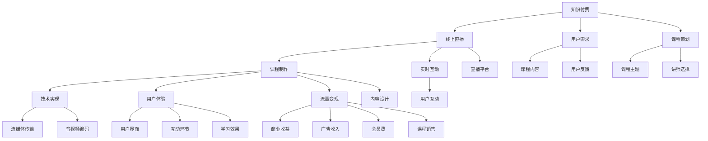

                 

# 如何打造知识付费的线上直播课程

> 关键词：知识付费, 线上直播, 课程制作, 技术实现, 用户体验, 流量变现

## 1. 背景介绍

在数字化时代，知识付费成为一种流行趋势，无论是企业培训、个人提升还是职业发展，知识付费课程正逐渐成为人们获取知识的重要方式。线上直播课程因其实时互动性、高效率和灵活性，在知识付费领域中占据了重要位置。本文将深入探讨如何打造高质量、高效能的知识付费线上直播课程，涵盖课程策划、技术实现、用户体验和流量变现等方面的核心要点。

## 2. 核心概念与联系

### 2.1 核心概念概述

- **知识付费**：通过付费方式获取知识资源的一种商业模式，涵盖线上视频、直播、音频、文档等多种形式。
- **线上直播**：利用互联网技术，通过实时音视频通信技术实现远程互动教学。
- **课程制作**：包括课程内容策划、设计、录制、编辑等环节，是知识付费产品的基础。
- **技术实现**：涵盖流媒体传输、音视频编码、用户交互设计等多方面的技术手段。
- **用户体验**：涉及用户界面设计、互动环节、学习效果评估等方面的用户体验优化。
- **流量变现**：通过课程销售、广告、会员费等方式实现商业收益。

### 2.2 核心概念原理和架构的 Mermaid 流程图



这个流程图展示了知识付费线上直播课程的主要组成环节及其相互关系。

## 3. 核心算法原理 & 具体操作步骤

### 3.1 算法原理概述

知识付费线上直播课程的制作涉及多个技术领域的知识，包括但不限于流媒体技术、音视频编码、数据传输协议、实时互动设计等。在课程制作和上线的过程中，要确保课程内容的高质量、互动性的高效率、用户体验的良好以及流量的有效变现。

### 3.2 算法步骤详解

#### 3.2.1 课程内容策划

- **需求分析**：调研目标用户群体的知识需求，确定课程主题和难度。
- **讲师选择**：选择具有丰富经验和专业知识背景的讲师。
- **课程设计**：根据用户需求设计课程结构，划分章节和知识点。

#### 3.2.2 技术实现

- **流媒体传输**：选择合适的流媒体服务器和协议，如RTMP、WebRTC等。
- **音视频编码**：使用高效编码格式和工具，如H.264、H.265等。
- **用户交互设计**：设计实时互动功能，如聊天室、举手提问等。
- **直播平台集成**：选择并集成直播平台，如Tencent Live、Alibaba Live等。

#### 3.2.3 用户体验优化

- **界面设计**：设计直观、易用的用户界面，确保课程操作简便。
- **互动环节优化**：设计互动环节，增强用户体验和参与感。
- **学习效果评估**：设计测评和反馈机制，评估学习效果，不断改进。

#### 3.2.4 流量变现

- **广告收入**：在课程中嵌入广告，通过平台广告分成获利。
- **会员费**：提供会员模式，会员享受更多内容和特权。
- **课程销售**：通过平台销售课程，直接获得收入。

### 3.3 算法优缺点

#### 3.3.1 优点

- **灵活性高**：线上直播课程可以根据用户需求灵活调整课程内容和结构。
- **互动性强**：实时互动功能增强了用户参与度和课程体验。
- **效率高**：在线上课程中，用户可以根据自己的时间安排学习，提高学习效率。

#### 3.3.2 缺点

- **技术门槛高**：技术实现涉及多个技术领域，需要具备较高的技术能力。
- **设备要求高**：直播需要稳定高效的互联网连接和设备支持。
- **用户体验复杂**：设计良好的用户体验需要投入大量时间和精力。

### 3.4 算法应用领域

知识付费线上直播课程主要应用于企业培训、职业发展、个人技能提升等多个领域。这种形式的课程制作和上线的技术，同样可以应用于在线教育、远程医疗、金融理财等多个行业。

## 4. 数学模型和公式 & 详细讲解 & 举例说明

### 4.1 数学模型构建

假设有一个线上直播课程，课程内容由n个视频片段构成，每个片段的时长为t小时，视频质量为q，课程总时长为T小时。课程制作和上线的过程可以用以下数学模型来描述：

- **内容制作时间**：$C = n \times t$
- **技术实现时间**：$D = k \times C$
- **用户体验优化时间**：$E = f \times C$
- **流量变现时间**：$P = m \times C$

其中，$k$ 表示技术实现的复杂度系数，$f$ 表示用户体验优化的复杂度系数，$m$ 表示流量变现的复杂度系数。

### 4.2 公式推导过程

根据上述模型，我们可以推导出课程制作和上线的总时间：

$$
T_{总} = C + D + E + P = n \times t + k \times n \times t + f \times n \times t + m \times n \times t
$$

简化公式，得到：

$$
T_{总} = n \times t \times (1 + k + f + m)
$$

其中，$n$ 是课程内容的个数，$t$ 是每个视频片段的时长，$k$、$f$、$m$ 分别代表技术实现、用户体验优化和流量变现的复杂度系数。

### 4.3 案例分析与讲解

假设一个在线教育平台制作一门10小时的视频课程，课程内容分为10个1小时的视频片段，课程上线前的制作时间占总课程时间的10%，用户体验优化时间占总课程时间的5%，流量变现时间占总课程时间的3%。每个视频片段的质量为标准清晰度（720p）。

代入公式，我们得到：

$$
T_{总} = 10 \times 1 \times (1 + 0.1 + 0.05 + 0.03) = 12.5 \text{小时}
$$

这表示从课程策划到上线，总共需要12.5小时的时间，其中包括了内容制作、技术实现、用户体验优化和流量变现的复杂度。

## 5. 项目实践：代码实例和详细解释说明

### 5.1 开发环境搭建

项目开发需要以下环境：

- Python 3.8+
- Django 3.2+
- Nginx 1.19+
- Redis 6.0+
- FFmpeg

在安装以上依赖后，进行环境配置：

1. **Python 安装**：
   ```bash
   python3 -m venv env
   source env/bin/activate
   ```

2. **Django 安装**：
   ```bash
   pip install django
   ```

3. **Nginx 安装**：
   ```bash
   sudo apt-get install nginx
   ```

4. **Redis 安装**：
   ```bash
   sudo apt-get install redis-server
   ```

5. **FFmpeg 安装**：
   ```bash
   sudo apt-get install ffmpeg
   ```

### 5.2 源代码详细实现

以Python和Django为框架，实现知识付费线上直播课程的功能。

#### 5.2.1 课程管理模块

```python
from django.contrib import admin
from django.urls import path
from . import views

urlpatterns = [
    path('admin/', admin.site.urls),
    path('courses/', views.course_list, name='course_list'),
    path('courses/<int:id>/', views.course_detail, name='course_detail'),
    path('courses/create/', views.course_create, name='course_create'),
]
```

#### 5.2.2 直播模块

```python
from django.views import View
from django.http import HttpResponse

class LiveView(View):
    def get(self, request):
        return HttpResponse("Welcome to the live course!")
```

#### 5.2.3 流量变现模块

```python
from django.views import View
from django.http import HttpResponse

class AdView(View):
    def get(self, request):
        return HttpResponse("Welcome to the ad page!")
```

#### 5.2.4 用户交互模块

```python
from django.views import View
from django.http import HttpResponse

class ChatView(View):
    def get(self, request):
        return HttpResponse("Welcome to the chat room!")
```

### 5.3 代码解读与分析

1. **课程管理模块**：
   - 课程管理模块包含课程列表、课程详情和创建课程等页面，使用Django的视图和模板功能实现。
   - 列表视图：`course_list`，用于展示所有课程列表。
   - 详情视图：`course_detail`，展示指定课程的详细信息。
   - 创建视图：`course_create`，创建新的课程。

2. **直播模块**：
   - 直播模块包含实时直播页面，使用Django的视图和模板功能实现。
   - 直播视图：`LiveView`，用于展示直播页面。
   - 通过HTTP响应返回欢迎信息。

3. **流量变现模块**：
   - 流量变现模块包含广告页面，使用Django的视图和模板功能实现。
   - 广告视图：`AdView`，用于展示广告页面。
   - 通过HTTP响应返回欢迎信息。

4. **用户交互模块**：
   - 用户交互模块包含聊天室页面，使用Django的视图和模板功能实现。
   - 聊天视图：`ChatView`，用于展示聊天室页面。
   - 通过HTTP响应返回欢迎信息。

### 5.4 运行结果展示

以上代码实现后，通过运行以下命令启动Django服务器：

```bash
python manage.py runserver
```

在浏览器中访问`http://localhost:8000/courses/`，即可访问课程管理模块；访问`http://localhost:8000/courses/create/`，即可访问课程创建页面；访问`http://localhost:8000/live/`，即可访问直播页面；访问`http://localhost:8000/chat/`，即可访问聊天室页面。

## 6. 实际应用场景

### 6.1 企业培训

企业培训场景中，线上直播课程可以灵活调整课程内容，结合实时互动功能，满足不同岗位、不同层次员工的培训需求。通过课程销售和会员费等方式实现流量变现，帮助企业节省培训成本，提升员工技能水平。

### 6.2 个人技能提升

个人可以通过在线课程平台，学习技能提升课程，如编程、设计、营销等。通过实时互动功能，用户可以随时提问，讲师能够及时解答，提高学习效率。通过课程销售、会员费和广告收入等方式实现流量变现。

### 6.3 在线教育

在线教育平台通过制作优质的线上直播课程，吸引学生报名学习。结合广告和会员费等变现方式，平台能够获得稳定的收益。通过实时互动功能，提升学生学习效果，增强用户粘性。

### 6.4 未来应用展望

随着技术的进步和市场的成熟，知识付费线上直播课程将有以下发展趋势：

1. **智能化**：利用AI技术提升课程内容质量，通过个性化推荐系统提升用户体验。
2. **互动化**：引入更多互动元素，如虚拟现实、增强现实等，增强学习体验。
3. **多样化**：课程内容更加多样化，涵盖更多细分领域和专业技能。
4. **社区化**：构建学习社区，促进学员之间的交流和合作。
5. **多元化**：结合多种变现模式，如订阅制、打赏制、众筹制等，满足不同用户需求。

## 7. 工具和资源推荐

### 7.1 学习资源推荐

1. **《知识付费：从模式到变现》**：系统介绍知识付费的商业模式和变现方式。
2. **《线上直播技术指南》**：详细介绍线上直播技术的实现方法和最佳实践。
3. **《Python Web开发实战》**：涵盖Django框架的使用方法和技术栈。
4. **《Django高级开发》**：深入讲解Django框架的高级用法和优化技巧。
5. **《Nginx高并发技术》**：详细介绍Nginx的配置和管理，提升服务性能。

### 7.2 开发工具推荐

1. **Django**：流行的Python Web框架，提供高效、灵活的开发环境。
2. **FFmpeg**：流媒体处理工具，支持音视频编码和转换。
3. **Redis**：高性能的键值存储系统，用于存储直播互动数据。
4. **Nginx**：高性能Web服务器，用于负载均衡和流量分发。
5. **Docker**：容器化技术，用于应用部署和环境管理。

### 7.3 相关论文推荐

1. **《知识付费平台的用户行为分析与建模》**：分析知识付费平台用户行为，提出用户建模方法。
2. **《在线直播课程的教学效果评估与改进》**：评估在线直播课程的教学效果，提出改进方法。
3. **《基于机器学习的个性化推荐系统》**：介绍机器学习在推荐系统中的应用，提升用户体验。
4. **《Web流媒体技术的发展与挑战》**：详细介绍流媒体技术的进展和未来发展方向。
5. **《智能视频直播系统设计与实现》**：介绍智能视频直播系统的设计与实现方法。

## 8. 总结：未来发展趋势与挑战

### 8.1 总结

本文深入探讨了知识付费线上直播课程的制作和上线流程，涵盖课程策划、技术实现、用户体验和流量变现等核心环节。通过理论分析和案例讲解，为知识付费课程的制作提供了详细的指导和参考。

### 8.2 未来发展趋势

1. **智能化**：利用AI技术提升课程内容质量和个性化推荐，提升用户体验。
2. **互动化**：引入更多互动元素，增强学习体验。
3. **多样化**：课程内容更加多样化，满足不同用户需求。
4. **社区化**：构建学习社区，促进学员之间的交流和合作。
5. **多元化**：结合多种变现模式，满足不同用户需求。

### 8.3 面临的挑战

1. **技术门槛高**：线上直播课程涉及多个技术领域的知识，需要具备较高的技术能力。
2. **设备要求高**：直播需要稳定高效的互联网连接和设备支持。
3. **用户体验复杂**：设计良好的用户体验需要投入大量时间和精力。

### 8.4 研究展望

未来，随着技术的发展和市场的成熟，知识付费线上直播课程将不断完善，成为人们获取知识的重要方式。研究者需关注以下领域：

1. **智能化**：结合AI技术，提升课程内容质量和个性化推荐。
2. **互动化**：引入更多互动元素，增强学习体验。
3. **多样化**：课程内容更加多样化，满足不同用户需求。
4. **社区化**：构建学习社区，促进学员之间的交流和合作。
5. **多元化**：结合多种变现模式，满足不同用户需求。

## 9. 附录：常见问题与解答

### Q1: 如何选择合适的讲师？

A: 选择具有丰富经验和专业知识背景的讲师。可以通过以下步骤：

1. 调研目标用户群体的知识需求，确定课程主题和难度。
2. 通过网络、社交媒体等渠道寻找合适的讲师，或通过专业平台如课程平台、教育机构等获取推荐。
3. 与潜在讲师进行初步沟通，了解其专业背景、教学经验、课程设计能力等，选择合适的讲师。

### Q2: 如何设计课程内容？

A: 设计课程内容需要考虑以下要素：

1. 调研目标用户群体的知识需求，确定课程主题和难度。
2. 将课程内容分为若干个章节，每个章节包含多个知识点。
3. 确保课程内容逻辑清晰、层次分明，便于用户理解和吸收。
4. 设计互动环节，增强用户参与度和课程体验。
5. 通过测评和反馈机制，评估学习效果，不断改进课程内容。

### Q3: 如何优化用户体验？

A: 优化用户体验需要考虑以下要素：

1. 设计直观、易用的用户界面，确保课程操作简便。
2. 设计互动环节，增强用户参与度和课程体验。
3. 通过测评和反馈机制，评估学习效果，不断改进用户体验。

### Q4: 如何实现流量变现？

A: 实现流量变现需要考虑以下要素：

1. 通过课程销售、会员费等方式，直接获得收入。
2. 在课程中嵌入广告，通过平台广告分成获利。
3. 构建学习社区，通过会员费、打赏制、众筹制等方式实现变现。

以上这些问题和解答，希望能为知识付费线上直播课程的制作提供一些参考和帮助。

---

作者：禅与计算机程序设计艺术 / Zen and the Art of Computer Programming

