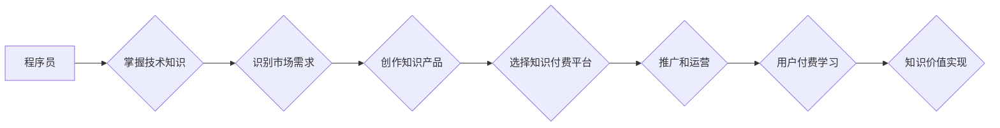

                 

## 程序员转型知识付费领域的成功案例

> 关键词：程序员、知识付费、转型、技术博客、在线课程、内容创作、社区运营、商业模式

### 1. 背景介绍

近年来，随着互联网技术的快速发展和知识经济的兴起，知识付费行业蓬勃发展，成为一个炙手可热的领域。程序员作为技术人才，拥有丰富的专业知识和技能，具备成为知识付费领域的优质创作者的先天优势。然而，程序员转型知识付费并非易事，需要克服诸多挑战，并掌握相应的技巧和策略。

### 2. 核心概念与联系

**2.1 知识付费的核心概念**

知识付费是指以知识、技能、经验等为核心内容，通过线上或线下平台向用户提供付费学习服务的商业模式。其本质是将知识和技能的价值转化为经济价值，实现知识的流通和共享。

**2.2 程序员与知识付费的联系**

程序员拥有扎实的技术基础和实践经验，能够将复杂的技术概念转化为易于理解的知识内容。他们对技术领域有深入的理解，能够洞察市场需求，创作出具有价值和实用性的知识产品。

**2.3 知识付费的商业模式**

知识付费的商业模式主要包括：

* **在线课程:** 通过视频、音频、文档等形式，提供系统化的技术培训课程。
* **付费博客:** 通过博客平台发布高质量的技术文章，并提供付费订阅服务。
* **技术咨询:** 为用户提供一对一的技术咨询服务，解决他们的技术难题。
* **开源项目:** 开发开源项目，并提供付费支持服务。

**2.4 Mermaid 流程图**



### 3. 核心算法原理 & 具体操作步骤

**3.1 算法原理概述**

知识付费的成功关键在于算法原理的应用，包括内容推荐算法、用户画像算法、学习效果评估算法等。这些算法能够帮助平台精准推荐用户感兴趣的内容，打造个性化的学习体验，并评估学习效果，不断优化内容和服务。

**3.2 算法步骤详解**

* **内容推荐算法:** 基于用户浏览历史、学习偏好、评分等数据，推荐相关且有价值的内容。常用的算法包括协同过滤、内容过滤、混合推荐等。
* **用户画像算法:** 通过分析用户行为数据，构建用户画像，包括用户兴趣、学习习惯、知识水平等，为个性化推荐提供依据。
* **学习效果评估算法:** 通过用户学习进度、知识掌握情况、反馈评价等数据，评估学习效果，并提供个性化的学习建议。

**3.3 算法优缺点**

* **优点:** 能够提高用户体验，提升学习效率，促进知识付费平台的商业化发展。
* **缺点:** 需要大量的数据支持，算法模型的训练和优化需要专业技术，存在算法偏差和数据安全等问题。

**3.4 算法应用领域**

* **在线教育平台:** 推荐课程、学习资源、学习计划等。
* **知识付费平台:** 推荐付费课程、付费博客、付费咨询等。
* **社交媒体平台:** 推荐相关内容、兴趣小组、学习社群等。

### 4. 数学模型和公式 & 详细讲解 & 举例说明

**4.1 数学模型构建**

知识付费平台的推荐算法通常基于协同过滤模型，其核心思想是根据用户的行为相似性，推荐用户可能感兴趣的内容。

**4.2 公式推导过程**

协同过滤模型的评分预测公式如下：

$$
\hat{r}_{u,i} = \bar{r}_u + \frac{\sum_{j \in N(u)} (r_{u,j} - \bar{r}_u) \cdot (r_{j,i} - \bar{r}_j)}{\sum_{j \in N(u)} (r_{u,j} - \bar{r}_u)^2}
$$

其中：

* $\hat{r}_{u,i}$: 用户 $u$ 对物品 $i$ 的预测评分
* $\bar{r}_u$: 用户 $u$ 的平均评分
* $r_{u,j}$: 用户 $u$ 对物品 $j$ 的实际评分
* $r_{j,i}$: 用户 $j$ 对物品 $i$ 的实际评分
* $N(u)$: 与用户 $u$ 具有相似行为的用户集合

**4.3 案例分析与讲解**

假设用户 $A$ 和用户 $B$ 都对电影 $X$ 和电影 $Y$ 进行了评分，用户 $A$ 对电影 $X$ 的评分为 5 分，对电影 $Y$ 的评分为 3 分；用户 $B$ 对电影 $X$ 的评分为 4 分，对电影 $Y$ 的评分为 5 分。

根据公式，我们可以预测用户 $A$ 对电影 $Z$ 的评分，如果用户 $B$ 对电影 $Z$ 的评分为 4 分。

### 5. 项目实践：代码实例和详细解释说明

**5.1 开发环境搭建**

* Python 3.x
* Flask 或 Django 框架
* 数据库 (例如 MySQL 或 PostgreSQL)
* 前端框架 (例如 React 或 Vue.js)

**5.2 源代码详细实现**

```python
from flask import Flask, request, jsonify

app = Flask(__name__)

# 模拟用户数据
users = {
    1: {'name': 'Alice', 'ratings': [{'movie': 'X', 'score': 5}, {'movie': 'Y', 'score': 3}]},
    2: {'name': 'Bob', 'ratings': [{'movie': 'X', 'score': 4}, {'movie': 'Y', 'score': 5}]}
}

@app.route('/predict', methods=['POST'])
def predict():
    data = request.get_json()
    user_id = data['user_id']
    movie_id = data['movie_id']

    # 根据用户数据和算法模型预测评分
    # ...

    return jsonify({'prediction': predicted_score})

if __name__ == '__main__':
    app.run(debug=True)
```

**5.3 代码解读与分析**

* 该代码示例使用 Flask 框架构建了一个简单的知识付费平台 API。
* `/predict` 路由接收用户请求，获取用户 ID 和电影 ID。
* 根据用户数据和算法模型，预测用户对电影的评分。
* 返回预测评分作为 JSON 格式的响应。

**5.4 运行结果展示**

当用户向 API 发送请求，例如：

```json
{
  "user_id": 1,
  "movie_id": "Z"
}
```

API 将返回预测评分，例如：

```json
{
  "prediction": 4.2
}
```

### 6. 实际应用场景

**6.1 在线课程平台**

* 推荐课程、学习资源、学习计划等，提高用户学习效率。
* 个性化学习路径，根据用户学习进度和知识掌握情况，提供定制化的学习方案。

**6.2 技术博客平台**

* 推荐相关技术文章、博客作者、技术社区等，帮助用户发现感兴趣的内容。
* 根据用户阅读历史和点赞记录，推荐个性化的技术文章。

**6.3 技术咨询平台**

* 推荐合适的技术专家，根据用户问题和技术需求，匹配合适的咨询服务。
* 根据用户咨询历史和专家评价，推荐优质的咨询服务。

**6.4 未来应用展望**

* 人工智能技术的不断发展，将进一步提升知识付费平台的推荐算法精度和个性化程度。
* 虚拟现实、增强现实等新技术将为知识付费提供更沉浸式的学习体验。
* 知识付费将与其他行业融合，例如医疗、金融、教育等，为用户提供更全面的知识服务。

### 7. 工具和资源推荐

**7.1 学习资源推荐**

* **在线课程平台:** Coursera, edX, Udemy
* **技术博客平台:** Medium, Dev.to, Hacker News
* **开源项目平台:** GitHub, GitLab

**7.2 开发工具推荐**

* **Python 框架:** Flask, Django
* **数据库:** MySQL, PostgreSQL
* **前端框架:** React, Vue.js

**7.3 相关论文推荐**

* **协同过滤算法:** "Collaborative Filtering: A User-Based Approach" by Goldberg et al. (1992)
* **内容推荐算法:** "Content-Based Recommendation Systems" by Ricci et al. (2011)
* **深度学习推荐算法:** "Deep Learning for Recommender Systems" by Wang-Cheng Kang et al. (2018)

### 8. 总结：未来发展趋势与挑战

**8.1 研究成果总结**

程序员转型知识付费领域取得了显著成果，涌现出一批优秀的知识创作者和平台。

**8.2 未来发展趋势**

* **人工智能技术应用:** 更智能、更精准的推荐算法，个性化学习体验。
* **新技术融合:** 虚拟现实、增强现实等新技术应用，提升学习体验。
* **跨界融合:** 知识付费与其他行业融合，提供更全面的知识服务。

**8.3 面临的挑战**

* **内容质量保证:** 确保知识产品质量，避免低质量内容泛滥。
* **用户信任建立:** 提升平台用户信任度，解决知识付费的信任问题。
* **商业模式创新:** 探索新的商业模式，实现知识付费的可持续发展。

**8.4 研究展望**

* **个性化学习路径优化:** 基于用户行为和学习数据，构建更精准的个性化学习路径。
* **知识图谱构建:** 建立知识图谱，实现知识的深度关联和挖掘。
* **元宇宙学习环境:** 利用元宇宙技术构建沉浸式的学习环境，提升学习体验。

### 9. 附录：常见问题与解答

**9.1 如何选择合适的知识付费平台？**

* 考虑平台的用户群体、内容类型、收费模式等因素。
* 了解平台的运营状况、用户评价等信息。

**9.2 如何创作高质量的知识付费内容？**

* 深入了解目标用户需求，提供有价值、实用性的内容。
* 采用清晰、简洁的语言，注重内容结构和逻辑。
* 使用多媒体元素，提升内容的吸引力和趣味性。

**9.3 如何推广和运营知识付费产品？**

* 利用社交媒体、博客、论坛等平台进行推广。
* 与其他创作者合作，扩大影响力。
* 提供优质的客户服务，提升用户满意度。


作者：禅与计算机程序设计艺术 / Zen and the Art of Computer Programming 
<end_of_turn>

