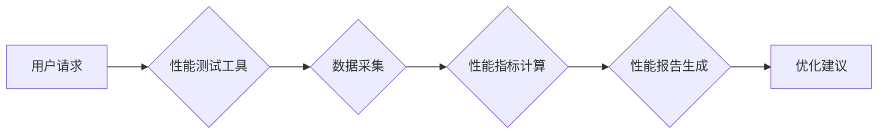

                 

## 第十三章：评估和衡量性能

> 关键词：性能评估，性能指标，基准测试，吞吐量，延迟，资源利用率，负载测试，性能优化

### 1. 背景介绍

在软件开发的世界里，性能始终是至关重要的考量因素。一款软件的性能直接影响着用户体验、业务效率和系统稳定性。然而，性能是一个多维且复杂的概念，它涵盖了速度、响应时间、资源利用率等多个方面。因此，如何有效地评估和衡量软件性能，并根据评估结果进行优化，是软件开发过程中不可或缺的一部分。

随着软件系统越来越复杂，性能评估也变得更加困难。传统的性能测试方法往往难以应对现代软件系统的复杂性和动态性。因此，我们需要探索更先进的性能评估方法和工具，以更好地理解和优化软件性能。

### 2. 核心概念与联系

性能评估的核心在于识别和量化软件系统在特定条件下的表现。 

**性能指标**是用来衡量软件性能的关键要素。常见的性能指标包括：

* **吞吐量 (Throughput):** 指系统在单位时间内处理的请求数量。
* **延迟 (Latency):** 指从用户发出请求到系统返回响应所花费的时间。
* **资源利用率 (Resource Utilization):** 指系统 CPU、内存、磁盘等资源的使用率。
* **错误率 (Error Rate):** 指系统在处理请求过程中发生的错误数量。

这些指标相互关联，共同构成了软件性能的整体表现。

**Mermaid 流程图：**



### 3. 核心算法原理 & 具体操作步骤

#### 3.1  算法原理概述

性能评估算法通常基于统计学原理，通过收集和分析系统运行数据，来计算和评估性能指标。常见的性能评估算法包括：

* **时间复杂度分析:** 用于分析算法执行时间随输入规模变化的规律。
* **空间复杂度分析:** 用于分析算法执行过程中所需的内存空间。
* **负载测试:** 通过模拟大量用户请求，来评估系统在高负载下的性能表现。
* **压力测试:** 通过不断增加请求负载，来测试系统在极限条件下的稳定性和容错能力。

#### 3.2  算法步骤详解

1. **定义性能目标:** 首先需要明确软件系统的性能目标，例如吞吐量、延迟、资源利用率等。
2. **选择性能指标:** 根据性能目标，选择合适的性能指标进行评估。
3. **设计测试用例:** 设计模拟真实用户行为的测试用例，以覆盖软件系统的关键功能和场景。
4. **执行性能测试:** 使用性能测试工具执行测试用例，收集系统运行数据。
5. **分析测试结果:** 分析收集到的数据，计算性能指标，并生成性能报告。
6. **优化软件性能:** 根据性能报告中的分析结果，对软件进行优化，以提高性能表现。

#### 3.3  算法优缺点

* **优点:** 性能评估算法能够提供量化的性能数据，帮助开发人员了解软件系统的性能表现，并针对性地进行优化。
* **缺点:** 性能评估算法的准确性依赖于测试用例的质量和测试环境的真实性。

#### 3.4  算法应用领域

性能评估算法广泛应用于各种软件开发领域，例如：

* **Web 应用开发:** 评估网站的响应速度、吞吐量和资源利用率。
* **移动应用开发:** 评估移动应用的启动速度、运行流畅度和电池寿命。
* **游戏开发:** 评估游戏帧率、延迟和资源占用。
* **数据库开发:** 评估数据库的查询速度、并发性能和数据存储效率。

### 4. 数学模型和公式 & 详细讲解 & 举例说明

#### 4.1  数学模型构建

性能评估模型通常基于数学模型，将性能指标与系统运行数据建立联系。例如，吞吐量可以表示为：

$$Throughput = \frac{Number of Requests}{Time}$$

其中，Number of Requests 表示系统在特定时间内处理的请求数量，Time 表示该时间段。

#### 4.2  公式推导过程

性能指标的计算公式通常基于统计学原理，例如平均值、标准差、百分位数等。例如，延迟的平均值可以表示为：

$$Average Latency = \frac{\sum_{i=1}^{n} Latency_i}{n}$$

其中，Latency_i 表示第 i 个请求的延迟时间，n 表示请求总数。

#### 4.3  案例分析与讲解

假设我们对一个网站的性能进行评估，收集了 100 个用户请求的延迟时间数据，平均延迟时间为 200 毫秒，标准差为 50 毫秒。

我们可以得出以下结论：

* 90% 的用户请求延迟时间在 150 毫秒到 250 毫秒之间。
* 网站的延迟时间相对稳定，标准差较小。

### 5. 项目实践：代码实例和详细解释说明

#### 5.1  开发环境搭建

为了进行性能评估，我们需要搭建一个合适的开发环境。

* **操作系统:** Linux 或 macOS
* **编程语言:** Python 或 Java
* **性能测试工具:** JMeter 或 Locust

#### 5.2  源代码详细实现

以下是一个使用 Python 和 Locust 进行性能测试的简单代码示例：

```python
from locust import HttpUser, task, between

class WebsiteUser(HttpUser):
    wait_time = between(1, 2)

    @task
    def index_page(self):
        self.client.get("/")
```

#### 5.3  代码解读与分析

* `HttpUser` 类定义了用户行为。
* `wait_time` 属性设置了用户之间发送请求的等待时间。
* `@task` 装饰器定义了用户执行的任务。
* `index_page` 方法模拟用户访问网站首页的行为。

#### 5.4  运行结果展示

运行上述代码后，Locust 会模拟大量用户访问网站，并收集性能数据，例如吞吐量、延迟、错误率等。

### 6. 实际应用场景

性能评估在软件开发的各个阶段都扮演着重要的角色。

* **需求分析阶段:** 通过性能评估，可以帮助开发人员了解用户对性能的要求，并将其纳入软件设计。
* **设计阶段:** 通过性能评估，可以帮助开发人员选择合适的架构和技术方案，以满足性能目标。
* **开发阶段:** 通过性能评估，可以帮助开发人员及时发现性能问题，并进行优化。
* **测试阶段:** 通过性能评估，可以确保软件在不同负载条件下都能稳定运行。
* **部署阶段:** 通过性能评估，可以帮助开发人员选择合适的服务器配置，以保证软件的性能表现。

### 7. 工具和资源推荐

#### 7.1  学习资源推荐

* **书籍:** 《性能测试与优化》
* **网站:** https://www.locust.io/

#### 7.2  开发工具推荐

* **JMeter:** https://jmeter.apache.org/
* **Locust:** https://locust.io/
* **Gatling:** https://gatling.io/

#### 7.3  相关论文推荐

* **"Performance Evaluation of Web Applications"**
* **"A Survey of Performance Testing Tools"**

### 8. 总结：未来发展趋势与挑战

#### 8.1  研究成果总结

性能评估技术近年来取得了显著进展，出现了许多新的性能测试工具和方法。

#### 8.2  未来发展趋势

* **人工智能驱动的性能评估:** 利用人工智能技术自动分析性能数据，并提供更精准的性能优化建议。
* **云原生性能评估:** 针对云原生应用的特点，开发新的性能评估方法和工具。
* **微服务性能评估:** 针对微服务架构的特点，开发新的性能评估方法和工具。

#### 8.3  面临的挑战

* **复杂系统性能评估:** 随着软件系统越来越复杂，性能评估变得更加困难。
* **动态环境性能评估:** 软件系统运行环境不断变化，需要开发更灵活的性能评估方法。
* **性能数据分析:** 如何有效地分析和解读性能数据，并将其转化为可操作的优化建议，仍然是一个挑战。

#### 8.4  研究展望

未来，性能评估技术将继续朝着更智能、更自动化、更精准的方向发展。

### 9. 附录：常见问题与解答

* **如何选择合适的性能测试工具？**

选择性能测试工具需要根据具体的项目需求和环境进行考虑。

* **如何设计有效的性能测试用例？**

性能测试用例需要覆盖软件系统的关键功能和场景，并模拟真实用户行为。

* **如何解读性能测试结果？**

需要结合实际业务需求和系统性能目标，分析性能指标的变化趋势，并找出性能瓶颈。


作者：禅与计算机程序设计艺术 / Zen and the Art of Computer Programming 
<end_of_turn>

