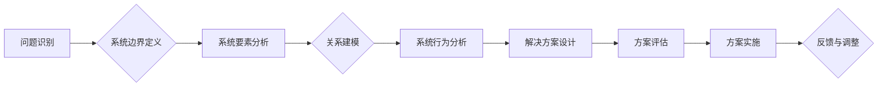

                 

## 系统思维:管理者驾驭复杂局面的能力

> 关键词：系统思维、复杂系统、架构设计、决策制定、问题解决、系统分析、系统优化、迭代发展

## 1. 背景介绍

在当今瞬息万变的科技时代，面对日益复杂的业务环境和技术挑战，传统的线性思维模式已不足以应对。管理者需要具备更强大的认知能力，能够洞悉系统整体，理解各个部分之间的相互关联，并做出明智的决策。系统思维，作为一种全新的思维方式，正逐渐成为管理者驾驭复杂局面的关键能力。

系统思维的核心在于将问题看作是一个整体，而不是孤立的个体。它强调系统内部各个要素之间的相互作用和反馈，以及系统整体的 emergent behavior（涌现行为）。通过系统思维，管理者可以更全面地理解问题，识别关键因素，并制定更有效的解决方案。

## 2. 核心概念与联系

### 2.1 系统的概念

系统是一个由相互关联的部件组成的整体，这些部件共同协作以实现某个共同目标。系统可以是物理的，也可以是抽象的。例如，一个计算机系统由硬件、软件、数据等部件组成，而一个组织系统则由人员、流程、文化等要素构成。

### 2.2 系统的特性

* **整体性:** 系统的整体性质大于其组成部分的简单总和。系统内部各个部件相互作用，产生新的属性和行为，这些属性和行为无法通过单独分析各个部件来理解。
* **相互依赖性:** 系统的各个部件相互依赖，彼此影响。一个部件的变化会对整个系统产生连锁反应。
* **反馈机制:** 系统内部存在反馈机制，通过反馈机制，系统可以调节自身状态，实现自适应和自我组织。
* **边界:** 系统具有边界，与外部环境隔离开来。边界可以是物理的，也可以是抽象的。

### 2.3 系统思维的应用

系统思维可以应用于各种领域，例如：

* **企业管理:** 帮助企业更好地理解业务流程、组织结构、市场环境等复杂系统，并制定更有效的战略和决策。
* **软件开发:** 帮助开发人员更好地理解软件系统的整体架构、各个模块之间的关系，并设计更健壮、可维护的软件系统。
* **城市规划:** 帮助城市规划者更好地理解城市系统，并制定更合理的城市发展规划。
* **环境保护:** 帮助科学家更好地理解生态系统，并制定更有效的环境保护策略。

**系统思维流程图**



## 3. 核心算法原理 & 具体操作步骤

### 3.1 算法原理概述

系统思维的核心算法原理是基于系统分析和建模，通过识别系统要素、分析其相互关系和反馈机制，最终实现对系统整体行为的理解和预测。

### 3.2 算法步骤详解

1. **问题识别:** 明确需要解决的问题，并将其定义为一个系统。
2. **系统边界定义:** 确定系统的边界，即系统与外部环境的分界线。
3. **系统要素分析:** 识别系统内部的各个要素，并分析其属性、功能和相互作用。
4. **关系建模:** 建立系统要素之间的关系模型，例如因果关系、依赖关系、竞争关系等。
5. **系统行为分析:** 分析系统整体的行为模式，例如稳定性、可预测性、适应性等。
6. **解决方案设计:** 基于对系统行为的理解，设计解决方案，并评估其对系统的影响。
7. **方案实施:** 将解决方案实施到系统中，并进行监控和评估。
8. **反馈与调整:** 收集反馈信息，并根据反馈信息调整解决方案，以实现最佳效果。

### 3.3 算法优缺点

**优点:**

* **全面性:** 系统思维能够帮助我们全面地理解问题，而不是局限于局部。
* **洞察力:** 系统思维能够帮助我们识别关键因素和潜在风险，并做出更明智的决策。
* **创新性:** 系统思维能够激发我们的创造力，帮助我们找到新的解决方案。

**缺点:**

* **复杂性:** 系统思维需要我们对复杂系统进行深入分析，这需要一定的知识和经验。
* **时间成本:** 系统思维需要花费较多的时间和精力，尤其是在面对大型复杂系统时。
* **主观性:** 系统思维有一定的主观性，不同的分析者可能会得出不同的结论。

### 3.4 算法应用领域

系统思维的应用领域非常广泛，例如：

* **企业管理:** 战略规划、组织设计、流程优化、风险管理等。
* **软件开发:** 系统架构设计、软件测试、项目管理等。
* **城市规划:** 交通规划、环境保护、资源管理等。
* **教育:** 教学设计、学生评估、学校管理等。

## 4. 数学模型和公式 & 详细讲解 & 举例说明

### 4.1 数学模型构建

系统思维可以借助数学模型来描述和分析复杂系统。常见的数学模型包括：

* **差分方程:** 用于描述系统随时间变化的行为。
* **微分方程:** 用于描述系统状态的瞬时变化。
* **图论:** 用于描述系统要素之间的关系。
* **网络理论:** 用于描述系统中信息和能量的流动。

### 4.2 公式推导过程

例如，我们可以使用差分方程来描述一个简单的系统，例如人口增长模型。假设人口增长率为r，则人口数量在时间t的增长可以表示为：

$$
P(t+1) = P(t) + rP(t)
$$

其中，P(t)表示时间t的人口数量。

### 4.3 案例分析与讲解

我们可以使用这个模型来预测人口数量随时间的变化趋势。例如，如果初始人口数量为1000，增长率为0.02，则我们可以计算出未来几年的人口数量。

## 5. 项目实践：代码实例和详细解释说明

### 5.1 开发环境搭建

为了演示系统思维的应用，我们可以使用Python语言开发一个简单的系统模拟项目。

* 安装Python环境
* 安装必要的库，例如NumPy、Matplotlib等

### 5.2 源代码详细实现

```python
import numpy as np
import matplotlib.pyplot as plt

# 人口增长模型
def population_growth(P0, r, t):
  """
  计算人口数量随时间变化的趋势。

  Args:
    P0: 初始人口数量。
    r: 人口增长率。
    t: 时间步长。

  Returns:
    人口数量随时间变化的列表。
  """
  P = [P0]
  for i in range(1, t + 1):
    P.append(P[-1] + r * P[-1])
  return P

# 设置参数
P0 = 1000
r = 0.02
t = 10

# 计算人口数量
population = population_growth(P0, r, t)

# 绘制图表
plt.plot(population)
plt.xlabel('时间步长')
plt.ylabel('人口数量')
plt.title('人口增长模型')
plt.show()
```

### 5.3 代码解读与分析

这段代码实现了人口增长模型，并使用Matplotlib库绘制了人口数量随时间变化的图表。

* `population_growth()`函数计算人口数量随时间变化的趋势。
* `P0`、`r`和`t`分别表示初始人口数量、人口增长率和时间步长。
* `population`列表存储了人口数量随时间变化的数值。
* `plt.plot()`函数绘制了人口数量随时间变化的曲线。

### 5.4 运行结果展示

运行这段代码后，会生成一个图表，显示人口数量随时间呈指数增长趋势。

## 6. 实际应用场景

系统思维在实际应用场景中具有广泛的应用价值。例如：

* **软件开发:** 通过系统思维，开发人员可以更好地理解软件系统的整体架构、各个模块之间的关系，并设计更健壮、可维护的软件系统。
* **城市规划:** 通过系统思维，城市规划者可以更好地理解城市系统，并制定更合理的城市发展规划。
* **环境保护:** 通过系统思维，科学家可以更好地理解生态系统，并制定更有效的环境保护策略。

### 6.4 未来应用展望

随着科技的不断发展，系统思维将发挥越来越重要的作用。例如：

* **人工智能:** 系统思维可以帮助人工智能系统更好地理解复杂环境，并做出更智能的决策。
* **物联网:** 系统思维可以帮助物联网系统更好地协同工作，并实现更智能的管理。
* **可持续发展:** 系统思维可以帮助我们更好地理解可持续发展问题，并制定更有效的解决方案。

## 7. 工具和资源推荐

### 7.1 学习资源推荐

* **书籍:**
    * 《系统思维》 - 约翰·塞尔曼
    * 《复杂系统》 - 迈克尔·艾德曼
    * 《系统思考》 - 弗兰克·埃斯波西托
* **在线课程:**
    * Coursera: Systems Thinking
    * edX: Systems Thinking for Complex Problems
    * Udemy: Systems Thinking for Business

### 7.2 开发工具推荐

* **UML工具:**
    * Lucidchart
    * Draw.io
    * Visio
* **流程建模工具:**
    * BPMN
    * ArchiMate
    * SysML

### 7.3 相关论文推荐

* **The Fifth Discipline: The Art and Practice of the Learning Organization** - Peter Senge
* **Thinking in Systems: A Primer** - Donella Meadows
* **Complexity: A Guided Tour** - Melanie Mitchell

## 8. 总结：未来发展趋势与挑战

### 8.1 研究成果总结

系统思维已经取得了显著的成果，并在各个领域得到了广泛应用。它帮助我们更好地理解复杂系统，并制定更有效的解决方案。

### 8.2 未来发展趋势

未来，系统思维的研究将更加深入，并与其他学科交叉融合，例如人工智能、数据科学、生物学等。

### 8.3 面临的挑战

系统思维的应用也面临一些挑战，例如：

* **复杂性:** 复杂系统的建模和分析仍然是一个难题。
* **数据获取:** 系统思维需要大量的数据支持，而获取高质量的数据仍然是一个挑战。
* **跨学科合作:** 系统思维的应用需要跨学科的合作，这需要克服学科壁垒。

### 8.4 研究展望

未来，我们需要继续探索新的系统思维方法和工具，并将其应用于更广泛的领域，以更好地应对复杂世界带来的挑战。

## 9. 附录：常见问题与解答

### 9.1 什么是系统思维？

系统思维是一种全新的思维方式，它强调系统整体性、相互依赖性和反馈机制。它帮助我们更好地理解复杂系统，并制定更有效的解决方案。

### 9.2 系统思维与线性思维有什么区别？

线性思维是一种传统的思维方式，它将问题看作是孤立的个体，而系统思维则将问题看作是一个整体。线性思维只能解决简单问题，而系统思维可以解决复杂问题。

### 9.3 如何学习系统思维？

可以通过阅读书籍、参加课程、参与实践项目等方式学习系统思维。

### 9.4 系统思维的应用领域有哪些？

系统思维的应用领域非常广泛，例如：企业管理、软件开发、城市规划、环境保护等。

### 9.5 系统思维的未来发展趋势是什么？

未来，系统思维的研究将更加深入，并与其他学科交叉融合，例如人工智能、数据科学、生物学等。


作者：禅与计算机程序设计艺术 / Zen and the Art of Computer Programming 
<end_of_turn>

