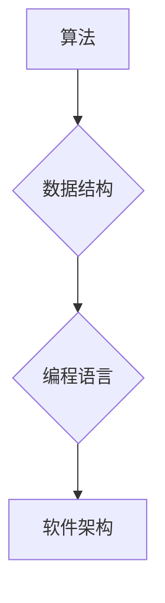

                 

## 经典书籍:夯实认知根基的宝藏

> 关键词：算法设计、数据结构、编程思维、软件架构、计算机科学基础、代码优化、复杂系统

### 1. 背景介绍

在瞬息万变的科技时代，计算机科学作为驱动创新和发展的核心力量，扮演着越来越重要的角色。无论是人工智能、云计算、大数据，还是区块链、物联网，都离不开扎实的计算机科学基础。然而，面对海量信息和日新月异的技术，许多人感到迷茫，不知道从何入手，如何夯实自己的认知根基。

本书旨在为读者提供一本通往计算机科学世界的指南，帮助他们理解核心概念、掌握关键算法，并培养敏锐的编程思维。它将以通俗易懂的语言，结合丰富的案例和代码实例，带领读者深入探索计算机科学的奥秘，并将其应用于实际项目开发。

### 2. 核心概念与联系

计算机科学的核心概念包括算法、数据结构、编程语言、软件架构等。这些概念相互关联，共同构成了计算机科学的框架。

**2.1 算法**

算法是解决特定问题的指令序列，是计算机科学的基础。它描述了如何将输入数据转化为输出结果的步骤。

**2.2 数据结构**

数据结构是用于组织和存储数据的特定方式。不同的数据结构具有不同的特点和适用场景，例如数组、链表、树、图等。

**2.3 编程语言**

编程语言是用于编写程序的符号系统。不同的编程语言具有不同的语法和语义，例如Python、Java、C++等。

**2.4 软件架构**

软件架构是指软件系统的整体结构和设计，包括组件、模块、接口等。良好的软件架构可以提高软件的可维护性、可扩展性和可靠性。

**2.5 Mermaid 流程图**



### 3. 核心算法原理 & 具体操作步骤

**3.1 算法原理概述**

本书将重点介绍一些经典的算法，例如排序算法、搜索算法、图算法等。这些算法是计算机科学的基石，广泛应用于各种领域。

**3.2 算法步骤详解**

* **排序算法**

  * **冒泡排序:** 比较相邻元素，如果顺序错误则交换位置，重复该过程直到整个数组有序。
  * **插入排序:** 将一个元素插入到已经排序的子数组中，重复该过程直到整个数组有序。
  * **快速排序:** 选择一个元素作为枢轴，将小于枢轴的元素放在左边，大于枢轴的元素放在右边，递归地对左右子数组进行排序。

* **搜索算法**

  * **线性搜索:** 从数组的第一个元素开始，逐个比较，直到找到目标元素或遍历完整个数组。
  * **二分搜索:** 在有序数组中，每次将搜索范围缩小一半，直到找到目标元素或搜索范围为空。

* **图算法**

  * **深度优先搜索 (DFS):** 从一个节点开始，沿着一条路径尽可能深入，直到无法继续，然后回溯到上一个节点，继续探索其他路径。
  * **广度优先搜索 (BFS):** 从一个节点开始，一层一层地探索所有相邻节点，直到找到目标节点。

**3.3 算法优缺点**

不同的算法具有不同的时间复杂度和空间复杂度。

* **时间复杂度:** 指的是算法执行时间与输入数据大小的增长关系。
* **空间复杂度:** 指的是算法执行过程中使用的内存空间大小与输入数据大小的增长关系。

**3.4 算法应用领域**

算法广泛应用于各个领域，例如：

* **人工智能:** 机器学习、深度学习、自然语言处理等。
* **数据科学:** 数据挖掘、数据分析、数据可视化等。
* **软件工程:** 代码优化、软件测试、软件维护等。
* **网络安全:** 病毒检测、入侵检测、网络流量分析等。

### 4. 数学模型和公式 & 详细讲解 & 举例说明

**4.1 数学模型构建**

许多算法可以用数学模型来描述，例如：

* **排序算法:** 可以用时间复杂度和空间复杂度来衡量算法的效率。
* **搜索算法:** 可以用查找成功率和查找时间来衡量算法的性能。
* **图算法:** 可以用图的度数、直径、连通性等指标来描述图的性质。

**4.2 公式推导过程**

例如，冒泡排序的时间复杂度可以推导如下：

* 最坏情况: $O(n^2)$
* 平均情况: $O(n^2)$
* 最好情况: $O(n)$

**4.3 案例分析与讲解**

例如，二分搜索算法的时间复杂度为 $O(log n)$，这意味着随着输入数据大小的增加，算法执行时间增长非常缓慢。

### 5. 项目实践：代码实例和详细解释说明

**5.1 开发环境搭建**

本书将使用Python语言进行编程，读者需要安装Python环境和相关库。

**5.2 源代码详细实现**

```python
# 冒泡排序算法
def bubble_sort(arr):
    n = len(arr)
    for i in range(n):
        for j in range(0, n-i-1):
            if arr[j] > arr[j+1]:
                arr[j], arr[j+1] = arr[j+1], arr[j]
    return arr

# 测试代码
arr = [64, 34, 25, 12, 22, 11, 90]
sorted_arr = bubble_sort(arr)
print("排序后的数组:", sorted_arr)
```

**5.3 代码解读与分析**

* `bubble_sort(arr)` 函数接受一个数组 `arr` 作为输入。
* 外层循环 `for i in range(n)` 迭代 `n` 次，其中 `n` 是数组的长度。
* 内层循环 `for j in range(0, n-i-1)` 比较相邻元素，如果顺序错误则交换位置。
* 每次内层循环结束后，最大的元素会“冒泡”到数组的末尾。
* 最后返回排序后的数组 `sorted_arr`。

**5.4 运行结果展示**

```
排序后的数组: [11, 12, 22, 25, 34, 64, 90]
```

### 6. 实际应用场景

**6.1 搜索引擎**

搜索引擎使用排序算法和搜索算法来对网页进行排名和检索。

**6.2 社交媒体**

社交媒体平台使用算法来推荐朋友、内容和广告。

**6.3 电子商务**

电子商务网站使用算法来推荐商品、优化物流和防止欺诈。

**6.4 游戏开发**

游戏开发人员使用算法来实现游戏逻辑、人工智能和图形渲染。

**6.5 未来应用展望**

随着人工智能和机器学习的发展，算法将在更多领域发挥重要作用，例如：

* **医疗诊断:** 使用算法分析医疗影像和患者数据，辅助医生进行诊断。
* **金融预测:** 使用算法预测股票价格、风险评估和欺诈检测。
* **自动驾驶:** 使用算法控制车辆行驶，实现自动驾驶功能。

### 7. 工具和资源推荐

**7.1 学习资源推荐**

* **书籍:** 《算法导论》、《数据结构与算法分析》
* **在线课程:** Coursera、edX、Udacity
* **网站:** GeeksforGeeks、LeetCode、HackerRank

**7.2 开发工具推荐**

* **编程语言:** Python、Java、C++
* **IDE:** PyCharm、Eclipse、Visual Studio Code
* **版本控制:** Git

**7.3 相关论文推荐**

* **排序算法:** Quicksort, Merge Sort
* **搜索算法:** Binary Search, Depth-First Search
* **图算法:** Dijkstra's Algorithm, Bellman-Ford Algorithm

### 8. 总结：未来发展趋势与挑战

**8.1 研究成果总结**

本书介绍了计算机科学的核心概念和算法，并通过代码实例和案例分析，帮助读者理解算法的原理和应用。

**8.2 未来发展趋势**

* **人工智能:** 算法将成为人工智能的核心驱动力，推动人工智能技术的发展和应用。
* **大数据:** 随着数据的爆炸式增长，算法将用于处理和分析海量数据，挖掘数据价值。
* **云计算:** 算法将用于优化云计算资源的分配和利用，提高云计算的效率和可靠性。

**8.3 面临的挑战**

* **算法复杂度:** 随着算法规模的扩大，算法的复杂度也会增加，需要开发更有效的算法和优化方法。
* **数据安全:** 算法的应用可能会涉及到敏感数据，需要确保数据的安全性和隐私性。
* **伦理问题:** 算法的应用可能会带来伦理问题，例如算法偏见、算法透明度等，需要进行深入的探讨和研究。

**8.4 研究展望**

未来，计算机科学领域将继续涌现出新的算法和技术，推动科技进步和社会发展。

### 9. 附录：常见问题与解答

* **Q1: 如何选择合适的算法？**

  A1: 选择合适的算法需要考虑算法的时间复杂度、空间复杂度、易实现性以及具体应用场景等因素。

* **Q2: 如何优化算法的性能？**

  A2: 可以通过以下方法优化算法的性能：
    * 减少算法的执行次数。
    * 优化算法的循环结构。
    * 使用更有效的数据结构。
    * 采用并行计算技术。

* **Q3: 如何学习更多关于算法的知识？**

  A3: 可以参考本书推荐的学习资源，例如书籍、在线课程和网站。


作者：禅与计算机程序设计艺术 / Zen and the Art of Computer Programming 
<end_of_turn>

