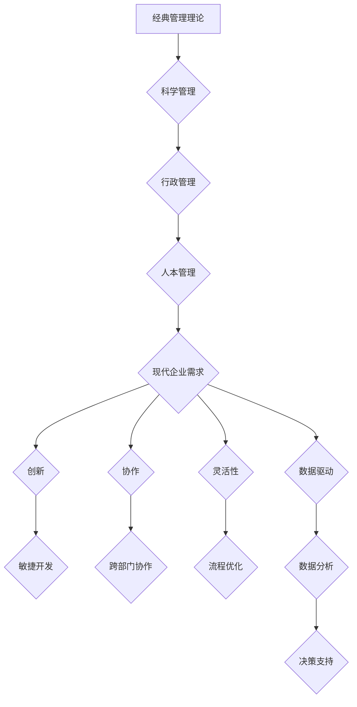

                 

## 经典管理理论在现代企业中的创新应用

> 关键词：管理理论、敏捷开发、数据驱动、流程优化、企业文化、人工智能、数字化转型、创新

## 1. 背景介绍

在瞬息万变的现代社会，企业面临着前所未有的挑战和机遇。激烈的市场竞争、快速变化的技术环境、不断演变的客户需求，都迫使企业不断寻求新的发展模式和管理理念。经典管理理论，作为管理学发展的重要里程碑，为企业提供了宝贵的经验和启示。然而，传统的管理理论体系在面对现代企业复杂性和动态性时，往往显得不够灵活和有效。因此，将经典管理理论与现代技术和管理理念相结合，进行创新应用，成为企业提升竞争力、实现可持续发展的关键。

## 2. 核心概念与联系

经典管理理论的核心概念包括科学管理、行政管理、人本管理等。这些理论强调效率、流程、组织结构、领导力等方面，为企业管理提供了框架和指导。而现代企业则更加注重创新、协作、灵活性、数据驱动等方面。

**核心概念与联系的Mermaid流程图：**



## 3. 核心算法原理 & 具体操作步骤

### 3.1  算法原理概述

在现代企业中，数据分析和决策支持是至关重要的环节。经典管理理论中的统计分析和决策树等算法，在数据驱动时代依然具有重要价值。

**数据分析算法原理：**

* **统计分析：** 通过收集和分析数据，识别趋势、模式和异常值，为决策提供依据。
* **决策树：** 通过构建树形结构，将决策问题分解成一系列子问题，最终得出决策结果。

### 3.2  算法步骤详解

**数据分析算法步骤：**

1. **数据收集：** 从各种来源收集相关数据，确保数据质量和完整性。
2. **数据清洗：** 处理缺失值、异常值和重复数据，确保数据准确性和一致性。
3. **数据分析：** 使用统计分析方法或决策树算法，对数据进行分析，识别趋势和模式。
4. **结果解读：** 对分析结果进行解读，并将其转化为可操作的决策建议。

**决策树算法步骤：**

1. **选择特征：** 根据问题需求，选择合适的特征作为决策树的节点。
2. **划分节点：** 将数据按照特征值进行划分，形成决策树的各个节点。
3. **构建树枝：** 根据节点划分结果，构建决策树的树枝，直到达到终止条件。
4. **预测结果：** 根据决策树的结构，对新的数据进行预测。

### 3.3  算法优缺点

**数据分析算法优缺点：**

* **优点：** 能够识别数据中的隐藏趋势和模式，为决策提供客观依据。
* **缺点：** 算法的准确性依赖于数据质量，数据偏差会导致决策错误。

**决策树算法优缺点：**

* **优点：** 易于理解和解释，能够直观地展示决策过程。
* **缺点：** 容易过拟合，对数据变化敏感。

### 3.4  算法应用领域

数据分析和决策树算法广泛应用于现代企业的各个领域，例如：

* **市场营销：** 分析客户数据，预测市场趋势，制定营销策略。
* **运营管理：** 优化生产流程，提高效率，降低成本。
* **人力资源：** 分析员工数据，预测人才需求，优化招聘和培训。
* **风险管理：** 识别潜在风险，制定风险控制措施。

## 4. 数学模型和公式 & 详细讲解 & 举例说明

### 4.1  数学模型构建

在经典管理理论中，许多概念可以用数学模型来表示，例如：

* **生产函数：** 描述生产要素投入与产出之间的关系。
* **成本函数：** 描述生产过程的成本与产出之间的关系。
* **利润函数：** 描述企业利润与产出之间的关系。

### 4.2  公式推导过程

例如，生产函数的常见形式是：

$$
Y = f(K, L)
$$

其中：

* $Y$ 表示产出
* $K$ 表示资本投入
* $L$ 表示劳动力投入
* $f$ 表示生产函数

通过对生产函数进行微分和求极值，可以得到资本和劳动力投入的最佳组合，从而最大化产出。

### 4.3  案例分析与讲解

例如，假设一家企业生产某种产品，其生产函数为：

$$
Y = 10K^{0.5}L^{0.5}
$$

如果资本投入为100，劳动力投入为100，则产出为：

$$
Y = 10 \times 100^{0.5} \times 100^{0.5} = 100
$$

如果增加资本投入到121，劳动力投入保持不变，则产出为：

$$
Y = 10 \times 121^{0.5} \times 100^{0.5} = 110
$$

可见，增加资本投入可以提高产出，但边际产出递减。

## 5. 项目实践：代码实例和详细解释说明

### 5.1  开发环境搭建

* **操作系统：** Linux 或 macOS
* **编程语言：** Python
* **库依赖：** pandas, numpy, matplotlib

### 5.2  源代码详细实现

```python
import pandas as pd
import numpy as np
from sklearn.tree import DecisionTreeClassifier
from sklearn.model_selection import train_test_split
from sklearn.metrics import accuracy_score

# 加载数据
data = pd.read_csv('data.csv')

# 划分特征和目标变量
X = data.drop('target', axis=1)
y = data['target']

# 将数据划分为训练集和测试集
X_train, X_test, y_train, y_test = train_test_split(X, y, test_size=0.2, random_state=42)

# 创建决策树模型
model = DecisionTreeClassifier()

# 训练模型
model.fit(X_train, y_train)

# 对测试集进行预测
y_pred = model.predict(X_test)

# 计算模型准确率
accuracy = accuracy_score(y_test, y_pred)
print('模型准确率：', accuracy)
```

### 5.3  代码解读与分析

* 代码首先加载数据，并划分特征和目标变量。
* 然后使用 `train_test_split` 函数将数据划分为训练集和测试集。
* 创建决策树模型，并使用 `fit` 方法训练模型。
* 使用 `predict` 方法对测试集进行预测，并计算模型准确率。

### 5.4  运行结果展示

运行代码后，会输出模型的准确率。

## 6. 实际应用场景

### 6.1  案例分析

* **人力资源管理：** 使用数据分析算法分析员工绩效数据，识别高潜力员工，并制定个性化的培训计划。
* **市场营销：** 使用决策树算法分析客户购买行为数据，预测客户的购买意愿，并制定精准的营销策略。
* **运营管理：** 使用数据分析算法分析生产流程数据，识别瓶颈环节，并优化生产流程，提高效率。

### 6.2  未来应用展望

随着人工智能和数据分析技术的不断发展，经典管理理论在现代企业中的应用将更加广泛和深入。例如：

* **智能决策支持系统：** 基于人工智能和数据分析技术的决策支持系统，能够自动收集、分析和处理数据，为企业决策提供更准确、更全面的建议。
* **个性化管理：** 基于数据分析和人工智能技术的个性化管理，能够根据员工的个人特点和需求，制定个性化的培训计划、薪酬福利和职业发展路径。
* **预测性维护：** 基于数据分析和机器学习技术的预测性维护，能够预测设备的故障风险，并提前进行维护，降低设备故障率和维护成本。

## 7. 工具和资源推荐

### 7.1  学习资源推荐

* **书籍：**
    * 《管理学原理》 - 彼得·杜卡斯
    * 《组织行为学》 - 迈克尔·波特
    * 《数据驱动决策》 - 迈克尔·哈里斯
* **在线课程：**
    * Coursera: 管理学课程
    * edX: 数据分析课程
    * Udemy: 人工智能课程

### 7.2  开发工具推荐

* **数据分析工具：**
    * Python: pandas, numpy, matplotlib
    * R: dplyr, ggplot2
    * Tableau: 数据可视化工具
* **机器学习工具：**
    * scikit-learn: Python机器学习库
    * TensorFlow: 深度学习框架
    * PyTorch: 深度学习框架

### 7.3  相关论文推荐

* **经典管理理论：**
    * Fayol, H. (1916). General and industrial management.
    * Taylor, F. W. (1911). The principles of scientific management.
* **数据驱动决策：**
    * Provost, F., & Fawcett, T. (2013). Data science for business: What you need to know about data mining and data-analytic thinking.
    * Chen, H., & Guestrin, C. (2016). XGBoost: A scalable tree boosting system.

## 8. 总结：未来发展趋势与挑战

### 8.1  研究成果总结

经典管理理论为现代企业管理提供了宝贵的经验和启示，而数据分析和人工智能技术的快速发展，为经典管理理论的创新应用提供了新的机遇。将经典管理理论与现代技术相结合，能够帮助企业提高效率、降低成本、增强竞争力。

### 8.2  未来发展趋势

未来，经典管理理论在现代企业中的应用将更加智能化、个性化和数据化。例如：

* **人工智能驱动的管理决策：** 人工智能将能够自动收集、分析和处理数据，为企业决策提供更准确、更全面的建议。
* **个性化管理方案：** 基于数据分析和人工智能技术的个性化管理方案，能够根据员工的个人特点和需求，制定个性化的培训计划、薪酬福利和职业发展路径。
* **预测性管理：** 基于数据分析和机器学习技术的预测性管理，能够预测未来趋势和风险，并提前采取措施，降低风险和提高效率。

### 8.3  面临的挑战

经典管理理论的创新应用也面临着一些挑战，例如：

* **数据质量问题：** 数据分析和人工智能技术的应用依赖于高质量的数据，而现实中数据往往存在不完整、不准确、不一致等问题。
* **算法解释性问题：** 一些人工智能算法的决策过程难以解释，这可能会导致企业难以理解和信任算法的决策结果。
* **伦理问题：** 人工智能技术的应用可能会带来一些伦理问题，例如数据隐私、算法偏见等，需要企业认真考虑和解决。

### 8.4  研究展望

未来，需要进一步研究如何解决经典管理理论创新应用中的挑战，例如：

* 开发更 robust 的数据分析算法，能够处理不完整、不准确、不一致的数据。
* 研究更可解释的人工智能算法，能够帮助企业理解和信任算法的决策结果。
* 制定相关的伦理规范和法律法规，规范人工智能技术的应用，避免其带来的负面影响。


## 9. 附录：常见问题与解答

**常见问题：**

* **如何将经典管理理论与现代技术相结合？**

**解答：**

可以通过以下方式将经典管理理论与现代技术相结合：

* 使用数据分析技术分析企业运营数据，识别改进机会。
* 使用人工智能技术自动化一些管理任务，例如招聘、培训、绩效评估等。
* 使用协作平台和工具促进团队协作和沟通。

* **经典管理理论是否已经过时？**

**解答：**

经典管理理论虽然诞生于上世纪，但其核心价值观和管理原则依然具有指导意义。随着时代的发展，经典管理理论需要不断创新和发展，才能更好地适应现代企业的需求。

* **如何应对数据分析和人工智能技术的挑战？**

**解答：**

需要加强对数据分析和人工智能技术的学习和研究，培养相关人才，并制定相应的管理制度和伦理规范，规范技术的应用，避免其带来的负面影响。


作者：禅与计算机程序设计艺术 / Zen and the Art of Computer Programming 
<end_of_turn>

