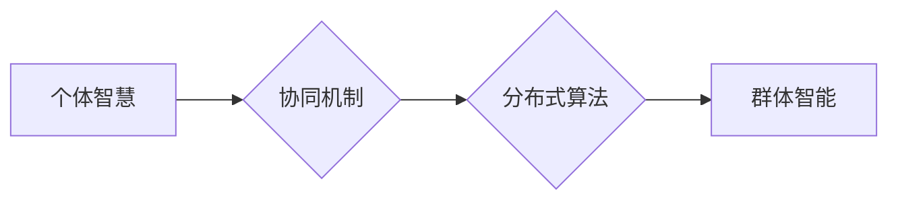

                 

## 群体智慧：人类计算的未来之路

> 关键词：群体智慧、人类计算、协同计算、分布式算法、机器学习、人工智能、大数据分析、未来趋势

## 1. 背景介绍

人类文明的发展离不开智慧的积累和传播。从古老的口耳相传到现代的互联网时代，信息和知识的共享一直是推动社会进步的强大引擎。随着信息技术的飞速发展，特别是人工智能和大数据的兴起，我们正站在一个新的历史节点上，一个全新的计算模式——群体智慧正在逐渐显现。

群体智慧是指通过将大量个体（人或机器）的有限智慧汇集起来，并通过有效的协作机制，实现超越单个个体能力的整体智慧。这种智慧的产生并非简单的加和，而是通过个体之间的相互作用、信息交换和知识融合，最终形成一个更加强大的整体智能。

传统的计算模式主要依赖于中心化的计算节点，例如超级计算机或云服务器。而群体智慧则打破了这种中心化局限，将计算任务分散到各个个体节点上，并通过分布式算法和协同机制，实现数据的并行处理和智慧的协同进化。

## 2. 核心概念与联系

群体智慧的核心概念包括：

* **个体智慧:** 指每个参与群体计算的个体所拥有的知识、能力和判断力。
* **协同机制:** 指群体中个体之间相互作用、信息交换和知识融合的规则和机制。
* **分布式算法:** 指在群体中进行计算的算法，能够将任务分解到各个个体节点上，并通过通信和协作完成计算。
* **群体智能:** 指通过协同机制和分布式算法，群体个体共同完成的超越单个个体能力的智慧。

**Mermaid 流程图:**



## 3. 核心算法原理 & 具体操作步骤

### 3.1  算法原理概述

群体智慧算法的核心原理是模拟自然界中群体行为的智慧，例如蜂群智能、蚁群智能等。这些算法通常基于以下几个关键要素：

* **局部规则:** 个体遵循简单的局部规则，例如跟随邻居、寻找食物等。
* **全局优化:** 通过个体之间的相互作用和信息交换，最终实现全局最优解。
* **自适应性:** 算法能够根据环境变化和个体反馈进行自适应调整。

### 3.2  算法步骤详解

群体智慧算法的具体操作步骤通常包括以下几个阶段：

1. **初始化:** 创建群体个体，并赋予每个个体初始状态和参数。
2. **迭代更新:** 根据局部规则和群体信息，每个个体更新其状态和参数。
3. **全局评估:** 计算群体整体性能，例如目标函数值或适应度。
4. **终止条件:** 当满足终止条件时，结束迭代过程，输出最终结果。

### 3.3  算法优缺点

**优点:**

* **并行性:** 能够充分利用多核处理器和分布式计算资源，提高计算效率。
* **鲁棒性:** 对噪声和数据不完整性具有较强的鲁棒性。
* **自适应性:** 能够根据环境变化和个体反馈进行自适应调整，提高算法的适应性。

**缺点:**

* **收敛速度:** 一些群体智慧算法的收敛速度较慢，需要较长的迭代时间。
* **参数调优:** 算法参数的设置对算法性能有重要影响，需要进行仔细的调优。
* **解释性:** 一些群体智慧算法的决策过程较为复杂，难以解释和理解。

### 3.4  算法应用领域

群体智慧算法在各个领域都有广泛的应用，例如：

* **优化问题:** 寻路规划、资源分配、调度优化等。
* **机器学习:** 分类、回归、聚类等。
* **图像处理:** 图像识别、目标检测、图像分割等。
* **金融领域:** 风险管理、投资决策、欺诈检测等。

## 4. 数学模型和公式 & 详细讲解 & 举例说明

### 4.1  数学模型构建

群体智慧算法的数学模型通常基于微分方程或差分方程，描述个体状态随时间的变化。例如，在蚁群算法中，每个蚂蚁的路径选择概率可以用以下公式表示：

$$
P_{ij} = \frac{\tau_{ij}^{\alpha} \eta_{ij}^{\beta}}{\sum_{k \in N(i)} \tau_{ik}^{\alpha} \eta_{ik}^{\beta}}
$$

其中：

* $P_{ij}$ 是蚂蚁从节点 $i$ 到节点 $j$ 的路径选择概率。
* $\tau_{ij}$ 是节点 $i$ 到节点 $j$ 的路径上的信息素浓度。
* $\eta_{ij}$ 是节点 $i$ 到节点 $j$ 的路径上的启示程度。
* $\alpha$ 和 $\beta$ 是控制信息素和启示程度影响的权重参数。
* $N(i)$ 是节点 $i$ 的邻居节点集合。

### 4.2  公式推导过程

该公式的推导过程基于以下假设：

* 蚂蚁选择路径的概率与路径上的信息素浓度和启示程度成正比。
* 信息素浓度越高，路径越容易被选择。
* 启示程度越高，路径越容易被发现。

通过对这些假设的数学表达，最终得到了上述路径选择概率公式。

### 4.3  案例分析与讲解

在寻路规划问题中，可以使用蚁群算法来寻找最优路径。算法初始时，每个蚂蚁随机选择一条路径，并根据路径上的信息素浓度和启示程度更新其路径选择概率。随着迭代次数的增加，信息素浓度会逐渐积累在最优路径上，从而引导其他蚂蚁选择最优路径。最终，算法会找到最优路径，并输出该路径的信息。

## 5. 项目实践：代码实例和详细解释说明

### 5.1  开发环境搭建

为了实现群体智慧算法的项目实践，需要搭建相应的开发环境。常用的开发环境包括：

* **编程语言:** Python、Java、C++ 等。
* **机器学习库:** TensorFlow、PyTorch、Scikit-learn 等。
* **分布式计算框架:** Spark、Hadoop 等。

### 5.2  源代码详细实现

以下是一个简单的蚁群算法的Python代码实现示例：

```python
import random

class Ant:
    def __init__(self, graph):
        self.graph = graph
        self.path = []

    def move(self):
        current_node = self.path[-1]
        next_node = random.choice(self.graph[current_node])
        self.path.append(next_node)

    def get_path_length(self):
        return sum([self.graph[u][v] for u, v in zip(self.path[:-1], self.path[1:])])

# ... 其他代码 ...
```

### 5.3  代码解读与分析

该代码定义了一个Ant类，代表一个蚂蚁个体。每个蚂蚁拥有一个图结构（graph）和一个路径（path）。

* `move()`方法模拟蚂蚁在图中移动的行为，随机选择一条连接当前节点的边，并更新其路径。
* `get_path_length()`方法计算蚂蚁路径的总长度。

### 5.4  运行结果展示

通过运行该代码，可以模拟蚂蚁在图中寻找最短路径的过程。最终，算法会输出所有蚂蚁的路径，并从中选择最短路径作为最优解。

## 6. 实际应用场景

群体智慧算法在各个领域都有广泛的应用场景，例如：

### 6.1  推荐系统

群体智慧算法可以用于构建个性化推荐系统，例如电影推荐、商品推荐等。通过分析用户的行为数据和商品信息，算法可以预测用户对特定商品的兴趣，并推荐相关的商品。

### 6.2  金融风险管理

群体智慧算法可以用于金融风险管理，例如信用风险评估、欺诈检测等。通过分析用户的交易数据和市场信息，算法可以识别潜在的风险，并采取相应的措施进行风险控制。

### 6.3  医疗诊断

群体智慧算法可以用于辅助医疗诊断，例如疾病预测、药物研发等。通过分析患者的病历数据和医学研究成果，算法可以辅助医生进行诊断，并提供个性化的治疗方案。

### 6.4  未来应用展望

随着人工智能和大数据的不断发展，群体智慧算法的应用场景将会更加广泛。例如，在自动驾驶、智能制造、城市管理等领域，群体智慧算法将发挥越来越重要的作用。

## 7. 工具和资源推荐

### 7.1  学习资源推荐

* **书籍:**

    * 《群体智能》
    * 《人工智能：现代方法》
    * 《机器学习》

* **在线课程:**

    * Coursera: 人工智能
    * edX: 机器学习
    * Udacity: 深度学习

### 7.2  开发工具推荐

* **编程语言:** Python、Java、C++
* **机器学习库:** TensorFlow、PyTorch、Scikit-learn
* **分布式计算框架:** Spark、Hadoop

### 7.3  相关论文推荐

* Ant Colony Optimization: A Metaheuristic Approach to Problem Solving
* Swarm Intelligence: From Nature to Computation
* Particle Swarm Optimization: Basic Concepts, Variants and Applications

## 8. 总结：未来发展趋势与挑战

### 8.1  研究成果总结

群体智慧算法在解决复杂优化问题、机器学习、图像处理等领域取得了显著成果。其并行性、鲁棒性和自适应性使其成为解决实际问题的有效工具。

### 8.2  未来发展趋势

未来群体智慧算法的发展趋势包括：

* **更有效的算法设计:** 研究更有效的群体智慧算法，提高算法的收敛速度和解的质量。
* **更广泛的应用场景:** 将群体智慧算法应用于更多领域，例如自动驾驶、智能制造、城市管理等。
* **更强大的计算能力:** 利用云计算、量子计算等新兴技术，提升群体智慧算法的计算能力。

### 8.3  面临的挑战

群体智慧算法也面临一些挑战，例如：

* **参数调优:** 算法参数的设置对算法性能有重要影响，需要进行仔细的调优。
* **解释性:** 一些群体智慧算法的决策过程较为复杂，难以解释和理解。
* **数据依赖性:** 群体智慧算法的性能依赖于数据的质量和数量。

### 8.4  研究展望

未来研究将继续探索群体智慧算法的理论基础、算法设计、应用场景和挑战，推动群体智慧算法的发展和应用，为人类社会创造更多价值。

## 9. 附录：常见问题与解答

### 9.1  群体智慧算法与传统算法的区别是什么？

群体智慧算法模拟自然界中群体的智慧，通过个体之间的相互作用和信息交换，实现全局优化。而传统算法通常依赖于中心化的计算节点，并采用预先定义的规则进行计算。

### 9.2  群体智慧算法的应用领域有哪些？

群体智慧算法在各个领域都有广泛的应用，例如优化问题、机器学习、图像处理、金融领域等。

### 9.3  群体智慧算法的优势和劣势是什么？

群体智慧算法的优势包括并行性、鲁棒性和自适应性。其劣势包括收敛速度较慢、参数调优困难和解释性差。

### 9.4  如何选择合适的群体智慧算法？

选择合适的群体智慧算法需要根据具体问题特点和需求进行选择。例如，对于寻路规划问题，可以使用蚁群算法；对于分类问题，可以使用粒子群算法。

### 9.5  群体智慧算法的未来发展趋势是什么？

未来群体智慧算法的发展趋势包括更有效的算法设计、更广泛的应用场景和更强大的计算能力。


作者：禅与计算机程序设计艺术 / Zen and the Art of Computer Programming 
<end_of_turn>

