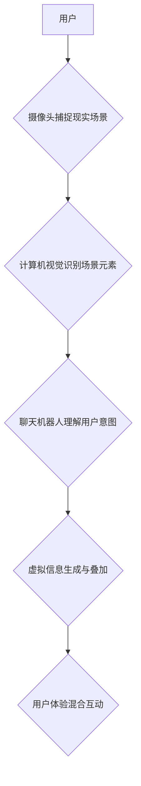

                 

## 聊天机器人增强现实：混合互动体验

> 关键词：聊天机器人、增强现实、混合现实、交互体验、自然语言处理、计算机视觉、深度学习

## 1. 背景介绍

增强现实 (AR) 技术近年来发展迅速，它通过叠加虚拟信息到现实世界中，为用户提供了一种全新的交互体验。从游戏到教育，从购物到医疗，AR 的应用场景日益广泛。而聊天机器人作为一种能够理解和响应人类语言的智能系统，也正在不断发展，其能力越来越接近人类的自然语言理解和生成。

将聊天机器人与增强现实技术相结合，可以创造出更加沉浸式、交互性和智能化的混合互动体验。这种混合体验能够打破现实和虚拟世界的界限，为用户提供更直观、更自然、更具吸引力的交互方式。

## 2. 核心概念与联系

### 2.1 增强现实 (AR)

增强现实 (AR) 技术是指在现实世界中叠加虚拟信息，以增强用户对现实世界的感知。AR 系统通常通过摄像头捕捉现实场景，然后将虚拟物体、信息或交互元素叠加到现实场景中，形成一个混合的视觉体验。

### 2.2 聊天机器人

聊天机器人是一种能够通过自然语言与人类进行对话的智能系统。它通常基于自然语言处理 (NLP) 技术，能够理解用户的意图和需求，并生成相应的回复。

### 2.3 混合互动体验

混合互动体验是指将 AR 技术和聊天机器人技术相结合，为用户提供一种更加沉浸式、交互性和智能化的体验。这种体验能够打破现实和虚拟世界的界限，让用户能够与虚拟世界中的物体和角色进行互动，并通过聊天机器人获得更个性化的服务和信息。

**Mermaid 流程图**



## 3. 核心算法原理 & 具体操作步骤

### 3.1 算法原理概述

将聊天机器人与增强现实技术相结合的核心算法主要包括：

* **计算机视觉算法**: 用于识别和理解现实场景中的物体、人物和环境信息。
* **自然语言处理 (NLP) 算法**: 用于理解用户的自然语言输入，并生成相应的回复。
* **虚拟现实 (VR) 渲染算法**: 用于生成虚拟物体和场景，并将其叠加到现实场景中。
* **混合现实 (MR) 融合算法**: 用于将现实场景和虚拟场景融合在一起，创造出逼真的混合体验。

### 3.2 算法步骤详解

1. **场景识别**: 使用计算机视觉算法对现实场景进行识别，识别出用户周围的物体、人物和环境信息。
2. **用户意图理解**: 使用自然语言处理算法对用户的语音或文本输入进行理解，识别出用户的意图和需求。
3. **虚拟信息生成**: 根据用户的意图和场景信息，生成相应的虚拟信息，例如虚拟物体、文字提示、语音回复等。
4. **虚拟信息叠加**: 使用 VR 渲染算法将虚拟信息叠加到现实场景中，形成一个混合的视觉体验。
5. **交互反馈**: 用户与虚拟信息进行交互，例如点击、拖动、语音控制等，聊天机器人根据用户的交互行为进行相应的反馈。

### 3.3 算法优缺点

**优点**:

* **沉浸式体验**: 能够为用户提供更加沉浸式、交互性和智能化的体验。
* **个性化服务**: 能够根据用户的需求和喜好提供个性化的服务和信息。
* **拓展应用场景**: 能够拓展 AR 和聊天机器人的应用场景，例如教育、医疗、零售等。

**缺点**:

* **技术复杂**: 结合 AR 和聊天机器人的技术难度较高，需要整合多种算法和技术。
* **计算资源需求**: 需要较高的计算资源来处理现实场景识别、虚拟信息生成和混合渲染等任务。
* **隐私安全**: 需要考虑用户隐私安全问题，例如摄像头捕捉到的个人信息和语音数据。

### 3.4 算法应用领域

* **教育**: AR 增强现实可以将抽象的概念转化为可视化的体验，帮助学生更好地理解和记忆知识。聊天机器人可以作为虚拟老师，为学生提供个性化的学习辅导和答疑服务。
* **医疗**: AR 可以帮助医生进行手术指导、诊断辅助和患者教育。聊天机器人可以作为虚拟助理，帮助医生管理患者信息、预约挂号和提供医疗咨询。
* **零售**: AR 可以帮助消费者虚拟试穿衣服、家具等，并提供产品信息和购买建议。聊天机器人可以作为虚拟导购员，为消费者提供个性化的购物服务和推荐。
* **娱乐**: AR 可以增强游戏体验，让玩家能够与虚拟世界互动。聊天机器人可以作为游戏角色，与玩家进行对话和互动。

## 4. 数学模型和公式 & 详细讲解 & 举例说明

### 4.1 数学模型构建

在聊天机器人增强现实系统中，可以使用以下数学模型来描述用户与虚拟环境的交互：

* **状态转移模型**: 描述用户在虚拟环境中移动和交互的行为模式。
* **奖励函数**: 描述用户与虚拟环境交互的满意度或奖励程度。
* **策略函数**: 描述聊天机器人根据用户状态和奖励函数生成虚拟信息和交互行为的策略。

### 4.2 公式推导过程

* **状态转移模型**: 可以使用马尔可夫链来描述用户在虚拟环境中的状态转移过程。

$$
P(s_t|s_{t-1},a_{t-1})
$$

其中，$s_t$ 表示用户在时间 $t$ 的状态，$s_{t-1}$ 表示用户在时间 $t-1$ 的状态，$a_{t-1}$ 表示用户在时间 $t-1$ 的动作。

* **奖励函数**: 可以使用以下公式来定义用户与虚拟环境交互的奖励：

$$
R(s_t,a_t)
$$

其中，$s_t$ 表示用户在时间 $t$ 的状态，$a_t$ 表示用户在时间 $t$ 的动作。

* **策略函数**: 可以使用强化学习算法来训练聊天机器人的策略函数，使其能够根据用户状态和奖励函数生成最佳的虚拟信息和交互行为。

$$
\pi(a_t|s_t)
$$

其中，$\pi(a_t|s_t)$ 表示在状态 $s_t$ 下，聊天机器人选择动作 $a_t$ 的概率。

### 4.3 案例分析与讲解

例如，在 AR 游戏中，用户可以通过移动手机摄像头来控制游戏角色的移动方向。聊天机器人可以根据用户的移动方向和游戏场景信息，生成相应的虚拟信息，例如游戏角色的语音对话、环境音效等。

## 5. 项目实践：代码实例和详细解释说明

### 5.1 开发环境搭建

* **操作系统**: Windows、macOS 或 Linux
* **编程语言**: Python
* **深度学习框架**: TensorFlow 或 PyTorch
* **AR 开发框架**: ARKit (iOS) 或 ARCore (Android)
* **自然语言处理库**: NLTK、spaCy 或 HuggingFace Transformers

### 5.2 源代码详细实现

以下是一个简单的 Python 代码示例，演示了如何使用 TensorFlow 和 ARKit 来实现一个基本的 AR 聊天机器人：

```python
import tensorflow as tf
import arkit

# 加载聊天机器人模型
model = tf.keras.models.load_model('chatbot_model.h5')

# 初始化 ARKit 框架
arkit_session = arkit.ARSession()

# 摄像头捕捉现实场景
camera_frame = arkit_session.capture_frame()

# 使用计算机视觉算法识别场景元素
scene_objects = arkit_session.detect_objects(camera_frame)

# 将场景信息传递给聊天机器人模型
user_input = scene_objects

# 生成聊天机器人的回复
response = model.predict(user_input)

# 将聊天机器人的回复叠加到现实场景中
arkit_session.display_text(response, camera_frame)
```

### 5.3 代码解读与分析

* 该代码首先加载一个预训练的聊天机器人模型。
* 然后，使用 ARKit 框架捕捉现实场景的摄像头帧。
* 使用计算机视觉算法识别场景中的物体，并将识别结果作为用户输入传递给聊天机器人模型。
* 聊天机器人模型根据用户输入生成相应的回复。
* 最后，使用 ARKit 框架将聊天机器人的回复叠加到现实场景中，形成一个混合的视觉体验。

### 5.4 运行结果展示

运行该代码后，用户将看到现实场景中叠加了聊天机器人的回复，例如文字提示、语音对话等。

## 6. 实际应用场景

### 6.1 教育

* **虚拟实验室**: AR 聊天机器人可以引导学生进行虚拟实验室实验，并提供实时反馈和指导。
* **互动式学习**: AR 聊天机器人可以与学生进行互动式对话，帮助他们理解和记忆知识。
* **个性化学习**: AR 聊天机器人可以根据学生的学习进度和需求，提供个性化的学习内容和辅导。

### 6.2 医疗

* **远程医疗**: AR 聊天机器人可以帮助医生进行远程诊断和治疗，并为患者提供医疗咨询和指导。
* **手术辅助**: AR 聊天机器人可以为医生提供手术指导和辅助，例如显示手术步骤、提供实时影像信息等。
* **患者教育**: AR 聊天机器人可以帮助医生向患者解释病情、治疗方案和注意事项。

### 6.3 零售

* **虚拟试衣间**: AR 聊天机器人可以帮助消费者虚拟试穿衣服、鞋子等，并提供尺寸建议和搭配建议。
* **产品展示**: AR 聊天机器人可以为消费者展示产品的详细信息，例如功能、规格、使用方法等。
* **个性化推荐**: AR 聊天机器人可以根据消费者的喜好和购买历史，提供个性化的产品推荐。

### 6.4 未来应用展望

随着 AR 和聊天机器人技术的不断发展，其应用场景将更加广泛，例如：

* **虚拟旅游**: AR 聊天机器人可以为用户提供虚拟旅游体验，例如参观博物馆、游览景点等。
* **虚拟社交**: AR 聊天机器人可以帮助用户进行虚拟社交，例如与朋友进行视频通话、参加虚拟聚会等。
* **虚拟培训**: AR 聊天机器人可以为用户提供虚拟培训体验，例如学习新的技能、掌握新的知识等。

## 7. 工具和资源推荐

### 7.1 学习资源推荐

* **书籍**:
    * 《增强现实：原理、技术与应用》
    * 《聊天机器人技术》
* **在线课程**:
    * Coursera: 增强现实开发
    * Udacity: 自然语言处理
* **博客**:
    * ARPost
    * Towards Data Science

### 7.2 开发工具推荐

* **AR 开发框架**: ARKit (iOS), ARCore (Android)
* **深度学习框架**: TensorFlow, PyTorch
* **自然语言处理库**: NLTK, spaCy, HuggingFace Transformers

### 7.3 相关论文推荐

* **增强现实**:
    * A Survey of Augmented Reality: Definition, History, and Applications
    * Augmented Reality: A Survey
* **聊天机器人**:
    * Sequence to Sequence Learning with Neural Networks
    * Attention Is All You Need

## 8. 总结：未来发展趋势与挑战

### 8.1 研究成果总结

将聊天机器人与增强现实技术相结合，能够为用户提供更加沉浸式、交互性和智能化的体验。这种混合体验能够拓展 AR 和聊天机器人的应用场景，例如教育、医疗、零售等。

### 8.2 未来发展趋势

* **更逼真的虚拟体验**: 随着计算机视觉和图形渲染技术的进步，虚拟体验将更加逼真和沉浸。
* **更智能的聊天机器人**: 随着深度学习和自然语言处理技术的进步，聊天机器人将更加智能，能够更好地理解和响应用户的需求。
* **更广泛的应用场景**: 随着 AR 和聊天机器人技术的成熟，其应用场景将更加广泛，例如虚拟旅游、虚拟社交、虚拟培训等。

### 8.3 面临的挑战

* **技术复杂性**: 结合 AR 和聊天机器人的技术难度较高，需要整合多种算法和技术。
* **计算资源需求**: 需要较高的计算资源来处理现实场景识别、虚拟信息生成和混合渲染等任务。
* **隐私安全**: 需要考虑用户隐私安全问题，例如摄像头捕捉到的个人信息和语音数据。

### 8.4 研究展望

未来，我们将继续研究如何提高 AR 聊天机器人的交互性和智能化程度，并将其应用于更多领域，为用户提供更加丰富多彩的体验。


## 9. 附录：常见问题与解答

**Q1: AR 聊天机器人与普通聊天机器人有什么区别？**

**A1:** AR 聊天机器人能够将虚拟信息叠加到现实场景中，为用户提供更加沉浸式和交互式的体验。而普通聊天机器人只能通过文本或语音进行对话。

**Q2: 如何开发 AR 聊天机器人？**

**A2:** 开发 AR 聊天机器人需要掌握 AR 开发框架、深度学习框架和自然语言处理库等技术。

**Q3: AR 聊天机器人的应用场景有哪些？**

**A3:** AR 聊天机器人的应用场景非常广泛，例如教育、医疗、零售、娱乐等。

**Q4: AR 聊天机器人的未来发展趋势是什么？**

**A4:** 未来，AR 聊天机器人的虚拟体验将更加逼真，聊天机器人将更加智能，应用场景将更加广泛。


作者：禅与计算机程序设计艺术 / Zen and the Art of Computer Programming 
<end_of_turn>

