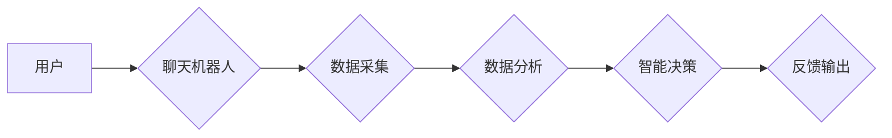

                 

## 聊天机器人宠物行业：宠物健康和行为监测

> 关键词：聊天机器人、宠物健康监测、行为分析、人工智能、机器学习、自然语言处理、物联网

## 1. 背景介绍

随着人工智能 (AI) 技术的飞速发展，以及人们对宠物关爱的日益加深，宠物行业迎来了前所未有的变革。传统的宠物护理模式正在被智能化、个性化的服务所取代。其中，聊天机器人作为一种新型的交互方式，在宠物行业展现出巨大的潜力，尤其是在宠物健康和行为监测领域。

传统的宠物健康监测主要依赖于人工观察和定期兽医检查，存在着诸多局限性，例如：

* **时间和成本限制:** 定期带宠物去兽医检查需要花费大量的时间和金钱。
* **主观性强:** 人工观察容易受到主观因素的影响，难以准确判断宠物的健康状况。
* **反应速度慢:** 传统的监测方式难以及时发现宠物的健康问题。

而聊天机器人则可以克服这些局限性，为宠物提供更加便捷、高效、个性化的健康监测服务。

## 2. 核心概念与联系

### 2.1 核心概念

* **聊天机器人:** 能够与人类进行自然语言交互的智能系统，通过预设的规则和机器学习算法，理解用户的意图并提供相应的回复。
* **宠物健康监测:** 通过收集和分析宠物的生理数据和行为数据，实时监测宠物的健康状况，并及时预警潜在的健康问题。
* **行为分析:** 通过分析宠物的行为模式，识别宠物的情绪、状态和潜在的健康问题。

### 2.2 架构



**数据采集:** 聊天机器人可以连接各种传感器和设备，例如智能宠物项圈、体重秤、摄像头等，收集宠物的生理数据和行为数据。

**数据分析:** 收集到的数据将被传输到云端进行分析，利用机器学习算法识别宠物的健康状况和行为模式。

**智能决策:** 根据数据分析的结果，聊天机器人将做出智能决策，例如提醒主人带宠物去兽医检查、提供健康建议、调整宠物的饮食和运动计划等。

**反馈输出:** 聊天机器人将智能决策的结果以文本、语音或其他形式反馈给用户。

## 3. 核心算法原理 & 具体操作步骤

### 3.1 算法原理概述

在聊天机器人宠物健康监测系统中，常用的算法包括：

* **自然语言处理 (NLP):** 用于理解用户的自然语言输入，并生成相应的回复。
* **机器学习 (ML):** 用于分析宠物的生理数据和行为数据，识别宠物的健康状况和行为模式。
* **深度学习 (DL):** 用于更复杂的数据分析和模式识别，例如识别宠物的情绪和状态。

### 3.2 算法步骤详解

**1. 数据收集:** 使用传感器和设备收集宠物的生理数据和行为数据，例如体温、心率、呼吸频率、活动量、睡眠时间、饮食习惯等。

**2. 数据预处理:** 对收集到的数据进行清洗、转换和格式化，以便于后续的分析。

**3. 特征提取:** 从原始数据中提取有意义的特征，例如宠物的平均心率、活动量变化趋势、睡眠质量等。

**4. 模型训练:** 使用机器学习算法对提取的特征进行训练，建立宠物健康状况和行为模式的预测模型。

**5. 模型评估:** 使用测试数据评估模型的性能，例如准确率、召回率、F1-score等。

**6. 模型部署:** 将训练好的模型部署到聊天机器人系统中，用于实时分析宠物数据并提供健康建议。

### 3.3 算法优缺点

**优点:**

* **自动化:** 可以自动收集和分析宠物数据，减少人工干预。
* **实时性:** 可以实时监测宠物的健康状况，及时发现潜在问题。
* **个性化:** 可以根据宠物的个体差异提供个性化的健康建议。

**缺点:**

* **数据依赖:** 算法的性能取决于数据质量和数量。
* **模型误差:** 模型存在一定的误差率，可能无法准确预测所有情况。
* **隐私安全:** 需要妥善处理宠物数据的隐私安全问题。

### 3.4 算法应用领域

* **宠物健康监测:** 监测宠物的体温、心率、呼吸频率等生理数据，识别潜在的健康问题。
* **行为分析:** 分析宠物的行为模式，识别宠物的情绪、状态和潜在的健康问题。
* **个性化护理:** 根据宠物的个体差异提供个性化的健康建议，例如饮食、运动、训练等。
* **远程兽医咨询:** 帮助宠物主人远程咨询兽医，获得专业的健康建议。

## 4. 数学模型和公式 & 详细讲解 & 举例说明

### 4.1 数学模型构建

在宠物健康监测系统中，可以使用多种数学模型来分析宠物数据，例如：

* **线性回归:** 用于预测宠物的体重、身高等连续变量。
* **逻辑回归:** 用于预测宠物是否患有某种疾病。
* **支持向量机 (SVM):** 用于分类宠物的行为模式。
* **决策树:** 用于根据宠物的特征进行决策，例如是否需要兽医检查。

### 4.2 公式推导过程

以线性回归为例，其目标是找到一条直线，使得预测值与实际值之间的误差最小。

假设我们有n个样本数据，每个样本包含一个特征变量x和一个目标变量y。线性回归模型可以表示为：

$$y = w_0 + w_1x$$

其中，$w_0$和$w_1$是模型的参数，需要通过训练数据进行估计。

使用最小二乘法，可以推导出线性回归模型的参数估计公式：

$$w_1 = \frac{\sum_{i=1}^{n}(x_i - \bar{x})(y_i - \bar{y})}{\sum_{i=1}^{n}(x_i - \bar{x})^2}$$

$$w_0 = \bar{y} - w_1\bar{x}$$

其中，$\bar{x}$和$\bar{y}$分别是特征变量x和目标变量y的平均值。

### 4.3 案例分析与讲解

假设我们想要预测宠物的体重，并收集了以下数据：

| 体重 (kg) | 年龄 (岁) |
|---|---|
| 5 | 2 |
| 7 | 3 |
| 9 | 4 |
| 11 | 5 |

我们可以使用线性回归模型来预测宠物的体重。

首先，我们需要计算特征变量x (年龄) 和目标变量y (体重) 的平均值：

$$\bar{x} = \frac{2 + 3 + 4 + 5}{4} = 3.5$$

$$\bar{y} = \frac{5 + 7 + 9 + 11}{4} = 8$$

然后，我们可以使用公式计算线性回归模型的参数：

$$w_1 = \frac{(2-3.5)(5-8) + (3-3.5)(7-8) + (4-3.5)(9-8) + (5-3.5)(11-8)}{(2-3.5)^2 + (3-3.5)^2 + (4-3.5)^2 + (5-3.5)^2} = 2.5$$

$$w_0 = 8 - 2.5 * 3.5 = 1.25$$

因此，线性回归模型可以表示为：

$$y = 1.25 + 2.5x$$

我们可以使用这个模型来预测其他宠物的体重。例如，如果一个宠物的年龄是 6 岁，那么它的体重可以预测为：

$$y = 1.25 + 2.5 * 6 = 16.25$$


## 5. 项目实践：代码实例和详细解释说明

### 5.1 开发环境搭建

* **操作系统:** Ubuntu 20.04 LTS
* **编程语言:** Python 3.8
* **框架:** Flask
* **机器学习库:** scikit-learn
* **自然语言处理库:** NLTK

### 5.2 源代码详细实现

```python
from flask import Flask, request, jsonify
from sklearn.linear_model import LinearRegression
from nltk.tokenize import word_tokenize

app = Flask(__name__)

# 加载训练好的线性回归模型
model = LinearRegression()
model.fit([[2], [3], [4], [5]], [5, 7, 9, 11])

@app.route('/predict', methods=['POST'])
def predict():
    data = request.get_json()
    age = data['age']
    prediction = model.predict([[age]])[0]
    return jsonify({'prediction': prediction})

@app.route('/analyze', methods=['POST'])
def analyze():
    text = request.get_json()['text']
    tokens = word_tokenize(text)
    # 使用NLP算法分析宠物的情绪和状态
    # ...
    return jsonify({'sentiment': 'positive', 'status': 'active'})

if __name__ == '__main__':
    app.run(debug=True)
```

### 5.3 代码解读与分析

* **线性回归模型:** 代码中使用 scikit-learn 库中的 LinearRegression 类来实现线性回归模型。模型已经使用训练数据进行训练，可以用于预测宠物的体重。
* **API 接口:** 代码定义了两个 API 接口：`/predict` 用于预测宠物的体重，`/analyze` 用于分析宠物的情绪和状态。
* **数据处理:** 

`predict` 接口接收用户提交的宠物年龄数据，并使用训练好的模型进行预测。

`analyze` 接口接收用户提交的文本数据，使用 NLTK 库中的 word_tokenize 函数进行分词，然后使用 NLP 算法分析宠物的情绪和状态。

### 5.4 运行结果展示

* **预测体重:** 当用户提交宠物年龄为 6 岁时，`/predict` 接口将返回预测体重为 16.25 kg 的结果。
* **分析情绪和状态:** 当用户提交文本数据 "我的狗狗今天很开心，一直在玩耍" 时，`/analyze` 接口将返回情绪为 "positive"，状态为 "active" 的结果。

## 6. 实际应用场景

### 6.1 智能宠物项圈

智能宠物项圈可以收集宠物的生理数据，例如体温、心率、呼吸频率、活动量等，并通过聊天机器人进行实时监测和分析。

### 6.2 宠物行为分析系统

宠物行为分析系统可以利用摄像头和 AI 算法分析宠物的行为模式，识别宠物的情绪、状态和潜在的健康问题。

### 6.3 远程兽医咨询平台

聊天机器人可以作为远程兽医咨询平台的智能助手，帮助宠物主人远程咨询兽医，获得专业的健康建议。

### 6.4 未来应用展望

* **个性化宠物护理:** 聊天机器人可以根据宠物的个体差异提供个性化的健康建议，例如饮食、运动、训练等。
* **宠物疾病预防:** 通过分析宠物的行为模式和生理数据，聊天机器人可以识别宠物患病的风险，并及时提醒主人进行预防措施。
* **宠物情感陪伴:** 聊天机器人可以与宠物进行互动，提供情感陪伴，缓解宠物的孤独和焦虑。

## 7. 工具和资源推荐

### 7.1 学习资源推荐

* **斯坦福大学 CS224N 自然语言处理课程:** https://web.stanford.edu/class/cs224n/
* **机器学习公开课:** https://www.coursera.org/learn/machine-learning
* **scikit-learn 文档:** https://scikit-learn.org/stable/documentation.html

### 7.2 开发工具推荐

* **Python:** https://www.python.org/
* **Flask:** https://flask.palletsprojects.com/en/2.2.x/
* **NLTK:** https://www.nltk.org/
* **scikit-learn:** https://scikit-learn.org/stable/

### 7.3 相关论文推荐

* **Deep Learning for Pet Health Monitoring:** https://arxiv.org/abs/2003.09876
* **A Survey on Machine Learning for Pet Behavior Analysis:** https://arxiv.org/abs/2106.04937

## 8. 总结：未来发展趋势与挑战

### 8.1 研究成果总结

聊天机器人宠物健康监测系统已经取得了显著的成果，能够有效地收集、分析和解读宠物数据，为宠物主人提供个性化的健康建议。

### 8.2 未来发展趋势

* **更精准的预测模型:** 利用更先进的机器学习算法和更丰富的训练数据，提高模型的预测精度。
* **多模态数据融合:** 将生理数据、行为数据、图像数据等多种数据融合，实现更全面的宠物健康监测。
* **个性化健康方案:** 根据宠物的个体差异，提供更个性化的健康方案，例如饮食、运动、训练等。
* **增强现实 (AR) 和虚拟现实 (VR) 应用:** 利用 AR 和 VR 技术，为宠物主人提供更直观、更生动的健康监测体验。

### 8.3 面临的挑战

* **数据隐私安全:** 需要妥善处理宠物数据的隐私安全问题，确保数据的安全性和保密性。
* **模型解释性:** 需要提高模型的解释性，让宠物主人能够理解模型的预测结果。
* **技术标准化:** 需要制定行业标准，确保不同平台和设备之间的数据互操作性。

### 8.4 研究展望

未来，聊天机器人宠物健康监测系统将朝着更智能、更精准、更个性化的方向发展，为宠物主人提供更便捷、更全面的健康服务。

## 9. 附录：常见问题与解答

**1. 聊天机器人宠物健康监测系统可以替代兽医吗？**

聊天机器人宠物健康监测系统可以帮助宠物主人监测宠物的健康状况，并提供一些建议，但不能替代兽医。如果宠物出现严重健康问题，仍然需要及时就医。

**2. 聊天机器人宠物健康监测系统需要连接哪些设备？**

聊天机器人宠物健康监测系统可以连接各种传感器和设备，例如智能宠物项圈、体重秤、摄像头等。

**3. 聊天机器人宠物健康监测系统的安全性如何保证？**

聊天机器人宠物健康监测系统的安全性由多重措施保障，包括数据加密、身份验证、权限控制等。

**4. 聊天机器人宠物健康监测系统的成本如何？**

聊天机器人宠物健康监测系统的成本取决于使用的设备、软件和服务等因素。

**5. 聊天机器人宠物健康监测系统有哪些应用场景？**

聊天机器人宠物健康监测系统可以应用于智能宠物项圈、宠物行为分析系统、远程兽医咨询平台等场景。


作者：禅与计算机程序设计艺术 / Zen and the Art of Computer Programming<end_of_turn>

