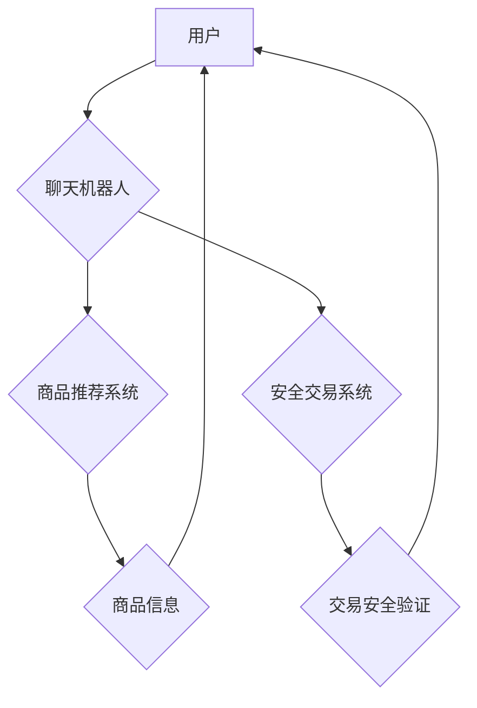

                 

## 聊天机器人电子商务：个性化购物和安全交易

> 关键词：聊天机器人、电子商务、个性化推荐、自然语言处理、安全交易、机器学习、深度学习

## 1. 背景介绍

电子商务的蓬勃发展为消费者提供了便捷的购物体验，但也带来了新的挑战，例如信息过载、购物决策困难、交易安全风险等。 聊天机器人作为一种新兴的交互技术，凭借其智能化、个性化和24小时在线等特点，逐渐成为电子商务领域的重要应用场景。

### 1.1 电子商务面临的挑战

* **信息过载:**  电子商务平台上商品数量庞大，消费者难以快速找到心仪的产品。
* **购物决策困难:**  消费者在面对众多选择时，难以做出最佳的购物决策。
* **交易安全风险:**  网络交易存在着欺诈、盗窃等安全风险，消费者购物体验受到影响。

### 1.2 聊天机器人带来的机遇

* **个性化推荐:** 聊天机器人可以根据用户的购物历史、偏好和行为数据，提供个性化的商品推荐，提升购物体验。
* **智能客服:** 聊天机器人可以自动解答用户常见问题，提供24小时在线服务，减轻人工客服压力。
* **安全交易保障:** 聊天机器人可以帮助用户验证身份、识别欺诈行为，保障交易安全。

## 2. 核心概念与联系

聊天机器人电子商务的核心概念包括：自然语言处理（NLP）、机器学习（ML）、深度学习（DL）、推荐系统、安全交易等。

**架构图：**



### 2.1 自然语言处理（NLP）

NLP是让计算机理解和处理人类语言的关键技术。在聊天机器人电子商务中，NLP用于理解用户的自然语言输入，例如文本消息或语音指令，并将其转换为机器可理解的格式。

### 2.2 机器学习（ML）

ML是让计算机从数据中学习和改进的关键技术。在聊天机器人电子商务中，ML用于训练聊天机器人模型，使其能够理解用户的意图、提供个性化的商品推荐和识别欺诈行为。

### 2.3 深度学习（DL）

DL是机器学习的一种高级形式，它使用多层神经网络来模拟人类大脑的学习过程。在聊天机器人电子商务中，DL可以用于更准确地理解用户的自然语言输入、提供更个性化的商品推荐和识别更复杂的欺诈行为。

### 2.4 推荐系统

推荐系统是根据用户的历史行为和偏好，推荐相关商品的关键技术。在聊天机器人电子商务中，推荐系统可以根据用户的购物历史、浏览记录和评价数据，推荐个性化的商品，提升用户的购物体验。

### 2.5 安全交易

安全交易是保障用户交易安全的关键技术。在聊天机器人电子商务中，安全交易系统可以用于验证用户的身份、识别欺诈行为、保护用户的支付信息和确保交易的合法性。

## 3. 核心算法原理 & 具体操作步骤

### 3.1 算法原理概述

聊天机器人电子商务的核心算法包括：

* **自然语言理解 (NLU):** 用于理解用户的自然语言输入，识别用户的意图和实体。
* **对话管理 (DM):** 用于控制聊天机器人的对话流程，根据用户的输入做出相应的回复。
* **推荐算法:** 用于根据用户的历史行为和偏好，推荐相关的商品。
* **安全交易算法:** 用于验证用户的身份、识别欺诈行为和保障交易安全。

### 3.2 算法步骤详解

**1. 自然语言理解 (NLU):**

* **文本预处理:** 对用户的输入文本进行清洗、分词、词性标注等预处理操作。
* **特征提取:** 从预处理后的文本中提取关键词、实体、语法结构等特征。
* **意图识别:** 根据提取的特征，识别用户的意图，例如查询商品、添加购物车、下单支付等。
* **实体识别:** 从文本中识别出用户的实体信息，例如商品名称、价格、数量等。

**2. 对话管理 (DM):**

* **状态管理:** 记录对话的历史信息，例如用户的身份、购物清单等。
* **意图匹配:** 将用户的意图与预定义的意图模板进行匹配。
* **回复生成:** 根据用户的意图和对话上下文，生成相应的回复文本。
* **对话流控制:** 控制对话的流程，引导用户完成所需的购物操作。

**3. 推荐算法:**

* **用户画像构建:** 根据用户的历史行为和偏好，构建用户的画像，例如用户喜欢的商品类别、价格范围、购买频率等。
* **商品特征提取:** 从商品信息中提取商品的特征，例如商品类别、价格、品牌、评价等。
* **推荐模型训练:** 使用机器学习算法，训练推荐模型，例如协同过滤、内容过滤、深度学习推荐等。
* **商品推荐:** 根据用户的画像和商品特征，推荐相关的商品。

**4. 安全交易算法:**

* **身份验证:** 使用多种方式验证用户的身份，例如短信验证码、生物识别等。
* **欺诈检测:** 使用机器学习算法，识别潜在的欺诈行为，例如重复下单、虚假交易等。
* **数据加密:** 使用加密技术，保护用户的支付信息和交易数据。
* **交易记录安全:** 保留完整的交易记录，并进行安全存储和管理。

### 3.3 算法优缺点

**NLU:**

* **优点:** 可以理解用户的自然语言输入，提高用户体验。
* **缺点:** 理解复杂语义和上下文信息仍然存在挑战。

**DM:**

* **优点:** 可以控制对话流程，引导用户完成所需操作。
* **缺点:** 需要大量的对话数据进行训练，才能实现自然流畅的对话。

**推荐算法:**

* **优点:** 可以根据用户的偏好推荐相关的商品，提升用户购物体验。
* **缺点:** 需要大量的用户数据进行训练，才能提供准确的推荐结果。

**安全交易算法:**

* **优点:** 可以保障用户的交易安全，提高用户信任度。
* **缺点:** 需要不断更新算法模型，才能应对不断变化的网络安全威胁。

### 3.4 算法应用领域

* **电子商务:** 提供个性化商品推荐、智能客服、安全交易保障等服务。
* **金融服务:** 提供智能理财、风险控制、欺诈检测等服务。
* **医疗保健:** 提供智能问诊、病历分析、药物推荐等服务。
* **教育培训:** 提供个性化学习推荐、智能答疑、在线辅导等服务。

## 4. 数学模型和公式 & 详细讲解 & 举例说明

### 4.1 数学模型构建

在聊天机器人电子商务中，可以使用多种数学模型来构建推荐系统、安全交易系统等。

**推荐系统:**

* **协同过滤:** 基于用户的历史行为和商品的相似度，推荐相关的商品。
* **内容过滤:** 基于用户的兴趣偏好和商品的特征，推荐相关的商品。
* **深度学习推荐:** 使用深度神经网络，学习用户的隐含特征和商品的潜在关系，进行商品推荐。

**安全交易:**

* **贝叶斯网络:** 用于建模交易过程中的各种风险因素，并预测交易的风险等级。
* **支持向量机 (SVM):** 用于识别欺诈交易，将正常交易和欺诈交易进行分类。
* **深度学习安全检测:** 使用深度神经网络，学习欺诈交易的特征，进行更准确的欺诈检测。

### 4.2 公式推导过程

**协同过滤算法:**

* **用户相似度计算:** 使用余弦相似度或皮尔逊相关系数计算用户之间的相似度。

$$
\text{相似度}(u_i, u_j) = \frac{\sum_{m \in M} r_{i,m} \cdot r_{j,m}}{\sqrt{\sum_{m \in M} r_{i,m}^2} \cdot \sqrt{\sum_{m \in M} r_{j,m}^2}}
$$

* **商品推荐:** 根据用户之间的相似度，推荐用户j可能喜欢的商品，这些商品由用户i评分较高。

$$
\text{推荐商品}(u_j) = \text{argmax}_{m \in M} \sum_{i \in N(u_j)} \text{相似度}(u_i, u_j) \cdot r_{i,m}
$$

### 4.3 案例分析与讲解

**案例:** 假设有一个电子商务平台，用户A和用户B都购买了商品1和商品2，用户A还购买了商品3，用户B还购买了商品4。

* **用户相似度计算:** 使用余弦相似度计算用户A和用户B之间的相似度，结果为0.8。
* **商品推荐:** 根据用户A和用户B的相似度，推荐用户B可能喜欢的商品，例如商品3。

## 5. 项目实践：代码实例和详细解释说明

### 5.1 开发环境搭建

* **操作系统:** Ubuntu 18.04
* **编程语言:** Python 3.6
* **开发工具:** Jupyter Notebook, PyCharm
* **库依赖:** NLTK, SpaCy, TensorFlow, Keras

### 5.2 源代码详细实现

```python
# 导入必要的库
import nltk
import spacy

# 下载语言模型
nltk.download('punkt')
nltk.download('averaged_perceptron_tagger')
nlp = spacy.load('en_core_web_sm')

# 定义一个简单的聊天机器人
class Chatbot:
    def __init__(self):
        self.greetings = ["你好", "您好", "嗨", "hello"]
        self.farewells = ["再见", "拜拜", "bye"]

    def greet(self, message):
        if any(word in message for word in self.greetings):
            return "你好！"

    def farewell(self, message):
        if any(word in message for word in self.farewells):
            return "再见！"

    def process_message(self, message):
        doc = nlp(message)
        for token in doc:
            if token.pos_ == "VERB":
                return "我理解了你的意思！"
        return "对不起，我不明白你的意思。"

# 创建一个聊天机器人实例
chatbot = Chatbot()

# 与用户进行对话
while True:
    message = input("您:")
    response = chatbot.process_message(message)
    print("机器人:", response)
```

### 5.3 代码解读与分析

* **类 Chatbot:** 定义了一个简单的聊天机器人类，包含 greet 和 farewell 方法用于处理问候语和告别语，以及 process_message 方法用于处理用户的其他输入。
* **process_message 方法:** 使用 spaCy 库对用户的输入进行分词和词性标注，识别动词，并返回相应的回复。
* **对话循环:** 使用 while 循环与用户进行对话，不断接收用户的输入并生成相应的回复。

### 5.4 运行结果展示

```
您: 你好
机器人: 你好！
您: 今天天气怎么样
机器人: 我理解了你的意思！
您: 再见
机器人: 再见！
```

## 6. 实际应用场景

### 6.1 个性化购物推荐

聊天机器人可以根据用户的购物历史、浏览记录和偏好，推荐个性化的商品，提升用户的购物体验。例如，用户在电商平台上购买过运动鞋，聊天机器人可以推荐用户可能喜欢的其他运动品牌或款式。

### 6.2 智能客服

聊天机器人可以自动解答用户常见问题，例如商品信息、配送时间、退换货政策等，减轻人工客服压力，提高客服效率。例如，用户询问商品价格，聊天机器人可以直接从数据库中查询并回复。

### 6.3 安全交易保障

聊天机器人可以帮助用户验证身份、识别欺诈行为，保障交易安全。例如，用户进行支付时，聊天机器人可以发送短信验证码进行身份验证，防止恶意账户登录。

### 6.4 未来应用展望

* **更智能的对话体验:** 利用深度学习技术，训练更智能的聊天机器人，能够理解更复杂的语义和上下文信息，提供更自然流畅的对话体验。
* **多模态交互:** 将语音、图像、视频等多模态信息整合到聊天机器人中，提供更丰富的交互体验。
* **个性化服务定制:** 根据用户的需求和偏好，定制个性化的聊天机器人服务，例如提供个性化的购物建议、健康咨询、教育辅导等。

## 7. 工具和资源推荐

### 7.1 学习资源推荐

* **书籍:**
    * 《深度学习》 - Ian Goodfellow, Yoshua Bengio, Aaron Courville
    * 《自然语言处理》 - Jurafsky, Martin
* **在线课程:**
    * Coursera: 自然语言处理
    * Udacity: 深度学习
* **开源项目:**
    * Rasa: 开源聊天机器人平台
    * Dialogflow: Google 开发的聊天机器人平台

### 7.2 开发工具推荐

* **编程语言:** Python
* **深度学习框架:** TensorFlow, PyTorch
* **自然语言处理库:** NLTK, SpaCy
* **聊天机器人平台:** Rasa, Dialogflow

### 7.3 相关论文推荐

* **BERT: Pre-training of Deep Bidirectional Transformers for Language Understanding**
* **Attention Is All You Need**
* **Recurrent Neural Network for Sequence Classification**

## 8. 总结：未来发展趋势与挑战

### 8.1 研究成果总结

聊天机器人电子商务已经取得了显著的成果，例如个性化推荐、智能客服、安全交易保障等功能得到了广泛应用。

### 8.2 未来发展趋势

* **更智能的对话体验:** 利用深度学习技术，训练更智能的聊天机器人，能够理解更复杂的语义和上下文信息，提供更自然流畅的对话体验。
* **多模态交互:** 将语音、图像、视频等多模态信息整合到聊天机器人中，提供更丰富的交互体验。
* **个性化服务定制:** 根据用户的需求和偏好，定制个性化的聊天机器人服务，例如提供个性化的购物建议、健康咨询、教育辅导等。

### 8.3 面临的挑战

* **对话理解的复杂性:** 自然语言理解仍然是一个非常复杂的任务，聊天机器人仍然难以理解一些复杂的语义和上下文信息。
* **数据安全和隐私保护:** 聊天机器人需要收集和处理大量的用户数据，因此数据安全和隐私保护是一个重要的挑战。
* **伦理问题:** 聊天机器人可能会被用于欺诈、传播虚假信息等恶意目的，因此需要考虑伦理问题。

### 8.4 研究展望

未来，聊天机器人电子商务的研究将继续朝着更智能、更安全、更个性化的方向发展。


## 9. 附录：常见问题与解答

**1. 聊天机器人如何理解用户的自然语言输入？**

聊天机器人使用自然语言处理 (NLP) 技术来理解用户的自然语言输入。NLP 包括分词、词性标注、依存句法分析等技术，可以将用户的输入转换为机器可理解的格式。

**2. 聊天机器人如何推荐商品？**

聊天机器人使用推荐算法来推荐商品。推荐算法可以根据用户的历史行为、偏好和商品的特征，预测用户可能喜欢的商品。

**3. 聊天机器人如何保障交易安全？**

聊天机器人可以使用多种安全技术来保障交易安全，例如身份验证、欺诈检测、数据加密等。

**4. 聊天机器人是否会取代人工客服？**

聊天机器人可以帮助减轻人工客服压力，但不会完全取代人工客服。人工客服仍然需要处理一些复杂的问题，例如需要情感理解和判断的场景。

**5. 聊天机器人电子商务的未来发展趋势是什么？**

聊天机器人电子商务的未来发展趋势是更加智能、更加个性化、更加安全。


作者：禅与计算机程序设计艺术 / Zen and the Art of Computer Programming<end_of_turn>

