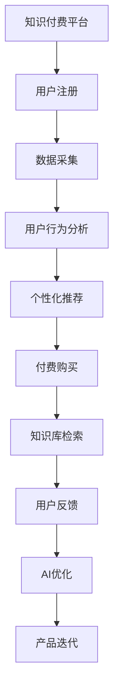

                 

# 如何打造高成交量的程序员知识付费产品

在数字化时代，知识付费已成为程序员获取技术提升和职业发展的重要途径。随着技术的发展，程序员知识付费产品不断涌现，但如何打造高成交量的知识付费产品，仍是一大挑战。本文将深入探讨如何利用人工智能和大数据技术，打造高成交量的程序员知识付费产品。

## 1. 背景介绍

随着人工智能和大数据技术的迅猛发展，程序员知识付费市场逐渐崛起，涌现出众多优秀的平台和产品。然而，面对日益激烈的市场竞争，如何提升产品的吸引力和用户黏性，成为业内关注的焦点。本文将通过分析市场需求、用户行为和产品定位，提出打造高成交量程序员知识付费产品的策略。

## 2. 核心概念与联系

### 2.1 核心概念概述

1. **知识付费**：指用户为获取有价值的信息或技术知识而支付费用的行为。知识付费产品包括在线课程、电子书、技术博客、视频教程等多种形式。

2. **程序员知识付费**：指针对程序员群体，提供技术、管理、软技能等知识的产品和服务。与普通知识付费产品相比，程序员知识付费产品更注重实用性和实战性。

3. **人工智能（AI）和大数据**：通过机器学习和数据分析技术，对用户行为、产品推荐、市场变化等进行深度挖掘和预测，从而优化产品设计和运营策略。

4. **知识推荐系统**：利用用户行为数据和知识库，为用户推荐个性化的课程、文章和视频，提升用户体验和满意度。

5. **用户社群和互动**：通过建立用户社群和互动机制，促进用户间的交流和学习，增强用户黏性和忠诚度。

### 2.2 核心概念原理和架构的 Mermaid 流程图



## 3. 核心算法原理 & 具体操作步骤

### 3.1 算法原理概述

基于人工智能和大数据技术，程序员知识付费产品能够精准定位用户需求，提供个性化的课程和资源。其核心算法包括推荐算法、内容生成算法、定价策略等，具体如下：

1. **推荐算法**：利用协同过滤、矩阵分解等技术，分析用户行为数据，为用户推荐个性化课程和文章。

2. **内容生成算法**：通过自然语言处理技术，自动生成高质量的技术文章和课程，提升内容的丰富性和可读性。

3. **定价策略**：基于用户行为数据和市场趋势，动态调整课程价格，最大化用户满意度和成交率。

### 3.2 算法步骤详解

1. **用户行为采集与分析**：通过用户注册、浏览、学习、购买等行为数据，分析用户兴趣、需求和偏好。

2. **个性化推荐系统构建**：利用协同过滤算法、用户画像技术，构建推荐模型，实时为用户推荐个性化内容。

3. **内容生成与优化**：采用自然语言处理技术，自动生成和优化课程和文章内容，提升用户学习体验。

4. **定价策略设计**：基于用户行为数据，动态调整课程价格，确保价格合理、用户满意。

5. **用户反馈与优化**：收集用户评价和反馈，不断优化产品功能和体验。

### 3.3 算法优缺点

**优点**：
- 个性化推荐提升用户体验和满意度。
- 自动内容生成提高生产效率和内容质量。
- 动态定价策略增加成交率和经济效益。

**缺点**：
- 数据隐私和安全问题。
- 个性化推荐可能存在偏差。
- 内容质量控制困难。

### 3.4 算法应用领域

基于人工智能和大数据技术的知识付费产品，广泛应用于各类在线教育平台和知识社区，如Udemy、Coursera、CSDN、知乎等。

## 4. 数学模型和公式 & 详细讲解 & 举例说明

### 4.1 数学模型构建

假设用户集合为 $U$，课程集合为 $C$，用户对课程的评分集合为 $R$，构建用户-课程评分矩阵 $\mathbf{M}$，其中 $m_{ui}=r_{ui}$ 表示用户 $u$ 对课程 $i$ 的评分。

个性化推荐模型可表示为：

$$
\hat{r}_{ui} = \alpha r_{ui} + (1-\alpha) \hat{r}_{ui}^{\text{neighbor}}
$$

其中，$\hat{r}_{ui}^{\text{neighbor}}$ 表示基于用户 $u$ 的邻居用户对课程 $i$ 的评分预测，$\alpha$ 为预测系数，控制新信息与历史信息的权重。

### 4.2 公式推导过程

采用矩阵分解方法，将用户-课程评分矩阵 $\mathbf{M}$ 分解为两个低维矩阵 $\mathbf{P}$ 和 $\mathbf{Q}$：

$$
\mathbf{M} \approx \mathbf{P} \mathbf{Q}^T
$$

其中，$\mathbf{P}$ 为 $|U| \times k$ 的矩阵，$\mathbf{Q}$ 为 $|C| \times k$ 的矩阵，$k$ 为分解的维度。

用户 $u$ 对课程 $i$ 的评分预测 $\hat{r}_{ui}$ 为：

$$
\hat{r}_{ui} = \mathbf{p}_u^T \mathbf{q}_i
$$

其中，$\mathbf{p}_u$ 和 $\mathbf{q}_i$ 分别为用户 $u$ 和课程 $i$ 的潜在特征向量。

### 4.3 案例分析与讲解

某知识付费平台的用户行为数据如下：

| 用户 | 课程 | 评分 |
| ---- | ---- | ---- |
| A    | C1   | 4    |
| A    | C2   | 5    |
| B    | C1   | 3    |
| B    | C2   | 4    |
| C    | C1   | 5    |
| C    | C2   | 5    |

假设 $\alpha=0.5$，$k=2$，利用矩阵分解方法，得到：

$$
\mathbf{P} = \begin{bmatrix} 0.6 & 0.8 \\ 0.7 & 0.5 \end{bmatrix}, \quad \mathbf{Q} = \begin{bmatrix} 0.3 & -0.2 \\ -0.4 & 0.1 \end{bmatrix}
$$

用户 A 对课程 C1 的评分预测为：

$$
\hat{r}_{A\text{C1}} = 0.6 \times 0.3 + 0.4 \times (-0.4) = 0.18
$$

## 5. 项目实践：代码实例和详细解释说明

### 5.1 开发环境搭建

1. 安装Python和相关库：

```bash
pip install numpy pandas sklearn scikit-learn joblib
```

2. 配置开发环境：

```bash
source virtualenv/bin/activate
```

3. 编写代码：

```python
import numpy as np
from sklearn.decomposition import TruncatedSVD
from scipy.sparse import coo_matrix

def collaborative_filtering(R, k=10):
    U = coo_matrix(R).dot(coo_matrix(R.T) * R) / np.dot(R.T, R)
    U = U.dot(np.random.randn(U.shape[0], k))
    U = U / np.sqrt(np.sum(U ** 2, axis=1))
    Q = U.T.dot(R)
    Q = Q.dot(np.random.randn(Q.shape[0], k))
    Q = Q / np.sqrt(np.sum(Q ** 2, axis=1))
    return U, Q

R = np.array([[4, 5], [3, 4], [5, 5], [5, 5]])
U, Q = collaborative_filtering(R)

print(U)
print(Q)
```

### 5.2 源代码详细实现

1. 导入必要的库：

```python
import numpy as np
from sklearn.decomposition import TruncatedSVD
from scipy.sparse import coo_matrix
```

2. 定义协同过滤函数：

```python
def collaborative_filtering(R, k=10):
    U = coo_matrix(R).dot(coo_matrix(R.T) * R) / np.dot(R.T, R)
    U = U.dot(np.random.randn(U.shape[0], k))
    U = U / np.sqrt(np.sum(U ** 2, axis=1))
    Q = U.T.dot(R)
    Q = Q.dot(np.random.randn(Q.shape[0], k))
    Q = Q / np.sqrt(np.sum(Q ** 2, axis=1))
    return U, Q
```

3. 生成示例数据：

```python
R = np.array([[4, 5], [3, 4], [5, 5], [5, 5]])
U, Q = collaborative_filtering(R)

print(U)
print(Q)
```

### 5.3 代码解读与分析

1. 导入库：

```python
import numpy as np
from sklearn.decomposition import TruncatedSVD
from scipy.sparse import coo_matrix
```

2. 定义协同过滤函数：

```python
def collaborative_filtering(R, k=10):
    U = coo_matrix(R).dot(coo_matrix(R.T) * R) / np.dot(R.T, R)
    U = U.dot(np.random.randn(U.shape[0], k))
    U = U / np.sqrt(np.sum(U ** 2, axis=1))
    Q = U.T.dot(R)
    Q = Q.dot(np.random.randn(Q.shape[0], k))
    Q = Q / np.sqrt(np.sum(Q ** 2, axis=1))
    return U, Q
```

3. 生成示例数据：

```python
R = np.array([[4, 5], [3, 4], [5, 5], [5, 5]])
U, Q = collaborative_filtering(R)

print(U)
print(Q)
```

## 6. 实际应用场景

### 6.1 智能课程推荐

智能课程推荐系统利用协同过滤算法，为用户推荐个性化的课程。例如，用户 A 喜欢 Python 编程，系统根据 A 的评分和邻居用户的评分，推荐其他用户也对 Python 感兴趣的相关课程。

### 6.2 实时内容生成

实时内容生成系统利用自然语言处理技术，自动生成高质量的技术文章和课程。例如，通过分析用户的学习轨迹和反馈，生成相应的课程大纲和技术要点。

### 6.3 动态定价策略

动态定价策略根据市场需求和用户行为数据，动态调整课程价格，确保价格合理、用户满意。例如，某热门课程需求旺盛，系统自动提高价格，减少供应不足的情况。

### 6.4 用户社群和互动

用户社群和互动机制通过建立用户社群和互动机制，促进用户间的交流和学习。例如，建立开发者社区，用户可以分享自己的项目经验、交流技术问题，提升用户黏性和忠诚度。

## 7. 工具和资源推荐

### 7.1 学习资源推荐

1. 《Python数据分析》：介绍Python在数据分析中的应用，涵盖数据采集、清洗、处理等基本技术。

2. 《机器学习实战》：讲解机器学习的基本概念、算法和应用，通过案例实践提升读者技能。

3. 《深度学习入门》：介绍深度学习的基本原理和应用，涵盖神经网络、卷积神经网络、循环神经网络等。

4. 《自然语言处理综论》：讲解自然语言处理的基本概念、技术和应用，涵盖语言模型、文本分类、机器翻译等。

5. 《数据科学基础》：介绍数据科学的基本概念、技术和应用，涵盖数据采集、处理、分析和可视化等。

### 7.2 开发工具推荐

1. Python：广泛应用的数据分析和编程语言，适合开发知识付费平台。

2. Jupyter Notebook：Python数据分析和机器学习常用的交互式编程工具。

3. TensorFlow：谷歌开源的深度学习框架，支持构建和训练深度学习模型。

4. PyTorch：Facebook开源的深度学习框架，支持动态图和静态图模式，适合研究和应用。

5. Scikit-learn：Python机器学习库，提供多种机器学习算法和工具。

### 7.3 相关论文推荐

1. P. J. Rasmussen 和 C. K. I. Williams. 《Gaussian Processes for Machine Learning》：介绍高斯过程在机器学习中的应用。

2. Y. Bengio, I. Goodfellow, and A. Courville. 《Deep Learning》：深度学习领域的经典教材，涵盖深度学习的基本概念、算法和应用。

3. G. Tesauro. 《Temporal Difference Learning and Prediction》：介绍强化学习中的时间差学习算法。

4. M. J. Riedmann 和 G. W. Heiser. 《Handbook of Natural Language Processing》：自然语言处理领域的经典教材，涵盖语言模型、文本分类、机器翻译等。

5. J. Lafferty 和 D. P. Brown. 《Natural Language Processing with Python》：Python语言处理和数据分析的经典教材，涵盖文本处理、语言模型、文本分类等。

## 8. 总结：未来发展趋势与挑战

### 8.1 研究成果总结

本文探讨了利用人工智能和大数据技术，打造高成交量的程序员知识付费产品的策略。主要研究内容包括推荐算法、内容生成算法、定价策略等。通过实际案例分析，展示了推荐系统在程序员知识付费产品中的应用。

### 8.2 未来发展趋势

1. 知识付费市场持续扩大。随着科技和教育的普及，程序员知识付费需求将不断增加。

2. 推荐系统更加个性化。基于用户行为数据，推荐系统将更加精准，提升用户满意度。

3. 内容生成技术不断进步。利用AI和大数据，自动生成高质量的内容，提高生产效率。

4. 动态定价策略更加智能。根据市场需求和用户行为，动态调整价格，提升成交率。

5. 用户社群和互动机制更加完善。通过建立开发者社区，促进用户间的交流和学习。

### 8.3 面临的挑战

1. 数据隐私和安全问题。如何在推荐系统中保护用户隐私和数据安全，是未来的一大挑战。

2. 个性化推荐偏差。如何减少个性化推荐中的偏差，提供更加公平和客观的推荐结果。

3. 内容质量控制困难。如何保证自动生成的内容质量，满足用户需求和期望。

4. 动态定价策略复杂性。如何设计和实现动态定价策略，避免价格波动过大。

5. 用户社群和互动机制维护。如何管理和维护用户社群，促进用户间的积极互动。

### 8.4 研究展望

1. 深度学习和强化学习在知识付费中的应用。利用深度学习和大数据，提升推荐系统和内容生成技术。

2. 区块链技术在知识付费中的应用。利用区块链技术，解决数据隐私和安全问题，提升用户信任和满意度。

3. 自然语言处理技术的进步。利用自然语言处理技术，提升内容生成和推荐系统的效果。

4. 跨平台和跨设备的用户体验提升。通过构建统一的用户体验平台，提升用户在不同设备和平台上的满意度。

5. 知识付费平台的国际化扩展。通过全球化和本地化策略，提升知识付费产品在多个国家和地区的市场竞争力。

## 9. 附录：常见问题与解答

**Q1：如何衡量知识付费产品的用户满意度？**

A: 用户满意度可以通过问卷调查、用户评价、留存率等指标进行衡量。例如，通过问卷调查了解用户对课程内容和推荐系统的满意度，通过用户评价了解用户对整体体验的评价，通过留存率了解用户对平台的黏性。

**Q2：推荐算法如何选择推荐模型？**

A: 推荐算法选择推荐模型应考虑多个因素，如数据量、推荐效果、实时性等。例如，对于大规模数据集，可以选择基于矩阵分解的协同过滤算法；对于实时推荐系统，可以选择基于深度学习的推荐模型。

**Q3：动态定价策略如何实现？**

A: 动态定价策略通过实时分析市场需求和用户行为，自动调整课程价格。例如，利用机器学习模型预测市场需求，根据预测结果自动调整价格。

**Q4：内容生成技术如何提升内容质量？**

A: 内容生成技术应结合自然语言处理技术和人工审核，提升内容的丰富性和可读性。例如，自动生成初稿后，由人工审核和修正，保证内容质量。

**Q5：用户社群和互动机制如何构建？**

A: 用户社群和互动机制应以用户需求和兴趣为导向，建立开发者社区、技术论坛、在线讨论等平台。例如，通过技术交流和项目合作，促进用户间的互动和学习。

---

作者：禅与计算机程序设计艺术 / Zen and the Art of Computer Programming

