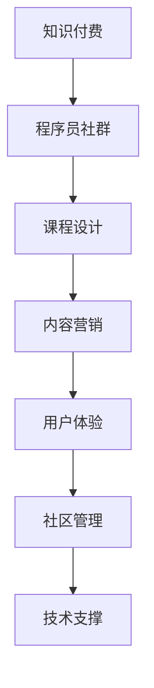

                 

# 如何打造高效的程序员知识付费社群

> 关键词：知识付费, 程序员社群, 社群建设, 在线学习, 课程设计, 内容营销, 用户体验, 社区管理

## 1. 背景介绍

### 1.1 问题由来
随着互联网技术的发展，知识付费成为连接内容创作者和知识消费者的新途径。尤其在程序员社区，优质的编程知识、经验分享、问题解答成为了程序员学习成长的重要资源。然而，现有的在线课程和社区往往难以适应程序员多元化的学习需求，存在课程质量参差不齐、互动性差、用户体验不佳等问题。因此，如何打造一个高效、专业、有吸引力的程序员知识付费社群，成为了一个重要的课题。

### 1.2 问题核心关键点
构建一个高效的程序员知识付费社群需要解决以下几个核心问题：
1. **课程内容的设计与迭代**：课程需要切中程序员的痛点和兴趣点，持续更新，确保时效性。
2. **用户体验的提升**：社群平台需要注重交互设计，提供友好的使用体验，增强用户黏性。
3. **高质量讲师团队**：邀请行业内的专家和有丰富实战经验的技术人员作为讲师，提升课程质量。
4. **有效的营销推广**：通过多种渠道宣传社群价值，吸引并留住更多高质量用户。
5. **社区管理与运营**：建立完善的社区规则和运营机制，营造积极的交流氛围。
6. **技术支撑与保障**：利用先进的技术手段，保障社群平台的高效稳定运行。

## 2. 核心概念与联系

### 2.1 核心概念概述

为更好地理解如何打造高效的程序员知识付费社群，本节将介绍几个密切相关的核心概念：

- **知识付费**：指通过付费获取专业知识和经验服务，而不仅仅是免费公开的互联网信息。知识付费强调深度、系统化和实用性的信息获取，与简单的网络浏览不同。

- **程序员社群**：指一群拥有共同职业兴趣和目标的程序员组成的社区，通过在线或线下的方式交流学习、分享经验。社群强调社区成员之间的互动和协作，形成一个共同进步的网络。

- **课程设计**：指根据目标用户的学习需求和特点，精心设计课程内容和结构，提供系统化、实战化的学习体验。课程设计需要符合程序员的学习习惯和认知规律。

- **内容营销**：指通过优质内容吸引潜在用户关注并促进用户转化。内容营销强调内容的价值导向和用户体验，旨在构建品牌形象和用户信任。

- **用户体验**：指用户在使用产品或服务时的感受和满意度。良好的用户体验可以提升用户忠诚度，增加用户粘性。

- **社区管理**：指通过建立明确的社区规则和运营机制，维护社区秩序，促进良性交流。社区管理需要平衡用户自由和社区秩序的关系。

- **技术支撑**：指利用先进的技术手段，提升社群平台的性能、稳定性和安全性，提供高效便捷的使用体验。技术支撑包括但不限于云计算、大数据、人工智能等。

这些核心概念之间的逻辑关系可以通过以下Mermaid流程图来展示：



这个流程图展示了一个程序员知识付费社群的构建过程：

1. 知识付费为社群提供服务模式和商业模式。
2. 课程设计确保内容的质量和系统性。
3. 内容营销吸引并留住用户。
4. 用户体验提升用户黏性和满意度。
5. 社区管理保障社群秩序和良性互动。
6. 技术支撑提供高效稳定的平台支持。

这些概念共同构成了程序员知识付费社群的完整框架，确保其能够高效、专业地服务于程序员群体。

## 3. 核心算法原理 & 具体操作步骤

### 3.1 算法原理概述

构建高效的程序员知识付费社群，本质上是一个多学科交叉、多因素综合优化的过程。其核心思想是通过系统化的课程设计、内容营销、用户体验优化、社区管理和技术支撑，打造一个可持续发展的社群生态。

### 3.2 算法步骤详解

构建高效程序员知识付费社群的具体步骤如下：

**Step 1: 需求调研与目标设定**

- 进行市场调研，收集目标用户的实际需求和痛点，制定社群目标和课程体系。

**Step 2: 课程设计与迭代**

- 邀请行业专家和有经验的程序员设计课程内容，确保课程的实用性和时效性。
- 通过用户反馈和市场调研，不断迭代课程内容，保持课程体系的更新和优化。

**Step 3: 用户体验优化**

- 对社群平台进行用户界面和交互设计，提供简洁、直观、易用的操作体验。
- 引入用户反馈机制，持续优化用户体验，提升用户满意度。

**Step 4: 内容营销推广**

- 利用社交媒体、搜索引擎优化(Search Engine Optimization, SEO)、邮件营销等多种手段，提升社群知名度和吸引力。
- 发布高质量的案例分析、技术文章、视频课程等，吸引潜在用户加入。

**Step 5: 社区管理与运营**

- 制定明确的社区规则，鼓励积极互动和知识共享。
- 引入专家团队，进行问题解答和课程指导，提升社群活跃度。

**Step 6: 技术支撑与保障**

- 采用云计算、大数据、人工智能等技术手段，保障社群平台的稳定性和高效性。
- 定期进行技术更新和维护，确保平台安全可靠。

**Step 7: 持续改进与反馈**

- 通过数据分析和用户反馈，不断优化社群运营策略和课程设计。
- 定期举办社区活动，提升用户参与度和忠诚度。

### 3.3 算法优缺点

高效程序员知识付费社群具有以下优点：
1. **专业性高**：借助行业专家的知识和实战经验，提供高质量的课程内容。
2. **互动性强**：通过社区平台促进用户之间的交流和合作，形成良好的学习氛围。
3. **技术保障**：利用先进技术手段，确保平台的稳定性和用户体验。
4. **高效学习**：提供系统化、实战化的学习路径，帮助用户快速掌握技能。

同时，该方法也存在以下局限性：
1. **依赖优质师资**：高质量的讲师和专家资源有限，课程设计可能受制于师资团队的规模和能力。
2. **运营成本高**：社群平台的建设和维护需要投入大量人力物力，运营成本较高。
3. **市场竞争激烈**：知识付费市场竞争激烈，如何保持竞争力是一大挑战。
4. **用户体验提升难度大**：提升用户体验需要持续的优化和迭代，过程复杂且耗时较长。

尽管存在这些局限性，但高效程序员知识付费社群的构建思路仍是大有可为的。未来相关研究的重点在于如何进一步优化课程设计，降低运营成本，提升用户体验，同时兼顾内容的实用性和互动性。

### 3.4 算法应用领域

高效程序员知识付费社群的构建思路，可以广泛应用于在线教育、企业内部培训、技术交流等多个领域。具体而言：

- **在线教育**：通过平台化的方式，提供系统化的编程课程和实战项目，帮助学生和自学者快速提升技能。
- **企业内部培训**：为公司员工提供定制化的技术培训，提升团队的技术水平和合作效率。
- **技术交流**：为程序员提供一个交流技术经验、分享项目心得的平台，促进技术进步。
- **开发者社区**：为开源项目开发者提供一个交流、协作的平台，推动社区生态的良性发展。

除了上述这些常见应用外，高效程序员知识付费社群还可以创新性地应用到更多场景中，如技术问答、技术招聘、技术创业等，为程序员提供全方位的技术支持和职业发展平台。

## 4. 数学模型和公式 & 详细讲解 & 举例说明（备注：数学公式请使用latex格式，latex嵌入文中独立段落使用 $$，段落内使用 $)
### 4.1 数学模型构建

本节将使用数学语言对构建高效程序员知识付费社群的过程进行更加严格的刻画。

记目标用户数量为 $N$，社群总收益为 $R$，课程内容质量为 $Q$，用户体验满意度为 $U$，社区活跃度为 $A$，运营成本为 $C$。则社群的净收益 $P$ 可以表示为：

$$
P = R - C = N \cdot Q \cdot U \cdot A - C
$$

其中，$N$ 可以通过市场调研和用户反馈进行估算，$Q$ 可以通过专家评审和市场反馈进行评估，$U$ 和 $A$ 需要通过用户体验调研和社区运营数据分析得到，$C$ 包括平台建设和维护成本、讲师薪资、技术支撑等费用。

### 4.2 公式推导过程

为了最大化社群净收益 $P$，我们需要优化以下关键因素：

1. **用户需求匹配**：$Q$ 的优化，即课程内容要切中目标用户的学习需求和兴趣点。

2. **用户体验提升**：$U$ 的优化，即通过友好的界面设计和易用的功能提升用户体验。

3. **社区活跃度增强**：$A$ 的优化，即通过互动和合作机制促进社区成员的活跃度和参与度。

4. **运营成本控制**：$C$ 的优化，即通过合理的平台搭建和技术支持，降低运营成本。

通过优化这些关键因素，可以最大化社群净收益 $P$，实现社群的高效运营和发展。

### 4.3 案例分析与讲解

以某在线编程社区为例，分析其构建高效社群的过程：

1. **需求调研与目标设定**：通过问卷调查和用户访谈，收集目标用户的编程需求和兴趣点，制定社区和课程目标。

2. **课程设计与迭代**：邀请知名程序员和专家设计课程内容，确保课程的实用性和时效性。通过社区反馈，不断迭代课程内容，保持课程体系的更新和优化。

3. **用户体验优化**：对社区平台进行用户界面和交互设计，提供简洁、直观、易用的操作体验。引入用户反馈机制，持续优化用户体验，提升用户满意度。

4. **内容营销推广**：利用社交媒体、搜索引擎优化(SEO)、邮件营销等多种手段，提升社群知名度和吸引力。发布高质量的案例分析、技术文章、视频课程等，吸引潜在用户加入。

5. **社区管理与运营**：制定明确的社区规则，鼓励积极互动和知识共享。引入专家团队，进行问题解答和课程指导，提升社群活跃度。

6. **技术支撑与保障**：采用云计算、大数据、人工智能等技术手段，保障社区平台的稳定性和高效性。定期进行技术更新和维护，确保平台安全可靠。

7. **持续改进与反馈**：通过数据分析和用户反馈，不断优化社群运营策略和课程设计。定期举办社区活动，提升用户参与度和忠诚度。

通过以上步骤，该在线编程社区成功地吸引了大量用户，提供了高质量的编程课程，提升了用户体验，增强了社区活跃度，实现了高效的运营和发展。

## 5. 项目实践：代码实例和详细解释说明
### 5.1 开发环境搭建

在进行社群构建和运营实践前，我们需要准备好开发环境。以下是使用Python进行Django开发的环境配置流程：

1. 安装Anaconda：从官网下载并安装Anaconda，用于创建独立的Python环境。

2. 创建并激活虚拟环境：
```bash
conda create -n django-env python=3.8 
conda activate django-env
```

3. 安装Django：
```bash
pip install django
```

4. 安装各类工具包：
```bash
pip install numpy pandas scikit-learn matplotlib tqdm jupyter notebook ipython
```

完成上述步骤后，即可在`django-env`环境中开始社群构建和运营实践。

### 5.2 源代码详细实现

下面我们以一个简单的编程社区为例，给出使用Django进行社群构建和运营的PyTorch代码实现。

首先，定义Django应用和模型：

```python
from django.contrib import admin
from django.urls import path
from . import views
from .models import User, Post

urlpatterns = [
    path('admin/', admin.site.urls),
    path('', views.index, name='index'),
    path('post/<int:id>', views.post_detail, name='post_detail'),
    path('post/new', views.post_new, name='post_new'),
]

class Post(models.Model):
    title = models.CharField(max_length=200)
    content = models.TextField()
    author = models.ForeignKey(User, on_delete=models.CASCADE)
    created_at = models.DateTimeField(auto_now_add=True)
    updated_at = models.DateTimeField(auto_now=True)

admin.site.register(Post)
```

然后，定义视图函数：

```python
from django.shortcuts import render, redirect
from django.contrib.auth.decorators import login_required
from django.contrib.auth import login, authenticate
from .models import Post, User

@login_required
def index(request):
    posts = Post.objects.all().order_by('-created_at')
    return render(request, 'index.html', {'posts': posts})

@login_required
def post_detail(request, id):
    post = Post.objects.get(id=id)
    return render(request, 'post_detail.html', {'post': post})

@login_required
def post_new(request):
    if request.method == 'POST':
        title = request.POST['title']
        content = request.POST['content']
        post = Post(title=title, content=content, author=request.user)
        post.save()
        return redirect('index')
    else:
        return render(request, 'post_new.html')
```

最后，启动Django服务器并进行测试：

```bash
python manage.py runserver
```

在浏览器中访问 `http://localhost:8000`，即可看到一个简单的编程社区主页。

### 5.3 代码解读与分析

让我们再详细解读一下关键代码的实现细节：

**models.py**：
- 定义了用户和帖子的模型，包括标题、内容、作者、创建和更新时间等属性。

**views.py**：
- 定义了主页、帖子的详情页和新增帖子的视图函数，通过模板渲染返回对应的HTML页面。
- 使用`@login_required`装饰器，确保用户登录后才能访问相关页面。

**urls.py**：
- 定义了应用路由，将URL请求映射到相应的视图函数。

**settings.py**：
- 配置Django应用的设置，如数据库连接、静态文件路径等。

以上代码实现了一个基本的编程社区功能，包括用户登录、新增帖子、查看帖子详情等。在实际应用中，还需要进一步扩展和优化，如用户认证、帖子评论、邮件通知等。

## 6. 实际应用场景

### 6.1 智能客服系统

基于高效程序员知识付费社群构建的智能客服系统，可以广泛应用于企业的技术支持和客户服务。传统客服往往需要配备大量人力，高峰期响应缓慢，且一致性和专业性难以保证。而使用社群构建的智能客服系统，可以7x24小时不间断服务，快速响应客户咨询，用专业化的技术知识解答各类复杂问题。

在技术实现上，可以收集企业内部的历史客服对话记录，将问题和最佳答复构建成监督数据，在此基础上对社群构建的智能客服模型进行微调。微调后的模型能够自动理解用户意图，匹配最合适的答复模板进行回复。对于客户提出的新问题，还可以接入检索系统实时搜索相关内容，动态组织生成回答。如此构建的智能客服系统，能大幅提升客户咨询体验和问题解决效率。

### 6.2 金融舆情监测

金融机构需要实时监测市场舆论动向，以便及时应对负面信息传播，规避金融风险。传统的人工监测方式成本高、效率低，难以应对网络时代海量信息爆发的挑战。基于高效程序员知识付费社群构建的文本分类和情感分析技术，为金融舆情监测提供了新的解决方案。

具体而言，可以收集金融领域相关的新闻、报道、评论等文本数据，并对其进行主题标注和情感标注。在此基础上对社群构建的智能客服模型进行微调，使其能够自动判断文本属于何种主题，情感倾向是正面、中性还是负面。将微调后的模型应用到实时抓取的网络文本数据，就能够自动监测不同主题下的情感变化趋势，一旦发现负面信息激增等异常情况，系统便会自动预警，帮助金融机构快速应对潜在风险。

### 6.3 个性化推荐系统

当前的推荐系统往往只依赖用户的历史行为数据进行物品推荐，无法深入理解用户的真实兴趣偏好。基于高效程序员知识付费社群构建的个性化推荐系统，可以更好地挖掘用户行为背后的语义信息，从而提供更精准、多样的推荐内容。

在实践中，可以收集用户浏览、点击、评论、分享等行为数据，提取和用户交互的物品标题、描述、标签等文本内容。将文本内容作为模型输入，用户的后续行为（如是否点击、购买等）作为监督信号，在此基础上微调社群构建的智能客服模型。微调后的模型能够从文本内容中准确把握用户的兴趣点。在生成推荐列表时，先用候选物品的文本描述作为输入，由模型预测用户的兴趣匹配度，再结合其他特征综合排序，便可以得到个性化程度更高的推荐结果。

### 6.4 未来应用展望

随着高效程序员知识付费社群的不断发展，其在更多领域的应用前景将会更加广阔。

在智慧医疗领域，基于社群构建的智能客服模型，可以为患者提供24小时在线咨询和健康指导，辅助医生诊疗，加速新药开发进程。

在智能教育领域，社群构建的在线学习平台，可以为学生和自学者提供系统化、实战化的编程课程，因材施教，促进教育公平，提高教学质量。

在智慧城市治理中，社群构建的智能客服模型，可以应用于城市事件监测、舆情分析、应急指挥等环节，提高城市管理的自动化和智能化水平，构建更安全、高效的未来城市。

此外，在企业生产、社会治理、文娱传媒等众多领域，社群构建的知识付费平台也将不断涌现，为传统行业数字化转型升级提供新的技术路径。相信随着技术的日益成熟，社群知识付费平台必将在构建人机协同的智能时代中扮演越来越重要的角色。

## 7. 工具和资源推荐

### 7.1 学习资源推荐

为了帮助开发者系统掌握高效程序员知识付费社群的理论基础和实践技巧，这里推荐一些优质的学习资源：

1. **《深度学习框架TensorFlow实战》**：全面介绍了TensorFlow的使用方法和应用场景，涵盖图像处理、自然语言处理等多个领域。

2. **《Django Web开发实战》**：系统讲解了Django框架的使用和最佳实践，适合构建Web应用和API服务。

3. **《Python网络编程》**：介绍了Python在网络编程中的应用，包括HTTP协议、WebSocket、RESTful API等。

4. **《自然语言处理综述》**：综述了自然语言处理领域的经典算法和应用，适合初学者和进阶学习者。

5. **《知识图谱技术与应用》**：介绍了知识图谱的基本概念、构建方法和应用场景，适合应用于智能客服、推荐系统等领域。

通过对这些资源的学习实践，相信你一定能够快速掌握高效程序员知识付费社群的构建方法，并用于解决实际的NLP问题。

### 7.2 开发工具推荐

高效的开发离不开优秀的工具支持。以下是几款用于知识付费社群开发的常用工具：

1. **Django**：开源的Python Web框架，提供快速开发和可扩展性，适用于构建社区平台和API服务。

2. **Flask**：轻量级的Python Web框架，适用于构建小型应用和API接口。

3. **PostgreSQL**：开源的SQL数据库，适用于构建高效的数据存储和查询系统。

4. **Redis**：开源的内存数据库，适用于缓存和实时消息处理。

5. **Elasticsearch**：开源的搜索和分析引擎，适用于构建全文搜索和数据分析平台。

6. **RabbitMQ**：开源的消息队列，适用于异步任务处理和分布式系统。

合理利用这些工具，可以显著提升知识付费社群的开发效率，加快创新迭代的步伐。

### 7.3 相关论文推荐

高效程序员知识付费社群的发展源于学界的持续研究。以下是几篇奠基性的相关论文，推荐阅读：

1. **《Web应用开发模式与架构》**：介绍了Web应用开发的常用模式和架构，适合构建高效社区平台。

2. **《机器学习与人工智能：应用与实践》**：综述了机器学习在自然语言处理、推荐系统等领域的应用。

3. **《自然语言处理基础与实践》**：系统讲解了自然语言处理的基础知识和应用方法，适合初学者和进阶学习者。

4. **《知识图谱：构建与应用》**：介绍了知识图谱的基本概念、构建方法和应用场景，适合应用于智能客服、推荐系统等领域。

这些论文代表了大语言模型微调技术的发展脉络。通过学习这些前沿成果，可以帮助研究者把握学科前进方向，激发更多的创新灵感。

## 8. 总结：未来发展趋势与挑战

### 8.1 总结

本文对如何打造高效的程序员知识付费社群进行了全面系统的介绍。首先阐述了社群构建的背景和目标，明确了构建社群的关键要素。其次，从原理到实践，详细讲解了社群的构建过程和优化策略，给出了知识付费社群构建的完整代码实例。同时，本文还广泛探讨了社群在多个行业领域的应用前景，展示了社群的巨大潜力。此外，本文精选了社群构建的关键学习资源和开发工具，力求为读者提供全方位的技术指引。

通过本文的系统梳理，可以看到，高效程序员知识付费社群的构建思路已经在多个领域得到了应用，并取得了显著的成效。未来，随着技术的发展和应用的深化，社群构建必将在更多领域得到推广，成为连接开发者和用户的桥梁，助力技术知识的传播和应用。

### 8.2 未来发展趋势

展望未来，高效程序员知识付费社群将呈现以下几个发展趋势：

1. **社区生态多元化**：随着知识付费平台的发展，社区生态将更加丰富和多样化，涵盖编程、设计、数据科学等多个领域。

2. **内容创新与多样化**：知识付费内容将更加注重创新和多样性，涵盖实战案例、技术讲座、编程挑战等多个方向，满足不同用户的需求。

3. **技术融合与协同**：知识付费平台将与人工智能、大数据等技术进行深度融合，提升内容的智能化和个性化水平，增强用户体验。

4. **交互式学习模式**：社区将引入更多互动和协作机制，如在线编程练习、协同开发、开源项目合作等，促进用户之间的交流和合作。

5. **全球化与本地化**：知识付费平台将走向全球化，同时兼顾本地化需求，提供多语言支持和文化适配，扩大全球用户基础。

以上趋势凸显了高效程序员知识付费社群的广阔前景。这些方向的探索发展，必将进一步提升社群的吸引力，吸引更多高质量用户，促进技术知识的传播和应用。

### 8.3 面临的挑战

尽管高效程序员知识付费社群已经取得了显著的成就，但在迈向更加智能化、普适化应用的过程中，它仍面临着诸多挑战：

1. **内容质量与多样性**：如何保证社群内容的高质量与多样性，避免过度商业化和同质化，需要持续的内容创新和管理。

2. **用户黏性与忠诚度**：如何提升用户黏性和忠诚度，避免用户流失，需要不断优化用户体验和社区氛围。

3. **技术保障与隐私保护**：如何确保社群平台的安全稳定运行，保护用户数据隐私，需要先进的技术支撑和严格的隐私保护措施。

4. **市场竞争**：如何在激烈的市场竞争中保持优势，吸引更多高质量用户，需要持续的创新和优化。

5. **运营成本**：如何控制社群运营成本，确保平台可持续运营，需要有效的商业模式和管理策略。

6. **法规合规**：如何在全球范围内合规运营，避免知识产权侵权、数据泄露等法律风险，需要严格遵守相关法律法规。

这些挑战凸显了社群构建和运营的复杂性和多样性，需要综合运用技术、管理、法律等多方面的资源和手段，方能实现高效、可持续的发展。

### 8.4 研究展望

面对社群构建和运营面临的种种挑战，未来的研究需要在以下几个方面寻求新的突破：

1. **内容质量优化**：通过用户评价和专家评审，持续优化内容质量，确保社群内容的多样性和实用性。

2. **用户粘性提升**：引入更多互动和协作机制，如实时讨论、在线编程练习、开源项目合作等，增强用户粘性。

3. **技术保障升级**：采用先进的技术手段，如云计算、大数据、人工智能等，保障社群平台的高效稳定运行，保护用户隐私。

4. **市场竞争策略**：通过差异化内容和独特运营模式，在激烈的市场竞争中保持优势，吸引更多高质量用户。

5. **运营成本控制**：探索多元化的商业模式，如会员制、广告变现、企业合作等，降低运营成本，实现可持续发展。

6. **法规合规管理**：严格遵守相关法律法规，保护用户隐私和知识产权，建立良好的品牌形象和用户信任。

这些研究方向的探索，必将引领高效程序员知识付费社群走向更加成熟和稳定，为技术知识的传播和应用提供更广阔的舞台。面向未来，社群构建需要更加注重内容的深度和多样性，提升用户互动和合作水平，通过技术手段和多元化的商业模式，实现高效、可持续发展。只有勇于创新、敢于突破，才能不断拓展社群的边界，让知识付费平台成为连接开发者和用户的桥梁，促进技术知识的广泛传播和应用。

## 9. 附录：常见问题与解答

**Q1：社群构建和运营需要哪些关键资源？**

A: 社群构建和运营需要以下关键资源：
1. **高质量讲师团队**：邀请行业专家和有经验的程序员作为讲师，提升课程内容的质量。
2. **先进技术平台**：采用云计算、大数据、人工智能等技术，保障平台的稳定性和高效性。
3. **丰富用户资源**：收集目标用户的实际需求和痛点，制定社群目标和课程体系。
4. **多样化内容资源**：提供系统化、实战化的课程内容和多样化的互动方式，满足不同用户的需求。
5. **严格管理体系**：建立明确的社区规则和运营机制，维护社区秩序和良性互动。

**Q2：如何提升社群的用户黏性？**

A: 提升社群的用户黏性需要多方面的努力：
1. **内容质量**：提供高质量、实用的课程内容和互动方式，满足用户需求。
2. **社区氛围**：营造积极的社区氛围，鼓励用户互动和知识共享。
3. **用户体验**：提升平台的用户界面和操作体验，降低用户使用门槛。
4. **活动策划**：定期举办线上线下活动，提升用户参与度和忠诚度。
5. **个性化推荐**：通过数据分析，提供个性化的课程推荐和内容展示。

**Q3：社群构建和运营中常见的技术难题有哪些？**

A: 社群构建和运营中常见的技术难题包括：
1. **数据存储与处理**：需要高效存储和处理大量用户数据，保证数据安全和隐私保护。
2. **平台扩展性**：需要具备良好的扩展性，支持大规模用户和内容上传。
3. **内容管理**：需要高效的内容管理机制，确保内容的更新和优化。
4. **性能优化**：需要优化平台性能，提升响应速度和用户体验。
5. **安全性保障**：需要保障平台的安全性和稳定性，防止数据泄露和攻击。

**Q4：社群构建和运营中的关键管理策略有哪些？**

A: 社群构建和运营中的关键管理策略包括：
1. **用户管理**：建立完善的用户管理体系，进行身份认证和权限管理。
2. **内容管理**：建立严格的内容审核机制，确保内容的健康和合法性。
3. **活动管理**：组织和策划各类活动，提升用户参与度和社区活跃度。
4. **数据分析**：通过数据分析，了解用户行为和需求，优化社群运营策略。
5. **社区规则**：制定明确的社区规则，维护社区秩序和良性互动。

**Q5：社群构建和运营中如何处理用户反馈？**

A: 处理用户反馈需要以下步骤：
1. **收集反馈**：通过在线调查、用户访谈等方式，收集用户的意见和建议。
2. **分析反馈**：对收集到的反馈进行分类和分析，找出共性问题和改进方向。
3. **改进措施**：根据分析结果，制定相应的改进措施，并优先处理关键问题。
4. **反馈闭环**：及时向用户反馈改进措施的实施情况，增强用户信任和满意度。

通过以上问题与解答，相信你对高效程序员知识付费社群的构建和运营有了更全面的理解。希望这些经验和建议能够帮助你在实际工作中顺利开展社群构建和运营，为技术知识的传播和应用贡献力量。

---

作者：禅与计算机程序设计艺术 / Zen and the Art of Computer Programming

