                 

# 如何打造高粘性知识付费社群

## 1. 背景介绍

### 1.1 问题由来

在互联网的浪潮下，知识付费已成为一种新的内容消费形式，深受广大知识工作者和爱好者的青睐。然而，随着在线内容的海量增加，用户对知识付费社群的粘性需求日益增加。如何打造高粘性、可持续发展的知识付费社群，成为目前互联网企业面临的重要挑战。

### 1.2 问题核心关键点

打造高粘性知识付费社群的核心在于：

1. **高质量内容**：社群内容应该具有高价值、高专业性，能够持续吸引用户参与和学习。
2. **用户互动**：社群内的用户应该能够积极互动，形成良性交流的社区氛围。
3. **技术支持**：需要充分利用现代技术手段，如大数据、人工智能等，提升社群运营效率和用户体验。
4. **商业化模式**：构建合理的商业化模式，确保社群的可持续发展。
5. **社区管理**：有效的社群管理和运营，维护社群秩序，提升用户体验。

本文将围绕这些核心点，系统阐述如何构建高粘性的知识付费社群。

## 2. 核心概念与联系

### 2.1 核心概念概述

为了更好地理解如何打造高粘性知识付费社群，本节将介绍几个关键概念：

- **知识付费社群**：以知识分享为核心，通过在线平台聚集相关领域专家和爱好者，提供高质量内容并促进用户互动的社区。
- **内容生产者**：在知识付费社群中，生产和传播知识内容的关键角色，如专家、学者、行业从业者等。
- **内容消费者**：知识付费社群的主要用户群体，通过订阅、购买等方式获取并消费知识内容。
- **社区管理**：社群的运营团队，负责社区的规则制定、用户管理、内容审核等工作。
- **用户粘性**：用户在社群中停留时间和参与度的衡量指标，体现社群的吸引力和用户忠诚度。

这些核心概念之间的逻辑关系可以通过以下Mermaid流程图来展示：

```mermaid
graph TB
    A[知识付费社群] --> B[内容生产者]
    A --> C[内容消费者]
    A --> D[社区管理]
    B --> E[内容创造]
    B --> F[内容传播]
    D --> G[规则制定]
    D --> H[用户管理]
    D --> I[内容审核]
    E --> J[互动交流]
    J --> K[反馈机制]
    G --> L[成员参与]
    L --> M[用户体验]
    M --> N[粘性提升]
```



这个流程图展示知识付费社群的关键要素及其之间的关系：

1. 知识付费社群通过内容生产者创造高质量内容。
2. 内容消费者通过订阅等方式获取内容。
3. 社区管理负责规则制定和用户管理，确保社群秩序。
4. 内容生产者与消费者之间通过互动交流进行沟通。
5. 反馈机制用于收集用户意见，持续优化内容。
6. 规则制定和用户体验的优化提升用户粘性。

这些核心概念共同构成了知识付费社群的运营框架，使其能够持续提供有价值的知识服务。

## 3. 核心算法原理 & 具体操作步骤

### 3.1 算法原理概述

打造高粘性知识付费社群的算法原理主要围绕以下几个方面：

1. **用户画像构建**：通过大数据技术分析用户行为和偏好，构建用户画像，精准推荐个性化内容。
2. **内容推荐算法**：利用机器学习算法，根据用户画像和内容特征，进行个性化内容推荐，提升用户体验。
3. **社群互动激励**：设计互动机制，如积分、排行榜、荣誉体系等，鼓励用户积极参与互动。
4. **社群粘性分析**：通过用户行为数据和互动数据，分析社群的粘性指标，不断优化社群运营策略。

### 3.2 算法步骤详解

构建高粘性知识付费社群主要包括以下几个步骤：

**Step 1: 用户画像构建**
- 收集用户基本信息，如注册时间、活跃时间、消费习惯等。
- 通过大数据技术，如用户行为数据分析、文本情感分析等，提取用户画像特征。
- 使用机器学习算法，如K-means聚类、PCA降维等，构建用户画像模型。

**Step 2: 内容推荐算法**
- 将内容进行特征提取，如标题、摘要、关键词等。
- 根据用户画像和内容特征，构建推荐算法模型，如协同过滤、基于内容的推荐等。
- 使用召回率和准确率等指标评估推荐系统效果，并进行模型优化。

**Step 3: 社群互动激励**
- 设计互动机制，如积分系统、排行榜、荣誉体系等。
- 通过积分奖励、荣誉激励等方式，鼓励用户积极参与互动。
- 设置互动阈值，对高互动用户给予特殊待遇，如VIP、讲师资格等。

**Step 4: 社群粘性分析**
- 收集用户行为数据，如学习时间、互动次数等。
- 通过分析用户粘性指标，如活跃度、留存率、复购率等，评估社群运营效果。
- 根据分析结果，调整社群运营策略，如内容更新、活动策划等。

### 3.3 算法优缺点

打造高粘性知识付费社群的算法主要具备以下优点：

1. **个性化推荐**：通过大数据和机器学习技术，能够根据用户个性化需求推荐优质内容，提升用户粘性。
2. **高效运营**：自动化推荐和互动机制，减轻社区管理负担，提高运营效率。
3. **用户粘性分析**：实时分析用户行为数据，及时调整运营策略，确保社群持续健康发展。

同时，这些算法也存在一些局限性：

1. **数据依赖性强**：高质量的推荐和粘性分析需要大量的用户行为数据，数据获取成本较高。
2. **模型复杂度高**：推荐和互动算法模型复杂，模型调参和优化难度较大。
3. **用户隐私问题**：用户数据隐私保护和用户画像构建之间的平衡需要慎重处理。

尽管存在这些局限性，但利用算法手段打造高粘性知识付费社群，在提升用户满意度和社群活跃度方面具有显著优势。

### 3.4 算法应用领域

高粘性知识付费社群的算法原理在多个领域有广泛应用：

1. **在线教育平台**：通过个性化推荐和互动激励，提升学生学习效果和平台粘性。
2. **企业培训系统**：通过知识付费社群的运营，满足企业员工的个性化学习需求，提升培训效果。
3. **健康管理平台**：通过专家社区和知识付费内容，提升用户健康管理意识和粘性。
4. **职业发展平台**：通过职业知识付费社群，帮助用户获取职业发展所需的知识和技能。
5. **文化娱乐平台**：通过专家讲座和知识付费内容，丰富用户精神文化生活。

这些领域的应用表明，基于算法的高粘性知识付费社群模式具有广泛的市场前景。

## 4. 数学模型和公式 & 详细讲解 & 举例说明

### 4.1 数学模型构建

本节将使用数学语言对高粘性知识付费社群的推荐算法进行更加严格的刻画。

假设知识付费社群中有 $N$ 个用户和 $M$ 个内容，分别记为 $U=\{u_1,u_2,\ldots,u_N\}$ 和 $C=\{c_1,c_2,\ldots,c_M\}$。用户对内容的评分记为 $R(u,c) \in [0,1]$，其中 $0$ 表示完全不感兴趣，$1$ 表示非常感兴趣。

模型的目标是通过用户和内容的评分数据，预测每个用户对每个内容的评分，即：

$$
\hat{R}_{u,c} = f(R_{u,c},u,\mathcal{F})
$$

其中 $f$ 是评分预测函数，$\mathcal{F}$ 是特征集合，$R_{u,c}$ 是实际评分，$\hat{R}_{u,c}$ 是预测评分。

### 4.2 公式推导过程

我们以协同过滤算法为例，推导推荐系统预测评分的公式。

设用户 $u$ 对内容 $c$ 的评分记为 $R_{u,c}$，内容 $c$ 的评分向量记为 $R_c=[R_{c_1},R_{c_2},\ldots,R_{c_M}]$。用户 $u$ 的评分向量记为 $R_u=[R_{u_1},R_{u_2},\ldots,R_{u_M}]$。

协同过滤算法通过计算用户 $u$ 对内容 $c$ 的评分，公式为：

$$
\hat{R}_{u,c} = \frac{\sum_{c'\in C}\alpha_{u,c'}R_{c'}R_{u,c'}}{\sqrt{\sum_{c'\in C}R_{c'}^2} \sqrt{\sum_{c'\in C}R_{u,c'}^2}}
$$

其中 $\alpha_{u,c'}$ 是用户 $u$ 和内容 $c'$ 的相似度系数，可以根据余弦相似度等方法计算。

### 4.3 案例分析与讲解

假设我们有一个包含1000名用户和5000篇内容的知识付费社群。用户 $u_1$ 对内容 $c_1$ 的评分为 $0.9$，对内容 $c_2$ 的评分为 $0.7$，对内容 $c_3$ 的评分为 $0.5$。内容 $c_1$ 的评分为 $0.8, 0.6, 0.5, 0.4, 0.3$，内容 $c_2$ 的评分为 $0.7, 0.6, 0.5, 0.4, 0.3$，内容 $c_3$ 的评分为 $0.6, 0.5, 0.4, 0.3, 0.2$。

我们采用余弦相似度计算用户 $u_1$ 和内容 $c_3$ 的相似度 $\alpha_{1,3}$：

$$
\alpha_{1,3} = \frac{\sum_{c'\in C}R_{1,c'}R_{3,c'}}{\sqrt{\sum_{c'\in C}R_{1,c'}^2} \sqrt{\sum_{c'\in C}R_{3,c'}^2}} = \frac{0.9\times0.6 + 0.7\times0.5 + 0.5\times0.4}{\sqrt{0.9^2+0.7^2+0.5^2} \sqrt{0.6^2+0.5^2+0.4^2}} \approx 0.7
$$

使用上述协同过滤算法，计算用户 $u_1$ 对内容 $c_3$ 的预测评分：

$$
\hat{R}_{1,3} = \frac{\alpha_{1,3}R_3R_1}{\sqrt{\sum_{c'\in C}R_{c'}^2} \sqrt{\sum_{c'\in C}R_{1,c'}^2}} = \frac{0.7\times0.5\times0.9}{\sqrt{0.8^2+0.6^2+0.5^2+0.4^2+0.3^2} \sqrt{0.9^2+0.7^2+0.5^2}} \approx 0.5
$$

这样，我们得到了用户 $u_1$ 对内容 $c_3$ 的预测评分 $0.5$，可作为推荐系统的推荐结果。

## 5. 项目实践：代码实例和详细解释说明

### 5.1 开发环境搭建

在进行高粘性知识付费社群的开发时，我们需要准备好开发环境。以下是使用Python进行开发的环境配置流程：

1. 安装Anaconda：从官网下载并安装Anaconda，用于创建独立的Python环境。

2. 创建并激活虚拟环境：
```bash
conda create -n pythontest python=3.8 
conda activate pythontest
```

3. 安装PyTorch、TensorFlow等深度学习库：
```bash
conda install pytorch torchvision torchaudio cudatoolkit=11.1 -c pytorch -c conda-forge
conda install tensorflow tensorflow-gpu -c pytorch -c conda-forge
```

4. 安装Flask、SQLAlchemy等web开发库：
```bash
conda install flask sqlalchemy 
```

5. 安装pandas、numpy等数据分析库：
```bash
conda install pandas numpy 
```

完成上述步骤后，即可在`pythontest`环境中开始高粘性知识付费社群的开发。

### 5.2 源代码详细实现

这里我们以一个简单的推荐系统为例，给出使用PyTorch进行高粘性知识付费社群开发的PyTorch代码实现。

首先，定义推荐系统的数据处理函数：

```python
import pandas as pd
import numpy as np

def load_data():
    train_data = pd.read_csv('train.csv')
    test_data = pd.read_csv('test.csv')
    
    train_uids = train_data['user_id'].unique().tolist()
    train_cids = train_data['content_id'].unique().tolist()
    
    return train_data, test_data, train_uids, train_cids
```

然后，定义评分预测模型：

```python
import torch
from torch import nn
import torch.nn.functional as F

class Recommender(nn.Module):
    def __init__(self, num_users, num_contents, emb_dim=64):
        super(Recommender, self).__init__()
        self.num_users = num_users
        self.num_contents = num_contents
        self.emb_dim = emb_dim
        
        self.user_emb = nn.Embedding(num_users, emb_dim)
        self.content_emb = nn.Embedding(num_contents, emb_dim)
        self.similarity = nn.CosineSimilarity(dim=1, eps=1e-8)
        
    def forward(self, user_ids, content_ids):
        user_embs = self.user_emb(user_ids)
        content_embs = self.content_emb(content_ids)
        
        user_content_similarities = self.similarity(user_embs, content_embs)
        scores = (user_content_similarities * self.user_embs.weight).sum(dim=1)
        
        return scores
```

接着，定义推荐系统的前向传播函数和损失函数：

```python
def forward_model(model, user_ids, content_ids, actual_scores):
    scores = model(user_ids, content_ids)
    loss = F.mse_loss(scores, actual_scores)
    return loss
```

最后，启动模型训练和评估流程：

```python
from torch.optim import Adam

# 加载数据
train_data, test_data, train_uids, train_cids = load_data()

# 定义模型
model = Recommender(len(train_uids), len(train_cids))
optimizer = Adam(model.parameters(), lr=0.001)

# 定义训练和评估函数
def train_epoch(model, optimizer, train_loader, num_epochs):
    model.train()
    for epoch in range(num_epochs):
        total_loss = 0.0
        for user_ids, content_ids, actual_scores in train_loader:
            optimizer.zero_grad()
            loss = forward_model(model, user_ids, content_ids, actual_scores)
            loss.backward()
            optimizer.step()
            total_loss += loss.item()
        print(f'Epoch {epoch+1}, loss: {total_loss/len(train_loader)}')
    
    model.eval()
    total_loss = 0.0
    for user_ids, content_ids, actual_scores in test_loader:
        with torch.no_grad():
            loss = forward_model(model, user_ids, content_ids, actual_scores)
            total_loss += loss.item()
    print(f'Test loss: {total_loss/len(test_loader)}')
```

这样就可以在`pythontest`环境中开始高粘性知识付费社群的推荐系统开发。

### 5.3 代码解读与分析

让我们再详细解读一下关键代码的实现细节：

**load_data函数**：
- 定义了数据加载函数，从CSV文件中加载训练集和测试集数据。
- 提取了训练集和测试集中的唯一用户ID和内容ID。

**Recommender模型**：
- 定义了评分预测模型，继承自nn.Module。
- 模型中包含了用户嵌入、内容嵌入和余弦相似度计算层。
- 通过前向传播计算用户和内容的评分预测。

**forward_model函数**：
- 定义了模型前向传播函数，将用户ID和内容ID输入模型，计算评分预测。
- 使用均方误差损失函数计算预测评分与实际评分之间的差异。

**训练和评估函数**：
- 定义了训练和评估函数，对模型进行迭代训练和评估。
- 在训练过程中，使用Adam优化器更新模型参数。
- 在测试过程中，评估模型在测试集上的表现。

**train_epoch函数**：
- 定义了训练迭代函数，对模型进行多轮迭代训练。
- 在每轮迭代中，对用户ID、内容ID和实际评分进行前向传播和反向传播。
- 计算并输出每轮迭代的平均损失。

可以看到，通过PyTorch库，高粘性知识付费社群的推荐系统可以高效实现，开发者能够将更多精力放在模型优化和数据分析上，而不必过多关注底层的实现细节。

## 6. 实际应用场景

### 6.1 智能教育平台

智能教育平台通过高粘性知识付费社群，提供个性化学习方案和互动式学习体验，帮助学生高效学习。

在技术实现上，可以设计一个在线教育平台，邀请名师专家进行知识分享和互动，形成高质量的内容生态。同时，利用推荐算法，根据学生的学习行为和兴趣，推荐适合的内容和学习资源，提升学习效果和平台粘性。

### 6.2 企业培训系统

企业培训系统通过高粘性知识付费社群，提供定制化培训内容和实时互动支持，提升员工培训效果和参与度。

在技术实现上，可以设计一个企业内训平台，邀请企业内部专家和外聘讲师进行专业培训，形成丰富的培训内容库。同时，利用推荐算法和互动激励机制，根据员工的培训需求和学习行为，推荐适合的培训内容，并通过互动问答等方式提升员工参与度。

### 6.3 健康管理平台

健康管理平台通过高粘性知识付费社群，提供科学的健康知识分享和个性化健康管理方案，提升用户健康意识和粘性。

在技术实现上，可以设计一个健康管理平台，邀请专业医生和健康专家进行健康知识分享和健康管理方案推荐。同时，利用推荐算法和互动激励机制，根据用户的健康数据和行为，推荐适合的健康管理方案和健康知识，并通过互动问答等方式提升用户参与度。

### 6.4 未来应用展望

随着技术的不断发展，高粘性知识付费社群在更多领域将得到应用，为各行各业带来新的价值：

1. **娱乐文化**：通过专家讲座和知识付费内容，丰富用户文化生活。
2. **职业发展**：提供职业知识付费内容，帮助用户提升职业技能。
3. **个人提升**：提供生活、学习、职业技能等各类知识付费内容，助力用户个人成长。

未来，高粘性知识付费社群将成为连接知识生产者和消费者的重要桥梁，推动知识共享和传播，助力各行各业的发展。

## 7. 工具和资源推荐

### 7.1 学习资源推荐

为了帮助开发者系统掌握高粘性知识付费社群的理论基础和实践技巧，这里推荐一些优质的学习资源：

1. **《深度学习与推荐系统》课程**：由斯坦福大学开设，详细介绍了深度学习在推荐系统中的应用，包括协同过滤、矩阵分解等算法。
2. **《Python推荐系统实战》书籍**：通过实战案例，详细讲解了推荐系统的实现和优化。
3. **《深度学习与自然语言处理》课程**：由Coursera平台开设，详细介绍了深度学习在自然语言处理中的应用，包括文本分类、情感分析等任务。
4. **《知识图谱与推荐系统》课程**：由清华大学开设，介绍了知识图谱在推荐系统中的应用，包括链接预测、节点嵌入等技术。
5. **Kaggle平台**：提供大量的推荐系统竞赛数据集和竞赛题目，帮助开发者练习和优化推荐算法。

通过对这些资源的学习实践，相信你一定能够快速掌握高粘性知识付费社群的理论基础和实践技巧，构建高粘性的知识付费社群。

### 7.2 开发工具推荐

高效的开发离不开优秀的工具支持。以下是几款用于高粘性知识付费社群开发的工具：

1. **PyTorch**：基于Python的开源深度学习框架，适合快速迭代研究。支持多种推荐算法，包括协同过滤、矩阵分解等。
2. **TensorFlow**：由Google主导开发的开源深度学习框架，生产部署方便，支持分布式训练和推理。
3. **Flask**：轻量级的Python web框架，适合快速搭建在线服务。
4. **SQLAlchemy**：Python的ORM框架，适合进行数据库操作和数据处理。
5. **Jupyter Notebook**：支持Python的交互式编程和数据可视化，适合开发者进行快速迭代和原型开发。

合理利用这些工具，可以显著提升高粘性知识付费社群的开发效率，加快创新迭代的步伐。

### 7.3 相关论文推荐

高粘性知识付费社群的研究源于学界的持续研究。以下是几篇奠基性的相关论文，推荐阅读：

1. **《推荐系统协同过滤方法研究》**：详细介绍了协同过滤算法的原理和实现方法，是推荐系统研究的经典之作。
2. **《基于深度学习的推荐系统》**：介绍了深度学习在推荐系统中的应用，包括神经网络、卷积神经网络等技术。
3. **《知识图谱在推荐系统中的应用》**：介绍了知识图谱在推荐系统中的应用，包括链接预测、节点嵌入等技术。
4. **《深度学习在自然语言处理中的应用》**：介绍了深度学习在自然语言处理中的应用，包括文本分类、情感分析等任务。
5. **《基于多维特征的推荐系统》**：介绍了多维特征在推荐系统中的应用，包括用户画像构建、内容特征提取等技术。

这些论文代表了大粘性知识付费社群的研究方向和前沿成果，通过学习这些前沿成果，可以帮助研究者把握学科前进方向，激发更多的创新灵感。

## 8. 总结：未来发展趋势与挑战

### 8.1 总结

本文对高粘性知识付费社群的构建方法进行了全面系统的介绍。首先阐述了高粘性知识付费社群的研究背景和意义，明确了高质量内容、用户互动、技术支持、商业化模式和社区管理等关键要素。其次，从算法原理到具体操作步骤，详细讲解了高粘性知识付费社群的推荐算法、互动激励和社群粘性分析等关键技术。最后，通过具体案例和实际应用，展示了高粘性知识付费社群的广泛应用前景。

通过本文的系统梳理，可以看到，高粘性知识付费社群的构建需要综合考虑多个因素，包括技术、内容、商业和运营等，只有从多维度协同发力，才能构建出高粘性的知识付费社群，满足用户的多样化需求，提升用户的满意度和忠诚度。

### 8.2 未来发展趋势

展望未来，高粘性知识付费社群将呈现以下几个发展趋势：

1. **个性化推荐**：通过大数据和机器学习技术，能够根据用户个性化需求推荐优质内容，提升用户体验。
2. **互动激励机制**：设计多种互动激励机制，如积分、排行榜、荣誉体系等，鼓励用户积极参与互动。
3. **社区粘性分析**：实时分析用户行为数据，优化社群运营策略，提升用户粘性。
4. **跨领域应用**：高粘性知识付费社群将在更多领域得到应用，如娱乐、职业发展、个人提升等，为各行各业带来新的价值。
5. **技术融合**：与知识图谱、因果推理、强化学习等技术进行融合，提升社群的智能化和自动化水平。

以上趋势凸显了高粘性知识付费社群的广阔前景。这些方向的探索发展，必将进一步提升知识付费社群的运营效果和用户粘性，为构建高粘性的知识付费社群提供更多创新的思路和技术支持。

### 8.3 面临的挑战

尽管高粘性知识付费社群在用户粘性提升方面取得了一定的成果，但在迈向更加智能化、普适化应用的过程中，仍面临以下挑战：

1. **数据依赖性强**：高质量的推荐和粘性分析需要大量的用户行为数据，数据获取成本较高。
2. **模型复杂度高**：推荐和互动算法模型复杂，模型调参和优化难度较大。
3. **用户隐私问题**：用户数据隐私保护和用户画像构建之间的平衡需要慎重处理。
4. **推荐精度问题**：推荐系统在高粘性知识付费社群中的效果需要进一步提升，以减少用户流失。
5. **互动机制设计**：需要设计多种互动激励机制，以维持社群活跃度，同时避免过度激励导致虚假互动。

尽管存在这些挑战，但通过不断优化算法和技术，高粘性知识付费社群必将在构建人机协同的智能社区中发挥重要作用，提升知识共享和传播的效率，助力各行各业的发展。

### 8.4 研究展望

面对高粘性知识付费社群所面临的种种挑战，未来的研究需要在以下几个方面寻求新的突破：

1. **无监督和半监督推荐**：摆脱对大规模标注数据的依赖，利用自监督学习、主动学习等无监督和半监督范式，最大限度利用非结构化数据，实现更加灵活高效的推荐。
2. **知识图谱与推荐结合**：将符号化的先验知识，如知识图谱、逻辑规则等，与神经网络模型进行融合，提升推荐系统的精度和可解释性。
3. **多模态推荐**：融合视觉、语音、文本等多模态数据，进行联合推荐，提升推荐系统的效果。
4. **推荐系统自适应**：通过实时学习用户行为和偏好，动态调整推荐策略，提升推荐系统的精准度和效果。
5. **推荐系统可解释性**：提升推荐系统的可解释性，使用户能够理解和信任推荐结果，提升用户体验。

这些研究方向的探索，必将引领高粘性知识付费社群技术迈向更高的台阶，为构建安全、可靠、可解释、可控的智能社区提供更多创新的思路和技术支持。面向未来，高粘性知识付费社群需要与其他人工智能技术进行更深入的融合，共同推动知识共享和传播系统的进步。只有勇于创新、敢于突破，才能不断拓展高粘性知识付费社群的边界，让智能技术更好地造福用户，提升社会的知识共享和传播效率。

## 9. 附录：常见问题与解答

**Q1：高粘性知识付费社群的核心要素是什么？**

A: 高粘性知识付费社群的核心要素包括高质量内容、用户互动、技术支持、商业化模式和社区管理。高质量内容能够持续吸引用户参与和学习；用户互动可以促进用户之间的交流和社区氛围的形成；技术支持能够提高社群运营效率和用户体验；商业化模式确保社群的可持续发展；社区管理维护社群秩序，提升用户体验。

**Q2：如何提升高粘性知识付费社群的用户粘性？**

A: 提升高粘性知识付费社群的用户粘性，可以从以下几个方面进行：

1. 提供高质量内容：确保社群内容具有高价值、高专业性，能够持续吸引用户参与和学习。
2. 设计互动激励机制：设计积分、排行榜、荣誉体系等互动激励机制，鼓励用户积极参与互动。
3. 实时分析用户行为：通过数据分析，实时了解用户行为和偏好，优化内容推荐和互动机制。
4. 优化用户体验：提升用户界面设计，简化操作流程，提升用户的使用体验。
5. 增加用户粘性活动：定期举办线上活动、竞赛等，增加用户粘性。

**Q3：如何构建高粘性知识付费社群的用户画像？**

A: 构建高粘性知识付费社群的用户画像，可以从以下几个方面进行：

1. 收集用户基本信息：如注册时间、活跃时间、消费习惯等。
2. 通过用户行为数据分析：如点击次数、学习时间、互动次数等，提取用户画像特征。
3. 使用机器学习算法：如K-means聚类、PCA降维等，构建用户画像模型。
4. 根据用户画像进行内容推荐：根据用户画像特征，推荐适合的内容和互动活动。

**Q4：高粘性知识付费社群的推荐算法有哪些？**

A: 高粘性知识付费社群的推荐算法主要有以下几种：

1. 协同过滤算法：根据用户和内容的评分数据，预测用户对内容的评分。
2. 基于内容的推荐算法：根据内容特征，预测用户对内容的兴趣。
3. 矩阵分解算法：将用户和内容表示为低维向量，进行相似度计算和推荐。
4. 基于深度学习的推荐算法：使用神经网络模型，进行内容的深度表示和推荐。
5. 基于知识图谱的推荐算法：将用户和内容表示为知识图谱中的节点，进行联合推荐。

这些算法在实际应用中可以根据具体情况选择。

**Q5：高粘性知识付费社群如何提升用户互动？**

A: 提升高粘性知识付费社群的用户互动，可以从以下几个方面进行：

1. 设计互动激励机制：如积分、排行榜、荣誉体系等，鼓励用户积极参与互动。
2. 提供多样化的互动形式：如问答、讨论、投票等，增加用户互动的趣味性和多样性。
3. 定期举办线上活动：如直播讲座、在线课程、论坛讨论等，增加用户互动的机会。
4. 增加用户粘性活动：如线上竞赛、知识问答等，提升用户参与度和粘性。

通过以上方法，可以有效提升高粘性知识付费社群的用户互动，增强社群的粘性和活力。

---

作者：禅与计算机程序设计艺术 / Zen and the Art of Computer Programming

