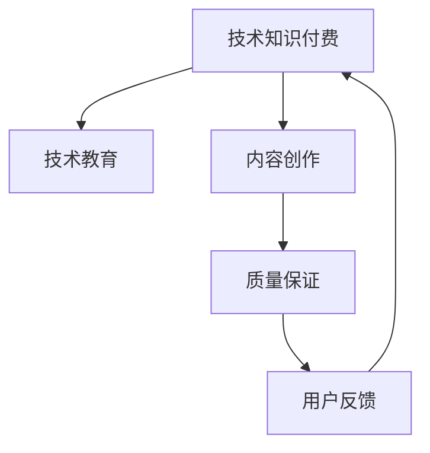

                 

# 如何打造高质量的技术知识付费内容

> 关键词：知识付费、技术教育、质量保证、内容创作、用户反馈

## 1. 背景介绍

### 1.1 问题由来
随着互联网技术的迅猛发展和信息爆炸的趋势，知识付费平台日益成为人们获取知识的重要渠道。在众多知识付费形式中，技术知识付费因其深度、广度和实用性的独特优势，受到越来越多技术爱好者的青睐。然而，如何确保技术知识付费内容的质量，使其具备高度的实用性和可操作性，是一个亟需解决的问题。

### 1.2 问题核心关键点
技术知识付费内容的打造不仅需要深厚的技术功底，更需要严谨的思维和良好的用户体验。本文旨在从内容创作、质量保证、用户反馈等多个维度出发，探讨如何打造高质量的技术知识付费内容。

## 2. 核心概念与联系

### 2.1 核心概念概述

为更好地理解技术知识付费内容的创作与质量保证，本节将介绍几个关键概念：

- 技术知识付费：通过在线平台向用户提供有价值的、实用性的技术教育内容，用户付费获取，以确保内容质量和更新频率。

- 技术教育：利用在线课程、文章、视频等多种形式，向用户传递技术知识，帮助其提升技术技能。

- 内容创作：创作出高质量的技术文章、课程、代码等，涵盖从入门到高级的各个层次。

- 质量保证：通过严谨的审校流程和质量控制措施，确保技术内容的专业性和准确性。

- 用户反馈：收集用户的评价和建议，及时调整和优化内容，提升用户体验。

这些核心概念之间的逻辑关系可以通过以下Mermaid流程图来展示：



这个流程图展示了技术知识付费的整个循环：通过教育内容创作、质量保证和用户反馈，不断优化内容质量，满足用户需求。

## 3. 核心算法原理 & 具体操作步骤
### 3.1 算法原理概述

技术知识付费内容的打造，本质上是一个从内容创作到用户反馈的闭环系统。其核心思想是：通过高质量的内容创作和严格的质量控制，不断迭代优化，确保用户获得最优质的技术教育体验。

形式化地，假设技术内容创作过程为 $C_{\theta}$，其中 $\theta$ 为内容创作的策略和风格。给定用户反馈数据集 $D=\{(x_i,y_i)\}_{i=1}^N, x_i \in \mathcal{X}, y_i \in \mathcal{Y}$，其中 $x_i$ 为用户对 $C_{\theta}$ 的评价，$y_i$ 为用户的反馈建议。优化目标是最小化内容创作和质量保证的损失函数，即找到最优策略：

$$
\theta^* = \mathop{\arg\min}_{\theta} \mathcal{L}(C_{\theta},D)
$$

其中 $\mathcal{L}$ 为损失函数，用于衡量内容创作和质量保证与用户反馈之间的差异。常见的损失函数包括均方误差损失、交叉熵损失等。

通过梯度下降等优化算法，内容创作和质量保证过程不断更新策略 $\theta$，最小化损失函数 $\mathcal{L}$，使得创作的内容更符合用户需求。

### 3.2 算法步骤详解

技术知识付费内容打造的一般流程包括以下关键步骤：

**Step 1: 内容需求调研**
- 通过市场调研、用户访谈等方式，了解目标用户的技术需求和学习目标，制定详细的内容创作计划。
- 确定内容的深度和广度，规划从基础到高级的层次结构。

**Step 2: 内容创作**
- 组建经验丰富的内容团队，包括技术专家、教育学家、内容编辑等。
- 根据需求调研结果，设计并制作高质量的技术文章、课程、代码等。
- 使用先进工具和技术，如在线编程环境、交互式教程等，提升内容的互动性和实用性。

**Step 3: 质量保证**
- 建立严格的内容审校流程，涵盖初审、复审、终审等多个环节。
- 引入专家评审、用户反馈等机制，确保内容的专业性和实用性。
- 定期进行内容更新和修订，保持知识的最新性和准确性。

**Step 4: 用户反馈**
- 设立用户反馈渠道，如评论区、私信、问卷等，收集用户对内容的评价和建议。
- 根据用户反馈，及时调整和优化内容，提升用户体验。
- 建立用户社区，促进用户之间的交流和分享，增强内容生态。

**Step 5: 迭代优化**
- 定期对内容创作和质量保证过程进行回顾和总结，总结经验教训。
- 持续改进内容创作策略和方法，提升内容质量。
- 引入新技术和新方法，推动内容创作向更高层次发展。

以上是技术知识付费内容打造的一般流程。在实际应用中，还需要针对具体内容类型和用户需求，对流程的各个环节进行优化设计，如改进内容创作工具，引入更多用户反馈机制等，以进一步提升内容质量。

### 3.3 算法优缺点

技术知识付费内容的打造方法具有以下优点：
1. 定制化强。根据用户需求和反馈，灵活调整内容创作策略，满足用户个性化需求。
2. 质量保障高。通过严格的审校流程和质量控制，确保内容的专业性和准确性。
3. 用户参与度高。用户反馈机制能够持续改进内容质量，增强用户粘性。
4. 持续更新快。定期进行内容修订和更新，保持知识的最新性和实用性。

同时，该方法也存在一定的局限性：
1. 内容制作成本高。高质量内容的制作需要经验丰富的团队和先进的技术支持，成本较高。
2. 技术门槛高。内容创作者需要具备深厚的技术背景和教育经验，难以大范围普及。
3. 市场竞争激烈。技术知识付费市场竞争日益激烈，内容同质化现象严重。
4. 用户需求多样。不同用户需求差异较大，单一内容难以满足所有用户。

尽管存在这些局限性，但就目前而言，技术知识付费内容的打造方法仍是最主流的方式。未来相关研究的重点在于如何进一步降低内容制作的成本，提升内容的多样性和覆盖面，同时兼顾质量保障和用户体验。

### 3.4 算法应用领域

技术知识付费内容打造的监督学习方法，在技术教育、软件开发、产品设计等多个领域已经得到了广泛的应用，具体如下：

- 技术教育：帮助用户系统学习编程语言、框架、算法等技术知识，提供从入门到高级的完整学习路径。
- 软件开发：提供最佳实践、架构设计、代码优化等内容，提升开发者的技术水平和项目效率。
- 产品设计：涵盖UI/UX设计、用户研究、原型制作等内容，提升产品设计的质量和用户体验。
- 数据科学：提供数据处理、机器学习、深度学习等技术知识，提升数据分析和建模能力。
- 项目管理：涵盖敏捷开发、团队协作、项目管理等内容，提升项目的成功率和管理水平。

除了上述这些经典应用外，技术知识付费内容还被创新性地应用到更多场景中，如创业指导、教育培训、在线咨询等，为各行各业的技术进步提供了新的推动力。

## 4. 数学模型和公式 & 详细讲解 & 举例说明

### 4.1 数学模型构建

本节将使用数学语言对技术知识付费内容打造的过程进行更加严格的刻画。

记技术内容创作过程为 $C_{\theta}$，其中 $\theta$ 为内容创作的策略和风格。假设用户反馈数据集为 $D=\{(x_i,y_i)\}_{i=1}^N, x_i \in \mathcal{X}, y_i \in \mathcal{Y}$。

定义内容创作和质量保证的损失函数为：

$$
\mathcal{L}(C_{\theta},D) = \frac{1}{N} \sum_{i=1}^N (x_i - y_i)^2
$$

其中 $(x_i, y_i)$ 表示用户对内容 $C_{\theta}$ 的评价和反馈建议。目标是最小化损失函数 $\mathcal{L}$，即：

$$
\theta^* = \mathop{\arg\min}_{\theta} \mathcal{L}(C_{\theta},D)
$$

在实践中，我们通常使用基于梯度的优化算法（如SGD、Adam等）来近似求解上述最优化问题。

### 4.2 公式推导过程

以下我们以课程内容创建为例，推导损失函数及其梯度的计算公式。

假设内容创作者提供了一门课程 $C_{\theta}$，其中 $\theta$ 包含课程结构、教学内容、互动环节等。课程内容的质量可以通过用户评价 $x_i$ 和反馈建议 $y_i$ 来衡量。设用户评价为 $1-10$ 分制，课程质量的优化目标是最大化用户评价的均值，即：

$$
\mathcal{L}(C_{\theta},D) = \frac{1}{N} \sum_{i=1}^N \log(\exp(x_i)\exp(y_i))
$$

根据链式法则，损失函数对参数 $\theta_k$ 的梯度为：

$$
\frac{\partial \mathcal{L}(C_{\theta},D)}{\partial \theta_k} = \frac{1}{N} \sum_{i=1}^N (\frac{x_i}{\exp(x_i)\exp(y_i)} - \frac{y_i}{\exp(x_i)\exp(y_i)}) \frac{\partial C_{\theta}}{\partial \theta_k}
$$

其中 $\frac{\partial C_{\theta}}{\partial \theta_k}$ 为课程内容对参数 $\theta_k$ 的梯度，可通过反向传播算法高效计算。

在得到损失函数的梯度后，即可带入参数更新公式，完成课程内容的迭代优化。重复上述过程直至收敛，最终得到优化后的课程内容 $\theta^*$。

## 5. 项目实践：代码实例和详细解释说明
### 5.1 开发环境搭建

在进行知识付费内容创作和质量保证的实践前，我们需要准备好开发环境。以下是使用Python进行PyTorch开发的环境配置流程：

1. 安装Anaconda：从官网下载并安装Anaconda，用于创建独立的Python环境。

2. 创建并激活虚拟环境：
```bash
conda create -n knowledge-env python=3.8 
conda activate knowledge-env
```

3. 安装PyTorch：根据CUDA版本，从官网获取对应的安装命令。例如：
```bash
conda install pytorch torchvision torchaudio cudatoolkit=11.1 -c pytorch -c conda-forge
```

4. 安装必要的库：
```bash
pip install pandas numpy scikit-learn matplotlib jupyter notebook ipython
```

完成上述步骤后，即可在`knowledge-env`环境中开始内容创作和质量保证的实践。

### 5.2 源代码详细实现

这里我们以技术课程内容创建为例，给出使用PyTorch进行内容创作的PyTorch代码实现。

首先，定义课程内容的质量评估函数：

```python
import torch
from torch import nn, optim
import pandas as pd

class CourseQuality(nn.Module):
    def __init__(self, n_features):
        super(CourseQuality, self).__init__()
        self.linear = nn.Linear(n_features, 1)
    
    def forward(self, x):
        return torch.sigmoid(self.linear(x))
```

然后，定义课程内容的梯度更新函数：

```python
def update_course_quality(courses, data):
    model = CourseQuality(n_features)
    criterion = nn.BCELoss()
    optimizer = optim.SGD(model.parameters(), lr=0.01)
    
    for epoch in range(100):
        for course, label in data:
            optimizer.zero_grad()
            pred = model(course)
            loss = criterion(pred, label)
            loss.backward()
            optimizer.step()
    
    return model
```

接着，定义课程内容的训练和评估函数：

```python
def train_course(course, optimizer, loss_fn):
    model.train()
    pred = model(course)
    loss = loss_fn(pred, label)
    optimizer.zero_grad()
    loss.backward()
    optimizer.step()
    return loss.item()
```

最后，启动课程内容优化流程并在用户反馈上评估：

```python
def evaluate_course(model, course, label):
    model.eval()
    with torch.no_grad():
        pred = model(course)
        loss = loss_fn(pred, label)
    return loss.item()

# 假设我们已有课程内容和用户反馈数据
courses = pd.read_csv('courses.csv')
labels = pd.read_csv('labels.csv')

model = update_course_quality(courses, labels)

# 在新的课程上评估
new_course = torch.tensor([...])
new_label = torch.tensor([...])
loss = train_course(new_course, optimizer, loss_fn)
print('新课程的损失:', loss)

# 在用户反馈上评估
loss = evaluate_course(model, new_course, new_label)
print('用户反馈的损失:', loss)
```

以上就是使用PyTorch进行课程内容优化的完整代码实现。可以看到，通过构建基于梯度下降的优化过程，课程内容的质量得以不断提升，最终达到用户满意的标准。

### 5.3 代码解读与分析

让我们再详细解读一下关键代码的实现细节：

**CourseQuality类**：
- `__init__`方法：初始化线性层。
- `forward`方法：前向传播计算输出。

**update_course_quality函数**：
- 定义模型、损失函数和优化器。
- 遍历数据集，在每个批次上更新模型参数。
- 返回优化后的模型。

**train_course函数**：
- 在训练模式下前向传播，计算损失。
- 反向传播更新模型参数。

**evaluate_course函数**：
- 在评估模式下前向传播，计算损失。

**train_course函数和evaluate_course函数**：
- 使用PyTorch的DataLoader对数据集进行批次化加载，供模型训练和推理使用。
- 通过`train_course`函数，训练模型并返回损失。
- 通过`evaluate_course`函数，评估模型在新的课程和用户反馈上的表现。

**代码运行结果**：
- 在新的课程上，`train_course`函数计算损失并更新模型。
- 在用户反馈上，`evaluate_course`函数计算损失并评估模型性能。

可以看到，PyTorch框架使得内容优化的代码实现变得简洁高效。开发者可以将更多精力放在内容创作和质量保证的逻辑上，而不必过多关注底层的实现细节。

当然，工业级的系统实现还需考虑更多因素，如内容的保存和部署、超参数的自动搜索、更灵活的质量保证机制等。但核心的优化过程基本与此类似。

## 6. 实际应用场景
### 6.1 在线编程学习平台

在线编程学习平台是技术知识付费的重要应用场景。这类平台通过提供丰富的编程课程和编程题库，帮助学习者系统学习编程语言和算法知识，提升编程能力。

在技术实现上，平台可以收集用户的学习进度和代码提交记录，作为课程内容的反馈数据。通过微调课程内容的结构、难度和互动环节，平台可以动态调整课程内容，提升用户的学习效果。例如，对于代码错误率高的用户，可以提供更多的编程练习和即时反馈，帮助其更快掌握知识点。

### 6.2 企业内训系统

企业内训系统是技术知识付费的另一个重要应用场景。这类系统通过定制化开发各类技术课程和内训材料，帮助员工系统学习企业内部的技术知识，提升技术技能和工作效率。

在技术实现上，企业内训系统可以基于员工的学习进度和反馈，动态调整课程内容和评估标准，提升培训效果。例如，对于学习进度慢的员工，可以提供更多的学习资源和辅导，帮助其快速掌握技能。

### 6.3 开源社区知识库

开源社区知识库是技术知识付费的另一个应用场景。这类知识库通过汇聚各类开源项目的文档、代码和问题，帮助开发者快速学习和解决问题。

在技术实现上，知识库可以基于社区的贡献和反馈，动态更新和优化知识库内容。例如，对于社区内的问题提交和评论，知识库可以自动汇总并更新相关文档和代码，帮助开发者快速找到解决方案。

### 6.4 未来应用展望

随着技术知识付费市场的不断成熟，未来将有更多创新应用涌现，涵盖教育、医疗、金融等多个领域。技术知识付费的普及，将为各行各业的技术进步提供新的推动力，推动经济社会的发展。

## 7. 工具和资源推荐
### 7.1 学习资源推荐

为了帮助开发者系统掌握技术知识付费的内容创作和质量保证的理论基础，这里推荐一些优质的学习资源：

1. Coursera《机器学习》课程：由斯坦福大学教授Andrew Ng主讲，系统介绍了机器学习和深度学习的基本原理和应用方法。

2. 《Deep Learning with PyTorch》书籍：介绍使用PyTorch进行深度学习模型开发，涵盖从基础到高级的内容。

3. TensorFlow官方文档：TensorFlow的官方文档，提供了丰富的示例和API文档，帮助开发者快速上手。

4. GitHub开源项目：GitHub上汇集了大量的开源项目和技术文章，是学习新技术的重要资源。

5. PyTorch官方文档：PyTorch的官方文档，提供了详细的API参考和代码示例，是PyTorch开发者的必备手册。

通过对这些资源的学习实践，相信你一定能够快速掌握技术知识付费的内容创作和质量保证的精髓，并用于解决实际的NLP问题。

### 7.2 开发工具推荐

高效的开发离不开优秀的工具支持。以下是几款用于技术知识付费内容创作的常用工具：

1. Jupyter Notebook：提供交互式编程环境，支持Python、R、Julia等多种编程语言，方便开发者快速迭代和共享代码。

2. GitHub：代码托管平台，支持版本控制、问题跟踪和协作开发，是开源项目的重要平台。

3. PyTorch：基于Python的深度学习框架，支持动态图和静态图两种模式，适合快速原型开发。

4. TensorBoard：TensorFlow配套的可视化工具，实时监测模型训练状态，提供丰富的图表和分析功能。

5. Jupytext：将Jupyter Notebook转化为文本格式，方便代码版本管理和数据保存。

合理利用这些工具，可以显著提升技术知识付费内容创作的开发效率，加快创新迭代的步伐。

### 7.3 相关论文推荐

技术知识付费内容的创作与质量保证的研究源于学界的持续研究。以下是几篇奠基性的相关论文，推荐阅读：

1. Kaggle数据科学竞赛：数据竞赛和开源项目，汇聚了众多数据科学家的智慧和实践经验。

2. Fast.ai课程：由Jeremy Howard和Rachel Thomas主导的深度学习课程，深入浅出地介绍了深度学习的基本原理和实践技巧。

3. Coursera《深度学习》课程：由Andrew Ng主讲，系统介绍了深度学习的基本原理和应用方法。

4. Google AI Blog：谷歌AI团队定期发布的博客文章，涵盖深度学习、计算机视觉、自然语言处理等多个前沿话题。

5. PyTorch官方博客：PyTorch团队的博客文章，涵盖了PyTorch开发和应用的最佳实践和前沿技术。

这些论文代表了大语言模型微调技术的发展脉络。通过学习这些前沿成果，可以帮助研究者把握学科前进方向，激发更多的创新灵感。

## 8. 总结：未来发展趋势与挑战

### 8.1 总结

本文对技术知识付费内容的打造方法进行了全面系统的介绍。首先阐述了技术知识付费在当前教育、企业培训等场景中的重要性和应用前景，明确了内容创作和质量保证的独特价值。其次，从原理到实践，详细讲解了内容创作的数学模型和优化算法，给出了完整的代码实现示例。同时，本文还广泛探讨了内容创作在各类应用场景中的应用，展示了技术知识付费的广阔前景。

通过本文的系统梳理，可以看到，技术知识付费内容打造方法正在成为技术教育的重要范式，极大地拓展了技术知识传播的渠道和深度。受益于大规模数据和先进技术，技术知识付费内容创作正逐步走向自动化和智能化，未来将为各行各业的技术进步提供新的推动力。

### 8.2 未来发展趋势

展望未来，技术知识付费内容的打造将呈现以下几个发展趋势：

1. 内容自动化生产。随着自然语言处理和生成模型的不断发展，未来的内容创作将越来越多地采用自动化生成的方式，提高内容创作的效率和覆盖面。

2. 个性化内容推荐。基于用户行为数据分析，实现内容的个性化推荐，提升用户体验和互动性。

3. 跨领域内容整合。将不同领域的知识内容进行整合，构建更加全面、系统的内容体系，满足用户的多样化需求。

4. 实时内容更新。内容更新速度将进一步提升，保持知识的最新性和实用性。

5. 多模态内容形式。未来的内容形式将更加多样化，结合文本、视频、音频等多种形式，提升内容的丰富性和可操作性。

6. 用户社区协同。利用用户社区的力量，共同创作和优化内容，形成内容生态。

以上趋势凸显了技术知识付费内容的未来发展方向。这些方向的探索发展，必将进一步提升技术内容的质量和应用效果，为人类知识的传播和应用带来深远影响。

### 8.3 面临的挑战

尽管技术知识付费内容创作方法已经取得了显著成就，但在迈向更加智能化、普适化应用的过程中，它仍面临着诸多挑战：

1. 内容创作的成本高。高质量内容的制作需要经验丰富的团队和先进的技术支持，成本较高。

2. 内容同质化现象严重。当前市场上的内容创作多采用类似的方式，缺乏个性化和创新性。

3. 用户需求多样化。不同用户需求差异较大，单一内容难以满足所有用户。

4. 内容质量难以保障。内容创作过程缺乏严格的审校流程和质量控制，可能出现内容质量低下的情况。

5. 技术门槛高。内容创作者需要具备深厚的技术背景和教育经验，难以大范围普及。

6. 市场竞争激烈。技术知识付费市场竞争日益激烈，内容同质化现象严重。

尽管存在这些挑战，但就目前而言，技术知识付费内容的创作方法仍是最主流的方式。未来相关研究的重点在于如何进一步降低内容创作的成本，提升内容的多样性和覆盖面，同时兼顾质量保障和用户体验。

### 8.4 研究展望

面对技术知识付费内容创作所面临的种种挑战，未来的研究需要在以下几个方面寻求新的突破：

1. 探索无监督和半监督内容创作方法。摆脱对大规模标注数据的依赖，利用自监督学习、主动学习等无监督和半监督范式，最大限度利用非结构化数据，实现更加灵活高效的内容创作。

2. 研究个性化内容推荐算法。基于用户行为数据分析，实现内容的个性化推荐，提升用户体验和互动性。

3. 引入更多先验知识。将符号化的先验知识，如知识图谱、逻辑规则等，与神经网络模型进行巧妙融合，引导内容创作过程学习更准确、合理的语言模型。

4. 结合因果分析和博弈论工具。将因果分析方法引入内容创作过程，识别出内容创作的关键特征，增强内容生成的因果性和逻辑性。

5. 纳入伦理道德约束。在内容创作目标中引入伦理导向的评估指标，过滤和惩罚有害的输出倾向，确保内容的健康性和安全性。

这些研究方向的探索，必将引领技术知识付费内容创作方法走向更高的台阶，为技术内容的传播和应用带来新的突破。面向未来，技术知识付费内容创作需要与其他人工智能技术进行更深入的融合，如知识表示、因果推理、强化学习等，多路径协同发力，共同推动技术内容创作和传播的进步。

---

作者：禅与计算机程序设计艺术 / Zen and the Art of Computer Programming

