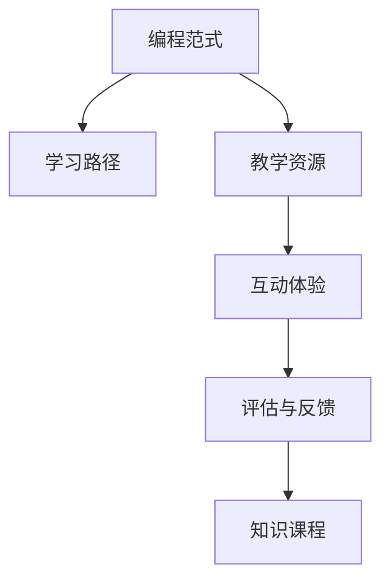

                 

# 如何打造高质量的程序员知识课程

> 关键词：程序员,知识课程,高质量,教学设计,编程范式,学习路径,课程设计,互动体验

## 1. 背景介绍

### 1.1 问题由来
在互联网和软件开发领域，编程技能的需求日益增加。企业和组织越来越依赖于能够编写高质量、可维护、高效的代码的程序员。为了满足这一需求，许多公司和机构开始寻求为他们的员工或客户提供高质量的程序员知识课程。然而，高质量的程序员知识课程并不是一件容易的事情，它需要深思熟虑的课程设计、丰富的教学资源和有效的教学方法。

### 1.2 问题核心关键点
高质量程序员知识课程的关键点包括：

1. **课程设计**：课程必须包含适合不同水平和经验层次的程序员的内容，并提供清晰的学习路径。
2. **教学资源**：课程需要提供高质量的教学材料，如教材、实践案例和工具。
3. **教学方法**：课程应采用有效的教学方法，如互动式学习、项目驱动学习等，以提高学习效果。
4. **评估和反馈**：课程应包含评估机制和持续反馈，以帮助学员了解自己的学习进展和需要改进的地方。

### 1.3 问题研究意义
高质量的程序员知识课程对于提升程序员技能、提高工作效率和软件质量具有重要意义。以下是几个具体的研究意义：

1. **技能提升**：通过系统的学习，程序员可以提升他们的技能，包括编程技巧、算法设计、软件工程实践等。
2. **工作效率**：提高程序员的技术水平，可以减少代码错误和修改频率，从而提高工作效率。
3. **软件质量**：高质量的程序员知识课程能够帮助程序员编写更可靠、更可维护的软件。
4. **技术创新**：通过学习新技术和新范式，程序员可以更灵活地应对工作中的技术挑战，推动技术创新。
5. **职业发展**：优质的培训课程有助于程序员的职业发展，增加他们在技术市场上的竞争力。

## 2. 核心概念与联系

### 2.1 核心概念概述

为了打造高质量的程序员知识课程，我们需要理解以下几个核心概念：

- **编程范式(Programming Paradigm)**：不同的编程范式（如面向对象编程、函数式编程、事件驱动编程等）在编程思维和代码结构上有显著差异。理解这些范式的特点和适用场景，是编写高质量代码的基础。

- **学习路径(Learning Path)**：根据学员的技术水平和兴趣，设计合理的学习路径，帮助他们逐步掌握复杂的编程概念和技术。

- **教学资源(Educational Resources)**：包括教材、课程大纲、案例研究、实践项目、在线教程、编程工具等，这些资源应该高质量、易于理解，并且与课程目标一致。

- **互动体验(Interactive Experience)**：通过互动式学习、在线讨论、编程练习、小组项目等方式，提升学员的学习兴趣和参与度。

- **评估与反馈(Evaluation and Feedback)**：通过测试、作业、项目评估等方式，帮助学员了解自己的学习进展，及时发现和纠正学习中的问题。

这些概念之间的关系可以通过以下Mermaid流程图来展示：



这个流程图展示了几大核心概念之间的关系：

1. 编程范式和教学资源共同构成了知识课程的基础。
2. 学习路径和互动体验是课程设计的重要环节，决定了学员的学习节奏和参与度。
3. 评估与反馈机制是课程效果的衡量标准，也是持续改进的依据。

## 3. 核心算法原理 & 具体操作步骤

### 3.1 算法原理概述

高质量程序员知识课程的设计和实施，基于以下基本原理：

- **自适应学习**：根据学员的学习进度和表现，动态调整课程内容和难度。
- **深度互动**：通过小组讨论、编程练习、在线互动等方式，加深学员对知识的理解和掌握。
- **项目导向**：将课程内容与实际项目结合，提升学员的实践能力和问题解决能力。
- **持续评估**：通过定期的测试和反馈，及时发现问题，调整教学策略。

### 3.2 算法步骤详解

打造高质量程序员知识课程的步骤如下：

**Step 1: 需求分析**

- 确定目标受众：了解学员的技术背景、兴趣和职业目标。
- 确定课程目标：明确课程要教授的知识点和技能。

**Step 2: 课程设计**

- 制定课程大纲：根据目标受众和课程目标，设计课程结构，包括主要模块、子模块和知识点。
- 选择教学资源：选择合适的教材、案例研究、在线教程和编程工具。
- 设计学习路径：根据学员的现有水平，设计合理的学习路径，包括基础知识、进阶技能和高级应用。

**Step 3: 教学实施**

- 创建互动式学习环境：使用在线平台、学习管理系统和编程环境，为学员提供互动式学习体验。
- 实施项目驱动教学：设计实际的编程项目，让学员在实践中学习新技术和新方法。
- 安排定期的评估和反馈：通过在线测试、编程作业和项目评估，及时了解学员的学习进展。

**Step 4: 课程优化**

- 收集反馈：通过学员反馈、课堂互动和评估结果，了解课程的优点和不足。
- 调整教学策略：根据收集到的反馈，优化课程内容和教学方法。
- 更新教学资源：定期更新教材、案例研究和工具，确保课程内容的前沿性和实用性。

### 3.3 算法优缺点

高质量程序员知识课程具有以下优点：

1. **系统化学习**：通过系统化的课程设计，学员可以全面掌握编程知识和技能。
2. **互动性强**：通过互动式学习，学员可以更好地理解和掌握知识，提高学习兴趣。
3. **实践能力强**：通过项目驱动教学，学员可以在实践中掌握复杂技术，提升问题解决能力。
4. **灵活性高**：课程设计可以根据学员的学习进度和反馈进行调整，适应不同的学习需求。

同时，该课程也存在以下缺点：

1. **时间和精力投入大**：高质量课程的设计和实施需要大量的时间和精力。
2. **对教师要求高**：课程设计和教学实施要求教师具备丰富的编程经验和教学经验。
3. **评估复杂**：定期的评估和反馈需要消耗大量的时间和资源。
4. **成本较高**：高质量的教学资源和互动体验通常需要较高的成本。

尽管存在这些缺点，高质量的程序员知识课程仍然是提升程序员技能和软件质量的有效途径。

### 3.4 算法应用领域

高质量程序员知识课程可以应用于多个领域，包括但不限于：

1. **企业培训**：为内部员工提供系统化的编程培训，提升技术水平和工作效率。
2. **教育机构**：作为计算机科学和软件工程专业的必修或选修课程，培养未来的软件开发人才。
3. **在线教育平台**：提供高质量的在线课程，让学员在家中即可学习编程技能。
4. **开源社区**：通过在线课程和实践项目，帮助开源社区成员提升技术水平和贡献能力。
5. **政府和企业项目**：为政府和企业项目提供培训，提升参与人员的技术能力，提高项目成功率。

## 4. 数学模型和公式 & 详细讲解 & 举例说明

### 4.1 数学模型构建

我们可以将高质量程序员知识课程的评估过程建模为一个线性回归问题。设 $x$ 为课程的特征向量，包括教学资源、学习路径、互动体验等因素；$y$ 为课程效果的评价指标，如学员满意度、知识掌握程度等；$\beta$ 为回归系数。模型的形式化表示如下：

$$
y = f(x; \beta)
$$

其中 $f(\cdot)$ 为线性回归模型，$\beta$ 需要根据具体问题和数据进行估计。

### 4.2 公式推导过程

线性回归模型 $y = \beta_0 + \beta_1 x_1 + \beta_2 x_2 + \ldots + \beta_n x_n$ 的参数估计通常使用最小二乘法（OLS），目标是找到最小化预测误差 $\epsilon$ 的 $\beta$ 值。即：

$$
\min_{\beta} \sum_{i=1}^N (y_i - f(x_i; \beta))^2
$$

通过求解上述优化问题，可以得到回归系数 $\beta$ 的估计值。

### 4.3 案例分析与讲解

以一个具体的案例为例，假设我们有一个课程设计专家，他需要设计一个针对初级开发者的Java编程课程。这个课程的目标是让学员在6个月内掌握Java基础和中级技能。专家通过数据分析，确定了以下几个关键特征：

- 教学资源：使用《Java编程思想》、在线教程《Java核心技术》和《Java 8 特性》。
- 学习路径：从基础语法开始，逐步学习面向对象编程、异常处理、数据结构和算法等。
- 互动体验：每周进行一次在线编程练习，每月进行一次小组项目，并每周进行一次小组讨论。
- 评估与反馈：每周进行一次在线测试，每月进行一次作业评估和项目评审。

专家将这些特征输入模型，通过最小二乘法求解 $\beta$，得到课程设计的初步方案。然后，专家结合实际经验和教学反馈，进一步调整教学策略，优化课程设计。

## 5. 项目实践：代码实例和详细解释说明

### 5.1 开发环境搭建

为了进行高质量程序员知识课程的实践，我们需要搭建一个综合性的开发环境，包括以下几个部分：

- **编程环境**：如Python、Java、C++等主流编程语言，以及相关的IDE和调试工具。
- **在线学习平台**：如Coursera、Udacity、EdX等，支持互动式学习和课程管理。
- **课程管理系统**：如Moodle、Blackboard等，用于管理和发布课程内容、组织课堂讨论和评估学员表现。
- **编程工具和库**：如Git、Docker、JDK、Python库等，支持课程中的编程实践和项目开发。

### 5.2 源代码详细实现

下面是一个简化的Java编程课程的课程设计示例，包含课程大纲、教学资源和学习路径：

```java
class JavaCourse {
    private List<String> topics = Arrays.asList("基础语法", "面向对象编程", "异常处理", "数据结构", "算法设计");
    private List<String> resources = Arrays.asList("Java编程思想", "Java核心技术", "Java 8特性");
    private List<String> learningPath = Arrays.asList("基础语法 -> 面向对象编程 -> 异常处理 -> 数据结构 -> 算法设计");
    
    public List<String> getTopics() {
        return topics;
    }
    
    public List<String> getResources() {
        return resources;
    }
    
    public List<String> getLearningPath() {
        return learningPath;
    }
}
```

### 5.3 代码解读与分析

这个JavaCourse类是一个简单的数据结构，用于表示一个Java编程课程的课程大纲、教学资源和学习路径。通过继承和封装，可以根据实际需求，扩展这个类，添加更多的课程设计和教学功能。

## 6. 实际应用场景

### 6.1 企业培训

高质量程序员知识课程在企业培训中有着广泛的应用。例如，某大型企业为提升其开发团队的技能，设计了一个为期半年的Java编程课程，包括基础语法、数据结构和算法设计等内容。通过这个课程，开发团队的技能得到了显著提升，软件的质量和开发效率也得到了明显提高。

### 6.2 教育机构

在教育机构中，高质量的程序员知识课程是计算机科学和软件工程专业的必修或选修课程。例如，某大学设计了一个面向本科生的Python编程课程，包括Python基础、Web开发、数据科学等内容。通过这个课程，学生的编程能力和项目开发能力得到了显著提升，为他们的职业生涯奠定了坚实的基础。

### 6.3 在线教育平台

在线教育平台通过高质量的程序员知识课程，提供灵活的学习方式。例如，某在线教育平台推出了一个面向初学者的JavaScript编程课程，包括JavaScript基础、DOM操作、事件处理等内容。通过这个课程，学员可以随时随地学习，提升他们的编程技能，获得更好的就业机会。

### 6.4 未来应用展望

未来，高质量程序员知识课程的应用前景将会更加广阔，以下是几个展望：

1. **大规模定制化课程**：随着人工智能和大数据分析技术的发展，可以基于学员的学习数据和偏好，实现大规模定制化课程设计。
2. **虚拟现实和增强现实技术**：通过虚拟现实和增强现实技术，提供沉浸式学习体验，提升学习效果。
3. **游戏化学习**：将游戏元素引入课程设计，通过奖励和挑战机制，激发学员的学习兴趣。
4. **个性化学习路径**：根据学员的学习进度和表现，动态调整学习路径，提供个性化的学习体验。
5. **混合式学习**：结合在线学习和线下培训，提供灵活的学习方式，满足不同学员的需求。

## 7. 工具和资源推荐

### 7.1 学习资源推荐

为了帮助开发者系统掌握高质量程序员知识课程的设计和实施，这里推荐一些优质的学习资源：

1. **《设计高质量课程》(Designing High Quality Courses)**：这本书详细介绍了高质量课程的设计原则和实施方法，适合课程设计者和教育工作者阅读。
2. **Coursera平台**：提供丰富的在线课程和专业认证，涵盖计算机科学、软件工程等多个领域。
3. **edX平台**：提供高质量的MOOC课程，由全球顶尖大学和机构提供，涵盖编程、数据科学等多个方向。
4. **Udacity平台**：提供项目导向的在线课程，通过实际项目训练学员的编程技能。
5. **Khan Academy**：提供免费的在线课程和教学资源，涵盖数学、编程、科学等多个领域。

### 7.2 开发工具推荐

为了提高程序员知识课程的开发效率和教学效果，推荐以下开发工具：

1. **在线学习平台**：如Coursera、Udacity、edX等，支持大规模在线课程的开发和管理。
2. **课程管理系统**：如Moodle、Blackboard等，支持课程内容的发布、课堂讨论和评估功能。
3. **编程环境**：如Python、Java、C++等主流编程语言，以及相关的IDE和调试工具。
4. **编程工具和库**：如Git、Docker、JDK、Python库等，支持课程中的编程实践和项目开发。
5. **数据分析工具**：如R、Python的Pandas库、SPSS等，用于分析和优化课程设计。

### 7.3 相关论文推荐

高质量程序员知识课程的研究和实施涉及多个领域，以下是几篇相关论文，推荐阅读：

1. **《大规模定制化在线课程设计》(Large-Scale Customized Online Course Design)**：探讨了大规模定制化课程设计的策略和方法，适合课程设计者和教育工作者阅读。
2. **《编程教育的未来：项目驱动学习》(The Future of Programming Education: Project-Based Learning)**：介绍了项目驱动学习的理念和实践，适合编程教师和教育工作者阅读。
3. **《虚拟现实在教育中的应用》(Virtual Reality in Education)**：探讨了虚拟现实技术在教育中的应用，适合教育技术工作者和教育工作者阅读。
4. **《游戏化学习：理论与实践》(Game-Based Learning: Theory and Practice)**：介绍了游戏化学习的理念和实践，适合教育工作者和课程设计者阅读。

## 8. 总结：未来发展趋势与挑战

### 8.1 总结

本文对高质量程序员知识课程的设计和实施进行了全面系统的介绍。首先阐述了高质量课程设计的重要性，明确了课程设计、教学资源、教学方法、评估与反馈等关键点。其次，从原理到实践，详细讲解了高质量课程的设计和实施步骤，提供了代码实例和详细解释说明。同时，本文还广泛探讨了高质量课程在企业培训、教育机构、在线教育平台等实际应用场景中的应用前景，展示了其巨大的应用潜力。

通过本文的系统梳理，可以看到，高质量程序员知识课程对于提升程序员技能、提高工作效率和软件质量具有重要意义。未来，随着技术和方法不断创新，高质量课程必将在NLP领域发挥更大的作用。

### 8.2 未来发展趋势

展望未来，高质量程序员知识课程将呈现以下几个发展趋势：

1. **技术化课程设计**：结合人工智能、大数据等技术，实现课程设计自动化和个性化，提升课程设计的效率和效果。
2. **项目导向的课程设计**：通过实际项目驱动学习，提升学员的实践能力和问题解决能力。
3. **混合式学习**：结合在线学习和线下培训，提供灵活的学习方式，满足不同学员的需求。
4. **游戏化学习**：通过游戏元素提升学习兴趣和参与度，提高学习效果。
5. **虚拟现实和增强现实技术**：通过虚拟现实和增强现实技术，提供沉浸式学习体验，提升学习效果。

### 8.3 面临的挑战

尽管高质量程序员知识课程已经取得了一定的成效，但在实施过程中仍面临诸多挑战：

1. **资源投入大**：高质量课程的设计和实施需要大量的时间、精力和资源。
2. **教学难度高**：课程设计和教学实施要求教师具备丰富的编程经验和教学经验。
3. **学员差异大**：不同学员的技术水平和兴趣不同，难以实现统一的课程设计。
4. **评估复杂**：定期的评估和反馈需要消耗大量的时间和资源。
5. **成本较高**：高质量的教学资源和互动体验通常需要较高的成本。

尽管存在这些挑战，高质量的程序员知识课程仍然是提升程序员技能和软件质量的有效途径。未来需要进一步研究和探索，以解决这些挑战。

### 8.4 研究展望

未来，高质量程序员知识课程的研究方向包括：

1. **大规模定制化课程设计**：结合人工智能和大数据分析技术，实现大规模定制化课程设计，满足不同学员的需求。
2. **技术化教学方法**：结合人工智能、机器学习等技术，实现技术化教学方法，提升教学效果。
3. **混合式学习**：结合在线学习和线下培训，提供灵活的学习方式，满足不同学员的需求。
4. **游戏化学习**：通过游戏元素提升学习兴趣和参与度，提高学习效果。
5. **虚拟现实和增强现实技术**：通过虚拟现实和增强现实技术，提供沉浸式学习体验，提升学习效果。

## 9. 附录：常见问题与解答

**Q1：高质量程序员知识课程是否适用于所有学员？**

A: 高质量程序员知识课程适用于有志于提升编程技能的学员，但课程内容和难度需要根据学员的技术水平和兴趣进行调整。

**Q2：如何评估高质量程序员知识课程的效果？**

A: 高质量程序员知识课程的评估可以通过学员的反馈、在线测试、编程作业和项目评估等方式进行。这些评估结果可以用于优化课程内容和教学方法。

**Q3：高质量程序员知识课程的资源投入是否合理？**

A: 高质量程序员知识课程需要投入大量的时间和资源，但长远来看，其对提高程序员技能和软件质量的投资回报率是很高的。

**Q4：如何应对高质量程序员知识课程中的挑战？**

A: 应对高质量程序员知识课程中的挑战需要综合考虑教学资源、学员差异、评估复杂度等因素，采用灵活的教学策略和评估方法。

**Q5：未来高质量程序员知识课程的趋势是什么？**

A: 未来高质量程序员知识课程的趋势包括技术化课程设计、项目导向的课程设计、混合式学习、游戏化学习、虚拟现实和增强现实技术等。

**Q6：高质量程序员知识课程的优点和缺点是什么？**

A: 高质量程序员知识课程的优点包括系统化学习、互动性强、实践能力强、灵活性高。缺点包括时间和精力投入大、对教师要求高、评估复杂、成本较高。

---

作者：禅与计算机程序设计艺术 / Zen and the Art of Computer Programming

