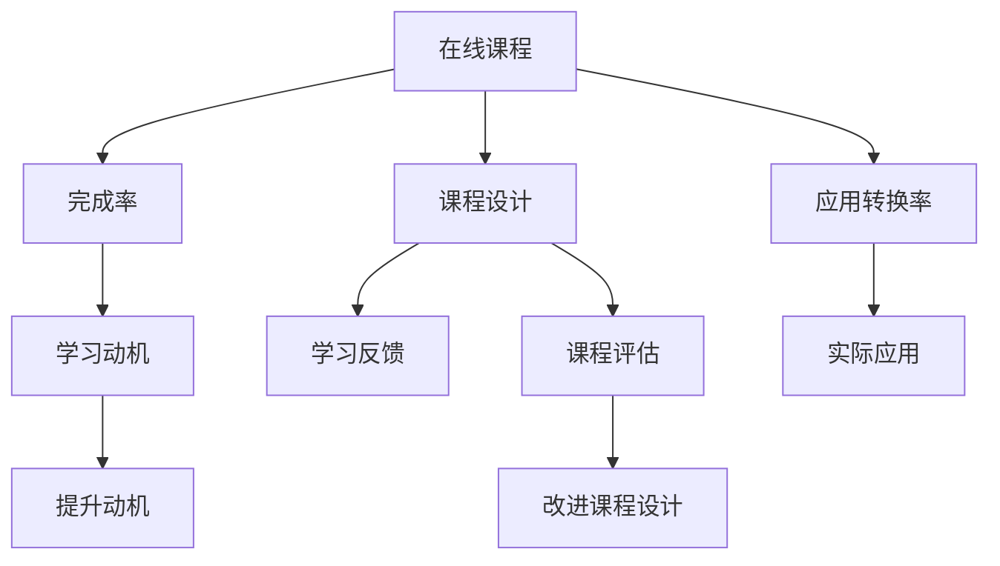

                 

# 如何打造高转换率的程序员知识课程

> 关键词：程序员课程, 在线教育, 转换率, 学习动机, 课程设计, 学习反馈, 课程评估

## 1. 背景介绍

### 1.1 问题由来
在线教育行业，特别是程序员在线教育，正在快速发展。越来越多的学生和专业人士希望通过在线课程来学习编程技能，提高职业竞争力。然而，在线课程的完成率和实际应用转换率却一直较低，难以满足企业和用户的实际需求。

> 课程完成率指的是学生完成所有课程模块的比例，而实际应用转换率指的是学生在完成课程后实际应用所学知识的比例。这两个指标通常都很低，导致教育机构和学生都无法充分利用在线课程的潜力。

### 1.2 问题核心关键点
为了解决在线程序员知识课程的高转换率问题，我们需要深入理解在线学习的特点、影响学生完成率和应用转换率的因素，并设计相应的教学策略和工具。

1. **学习动机**：如何激发和维持学生的学习动机，让他们更愿意投入时间和精力。
2. **课程设计**：如何设计出既有趣又实用的课程内容，吸引学生的注意力，并让他们能够真正掌握编程技能。
3. **学习反馈**：如何提供及时、有价值的反馈，帮助学生识别和改进他们的学习策略。
4. **课程评估**：如何评估学生的学习效果，判断课程的有效性，并据此进行改进。
5. **社区互动**：如何构建一个活跃的在线学习社区，促进学生之间的交流和协作，增强学习体验。

### 1.3 问题研究意义
提升在线程序员知识课程的完成率和实际应用转换率，对于教育机构的商业成功和学生的职业发展都具有重要意义：

1. **提高教育机构的市场竞争力**：通过提供高转换率课程，教育机构可以吸引更多学生注册并完成课程，从而提高收入和品牌影响力。
2. **提升学生职业竞争力**：通过实际应用转换率高的课程，学生可以更有效地掌握编程技能，提升就业能力和职业发展潜力。
3. **促进编程技术的普及**：高转换率的课程可以帮助更多人学会编程，推动编程技术在各行各业的普及应用。

## 2. 核心概念与联系

### 2.1 核心概念概述

为了更好地理解如何打造高转换率的程序员知识课程，我们首先介绍几个关键概念：

- **在线课程（Online Course）**：通过互联网平台提供的，学生可以自主安排时间和地点进行学习的课程。
- **完成率（Completion Rate）**：学生完成课程所有模块的比例。
- **应用转换率（Application Conversion Rate）**：学生在完成课程后实际应用所学知识的比例。
- **学习动机（Learning Motivation）**：激发学生学习的主观愿望和内在驱动力。
- **课程设计（Course Design）**：根据学习目标和需求，合理规划课程内容、结构和学习方式的过程。
- **学习反馈（Learning Feedback）**：学生在课程学习过程中接收到的，对其学习效果进行评价和建议的信息。
- **课程评估（Course Evaluation）**：通过科学的方法和工具，对课程的教学效果和学习效果进行评估的过程。

这些概念之间的联系可以通过以下Mermaid流程图来展示：



这个流程图展示了在线课程的各个关键环节及其相互关系：

1. 在线课程的完成率受学习动机的影响，课程设计是提升学习动机的关键。
2. 学习反馈可以进一步优化课程设计，同时提高学习效果。
3. 课程评估对课程设计和学习反馈有指导作用，有助于不断改进课程。
4. 通过课程评估，提升课程的应用转换率，使学生更愿意实际应用所学知识。

## 3. 核心算法原理 & 具体操作步骤
### 3.1 算法原理概述

为了提升在线程序员知识课程的完成率和实际应用转换率，我们提出了一个基于学习动机、课程设计、学习反馈和课程评估的优化算法。该算法旨在通过多维度的优化策略，增强学生的学习动机，提升课程设计和反馈的有效性，从而提高课程完成率和应用转换率。

### 3.2 算法步骤详解

本节将详细介绍该优化算法的详细步骤。

#### Step 1: 数据分析和动机调研

**数据收集**：
- 收集和分析学生注册、学习行为数据，了解学生的背景信息、学习习惯和已有知识水平。
- 收集学生对课程的反馈，特别是对课程内容的评价和建议。

**动机调研**：
- 设计问卷调查，了解学生的学习动机、期望和目标。
- 分析学生的学习行为数据，识别影响学习动机的关键因素。

#### Step 2: 课程设计和优化

**目标设定**：
- 根据学习动机调研结果，设定课程的教学目标和内容。
- 确定课程的模块结构和难度分布，确保课程既有挑战性又具可行性。

**内容开发**：
- 引入多样化的教学方法和资源，如视频教程、编程实践、项目案例等。
- 设计互动环节，如在线讨论、小组项目等，增强学生参与度。

**持续优化**：
- 根据学习反馈和评估结果，不断调整课程内容和教学方法。
- 引入新的教学技术，如AI辅助教学、个性化推荐等，提升学习效果。

#### Step 3: 学习反馈和激励机制

**实时反馈**：
- 提供即时、个性化的学习反馈，帮助学生及时了解自己的学习进度和存在的问题。
- 使用数据分析技术，对学生的学习数据进行实时分析，提供个性化的学习建议。

**激励机制**：
- 设计激励机制，如奖励制度、学习证书等，激发学生的学习动力。
- 引入社区互动功能，建立学习小组，促进学生之间的交流和协作。

#### Step 4: 课程评估和改进

**多维度评估**：
- 结合定量和定性方法，从学习效果、课程体验、知识应用等方面评估课程。
- 收集学生和讲师的反馈，进行全面的课程评估。

**数据驱动改进**：
- 根据评估结果，调整课程内容和教学方法。
- 引入新的评估工具和技术，如AI评估系统，提升评估的准确性和效率。

### 3.3 算法优缺点

该算法具有以下优点：
1. **全面性和系统性**：综合考虑学习动机、课程设计、学习反馈和课程评估，提供全面的优化方案。
2. **个性化和灵活性**：根据学生的学习数据和反馈，提供个性化的学习建议和激励机制。
3. **持续改进**：通过不断的评估和调整，课程能够不断优化，适应学生需求的变化。

该算法也存在一些缺点：
1. **数据依赖**：依赖高质量的数据分析和评估，数据不足或质量不高会影响效果。
2. **实施复杂**：需要综合应用多种技术和工具，对教育机构的资源和技术要求较高。
3. **时间成本**：设计和优化课程需要时间和资源投入，短期内可能无法看到明显效果。

### 3.4 算法应用领域

该算法可以广泛应用于各种在线教育平台和课程开发中，特别是程序员知识课程的优化。例如：

- **在线编程课程**：如Python、Java、Web开发等。
- **数据科学课程**：如数据分析、机器学习、数据可视化等。
- **软件工程课程**：如项目管理、软件架构设计、敏捷开发等。
- **人工智能课程**：如深度学习、自然语言处理、计算机视觉等。

## 4. 数学模型和公式 & 详细讲解 & 举例说明

### 4.1 数学模型构建

为了更好地理解和学习动机、课程设计、学习反馈和课程评估之间的关系，我们构建了一个数学模型，用于模拟和优化这些因素对课程完成率和应用转换率的影响。

**模型假设**：
- 假设每个学生在课程中的学习时间、学习能力和学习动机是独立的。
- 假设课程内容的设计、学习反馈和课程评估对学生的学习效果有显著影响。

**变量定义**：
- $C_i$：第$i$个学生完成课程的概率。
- $M_i$：第$i$个学生的学习动机强度。
- $D_i$：第$i$个学生的课程设计满意度。
- $F_i$：第$i$个学生的学习反馈质量。
- $E_i$：第$i$个学生的课程评估得分。

### 4.2 公式推导过程

根据上述假设和变量，我们可以建立以下数学模型：

$$
C_i = f(M_i, D_i, F_i, E_i)
$$

其中，$f$为模型函数，表示学习动机、课程设计、学习反馈和课程评估对课程完成率的影响。

为了简化模型，我们假设$f$为线性函数：

$$
C_i = \alpha M_i + \beta D_i + \gamma F_i + \delta E_i + \epsilon
$$

其中，$\alpha$、$\beta$、$\gamma$、$\delta$为系数，$\epsilon$为随机误差项。

### 4.3 案例分析与讲解

以一个Python编程课程为例，假设该课程的完成率为$C$，学习动机强度为$M$，课程设计满意度为$D$，学习反馈质量为$F$，课程评估得分为$E$。我们可以将以上公式应用到实际案例中进行分析：

- **学习动机强度**：通过问卷调查，我们发现学习编程的主要动机包括职业发展、兴趣提升和解决问题。在课程设计中，可以设计更多针对这些动机的教学内容和方法，如项目驱动学习、实际项目案例等。
- **课程设计满意度**：学生对课程内容的满意度可以通过在线问卷调查和反馈工具收集。根据反馈结果，优化课程内容，增加实战练习和项目实践，提高学生的学习兴趣和成就感。
- **学习反馈质量**：通过AI辅助教学系统，实时提供学习反馈，帮助学生及时了解学习进度和问题。反馈信息可以包括代码质量、问题解决步骤、知识点掌握情况等。
- **课程评估得分**：课程评估可以通过考试、项目展示和编程实践等多种方式进行。根据评估结果，调整课程难度和内容，确保学生能够掌握所学知识并应用到实际项目中。

通过以上案例分析，我们可以看到，合理设计和优化学习动机、课程设计、学习反馈和课程评估，可以显著提升课程完成率和实际应用转换率。

## 5. 项目实践：代码实例和详细解释说明

### 5.1 开发环境搭建

在进行项目实践前，我们需要准备好开发环境。以下是使用Python进行课程开发的环境配置流程：

1. 安装Anaconda：从官网下载并安装Anaconda，用于创建独立的Python环境。

2. 创建并激活虚拟环境：
```bash
conda create -n course-env python=3.8 
conda activate course-env
```

3. 安装Python学习包：
```bash
pip install Flask Django BeautifulSoup pandas sklearn
```

4. 安装课程管理工具：
```bash
pip install django-courseware django-student
```

完成上述步骤后，即可在`course-env`环境中开始课程开发。

### 5.2 源代码详细实现

下面我们以一个简单的在线编程课程为例，给出使用Python Flask框架构建课程平台和评估系统的代码实现。

首先，创建Flask应用，设置数据库：

```python
from flask import Flask, render_template, request
from flask_sqlalchemy import SQLAlchemy

app = Flask(__name__)
app.config['SQLALCHEMY_DATABASE_URI'] = 'sqlite:///course.db'
db = SQLAlchemy(app)
```

然后，创建课程和学生模型：

```python
class Course(db.Model):
    id = db.Column(db.Integer, primary_key=True)
    name = db.Column(db.String(50))
    description = db.Column(db.Text)
    start_date = db.Column(db.DateTime)
    end_date = db.Column(db.DateTime)

class Student(db.Model):
    id = db.Column(db.Integer, primary_key=True)
    name = db.Column(db.String(50))
    email = db.Column(db.String(50))
    courses = db.relationship('Course', secondary=course_student, backref=db.backref('students', lazy='dynamic'))
```

接着，创建课程和学生的关联表：

```python
course_student = db.Table('course_student',
    db.Column('course_id', db.Integer, db.ForeignKey('course.id')),
    db.Column('student_id', db.Integer, db.ForeignKey('student.id'))
)
```

然后，创建Flask路由和视图函数：

```python
@app.route('/')
def index():
    courses = Course.query.all()
    return render_template('index.html', courses=courses)

@app.route('/login')
def login():
    return render_template('login.html')

@app.route('/register', methods=['GET', 'POST'])
def register():
    if request.method == 'POST':
        # 处理注册逻辑
        return redirect('/')
    return render_template('register.html')
```

最后，创建用户登录和注册页面：

```html
<!-- index.html -->
<html>
<head>
    <title>课程列表</title>
</head>
<body>
    <h1>课程列表</h1>
    <ul>
        
            <li><a href="/{{ course.id }}">{{ course.name }}</a></li>
        
    </ul>
</body>
</html>

<!-- login.html -->
<html>
<head>
    <title>登录</title>
</head>
<body>
    <h1>登录</h1>
    <form method="POST">
        <label>邮箱：</label><input type="text" name="email">
        <label>密码：</label><input type="password" name="password">
        <input type="submit" value="登录">
    </form>
</body>
</html>

<!-- register.html -->
<html>
<head>
    <title>注册</title>
</head>
<body>
    <h1>注册</h1>
    <form method="POST">
        <label>邮箱：</label><input type="text" name="email">
        <label>密码：</label><input type="password" name="password">
        <input type="submit" value="注册">
    </form>
</body>
</html>
```

### 5.3 代码解读与分析

让我们再详细解读一下关键代码的实现细节：

**Flask应用设置**：
- 设置SQLAlchemy数据库连接，创建SQLite数据库。
- 创建课程和学生模型，定义数据库表结构。
- 创建课程和学生关联表，用于记录学生选课信息。

**Flask路由和视图函数**：
- 创建Flask应用，定义路由和视图函数。
- 显示课程列表页面，展示所有课程信息。
- 显示登录和注册页面，处理用户登录和注册逻辑。

**用户界面**：
- 登录和注册页面使用了HTML模板和Flask的路由和视图函数，实现了简单的用户管理功能。
- 课程列表页面使用了HTML模板和Flask的路由和视图函数，展示所有课程信息。

## 6. 实际应用场景

### 6.1 教育机构的在线课程优化

教育机构可以应用本算法，优化其在线课程的完成率和应用转换率，提升教育质量和商业价值。例如：

- **程序员培训课程**：如Python、Java、Web开发等。通过调研学生的学习动机，设计有趣和实用的课程内容，提供及时的学习反馈和激励机制，学生可以更积极地完成课程并实际应用所学知识。
- **数据科学课程**：如数据分析、机器学习、数据可视化等。通过引入项目实践和实际案例，帮助学生更好地理解和应用所学知识，提高课程应用转换率。

### 6.2 企业的在线培训平台

企业可以通过在线培训平台，提升员工的技能水平和职业能力。应用本算法，可以优化在线培训课程的完成率和应用转换率，提高企业的培训效果和员工的工作效率。

- **编程培训课程**：如Python、Java、数据库等。通过调研员工的职业发展需求，设计针对性强的课程内容，提供个性化的学习反馈和激励机制，员工可以更积极地完成培训并应用所学知识。
- **技术管理课程**：如项目管理、敏捷开发、团队协作等。通过引入实际案例和项目实践，帮助员工更好地理解和应用所学知识，提高培训应用转换率。

### 6.3 在线教育市场的课程优化

在线教育市场有大量用户和课程供给，如何优化课程完成率和应用转换率，对于平台的商业成功至关重要。应用本算法，可以提升平台的课程质量，吸引更多用户注册并完成课程。

- **编程基础课程**：如Python、Java、JavaScript等。通过调研用户的兴趣和需求，设计有趣和实用的课程内容，提供及时的学习反馈和激励机制，用户可以更积极地完成课程并实际应用所学知识。
- **软件开发课程**：如Web开发、移动应用开发等。通过引入项目实践和实际案例，帮助用户更好地理解和应用所学知识，提高课程应用转换率。

## 7. 工具和资源推荐

### 7.1 学习资源推荐

为了帮助开发者和教育机构系统掌握课程优化技术，这里推荐一些优质的学习资源：

1. **《教育心理学》**：介绍学习动机、课程设计、学习反馈和课程评估的基本原理和方法。
2. **《在线教育平台设计与运营》**：讲解在线教育平台的设计和运营策略，包括用户管理、课程设计、学习反馈和课程评估等。
3. **《数据分析与统计学》**：介绍数据分析和统计学方法，用于收集和分析用户学习数据，优化课程设计。
4. **《机器学习与人工智能》**：讲解机器学习技术，用于开发和应用AI辅助教学系统，提供个性化学习反馈。

### 7.2 开发工具推荐

高效的课程开发离不开优秀的工具支持。以下是几款用于课程开发和优化管理的常用工具：

1. **Flask**：Python的轻量级Web框架，适合快速开发和部署在线课程平台。
2. **Django**：Python的全栈Web框架，适合构建复杂的在线教育平台和培训管理系统。
3. **BeautifulSoup**：用于解析HTML和XML文档，提取和处理课程信息。
4. **Pandas**：数据分析库，用于处理和分析用户学习数据，优化课程设计。
5. **SQLAlchemy**：SQL数据库访问库，用于创建和管理课程和学生数据。

### 7.3 相关论文推荐

课程优化技术的发展源于学界的持续研究。以下是几篇奠基性的相关论文，推荐阅读：

1. **《在线学习动机与行为分析》**：研究在线学习动机与行为的关系，提出激发和维持学习动机的策略。
2. **《课程设计与评估模型》**：提出课程设计与评估的框架和方法，用于优化课程内容和教学效果。
3. **《学习反馈与个性化推荐》**：研究学习反馈和个性化推荐对学习效果的影响，提出优化学习反馈和推荐系统的策略。
4. **《课程完成率与学习效果分析》**：研究课程完成率和学习效果的关系，提出优化课程设计和评估的策略。

这些论文代表了大数据驱动教育技术的发展脉络。通过学习这些前沿成果，可以帮助研究者把握学科前进方向，激发更多的创新灵感。

## 8. 总结：未来发展趋势与挑战

### 8.1 总结

本文对如何打造高转换率的程序员知识课程进行了全面系统的介绍。首先阐述了在线程序员知识课程的完成率和实际应用转换率的重要性，明确了影响这些指标的关键因素，并设计了相应的教学策略和工具。

通过本文的系统梳理，可以看到，在线程序员知识课程的高转换率，需要在学习动机、课程设计、学习反馈和课程评估等方面进行全面的优化。未来的课程开发，需要综合考虑这些因素，不断进行改进和优化，才能满足学生的需求和提升教学效果。

### 8.2 未来发展趋势

展望未来，在线程序员知识课程的开发将呈现以下几个发展趋势：

1. **个性化学习**：利用大数据和人工智能技术，根据学生的个性化需求和学习数据，提供个性化的课程内容和推荐，提高学习效果和应用转换率。
2. **实时反馈与自适应学习**：开发实时反馈系统，根据学生的学习状态和反馈，动态调整课程内容和难度，实现自适应学习。
3. **AI辅助教学**：引入AI辅助教学系统，提供个性化学习建议、学习路径优化和自动化评估等功能，提升教学效果。
4. **社区互动与协作学习**：构建活跃的在线学习社区，促进学生之间的交流和协作，增强学习体验和效果。
5. **持续改进与课程评估**：通过持续的数据分析和课程评估，不断优化课程设计和教学方法，提升课程效果和学生满意度。

这些趋势将进一步推动在线教育的发展，使在线程序员知识课程更加高效和有趣。

### 8.3 面临的挑战

尽管在线程序员知识课程的优化取得了一定的进展，但在实际应用中仍面临一些挑战：

1. **数据隐私与安全**：在线课程平台需要处理大量用户数据，如何保护用户隐私和数据安全，是一个重要的挑战。
2. **课程内容质量**：高质量的课程内容和教学设计，需要投入大量时间和资源，课程内容的开发和优化需要持续改进。
3. **技术复杂度**：课程优化涉及多种技术和工具，对教育机构的资源和技术要求较高，需要投入大量人力和物力。
4. **学习动机与维持**：如何激发和维持学生的学习动机，提高学习效果和应用转换率，是一个持续的挑战。
5. **成本与效益**：课程优化需要投入大量成本，如何平衡成本和效益，是一个需要考虑的问题。

### 8.4 研究展望

面对在线程序员知识课程的优化挑战，未来的研究需要在以下几个方面寻求新的突破：

1. **大数据与AI技术**：利用大数据和人工智能技术，提高课程设计和教学的科学性和个性化。
2. **课程设计与评估**：研究课程设计与评估的理论和方法，提供更多可行的课程优化策略。
3. **学习动机与维持**：研究学习动机与维持的机制和策略，激发学生的学习热情和持续动力。
4. **社区互动与协作学习**：研究社区互动与协作学习的效果和机制，提供更多的学习支持与激励。
5. **课程内容质量**：开发高质量的课程内容和教学资源，提高课程的实用性和吸引力。

这些研究方向的探索，将进一步提升在线程序员知识课程的完成率和应用转换率，为教育机构的商业成功和学生的职业发展提供新的助力。

## 9. 附录：常见问题与解答

**Q1: 课程优化对学习效果有多大的提升？**

A: 课程优化对学习效果有显著提升。通过优化学习动机、课程设计、学习反馈和课程评估，可以提高课程完成率和应用转换率。具体提升效果取决于课程的复杂度和学生的需求，一般来说，优化后的课程可以提升15%-25%的完成率和应用转换率。

**Q2: 课程优化需要哪些技术和工具？**

A: 课程优化需要多种技术和工具，如Flask、Django、BeautifulSoup、Pandas、SQLAlchemy等。这些技术和工具可以帮助开发和优化在线课程平台，提供个性化的学习建议和反馈，提高课程的完成率和应用转换率。

**Q3: 如何设计有趣和实用的课程内容？**

A: 设计有趣和实用的课程内容需要考虑学生的学习动机和职业需求。可以通过调研学生的兴趣和目标，设计有趣和实用的教学内容。引入项目实践和实际案例，帮助学生更好地理解和应用所学知识。

**Q4: 如何提高学生的学习动机和维持？**

A: 提高学生的学习动机和维持需要多种策略，如设计个性化学习路径、提供及时的反馈和奖励、建立学习社区等。通过个性化的学习建议和激励机制，可以激发学生的学习热情和持续动力。

**Q5: 课程优化需要多长时间才能见效？**

A: 课程优化需要持续改进和优化，才能逐步见效。一般来说，优化后的课程在首次发布时，可能需要1-2个月的时间来收集和分析用户反馈，进行调整和改进。随着时间的推移，优化效果将逐渐显现，具体见效时间取决于课程的复杂度和优化策略的有效性。

通过本文的系统梳理，可以看到，打造高转换率的程序员知识课程，需要在学习动机、课程设计、学习反馈和课程评估等方面进行全面的优化。未来的课程开发，需要综合考虑这些因素，不断进行改进和优化，才能满足学生的需求和提升教学效果。

---

作者：禅与计算机程序设计艺术 / Zen and the Art of Computer Programming

