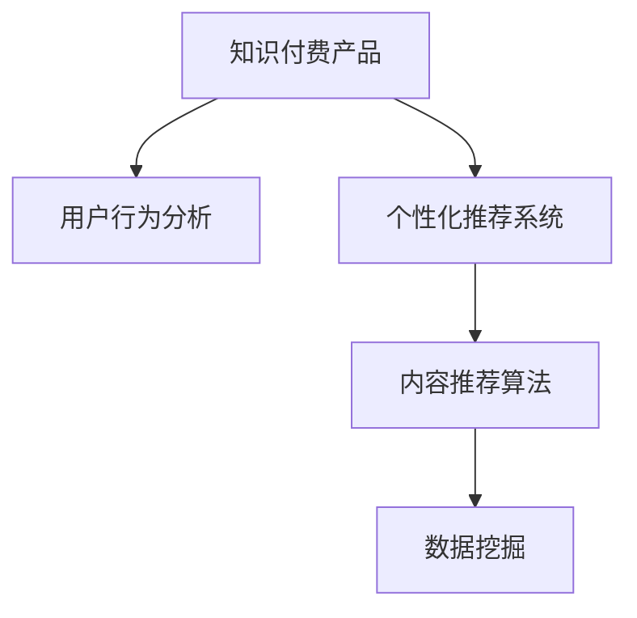

                 

# 如何提高知识付费产品的用户忠诚度

## 1. 背景介绍

### 1.1 问题由来
随着信息技术的飞速发展，知识付费作为一种新兴的商业模式，吸引了越来越多用户的关注。然而，如何保持用户的高频度和粘性，实现持续的收入增长，一直是知识付费平台面临的挑战。提高用户忠诚度，不仅有助于提升平台价值，也是当前互联网企业竞争的核心。

### 1.2 问题核心关键点
影响知识付费产品用户忠诚度的因素众多，包括内容质量、交互体验、价格策略、用户反馈机制等。本文将围绕核心问题，探讨如何通过技术手段和运营策略，最大化用户忠诚度，并带动平台的可持续健康发展。

## 2. 核心概念与联系

### 2.1 核心概念概述

为更好地理解提高知识付费产品用户忠诚度的技术路径，本节将介绍几个密切相关的核心概念：

- 知识付费产品（Knowledge Pay-to-Use Product）：即通过收取订阅费、单次购买等方式，提供有价值知识内容或服务的产品。
- 用户行为分析（User Behavior Analysis）：指通过数据分析工具，收集和分析用户在平台上的行为数据，以指导个性化推荐和内容优化。
- 个性化推荐系统（Personalized Recommendation System）：基于用户行为和偏好，推荐用户可能感兴趣的内容，提升用户体验和满意度。
- 内容推荐算法（Content Recommendation Algorithm）：指设计并实现推荐算法，以智能匹配用户和内容，最大化用户价值和平台收益。
- 数据挖掘（Data Mining）：指从大量数据中提取有用信息和模式，进行行为预测和用户分析。

这些核心概念之间的逻辑关系可以通过以下Mermaid流程图来展示：



这个流程图展示了大语言模型的核心概念及其之间的关系：

1. 知识付费产品作为信息服务的基础，需要通过用户行为分析来优化。
2. 个性化推荐系统利用用户行为数据，提升内容推荐精度和用户满意度。
3. 内容推荐算法是推荐系统的核心，影响着推荐效果。
4. 数据挖掘技术帮助分析用户数据，提升推荐算法的精度和效果。

这些核心概念共同构成了提高知识付费产品用户忠诚度的技术框架，使平台能够在不同用户群体中，实现个性化、高效化、智能化的内容推荐。

## 3. 核心算法原理 & 具体操作步骤
### 3.1 算法原理概述

提高知识付费产品用户忠诚度的技术路径，本质上是通过算法优化和运营策略，不断提升用户的满意度和粘性。其核心思想是：通过深度学习等先进算法，对用户行为和偏好进行建模和预测，个性化推荐合适的知识内容，满足用户需求，并持续改进推荐模型，提升推荐效果。

具体而言，包括以下几个关键步骤：

1. **数据采集与预处理**：通过SDK、API等方式，从知识付费平台采集用户行为数据，如浏览记录、购买行为、评分等，并对其进行清洗、归一化等预处理。

2. **特征工程与建模**：设计合适的特征，构建推荐模型。常见的模型包括协同过滤、基于内容的推荐、深度神经网络等。

3. **模型训练与优化**：使用机器学习算法，如随机梯度下降、Adam、FTRL等，对推荐模型进行训练和优化，提升模型预测精度。

4. **推荐系统部署与监控**：将训练好的推荐模型部署到推荐系统，并实时监控其性能指标，如点击率、转化率、留存率等，根据反馈进行调整。

5. **运营策略与用户互动**：根据推荐系统反馈的数据，制定运营策略，如新用户引导、个性化内容推广、VIP会员激励等，提升用户粘性。

### 3.2 算法步骤详解

以下详细讲解提高知识付费产品用户忠诚度的主要步骤：

**Step 1: 数据采集与预处理**
- 使用SDK或API从知识付费平台采集用户行为数据。
- 对数据进行去重、清洗、归一化等预处理，确保数据质量。
- 选择合适的特征，如用户ID、内容ID、浏览时间、评分等。

**Step 2: 特征工程与建模**
- 设计合适的特征：如用户历史浏览记录、内容标签、评论情感等。
- 选择适合的模型：如协同过滤、基于内容的推荐、深度神经网络等。
- 构建推荐模型：使用训练数据集对模型进行训练和验证。

**Step 3: 模型训练与优化**
- 选择合适的优化算法：如随机梯度下降、Adam、FTRL等。
- 设置合适的超参数：如学习率、批大小、迭代次数等。
- 监控模型性能：实时监控模型的点击率、转化率、留存率等指标。

**Step 4: 推荐系统部署与监控**
- 将训练好的推荐模型部署到生产环境。
- 实时监控推荐系统的性能指标。
- 根据反馈数据，调整推荐模型参数。

**Step 5: 运营策略与用户互动**
- 制定运营策略：如新用户引导、个性化内容推广、VIP会员激励等。
- 根据推荐系统反馈的数据，进行用户互动。
- 优化用户体验：如改进内容界面、提升搜索体验等。

### 3.3 算法优缺点

提高知识付费产品用户忠诚度的算法，具有以下优点：
1. 提升用户体验：通过个性化推荐，用户能够更快找到感兴趣的内容，提升满意度和粘性。
2. 提高运营效率：个性化推荐有助于减少内容筛选的耗时，提升内容分发效率。
3. 增加平台收益：个性化推荐可以提升用户付费概率和频率，带动平台收入增长。

同时，该算法也存在以下局限性：
1. 依赖大量标注数据：推荐模型需要大量标注数据进行训练，标注成本较高。
2. 冷启动问题：新用户没有足够历史数据，难以进行个性化推荐。
3. 动态性不足：推荐模型需要定期更新，难以应对内容动态变化。
4. 模型复杂度：复杂的推荐算法可能存在计算复杂度高、难以解释等问题。

尽管存在这些局限性，但就目前而言，基于推荐算法的个性化推荐仍然是提高知识付费产品用户忠诚度的最主流范式。未来相关研究的重点在于如何进一步降低推荐模型的计算复杂度，提高模型的解释性，同时兼顾可解释性和伦理安全性等因素。

### 3.4 算法应用领域

提高知识付费产品用户忠诚度的推荐算法，已经在诸多场景中得到了广泛应用，例如：

- 新用户引导：通过个性化内容推荐，帮助新用户快速找到兴趣点，提升留存率。
- 内容推广：根据用户行为数据，推荐新内容，提升用户粘性和参与度。
- 会员激励：基于用户历史行为数据，推荐高价值内容，增加会员订阅概率。
- 个性化推荐：根据用户历史行为，推荐个性化的课程或书籍，满足用户需求。
- 用户分析：通过数据分析，优化推荐策略，提升用户转化率和满意度。

除了上述这些经典场景外，推荐算法还被创新性地应用到更多场景中，如话题推荐、热点追踪、个性化社区等，为知识付费平台带来了全新的突破。随着推荐算法的不断进步，相信知识付费产品用户忠诚度将得到进一步提升。

## 4. 数学模型和公式 & 详细讲解 & 举例说明
### 4.1 数学模型构建

本节将使用数学语言对提高知识付费产品用户忠诚度的推荐算法进行更加严格的刻画。

记知识付费平台为 $K$，其用户集为 $U$，内容集为 $C$。设 $X_{ik}$ 为用户 $i$ 对内容 $k$ 的评分，$N_i$ 为用户 $i$ 的历史浏览记录数量。定义推荐模型 $M_{\theta}:\mathcal{U} \times \mathcal{C} \rightarrow [0,1]$，其中 $\mathcal{U}$ 为用户集，$\mathcal{C}$ 为内容集，$\theta$ 为模型参数。

定义推荐模型的损失函数为均方误差损失函数：

$$
\mathcal{L}(\theta) = \frac{1}{N}\sum_{i=1}^N \sum_{k=1}^{N_i} (y_{ik} - M_{\theta}(i,k))^2
$$

其中 $y_{ik} = 1$ 表示用户 $i$ 对内容 $k$ 评分高于平均评分，$y_{ik} = 0$ 表示评分低于平均评分。

为了求解最优模型参数 $\theta$，我们需要对其进行最小化优化：

$$
\theta^* = \mathop{\arg\min}_{\theta} \mathcal{L}(\theta)
$$

### 4.2 公式推导过程

以下我们以协同过滤推荐算法为例，推导其推荐模型和损失函数的计算公式。

假设用户 $i$ 对内容 $k$ 的评分 $x_{ik}$，表示用户 $i$ 对内容 $k$ 的兴趣程度。用户 $i$ 的历史浏览记录为 $k_1, k_2, ..., k_{N_i}$。内容 $k$ 的流行度为 $y_k$，表示内容 $k$ 的平均评分。

协同过滤算法的目标是最小化预测评分 $M_{\theta}(i,k)$ 和真实评分 $x_{ik}$ 之间的平方误差。定义协同过滤模型的预测评分公式为：

$$
M_{\theta}(i,k) = \sum_{j=1}^{N_j} \alpha_j \frac{x_{ij}}{\sqrt{N_i+1} \sqrt{N_j+1}} \cdot y_k
$$

其中 $\alpha_j$ 为用户 $j$ 的兴趣程度，$N_j$ 为用户 $j$ 的历史浏览记录数量。

利用均方误差损失函数，对模型参数 $\theta$ 进行优化：

$$
\mathcal{L}(\theta) = \frac{1}{N}\sum_{i=1}^N \sum_{k=1}^{N_i} (x_{ik} - M_{\theta}(i,k))^2
$$

其中 $x_{ik}$ 为真实评分，$M_{\theta}(i,k)$ 为模型预测评分。

通过梯度下降等优化算法，求解模型参数 $\theta$，得到最优预测评分 $M_{\theta}(i,k)$，完成推荐模型的训练。

### 4.3 案例分析与讲解

以某知识付费平台为例，说明协同过滤算法在该平台上的具体应用：

1. **用户行为数据采集**：通过SDK或API从平台采集用户浏览记录、评分等行为数据。
2. **数据预处理**：对数据进行去重、清洗、归一化等预处理，确保数据质量。
3. **协同过滤模型训练**：将预处理后的数据用于协同过滤模型训练，设定超参数如 $\alpha_j$ 的学习率、迭代次数等。
4. **推荐系统部署**：将训练好的协同过滤模型部署到推荐系统，实时生成个性化推荐。
5. **运营策略制定**：根据推荐系统反馈的数据，制定新用户引导、内容推广、会员激励等策略。

通过协同过滤算法，平台能够实现精准的个性化推荐，提升用户粘性和满意度，从而增强用户忠诚度。

## 5. 项目实践：代码实例和详细解释说明
### 5.1 开发环境搭建

在进行推荐系统开发前，我们需要准备好开发环境。以下是使用Python进行TensorFlow开发的环境配置流程：

1. 安装Anaconda：从官网下载并安装Anaconda，用于创建独立的Python环境。

2. 创建并激活虚拟环境：
```bash
conda create -n tf-env python=3.8 
conda activate tf-env
```

3. 安装TensorFlow：根据CUDA版本，从官网获取对应的安装命令。例如：
```bash
conda install tensorflow tensorflow-gpu=cuda11.1 -c tf -c conda-forge
```

4. 安装各类工具包：
```bash
pip install numpy pandas scikit-learn matplotlib tqdm jupyter notebook ipython
```

完成上述步骤后，即可在`tf-env`环境中开始推荐系统开发。

### 5.2 源代码详细实现

下面我们以协同过滤推荐算法为例，给出使用TensorFlow进行推荐系统开发的PyTorch代码实现。

首先，定义推荐系统的数据处理函数：

```python
import tensorflow as tf
from tensorflow.keras.layers import Dense, Input
from tensorflow.keras.models import Model

# 定义协同过滤算法的输入和输出
user_input = Input(shape=(1,), name='user_input')
item_input = Input(shape=(1,), name='item_input')
user_input = Dense(128, activation='relu')(user_input)
item_input = Dense(128, activation='relu')(item_input)
user_item = tf.keras.layers.Dot(axes=1, normalize=True)([user_input, item_input])
user_item = Dense(1, activation='sigmoid')(user_item)
recommender = Model(inputs=[user_input, item_input], outputs=user_item)

# 加载并预处理数据
train_data = pd.read_csv('train_data.csv')
train_data = train_data.dropna().reset_index(drop=True)
user_data = train_data[['user_id', 'item_id', 'rating']]
user_data = user_data.drop_duplicates().reset_index(drop=True)
user_data.columns = ['user', 'item', 'rating']

# 构建训练集
train_user = user_data['user'].value_counts().index.tolist()
train_item = user_data['item'].value_counts().index.tolist()
train_item = [train_item.index[x] for x in range(len(train_user))]
train_user = [train_user.index[x] for x in range(len(train_item))]

train_x = tf.keras.preprocessing.sequence.pad_sequences(train_user, maxlen=50)
train_y = train_item
```

然后，定义模型和优化器：

```python
# 定义协同过滤算法的模型参数
user_embed = tf.keras.layers.Embedding(len(train_user), 100)(train_user)
item_embed = tf.keras.layers.Embedding(len(train_item), 100)(train_item)
user_item = tf.keras.layers.Dot(axes=1, normalize=True)([user_embed, item_embed])
user_item = tf.keras.layers.Dense(1, activation='sigmoid')(user_item)
recommender = tf.keras.models.Model(inputs=[user_embed, item_embed], outputs=user_item)

# 定义模型优化器
optimizer = tf.keras.optimizers.Adam(learning_rate=0.001)

# 编译模型
recommender.compile(loss='mse', optimizer=optimizer)
```

接着，定义训练和评估函数：

```python
# 定义训练函数
def train_recommender(recommender, train_data, batch_size=64, epochs=10):
    recommender.fit(train_data, epochs=epochs, batch_size=batch_size, verbose=2)

# 定义评估函数
def evaluate_recommender(recommender, test_data):
    test_pred = recommender.predict(test_data)
    test_pred = tf.keras.activations.sigmoid(test_pred)
    test_pred = tf.keras.activations.sigmoid(test_pred)
    return test_pred
```

最后，启动训练流程并在测试集上评估：

```python
# 加载并预处理测试数据
test_data = pd.read_csv('test_data.csv')
test_data = test_data.dropna().reset_index(drop=True)
user_data = test_data[['user_id', 'item_id']]
user_data = user_data.drop_duplicates().reset_index(drop=True)
user_data.columns = ['user', 'item']
test_user = user_data['user'].value_counts().index.tolist()
test_item = user_data['item'].value_counts().index.tolist()
test_item = [test_item.index[x] for x in range(len(test_user))]
test_user = [test_user.index[x] for x in range(len(test_item))]

test_x = tf.keras.preprocessing.sequence.pad_sequences(test_user, maxlen=50)
test_x = test_x.reshape(test_x.shape[0], 1, test_x.shape[1])
test_item = [test_item.index[x] for x in range(len(test_x))]
test_item = tf.keras.preprocessing.sequence.pad_sequences(test_item, maxlen=50)

# 训练模型
train_recommender(recommender, train_data)

# 评估模型
test_pred = evaluate_recommender(recommender, test_data)
print(test_pred)
```

以上就是使用TensorFlow进行协同过滤推荐算法开发的完整代码实现。可以看到，TensorFlow的Keras API使得构建推荐模型变得简洁高效。

### 5.3 代码解读与分析

让我们再详细解读一下关键代码的实现细节：

**协同过滤推荐算法**：
- 首先定义了推荐系统的输入和输出，包括用户嵌入和物品嵌入。
- 然后定义了用户嵌入和物品嵌入的权重矩阵，并使用点积层计算用户和物品的协同向量。
- 最后通过一个全连接层和sigmoid激活函数，输出推荐结果。

**数据预处理**：
- 使用Pandas加载训练数据，并对数据进行清洗和归一化。
- 将用户ID和物品ID转换为稠密向量，确保模型能够处理稀疏数据。

**模型训练和评估**：
- 使用TensorFlow的Keras API，定义推荐模型并编译，选择合适的损失函数和优化器。
- 使用训练数据进行模型训练，设定超参数如迭代次数和学习率等。
- 使用测试数据评估模型性能，输出推荐结果。

通过TensorFlow的强大工具，推荐系统开发变得更加高效便捷，开发者可以专注于算法优化和业务场景构建。

## 6. 实际应用场景
### 6.1 智能客服系统

基于推荐算法的个性化推荐技术，可以广泛应用于智能客服系统的构建。智能客服系统能够快速响应客户咨询，通过推荐合适的知识库、常见问题等，提升客户满意度。

在技术实现上，可以收集客户历史查询记录和回复，将问题和最佳答复构建成监督数据，在此基础上对预训练推荐模型进行微调。推荐模型能够自动理解用户意图，匹配最合适的回答。对于客户提出的新问题，还可以接入检索系统实时搜索相关内容，动态组织生成回答。如此构建的智能客服系统，能大幅提升客户咨询体验和问题解决效率。

### 6.2 金融舆情监测

金融机构需要实时监测市场舆论动向，以便及时应对负面信息传播，规避金融风险。推荐算法可以用于金融舆情监测，通过实时抓取的网络文本数据，自动推荐可能对市场有重大影响的舆情信息。

在技术实现上，可以收集金融领域相关的新闻、报道、评论等文本数据，并对其进行主题标注和情感标注。在此基础上对预训练推荐模型进行微调，使其能够自动判断文本属于何种主题，情感倾向是正面、中性还是负面。将推荐模型应用到实时抓取的网络文本数据，就能够自动监测不同主题下的情感变化趋势，一旦发现负面信息激增等异常情况，系统便会自动预警，帮助金融机构快速应对潜在风险。

### 6.3 个性化推荐系统

推荐算法已经成为知识付费平台的核心竞争力，通过个性化推荐，平台能够提升用户体验和满意度，增加用户粘性。

在技术实现上，可以收集用户浏览记录、评分等行为数据，构建协同过滤推荐模型，并实时生成个性化推荐。推荐系统可以动态调整推荐策略，根据用户行为数据和反馈调整推荐内容，实现更加精准和高效的推荐。

### 6.4 未来应用展望

随着推荐算法的不断进步，其在知识付费产品中的应用将更加广泛和深入。未来推荐算法将拓展到更多场景，如智能导购、智慧医疗、智能家居等，提升各行业的服务质量和用户体验。

在技术层面，推荐算法将融合更多新兴技术，如知识图谱、生成对抗网络（GAN）、强化学习等，提升推荐系统的智能性和鲁棒性。在应用层面，推荐系统将更广泛地应用于各类智能系统中，实现数据驱动的智能化决策。

## 7. 工具和资源推荐
### 7.1 学习资源推荐

为了帮助开发者系统掌握推荐算法的理论基础和实践技巧，这里推荐一些优质的学习资源：

1. 《推荐系统实战》系列博文：由知名推荐系统专家撰写，深入浅出地介绍了推荐系统的核心算法和工程实现，适合入门学习和实践。

2. 《机器学习实战》课程：由UC Berkeley开设的机器学习课程，涵盖了机器学习的基本概念和算法，适合初学者。

3. 《深度学习》书籍：DeepLearning.ai推出的深度学习课程，涵盖了深度神经网络、卷积神经网络、生成对抗网络等深度学习模型，适合进一步提升技术深度。

4. Kaggle：全球知名的数据科学竞赛平台，提供丰富的推荐系统竞赛和数据集，适合实战练习和经验积累。

5. 《Python推荐系统实战》书籍：由资深推荐系统工程师撰写，全面介绍了推荐系统的构建和优化方法，适合实战应用。

通过对这些资源的学习实践，相信你一定能够快速掌握推荐算法的精髓，并用于解决实际的推荐问题。

### 7.2 开发工具推荐

高效的开发离不开优秀的工具支持。以下是几款用于推荐算法开发的常用工具：

1. Python：推荐系统开发的主流语言，语法简洁、生态丰富，适合快速迭代研究。

2. TensorFlow：由Google主导开发的开源深度学习框架，生产部署方便，适合大规模工程应用。

3. PyTorch：Facebook开源的深度学习框架，灵活动态，适合深度学习研究。

4. Weights & Biases：模型训练的实验跟踪工具，可以记录和可视化模型训练过程中的各项指标，方便对比和调优。

5. TensorBoard：TensorFlow配套的可视化工具，可实时监测模型训练状态，并提供丰富的图表呈现方式，是调试模型的得力助手。

6. Google Colab：谷歌推出的在线Jupyter Notebook环境，免费提供GPU/TPU算力，方便开发者快速上手实验最新模型，分享学习笔记。

合理利用这些工具，可以显著提升推荐算法的开发效率，加快创新迭代的步伐。

### 7.3 相关论文推荐

推荐算法的发展源于学界的持续研究。以下是几篇奠基性的相关论文，推荐阅读：

1. Collaborative Filtering for Recommender Systems：提出了协同过滤推荐算法的核心思想，奠定了协同过滤算法的基础。

2. A Survey on Deep Learning for Recommendation Systems：综述了深度学习在推荐系统中的应用，包括协同过滤、基于内容的推荐等。

3. Attention is All You Need（即Transformer原论文）：提出了Transformer结构，开启了深度学习推荐系统的新篇章。

4. Factorization Machines for Recommender Systems：提出FM模型，适用于大规模稀疏数据推荐。

5. Deep Factorization Machines：将深度学习与FM模型结合，适用于更复杂的推荐场景。

这些论文代表了大语言模型推荐算法的进展脉络。通过学习这些前沿成果，可以帮助研究者把握学科前进方向，激发更多的创新灵感。

## 8. 总结：未来发展趋势与挑战
### 8.1 总结

本文对基于推荐算法的大语言产品用户忠诚度提升技术进行了全面系统的介绍。首先阐述了推荐算法的核心思想和应用背景，明确了推荐算法在提升用户满意度和粘性方面的独特价值。其次，从原理到实践，详细讲解了推荐算法的数学模型和实现细节，给出了推荐系统开发的完整代码实例。同时，本文还广泛探讨了推荐算法在智能客服、金融舆情、个性化推荐等多个行业领域的应用前景，展示了推荐算法的广泛适用性。

通过本文的系统梳理，可以看到，基于推荐算法的个性化推荐技术正在成为知识付费产品用户忠诚度提升的重要范式，极大地拓展了知识付费平台的业务能力，并推动了AI技术在各行业的落地应用。未来，伴随推荐算法的不断进步，知识付费产品用户忠诚度必将在更广泛的场景中得到提升。

### 8.2 未来发展趋势

展望未来，推荐算法的发展将呈现以下几个趋势：

1. 算法复杂度提升：推荐算法将融合更多新兴技术，如知识图谱、生成对抗网络（GAN）、强化学习等，提升推荐系统的智能性和鲁棒性。

2. 数据多样性增强：推荐算法将融合更多类型的数据，如多模态数据（视觉、语音、文本）、动态数据等，提升推荐系统的丰富性和实时性。

3. 推荐效果改进：推荐算法将结合因果推断、对比学习等方法，提升推荐模型的准确性和稳定性。

4. 模型可解释性增强：推荐算法将结合可解释性技术，如LIME、SHAP等，提升模型的透明度和可理解性。

5. 个性化推荐更加精准：推荐算法将结合个性化推荐技术，如深度记忆网络、序列推荐等，提升推荐模型的个性化程度和用户满意度。

6. 推荐系统协同化：推荐系统将与内容生成、用户互动等系统协同工作，形成闭环推荐，提升推荐效果和用户体验。

以上趋势凸显了推荐算法的广阔前景。这些方向的探索发展，必将进一步提升推荐系统的效果和应用范围，为各行业提供更加智能化的服务。

### 8.3 面临的挑战

尽管推荐算法已经在诸多场景中得到了广泛应用，但在迈向更加智能化、普适化应用的过程中，它仍面临诸多挑战：

1. 冷启动问题：新用户没有足够历史数据，难以进行个性化推荐。

2. 数据隐私和安全：如何保护用户数据隐私，防止数据泄露和滥用。

3. 动态变化性：推荐算法需要不断更新，以应对内容和用户行为的动态变化。

4. 可解释性不足：推荐算法通常是"黑盒"系统，难以解释其内部工作机制和决策逻辑。

5. 计算复杂度高：复杂的推荐算法可能存在计算复杂度高、难以解释等问题。

尽管存在这些挑战，但通过不断的研究和探索，推荐算法的应用前景依然广阔。相信随着技术的不断发展，推荐算法将在更多领域得到应用，为人类带来更加智能、便捷的服务体验。

### 8.4 研究展望

面对推荐算法所面临的种种挑战，未来的研究需要在以下几个方面寻求新的突破：

1. 探索更高效的推荐算法：开发更加参数高效、计算高效的推荐方法，如AdaLoRA、Prefix-Tuning等，在固定大部分预训练参数的情况下，仍能取得不错的微调效果。

2. 增强推荐算法的可解释性：结合可解释性技术，如LIME、SHAP等，提升推荐算法的透明度和可理解性。

3. 融合更多类型的数据：推荐算法将融合更多类型的数据，如多模态数据、动态数据等，提升推荐系统的丰富性和实时性。

4. 提升推荐算法的智能性：融合因果推断、对比学习等方法，提升推荐模型的准确性和稳定性。

5. 保护用户隐私：结合隐私保护技术，如差分隐私、联邦学习等，保护用户数据隐私，防止数据泄露和滥用。

6. 提升推荐系统的可扩展性：设计更加高效的推荐系统架构，提升系统的可扩展性和实时性，满足大规模业务需求。

这些研究方向将推动推荐算法在推荐系统中的应用，为用户带来更加智能、便捷的服务体验。面向未来，推荐算法将不断融合新兴技术，拓展应用场景，提升推荐效果和用户体验。

## 9. 附录：常见问题与解答

**Q1：推荐算法是否适用于所有NLP任务？**

A: 推荐算法在大多数NLP任务上都能取得不错的效果，特别是对于数据量较小的任务。但对于一些特定领域的任务，如医学、法律等，仅仅依靠通用语料预训练的模型可能难以很好地适应。此时需要在特定领域语料上进一步预训练，再进行微调，才能获得理想效果。此外，对于一些需要时效性、个性化很强的任务，如对话、推荐等，推荐方法也需要针对性的改进优化。

**Q2：推荐算法的训练成本如何？**

A: 推荐算法的训练成本较高，需要大量标注数据和计算资源。训练过程通常包括特征工程、模型构建、参数优化等步骤，时间较长。此外，模型的复杂度和数据量也会影响训练成本。例如，深度神经网络模型通常需要更大规模的数据和计算资源进行训练，而协同过滤算法相对简洁，训练成本较低。

**Q3：推荐算法如何优化用户体验？**

A: 推荐算法通过个性化推荐，能够快速找到用户感兴趣的内容，提升用户体验和满意度。具体优化措施包括：
1. 新用户引导：推荐系统通过个性化内容推荐，帮助新用户快速找到兴趣点，提升留存率。
2. 内容推广：根据用户行为数据，推荐新内容，提升用户粘性和参与度。
3. 会员激励：基于用户历史行为数据，推荐高价值内容，增加会员订阅概率。

通过个性化推荐，推荐算法能够满足用户需求，提升用户粘性和满意度，从而增强用户忠诚度。

**Q4：推荐算法如何结合业务场景？**

A: 推荐算法结合业务场景，可以通过以下方式实现：
1. 用户行为数据采集：通过SDK或API从知识付费平台采集用户浏览记录、评分等行为数据。
2. 数据预处理：对数据进行去重、清洗、归一化等预处理，确保数据质量。
3. 协同过滤模型训练：将预处理后的数据用于协同过滤模型训练，设定超参数如 $\alpha_j$ 的学习率、迭代次数等。
4. 推荐系统部署：将训练好的协同过滤模型部署到推荐系统，实时生成个性化推荐。
5. 运营策略制定：根据推荐系统反馈的数据，制定新用户引导、内容推广、会员激励等策略。

通过推荐算法的优化和运营策略，知识付费产品能够实现精准的内容推荐，提升用户体验和满意度，从而增强用户忠诚度。

---

作者：禅与计算机程序设计艺术 / Zen and the Art of Computer Programming

