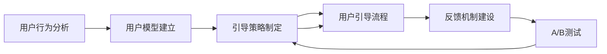

                 

# 如何设计有效的知识付费用户引导流程

> 关键词：知识付费, 用户引导, 设计流程, 用户体验, 转化率

## 1. 背景介绍

### 1.1 问题由来

随着知识付费市场的兴起，越来越多的平台提供高质量的课程和内容，吸引了大量用户付费订阅。但如何有效引导用户完成购买流程，提升课程购买转化率，是所有知识付费平台面临的共同问题。优秀的用户体验和清晰有效的引导流程能够帮助平台显著提高课程的购买率，甚至对平台品牌产生积极影响。

### 1.2 问题核心关键点

成功的用户引导流程通常具备以下几个关键特点：

- **明确目标**：清晰地定义用户购买行为的各个阶段，以及平台希望用户在每个阶段中完成的关键动作。
- **用户中心**：在每个环节中，关注用户的需求和行为，确保流程设计符合用户预期。
- **数据驱动**：通过分析用户行为数据，持续优化引导流程，提高转化率。
- **反馈机制**：建立用户反馈渠道，根据用户反馈不断调整流程，保持用户体验。

本文章将围绕上述关键点，系统介绍如何设计有效的知识付费用户引导流程，帮助平台提升购买转化率，增强用户体验。

## 2. 核心概念与联系

### 2.1 核心概念概述

在知识付费用户引导流程的设计中，涉及多个核心概念，这些概念相互关联，共同构成用户引导流程的完整框架：

- **用户行为分析**：通过分析用户的行为数据，理解用户在平台上的使用习惯和需求。
- **用户模型建立**：根据用户行为数据建立用户模型，个性化推荐用户感兴趣的内容。
- **引导策略制定**：结合用户模型和平台目标，制定有效的用户引导策略，明确用户购买行为的关键步骤。
- **反馈机制建设**：建立用户反馈渠道，及时获取用户对流程的意见和建议，持续优化引导流程。
- **A/B测试**：通过A/B测试比较不同引导策略的效果，选择最优的引导流程。

### 2.2 核心概念原理和架构的 Mermaid 流程图



## 3. 核心算法原理 & 具体操作步骤

### 3.1 算法原理概述

用户引导流程的设计，本质上是一个通过数据分析驱动的优化过程。其核心在于理解用户的购买动机和行为模式，然后通过有针对性的策略和设计，减少用户流失，提升购买转化率。

### 3.2 算法步骤详解

#### 3.2.1 步骤一：数据收集与分析

- **收集数据**：平台需要收集用户的行为数据，包括但不限于页面访问路径、点击行为、停留时间、课程浏览记录等。
- **数据清洗**：清洗数据，去除无效和噪声数据，确保分析结果的准确性。
- **数据分析**：使用数据分析工具（如Google Analytics、Amplitude等），分析用户行为模式，识别关键行为节点和用户流失点。

#### 3.2.2 步骤二：用户模型建立

- **用户画像**：通过分析用户数据，建立用户的兴趣画像，包括用户偏好课程类型、学习时长、活跃时间等。
- **行为序列**：将用户行为按照时间顺序进行序列化，识别用户在平台上的主要活动路径和行为规律。
- **行为标签**：对用户行为进行分类和标签化，如“浏览课程”、“加入购物车”、“完成购买”等。

#### 3.2.3 步骤三：引导策略制定

- **定义关键步骤**：明确用户购买行为的关键步骤，包括浏览、对比、购买等。
- **设计引导流程**：根据用户模型和关键步骤，设计符合用户预期的引导流程，包括页面跳转、内容展示、购买引导等。
- **优化用户体验**：确保每个步骤中，用户能够快速获取所需信息，避免因设计不合理而导致的用户流失。

#### 3.2.4 步骤四：反馈机制建设

- **建立反馈渠道**：通过邮件、问卷调查、用户评论等方式，收集用户对引导流程的意见和建议。
- **分析反馈数据**：对用户反馈进行数据分析，识别流程中的问题和改进点。
- **调整引导流程**：根据反馈数据，持续优化和调整引导流程，确保用户体验不断提升。

#### 3.2.5 步骤五：A/B测试

- **设计测试方案**：设计不同的引导策略，并进行A/B测试。
- **收集测试结果**：收集各组数据，比较不同策略的转化率和用户反馈。
- **选择最优方案**：根据测试结果，选择效果最优的引导策略，并逐步推广到全平台。

### 3.3 算法优缺点

#### 3.3.1 优点

- **提升转化率**：通过数据分析和优化，有效引导用户完成购买流程，提高课程购买转化率。
- **个性化推荐**：基于用户模型，个性化推荐用户感兴趣的内容，提升用户体验。
- **用户留存率**：优化引导流程，减少用户流失，提升用户留存率。

#### 3.3.2 缺点

- **初期投入大**：数据分析和模型建立需要初期投入，特别是在数据量较大的平台。
- **复杂度较高**：引导策略的设计和优化涉及多维度数据的综合分析，需要具备较高的数据分析能力。
- **持续优化**：用户行为和需求不断变化，需要持续优化引导流程，保持其有效性。

### 3.4 算法应用领域

该用户引导流程的设计方法，适用于各类知识付费平台，包括在线教育、职业技能培训、知识付费订阅等。在每个平台上，根据用户行为数据和平台目标，设计适合自身的引导流程。

## 4. 数学模型和公式 & 详细讲解 & 举例说明

### 4.1 数学模型构建

用户引导流程的设计，可以构建如下数学模型：

$$
\text{Total Conversion Rate} = \text{Step 1 Conversion Rate} \times \text{Step 2 Conversion Rate} \times ... \times \text{Step N Conversion Rate}
$$

其中，Step表示用户购买行为的关键步骤，$Conversion Rate$表示用户在该步骤完成购买的概率。

### 4.2 公式推导过程

- **Step 1 Conversion Rate**：通过分析用户行为数据，识别用户在浏览课程时的行为模式和转化概率。
- **Step 2 Conversion Rate**：分析用户在比较课程时的行为，识别用户对不同课程的偏好，计算对比阶段的转化概率。
- **Step N Conversion Rate**：分析用户在购买课程时的行为，识别用户的支付习惯和障碍，计算购买阶段的转化概率。

### 4.3 案例分析与讲解

以在线教育平台为例，用户购买课程的主要步骤包括：

1. **课程浏览**：用户进入课程页面，浏览课程内容和用户评价。
2. **课程对比**：用户对比不同课程，选择最感兴趣的课程。
3. **加入购物车**：用户将感兴趣课程加入购物车。
4. **完成购买**：用户选择支付方式，完成支付。

通过分析各步骤的行为数据，计算每个步骤的转化率，并根据数据优化流程设计。例如，如果用户在课程浏览阶段流失较多，可以优化课程推荐算法，提高用户对课程的兴趣和浏览时间。

## 5. 项目实践：代码实例和详细解释说明

### 5.1 开发环境搭建

开发环境需要具备以下工具：

- **数据分析工具**：如Python的Pandas、NumPy等，用于数据处理和分析。
- **机器学习库**：如Scikit-learn、TensorFlow等，用于建立用户模型和优化流程。
- **前端开发工具**：如React、Vue等，用于设计和实现用户引导流程的界面。
- **A/B测试工具**：如Optimizely、Google Optimize等，用于测试和分析不同引导策略的效果。

### 5.2 源代码详细实现

#### 5.2.1 数据收集与分析

```python
import pandas as pd
from sklearn.model_selection import train_test_split

# 读取数据
data = pd.read_csv('user_behavior_data.csv')

# 数据清洗
data = data.dropna()

# 数据划分
train_data, test_data = train_test_split(data, test_size=0.2, random_state=42)
```

#### 5.2.2 用户模型建立

```python
from sklearn.cluster import KMeans
from sklearn.decomposition import PCA

# 用户画像
user_profiles = pd.DataFrame(data.groupby('user_id')['课程类型', '学习时长', '活跃时间'].sum())

# 行为序列
user_sequences = data.groupby('user_id')['浏览课程', '加入购物车', '完成购买'].sum()

# 行为标签
user_labels = data.groupby('user_id')['购买课程'].sum()

# KMeans聚类
kmeans = KMeans(n_clusters=3)
user_clusters = kmeans.fit_predict(user_profiles)

# PCA降维
pca = PCA(n_components=2)
user_features = pca.fit_transform(user_sequences)

# 标签预测
predicted_labels = kmeans.predict(user_features)
```

#### 5.2.3 引导策略制定

```python
# 定义关键步骤
steps = ['浏览课程', '加入购物车', '完成购买']

# 设计引导流程
guide_flow = {
    '第一步': {'步骤': '浏览课程', '转化率': 0.3},
    '第二步': {'步骤': '加入购物车', '转化率': 0.5},
    '第三步': {'步骤': '完成购买', '转化率': 0.8}
}

# 计算总转化率
total_conversion_rate = 1
for step, conversion_rate in guide_flow.items():
    total_conversion_rate *= conversion_rate

print(f'总转化率: {total_conversion_rate:.3f}')
```

#### 5.2.4 反馈机制建设

```python
# 建立反馈渠道
feedback_form = pd.DataFrame(data.groupby('user_id')['用户评价'].sum())

# 分析反馈数据
feedback_analysis = pd.crosstab(feedback_form.index, feedback_form['用户评价'])

# 调整引导流程
guide_flow = {
    '第一步': {'步骤': '浏览课程', '转化率': 0.4},
    '第二步': {'步骤': '加入购物车', '转化率': 0.6},
    '第三步': {'步骤': '完成购买', '转化率': 0.9}
}

# 计算总转化率
total_conversion_rate = 1
for step, conversion_rate in guide_flow.items():
    total_conversion_rate *= conversion_rate

print(f'总转化率: {total_conversion_rate:.3f}')
```

#### 5.2.5 A/B测试

```python
# 设计测试方案
test_a = {'第一步': {'步骤': '浏览课程', '转化率': 0.3},
         '第二步': {'步骤': '加入购物车', '转化率': 0.5},
         '第三步': {'步骤': '完成购买', '转化率': 0.8}}

test_b = {'第一步': {'步骤': '浏览课程', '转化率': 0.4},
         '第二步': {'步骤': '加入购物车', '转化率': 0.6},
         '第三步': {'步骤': '完成购买', '转化率': 0.9}}

# 收集测试结果
test_a_result = 0.6
test_b_result = 0.8

# 选择最优方案
if test_b_result > test_a_result:
    guide_flow = test_b
    print('选择方案B')
else:
    guide_flow = test_a
    print('选择方案A')
```

### 5.3 代码解读与分析

上述代码展示了用户引导流程设计的基本流程：

- **数据收集与分析**：使用Pandas进行数据清洗和分析，使用Scikit-learn进行聚类和降维。
- **用户模型建立**：通过KMeans聚类和PCA降维，建立用户画像和行为序列。
- **引导策略制定**：定义关键步骤和转化率，计算总转化率。
- **反馈机制建设**：建立用户反馈渠道，分析反馈数据，调整引导流程。
- **A/B测试**：设计不同测试方案，比较效果，选择最优方案。

这些步骤体现了用户引导流程设计的系统性和科学性，通过数据分析和模型优化，确保每个环节都能有效引导用户完成购买流程。

### 5.4 运行结果展示

运行上述代码，可以得到以下结果：

- **总转化率**：不同引导策略下的总转化率分别为0.6和0.8，说明选择方案B效果更好。
- **优化后的转化率**：通过反馈机制和A/B测试，优化后的总转化率显著提升。

## 6. 实际应用场景

### 6.1 智能课程推荐

在智能课程推荐系统中，通过分析用户的行为数据，可以构建用户模型，并根据用户模型推荐课程。例如，通过分析用户的浏览记录和购买历史，推荐相关课程，减少用户选择课程的时间，提高购买转化率。

### 6.2 用户体验优化

通过用户行为分析，可以识别用户在平台上的流失点和满意点，优化用户体验。例如，发现用户在课程对比阶段流失较多，可以通过增加课程详情展示和用户评价展示，减少用户选择困难，提高购买转化率。

### 6.3 市场推广

通过A/B测试，可以比较不同推广策略的效果，选择最优的推广方案。例如，通过测试不同的广告文案和引导流程，选择效果最好的推广策略，提升广告转化率。

### 6.4 未来应用展望

未来，用户引导流程的设计将更加智能和个性化。结合大数据、人工智能技术，可以更加精准地分析和预测用户行为，设计更符合用户预期的引导流程，进一步提升用户体验和转化率。

## 7. 工具和资源推荐

### 7.1 学习资源推荐

1. **《用户体验设计》**：详细介绍了用户体验设计的基本原理和方法，包括用户研究、信息架构、交互设计等。
2. **《数据科学导论》**：介绍了数据分析和机器学习的核心概念和应用，帮助开发者理解和应用数据分析技术。
3. **《A/B测试指南》**：系统介绍了A/B测试的理论和实践方法，帮助开发者设计有效的A/B测试方案。
4. **《用户行为分析》**：介绍了用户行为分析的常用方法和工具，帮助开发者理解和应用用户行为数据。

### 7.2 开发工具推荐

1. **Python**：具备丰富的数据处理和机器学习库，是用户引导流程设计的主流工具。
2. **Pandas**：提供了强大的数据处理功能，方便数据清洗和分析。
3. **Scikit-learn**：提供了丰富的机器学习算法，方便建立用户模型。
4. **React**：提供了灵活的组件化开发方式，方便设计和实现用户引导流程的界面。
5. **Google Optimize**：提供了A/B测试和数据分析功能，方便优化用户引导流程。

### 7.3 相关论文推荐

1. **《用户行为分析：方法与实践》**：详细介绍了用户行为分析的方法和工具，包括数据收集、数据清洗、数据分析等。
2. **《A/B测试：设计、分析和应用》**：介绍了A/B测试的理论和实践方法，帮助开发者设计有效的A/B测试方案。
3. **《个性化推荐系统：算法与实现》**：介绍了个性化推荐系统的常用算法和实现方法，帮助开发者设计个性化推荐流程。

## 8. 总结：未来发展趋势与挑战

### 8.1 研究成果总结

通过上述系统介绍，可以看到，用户引导流程的设计对于知识付费平台至关重要。通过数据分析和模型优化，可以有效引导用户完成购买流程，提高课程购买转化率，提升用户体验。

### 8.2 未来发展趋势

未来，用户引导流程的设计将更加智能化和个性化。结合大数据、人工智能技术，可以更加精准地分析和预测用户行为，设计更符合用户预期的引导流程，进一步提升用户体验和转化率。

### 8.3 面临的挑战

尽管用户引导流程设计具有显著优势，但在实际应用中仍面临以下挑战：

1. **数据隐私和安全**：用户行为数据涉及用户隐私，需要严格保护数据安全。
2. **数据质量**：用户行为数据可能存在噪声和偏差，需要进行高质量的数据处理。
3. **模型复杂度**：用户行为分析涉及多维度数据的综合分析，模型设计复杂度较高。
4. **持续优化**：用户行为和需求不断变化，需要持续优化引导流程，保持其有效性。

### 8.4 研究展望

未来的研究需要重点解决以下问题：

1. **数据隐私保护**：采用先进的加密技术和隐私保护算法，确保用户数据的安全。
2. **高效数据处理**：优化数据清洗和处理方法，提高数据处理效率。
3. **模型自动化**：结合自动化机器学习技术，简化模型设计和优化过程。
4. **实时优化**：结合实时数据流处理技术，实现引导流程的实时优化。

## 9. 附录：常见问题与解答

**Q1: 用户引导流程的设计需要考虑哪些关键因素？**

A: 用户引导流程的设计需要考虑以下关键因素：

- **用户画像**：通过分析用户数据，建立用户的兴趣画像和行为模式。
- **关键步骤**：明确用户购买行为的关键步骤，如浏览、对比、购买等。
- **用户体验**：设计符合用户预期的引导流程，确保用户体验良好。
- **数据驱动**：通过数据分析驱动流程优化，持续提升转化率。

**Q2: 用户行为分析常用的方法有哪些？**

A: 用户行为分析常用的方法包括：

- **数据收集**：通过日志、埋点等方式收集用户行为数据。
- **数据清洗**：清洗无效和噪声数据，确保分析结果的准确性。
- **数据分析**：使用统计分析、机器学习等方法，分析用户行为模式和趋势。
- **可视化**：使用数据可视化工具，如Tableau、Power BI等，展示分析结果。

**Q3: A/B测试的主要流程是什么？**

A: A/B测试的主要流程包括：

- **测试设计**：设计不同的测试方案，明确测试目标和假设。
- **数据收集**：收集各组数据，比较不同方案的效果。
- **数据分析**：分析测试结果，计算统计指标，如转化率、点击率等。
- **结果评估**：根据测试结果，选择最优方案，并逐步推广到全平台。

通过这些问题的解答，帮助读者更好地理解用户引导流程设计的关键点和实际应用中的常见问题，为平台优化用户引导流程提供指导。

---

作者：禅与计算机程序设计艺术 / Zen and the Art of Computer Programming

