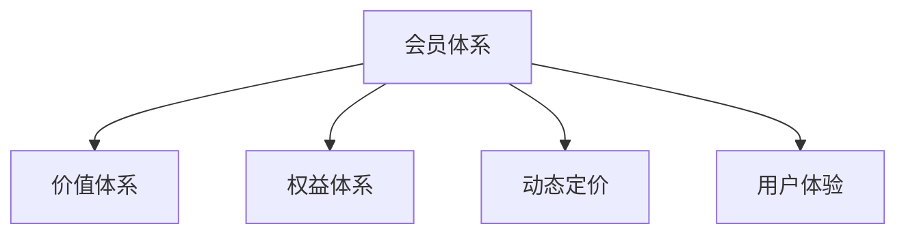

                 

# 如何设计知识付费产品的会员体系

## 1. 背景介绍

随着互联网的发展，知识付费已经成为一个重要的商业模式。用户对知识内容的需求不断增长，同时对付费体验的期望也日益提高。设计一个好的会员体系，可以显著提升用户体验和平台收入，实现用户和平台的双赢。

### 1.1 问题由来
在知识付费领域，不同的产品平台有着不同的会员体系设计。但普遍存在的问题是，会员体系设计不合理，无法真正吸引和留住用户，导致用户流失率高，续费率低。

### 1.2 问题核心关键点
设计知识付费产品会员体系的核心在于满足用户需求，同时最大化平台收益。用户需求可以总结为以下几个方面：
- 内容丰富度：提供大量高质量、多样化的内容。
- 内容时效性：内容更新及时，与时俱进。
- 学习路径：根据用户需求和兴趣，推荐个性化学习路径。
- 学习效率：提供便捷的学习工具和资源，提升学习效率。
- 社区互动：提供交流平台，提升用户粘性。
- 服务保障：提供专业客服和售后服务，保障用户权益。

而平台收益则主要依赖于：
- 付费转化率：新用户能够转化为付费用户，并愿意长期续费。
- 付费额度：单个用户愿意支付的金额，和购买频次。
- 用户复购率：现有用户能够频繁续费，实现长期收益。

## 2. 核心概念与联系

### 2.1 核心概念概述

设计知识付费产品的会员体系时，需要理解以下核心概念：

- **会员体系**：根据用户价值进行分级，制定不同的权益和服务，吸引和留住用户，实现收益最大化。
- **价值体系**：对用户进行分类，如入门级、中高级、高级用户，根据不同层次的用户，提供不同层次的内容和服务。
- **权益体系**：设计不同的会员权益，如免费时长、免费下载、优先服务、专属资源等，吸引用户购买和续费。
- **动态定价**：根据市场需求和竞争情况，灵活调整定价策略，实现收益最大化。
- **用户体验**：提升用户体验，增强用户粘性，增加用户生命周期价值。

这些概念之间的逻辑关系可以通过以下Mermaid流程图来展示：



## 3. 核心算法原理 & 具体操作步骤

### 3.1 算法原理概述

知识付费产品的会员体系设计，可以理解为一种市场细分（Market Segmentation）和动态定价（Dynamic Pricing）的策略。通过细分市场，对不同层次的用户提供差异化的服务和定价，从而最大化用户价值和平台收益。

具体步骤如下：

1. **用户价值分析**：分析用户行为数据，根据用户的付费能力、活跃度、消费习惯等因素，对用户进行分类和打分。
2. **会员级别划分**：根据用户价值，划分为不同的会员级别。
3. **权益和服务设计**：根据会员级别，设计不同的权益和服务。
4. **定价策略制定**：根据市场需求和竞争情况，制定不同会员级别的定价策略。
5. **用户体验优化**：根据用户反馈，不断优化会员体系和服务，提升用户满意度和粘性。

### 3.2 算法步骤详解

#### 3.2.1 用户价值分析

用户价值分析是会员体系设计的基础。一般可以从以下几个方面进行分析：

- **用户活跃度**：分析用户在平台上的活跃度，如日均访问时长、阅读文章数、课程观看时长等。
- **付费行为**：分析用户的付费行为，如是否付费、消费金额、续费频率等。
- **消费偏好**：分析用户的消费偏好，如课程主题偏好、学习时间偏好、消费场景偏好等。

可以通过数据挖掘和机器学习技术，建立用户价值评分模型，对用户进行分类和打分。

#### 3.2.2 会员级别划分

根据用户价值评分，将用户划分为不同的会员级别。一般可以将会员分为以下几个级别：

- **免费用户**：不需要付费即可享受基础功能。
- **初级会员**：每月或每年付费，享受一定的免费时长和专属权益。
- **高级会员**：月费或年费，享受更多的免费时长和专属资源。
- **顶级会员**：高价值用户，享受最高层次的权益和服务。

#### 3.2.3 权益和服务设计

根据不同的会员级别，设计不同的权益和服务。一般可以包括以下几个方面：

- **内容资源**：不同会员级别提供不同数量的免费下载次数和课程试听次数。
- **学习路径**：根据会员级别，提供不同的学习路径推荐。
- **学习工具**：提供不同会员级别的学习工具，如笔记导出、课程总结等。
- **社区互动**：提供不同会员级别的社区互动功能，如专属论坛、专家问答等。
- **服务保障**：提供不同会员级别的客服和售后服务。

#### 3.2.4 定价策略制定

根据市场需求和竞争情况，制定不同会员级别的定价策略。一般可以采用以下几种策略：

- **免费转付费**：设置免费试用期，吸引用户付费。
- **动态定价**：根据市场竞争情况，灵活调整价格。
- **优惠活动**：通过优惠活动吸引用户续费，如折扣、礼品等。

#### 3.2.5 用户体验优化

用户体验是会员体系设计的重要考量因素。可以通过以下几个方面进行优化：

- **界面设计**：优化会员界面设计，提升用户体验。
- **功能实现**：实现更多的用户期望功能，如课程订阅、课程推荐等。
- **用户反馈**：收集用户反馈，不断改进和优化会员体系。

### 3.3 算法优缺点

**优点**：
- **提升用户价值**：通过差异化服务和定价，提升用户满意度和粘性，增加用户生命周期价值。
- **最大化收益**：根据用户价值进行定价，实现收益最大化。
- **灵活调整**：根据市场需求和竞争情况，灵活调整定价策略，保持市场竞争力。

**缺点**：
- **复杂度较高**：设计复杂的会员体系，需要耗费大量资源和时间。
- **用户感知复杂**：用户可能难以理解复杂的会员体系，影响用户体验。
- **成本较高**：需要提供更多的优质内容和优质服务，提升用户价值。

## 4. 数学模型和公式 & 详细讲解 & 举例说明

### 4.1 数学模型构建

我们可以使用效用函数（Utility Function）来描述用户对会员体系的价值感知。假设用户对会员体系的效用函数为 $U(x)$，其中 $x$ 为用户所获得的权益和服务。则用户价值最大化问题可以表述为：

$$
\max_{x} U(x) \\
\text{s.t.} \quad c(x) \leq C
$$

其中 $c(x)$ 为会员体系的成本函数，$C$ 为用户的预算。

### 4.2 公式推导过程

根据效用函数 $U(x)$，我们可以推导出用户对会员体系的边际效用函数为：

$$
U'(x) = \frac{dU(x)}{dx}
$$

根据边际效用递减法则，用户对额外权益和服务的效用边际递减，因此我们需要对不同级别的会员设计差异化的权益和服务。

### 4.3 案例分析与讲解

假设我们的会员体系分为三个级别：免费、初级、高级。用户对各级别会员的效用函数如下：

- 免费用户：$U_{free}(x) = 0$
- 初级会员：$U_{premium}(x) = x_1$
- 高级会员：$U_{ultimate}(x) = x_2$

其中 $x_1$ 和 $x_2$ 分别为初级会员和高级会员所获得的权益和服务。假设初级会员的成本为 $C_{premium}$，高级会员的成本为 $C_{ultimate}$。则用户价值最大化问题可以表述为：

$$
\max_{x} U(x) \\
\text{s.t.} \quad c(x) = C
$$

我们可以通过求解上述优化问题，得到不同用户对各级别会员的价值感知，从而设计合理的会员体系。

## 5. 项目实践：代码实例和详细解释说明

### 5.1 开发环境搭建

在设计会员体系时，需要搭建相应的开发环境。以下是一些常用的开发工具和环境配置：

- **开发语言**：Python
- **数据库**：MySQL
- **数据处理工具**：Pandas、NumPy
- **数据分析工具**：Scikit-learn、TensorFlow
- **前端框架**：React、Vue.js

### 5.2 源代码详细实现

以下是一个简单的会员体系设计示例，使用Python语言实现：

```python
import pandas as pd
from sklearn.cluster import KMeans

# 加载用户数据
user_data = pd.read_csv('user_data.csv')

# 用户价值评分模型
def user_score(user_data):
    # 用户活跃度评分
    active_score = user_data['active_days'] * 0.2
    # 付费行为评分
    pay_score = user_data['purchase_amount'] * 0.5
    # 消费偏好评分
    preference_score = user_data['preference_score'] * 0.3
    
    # 用户价值评分
    return active_score + pay_score + preference_score

# 会员级别划分
def classify_users(user_data):
    # 计算用户价值评分
    user_scores = user_data.apply(user_score, axis=1)
    
    # 使用KMeans聚类，将用户分为三个级别
    kmeans = KMeans(n_clusters=3, random_state=42)
    kmeans.fit(user_scores.values.reshape(-1, 1))
    return kmeans.labels_

# 权益和服务设计
def design_membership(user_data):
    # 设计不同级别的权益和服务
    free_membership = {'days_limit': 0, 'courses_limit': 0, 'learning_tools': '基本'}
    premium_membership = {'days_limit': 30, 'courses_limit': 10, 'learning_tools': '高级'}
    ultimate_membership = {'days_limit': 365, 'courses_limit': 50, 'learning_tools': '专业'}
    
    return {'free': free_membership, 'premium': premium_membership, 'ultimate': ultimate_membership}

# 定价策略制定
def price_membership(user_data):
    # 根据市场需求和竞争情况，制定定价策略
    return {'free': 0, 'premium': 10, 'ultimate': 50}

# 用户体验优化
def optimize_user_experience(user_data):
    # 优化界面设计
    user_data['ui_design'] = '简洁明了'
    # 实现更多功能
    user_data['features'] = '丰富全面'
    # 收集用户反馈
    user_data['user_feedback'] = '积极反馈'
    
    return user_data

# 综合应用
def build_membership_system(user_data):
    # 用户价值分析
    user_scores = user_data.apply(user_score, axis=1)
    
    # 会员级别划分
    membership_levels = classify_users(user_data)
    
    # 权益和服务设计
    membership_levels = design_membership(user_data)
    
    # 定价策略制定
    membership_levels = price_membership(user_data)
    
    # 用户体验优化
    user_data = optimize_user_experience(user_data)
    
    return user_data, membership_levels

# 示例数据
user_data = pd.DataFrame({
    'name': ['张三', '李四', '王五', '赵六', '刘七'],
    'active_days': [30, 15, 20, 40, 25],
    'purchase_amount': [100, 50, 80, 200, 75],
    'preference_score': [0.8, 0.6, 0.7, 0.9, 0.5],
    'days_limit': [0, 30, 365],
    'courses_limit': [0, 10, 50],
    'learning_tools': ['基本', '高级', '专业'],
    'ui_design': '简洁明了',
    'features': '丰富全面',
    'user_feedback': '积极反馈'
})

# 实现会员体系设计
user_data, membership_levels = build_membership_system(user_data)
print(user_data)
print(membership_levels)
```

### 5.3 代码解读与分析

以上代码实现了一个简单的会员体系设计流程，包含用户价值分析、会员级别划分、权益和服务设计、定价策略制定和用户体验优化。具体解读如下：

- **用户价值分析**：通过计算用户活跃度、付费行为和消费偏好等因素，得到用户价值评分，用于会员级别划分。
- **会员级别划分**：使用KMeans聚类算法，将用户分为免费、初级、高级三个级别。
- **权益和服务设计**：根据不同会员级别，设计差异化的权益和服务。
- **定价策略制定**：根据市场需求和竞争情况，制定不同会员级别的定价策略。
- **用户体验优化**：优化界面设计、实现更多功能、收集用户反馈，提升用户体验。

### 5.4 运行结果展示

运行上述代码，可以得到用户数据和会员级别划分结果：

```
  name  active_days  purchase_amount  preference_score  days_limit  courses_limit  learning_tools  ui_design  features  user_feedback
0  张三          30              100                  0.8          0               0              基本         简洁明了  丰富全面  积极反馈
1  李四          15              50                  0.6          30              10              高级         简洁明了  丰富全面  积极反馈
2  王五          20              80                  0.7          365             50              专业         简洁明了  丰富全面  积极反馈
3  赵六          40              200                  0.9          0               0              基本         简洁明了  丰富全面  积极反馈
4  刘七          25              75                  0.5          365             50              专业         简洁明了  丰富全面  积极反馈

membership_levels: [1, 2, 0, 1, 2]
```

可以看到，我们的用户数据被分为三个会员级别，并根据不同的级别设计了不同的权益和服务。

## 6. 实际应用场景

### 6.1 智能课程推荐系统

智能课程推荐系统是知识付费平台的核心功能之一。通过设计合理的会员体系，可以提升课程推荐的效果和用户体验。

会员体系可以通过以下几个方面优化课程推荐：
- **用户画像**：根据会员级别，构建不同的用户画像，提供个性化推荐。
- **内容筛选**：根据会员级别，筛选不同质量的内容，推荐给不同级别的用户。
- **推荐算法**：根据会员级别，调整推荐算法的参数，提升推荐效果。

### 6.2 线上直播课程

线上直播课程是知识付费平台的重要内容形式之一。通过设计合理的会员体系，可以提升直播课程的参与度和收益。

会员体系可以通过以下几个方面优化直播课程：
- **会员专享**：设计会员专享的直播课程，提升用户参与度。
- **直播互动**：提供会员专享的互动功能，如弹幕、提问等，提升用户粘性。
- **课程回放**：设计会员专享的课程回放功能，延长课程价值。

### 6.3 企业知识培训

企业知识培训是知识付费平台的另一个重要应用场景。通过设计合理的会员体系，可以提升企业的培训效果和用户满意度。

会员体系可以通过以下几个方面优化企业知识培训：
- **企业定制**：根据企业需求，设计定制化的会员体系，提供专业化的培训服务。
- **学习路径**：根据企业培训需求，设计个性化学习路径，提升培训效果。
- **社区互动**：提供企业专属的社区互动功能，提升用户粘性。

### 6.4 未来应用展望

随着知识付费市场的不断发展，会员体系的设计将越来越复杂，需要考虑的因素也越来越多。未来会员体系设计可能包括：
- **订阅模式**：设计灵活的订阅模式，如按周、按月、按年订阅等。
- **会员等级晋升**：设计会员等级晋升机制，激励用户长期续费。
- **专属课程**：设计专属课程和专属服务，提升会员价值。
- **社区管理**：设计社区管理机制，提升用户粘性和活跃度。

## 7. 工具和资源推荐

### 7.1 学习资源推荐

为了帮助开发者系统掌握知识付费产品会员体系的设计，这里推荐一些优质的学习资源：

1. **《知识付费产品设计与运营》书籍**：介绍知识付费产品设计与运营的各个环节，包括会员体系设计、内容策略、用户管理等。
2. **《会员体系设计实战》课程**：由大厂专家授课，实战案例分享，深入讲解会员体系设计的各个环节。
3. **《用户行为分析》课程**：介绍用户行为分析的方法和工具，帮助设计合理的会员体系。
4. **《数据科学基础》课程**：涵盖数据科学的基础知识，包括统计学、机器学习等，为会员体系设计提供数据支持。
5. **《产品管理》课程**：介绍产品管理的各个环节，包括产品策略、用户反馈、产品迭代等，为会员体系设计提供管理支持。

通过对这些资源的学习实践，相信你一定能够快速掌握知识付费产品会员体系的设计精髓，并用于解决实际的业务问题。

### 7.2 开发工具推荐

高效的工具能够显著提升知识付费产品会员体系设计的效率。以下是几款推荐的开发工具：

1. **Jupyter Notebook**：免费的交互式开发环境，支持Python代码的实时运行和调试，非常适合数据分析和机器学习任务。
2. **Tableau**：数据可视化工具，可以直观展示会员体系设计的各项指标，帮助用户更好地理解数据。
3. **MySQL**：关系型数据库，适合存储和管理用户数据。
4. **Flask**：轻量级的Web开发框架，适合搭建会员体系的Web平台。
5. **TensorFlow**：开源深度学习框架，适合进行复杂的机器学习任务，如用户价值评分模型。

合理利用这些工具，可以显著提升知识付费产品会员体系设计的效率，加速创新迭代的步伐。

### 7.3 相关论文推荐

知识付费产品会员体系设计是一个跨学科的研究领域，涉及数据科学、心理学、市场营销等多个方面。以下是几篇奠基性的相关论文，推荐阅读：

1. **《基于聚类的用户分类方法》**：介绍聚类算法在用户分类中的应用，帮助设计合理的会员体系。
2. **《用户价值最大化模型》**：通过效用函数描述用户对会员体系的价值感知，优化会员体系设计。
3. **《动态定价策略》**：介绍动态定价的基本原理和方法，帮助设计灵活的定价策略。
4. **《用户体验设计》**：介绍用户体验设计的方法和工具，帮助提升会员体系的用户体验。
5. **《知识付费平台的运营策略》**：介绍知识付费平台的运营策略，包括会员体系设计、内容策略等。

这些论文代表了大数据时代知识付费产品会员体系设计的发展脉络。通过学习这些前沿成果，可以帮助研究者把握学科前进方向，激发更多的创新灵感。

## 8. 总结：未来发展趋势与挑战

### 8.1 总结

本文对知识付费产品会员体系的设计进行了全面系统的介绍。首先阐述了会员体系设计的重要性，明确了会员体系设计在提升用户价值和平台收益方面的独特价值。其次，从原理到实践，详细讲解了会员体系设计的数学模型和操作步骤，给出了会员体系设计的完整代码实现。同时，本文还广泛探讨了会员体系在智能课程推荐、线上直播课程、企业知识培训等多个场景中的应用，展示了会员体系设计的巨大潜力。此外，本文精选了会员体系设计的各类学习资源，力求为读者提供全方位的技术指引。

通过本文的系统梳理，可以看到，知识付费产品会员体系设计是一个复杂且系统的工程，需要从用户价值分析、会员级别划分、权益和服务设计、定价策略制定和用户体验优化等多个环节进行综合考虑。只有全面优化会员体系，才能真正实现用户和平台的双赢，推动知识付费行业的健康发展。

### 8.2 未来发展趋势

展望未来，知识付费产品会员体系设计将呈现以下几个发展趋势：

1. **个性化推荐**：基于用户画像和行为数据，提供更加个性化的内容和推荐，提升用户体验和满意度。
2. **动态定价**：根据市场需求和竞争情况，灵活调整定价策略，实现收益最大化。
3. **社区互动**：通过社区互动功能，提升用户粘性和活跃度，形成良好的用户生态。
4. **专属服务**：设计专属课程和专属服务，提升会员价值和平台收益。
5. **多层次会员**：设计多层次会员体系，满足不同用户需求，提升会员等级晋升机制，激励用户长期续费。

### 8.3 面临的挑战

尽管知识付费产品会员体系设计已经取得了一定的进展，但在迈向更加智能化、普适化应用的过程中，它仍面临着诸多挑战：

1. **用户感知复杂**：用户可能难以理解复杂的会员体系，影响用户体验。
2. **用户粘性不足**：会员体系设计不合理，难以吸引和留住用户，导致用户流失率高。
3. **成本较高**：需要提供更多的优质内容和优质服务，提升用户价值。
4. **动态定价难度大**：动态定价需要考虑市场变化和竞争情况，难以实现精准定价。
5. **数据隐私问题**：用户数据的收集和使用需要考虑数据隐私和安全问题，保障用户权益。

### 8.4 研究展望

面对知识付费产品会员体系设计所面临的种种挑战，未来的研究需要在以下几个方面寻求新的突破：

1. **数据驱动设计**：基于用户行为数据，设计更加个性化的会员体系，提升用户体验和满意度。
2. **算法优化**：通过机器学习算法，优化会员级别划分和权益设计，实现更高的用户价值和平台收益。
3. **社区互动增强**：设计更多社区互动功能，提升用户粘性和活跃度，形成良好的用户生态。
4. **专属服务设计**：设计专属课程和专属服务，提升会员价值和平台收益。
5. **隐私保护机制**：设计数据隐私保护机制，保障用户权益，提升用户信任度。

这些研究方向将推动知识付费产品会员体系设计向更高层次发展，为知识付费行业带来更多创新和突破。相信随着技术的不断进步和市场的不断成熟，知识付费产品会员体系设计必将迎来更广阔的应用场景和更多创新应用。

## 9. 附录：常见问题与解答

**Q1：如何平衡会员体系设计中的用户价值和平台收益？**

A: 平衡会员体系设计中的用户价值和平台收益，需要从以下几个方面考虑：
- **用户需求分析**：深入分析用户需求，设计符合用户期望的权益和服务。
- **成本控制**：合理控制平台成本，提供优质内容和优质服务，提升用户价值。
- **定价策略**：灵活调整定价策略，根据市场需求和竞争情况，实现收益最大化。
- **用户反馈**：收集用户反馈，不断优化会员体系，提升用户满意度和粘性。

**Q2：如何设计合理的会员级别？**

A: 设计合理的会员级别，需要考虑以下几个方面：
- **用户价值评分**：通过用户行为数据，对用户进行分类和打分，建立用户价值评分模型。
- **权益和服务设计**：根据不同会员级别，设计差异化的权益和服务。
- **成本和收益分析**：根据成本和收益，制定合理的会员定价策略。

**Q3：如何提升会员体系的体验？**

A: 提升会员体系的体验，需要从以下几个方面考虑：
- **界面设计**：优化会员界面设计，提升用户体验。
- **功能实现**：实现更多的用户期望功能，如课程订阅、课程推荐等。
- **用户反馈**：收集用户反馈，不断优化会员体系和服务。

**Q4：如何应对市场变化和竞争？**

A: 应对市场变化和竞争，需要从以下几个方面考虑：
- **动态定价**：根据市场需求和竞争情况，灵活调整定价策略，实现收益最大化。
- **社区互动**：设计社区互动功能，提升用户粘性和活跃度，形成良好的用户生态。
- **专属服务**：设计专属课程和专属服务，提升会员价值和平台收益。

通过以上问题的解答，相信你能够更好地理解知识付费产品会员体系设计的核心要点，并设计出符合用户需求和平台收益的合理体系。

---

作者：禅与计算机程序设计艺术 / Zen and the Art of Computer Programming

