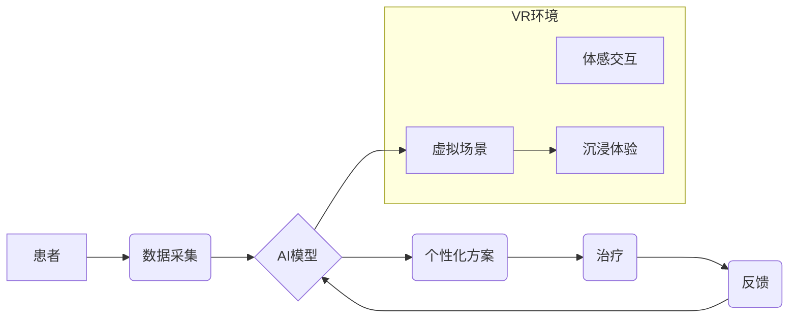

                 

## 虚拟疼痛管理：AI辅助的痛觉调节

> 关键词：人工智能、疼痛管理、神经网络、深度学习、生物反馈、虚拟现实、体感技术

### 1. 背景介绍

疼痛是人类生活中不可避免的体验，它可以是剧烈的，也可以是持续的，对个体的生理、心理和社会功能都会产生重大影响。传统疼痛管理方法，如药物治疗和物理治疗，虽然有一定的效果，但常常存在局限性，例如药物副作用、耐药性、治疗效果不佳等。随着人工智能（AI）技术的快速发展，AI辅助的疼痛管理逐渐成为一个备受关注的领域。

AI技术能够分析海量医疗数据，识别疼痛模式，预测疼痛风险，并提供个性化的治疗方案。结合虚拟现实（VR）和体感技术，AI可以构建沉浸式的虚拟环境，帮助患者转移注意力，减轻疼痛感。

### 2. 核心概念与联系

**2.1 痛觉机制**

痛觉是一种复杂的生理过程，涉及到多种神经元、激素和化学物质。当身体受到伤害时，伤害信号会通过末梢神经传递到脊髓，再经由脊髓传递到大脑，大脑会对这些信号进行解读，产生疼痛的感觉。

**2.2 AI辅助疼痛管理**

AI辅助疼痛管理是指利用人工智能技术辅助医生诊断、治疗和管理疼痛。AI可以帮助医生：

* **识别疼痛模式：**通过分析患者的医疗记录、生理数据和行为模式，识别疼痛的类型、严重程度和潜在的风险因素。
* **预测疼痛风险：**根据患者的个人特征和病史，预测未来疼痛的发生概率和严重程度。
* **个性化治疗方案：**根据患者的具体情况，制定个性化的疼痛管理方案，包括药物治疗、物理治疗、心理治疗等。
* **远程监控和评估：**通过远程监测患者的疼痛水平和治疗效果，及时调整治疗方案。

**2.3 VR和体感技术**

虚拟现实（VR）是一种利用计算机技术模拟真实环境的技术，可以创造沉浸式的虚拟体验。体感技术可以感知用户的动作和生理变化，并将其反馈到虚拟环境中。

结合VR和体感技术，AI可以构建沉浸式的虚拟环境，帮助患者转移注意力，减轻疼痛感。例如，患者可以身临其境地体验到海滩、森林等放松的环境，或者参与到虚拟的游戏和互动活动中，从而暂时忘记疼痛。

**2.4 架构图**



### 3. 核心算法原理 & 具体操作步骤

**3.1 算法原理概述**

AI辅助疼痛管理的核心算法通常是深度学习算法，例如卷积神经网络（CNN）和循环神经网络（RNN）。这些算法能够从海量医疗数据中学习疼痛模式，并预测疼痛风险。

**3.2 算法步骤详解**

1. **数据收集和预处理：**收集患者的医疗记录、生理数据和行为模式等数据，并进行清洗、标准化和转换等预处理操作。
2. **特征提取：**从原始数据中提取有用的特征，例如年龄、性别、病史、疼痛等级、心率、血压等。
3. **模型训练：**使用深度学习算法对提取的特征进行训练，学习疼痛模式和预测疼痛风险。
4. **模型评估：**使用测试数据评估模型的性能，例如准确率、召回率、F1-score等。
5. **模型部署：**将训练好的模型部署到实际应用场景中，例如医院、诊所、家庭等。

**3.3 算法优缺点**

**优点：**

* **高准确率：**深度学习算法能够从海量数据中学习复杂的模式，具有较高的预测准确率。
* **个性化治疗：**根据患者的个人特征和病史，制定个性化的治疗方案。
* **远程监控：**通过远程监测患者的疼痛水平和治疗效果，及时调整治疗方案。

**缺点：**

* **数据依赖：**深度学习算法需要大量的训练数据，否则模型性能会下降。
* **解释性差：**深度学习模型的决策过程比较复杂，难以解释模型的决策结果。
* **伦理问题：**AI辅助疼痛管理涉及到患者隐私和数据安全等伦理问题。

**3.4 算法应用领域**

AI辅助疼痛管理的应用领域非常广泛，包括：

* **慢性疼痛管理：**例如糖尿病神经病变、关节炎、癌症疼痛等。
* **急性疼痛管理：**例如手术后疼痛、骨折疼痛等。
* **神经痛管理：**例如三叉神经痛、坐骨神经痛等。
* **心理疼痛管理：**例如焦虑、抑郁、创伤后应激障碍等。

### 4. 数学模型和公式 & 详细讲解 & 举例说明

**4.1 数学模型构建**

AI辅助疼痛管理的数学模型通常是基于神经网络的，例如多层感知机（MLP）、卷积神经网络（CNN）和循环神经网络（RNN）。这些模型可以表示为复杂的非线性函数，其参数可以通过训练数据进行优化。

**4.2 公式推导过程**

神经网络的训练过程是基于梯度下降算法的，其目标是找到最优的参数，使得模型的预测结果与实际结果之间的误差最小化。

梯度下降算法的基本公式如下：

$$
\theta = \theta - \alpha \nabla J(\theta)
$$

其中：

* $\theta$ 是模型的参数
* $\alpha$ 是学习率
* $J(\theta)$ 是损失函数，表示模型预测结果与实际结果之间的误差

**4.3 案例分析与讲解**

例如，在预测慢性疼痛的严重程度时，可以构建一个基于MLP的神经网络模型。模型的输入是患者的年龄、性别、病史、疼痛等级、心率、血压等特征，输出是患者慢性疼痛的严重程度。

通过训练数据，模型可以学习到这些特征与疼痛严重程度之间的关系，并预测出新的患者的疼痛严重程度。

### 5. 项目实践：代码实例和详细解释说明

**5.1 开发环境搭建**

* 操作系统：Windows/Linux/macOS
* Python版本：3.6+
* 深度学习框架：TensorFlow/PyTorch
* 其他依赖库：NumPy、Pandas、Matplotlib等

**5.2 源代码详细实现**

```python
import tensorflow as tf

# 定义模型结构
model = tf.keras.models.Sequential([
    tf.keras.layers.Dense(64, activation='relu', input_shape=(7,)),
    tf.keras.layers.Dense(32, activation='relu'),
    tf.keras.layers.Dense(1)
])

# 编译模型
model.compile(optimizer='adam', loss='mse')

# 训练模型
model.fit(X_train, y_train, epochs=10)

# 评估模型
loss, accuracy = model.evaluate(X_test, y_test)
print('Loss:', loss)
print('Accuracy:', accuracy)
```

**5.3 代码解读与分析**

* 代码首先定义了一个基于MLP的神经网络模型，包含三个全连接层。
* 每个全连接层都使用ReLU激活函数，除了输出层使用线性激活函数。
* 模型使用Adam优化器和均方误差损失函数进行训练。
* 训练过程使用训练数据进行迭代训练，直到达到预设的 epochs 数。
* 训练完成后，使用测试数据评估模型的性能。

**5.4 运行结果展示**

训练完成后，可以查看模型的损失值和准确率，评估模型的性能。

### 6. 实际应用场景

**6.1 慢性疼痛管理**

AI辅助疼痛管理可以帮助慢性疼痛患者更好地管理疼痛，提高生活质量。例如，AI可以分析患者的疼痛日记、生理数据和行为模式，识别疼痛的模式和触发因素，并提供个性化的疼痛管理方案。

**6.2 急性疼痛管理**

AI可以帮助医生更准确地评估急性疼痛的严重程度，并制定更有效的治疗方案。例如，AI可以分析患者的影像数据、临床症状和生理指标，预测手术后疼痛的严重程度，并根据预测结果调整麻醉方案和止痛药物。

**6.3 虚拟疼痛管理平台**

一些公司正在开发基于AI的虚拟疼痛管理平台，这些平台可以提供沉浸式的虚拟环境，帮助患者转移注意力，减轻疼痛感。

**6.4 未来应用展望**

未来，AI辅助疼痛管理将更加智能化、个性化和便捷化。例如：

* **更精准的疼痛预测：**AI可以利用更丰富的医疗数据，例如基因信息、微生物组信息等，更精准地预测疼痛风险。
* **更个性化的治疗方案：**AI可以根据患者的个体差异，制定更个性化的治疗方案，例如药物组合、治疗时间、治疗强度等。
* **远程疼痛管理：**AI可以帮助患者远程监测疼痛水平和治疗效果，并及时与医生进行沟通。

### 7. 工具和资源推荐

**7.1 学习资源推荐**

* **书籍：**
    * 深度学习
    * 人工智能：一种现代方法
* **在线课程：**
    * Coursera：深度学习
    * edX：人工智能导论
* **博客和论坛：**
    * TensorFlow博客
    * PyTorch博客
    * Kaggle论坛

**7.2 开发工具推荐**

* **深度学习框架：**TensorFlow、PyTorch
* **数据处理库：**NumPy、Pandas
* **可视化库：**Matplotlib、Seaborn

**7.3 相关论文推荐**

* **Deep Learning for Pain Management: A Review**
* **Artificial Intelligence in Pain Management: Current Applications and Future Directions**
* **Virtual Reality for Pain Management: A Systematic Review**

### 8. 总结：未来发展趋势与挑战

**8.1 研究成果总结**

AI辅助疼痛管理取得了显著的进展，在慢性疼痛、急性疼痛和神经痛的管理方面展现出巨大的潜力。

**8.2 未来发展趋势**

未来，AI辅助疼痛管理将朝着以下方向发展：

* **更精准的疼痛预测和诊断**
* **更个性化的治疗方案**
* **更便捷的远程疼痛管理**
* **更广泛的应用场景**

**8.3 面临的挑战**

AI辅助疼痛管理也面临着一些挑战：

* **数据获取和隐私保护**
* **模型解释性和可信度**
* **伦理和社会影响**

**8.4 研究展望**

未来，需要加强对AI辅助疼痛管理的伦理和社会影响的评估，并制定相应的规范和政策。同时，需要继续探索新的算法和技术，提高AI辅助疼痛管理的精准度、个性化程度和安全性。

### 9. 附录：常见问题与解答

**9.1 Q：AI辅助疼痛管理是否会取代医生？**

**A：**AI辅助疼痛管理是辅助医生，而不是取代医生的工具。AI可以帮助医生更快、更准确地诊断和治疗疼痛，但最终的治疗决策仍然需要由医生做出。

**9.2 Q：AI辅助疼痛管理的安全性如何？**

**A：**AI辅助疼痛管理的安全性需要经过严格的测试和验证。目前，一些AI辅助疼痛管理的应用已经获得了医疗机构的认证，证明其安全性。

**9.3 Q：AI辅助疼痛管理的成本如何？**

**A：**AI辅助疼痛管理的成本取决于具体的应用场景和技术方案。总体来说，AI辅助疼痛管理的成本可能会比传统的疼痛管理方法更高，但随着技术的进步和应用的普及，成本可能会逐渐降低。


作者：禅与计算机程序设计艺术 / Zen and the Art of Computer Programming 
<end_of_turn>

