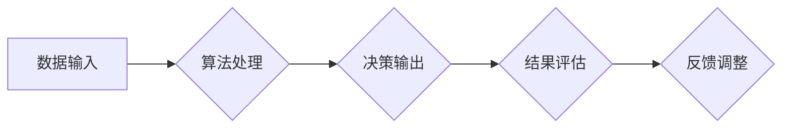

                 

## 认知偏见与决策：克服思维盲点的策略

> 关键词：认知偏见、决策、思维盲点、算法、数据分析、机器学习、风险管理、逻辑推理

## 1. 背景介绍

在瞬息万变的科技时代，数据和信息充斥着我们的生活。作为技术从业者，我们每天都在面对各种各样的决策问题，从设计软件架构到选择技术栈，从评估项目风险到制定产品策略。这些决策往往会影响到项目的成败，甚至企业的未来发展。然而，人类的认知能力并非完美无缺，我们都存在着各种各样的认知偏见，这些偏见会潜移默化地影响我们的判断和决策，导致我们做出错误或不合理的决策。

认知偏见是指人们在处理信息和做出判断时，由于思维模式、经验、情绪等因素的影响，而产生的一种系统性错误。这些偏见往往是无意识的，我们并不知道自己正在受到它们的影响。认知偏见会导致我们对信息进行选择性解读，忽略重要信息，过度依赖直觉，陷入思维定式等问题，最终影响我们的决策质量。

## 2. 核心概念与联系

### 2.1 认知偏见类型

认知偏见种类繁多，一些常见的类型包括：

* **确认偏见 (Confirmation Bias):**  倾向于寻求和解释信息，以证实我们现有的信念，而忽略或淡化与之相悖的信息。
* **锚定效应 (Anchoring Bias):**  在做出决策时，过度依赖第一个获得的信息（锚点），即使该信息并不完全准确或相关。
* ** Verfügbarkeitsheuristik (Availability Heuristic):**  根据信息易于回忆的程度来判断事件发生的概率，容易受到鲜明或最近发生的事件的影响。
* **框架效应 (Framing Effect):**  信息呈现方式会影响人们的判断和决策，即使信息本身没有改变。
* **损失厌恶 (Loss Aversion):**  人们对损失的敏感度高于对同等价值的收益的敏感度。

### 2.2 认知偏见与决策的影响

认知偏见会潜移默化地影响我们的决策过程，导致以下问题：

* **决策偏差:**  决策结果偏离最佳选择，导致效率低下或错误决策。
* **风险放大:**  过度估计风险或忽视潜在机会，导致决策过于保守或冒险。
* **沟通障碍:**  难以理解他人的观点，导致冲突和误解。
* **创新阻碍:**  难以接受新想法和挑战现有思维模式，导致缺乏创新。

### 2.3 认知偏见与算法

虽然算法本身是客观的，但算法的训练数据和设计者本身的认知偏见都会影响算法的输出结果。例如，如果训练数据中存在性别或种族偏见，那么算法可能会产生歧视性的结果。因此，我们需要意识到算法的局限性，并采取措施来减轻认知偏见的影响。

**Mermaid 流程图**



## 3. 核心算法原理 & 具体操作步骤

### 3.1 算法原理概述

为了克服认知偏见，我们可以利用算法和数据分析技术来辅助决策。这些算法可以帮助我们识别潜在的偏见，提供更客观的分析结果，并降低决策风险。

一些常用的算法包括：

* **机器学习算法:**  通过训练数据学习模式，预测未来结果，例如分类、回归、聚类等。
* **深度学习算法:**  一种更复杂的机器学习算法，能够处理更复杂的数据结构，例如图像、文本、语音等。
* **自然语言处理算法:**  用于分析和理解文本数据，例如情感分析、文本分类、机器翻译等。

### 3.2 算法步骤详解

1. **数据收集:**  收集相关数据，确保数据质量和代表性。
2. **数据预处理:**  清洗、转换和格式化数据，使其适合算法处理。
3. **特征工程:**  选择和提取重要的特征，这些特征能够反映决策的关键因素。
4. **模型选择:**  根据具体问题选择合适的算法模型。
5. **模型训练:**  使用训练数据训练模型，调整模型参数，使其能够准确预测结果。
6. **模型评估:**  使用测试数据评估模型的性能，例如准确率、召回率、F1-score等。
7. **模型部署:**  将训练好的模型部署到实际应用环境中，用于辅助决策。

### 3.3 算法优缺点

**优点:**

* **客观性:**  算法可以减少主观判断的影响，提供更客观的分析结果。
* **效率:**  算法可以快速处理大量数据，提高决策效率。
* **可重复性:**  算法的决策过程是可重复的，可以进行验证和改进。

**缺点:**

* **数据依赖:**  算法的性能依赖于训练数据的质量和代表性。
* **黑盒效应:**  一些复杂的算法难以解释其决策过程，难以理解其背后的逻辑。
* **伦理风险:**  算法可能存在偏见或歧视，需要谨慎使用和监管。

### 3.4 算法应用领域

* **金融领域:**  风险评估、信用评分、欺诈检测
* **医疗领域:**  疾病诊断、药物研发、个性化治疗
* **营销领域:**  客户画像、精准营销、广告投放
* **教育领域:**  个性化学习、学生评估、教学辅助

## 4. 数学模型和公式 & 详细讲解 & 举例说明

### 4.1 数学模型构建

为了量化认知偏见的影响，我们可以构建数学模型来描述决策过程。例如，我们可以使用贝叶斯定理来描述决策者对不同事件的概率判断，并分析认知偏见如何影响这些概率的更新。

### 4.2 公式推导过程

**贝叶斯定理:**

$$P(A|B) = \frac{P(B|A)P(A)}{P(B)}$$

其中:

* $P(A|B)$ 是事件 A 在已知事件 B 发生的条件下发生的概率。
* $P(B|A)$ 是事件 B 在已知事件 A 发生的条件下发生的概率。
* $P(A)$ 是事件 A 发生的概率。
* $P(B)$ 是事件 B 发生的概率。

### 4.3 案例分析与讲解

假设我们有一个决策者需要判断一个项目是否成功。该项目有两种可能的结果：成功或失败。决策者根据历史数据和直觉判断，认为成功概率为 60%，失败概率为 40%。

如果决策者存在确认偏见，他可能会倾向于寻找和解释支持成功的信息，而忽略或淡化支持失败的信息。例如，如果项目进展顺利，他可能会认为这是成功的重要信号，即使存在一些潜在风险。

使用贝叶斯定理，我们可以分析决策者对项目成功概率的更新。如果决策者获得了一条支持项目的成功信息，那么 $P(B|A)$ 会增加，从而导致 $P(A|B)$ 也增加。

## 5. 项目实践：代码实例和详细解释说明

### 5.1 开发环境搭建

为了演示如何利用算法来识别认知偏见，我们可以使用 Python 语言和 scikit-learn 库开发一个简单的项目。

**依赖库:**

```python
pip install scikit-learn numpy pandas
```

### 5.2 源代码详细实现

```python
import pandas as pd
from sklearn.model_selection import train_test_split
from sklearn.linear_model import LogisticRegression

# 加载数据
data = pd.read_csv('data.csv')

# 选择特征和目标变量
features = ['feature1', 'feature2', 'feature3']
target = 'target'

# 将数据分割为训练集和测试集
X_train, X_test, y_train, y_test = train_test_split(data[features], data[target], test_size=0.2)

# 训练逻辑回归模型
model = LogisticRegression()
model.fit(X_train, y_train)

# 评估模型性能
accuracy = model.score(X_test, y_test)
print('模型准确率:', accuracy)
```

### 5.3 代码解读与分析

这段代码首先加载数据，然后选择特征和目标变量。接着，将数据分割为训练集和测试集，并使用逻辑回归模型训练模型。最后，评估模型的性能，例如准确率。

### 5.4 运行结果展示

运行代码后，会输出模型的准确率。

## 6. 实际应用场景

### 6.1 决策支持系统

认知偏见识别算法可以集成到决策支持系统中，帮助决策者识别潜在的偏见，并提供更客观的分析结果。例如，在招聘过程中，可以使用算法分析简历，识别潜在的性别或种族偏见，帮助招聘人员做出更公平的决策。

### 6.2 数据分析与可视化

可以使用算法分析数据，识别潜在的认知偏见，并通过可视化工具展示这些偏见，帮助人们更好地理解和应对这些问题。例如，可以分析新闻报道中的语言偏见，识别潜在的社会偏见。

### 6.3 人工智能伦理

认知偏见识别算法可以帮助我们更好地理解人工智能伦理问题，并制定相应的规范和政策，确保人工智能技术能够被安全、公平地应用。

### 6.4 未来应用展望

随着人工智能技术的不断发展，认知偏见识别算法将有更广泛的应用场景，例如：

* **个性化教育:**  识别学生的认知偏见，提供个性化的学习方案。
* **医疗诊断:**  识别医生的认知偏见，提高诊断的准确性。
* **法律判决:**  识别法官的认知偏见，确保法律判决的公平性。

## 7. 工具和资源推荐

### 7.1 学习资源推荐

* **书籍:**

    * "Thinking, Fast and Slow" by Daniel Kahneman
    * "Predictably Irrational" by Dan Ariely
    * "Nudge" by Richard Thaler and Cass Sunstein

* **在线课程:**

    * Coursera: "Behavioral Economics"
    * edX: "Cognitive Biases"

### 7.2 开发工具推荐

* **Python:**  一个流行的编程语言，广泛用于数据分析和机器学习。
* **scikit-learn:**  一个强大的机器学习库，提供各种算法和工具。
* **TensorFlow:**  一个开源的机器学习框架，用于构建和训练深度学习模型。

### 7.3 相关论文推荐

* "On the Dangers of Stochastic Parrots: Can Language Models Be Too Big?"
* "Gender Shades: Intersectional Accuracy Disparities in Commercial Gender Classification"
* "Algorithmic Fairness"

## 8. 总结：未来发展趋势与挑战

### 8.1 研究成果总结

认知偏见识别算法已经取得了一些进展，能够识别一些常见的认知偏见，并提供一些辅助决策的建议。然而，这些算法仍然存在一些局限性，例如：

* **数据依赖:**  算法的性能依赖于训练数据的质量和代表性。
* **黑盒效应:**  一些复杂的算法难以解释其决策过程，难以理解其背后的逻辑。
* **伦理风险:**  算法可能存在偏见或歧视，需要谨慎使用和监管。

### 8.2 未来发展趋势

未来，认知偏见识别算法将朝着以下方向发展：

* **更准确的识别:**  开发更先进的算法，能够识别更细微的认知偏见。
* **更可解释的模型:**  开发更透明的算法，能够解释其决策过程，提高算法的可信度。
* **更广泛的应用:**  将认知偏见识别算法应用到更多领域，例如教育、医疗、法律等。

### 8.3 面临的挑战

认知偏见识别算法面临着一些挑战：

* **数据获取:**  收集高质量、代表性的训练数据是一个难题。
* **算法设计:**  开发能够有效识别各种认知偏见的算法是一个技术挑战。
* **伦理规范:**  制定相应的伦理规范，确保算法的公平、公正和透明使用是一个社会挑战。

### 8.4 研究展望

我们相信，认知偏见识别算法将成为未来人工智能发展的重要方向，能够帮助我们更好地理解和应对人类的认知局限性，从而做出更明智的决策，构建更公平、更公正的社会。

## 9. 附录：常见问题与解答

**Q1: 如何识别认知偏见？**

A1: 认知偏见往往是无意识的，我们可以通过以下方法识别：

* **自我反思:**  经常反思自己的决策过程，识别潜在的偏见。
* **寻求反馈:**  从他人那里寻求反馈，了解他们对我们的决策的看法。
* **使用工具:**  使用认知偏见识别工具，例如问卷调查、算法分析等。

**Q2: 如何克服认知偏见？**

A2: 我们可以通过以下方法克服认知偏见：

* **提高意识:**  了解常见的认知偏见，并提高对自身偏见的认识。
* **寻求多样化信息:**  主动寻求不同观点和信息，避免信息茧房。
* **使用数据驱动决策:**  利用数据分析和算法辅助决策，减少主观判断的影响。
* **保持批判性思维:**  对信息进行批判性思考，不要轻易接受他人的观点。

**作者：禅与计算机程序设计艺术 / Zen and the Art of Computer Programming**


<end_of_turn>

