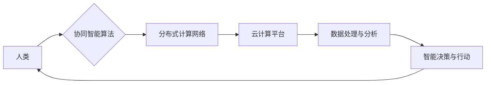

                 

## 连接全球智慧：人类计算的全球影响力

> 关键词：人类计算、分布式计算、协同智能、云计算、大数据、人工智能、全球化

### 1. 背景介绍

人类文明的进步离不开智慧的积累和传播。从古老的文字记录到现代的互联网，我们一直在探索更有效地连接和共享知识的方式。随着信息技术的飞速发展，人类计算的概念应运而生，它将人类的智慧与计算能力相结合，开启了连接全球智慧的新时代。

人类计算是指利用分布式计算网络和协同智能算法，将人类的智慧和计算能力整合在一起，共同解决复杂问题。它打破了传统计算模式的局限，将人类的创造力、洞察力和经验融入到计算过程中，从而提升计算效率和解决问题的深度。

### 2. 核心概念与联系

#### 2.1 人类计算的本质

人类计算的核心在于将人类的智慧和计算能力进行有效融合。它不仅仅是简单的将人类的知识输入到计算机中，而是通过设计合理的算法和平台，让人类和计算机能够协同工作，共同完成复杂的任务。

#### 2.2 关键要素

* **分布式计算:** 人类计算依赖于分布式计算网络，将计算任务分解成多个子任务，并分配到不同的计算节点上进行处理。这使得人类计算能够处理海量数据和复杂问题，并具有更高的容错性和可扩展性。
* **协同智能:** 人类计算的核心是协同智能算法，它能够有效地协调和整合人类和计算机的智慧。这些算法可以根据任务需求，将人类的知识和经验与计算机的计算能力进行匹配，从而实现最佳的协同效果。
* **云计算:** 云计算为人类计算提供了强大的基础设施支持，它提供了海量存储空间、计算资源和网络带宽，使得人类计算能够规模化部署和运行。

#### 2.3 架构图



### 3. 核心算法原理 & 具体操作步骤

#### 3.1 算法原理概述

人类计算的核心算法通常基于以下几个原理：

* **分而治之:** 将复杂问题分解成多个子问题，并分别由不同的计算节点处理。
* **协同决策:** 利用机器学习算法，从人类和计算机的交互数据中学习，并进行协同决策。
* **知识图谱:** 建立人类知识的结构化表示，以便计算机能够理解和利用人类的知识。

#### 3.2 算法步骤详解

1. **问题分解:** 将复杂问题分解成多个子问题，并根据子问题的性质分配到不同的计算节点上处理。
2. **数据收集与预处理:** 从各种数据源收集相关数据，并进行预处理，例如清洗、转换和格式化。
3. **人类参与:** 根据子问题的特点，邀请人类专家参与，提供专业知识、经验和判断。
4. **协同计算:** 利用协同智能算法，将人类的输入与计算机的计算结果进行融合，并进行协同决策。
5. **结果整合:** 将各个计算节点处理的结果进行整合，并输出最终的解决方案。

#### 3.3 算法优缺点

**优点:**

* 能够解决传统计算方法难以解决的复杂问题。
* 能够充分利用人类的智慧和经验。
* 具有更高的容错性和可扩展性。

**缺点:**

* 算法设计和实现难度较高。
* 需要建立完善的人机交互平台和机制。
* 数据安全和隐私保护问题需要得到重视。

#### 3.4 算法应用领域

* **科学研究:** 药物研发、材料科学、天体物理学等领域。
* **医疗保健:** 疾病诊断、个性化治疗、医疗影像分析等领域。
* **金融服务:** 风险管理、欺诈检测、投资决策等领域。
* **教育培训:** 个性化学习、知识发现、在线教学等领域。

### 4. 数学模型和公式 & 详细讲解 & 举例说明

#### 4.1 数学模型构建

人类计算的数学模型通常基于概率论、统计学和机器学习等理论。

* **概率论:** 用于描述人类决策和行为的随机性。
* **统计学:** 用于分析人类数据和行为模式。
* **机器学习:** 用于构建协同智能算法，并根据人类和计算机的交互数据进行学习和优化。

#### 4.2 公式推导过程

例如，在协同决策问题中，我们可以使用贝叶斯定理来推导人类和计算机的决策权重。

$$P(h|d) = \frac{P(d|h)P(h)}{P(d)}$$

其中：

* $P(h|d)$: 人类决策为 $h$ 的概率，已知数据为 $d$。
* $P(d|h)$: 数据为 $d$ 的概率，已知人类决策为 $h$。
* $P(h)$: 人类决策为 $h$ 的先验概率。
* $P(d)$: 数据为 $d$ 的概率。

#### 4.3 案例分析与讲解

假设我们有一个医疗诊断问题，需要根据患者的症状和检查结果进行诊断。我们可以使用贝叶斯定理来计算人类医生和机器学习模型的决策权重。

* 人类医生拥有丰富的临床经验和专业知识，可以根据患者的整体情况进行判断。
* 机器学习模型可以根据大量的医疗数据进行分析，并给出诊断概率。

我们可以根据医生和模型的诊断结果，以及各自的可靠性，计算出最终的诊断权重。

### 5. 项目实践：代码实例和详细解释说明

#### 5.1 开发环境搭建

* 操作系统: Ubuntu 20.04 LTS
* 编程语言: Python 3.8
* 软件包: TensorFlow, PyTorch, scikit-learn

#### 5.2 源代码详细实现

```python
# 人类计算协同决策模型

import numpy as np
from sklearn.linear_model import LogisticRegression

# 人类专家决策
def human_decision(data):
    # 根据专家经验和知识，对数据进行判断
    # 返回预测结果
    pass

# 机器学习模型预测
def model_prediction(data):
    # 使用机器学习模型对数据进行预测
    # 返回预测结果
    pass

# 协同决策算法
def collaborative_decision(human_decision, model_prediction, weights):
    # 根据专家和模型的预测结果，以及权重，进行最终决策
    # 返回最终决策结果
    pass

# 数据加载和预处理
# ...

# 训练机器学习模型
# ...

# 设置专家和模型的权重
weights = [0.7, 0.3]

# 进行协同决策
final_decision = collaborative_decision(human_decision, model_prediction, weights)

# 输出最终决策结果
print(final_decision)
```

#### 5.3 代码解读与分析

* 代码首先定义了人类专家决策和机器学习模型预测的函数。
* 然后定义了协同决策算法，根据专家和模型的预测结果以及权重进行最终决策。
* 数据加载和预处理、模型训练等步骤需要根据具体应用场景进行实现。

#### 5.4 运行结果展示

运行结果将显示最终的决策结果，例如疾病诊断结果、投资建议等。

### 6. 实际应用场景

#### 6.1 医疗诊断

人类计算可以帮助医生更准确地诊断疾病。例如，可以将患者的症状、检查结果和基因信息等数据输入到人类计算平台，并邀请专家医生参与诊断，从而提高诊断的准确率和效率。

#### 6.2 科学研究

人类计算可以加速科学研究的进程。例如，在药物研发领域，可以利用人类计算平台，将大量的药物分子数据和实验结果进行分析，并邀请化学家和生物学家参与研究，从而更快地发现新的药物。

#### 6.3 灾害救援

人类计算可以帮助更快地响应和应对灾害。例如，在发生地震或洪水等灾害时，可以利用人类计算平台，收集灾区的信息，并邀请救援人员参与决策，从而提高救援效率和救助人数。

#### 6.4 未来应用展望

随着人工智能和云计算技术的不断发展，人类计算将在更多领域得到应用，例如：

* 个性化教育
* 智能制造
* 城市管理
* 智慧交通

### 7. 工具和资源推荐

#### 7.1 学习资源推荐

* **书籍:**

    * 《人类计算：连接全球智慧》
    * 《人工智能：一种现代方法》
    * 《深度学习》

* **在线课程:**

    * Coursera: 人工智能
    * edX: 深度学习
    * Udacity: 人工智能工程师

#### 7.2 开发工具推荐

* **云计算平台:**

    * AWS
    * Azure
    * Google Cloud Platform

* **机器学习框架:**

    * TensorFlow
    * PyTorch
    * scikit-learn

#### 7.3 相关论文推荐

* **人类计算的定义和框架:**

    * "Human Computation: A Paradigm for Distributed Intelligence"

* **人类计算的应用案例:**

    * "Human Computation for Scientific Discovery"
    * "Crowdsourcing for Disaster Response"

### 8. 总结：未来发展趋势与挑战

#### 8.1 研究成果总结

人类计算是一个新兴的领域，近年来取得了显著的进展。它为解决复杂问题提供了新的思路和方法，并推动了人工智能和云计算技术的融合发展。

#### 8.2 未来发展趋势

* **更智能的协同算法:** 将更先进的机器学习算法应用于人类计算，提高协同决策的效率和准确性。
* **更广泛的应用场景:** 将人类计算应用于更多领域，例如个性化教育、智能制造、城市管理等。
* **更完善的人机交互平台:** 开发更便捷、更直观的人机交互平台，方便人类参与人类计算。

#### 8.3 面临的挑战

* **数据安全和隐私保护:** 人类计算需要处理大量的人类数据，因此数据安全和隐私保护是一个重要的挑战。
* **算法公平性和可解释性:** 人类计算算法需要保证公平性和可解释性，避免出现偏见和歧视。
* **人类参与的激励机制:** 如何激励人类参与人类计算，并保证他们的积极性和效率是一个需要解决的问题。

#### 8.4 研究展望

未来，人类计算将继续朝着更智能、更广泛、更安全的方向发展。随着技术的进步和应用场景的拓展，人类计算将为人类社会带来更多福祉。

### 9. 附录：常见问题与解答

* **什么是人类计算？**

人类计算是指利用分布式计算网络和协同智能算法，将人类的智慧和计算能力整合在一起，共同解决复杂问题。

* **人类计算有哪些应用场景？**

人类计算可以应用于医疗诊断、科学研究、灾害救援、个性化教育、智能制造等多个领域。

* **人类计算的优势是什么？**

人类计算能够解决传统计算方法难以解决的复杂问题，充分利用人类的智慧和经验，具有更高的容错性和可扩展性。

* **人类计算面临哪些挑战？**

人类计算面临数据安全和隐私保护、算法公平性和可解释性、人类参与的激励机制等挑战。


作者：禅与计算机程序设计艺术 / Zen and the Art of Computer Programming 
<end_of_turn>

