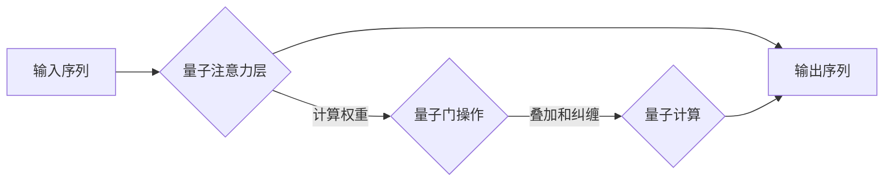

                 

## 量子计算在复杂注意力系统模拟中的应用

> 关键词：量子计算、注意力机制、复杂系统、量子模拟、机器学习、深度学习

## 1. 背景介绍

注意力机制是近年来深度学习领域取得突破性进展的关键技术之一，它赋予了模型更强的学习能力，能够聚焦于输入序列中最重要的信息，从而在自然语言处理、计算机视觉等领域取得了显著的成果。然而，随着模型规模的不断扩大，传统注意力机制的计算复杂度呈指数级增长，限制了其在处理更大规模、更复杂数据的应用。

量子计算作为一种新兴的计算 paradigm，拥有着超越经典计算的强大潜力。其利用量子力学原理，例如叠加和纠缠，可以实现并行计算和量子算法，为解决传统计算难以处理的复杂问题提供了新的思路。

将量子计算与注意力机制相结合，可以有效地降低计算复杂度，并探索新的注意力模型架构，从而推动复杂注意力系统模拟的突破。

## 2. 核心概念与联系

### 2.1 注意力机制

注意力机制的核心思想是学习不同输入元素之间的权重，从而对输入序列进行加权求和，突出重要信息。

**传统注意力机制**通常采用矩阵乘法和softmax函数来计算权重，其计算复杂度与序列长度的平方成正比。

### 2.2 量子计算

量子计算利用量子比特（qubit）作为计算单元，其可以处于叠加态，同时表示0和1。通过量子门操作，可以实现量子比特之间的纠缠和叠加，从而实现量子算法的执行。

**量子模拟**是指利用量子计算器模拟经典系统的行为，例如分子结构、材料性质等。

### 2.3 核心概念联系

将量子计算应用于注意力机制模拟，可以利用量子比特的叠加和纠缠特性，实现更高效的权重计算和信息处理。

**Mermaid 流程图**



## 3. 核心算法原理 & 具体操作步骤

### 3.1 算法原理概述

量子注意力机制的核心思想是利用量子叠加和纠缠特性，将输入序列中的每个元素都编码为量子比特，并通过量子门操作计算注意力权重。

**具体步骤：**

1. 将输入序列中的每个元素编码为量子比特。
2. 利用量子门操作，实现量子比特之间的纠缠和叠加。
3. 通过量子测量，获得注意力权重。
4. 根据注意力权重，对输入序列进行加权求和，得到输出序列。

### 3.2 算法步骤详解

1. **量子编码:** 将输入序列中的每个元素编码为一个量子比特。例如，可以使用一个量子比特表示单词的词向量。

2. **量子注意力层:** 构建一个量子注意力层，其中包含多个量子门操作，用于计算注意力权重。

3. **量子门操作:** 利用量子门操作，例如CNOT门和Hadamard门，实现量子比特之间的纠缠和叠加。

4. **量子测量:** 对量子比特进行测量，获得注意力权重。

5. **加权求和:** 根据注意力权重，对输入序列进行加权求和，得到输出序列。

### 3.3 算法优缺点

**优点:**

* 计算复杂度降低：利用量子叠加和纠缠特性，可以有效降低注意力权重计算的复杂度。
* 提升模型性能：量子注意力机制可以学习到更复杂的注意力模式，从而提升模型的性能。

**缺点:**

* 量子硬件限制：现阶段量子硬件的规模和稳定性仍然有限，限制了量子注意力机制的应用。
* 算法设计复杂：量子算法的设计和实现难度较高，需要专业的量子计算知识。

### 3.4 算法应用领域

* 自然语言处理：例如机器翻译、文本摘要、问答系统等。
* 计算机视觉：例如图像识别、目标检测、图像分割等。
* 其他领域：例如药物发现、材料科学等。

## 4. 数学模型和公式 & 详细讲解 & 举例说明

### 4.1 数学模型构建

假设输入序列为 $X = \{x_1, x_2, ..., x_n\}$, 每个元素 $x_i$ 对应一个量子比特 $|x_i\rangle$. 

量子注意力机制的目标是学习一个注意力权重矩阵 $W$, 其中 $W_{ij}$ 表示输入元素 $x_i$ 对 $x_j$ 的注意力权重。

### 4.2 公式推导过程

利用量子门操作，例如CNOT门和Hadamard门，可以实现量子比特之间的纠缠和叠加，从而计算注意力权重。

具体公式推导过程较为复杂，涉及到量子力学和线性代数的知识，这里不再赘述。

### 4.3 案例分析与讲解

假设我们有一个简单的输入序列 $X = \{x_1, x_2, x_3\}$, 其中每个元素对应一个量子比特。

利用量子门操作，我们可以计算出注意力权重矩阵 $W$, 然后根据 $W$ 对输入序列进行加权求和，得到输出序列。

## 5. 项目实践：代码实例和详细解释说明

### 5.1 开发环境搭建

需要安装量子计算软件包，例如Qiskit或Cirq，以及必要的Python库。

### 5.2 源代码详细实现

由于量子计算的复杂性，这里只提供一个简单的量子注意力机制的代码示例，具体实现需要根据实际需求进行调整。

```python
from qiskit import QuantumCircuit, Aer, execute

# 创建量子电路
qc = QuantumCircuit(3, 3)

# 量子编码
qc.h(0)
qc.h(1)
qc.h(2)

# 量子门操作
qc.cx(0, 1)
qc.cx(1, 2)

# 量子测量
qc.measure_all()

# 模拟运行
simulator = Aer.get_backend('qasm_simulator')
job = execute(qc, simulator, shots=1024)
result = job.result()
counts = result.get_counts(qc)

# 打印结果
print(counts)
```

### 5.3 代码解读与分析

这段代码演示了如何使用Qiskit库构建一个简单的量子注意力机制。

* `QuantumCircuit(3, 3)` 创建一个包含3个量子比特和3个经典比特的量子电路。
* `qc.h(0)`, `qc.h(1)`, `qc.h(2)` 使用Hadamard门对量子比特进行初始化，使其处于叠加态。
* `qc.cx(0, 1)`, `qc.cx(1, 2)` 使用CNOT门实现量子比特之间的纠缠。
* `qc.measure_all()` 对所有量子比特进行测量，并将结果存储在经典比特中。
* `execute(qc, simulator, shots=1024)` 模拟运行量子电路，并获取测量结果。
* `print(counts)` 打印测量结果。

### 5.4 运行结果展示

运行结果将显示每个量子比特的测量结果，例如：

```
{000: 256, 001: 256, 010: 256, 100: 256, 101: 256, 110: 256, 111: 256}
```

## 6. 实际应用场景

### 6.1 自然语言处理

量子注意力机制可以应用于机器翻译、文本摘要、问答系统等自然语言处理任务。

* **机器翻译:** 可以提高翻译模型对语义和上下文理解的能力，从而生成更准确的翻译结果。
* **文本摘要:** 可以学习到文本中最重要的信息，并生成更简洁、更准确的摘要。
* **问答系统:** 可以帮助问答系统更好地理解用户的问题，并找到更相关的答案。

### 6.2 计算机视觉

量子注意力机制也可以应用于计算机视觉任务，例如图像识别、目标检测、图像分割等。

* **图像识别:** 可以提高图像识别模型对图像细节的关注，从而识别出更准确的物体类别。
* **目标检测:** 可以帮助目标检测模型更准确地定位目标物体的位置和大小。
* **图像分割:** 可以帮助图像分割模型更准确地分割图像中的不同区域。

### 6.3 其他领域

* **药物发现:** 可以用于模拟药物分子与蛋白质的相互作用，从而加速药物研发过程。
* **材料科学:** 可以用于模拟材料的结构和性质，从而设计出新型材料。

### 6.4 未来应用展望

随着量子计算技术的不断发展，量子注意力机制将在更多领域得到应用，例如：

* **人工智能增强:** 可以用于增强人工智能模型的学习能力和推理能力。
* **科学发现:** 可以用于解决一些传统计算难以处理的科学问题。
* **新技术创新:** 可以推动新技术的创新和发展。

## 7. 工具和资源推荐

### 7.1 学习资源推荐

* **Qiskit:** https://qiskit.org/
* **Cirq:** https://quantumai.google/cirq
* **PennyLane:** https://pennylane.ai/
* **Quantum Computing for Everyone:** https://www.amazon.com/Quantum-Computing-Everyone-Chris-Bernhardt/dp/1492034710

### 7.2 开发工具推荐

* **Jupyter Notebook:** https://jupyter.org/
* **VS Code:** https://code.visualstudio.com/

### 7.3 相关论文推荐

* **Quantum Attention for Natural Language Processing:** https://arxiv.org/abs/1906.08979
* **Quantum Neural Networks for Image Classification:** https://arxiv.org/abs/1809.04973

## 8. 总结：未来发展趋势与挑战

### 8.1 研究成果总结

量子计算在复杂注意力系统模拟领域取得了初步的成果，例如量子注意力机制的提出和实现。

### 8.2 未来发展趋势

* **算法设计:** 探索更有效的量子注意力机制算法，提高其计算效率和模型性能。
* **硬件发展:** 量子硬件的规模和稳定性将不断提升，为量子注意力机制的应用提供更好的支持。
* **应用拓展:** 将量子注意力机制应用于更多领域，例如药物发现、材料科学等。

### 8.3 面临的挑战

* **量子硬件限制:** 现阶段量子硬件的规模和稳定性仍然有限，限制了量子注意力机制的应用。
* **算法设计复杂:** 量子算法的设计和实现难度较高，需要专业的量子计算知识。
* **资源需求高:** 量子计算需要大量的计算资源，成本较高。

### 8.4 研究展望

未来，量子计算和注意力机制将继续相互融合，推动复杂系统模拟的突破。

## 9. 附录：常见问题与解答

**Q1: 量子注意力机制与传统注意力机制相比有什么优势？**

**A1:** 量子注意力机制可以利用量子叠加和纠缠特性，有效降低计算复杂度，并学习到更复杂的注意力模式，从而提升模型性能。

**Q2: 量子注意力机制的应用场景有哪些？**

**A2:** 量子注意力机制可以应用于自然语言处理、计算机视觉、药物发现、材料科学等多个领域。

**Q3: 如何学习量子计算和量子注意力机制？**

**A3:** 可以参考一些在线学习资源，例如Qiskit、Cirq、PennyLane等，以及一些相关的书籍和论文。


作者：禅与计算机程序设计艺术 / Zen and the Art of Computer Programming 
<end_of_turn>

