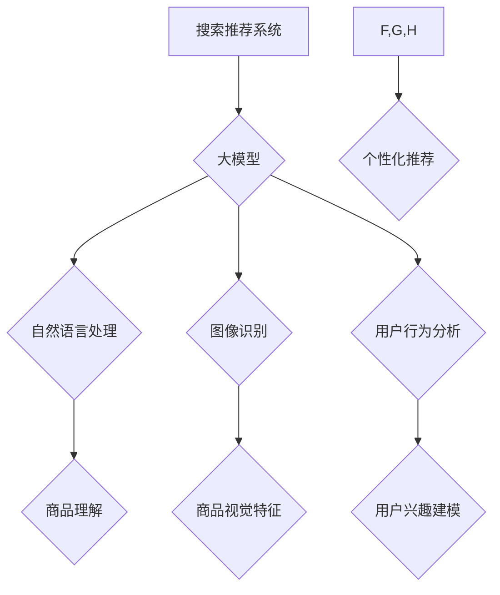

                 

## AI 大模型在搜索推荐系统中的融合技术：电商平台的算法本质探索

> 关键词：大模型、搜索推荐、电商平台、算法融合、深度学习、自然语言处理、个性化推荐

## 1. 背景介绍

在当今数据爆炸的时代，电商平台面临着海量商品和用户需求的挑战。如何精准匹配用户需求，提供个性化商品推荐，成为了提升用户体验和商业效益的关键。传统的搜索推荐系统主要依赖于基于规则和基于内容的算法，但这些方法在处理复杂的用户行为和商品特征时存在局限性。近年来，大模型技术在自然语言处理、计算机视觉等领域取得了突破性进展，为搜索推荐系统的升级提供了新的机遇。

大模型，是指参数量巨大、训练数据海量的人工智能模型。其强大的学习能力和泛化能力，能够从海量数据中挖掘出复杂的模式和关系，为搜索推荐系统提供更精准、更个性化的推荐结果。

## 2. 核心概念与联系

### 2.1 搜索推荐系统

搜索推荐系统是电商平台的核心功能之一，旨在帮助用户快速找到所需商品，并根据用户的兴趣和偏好提供个性化的推荐。

### 2.2 大模型

大模型是指参数量巨大、训练数据海量的人工智能模型。其强大的学习能力和泛化能力，能够从海量数据中挖掘出复杂的模式和关系。

### 2.3 算法融合

算法融合是指将多种算法结合起来，以提高推荐系统的性能。

**核心概念架构图**



## 3. 核心算法原理 & 具体操作步骤

### 3.1 算法原理概述

大模型在搜索推荐系统中的融合技术主要基于以下核心算法原理：

* **深度学习**: 大模型通常基于深度神经网络架构，能够学习复杂的非线性关系。
* **自然语言处理**: 利用大模型的文本理解能力，对用户搜索词进行语义分析，挖掘用户需求。
* **图像识别**: 利用大模型的图像识别能力，对商品图片进行特征提取，理解商品属性。
* **用户行为分析**: 利用大模型对用户历史行为进行分析，构建用户兴趣模型。

### 3.2 算法步骤详解

1. **数据预处理**: 收集用户搜索词、商品信息、用户行为数据等，进行清洗、格式化和特征提取。
2. **模型训练**: 利用深度学习框架，训练大模型，使其能够理解用户需求、商品属性和用户兴趣。
3. **推荐模型构建**: 基于训练好的大模型，构建个性化推荐模型，例如基于协同过滤的推荐模型、基于内容的推荐模型、基于深度学习的推荐模型等。
4. **推荐结果生成**: 根据用户的搜索词、浏览历史、购买记录等信息，利用推荐模型生成个性化推荐结果。
5. **结果展示**: 将推荐结果以列表、卡片等形式展示给用户。

### 3.3 算法优缺点

**优点**:

* **精准度提升**: 大模型能够从海量数据中挖掘出复杂的模式和关系，提高推荐的精准度。
* **个性化增强**: 大模型能够根据用户的兴趣和偏好，提供个性化的推荐。
* **泛化能力强**: 大模型具有较强的泛化能力，能够适应不同的用户群体和商品种类。

**缺点**:

* **训练成本高**: 大模型的训练需要大量的计算资源和时间。
* **数据依赖性强**: 大模型的性能取决于训练数据的质量和数量。
* **解释性差**: 大模型的决策过程较为复杂，难以解释其推荐结果背后的逻辑。

### 3.4 算法应用领域

大模型在搜索推荐系统中的融合技术，广泛应用于电商平台、社交媒体、内容平台等领域，例如：

* **商品推荐**: 根据用户的兴趣和偏好，推荐相关的商品。
* **搜索结果排序**: 根据用户的搜索词和历史行为，排序搜索结果，提高用户体验。
* **内容推荐**: 根据用户的兴趣和偏好，推荐相关的文章、视频、音乐等内容。
* **广告推荐**: 根据用户的兴趣和行为，推荐相关的广告。

## 4. 数学模型和公式 & 详细讲解 & 举例说明

### 4.1 数学模型构建

大模型在搜索推荐系统中的融合技术，通常基于以下数学模型：

* **协同过滤**: 基于用户的历史行为和商品的评分信息，预测用户对商品的评分。
* **内容推荐**: 基于商品的特征和用户的兴趣偏好，预测用户对商品的兴趣。
* **深度学习**: 利用神经网络模型，学习用户和商品之间的复杂关系，进行推荐。

### 4.2 公式推导过程

**协同过滤模型**:

假设用户 $u$ 对商品 $i$ 的评分为 $r_{ui}$，则协同过滤模型的目标是预测用户 $u$ 对商品 $i$ 的评分。

$$
\hat{r}_{ui} = \mu + b_u + b_i + \sum_{j \in N(u)} \frac{sim(u, j) \cdot (r_{uj} - \bar{r}_j)}{\sqrt{\sum_{k \in N(u)} sim(u, k)^2}}
$$

其中:

* $\mu$ 为全局平均评分
* $b_u$ 为用户 $u$ 的偏差
* $b_i$ 为商品 $i$ 的偏差
* $sim(u, j)$ 为用户 $u$ 和用户 $j$ 之间的相似度
* $N(u)$ 为用户 $u$ 的邻居用户集合
* $\bar{r}_j$ 为用户 $j$ 的平均评分

**内容推荐模型**:

假设商品 $i$ 的特征向量为 $x_i$，用户的兴趣偏好向量为 $y_u$，则内容推荐模型的目标是预测用户 $u$ 对商品 $i$ 的兴趣评分。

$$
\hat{r}_{ui} = f(x_i, y_u)
$$

其中:

* $f$ 为一个非线性函数，例如 dot product 或 neural network

### 4.3 案例分析与讲解

**案例**: 假设一个电商平台想要推荐用户喜欢的书籍。

* **协同过滤**: 可以根据用户的历史购买记录和书籍的评分信息，预测用户对特定书籍的评分。
* **内容推荐**: 可以根据书籍的主题、作者、出版社等特征，以及用户的阅读偏好，推荐用户可能喜欢的书籍。
* **深度学习**: 可以利用神经网络模型，学习用户和书籍之间的复杂关系，进行更精准的推荐。

## 5. 项目实践：代码实例和详细解释说明

### 5.1 开发环境搭建

* **操作系统**: Linux 或 macOS
* **编程语言**: Python
* **深度学习框架**: TensorFlow 或 PyTorch
* **其他工具**: Git, Jupyter Notebook

### 5.2 源代码详细实现

```python
# 导入必要的库
import tensorflow as tf

# 定义模型结构
model = tf.keras.Sequential([
    tf.keras.layers.Embedding(input_dim=vocab_size, output_dim=embedding_dim),
    tf.keras.layers.LSTM(units=128),
    tf.keras.layers.Dense(units=1, activation='sigmoid')
])

# 编译模型
model.compile(optimizer='adam', loss='binary_crossentropy', metrics=['accuracy'])

# 训练模型
model.fit(x_train, y_train, epochs=10, batch_size=32)

# 评估模型
loss, accuracy = model.evaluate(x_test, y_test)
print('Loss:', loss)
print('Accuracy:', accuracy)
```

### 5.3 代码解读与分析

* **Embedding层**: 将用户和商品的ID转换为稠密的向量表示。
* **LSTM层**: 学习用户和商品之间的时序关系。
* **Dense层**: 输出用户对商品的评分预测。
* **编译模型**: 选择优化器、损失函数和评价指标。
* **训练模型**: 使用训练数据训练模型。
* **评估模型**: 使用测试数据评估模型的性能。

### 5.4 运行结果展示

训练完成后，可以将模型应用于实际场景，例如：

* **推荐商品**: 根据用户的历史行为和商品特征，预测用户对商品的评分，并推荐评分较高的商品。
* **个性化搜索**: 根据用户的搜索词和兴趣偏好，排序搜索结果，提高用户体验。

## 6. 实际应用场景

### 6.1 电商平台推荐系统

大模型在电商平台推荐系统中的应用非常广泛，例如：

* **商品推荐**: 根据用户的浏览历史、购买记录、收藏列表等信息，推荐相关的商品。
* **搜索结果排序**: 根据用户的搜索词和历史行为，排序搜索结果，提高用户体验。
* **个性化广告**: 根据用户的兴趣和行为，推荐相关的广告。

### 6.2 内容平台推荐系统

大模型也可以应用于内容平台推荐系统，例如：

* **文章推荐**: 根据用户的阅读历史、点赞记录、评论内容等信息，推荐相关的文章。
* **视频推荐**: 根据用户的观看历史、点赞记录、评论内容等信息，推荐相关的视频。
* **音乐推荐**: 根据用户的听歌历史、收藏列表、播放记录等信息，推荐相关的音乐。

### 6.3 社交媒体推荐系统

大模型还可以应用于社交媒体推荐系统，例如：

* **好友推荐**: 根据用户的兴趣爱好、社交关系等信息，推荐潜在的好友。
* **话题推荐**: 根据用户的关注话题、阅读内容、评论内容等信息，推荐相关的热门话题。
* **群组推荐**: 根据用户的兴趣爱好、社交关系等信息，推荐相关的群组。

### 6.4 未来应用展望

随着大模型技术的不断发展，其在搜索推荐系统中的应用场景将会更加广泛，例如：

* **多模态推荐**: 将文本、图像、音频等多种模态信息融合在一起，进行更精准的推荐。
* **个性化定制**: 根据用户的个性化需求，定制个性化的推荐结果。
* **实时推荐**: 利用实时数据流，进行动态的推荐更新。

## 7. 工具和资源推荐

### 7.1 学习资源推荐

* **书籍**:
    * Deep Learning by Ian Goodfellow, Yoshua Bengio, and Aaron Courville
    * Natural Language Processing with Python by Steven Bird, Ewan Klein, and Edward Loper
* **在线课程**:
    * TensorFlow Tutorials: https://www.tensorflow.org/tutorials
    * PyTorch Tutorials: https://pytorch.org/tutorials/

### 7.2 开发工具推荐

* **深度学习框架**: TensorFlow, PyTorch
* **数据处理工具**: Pandas, NumPy
* **机器学习库**: scikit-learn

### 7.3 相关论文推荐

* Attention Is All You Need (Vaswani et al., 2017)
* BERT: Pre-training of Deep Bidirectional Transformers for Language Understanding (Devlin et al., 2018)
* Transformer-XL: Attentive Language Modeling Beyond Millions of Tokens (Dai et al., 2019)

## 8. 总结：未来发展趋势与挑战

### 8.1 研究成果总结

大模型在搜索推荐系统中的融合技术取得了显著的成果，能够提高推荐的精准度和个性化程度。

### 8.2 未来发展趋势

* **模型规模与能力提升**: 大模型的规模和能力将会不断提升，能够学习更复杂的模式和关系。
* **多模态融合**: 将文本、图像、音频等多种模态信息融合在一起，进行更精准的推荐。
* **个性化定制**: 根据用户的个性化需求，定制个性化的推荐结果。
* **实时推荐**: 利用实时数据流，进行动态的推荐更新。

### 8.3 面临的挑战

* **训练成本**: 大模型的训练需要大量的计算资源和时间。
* **数据依赖性**: 大模型的性能取决于训练数据的质量和数量。
* **解释性差**: 大模型的决策过程较为复杂，难以解释其推荐结果背后的逻辑。
* **公平性与偏见**: 大模型可能存在公平性与偏见问题，需要进行相应的调优和改进。

### 8.4 研究展望

未来，大模型在搜索推荐系统中的融合技术将会继续发展，并应用于更多领域，为用户提供更智能、更个性化的体验。


## 9. 附录：常见问题与解答

**Q1: 大模型的训练需要多少计算资源？**

A1: 大模型的训练需要大量的计算资源，例如数百甚至数千个GPU。

**Q2: 大模型的训练需要多少时间？**

A2: 大模型的训练时间取决于模型规模、训练数据量和硬件配置，通常需要数天甚至数周的时间。

**Q3: 如何评估大模型的性能？**

A3: 大模型的性能可以评估指标，例如准确率、召回率、F1-score等。

**Q4: 如何解决大模型的公平性与偏见问题？**

A4: 可以通过数据预处理、模型调优和算法设计等方式，来解决大模型的公平性与偏见问题。


作者：禅与计算机程序设计艺术 / Zen and the Art of Computer Programming 
<end_of_turn>

