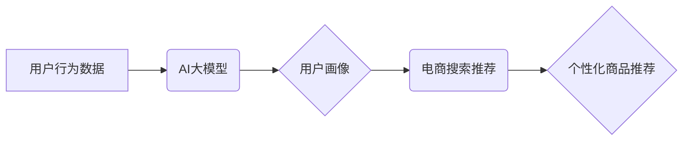

                 

## AI 大模型在电商搜索推荐中的用户画像应用：深度挖掘用户行为偏好

> 关键词：AI大模型、用户画像、电商搜索推荐、深度学习、用户行为分析

## 1. 背景介绍

在当今数据爆炸的时代，电商平台面临着巨大的用户群体和海量商品信息。如何精准地推荐用户感兴趣的商品，提升用户体验和转化率，成为电商平台的核心竞争力。传统的搜索推荐系统主要依赖于基于规则的匹配和协同过滤算法，但这些方法难以捕捉用户行为的复杂性和多样性。

近年来，随着深度学习技术的快速发展，AI大模型在电商搜索推荐领域展现出巨大的潜力。AI大模型能够通过学习海量用户行为数据，构建用户画像，并根据用户的兴趣偏好、购买历史、浏览记录等信息，精准推荐个性化商品。

## 2. 核心概念与联系

### 2.1 用户画像

用户画像是指通过对用户数据进行分析和挖掘，构建出用户特征、行为模式、兴趣爱好等方面的描述，形成对用户的综合理解。

### 2.2 电商搜索推荐

电商搜索推荐是指根据用户的搜索关键词和历史行为，推荐与用户需求相匹配的商品。

### 2.3 AI大模型

AI大模型是指训练规模庞大、参数数量众多的深度学习模型，能够学习复杂的数据模式和关系，并进行高层次的推理和决策。

**核心概念与联系架构图**



## 3. 核心算法原理 & 具体操作步骤

### 3.1 算法原理概述

在电商搜索推荐中，AI大模型通常采用以下几种算法原理：

* **深度神经网络 (DNN)**：DNN能够学习用户行为数据中的复杂非线性关系，并提取用户特征。
* **循环神经网络 (RNN)**：RNN能够处理序列数据，例如用户的浏览历史和搜索记录，并捕捉用户行为的时序性。
* **Transformer网络**：Transformer网络能够捕捉用户行为数据中的长距离依赖关系，并实现更精准的用户画像构建。

### 3.2 算法步骤详解

1. **数据收集和预处理**: 收集用户行为数据，包括搜索记录、浏览记录、购买记录、评价记录等，并进行清洗、转换和特征工程。
2. **模型训练**: 使用深度学习框架，例如TensorFlow或PyTorch，训练AI大模型。训练过程中，模型会学习用户行为数据中的模式和关系，并生成用户画像。
3. **用户画像生成**: 根据训练好的模型，对新的用户进行预测，生成其个性化的用户画像。
4. **商品推荐**: 根据用户的画像信息，推荐与用户兴趣相匹配的商品。

### 3.3 算法优缺点

**优点**:

* 能够捕捉用户行为的复杂性和多样性。
* 能够学习用户画像，实现个性化推荐。
* 能够不断优化推荐效果，提升用户体验。

**缺点**:

* 需要海量数据进行训练。
* 模型训练成本较高。
* 模型解释性较差，难以理解模型的决策过程。

### 3.4 算法应用领域

* 电商平台商品推荐
* 内容平台个性化推荐
* 社交媒体用户兴趣推荐
* 广告精准投放

## 4. 数学模型和公式 & 详细讲解 & 举例说明

### 4.1 数学模型构建

用户画像构建可以采用基于用户的协同过滤模型，例如矩阵分解模型。

**矩阵分解模型**

假设用户集合为U，商品集合为I，用户对商品的评分矩阵为R，其中R(u,i)表示用户u对商品i的评分。

目标是将评分矩阵R分解成两个低维矩阵：用户特征矩阵U和商品特征矩阵V。

**公式**:

$$R(u,i) \approx u^T v_i$$

其中，u是用户u的特征向量，v_i是商品i的特征向量。

### 4.2 公式推导过程

矩阵分解模型的目标是最小化用户评分与预测评分之间的误差。可以使用均方误差 (MSE) 作为损失函数。

**损失函数**:

$$L = \frac{1}{2} \sum_{u \in U, i \in I} (R(u,i) - u^T v_i)^2$$

可以使用梯度下降算法优化损失函数，更新用户特征向量和商品特征向量。

### 4.3 案例分析与讲解

假设用户A对商品1评分为4，对商品2评分为3，用户B对商品1评分为5，对商品2评分为4。

可以使用矩阵分解模型将用户和商品的评分信息分解成低维特征向量，例如：

* 用户A的特征向量：u_A = [0.8, 0.2]
* 用户B的特征向量：u_B = [0.5, 0.7]
* 商品1的特征向量：v_1 = [0.6, 0.4]
* 商品2的特征向量：v_2 = [0.3, 0.6]

根据公式 $$R(u,i) \approx u^T v_i$$，可以预测用户A对商品1的评分为：

$$R(A,1) \approx u_A^T v_1 = 0.8 * 0.6 + 0.2 * 0.4 = 0.56$$

## 5. 项目实践：代码实例和详细解释说明

### 5.1 开发环境搭建

* Python 3.6+
* TensorFlow 2.0+
* PyTorch 1.0+
* Jupyter Notebook

### 5.2 源代码详细实现

```python
import tensorflow as tf

# 定义用户-商品评分矩阵
ratings = tf.constant([[4, 3], [5, 4]])

# 定义用户特征矩阵
user_features = tf.Variable(tf.random.normal([2, 2]))

# 定义商品特征矩阵
item_features = tf.Variable(tf.random.normal([2, 2]))

# 计算预测评分
predictions = tf.matmul(user_features, item_features, transpose_b=True)

# 计算损失函数
loss = tf.reduce_mean(tf.square(ratings - predictions))

# 定义优化器
optimizer = tf.keras.optimizers.Adam()

# 训练模型
for epoch in range(100):
    with tf.GradientTape() as tape:
        loss_value = loss
    gradients = tape.gradient(loss_value, [user_features, item_features])
    optimizer.apply_gradients(zip(gradients, [user_features, item_features]))

# 打印训练结果
print(f"Loss: {loss_value.numpy()}")
```

### 5.3 代码解读与分析

* 代码首先定义了用户-商品评分矩阵和用户特征矩阵、商品特征矩阵。
* 然后使用矩阵乘法计算预测评分。
* 计算损失函数并使用Adam优化器进行模型训练。
* 最后打印训练结果。

### 5.4 运行结果展示

训练完成后，模型能够预测用户对商品的评分。

## 6. 实际应用场景

### 6.1 个性化商品推荐

AI大模型可以根据用户的画像信息，推荐与用户兴趣相匹配的商品，提升用户体验和转化率。

### 6.2 搜索结果排序

AI大模型可以根据用户的搜索关键词和画像信息，对搜索结果进行排序，提升搜索效率。

### 6.3 用户群画像分析

AI大模型可以对用户进行聚类分析，构建不同用户群体的画像，帮助电商平台制定针对性的营销策略。

### 6.4 未来应用展望

* 更精准的用户画像构建，例如结合用户行为、文本信息、画像信息等多源数据进行融合。
* 更个性化的推荐策略，例如基于用户的实时状态和上下文进行动态推荐。
* 更智能的交互方式，例如利用自然语言处理技术，实现用户与推荐系统的自然交互。

## 7. 工具和资源推荐

### 7.1 学习资源推荐

* 深度学习入门书籍：
    * 《深度学习》
    * 《动手学深度学习》
* 在线课程：
    * Coursera深度学习课程
    * fast.ai深度学习课程

### 7.2 开发工具推荐

* 深度学习框架：
    * TensorFlow
    * PyTorch
* 数据处理工具：
    * Pandas
    * NumPy

### 7.3 相关论文推荐

* 《Attention Is All You Need》
* 《BERT: Pre-training of Deep Bidirectional Transformers for Language Understanding》
* 《Recurrent Neural Network for Sequence Modeling》

## 8. 总结：未来发展趋势与挑战

### 8.1 研究成果总结

AI大模型在电商搜索推荐领域取得了显著的成果，能够实现更精准的用户画像构建和个性化商品推荐。

### 8.2 未来发展趋势

* 模型规模和复杂度不断提升，例如利用Transformer网络和自注意力机制构建更强大的模型。
* 多模态数据融合，例如结合用户画像、文本信息、图像信息等多源数据进行融合，构建更全面的用户画像。
* 模型解释性和可解释性提升，例如利用可解释AI技术，帮助用户理解模型的决策过程。

### 8.3 面临的挑战

* 数据隐私和安全问题，例如如何保护用户的隐私信息，防止数据泄露。
* 模型训练成本高，例如需要大量的计算资源和时间进行模型训练。
* 模型的泛化能力和鲁棒性，例如如何保证模型在不同场景下都能表现良好。

### 8.4 研究展望

未来，AI大模型在电商搜索推荐领域将继续发展，并应用于更广泛的场景。研究者将继续探索更强大的模型架构、更有效的训练方法和更完善的应用场景，推动电商搜索推荐技术的进步。

## 9. 附录：常见问题与解答

**Q1：AI大模型的训练数据需要多么庞大？**

A1：AI大模型的训练数据量通常非常庞大，需要包含海量用户行为数据，例如搜索记录、浏览记录、购买记录等。

**Q2：如何评估AI大模型的推荐效果？**

A2：可以使用点击率 (CTR)、转化率 (CVR) 等指标来评估AI大模型的推荐效果。

**Q3：AI大模型的训练成本很高吗？**

A3：是的，AI大模型的训练成本较高，需要大量的计算资源和时间。

**作者：禅与计算机程序设计艺术 / Zen and the Art of Computer Programming**


<end_of_turn>

