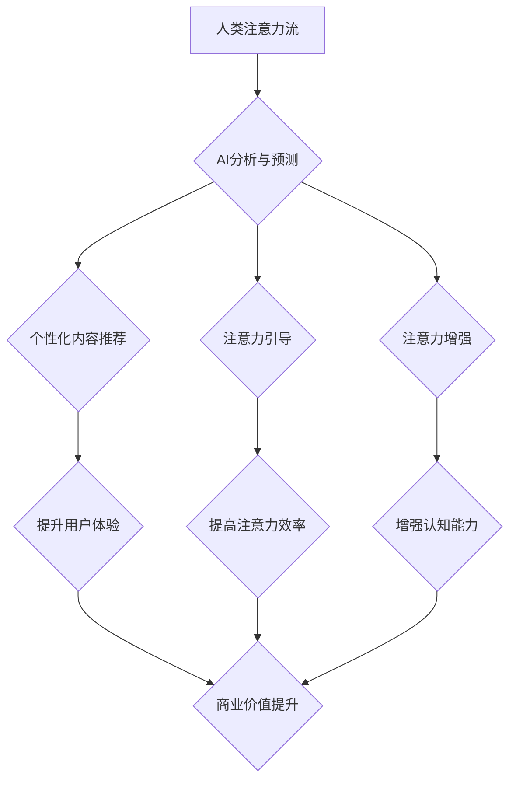

                 

## 关键词：人工智能、注意力流、注意力经济、深度学习、认知科学、用户体验、未来工作、未来生活

## 1. 背景介绍

在信息爆炸的时代，人类的注意力成为稀缺资源。我们每天被来自各种渠道的信息轰炸，从社交媒体的通知到电子邮件的提醒，从新闻网站的滚动条到广告的推送，无处不在的干扰让我们难以集中精力。在这种背景下，人工智能（AI）技术开始扮演着越来越重要的角色，它能够帮助我们更好地理解和管理注意力，从而提升工作效率、生活质量，甚至重塑未来的工作和生活模式。

### 1.1 人类注意力机制的困境

人类的注意力机制是一个复杂而精妙的系统，它能够帮助我们从纷繁的信息中筛选出重要内容，并集中精力处理。然而，随着信息时代的到来，人类的注意力机制面临着前所未有的挑战。

* **信息过载:** 互联网时代，信息量呈指数级增长，我们每天接触的信息量远超人类大脑处理能力。
* **碎片化信息:** 短视频、社交媒体等平台的兴起，导致信息呈现碎片化趋势，难以集中注意力进行深度思考。
* **注意力干扰:** 手机、电脑、网络等电子设备的普及，带来了无处不在的注意力干扰，让我们难以保持专注。

这些因素共同导致人类注意力持续下降，影响着我们的学习、工作、生活和健康。

### 1.2 AI技术对注意力流的理解与应用

人工智能技术能够通过深度学习等算法，对人类注意力流进行分析和预测，并提供相应的解决方案。

* **注意力识别:** AI算法可以识别用户在不同内容上的注意力停留时间、眼动轨迹等信息，从而了解用户的注意力偏好和兴趣点。
* **注意力引导:** AI可以根据用户的注意力特征，推荐相关内容、调整界面布局、提供个性化提醒等，引导用户集中注意力。
* **注意力增强:** AI技术可以开发出注意力训练软件、脑机接口等工具，帮助用户提升注意力集中能力和抗干扰能力。

## 2. 核心概念与联系

### 2.1 人类注意力流

人类注意力流是指人类在信息处理过程中，对特定信息进行选择性关注的动态过程。它是一个复杂而动态的系统，受多种因素影响，包括认知能力、情绪状态、环境因素等。

### 2.2 注意力经济

注意力经济是指在信息时代，注意力成为一种稀缺资源，并被商业化和交易的经济模式。在这个模式下，企业和个人通过各种手段争夺用户的注意力，并以此获取利益。

### 2.3 AI与注意力流的融合

人工智能技术能够帮助我们更好地理解和管理注意力流，从而在注意力经济中占据优势。AI算法可以分析用户的注意力特征，提供个性化内容推荐、注意力引导、注意力增强等服务，帮助用户提高注意力效率，并更好地应对信息时代带来的挑战。

**Mermaid 流程图**



## 3. 核心算法原理 & 具体操作步骤

### 3.1 算法原理概述

AI技术在分析和预测人类注意力流方面，主要依赖于深度学习算法，特别是卷积神经网络（CNN）和循环神经网络（RNN）。

* **CNN:**  擅长提取图像、视频等视觉信息的特征，可以分析用户的眼动轨迹、鼠标移动等行为数据，识别用户的注意力焦点。
* **RNN:** 擅长处理序列数据，可以分析用户的浏览历史、阅读习惯等信息，预测用户的注意力偏好和兴趣点。

通过训练这些深度学习模型，AI系统能够学习到人类注意力流的复杂模式，并进行精准的分析和预测。

### 3.2 算法步骤详解

1. **数据收集:** 收集用户的注意力数据，包括眼动轨迹、鼠标移动、点击行为、阅读时间等。
2. **数据预处理:** 对收集到的数据进行清洗、转换、特征提取等预处理操作，使其适合深度学习模型的训练。
3. **模型训练:** 使用CNN和RNN等深度学习算法，对预处理后的数据进行训练，学习人类注意力流的模式。
4. **模型评估:** 使用测试数据评估模型的性能，并进行调参优化，提高模型的准确率和效率。
5. **应用部署:** 将训练好的模型部署到实际应用场景中，例如个性化内容推荐、注意力引导、注意力增强等。

### 3.3 算法优缺点

**优点:**

* **精准分析:** 深度学习算法能够精准地分析用户的注意力特征，识别用户的注意力焦点和偏好。
* **个性化服务:** 基于用户的注意力特征，AI系统可以提供个性化的内容推荐、注意力引导等服务，提升用户体验。
* **效率提升:** AI技术可以帮助用户提高注意力效率，减少信息干扰，提升工作和学习效率。

**缺点:**

* **数据依赖:** 深度学习算法需要大量的注意力数据进行训练，数据质量和数量直接影响模型的性能。
* **隐私问题:** 收集和分析用户的注意力数据可能会涉及隐私问题，需要谨慎处理和保护用户隐私。
* **算法解释性:** 深度学习模型的内部机制较为复杂，难以解释其决策过程，这可能会导致用户对AI系统的信任度降低。

### 3.4 算法应用领域

* **教育:** 个性化学习推荐、注意力训练软件、在线考试辅助系统。
* **医疗:** 疾病诊断辅助、患者行为分析、医疗影像分析。
* **营销:** 个性化广告推荐、用户行为分析、市场调研。
* **游戏:** 游戏内容推荐、玩家行为分析、游戏体验优化。
* **生活:** 智能家居、个性化新闻推荐、健康管理。

## 4. 数学模型和公式 & 详细讲解 & 举例说明

### 4.1 数学模型构建

人类注意力流可以抽象为一个动态系统，其状态由多个因素决定，例如用户的兴趣、认知能力、环境刺激等。我们可以使用马尔科夫链模型来描述这个系统，其中每个状态代表用户的注意力状态，例如集中、分散、转移等。

**马尔科夫链模型:**

$$P(s_t|s_{t-1}, s_{t-2}, ..., s_1) = P(s_t|s_{t-1})$$

其中：

* $s_t$ 表示用户在时间 $t$ 的注意力状态。
* $P(s_t|s_{t-1})$ 表示用户从状态 $s_{t-1}$ 转移到状态 $s_t$ 的概率。

### 4.2 公式推导过程

我们可以根据用户的注意力数据，例如眼动轨迹、鼠标移动等，训练马尔科夫链模型，学习每个状态之间的转移概率。

**转移概率计算:**

$$P(s_t|s_{t-1}) = \frac{\text{次数}(s_{t-1} \rightarrow s_t)}{\text{次数}(s_{t-1})}$$

其中：

* $\text{次数}(s_{t-1} \rightarrow s_t)$ 表示用户从状态 $s_{t-1}$ 转移到状态 $s_t$ 的次数。
* $\text{次数}(s_{t-1})$ 表示用户处于状态 $s_{t-1}$ 的总次数。

### 4.3 案例分析与讲解

例如，我们可以训练一个马尔科夫链模型来预测用户的阅读注意力状态。

* $s_1$: 集中阅读
* $s_2$: 分散阅读
* $s_3$: 离开页面

根据用户的阅读行为数据，我们可以计算每个状态之间的转移概率，例如：

* $P(s_2|s_1) = 0.3$ (从集中阅读转移到分散阅读的概率)
* $P(s_3|s_2) = 0.5$ (从分散阅读转移到离开页面的概率)

通过这个模型，我们可以预测用户在阅读过程中注意力状态的变化，并提供相应的个性化服务，例如：

* 当用户注意力分散时，可以提醒用户休息一下，或者推荐一些更吸引人的内容。
* 当用户准备离开页面时，可以提示用户保存进度，或者推荐一些相关内容。

## 5. 项目实践：代码实例和详细解释说明

### 5.1 开发环境搭建

* **操作系统:** Ubuntu 20.04 LTS
* **编程语言:** Python 3.8
* **深度学习框架:** TensorFlow 2.0
* **其他工具:** Jupyter Notebook, Git

### 5.2 源代码详细实现

```python
import tensorflow as tf

# 定义模型结构
model = tf.keras.Sequential([
    tf.keras.layers.Conv2D(32, (3, 3), activation='relu', input_shape=(64, 64, 3)),
    tf.keras.layers.MaxPooling2D((2, 2)),
    tf.keras.layers.Conv2D(64, (3, 3), activation='relu'),
    tf.keras.layers.MaxPooling2D((2, 2)),
    tf.keras.layers.Flatten(),
    tf.keras.layers.Dense(10, activation='softmax')
])

# 编译模型
model.compile(optimizer='adam',
              loss='sparse_categorical_crossentropy',
              metrics=['accuracy'])

# 训练模型
model.fit(x_train, y_train, epochs=10)

# 评估模型
loss, accuracy = model.evaluate(x_test, y_test)
print('Loss:', loss)
print('Accuracy:', accuracy)
```

### 5.3 代码解读与分析

这段代码实现了基于CNN的注意力流预测模型。

* **模型结构:** 模型包含两个卷积层、两个最大池化层、一个全连接层和一个softmax输出层。
* **数据输入:** 模型的输入数据是用户的注意力行为数据，例如眼动轨迹、鼠标移动等，需要进行预处理，例如归一化、转换格式等。
* **模型训练:** 使用Adam优化器和交叉熵损失函数训练模型，并使用准确率作为评估指标。
* **模型评估:** 使用测试数据评估模型的性能，并打印损失和准确率。

### 5.4 运行结果展示

训练完成后，我们可以使用测试数据评估模型的性能，并根据结果进行模型调优。

## 6. 实际应用场景

### 6.1 教育领域

* **个性化学习推荐:** 根据学生的注意力特征，推荐个性化的学习内容和学习路径，提高学习效率和兴趣。
* **注意力训练软件:** 开发注意力训练软件，帮助学生提升注意力集中能力和抗干扰能力。
* **在线考试辅助系统:** 利用AI技术分析学生的注意力状态，识别作弊行为，提高考试公平性。

### 6.2 医疗领域

* **疾病诊断辅助:** 分析患者的注意力特征，辅助医生诊断疾病，例如注意力缺陷多动障碍（ADHD）等。
* **患者行为分析:** 监测患者的注意力状态，了解患者的治疗效果和生活习惯，提供个性化的医疗建议。
* **医疗影像分析:** 利用AI技术分析医生的注意力焦点，提高医疗影像诊断的准确率和效率。

### 6.3 营销领域

* **个性化广告推荐:** 根据用户的注意力特征，推荐个性化的广告，提高广告点击率和转化率。
* **用户行为分析:** 分析用户的注意力流，了解用户的兴趣爱好和消费习惯，为营销策略提供数据支持。
* **市场调研:** 利用AI技术分析用户的注意力流，了解用户对产品的评价和反馈，改进产品设计和营销策略。

### 6.4 未来应用展望

随着AI技术的不断发展，AI与注意力流的融合将应用于更多领域，例如：

* **智能家居:** 根据用户的注意力状态，自动调节家居环境，例如灯光、温度、音乐等。
* **虚拟现实:** 利用AI技术模拟用户的注意力流，打造更加沉浸式的虚拟现实体验。
* **脑机接口:** 开发脑机接口技术，直接读取用户的注意力信息，实现人机交互的新模式。

## 7. 工具和资源推荐

### 7.1 学习资源推荐

* **书籍:**
    * 《深度学习》 by Ian Goodfellow, Yoshua Bengio, Aaron Courville
    * 《Attention Is All You Need》 by Vaswani et al.
* **在线课程:**
    * Coursera: Deep Learning Specialization
    * Udacity: Deep Learning Nanodegree
* **博客和网站:**
    * Towards Data Science
    * Machine Learning Mastery

### 7.2 开发工具推荐

* **深度学习框架:** TensorFlow, PyTorch, Keras
* **数据可视化工具:** Matplotlib, Seaborn
* **版本控制工具:** Git

### 7.3 相关论文推荐

* **Attention Is All You Need:** https://arxiv.org/abs/1706.03762
* **BERT: Pre-training of Deep Bidirectional Transformers for Language Understanding:** https://arxiv.org/abs/1810.04805
* **Transformer-XL: Attentive Language Models Beyond a Fixed-Length Context:** https://arxiv.org/abs/1901.08316

## 8. 总结：未来发展趋势与挑战

### 8.1 研究成果总结

AI技术与注意力流的融合取得了显著成果，在教育、医疗、营销等领域展现出巨大的应用潜力。深度学习算法能够精准分析用户的注意力特征，提供个性化服务，提升用户体验和效率。

### 8.2 未来发展趋势

* **更精准的注意力预测:** 利用更先进的深度学习算法和更大的数据规模，实现更精准的注意力预测，例如预测用户的注意力持续时间、注意力焦点等。
* **更个性化的服务:** 基于用户的注意力特征，提供更个性化的服务，例如定制化的学习路径、个性化的广告推荐、个性化的医疗建议等。
* **跨模态注意力分析:** 将不同模态的数据，例如文本、图像、音频等，融合起来进行注意力分析，实现更全面的用户理解。

### 8.3 面临的挑战

* **数据隐私保护:** 收集和分析用户的注意力数据可能会涉及隐私问题，需要采取有效的措施保护用户隐私。
* **算法解释性:** 深度学习模型的内部机制较为复杂，难以解释其决策过程，这可能会导致用户对AI系统的信任度降低。
* **伦理问题:** AI技术与注意力流的融合可能会带来一些伦理问题，例如注意力操控、信息茧房等，需要进行深入的伦理探讨和规范。

### 8.4 研究展望

未来，AI与注意力流的研究将继续深入，探索更精准的注意力预测模型、更个性化的服务方案、更有效的隐私保护机制，并积极应对伦理挑战，推动AI技术在注意力经济中健康发展。

## 9. 附录：常见问题与解答

**Q1: AI技术如何准确预测用户的注意力流？**

**A1:** AI技术通过深度学习算法，分析用户的注意力行为数据，例如眼动轨迹、鼠标移动等，学习用户注意力流的模式，并进行预测。

**Q2: AI技术对用户的注意力流有什么影响？**

**A2:** AI技术可以帮助用户更好地管理注意力，提高注意力效率，但也可能导致注意力依赖和信息茧房等问题，需要谨慎使用。

**Q3: 如何保护用户的注意力数据隐私？**

**A3:** 在收集和分析用户注意力数据时，需要采取有效的隐私保护措施，例如数据匿名化、加密传输、数据安全管理等。


作者：禅与计算机程序设计艺术 / Zen and the Art of Computer Programming<end_of_turn>

