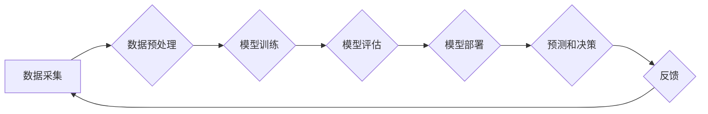

                 

## AI与人类计算：打造可持续发展的城市交通与基础设施建设

> 关键词：人工智能、城市交通、基础设施建设、可持续发展、人类计算、机器学习、深度学习、优化算法、数据分析

## 1. 背景介绍

随着全球人口的持续增长和城市化的加速推进，城市交通拥堵、基础设施老化等问题日益突出，严重影响着城市的可持续发展。传统交通管理和基础设施建设模式面临着巨大的挑战，亟需革新。人工智能（AI）作为一门新兴技术，凭借其强大的数据处理能力、学习能力和决策能力，为解决城市交通和基础设施建设难题提供了新的思路和解决方案。

城市交通拥堵不仅浪费时间和能源，还会造成环境污染和社会成本的增加。基础设施老化则会导致安全隐患和服务质量下降。如何提高交通效率、优化基础设施建设，打造更加智能、高效、可持续的城市环境，是全球城市面临的共同挑战。

## 2. 核心概念与联系

**2.1 人工智能与人类计算**

人工智能（AI）是指模拟人类智能行为的计算机系统。人类计算是指人类利用自身认知能力进行信息处理、决策和解决问题。AI与人类计算相辅相成，AI可以帮助人类解放生产力，提高工作效率，而人类的智慧和经验则可以指导AI的发展方向，使其更好地服务于人类。

**2.2 城市交通与基础设施建设**

城市交通是指城市内部人员、货物和信息的流动，包括道路交通、公共交通、航空交通等。基础设施建设是指为城市提供基本服务和支撑的设施，包括交通基础设施、能源基础设施、通信基础设施等。

**2.3 AI在城市交通与基础设施建设中的应用**

AI技术可以应用于城市交通和基础设施建设的各个环节，例如：

* **交通流量预测和优化:** 利用AI算法分析历史交通数据，预测未来交通流量，并优化交通信号灯控制、道路规划等，提高交通效率。
* **智能交通管理:** 利用AI技术实现车辆识别、轨迹跟踪、违规行为识别等，提高交通安全和管理效率。
* **基础设施维护和管理:** 利用AI技术对基础设施进行远程监控、故障诊断和预测维护，延长基础设施使用寿命，降低维护成本。
* **城市规划和设计:** 利用AI技术分析城市数据，优化城市布局、交通网络和基础设施规划，打造更加智能、高效、可持续的城市。

**2.4 AI流程图**



## 3. 核心算法原理 & 具体操作步骤

**3.1 算法原理概述**

在城市交通和基础设施建设领域，常用的AI算法包括机器学习、深度学习、强化学习等。

* **机器学习:** 通过训练模型，使模型能够从数据中学习规律，并对新数据进行预测或分类。
* **深度学习:** 基于多层神经网络，能够学习更复杂的特征，适用于处理海量数据和复杂问题。
* **强化学习:** 通过奖励机制，训练模型在特定环境中做出最优决策。

**3.2 算法步骤详解**

以机器学习为例，其基本步骤包括：

1. **数据采集:** 收集相关数据，例如交通流量数据、基础设施运行数据等。
2. **数据预处理:** 对数据进行清洗、转换、特征提取等处理，使其适合模型训练。
3. **模型选择:** 根据具体问题选择合适的机器学习模型，例如线性回归、决策树、支持向量机等。
4. **模型训练:** 利用训练数据训练模型，调整模型参数，使其能够准确预测或分类。
5. **模型评估:** 利用测试数据评估模型性能，例如准确率、召回率、F1-score等。
6. **模型部署:** 将训练好的模型部署到实际应用环境中，用于预测或决策。

**3.3 算法优缺点**

* **优点:** 能够自动学习数据规律，提高预测精度和决策效率。
* **缺点:** 需要大量数据进行训练，模型训练过程复杂，对数据质量要求高。

**3.4 算法应用领域**

* **交通流量预测:** 预测道路交通流量、拥堵情况等。
* **公共交通优化:** 优化公交线路、车次安排等，提高公共交通效率。
* **基础设施故障预测:** 预测基础设施设备故障，提前进行维护。
* **城市规划:** 分析城市数据，优化城市布局和基础设施规划。

## 4. 数学模型和公式 & 详细讲解 & 举例说明

**4.1 数学模型构建**

在城市交通和基础设施建设领域，常用的数学模型包括：

* **交通流量模型:** 描述交通流量的生成、流动和分配规律。
* **基础设施寿命模型:** 描述基础设施设备的寿命和退化规律。
* **城市规划模型:** 描述城市空间布局、人口分布、交通网络等因素之间的关系。

**4.2 公式推导过程**

例如，交通流量模型中常用的公式是：

$$
Q = \alpha \cdot T + \beta \cdot P
$$

其中：

* $Q$ 表示交通流量
* $T$ 表示时间
* $P$ 表示人口密度
* $\alpha$ 和 $\beta$ 为模型参数

该公式表示交通流量受时间和人口密度的影响，可以通过训练模型确定参数 $\alpha$ 和 $\beta$。

**4.3 案例分析与讲解**

以交通流量预测为例，我们可以利用历史交通数据训练一个交通流量模型，并预测未来交通流量。例如，我们可以收集过去一周的交通流量数据，并将其作为训练数据，训练一个基于线性回归的交通流量模型。然后，我们可以利用该模型预测未来一周的交通流量，并根据预测结果优化交通信号灯控制、道路规划等，提高交通效率。

## 5. 项目实践：代码实例和详细解释说明

**5.1 开发环境搭建**

* 操作系统: Ubuntu 20.04
* Python 版本: 3.8
* 必要的库: pandas, numpy, scikit-learn, matplotlib

**5.2 源代码详细实现**

```python
import pandas as pd
from sklearn.linear_model import LinearRegression
from sklearn.model_selection import train_test_split
import matplotlib.pyplot as plt

# 加载交通流量数据
data = pd.read_csv('traffic_data.csv')

# 选择特征和目标变量
features = ['hour', 'weekday', 'temperature']
target = 'traffic_volume'

# 将数据分割为训练集和测试集
X_train, X_test, y_train, y_test = train_test_split(data[features], data[target], test_size=0.2)

# 创建线性回归模型
model = LinearRegression()

# 训练模型
model.fit(X_train, y_train)

# 预测测试集数据
y_pred = model.predict(X_test)

# 评估模型性能
print('模型系数:', model.coef_)
print('模型截距:', model.intercept_)
print('R方:', model.score(X_test, y_test))

# 可视化预测结果
plt.scatter(y_test, y_pred)
plt.xlabel('实际交通流量')
plt.ylabel('预测交通流量')
plt.title('交通流量预测结果')
plt.show()
```

**5.3 代码解读与分析**

* 该代码首先加载交通流量数据，并选择特征和目标变量。
* 然后，将数据分割为训练集和测试集，用于训练和评估模型。
* 创建一个线性回归模型，并利用训练集训练模型。
* 训练完成后，利用测试集数据进行预测，并评估模型性能。
* 最后，可视化预测结果，观察模型的预测精度。

**5.4 运行结果展示**

运行结果将显示模型系数、截距、R方等指标，以及预测结果的可视化图。

## 6. 实际应用场景

**6.1 交通流量预测和优化**

AI技术可以用于预测城市交通流量，并根据预测结果优化交通信号灯控制、道路规划等，提高交通效率。例如，可以利用AI预测高峰时段的交通流量，提前调整信号灯控制时间，减少拥堵。

**6.2 智能交通管理**

AI技术可以用于实现车辆识别、轨迹跟踪、违规行为识别等，提高交通安全和管理效率。例如，可以利用AI识别违规停车车辆，并自动发出罚单。

**6.3 基础设施维护和管理**

AI技术可以用于对基础设施进行远程监控、故障诊断和预测维护，延长基础设施使用寿命，降低维护成本。例如，可以利用AI监测桥梁的结构状态，预测潜在的故障风险。

**6.4 城市规划和设计**

AI技术可以分析城市数据，优化城市布局、交通网络和基础设施规划，打造更加智能、高效、可持续的城市。例如，可以利用AI分析城市人口分布、交通需求等数据，优化城市交通网络规划。

**6.5 未来应用展望**

随着AI技术的不断发展，其在城市交通和基础设施建设领域的应用将更加广泛和深入。例如，未来可能出现：

* **自动驾驶车辆:** AI技术可以实现自动驾驶车辆，提高交通效率和安全性。
* **智能交通系统:** AI技术可以实现智能交通系统，实现交通流量的实时优化和管理。
* **可持续城市发展:** AI技术可以帮助城市实现可持续发展，减少碳排放、提高资源利用效率。

## 7. 工具和资源推荐

**7.1 学习资源推荐**

* **在线课程:** Coursera, edX, Udacity 等平台提供丰富的AI课程。
* **书籍:** 《深度学习》、《机器学习实战》等书籍。
* **开源项目:** TensorFlow, PyTorch 等开源项目。

**7.2 开发工具推荐**

* **Python:** 作为AI开发的主要语言，Python拥有丰富的库和工具。
* **Jupyter Notebook:** 用于编写和运行Python代码的交互式环境。
* **IDE:** PyCharm, VS Code 等IDE可以提高开发效率。

**7.3 相关论文推荐**

* **交通流量预测:** "Deep Learning for Traffic Flow Prediction"
* **基础设施维护:** "Predictive Maintenance Using Machine Learning"
* **城市规划:** "Urban Planning with Machine Learning"

## 8. 总结：未来发展趋势与挑战

**8.1 研究成果总结**

AI技术在城市交通和基础设施建设领域取得了显著成果，例如交通流量预测、智能交通管理、基础设施维护等方面都取得了突破。

**8.2 未来发展趋势**

* **模型更加复杂:** 未来AI模型将更加复杂，能够学习更复杂的特征，解决更复杂的问题。
* **数据更加丰富:** 未来将收集更多数据，例如传感器数据、卫星图像等，为AI模型提供更丰富的训练数据。
* **应用更加广泛:** AI技术将应用于更多城市交通和基础设施建设领域，例如自动驾驶、智能交通系统等。

**8.3 面临的挑战**

* **数据质量:** AI模型的性能依赖于数据质量，需要保证数据的准确性、完整性和时效性。
* **算法解释性:** 许多AI算法是黑箱模型，难以解释其决策过程，这可能会导致信任问题。
* **伦理问题:** AI技术的发展也带来了一些伦理问题，例如数据隐私、算法偏见等，需要认真思考和解决。

**8.4 研究展望**

未来研究方向包括：

* **开发更鲁棒、更解释性的AI算法。**
* **解决数据质量问题，提高数据可信度。**
* **研究AI技术在城市交通和基础设施建设领域的伦理问题，确保其安全、公平、可持续地发展。**

## 9. 附录：常见问题与解答

**9.1 如何选择合适的AI算法？**

选择合适的AI算法取决于具体问题和数据特点。例如，对于预测连续变量，可以使用线性回归、支持向量机等算法；对于分类问题，可以使用决策树、随机森林等算法。

**9.2 如何评估AI模型的性能？**

常用的评估指标包括准确率、召回率、F1-score、R方等。

**9.3 如何解决数据质量问题？**

数据质量问题可以通过数据清洗、数据转换、数据增强等方法解决。

**9.4 如何确保AI算法的公平性？**

可以通过数据预处理、算法设计、模型评估等环节，确保AI算法的公平性。


作者：禅与计算机程序设计艺术 / Zen and the Art of Computer Programming 
<end_of_turn>

