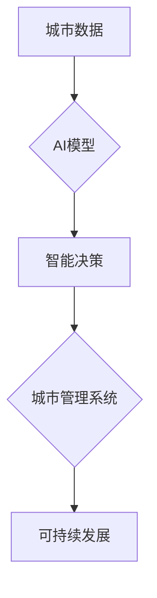

                 

## 关键词：人工智能、城市计算、交通管理、可持续发展、机器学习、深度学习、优化算法

## 1. 背景介绍

随着全球人口的持续增长和城市化的加速推进，城市面临着日益严峻的挑战，其中交通拥堵、资源消耗、环境污染等问题尤为突出。传统交通管理系统难以有效应对这些挑战，亟需革新。人工智能（AI）技术的快速发展为城市交通管理提供了新的思路和解决方案。

AI技术能够通过学习和分析海量数据，识别模式、预测趋势，并做出智能决策，从而优化交通流量、提高道路通行效率、降低碳排放，最终打造更加可持续发展的城市生活方式。

## 2. 核心概念与联系

### 2.1 城市计算

城市计算是指利用大数据、云计算、物联网等技术，对城市运行状态进行实时监测、分析和决策，以提高城市管理效率、提升居民生活质量的理念和实践。

### 2.2 人工智能

人工智能是指模拟人类智能行为的计算机系统，包括学习、推理、决策、感知、语言理解等能力。

### 2.3 AI与城市计算的融合

AI技术与城市计算的融合，将赋予城市管理系统更强大的智能化能力。通过将传感器数据、交通数据、地理信息等数据输入到AI模型中，可以实现以下功能：

* **智能交通管理:** 预测交通流量、优化交通信号灯控制、引导车辆避开拥堵路段、提供实时路况信息等。
* **智能停车管理:** 预测停车位空闲情况、引导车辆前往空闲停车位、优化停车场布局等。
* **智能公共交通:** 优化公交线路和班次、预测乘客需求、提供个性化出行方案等。
* **智能环境监测:** 监测空气质量、噪音污染、水质等环境指标，并采取相应的措施进行治理。

**核心概念与架构流程图**



## 3. 核心算法原理 & 具体操作步骤

### 3.1 算法原理概述

在AI与城市计算的融合中，常用的算法包括机器学习、深度学习、强化学习等。

* **机器学习:** 通过训练模型，让模型从数据中学习规律，并对新的数据进行预测或分类。
* **深度学习:** 基于多层神经网络，能够学习更复杂的特征，适用于处理海量数据和复杂问题。
* **强化学习:** 通过奖励机制，让模型学习最优策略，适用于解决决策问题。

### 3.2 算法步骤详解

以交通流量预测为例，使用机器学习算法进行预测的步骤如下：

1. **数据收集:** 收集历史交通流量数据、天气数据、时间数据等相关信息。
2. **数据预处理:** 对数据进行清洗、转换、特征工程等处理，使其适合模型训练。
3. **模型选择:** 选择合适的机器学习算法，例如线性回归、决策树、支持向量机等。
4. **模型训练:** 使用训练数据训练模型，调整模型参数，使其能够准确预测交通流量。
5. **模型评估:** 使用测试数据评估模型的预测精度，并进行模型调优。
6. **模型部署:** 将训练好的模型部署到生产环境中，实时预测交通流量。

### 3.3 算法优缺点

**机器学习算法:**

* **优点:** 能够从数据中学习规律，预测未来趋势。
* **缺点:** 需要大量的训练数据，对数据质量要求高，难以解释模型决策过程。

**深度学习算法:**

* **优点:** 能够学习更复杂的特征，适用于处理海量数据和复杂问题。
* **缺点:** 需要更多的计算资源和训练时间，模型训练过程难以解释。

**强化学习算法:**

* **优点:** 能够学习最优策略，适用于解决决策问题。
* **缺点:** 需要设计合理的奖励机制，训练过程较为复杂。

### 3.4 算法应用领域

* **交通流量预测:** 预测道路交通流量，优化交通信号灯控制，引导车辆避开拥堵路段。
* **公共交通优化:** 优化公交线路和班次，预测乘客需求，提供个性化出行方案。
* **智能停车管理:** 预测停车位空闲情况，引导车辆前往空闲停车位，优化停车场布局。
* **环境监测:** 监测空气质量、噪音污染、水质等环境指标，并采取相应的措施进行治理。

## 4. 数学模型和公式 & 详细讲解 & 举例说明

### 4.1 数学模型构建

在AI与城市计算的融合中，常用的数学模型包括线性回归模型、逻辑回归模型、神经网络模型等。

**线性回归模型:** 用于预测连续变量，假设目标变量与输入变量之间存在线性关系。

**公式:**

$$
y = \beta_0 + \beta_1x_1 + \beta_2x_2 + ... + \beta_nx_n + \epsilon
$$

其中:

* $y$ 是目标变量
* $x_1, x_2, ..., x_n$ 是输入变量
* $\beta_0, \beta_1, ..., \beta_n$ 是模型参数
* $\epsilon$ 是误差项

**举例说明:**

预测城市交通流量，输入变量包括时间、天气、节日等因素，目标变量是交通流量。

### 4.2 公式推导过程

模型参数的求解可以通过最小二乘法进行。最小二乘法旨在找到使模型预测值与实际值误差最小的一组参数。

**公式:**

$$
\hat{\beta} = (X^TX)^{-1}X^Ty
$$

其中:

* $X$ 是输入变量矩阵
* $y$ 是目标变量向量
* $\hat{\beta}$ 是模型参数向量

### 4.3 案例分析与讲解

通过训练线性回归模型，可以得到交通流量预测模型，并根据模型预测结果，优化交通信号灯控制、引导车辆避开拥堵路段等。

## 5. 项目实践：代码实例和详细解释说明

### 5.1 开发环境搭建

* 操作系统: Ubuntu 20.04
* Python 版本: 3.8
* 必要的库: pandas, numpy, scikit-learn

### 5.2 源代码详细实现

```python
import pandas as pd
from sklearn.linear_model import LinearRegression

# 数据加载
data = pd.read_csv('traffic_data.csv')

# 数据预处理
X = data[['time', 'weather', 'holiday']]
y = data['traffic_flow']

# 模型训练
model = LinearRegression()
model.fit(X, y)

# 模型预测
new_data = pd.DataFrame({'time': [10, 12, 14], 'weather': ['晴', '阴', '雨'], 'holiday': [0, 1, 0]})
predicted_flow = model.predict(new_data)

# 结果展示
print(predicted_flow)
```

### 5.3 代码解读与分析

* 数据加载: 使用pandas库读取交通数据文件。
* 数据预处理: 将时间、天气、节日等因素作为输入变量，交通流量作为目标变量。
* 模型训练: 使用scikit-learn库中的线性回归模型进行训练。
* 模型预测: 使用训练好的模型预测新的交通流量数据。
* 结果展示: 打印预测结果。

### 5.4 运行结果展示

运行代码后，将输出预测的交通流量值。

## 6. 实际应用场景

### 6.1 智能交通信号灯控制

AI算法可以分析实时交通流量数据，动态调整交通信号灯的绿灯时间，优化交通流量，减少拥堵。

### 6.2 智能停车引导系统

AI算法可以预测停车位空闲情况，引导车辆前往空闲停车位，提高停车效率，减少车辆在寻找停车位的浪费时间。

### 6.3 智能公共交通调度

AI算法可以分析乘客需求数据，优化公交线路和班次，提高公共交通效率，减少乘客等待时间。

### 6.4 未来应用展望

* **无人驾驶:** AI技术将推动无人驾驶汽车的普及，提高交通安全性和效率。
* **智慧城市:** AI技术将成为智慧城市建设的重要支撑，打造更加智能、便捷、可持续的城市生活方式。

## 7. 工具和资源推荐

### 7.1 学习资源推荐

* **在线课程:** Coursera, edX, Udacity 等平台提供丰富的AI课程。
* **书籍:** 《深度学习》、《机器学习实战》等书籍。
* **开源项目:** TensorFlow, PyTorch 等开源项目。

### 7.2 开发工具推荐

* **Python:** 广泛应用于AI开发，拥有丰富的库和工具。
* **Jupyter Notebook:** 用于编写和运行Python代码，方便进行数据分析和模型开发。
* **TensorFlow, PyTorch:** 深度学习框架，用于构建和训练深度学习模型。

### 7.3 相关论文推荐

* **《ImageNet Classification with Deep Convolutional Neural Networks》:** 提出了AlexNet模型，标志着深度学习的兴起。
* **《Attention Is All You Need》:** 提出了Transformer模型，在自然语言处理领域取得了突破性进展。
* **《Deep Reinforcement Learning》:** 介绍了强化学习的基本原理和应用。

## 8. 总结：未来发展趋势与挑战

### 8.1 研究成果总结

AI技术与城市计算的融合，为打造更加智能、可持续的城市生活方式提供了新的思路和解决方案。

### 8.2 未来发展趋势

* **模型更加智能化:** 深度学习、强化学习等算法将进一步提升AI模型的智能化水平。
* **数据更加丰富:** 随着物联网技术的普及，城市数据将更加丰富，为AI模型训练提供更充足的数据支持。
* **应用更加广泛:** AI技术将应用于更多城市领域，例如环境监测、公共安全、医疗保健等。

### 8.3 面临的挑战

* **数据隐私保护:** 城市数据往往包含敏感信息，需要采取有效的措施保护数据隐私。
* **算法可解释性:** 许多AI算法难以解释其决策过程，这可能会导致公众对AI技术的信任度降低。
* **技术伦理:** AI技术的发展需要遵循伦理原则，避免产生负面影响。

### 8.4 研究展望

未来，需要加强AI技术与城市计算的融合研究，探索更智能、更安全、更可持续的城市解决方案。


## 9. 附录：常见问题与解答

**Q1: AI技术是否能够完全取代人类在城市管理中的作用？**

**A1:** AI技术可以辅助人类进行城市管理，提高效率和准确性，但无法完全取代人类的智慧和决策能力。

**Q2: AI技术在城市计算中的应用会带来哪些伦理问题？**

**A2:** AI技术在城市计算中的应用可能会带来数据隐私保护、算法偏见、责任归属等伦理问题，需要引起重视并制定相应的解决方案。

**Q3: 如何评估AI模型在城市计算中的性能？**

**A3:** 可以通过指标如准确率、召回率、F1-score等来评估AI模型的性能，并根据实际应用场景选择合适的评估指标。


作者：禅与计算机程序设计艺术 / Zen and the Art of Computer Programming 
<end_of_turn>

