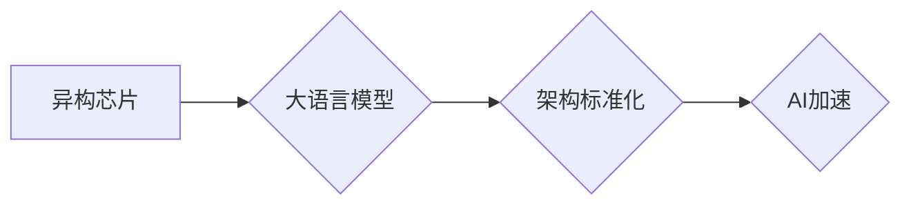

                 

## AI加速的曙光：贾扬清的乐观展望，异构芯片与大语言模型架构的标准化

> 关键词：人工智能加速、异构芯片、大语言模型、架构标准化、贾扬清、AI发展趋势

### 1. 背景介绍

人工智能（AI）正以惊人的速度发展，其应用领域不断拓展，从自动驾驶到医疗诊断，再到创意写作，AI正在改变着我们的生活。然而，AI的快速发展也面临着一些挑战，其中之一就是计算能力的瓶颈。传统的CPU架构在处理海量数据和复杂计算时效率低下，这限制了AI模型的规模和性能。

贾扬清，一位享誉全球的AI专家，在最近的演讲中表达了他对AI未来的乐观展望。他认为，异构芯片和大语言模型架构的标准化将是AI加速的关键。异构芯片，例如GPU和TPU，拥有强大的并行计算能力，能够显著加速AI模型的训练和推理。而大语言模型架构的标准化，则可以促进模型的复用和移植，降低开发成本，加速AI应用的普及。

### 2. 核心概念与联系

#### 2.1 异构芯片

异构芯片是指由不同类型的处理器组成，例如CPU、GPU、FPGA等，协同工作的芯片。 

* **CPU (中央处理器)**：传统处理器，擅长处理顺序指令，但并行计算能力有限。
* **GPU (图形处理器)**：最初用于处理图形渲染，拥有大量并行计算单元，非常适合处理海量数据并行计算。
* **TPU (Tensor Processing Unit)**：谷歌专门为深度学习设计的芯片，拥有更优化的算力架构，能够显著加速深度学习模型的训练。

#### 2.2 大语言模型

大语言模型（LLM）是一种基于深度学习的强大AI模型，能够理解和生成人类语言。它们通过训练海量文本数据，学习语言的语法、语义和上下文关系。

* **Transformer 架构**: LLMs通常基于Transformer架构，这种架构能够有效捕捉长距离依赖关系，从而实现更准确的语言理解和生成。
* **参数量**: LLMs通常拥有数亿甚至数十亿个参数，这使得它们能够学习更复杂的语言模式。

#### 2.3 架构标准化

架构标准化是指制定统一的接口和规范，使不同厂商的芯片和软件能够互操作。

* **模型接口**: 标准化的模型接口可以使模型更容易移植到不同的硬件平台。
* **训练框架**: 标准化的训练框架可以简化模型训练流程，提高开发效率。

**Mermaid 流程图**



### 3. 核心算法原理 & 具体操作步骤

#### 3.1 算法原理概述

异构芯片和大语言模型架构的标准化，本质上是通过优化硬件和软件的协同工作，提高AI计算效率的算法。

* **异构计算**: 将不同类型的计算任务分配到不同的处理器上，充分利用每个处理器的优势。
* **模型并行**: 将大型模型拆分成多个子模型，在不同的处理器上并行训练和推理。
* **数据并行**: 将训练数据分割成多个部分，在不同的处理器上并行处理。

#### 3.2 算法步骤详解

1. **模型拆分**: 将大语言模型拆分成多个子模型，每个子模型负责处理特定的计算任务。
2. **数据分配**: 将训练数据分割成多个部分，每个部分分配给不同的处理器。
3. **并行训练**: 在不同的处理器上并行训练子模型，每个子模型处理自己的数据部分。
4. **模型融合**: 将训练完成的子模型融合在一起，形成完整的模型。
5. **推理加速**: 在推理过程中，将输入数据分配到不同的处理器上，并行处理，加速推理速度。

#### 3.3 算法优缺点

**优点**:

* **提高计算效率**: 通过异构计算和模型并行，显著提高AI模型的训练和推理速度。
* **降低成本**: 利用异构芯片的优势，可以降低训练和推理所需的计算资源。
* **支持更大规模模型**: 异构芯片和模型并行可以支持训练和推理更大规模的AI模型。

**缺点**:

* **开发复杂度**: 异构计算和模型并行的开发难度较高，需要对不同处理器架构有深入了解。
* **数据同步**: 在并行训练过程中，需要保证数据同步，避免数据冲突。
* **模型融合**: 模型融合需要复杂的算法和技术，确保融合后的模型性能达到预期。

#### 3.4 算法应用领域

* **自然语言处理**: 机器翻译、文本摘要、问答系统等。
* **计算机视觉**: 图像识别、目标检测、图像分割等。
* **语音识别**: 语音转文本、语音助手等。
* **药物研发**: 药物发现、药物设计等。

### 4. 数学模型和公式 & 详细讲解 & 举例说明

#### 4.1 数学模型构建

大语言模型的训练过程可以看作是一个优化问题的求解过程。目标函数通常是模型预测的输出与真实值的误差，例如交叉熵损失函数。

$$
Loss = -\sum_{i=1}^{N} y_i \log(p_i)
$$

其中：

* $N$ 是样本数量
* $y_i$ 是真实标签
* $p_i$ 是模型预测的概率

#### 4.2 公式推导过程

通过梯度下降算法，不断更新模型参数，使得目标函数最小化。梯度下降算法的核心思想是沿着梯度方向更新参数，每次更新量的大小由学习率决定。

$$
\theta = \theta - \alpha \nabla Loss(\theta)
$$

其中：

* $\theta$ 是模型参数
* $\alpha$ 是学习率
* $\nabla Loss(\theta)$ 是目标函数关于参数 $\theta$ 的梯度

#### 4.3 案例分析与讲解

例如，在训练一个文本分类模型时，目标函数可以是交叉熵损失函数，模型参数可以是词嵌入向量和神经网络权重。通过梯度下降算法，不断更新这些参数，使得模型能够准确地分类文本。

### 5. 项目实践：代码实例和详细解释说明

#### 5.1 开发环境搭建

* **操作系统**: Linux (Ubuntu 或 CentOS)
* **深度学习框架**: TensorFlow 或 PyTorch
* **异构芯片**: GPU 或 TPU

#### 5.2 源代码详细实现

```python
# 使用 TensorFlow 训练一个简单的文本分类模型

import tensorflow as tf

# 定义模型结构
model = tf.keras.Sequential([
    tf.keras.layers.Embedding(input_dim=vocab_size, output_dim=embedding_dim),
    tf.keras.layers.LSTM(units=128),
    tf.keras.layers.Dense(units=num_classes, activation='softmax')
])

# 编译模型
model.compile(optimizer='adam',
              loss='sparse_categorical_crossentropy',
              metrics=['accuracy'])

# 训练模型
model.fit(x_train, y_train, epochs=10, batch_size=32)

# 评估模型
loss, accuracy = model.evaluate(x_test, y_test)
print('Loss:', loss)
print('Accuracy:', accuracy)
```

#### 5.3 代码解读与分析

* **Embedding 层**: 将词向量化，将每个词映射到一个低维向量空间。
* **LSTM 层**: 用于处理文本序列数据，捕捉文本中的长距离依赖关系。
* **Dense 层**: 全连接层，用于分类。
* **Optimizer**: 优化算法，用于更新模型参数。
* **Loss Function**: 损失函数，用于衡量模型预测的准确性。
* **Metrics**: 评估指标，用于衡量模型性能。

#### 5.4 运行结果展示

训练完成后，可以将模型应用于新的文本数据进行分类。

### 6. 实际应用场景

#### 6.1 自然语言处理

* **机器翻译**: 将一种语言翻译成另一种语言。
* **文本摘要**: 将长篇文本压缩成短篇摘要。
* **问答系统**: 回答用户提出的问题。
* **聊天机器人**: 与用户进行自然语言对话。

#### 6.2 计算机视觉

* **图像识别**: 将图像分类到不同的类别。
* **目标检测**: 在图像中检测到特定目标。
* **图像分割**: 将图像分割成不同的区域。

#### 6.3 语音识别

* **语音转文本**: 将语音转换为文本。
* **语音助手**: 理解用户的语音指令，并执行相应的操作。

#### 6.4 未来应用展望

* **个性化教育**: 根据学生的学习情况，提供个性化的学习内容和辅导。
* **医疗诊断**: 辅助医生进行疾病诊断，提高诊断准确率。
* **自动驾驶**: 帮助汽车理解周围环境，实现自动驾驶。
* **科学研究**: 加速科学研究，发现新的知识。

### 7. 工具和资源推荐

#### 7.1 学习资源推荐

* **书籍**:
    * 《深度学习》 - Ian Goodfellow, Yoshua Bengio, Aaron Courville
    * 《动手学深度学习》 -  李沐
* **在线课程**:
    * Coursera: 深度学习 Specialization
    * Udacity: Deep Learning Nanodegree
* **博客**:
    * TensorFlow Blog
    * PyTorch Blog

#### 7.2 开发工具推荐

* **深度学习框架**: TensorFlow, PyTorch
* **异构芯片平台**: NVIDIA GPU, Google TPU
* **云计算平台**: AWS, Azure, GCP

#### 7.3 相关论文推荐

* **Attention Is All You Need**: https://arxiv.org/abs/1706.03762
* **BERT: Pre-training of Deep Bidirectional Transformers for Language Understanding**: https://arxiv.org/abs/1810.04805

### 8. 总结：未来发展趋势与挑战

#### 8.1 研究成果总结

异构芯片和大语言模型架构的标准化，为AI加速带来了新的机遇。通过优化硬件和软件的协同工作，可以显著提高AI模型的训练和推理速度，降低成本，支持更大规模的模型。

#### 8.2 未来发展趋势

* **更强大的异构芯片**: 芯片架构将更加复杂，并行计算能力将进一步提升。
* **更灵活的模型架构**: 模型架构将更加灵活，能够适应不同的任务和数据类型。
* **更广泛的应用场景**: AI将应用于更多领域，例如医疗、教育、金融等。

#### 8.3 面临的挑战

* **算法优化**: 需要开发更有效的算法，充分利用异构芯片的优势。
* **数据隐私**: AI模型的训练需要大量数据，如何保护数据隐私是一个重要挑战。
* **伦理问题**: AI技术的快速发展也带来了伦理问题，例如算法偏见、工作岗位替代等。

#### 8.4 研究展望

未来，我们需要继续探索异构芯片和大语言模型架构的潜力，开发更强大的AI算法，并解决AI技术带来的伦理问题，推动AI技术朝着更加安全、可持续的方向发展。

### 9. 附录：常见问题与解答

* **Q1: 异构芯片和CPU相比有什么优势？**

A1: 异构芯片，例如GPU，拥有大量的并行计算单元，能够显著加速深度学习模型的训练和推理。

* **Q2: 如何选择合适的异构芯片？**

A2: 选择合适的异构芯片需要考虑模型规模、训练数据量、预算等因素。

* **Q3: 大语言模型的训练需要哪些资源？**

A3: 大语言模型的训练需要大量的计算资源、存储资源和数据资源。

* **Q4: 如何解决AI算法的偏见问题？**

A4: 

解决AI算法的偏见问题需要从多个方面入手，例如：

* 使用更加多样化的训练数据
* 开发更加公平的算法
* 对算法进行更加严格的测试和评估


作者：禅与计算机程序设计艺术 / Zen and the Art of Computer Programming 
<end_of_turn>

