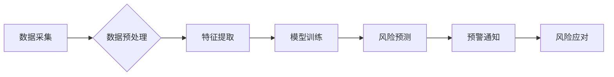

                 

## AI大模型在电商平台供应链风险预警中的应用

> 关键词：供应链风险预警、AI大模型、自然语言处理、机器学习、深度学习、预测分析、电商平台

## 1. 背景介绍

随着全球经济一体化和供应链的日益复杂化，电商平台供应链面临着越来越多的风险，例如自然灾害、政治动荡、疫情爆发、物流延误、供应商违约等。这些风险不仅会影响电商平台的运营效率，还会损害用户体验和品牌形象。因此，如何有效识别和预警供应链风险，成为电商平台亟需解决的关键问题。

传统供应链风险管理方法主要依赖于经验和规则，难以应对复杂多变的风险环境。随着人工智能技术的快速发展，AI大模型在供应链风险预警领域展现出巨大的潜力。AI大模型能够通过学习海量数据，识别潜在的风险模式，并提供精准的预警信息，帮助电商平台提前采取措施，降低风险损失。

## 2. 核心概念与联系

### 2.1 供应链风险

供应链风险是指在商品从原材料采购到最终用户交付的全流程中，可能出现的各种风险事件，这些事件会对供应链的正常运行造成负面影响。供应链风险可以分为以下几类：

* **自然灾害风险:** 地震、洪水、火灾等自然灾害可能导致生产中断、物流受阻、仓储设施损坏等。
* **政治风险:** 政治动荡、战争、贸易摩擦等政治事件可能导致供应链中断、运输成本增加、政策变化等。
* **经济风险:** 经济衰退、通货膨胀、汇率波动等经济因素可能导致需求下降、成本上升、利润减少等。
* **运营风险:** 供应商违约、物流延误、库存积压等运营问题可能导致产品缺货、交货延迟、资金周转困难等。

### 2.2 AI大模型

AI大模型是指在海量数据上训练的深度学习模型，具有强大的学习和推理能力。常见的AI大模型类型包括：

* **自然语言处理模型:** 例如BERT、GPT-3等，能够理解和生成人类语言，用于文本分类、情感分析、机器翻译等任务。
* **计算机视觉模型:** 例如ResNet、YOLO等，能够识别和理解图像和视频，用于图像分类、目标检测、图像识别等任务。
* **推荐系统模型:** 例如Collaborative Filtering、Content-Based Filtering等，能够根据用户的历史行为和偏好，推荐相关的商品或服务。

### 2.3 供应链风险预警系统架构

AI大模型在电商平台供应链风险预警系统中的应用，通常采用以下架构：



**数据采集:** 从电商平台的各个环节收集相关数据，例如订单信息、物流信息、供应商信息、市场信息等。

**数据预处理:** 对收集到的数据进行清洗、转换、整合等处理，使其符合模型训练的要求。

**特征提取:** 从预处理后的数据中提取关键特征，例如供应商信用等级、物流运输时间、市场价格波动等。

**模型训练:** 使用AI大模型对提取的特征进行训练，建立风险预测模型。

**风险预测:** 将新的数据输入到训练好的模型中，预测未来可能出现的风险事件。

**预警通知:** 当模型预测到风险事件时，及时向相关人员发送预警通知。

**风险应对:** 根据预警信息，采取相应的措施，例如调整采购计划、优化物流路线、加强供应商管理等，降低风险损失。

## 3. 核心算法原理 & 具体操作步骤

### 3.1 算法原理概述

AI大模型在供应链风险预警中的应用，主要采用以下几种算法：

* **机器学习算法:** 例如逻辑回归、支持向量机、决策树等，能够从历史数据中学习风险模式，并进行预测。
* **深度学习算法:** 例如卷积神经网络、循环神经网络等，能够处理复杂的数据特征，并进行更精准的预测。
* **强化学习算法:** 例如Q学习、SARSA等，能够学习最优的风险应对策略。

### 3.2 算法步骤详解

以机器学习算法为例，其具体操作步骤如下：

1. **数据收集:** 从电商平台的各个环节收集相关数据，例如订单信息、物流信息、供应商信息、市场信息等。
2. **数据预处理:** 对收集到的数据进行清洗、转换、整合等处理，使其符合模型训练的要求。
3. **特征工程:** 从预处理后的数据中提取关键特征，例如供应商信用等级、物流运输时间、市场价格波动等。
4. **模型选择:** 根据实际需求选择合适的机器学习算法，例如逻辑回归、支持向量机、决策树等。
5. **模型训练:** 使用训练数据对模型进行训练，调整模型参数，使其能够准确预测风险事件。
6. **模型评估:** 使用测试数据对模型进行评估，评估模型的预测精度、召回率、F1-score等指标。
7. **模型部署:** 将训练好的模型部署到生产环境中，用于实时预测风险事件。
8. **风险预警:** 当模型预测到风险事件时，及时向相关人员发送预警通知。

### 3.3 算法优缺点

**优点:**

* **精准预测:** AI大模型能够学习复杂的风险模式，并进行更精准的预测。
* **自动化处理:** AI大模型能够自动识别和预警风险事件，减轻人工负担。
* **实时监控:** AI大模型能够实时监控供应链数据，及时发现潜在风险。

**缺点:**

* **数据依赖:** AI大模型的性能依赖于训练数据的质量和数量。
* **解释性差:** 一些AI大模型的决策过程难以解释，难以获得用户的信任。
* **成本高昂:** 训练和部署AI大模型需要大量的计算资源和专业人才。

### 3.4 算法应用领域

AI大模型在供应链风险预警领域的应用，不仅限于电商平台，还可应用于以下领域：

* **制造业:** 预警原材料短缺、生产设备故障、物流延误等风险。
* **金融业:** 预警信用风险、欺诈风险、市场风险等。
* **医疗保健业:** 预警药品短缺、医疗设备故障、疫情爆发等风险。

## 4. 数学模型和公式 & 详细讲解 & 举例说明

### 4.1 数学模型构建

在供应链风险预警中，常用的数学模型包括：

* **贝叶斯网络:** 用于表示随机变量之间的依赖关系，并进行概率计算。
* **马尔可夫链:** 用于描述系统在不同状态之间的转移概率。
* **时间序列模型:** 用于预测未来时间段的风险值。

### 4.2 公式推导过程

以贝叶斯网络为例，其核心公式为：

$$P(A|B) = \frac{P(B|A)P(A)}{P(B)}$$

其中：

* $P(A|B)$ 表示在已知事件B发生的情况下，事件A发生的概率。
* $P(B|A)$ 表示在已知事件A发生的情况下，事件B发生的概率。
* $P(A)$ 表示事件A发生的概率。
* $P(B)$ 表示事件B发生的概率。

### 4.3 案例分析与讲解

假设电商平台需要预警供应商违约风险。可以构建一个贝叶斯网络，其中节点包括：

* **供应商信用等级:** 
* **物流运输时间:** 
* **市场价格波动:** 
* **供应商违约:**

通过收集历史数据，可以估计各个节点的概率分布和条件概率。例如，可以估计高信用等级供应商违约的概率为1%，低信用等级供应商违约的概率为10%。

当平台收到新的供应商信息时，可以将这些信息输入到贝叶斯网络中，计算供应商违约的概率。如果概率超过预设阈值，则发出预警通知。

## 5. 项目实践：代码实例和详细解释说明

### 5.1 开发环境搭建

* **操作系统:** Ubuntu 20.04 LTS
* **编程语言:** Python 3.8
* **深度学习框架:** TensorFlow 2.0
* **数据处理库:** Pandas, NumPy
* **可视化库:** Matplotlib, Seaborn

### 5.2 源代码详细实现

```python
import pandas as pd
from sklearn.model_selection import train_test_split
from tensorflow.keras.models import Sequential
from tensorflow.keras.layers import Dense

# 加载数据
data = pd.read_csv('supply_chain_risk_data.csv')

# 数据预处理
# ...

# 特征工程
# ...

# 将数据分割为训练集和测试集
X_train, X_test, y_train, y_test = train_test_split(X, y, test_size=0.2, random_state=42)

# 创建模型
model = Sequential()
model.add(Dense(64, activation='relu', input_shape=(X_train.shape[1],)))
model.add(Dense(32, activation='relu'))
model.add(Dense(1, activation='sigmoid'))

# 编译模型
model.compile(loss='binary_crossentropy', optimizer='adam', metrics=['accuracy'])

# 训练模型
model.fit(X_train, y_train, epochs=10, batch_size=32)

# 评估模型
loss, accuracy = model.evaluate(X_test, y_test)
print('Loss:', loss)
print('Accuracy:', accuracy)

# 保存模型
model.save('supply_chain_risk_model.h5')
```

### 5.3 代码解读与分析

* **数据加载和预处理:** 使用Pandas库加载数据，并进行清洗、转换、整合等处理。
* **特征工程:** 从预处理后的数据中提取关键特征，例如供应商信用等级、物流运输时间、市场价格波动等。
* **数据分割:** 将数据分割为训练集和测试集，用于模型训练和评估。
* **模型创建:** 使用TensorFlow框架创建深度学习模型，包括输入层、隐藏层和输出层。
* **模型编译:** 使用损失函数、优化器和评价指标编译模型。
* **模型训练:** 使用训练数据训练模型，调整模型参数。
* **模型评估:** 使用测试数据评估模型的性能，例如损失值和准确率。
* **模型保存:** 将训练好的模型保存为文件，以便后续使用。

### 5.4 运行结果展示

训练完成后，可以将模型应用于新的数据，预测风险事件的概率。例如，当平台收到新的供应商信息时，可以将这些信息输入到模型中，计算供应商违约的概率。如果概率超过预设阈值，则发出预警通知。

## 6. 实际应用场景

### 6.1 供应链风险识别

AI大模型可以识别各种供应链风险，例如供应商违约、物流延误、原材料短缺等。通过分析历史数据和实时数据，模型可以识别潜在的风险模式，并发出预警通知。

### 6.2 风险评估与分级

AI大模型可以对不同的风险事件进行评估和分级，帮助电商平台制定相应的应对措施。例如，高风险事件需要采取更积极的措施，而低风险事件可以采取更保守的措施。

### 6.3 风险应对策略优化

AI大模型可以帮助电商平台优化风险应对策略，例如调整采购计划、优化物流路线、加强供应商管理等。通过模拟不同的应对策略，模型可以帮助平台选择最优的策略，降低风险损失。

### 6.4 未来应用展望

随着人工智能技术的不断发展，AI大模型在电商平台供应链风险预警领域的应用将更加广泛和深入。例如：

* **更精准的风险预测:** 利用更先进的算法和更丰富的训练数据，模型可以更加精准地预测风险事件。
* **更全面的风险覆盖:** 模型可以覆盖更广泛的风险类型，例如网络安全风险、数据隐私风险等。
* **更智能的风险应对:** 模型可以根据实际情况自动调整风险应对策略，提高应对效率。

## 7. 工具和资源推荐

### 7.1 学习资源推荐

* **书籍:**
    * 《深度学习》 by Ian Goodfellow, Yoshua Bengio, Aaron Courville
    * 《机器学习》 by Tom Mitchell
* **在线课程:**
    * Coursera: Machine Learning by Andrew Ng
    * Udacity: Deep Learning Nanodegree
* **博客和网站:**
    * Towards Data Science
    * Machine Learning Mastery

### 7.2 开发工具推荐

* **深度学习框架:** TensorFlow, PyTorch, Keras
* **数据处理库:** Pandas, NumPy
* **可视化库:** Matplotlib, Seaborn
* **云计算平台:** AWS, Azure, Google Cloud

### 7.3 相关论文推荐

* **BERT:** Devlin, J., Chang, M. W., Lee, K., & Toutanova, K. (2018). BERT: Pre-training of deep bidirectional transformers for language understanding. arXiv preprint arXiv:1810.04805.
* **GPT-3:** Brown, T. B., Mann, B., Ryder, N., Subbiah, M., Kaplan, J., Dhariwal, P., ... & Amodei, D. (2020). Language models are few-shot learners. arXiv preprint arXiv:2005.14165.
* **ResNet:** He, K., Zhang, X., Ren, S., & Sun, J. (2016). Deep residual learning for image recognition. In Proceedings of the IEEE conference on computer vision and pattern recognition (pp. 770-778).

## 8. 总结：未来发展趋势与挑战

### 8.1 研究成果总结

AI大模型在电商平台供应链风险预警领域的应用取得了显著成果，能够提高风险识别、评估和应对的效率。

### 8.2 未来发展趋势

* **模型精度提升:** 利用更先进的算法和更丰富的训练数据，模型的预测精度将进一步提升。
* **风险类型扩展:** 模型将能够覆盖更广泛的风险类型，例如网络安全风险、数据隐私风险等。
* **智能化程度增强:** 模型将能够根据实际情况自动调整风险应对策略，提高应对效率。

### 8.3 面临的挑战

* **数据质量问题:** AI大模型的性能依赖于训练数据的质量和数量，数据质量问题将影响模型的准确性。
* **解释性问题:** 一些AI大模型的决策过程难以解释，难以获得用户的信任。
* **计算资源需求:** 训练和部署AI大模型需要大量的计算资源，成本较高。

### 8.4 研究展望

未来，AI大模型在电商平台供应链风险预警领域的应用将更加广泛和深入，为电商平台提供更精准、更智能、更全面的风险管理解决方案。


## 9. 附录：常见问题与解答

**Q1: AI大模型的训练数据需要多么丰富才能达到较好的效果？**

**A1:** 训练数据的丰富程度与模型的复杂度和任务的难度有关。一般来说，模型越复杂，任务越难，所需的训练数据越多。

**Q2: 如何解决AI大模型的解释性问题？**

**A2:** 

* 使用可解释性AI模型，例如线性回归、决策树等。
* 使用模型解释技术，例如SHAP值、LIME等，解释模型的决策过程。
* 与用户进行沟通，解释模型的原理和局限性。

**Q3: AI大模型的部署成本很高吗？**

**A3:** AI大模型的部署成本取决于模型的复杂度、数据量和部署环境。可以使用云计算平台降低部署成本。


作者：禅与计算机程序设计艺术 / Zen and the Art of Computer Programming<end_of_turn>

