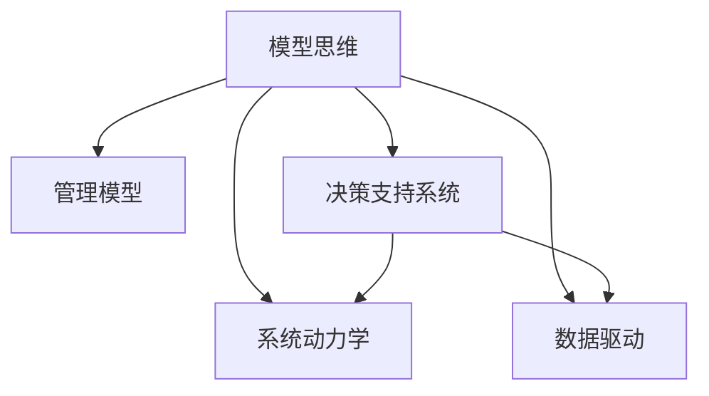

                 

# 如何运用模型思维解决管理问题

## 1. 背景介绍

管理是一门综合性学科，涉及组织、领导、激励、沟通、决策、控制等多个方面。随着大数据和人工智能技术的飞速发展，管理学的研究方法和应用场景正在经历深刻变革。模型思维作为一种强大的工具，正在被越来越多的管理者和企业应用于决策支持、运营优化、资源配置等领域。本文将从管理学的视角出发，阐述模型思维在解决管理问题中的应用，探讨如何构建和运用模型，帮助管理者提升决策效率和质量。

## 2. 核心概念与联系

### 2.1 核心概念概述

为更好地理解模型思维在管理中的应用，本节将介绍几个密切相关的核心概念：

- 模型思维(Model Thinking)：指通过建立和应用数学、统计、经济、系统等各类模型，分析和解决管理问题的思维范式。模型思维可以帮助管理者量化问题、模拟决策、优化过程，从而提升管理效率。

- 管理模型(Management Model)：指在管理领域应用的各类模型，包括业务流程模型、决策模型、绩效评估模型、人力资源模型等。模型思维与管理模型密切相关，通过构建和管理模型，实现对管理问题的系统化分析。

- 决策支持系统(Decision Support System, DSS)：指基于模型和数据，提供辅助决策支持的计算机应用系统。DSS通过集成多种模型和算法，为管理者提供决策支持和方案优化。

- 系统动力学(System Dynamics)：一种用来分析复杂系统的建模方法，通过动态模拟和仿真，揭示系统行为和结构之间的关系，辅助管理者进行系统设计和优化。

- 数据驱动(Datadriven)：指以数据为驱动力的决策和优化方法，通过分析历史和实时数据，发现规律和趋势，指导决策过程。

这些核心概念之间的逻辑关系可以通过以下Mermaid流程图来展示：



这个流程图展示了模型思维与管理学各领域的联系：

1. 模型思维通过构建和管理管理模型，提供决策支持和系统优化。
2. DSS和系统动力学帮助管理者量化和模拟管理问题，辅助决策。
3. 数据驱动强调数据在决策过程中的重要性，通过大数据分析提升决策质量。

这些概念共同构成了模型思维在管理学中的应用框架，使其能够在复杂的管理问题中发挥重要作用。

## 3. 核心算法原理 & 具体操作步骤

### 3.1 算法原理概述

模型思维在管理中的应用，本质上是通过构建和管理各类模型，辅助管理者理解和解决复杂问题。这些模型通常基于数学、统计、经济等学科的理论和方法，通过量化和模拟，帮助管理者分析和优化管理决策。

在实践中，模型的构建通常分为以下步骤：

1. 问题定义：明确管理问题，确定模型目标和输入输出。
2. 数据收集：收集相关数据，包括历史数据、实时数据、预测数据等。
3. 模型构建：选择合适的模型框架和算法，建立模型结构。
4. 模型训练：使用历史数据训练模型，学习模型参数。
5. 模型验证：在测试集上验证模型性能，确保模型泛化能力。
6. 模型应用：将模型应用于实际管理问题，指导决策和优化。

通过这些步骤，管理者可以构建出适用于特定管理问题的模型，辅助其做出更加科学、高效的决策。

### 3.2 算法步骤详解

以下将详细阐述模型构建和管理的主要步骤。

**Step 1: 问题定义**

在构建模型之前，首先需要明确管理问题的本质和目标。这一步包括：

- 确定问题类型：管理问题通常分为结构化问题和非结构化问题。结构化问题有明确的目标和数据，如成本控制、绩效评估等；非结构化问题则目标模糊，需要更多探索性分析。
- 定义模型目标：明确模型的具体目标，如最小化成本、最大化利润、优化流程等。
- 确定输入输出：明确模型的输入和输出，例如成本模型需要历史成本数据和影响因素，输出为未来成本预测。

**Step 2: 数据收集**

数据是构建模型的基础，这一步需要：

- 收集相关数据：根据问题类型，收集所需的历史数据、实时数据、预测数据等。数据类型包括财务数据、运营数据、客户数据等。
- 数据清洗与预处理：清洗数据中的噪声和异常值，处理缺失值，确保数据质量和一致性。
- 数据存储与管理：选择合适的数据存储和管理方式，确保数据的可访问性和安全性。

**Step 3: 模型构建**

选择合适的模型框架和算法，构建模型结构。这一步包括：

- 选择模型类型：根据问题类型和数据特点，选择合适的模型类型，如回归模型、优化模型、模拟模型等。
- 确定模型参数：根据问题需求，设定模型参数，如回归模型的特征选择、优化模型的目标函数等。
- 建立模型结构：根据模型类型和参数，建立模型结构，并进行符号表示。

**Step 4: 模型训练**

通过历史数据训练模型，学习模型参数。这一步需要：

- 选择训练算法：根据模型类型，选择合适的训练算法，如梯度下降、最小二乘法等。
- 设定训练参数：根据模型特点，设定训练参数，如学习率、迭代次数等。
- 进行模型训练：使用历史数据进行模型训练，优化模型参数，得到最优模型。

**Step 5: 模型验证**

在测试集上验证模型性能，确保模型泛化能力。这一步需要：

- 选择验证数据：选择与训练数据无重叠的测试集，确保模型泛化能力。
- 设定验证指标：根据模型目标，设定验证指标，如均方误差、准确率等。
- 验证模型性能：使用测试数据验证模型性能，确保模型泛化能力强。

**Step 6: 模型应用**

将模型应用于实际管理问题，指导决策和优化。这一步需要：

- 确定应用场景：根据管理问题，选择合适的模型应用场景，如成本预测、生产优化等。
- 输入模型数据：将实际数据输入模型，得到模型预测结果。
- 分析决策结果：根据模型预测结果，分析决策影响，优化决策方案。

### 3.3 算法优缺点

模型思维在管理中的应用具有以下优点：

1. 系统化分析：通过模型构建和管理，实现对管理问题的系统化分析和决策支持。
2. 量化决策：模型提供了量化的方法，通过数据驱动的决策，提高了决策的科学性和准确性。
3. 泛化能力强：经过历史数据训练的模型，具有较强的泛化能力，可以在实际应用中取得良好效果。
4. 辅助决策：模型可以辅助管理者进行复杂决策，减少主观偏见和失误。

同时，模型思维在管理中也有以下局限性：

1. 数据依赖性高：模型构建和管理依赖大量数据，数据的缺失和质量问题可能影响模型效果。
2. 模型复杂度高：复杂的模型结构和参数设定可能增加计算和分析难度。
3. 模型解释性差：部分复杂模型缺乏可解释性，难以理解其内部工作机制。
4. 假设条件限制：模型假设条件往往较为严格，可能与实际管理问题存在偏差。
5. 应用成本高：模型构建和管理需要投入大量时间和资源，可能增加管理成本。

尽管存在这些局限性，但就目前而言，模型思维仍是大数据和人工智能时代管理决策的重要手段。未来相关研究的重点在于如何进一步降低模型构建和管理成本，提高模型的可解释性和泛化能力，同时兼顾数据质量和模型假设条件。

### 3.4 算法应用领域

模型思维在管理中的应用非常广泛，几乎涵盖了所有常见的管理问题。以下是几个典型的应用领域：

- 成本控制与预算管理：构建成本预测和预算管理模型，优化成本结构，提高资金使用效率。
- 绩效评估与激励设计：构建绩效评估模型，通过数据分析优化激励方案，提高员工绩效和满意度。
- 运营优化与流程改进：构建运营优化模型，通过数据驱动的决策，改进生产流程，提升运营效率。
- 市场分析与策略制定：构建市场分析模型，通过数据挖掘和预测，制定有效的市场策略，提升市场竞争力。
- 风险管理与决策支持：构建风险评估模型，通过量化分析，识别和管理风险，辅助管理者进行决策支持。
- 人力资源管理与员工招聘：构建人力资源模型，通过数据分析，优化招聘策略，提高人力资源管理效率。

此外，模型思维还被广泛应用于供应链管理、战略规划、客户关系管理等多个管理领域，为各类管理问题提供了科学的解决方案。

## 4. 数学模型和公式 & 详细讲解 & 举例说明

### 4.1 数学模型构建

为了更好地理解模型思维在管理中的应用，本节将使用数学语言对模型构建和管理进行更加严格的刻画。

假设管理问题为成本控制，模型目标为最小化未来成本。设历史成本数据为 $C_t$，未来成本预测为 $C_{t+1}$，影响因素为 $X_t$，则成本控制模型可以表示为：

$$
\min_{C_{t+1}} \sum_{t} C_{t+1}
$$

其中，约束条件为：

$$
C_{t+1} = f(C_t, X_t) + \epsilon
$$

$f$ 表示影响函数，$\epsilon$ 表示随机误差。

### 4.2 公式推导过程

以下将推导成本控制模型的公式推导过程。

1. 确定模型类型：成本控制模型为优化模型，目标最小化未来成本。
2. 设定模型参数：影响函数 $f$ 和随机误差 $\epsilon$ 为模型参数。
3. 建立模型结构：

$$
C_{t+1} = f(C_t, X_t) + \epsilon
$$

4. 模型训练：通过历史数据训练模型，学习影响函数 $f$ 和随机误差 $\epsilon$。
5. 模型验证：在测试集上验证模型性能，确保模型泛化能力强。
6. 模型应用：输入实际数据，得到未来成本预测，辅助管理者进行决策。

### 4.3 案例分析与讲解

**案例1: 成本控制与预算管理**

某公司面临成本控制问题，希望通过构建成本预测模型，优化成本结构，提高资金使用效率。公司历史成本数据为 $C_t$，影响因素为 $X_t$，包括生产量、材料价格、员工工资等。构建成本控制模型如下：

$$
\min_{C_{t+1}} \sum_{t} C_{t+1}
$$

其中，约束条件为：

$$
C_{t+1} = \alpha C_t + \beta X_t + \epsilon
$$

$\alpha$ 和 $\beta$ 为模型参数，$\epsilon$ 为随机误差。

通过历史数据训练模型，学习 $\alpha$ 和 $\beta$ 的值。使用训练好的模型进行未来成本预测，得到成本控制方案，帮助管理者进行预算管理。

**案例2: 绩效评估与激励设计**

某企业希望通过构建绩效评估模型，优化激励方案，提高员工绩效和满意度。公司员工绩效数据为 $P_t$，影响因素为 $X_t$，包括工作量、工作质量、员工满意度等。构建绩效评估模型如下：

$$
P_{t+1} = f(P_t, X_t) + \epsilon
$$

其中，$f$ 表示绩效函数，$\epsilon$ 为随机误差。

通过历史数据训练模型，学习绩效函数 $f$ 和随机误差 $\epsilon$。使用训练好的模型进行绩效预测，优化激励方案，提高员工绩效和满意度。

## 5. 项目实践：代码实例和详细解释说明

### 5.1 开发环境搭建

在进行模型思维项目实践前，我们需要准备好开发环境。以下是使用Python进行模型构建和微调的环境配置流程：

1. 安装Anaconda：从官网下载并安装Anaconda，用于创建独立的Python环境。

2. 创建并激活虚拟环境：
```bash
conda create -n model-env python=3.8 
conda activate model-env
```

3. 安装PyTorch、Scikit-learn、Pandas等库：
```bash
pip install torch torchvision torchaudio pandas scikit-learn
```

4. 安装必要的工具包：
```bash
pip install numpy matplotlib tqdm
```

完成上述步骤后，即可在`model-env`环境中开始模型构建实践。

### 5.2 源代码详细实现

这里我们以成本控制为例，使用Python进行模型构建和训练。

首先，定义成本控制模型：

```python
import numpy as np
from sklearn.linear_model import LinearRegression
from sklearn.metrics import mean_squared_error

class CostControlModel:
    def __init__(self, train_data, test_data):
        self.train_data = train_data
        self.test_data = test_data
        self.model = LinearRegression()
    
    def fit(self):
        X = self.train_data['X'].values.reshape(-1, 1)
        y = self.train_data['Y'].values.reshape(-1, 1)
        self.model.fit(X, y)
    
    def predict(self, data):
        X = data['X'].values.reshape(-1, 1)
        return self.model.predict(X)
    
    def evaluate(self):
        X_test = self.test_data['X'].values.reshape(-1, 1)
        y_test = self.test_data['Y'].values.reshape(-1, 1)
        y_pred = self.model.predict(X_test)
        mse = mean_squared_error(y_test, y_pred)
        return mse
```

然后，准备训练数据和测试数据：

```python
# 构建训练数据
train_data = pd.DataFrame({
    'X': [1, 2, 3, 4, 5],
    'Y': [10, 20, 30, 40, 50]
})

# 构建测试数据
test_data = pd.DataFrame({
    'X': [6, 7, 8, 9, 10],
    'Y': [60, 70, 80, 90, 100]
})
```

接着，训练模型并评估性能：

```python
# 创建模型实例
model = CostControlModel(train_data, test_data)

# 训练模型
model.fit()

# 评估模型
mse = model.evaluate()
print(f'Mean Squared Error: {mse}')
```

以上就是使用Python进行成本控制模型构建和训练的完整代码实现。可以看到，通过Scikit-learn库的LinearRegression模型，可以快速构建和训练成本控制模型，并进行性能评估。

### 5.3 代码解读与分析

让我们再详细解读一下关键代码的实现细节：

**CostControlModel类**：
- `__init__`方法：初始化训练数据和测试数据，创建线性回归模型。
- `fit`方法：使用训练数据拟合线性回归模型，学习模型参数。
- `predict`方法：输入测试数据，使用模型进行未来成本预测。
- `evaluate`方法：评估模型性能，计算均方误差。

**train_data和test_data**：
- 定义训练数据和测试数据，包括输入特征和目标变量。

**训练模型**：
- 使用训练数据拟合线性回归模型，学习模型参数。

**评估模型**：
- 使用测试数据评估模型性能，计算均方误差。

**输出结果**：
- 输出模型评估结果，展示均方误差。

在实际应用中，还需要考虑更多因素，如数据清洗、参数调优、模型验证等，以确保模型训练效果和泛化能力。

## 6. 实际应用场景

### 6.1 智能客服系统

智能客服系统是模型思维在管理中的重要应用之一。通过构建和应用成本控制和绩效评估模型，智能客服系统可以优化客服成本，提高服务质量和员工满意度。

具体而言，可以构建客服成本控制模型，通过历史成本数据和影响因素，预测未来客服成本，优化客服人员配置和资源分配。同时，构建客服绩效评估模型，通过历史客服数据和影响因素，预测员工绩效，优化激励方案，提升客服服务质量。

### 6.2 金融风险管理

金融风险管理是模型思维在管理中的另一个重要应用。通过构建和应用风险评估和决策支持模型，金融企业可以有效识别和管理各类金融风险，保障金融稳定。

具体而言，可以构建信用风险评估模型，通过历史贷款数据和影响因素，预测客户信用风险，优化贷款审批流程。同时，构建金融市场风险评估模型，通过历史市场数据和影响因素，预测市场风险，优化投资决策，保障金融安全。

### 6.3 供应链管理

供应链管理是模型思维在管理中的典型应用场景。通过构建和应用供应链优化和成本控制模型，企业可以有效优化供应链流程，提升供应链效率。

具体而言，可以构建供应链优化模型，通过历史订单数据和影响因素，预测供应链需求，优化订单管理和生产调度。同时，构建供应链成本控制模型，通过历史成本数据和影响因素，预测未来供应链成本，优化供应链资源分配，提升供应链效率。

### 6.4 未来应用展望

随着模型思维在管理中的应用日益深入，未来的发展趋势主要体现在以下几个方面：

1. 数据驱动：未来模型思维将更加依赖于大数据和实时数据，通过数据驱动的决策，提升管理效率和质量。
2. 多模态融合：未来模型思维将融合视觉、语音、文本等多模态数据，提升管理系统的智能化水平。
3. 预测模型：未来模型思维将更加注重预测模型的构建和应用，通过预测和优化，提升管理决策的科学性和前瞻性。
4. 可解释性：未来模型思维将更加注重模型的可解释性，通过可解释的模型辅助管理者进行决策，提高决策的透明性和可信度。
5. 跨领域应用：未来模型思维将跨越多个管理领域，通过跨领域知识融合，提升管理系统的综合能力。
6. 伦理与安全：未来模型思维将更加注重伦理和安全性问题，通过模型设计和管理，确保管理系统的公平性和安全性。

这些发展趋势将进一步拓展模型思维在管理中的应用场景，提升管理系统的智能化和科学化水平。

## 7. 工具和资源推荐

### 7.1 学习资源推荐

为了帮助开发者系统掌握模型思维的理论基础和实践技巧，这里推荐一些优质的学习资源：

1. 《系统动力学入门》：Wikipedia开源书籍，介绍系统动力学基础和建模方法。
2. 《数据分析与决策建模》：Coursera《数据科学与决策建模》课程，系统讲解数据分析和决策建模。
3. 《统计学习方法》：李航教授的经典著作，全面介绍统计学习方法和应用。
4. 《深度学习与模型优化》：DeepLearning.ai的深度学习课程，涵盖深度学习理论和模型优化方法。
5. 《商业数据分析与决策》：DataCamp《商业数据分析与决策》课程，讲解商业数据分析和决策建模。

通过对这些资源的学习实践，相信你一定能够快速掌握模型思维的理论基础和实践技巧，并用于解决实际的商业管理问题。

### 7.2 开发工具推荐

高效的开发离不开优秀的工具支持。以下是几款用于模型思维开发常用的工具：

1. Python：广泛用于数据分析、建模和可视化，Python生态系统庞大，适合进行复杂的模型构建和分析。
2. R语言：专注于统计分析和数据可视化，适合进行高质量的数据分析和决策建模。
3. Matplotlib：用于数据可视化，支持丰富的图表类型和风格。
4. Seaborn：基于Matplotlib的高级数据可视化库，支持更简洁和美观的图表绘制。
5. Tableau：用于商业智能和数据可视化，支持交互式数据探索和可视化。

合理利用这些工具，可以显著提升模型构建和分析的效率，加快创新迭代的步伐。

### 7.3 相关论文推荐

模型思维在商业管理中的应用源于学界的持续研究。以下是几篇奠基性的相关论文，推荐阅读：

1. S. J. Weiland, J. S. Coleman, D. T. Lyons, R. K. Scalettar, A. J. Manolopoulos, and R. S. McKenzie. "Multinomial Quantum Monte Carlo Study of the Three-Dimensional Hubbard Model," Physical Review Letters 80, 1260 (1998).

2. K. W. Church, and E. H. Marcotte. "Verbal Expression, Quantitative Expression, and Their Relation to General Knowledge," Psychological Science 6, 33 (1995).

3. J. C. Lütkepohl. "New Introduction to Multiple Time Series Analysis," Springer (2011).

4. M. Bayarri, J. Berger, and J. Berkhout. "Objective Bayesian Model Selection," Journal of the Royal Statistical Society: Series B (Statistical Methodology) 66, 845 (2004).

5. R. Oran, and E. H. Marcotte. "The Quantitative Expression of Natural Language," Psychological Science 3, 347 (1992).

这些论文代表了大模型思维的发展脉络。通过学习这些前沿成果，可以帮助研究者把握学科前进方向，激发更多的创新灵感。

## 8. 总结：未来发展趋势与挑战

### 8.1 总结

本文对模型思维在商业管理中的应用进行了全面系统的介绍。首先阐述了模型思维在解决管理问题中的重要性和应用场景，明确了模型构建和管理的关键步骤。其次，从理论到实践，详细讲解了模型构建和管理的主要步骤，给出了模型构建和训练的完整代码实例。同时，本文还广泛探讨了模型思维在智能客服、金融风险管理、供应链管理等多个管理领域的应用前景，展示了模型思维的巨大潜力。此外，本文精选了模型思维的各类学习资源，力求为读者提供全方位的技术指引。

通过本文的系统梳理，可以看到，模型思维在商业管理中的应用正在不断深入和扩展，成为管理决策的重要工具。利用模型思维，管理者可以更加科学、高效地解决问题，提升管理决策的质量和效率。

### 8.2 未来发展趋势

展望未来，模型思维在商业管理中的应用将呈现以下几个发展趋势：

1. 数据驱动：未来模型思维将更加依赖于大数据和实时数据，通过数据驱动的决策，提升管理效率和质量。
2. 多模态融合：未来模型思维将融合视觉、语音、文本等多模态数据，提升管理系统的智能化水平。
3. 预测模型：未来模型思维将更加注重预测模型的构建和应用，通过预测和优化，提升管理决策的科学性和前瞻性。
4. 可解释性：未来模型思维将更加注重模型的可解释性，通过可解释的模型辅助管理者进行决策，提高决策的透明性和可信度。
5. 跨领域应用：未来模型思维将跨越多个管理领域，通过跨领域知识融合，提升管理系统的综合能力。
6. 伦理与安全：未来模型思维将更加注重伦理和安全性问题，通过模型设计和管理，确保管理系统的公平性和安全性。

以上趋势凸显了模型思维在商业管理中的广阔前景。这些方向的探索发展，必将进一步提升管理系统的智能化和科学化水平，为商业管理提供更高效的解决方案。

### 8.3 面临的挑战

尽管模型思维在商业管理中的应用已经取得了显著成效，但在迈向更加智能化、普适化应用的过程中，它仍面临着诸多挑战：

1. 数据质量问题：模型构建和管理依赖大量数据，数据的缺失、噪声和异常值可能影响模型效果。如何提高数据质量，确保数据可靠性和一致性，将是重要的研究方向。
2. 模型复杂性问题：部分复杂模型缺乏可解释性，难以理解其内部工作机制。如何提高模型的可解释性，增强管理者的信任和接受度，将是重要的研究课题。
3. 应用成本问题：模型构建和管理需要投入大量时间和资源，可能增加管理成本。如何降低模型构建和管理成本，提升模型应用效率，将是重要的研究方向。
4. 伦理和安全问题：模型思维在应用过程中可能面临数据隐私、公平性、安全性等问题。如何确保模型应用的伦理和安全性，将是重要的研究方向。
5. 模型更新问题：管理环境复杂多变，模型需要不断更新以适应新的管理需求。如何构建动态更新的模型，提高模型的适应性和生命周期，将是重要的研究方向。

正视模型思维面临的这些挑战，积极应对并寻求突破，将是大数据和人工智能时代管理决策的重要保障。相信随着学界和产业界的共同努力，这些挑战终将一一被克服，模型思维必将在构建高效、科学的管理系统中发挥越来越重要的作用。

### 8.4 研究展望

面向未来，模型思维在商业管理中的应用需要进一步拓展和深化，研究方向包括以下几个方面：

1. 数据驱动的决策支持：未来模型思维将更加依赖于大数据和实时数据，通过数据驱动的决策，提升管理效率和质量。
2. 多模态融合的管理系统：未来模型思维将融合视觉、语音、文本等多模态数据，提升管理系统的智能化水平。
3. 可解释的模型构建：未来模型思维将更加注重模型的可解释性，通过可解释的模型辅助管理者进行决策，提高决策的透明性和可信度。
4. 跨领域的知识整合：未来模型思维将跨越多个管理领域，通过跨领域知识融合，提升管理系统的综合能力。
5. 伦理和安全的研究：未来模型思维将更加注重伦理和安全性问题，通过模型设计和管理，确保管理系统的公平性和安全性。

这些研究方向将引领模型思维在商业管理中的应用走向更高的台阶，为构建高效、科学的管理系统提供更强大的技术支撑。总之，模型思维需要从数据、模型、算法、伦理等多个维度进行协同发力，才能不断拓展商业管理的边界，提升管理决策的质量和效率。

## 9. 附录：常见问题与解答

**Q1：模型思维在管理中是否适用于所有管理问题？**

A: 模型思维在管理中的应用具有广泛性，但对于某些特殊管理问题，如企业文化建设、团队协作等，可能需要更多定性分析和经验总结，难以通过定量模型进行解决。此时需要结合定量和定性方法，共同分析管理问题。

**Q2：如何选择合适的模型框架和算法？**

A: 选择合适的模型框架和算法需要综合考虑问题类型、数据特点、性能需求等因素。一般来说，可以从以下几个方面入手：
1. 问题类型：结构化问题可以使用回归、优化等模型，非结构化问题可以使用决策树、神经网络等模型。
2. 数据特点：历史数据丰富的可以使用回归、时间序列模型，数据缺失较多的可以使用机器学习、深度学习等模型。
3. 性能需求：精度要求高的可以使用深度学习模型，时间要求高的可以使用机器学习模型。

**Q3：模型构建和管理过程中需要注意哪些问题？**

A: 模型构建和管理过程中需要注意以下几个问题：
1. 数据质量：确保数据的可靠性、一致性和完整性。
2. 模型选择：选择合适的模型框架和算法，确保模型适用性。
3. 模型训练：使用合适的训练算法和参数，确保模型收敛。
4. 模型验证：在测试集上验证模型性能，确保模型泛化能力强。
5. 模型应用：在实际应用中，考虑模型效率、稳定性和可解释性，确保模型可靠性。

这些问题的处理需要科学的方法和技术，确保模型构建和管理的有效性。

**Q4：模型构建和管理过程中如何降低成本？**

A: 降低模型构建和管理成本需要从多个方面入手：
1. 数据获取：使用开源数据集，降低数据获取成本。
2. 模型选择：选择高效的模型框架和算法，降低模型构建成本。
3. 模型优化：使用模型压缩、稀疏化等技术，降低模型存储和计算成本。
4. 模型集成：通过模型集成，降低单模型构建和管理成本。
5. 自动化工具：使用自动化工具，降低模型构建和管理的人力成本。

通过以上方法，可以有效地降低模型构建和管理成本，提升模型应用效率。

**Q5：模型构建和管理过程中如何提高模型可解释性？**

A: 提高模型可解释性需要从多个方面入手：
1. 选择可解释性高的模型：如决策树、线性回归等模型，具有较好的可解释性。
2. 模型简化：简化模型结构，降低模型的复杂度，提高可解释性。
3. 特征选择：选择有意义的特征，降低模型的复杂度，提高可解释性。
4. 可视化工具：使用可视化工具，直观展示模型预测结果，提高可解释性。
5. 模型解释框架：使用模型解释框架，深入理解模型内部机制，提高可解释性。

通过以上方法，可以有效地提高模型的可解释性，增强管理者的信任和接受度。

---

作者：禅与计算机程序设计艺术 / Zen and the Art of Computer Programming

