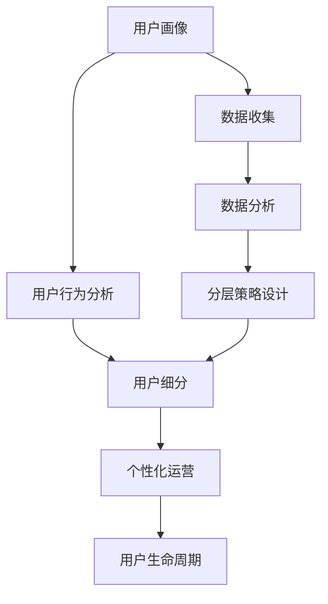

                 

# 如何进行有效的用户分层运营

## 1. 背景介绍

### 1.1 问题由来

在互联网和移动互联网的浪潮中，企业间的竞争已由产品驱动转变为数据驱动。然而，庞大的用户群体和多样化的行为需求给企业带来了挑战。如何高效地管理和运营用户，最大化其生命周期价值，成为数字化时代企业必须面对的重要问题。用户分层运营，通过将用户进行细分类别，实现精细化运营，是解决这一问题的有效手段。

用户分层运营不仅能够提升用户满意度，增强用户粘性，还能优化资源配置，提升运营效率。在电商、社交、金融、医疗等众多领域，用户分层运营已经成为企业数字化转型的核心战略之一。

### 1.2 问题核心关键点

有效的用户分层运营，需要系统性地理解用户的属性和行为特征，并设计合适的分层策略，从而实现对用户的精准识别和细分管理。具体包括以下几个方面：

- 用户画像构建：通过收集用户的行为、属性、兴趣等数据，绘制用户画像，提供用户的详细画像信息。
- 用户行为分析：通过分析用户的点击、浏览、购买、互动等行为数据，挖掘用户行为模式，为分层提供依据。
- 分层策略设计：结合业务目标，选择合适的分层维度，如年龄、性别、消费水平等，构建用户分层模型。
- 数据驱动运营：基于分层模型，设计个性化的运营策略，提升用户体验，增加用户转化和忠诚度。
- 效果评估与迭代：通过持续的数据反馈，评估运营效果，迭代优化分层模型和策略。

以下文章将深入探讨用户分层运营的核心原理、具体步骤、技术实现和应用场景，并提出一些方法和策略，供企业参考。

## 2. 核心概念与联系

### 2.1 核心概念概述

为更好地理解用户分层运营，首先需要介绍几个关键概念：

- **用户画像（User Persona）**：基于用户的基本属性、行为数据、兴趣爱好等，构建用户画像，为后续分层运营提供基础。
- **用户行为分析（User Behavior Analysis）**：通过分析用户在平台上的行为轨迹，识别出用户的行为模式和兴趣偏好。
- **用户细分（User Segmentation）**：根据一定的标准将用户划分为不同群体，以便针对性地制定运营策略。
- **个性化运营（Personalized Operation）**：根据用户画像和行为特征，设计个性化的产品和服务，提升用户体验。
- **用户生命周期（User Lifecycle）**：描述用户与企业互动的全过程，包括获取、转化、流失等各个阶段。

这些核心概念之间的逻辑关系可以通过以下Mermaid流程图来展示：



这个流程图展示出用户分层运营的核心流程：

1. 首先从数据收集开始，构建详细的用户画像。
2. 基于用户画像和行为数据，进行分析，挖掘用户的特征和行为模式。
3. 根据分析结果，设计用户细分策略。
4. 对不同用户群体实施个性化运营。
5. 最后，监测和评估用户生命周期表现，不断迭代优化。

## 3. 核心算法原理 & 具体操作步骤

### 3.1 算法原理概述

用户分层运营的本质是利用数据分析和机器学习技术，对用户进行系统性的分层，并根据不同层级的用户特征制定差异化的运营策略。其核心原理包括：

- 特征工程：从原始数据中提取有效的特征，构建用户画像。
- 聚类算法：将用户按照相似性进行分组，形成用户细分。
- 模型训练：训练分类模型，识别用户行为模式。
- 用户运营：根据不同用户特征，设计个性化运营策略。
- 效果评估：持续监测用户行为和业务指标，优化分层策略。

### 3.2 算法步骤详解

用户分层运营的具体操作步骤如下：

**Step 1: 数据准备与预处理**

- **数据收集**：从网站、应用、社交媒体等多个渠道收集用户的行为数据、属性数据、交易数据等。
- **数据清洗**：对数据进行去重、处理缺失值、异常值处理等预处理操作。
- **特征工程**：选择和构造能够代表用户特征的变量，如年龄、性别、地域、消费金额等。

**Step 2: 用户画像构建**

- **基本信息**：包括年龄、性别、地域等基础信息。
- **行为数据**：如浏览历史、购买记录、互动行为等。
- **属性数据**：如职业、教育背景、兴趣爱好等。

**Step 3: 用户行为分析**

- **行为轨迹**：通过分析用户在平台上的行为轨迹，如页面跳转、停留时间、点击次数等，识别出用户的行为模式。
- **兴趣偏好**：利用文本挖掘、协同过滤等方法，从用户行为中提取兴趣偏好，形成用户兴趣标签。

**Step 4: 用户细分策略设计**

- **设定分层维度**：根据业务目标和用户画像，选择合适的分层维度，如年龄、性别、消费水平等。
- **分层模型建立**：使用聚类算法（如K-means、层次聚类）对用户进行分类。

**Step 5: 个性化运营策略制定**

- **策略设计**：针对不同用户群体，设计个性化运营策略，如推荐系统、个性化营销活动、定制化内容推送等。
- **策略实施**：将个性化策略应用到实际运营中，提升用户体验和转化率。

**Step 6: 效果评估与迭代**

- **效果监测**：通过用户行为数据、业务指标等，监测分层运营的效果。
- **策略优化**：根据反馈数据，不断优化分层策略和运营策略。

### 3.3 算法优缺点

用户分层运营技术具有以下优点：

1. **高效运营**：通过系统化地对用户进行分组，实现资源的高效配置和利用。
2. **提升用户体验**：针对不同用户群体设计个性化运营策略，提升用户满意度和粘性。
3. **数据驱动决策**：利用数据分析和机器学习技术，实现运营策略的科学化、精细化。
4. **业务增长**：通过精准运营，提高用户转化率和留存率，促进业务增长。

但同时，该技术也存在一些缺点：

1. **数据隐私问题**：在数据收集和处理过程中，需要严格遵守隐私保护法规，确保用户数据的安全。
2. **模型复杂性**：用户细分和个性化运营策略的设计需要较强的数据处理和分析能力，对技术要求较高。
3. **用户异动**：用户行为和属性可能发生变化，需要进行持续的数据监测和模型迭代。
4. **数据质量问题**：数据收集和处理中的噪声和异常值可能影响分析结果和分层效果。

## 4. 数学模型和公式 & 详细讲解 & 举例说明

### 4.1 数学模型构建

用户分层运营的核心数学模型包括用户画像构建、用户行为分析、聚类模型训练等。下面以K-means聚类算法为例，简要介绍用户分层的数学模型。

设用户特征向量为 $x_i=(x_{i1},x_{i2},\cdots,x_{id})$，其中 $x_{ij}$ 表示用户 $i$ 在第 $j$ 个维度上的特征值。设聚类中心向量为 $\mu_k$，其中 $k$ 表示第 $k$ 个聚类中心，共有 $K$ 个聚类中心。

K-means聚类的目标函数为：

$$
\min_{\mu_1,\mu_2,\cdots,\mu_K} \sum_{i=1}^{N} \min_{k=1,\cdots,K} ||x_i - \mu_k||^2
$$

其中 $N$ 表示用户总数。

### 4.2 公式推导过程

K-means聚类算法的核心步骤包括：

1. **初始化聚类中心**：随机初始化 $K$ 个聚类中心 $\mu_1,\mu_2,\cdots,\mu_K$。
2. **分配用户**：对每个用户 $x_i$，计算其到 $K$ 个聚类中心的距离，分配到距离最近的聚类中心。
3. **更新聚类中心**：对每个聚类中心 $\mu_k$，重新计算其聚类中心，即更新为所属用户 $x_i$ 的特征向量的均值。
4. **迭代优化**：重复步骤2和步骤3，直到聚类中心不再变化。

具体公式推导过程如下：

1. **初始化聚类中心**：
$$
\mu_k = \frac{1}{|C_k|} \sum_{x_i \in C_k} x_i
$$
其中 $C_k$ 表示第 $k$ 个聚类中的用户集合。

2. **分配用户**：
$$
z_i = \arg \min_k ||x_i - \mu_k||^2
$$
其中 $z_i$ 表示用户 $i$ 所属的聚类编号。

3. **更新聚类中心**：
$$
\mu_k = \frac{1}{|C_k|} \sum_{x_i \in C_k} x_i
$$

4. **迭代优化**：
假设第 $t$ 次迭代后的聚类中心为 $\mu_k^t$，则第 $t+1$ 次迭代后的聚类中心为：
$$
\mu_k^{t+1} = \frac{1}{|C_k|} \sum_{x_i \in C_k^t} x_i
$$
其中 $C_k^t$ 表示第 $t$ 次迭代后属于第 $k$ 个聚类的用户集合。

通过上述步骤，K-means算法不断迭代优化，最终得到稳定的聚类结果。

### 4.3 案例分析与讲解

以下通过一个具体的案例，演示用户分层运营的数学模型和算法流程。

**案例背景**：某电商平台希望通过用户分层运营，提升用户购买转化率和复购率。

**数据准备**：收集了用户的浏览历史、购买记录、属性信息等数据。

**用户画像构建**：对用户的基本信息、行为数据和属性数据进行清洗和处理，得到用户画像。

**用户行为分析**：利用聚类算法对用户行为数据进行分析，识别出不同行为模式的用户群体。

**用户细分策略设计**：通过K-means聚类算法，将用户分为高价值用户、中等价值用户和低价值用户三类。

**个性化运营策略制定**：针对不同用户群体，设计不同的运营策略：
- 高价值用户：提供VIP专属优惠、定制化推荐等。
- 中等价值用户：通过邮件营销、优惠券等方式进行引导。
- 低价值用户：通过再营销和优惠活动进行召回。

**效果评估与迭代**：通过分析用户的购买行为和业务指标，评估分层运营的效果，不断优化聚类算法和运营策略。

## 5. 项目实践：代码实例和详细解释说明

### 5.1 开发环境搭建

在进行用户分层运营的项目实践前，我们需要准备好开发环境。以下是使用Python进行项目实践的环境配置流程：

1. 安装Python：推荐使用Anaconda或Miniconda，从官网下载并安装，用于创建和管理Python环境。
2. 创建虚拟环境：
```bash
conda create --name user-segmentation python=3.8
conda activate user-segmentation
```
3. 安装必要的依赖库：
```bash
pip install pandas numpy sklearn scikit-learn matplotlib seaborn
```

### 5.2 源代码详细实现

以下是一个基于Python的K-means聚类算法用户分层的代码实现，以电商平台的客户群体划分为例：

```python
from sklearn.cluster import KMeans
from sklearn.preprocessing import StandardScaler
import pandas as pd

# 读取数据集
data = pd.read_csv('user_data.csv')

# 特征选择和处理
features = ['age', 'gender', 'income', 'purchase_frequency']
X = data[features].values

# 标准化数据
scaler = StandardScaler()
X = scaler.fit_transform(X)

# 聚类分析
kmeans = KMeans(n_clusters=3, random_state=0)
kmeans.fit(X)
labels = kmeans.labels_

# 结果输出
print('聚类结果：', labels)
```

在这个代码中，我们使用了Scikit-learn库中的KMeans算法，对用户数据集进行了聚类分析，得到了三个用户群体。

### 5.3 代码解读与分析

在这个K-means聚类算法的代码实现中，我们可以进一步解释各个步骤的作用：

- `read_csv`：读取用户数据集，存储为DataFrame格式。
- `features`：选择对用户分层有用的特征。
- `StandardScaler`：对数据进行标准化处理，使数据具有相似的尺度。
- `KMeans`：创建K-means聚类模型，设置聚类数为3。
- `fit`：对数据进行聚类分析，得到聚类中心和用户所属聚类。
- `labels_`：获取用户所属聚类标签。

## 6. 实际应用场景

### 6.1 电商平台

在电商平台的用户分层运营中，可以根据用户的购买历史、浏览行为、点击次数等数据，对用户进行细分，并提供个性化的产品推荐、优惠券等运营策略，提升用户购买转化率和复购率。

### 6.2 社交网络

社交网络平台可以通过分析用户的互动行为、兴趣偏好等数据，对用户进行细分，并通过个性化的内容推送、社区管理等策略，提升用户活跃度和平台粘性。

### 6.3 金融服务

金融服务行业可以通过分析用户的交易行为、信用记录等数据，对用户进行细分，并提供个性化的贷款产品、投资建议等运营策略，提升用户满意度和平台忠诚度。

### 6.4 医疗健康

医疗健康行业可以通过分析用户的健康数据、医疗记录等数据，对用户进行细分，并提供个性化的健康管理、医疗咨询等运营策略，提升用户健康水平和平台粘性。

### 6.5 未来应用展望

未来，随着数据和算力的不断提升，用户分层运营将向以下几个方向发展：

1. **多维度细分**：结合用户的行为、属性、兴趣等多维数据，进行更精细化的用户细分。
2. **实时细分**：通过实时数据处理和分析，实现对用户行为的即时响应和调整。
3. **自动化策略**：利用机器学习算法和自然语言处理技术，实现自动化运营策略的设计和优化。
4. **跨平台协同**：实现不同平台和渠道的用户数据整合和分析，提升跨平台的用户体验。
5. **隐私保护**：在用户细分和运营策略设计中，严格遵守隐私保护法规，保障用户数据安全。

## 7. 工具和资源推荐

### 7.1 学习资源推荐

为了帮助开发者系统掌握用户分层运营的理论基础和实践技巧，这里推荐一些优质的学习资源：

1. 《数据科学与人工智能》系列课程：由国内顶尖高校和研究机构开设的线上课程，涵盖数据处理、机器学习、深度学习等多个方面。
2. 《Python数据分析实战》书籍：详细介绍数据分析和数据处理的基本方法和技巧。
3. 《用户行为分析》书籍：深入浅出地介绍用户行为分析和数据驱动决策的方法。
4. Kaggle：数据科学竞赛平台，提供丰富的数据集和案例，适合实践和练习。
5. Coursera：在线学习平台，提供大量数据科学和人工智能课程。

通过对这些资源的学习实践，相信你一定能够快速掌握用户分层运营的理论基础和实践技巧，并用于解决实际的业务问题。

### 7.2 开发工具推荐

高效的开发离不开优秀的工具支持。以下是几款用于用户分层运营开发的常用工具：

1. Python：数据科学和人工智能的主流编程语言，拥有丰富的数据处理和分析库。
2. Jupyter Notebook：交互式的开发环境，支持代码和数据分析的混合编写。
3. Pandas：高效的数据处理和分析库，支持各种数据格式的读写和处理。
4. Scikit-learn：机器学习库，提供多种聚类算法和模型训练工具。
5. TensorFlow：深度学习框架，支持复杂的数据分析和模型训练。

合理利用这些工具，可以显著提升用户分层运营的开发效率，加快创新迭代的步伐。

### 7.3 相关论文推荐

用户分层运营领域的研究源于学界的持续探索。以下是几篇奠基性的相关论文，推荐阅读：

1. "A Survey on Customer Segmentation"：综述用户分类的常见方法和应用。
2. "Customer Segmentation Using Data Mining Techniques"：探讨多种数据挖掘方法在用户细分中的应用。
3. "K-means: The Theory Behind the Method"：K-means聚类算法的详细介绍和理论基础。
4. "Data-Driven Customer Segmentation in E-Commerce"：介绍基于数据驱动的用户细分方法在电商领域的应用。
5. "User Segmentation in Social Media"：分析社交媒体平台的用户细分方法和策略。

这些论文代表了大数据和人工智能技术在用户细分领域的发展脉络。通过学习这些前沿成果，可以帮助研究者把握学科前进方向，激发更多的创新灵感。

## 8. 总结：未来发展趋势与挑战

### 8.1 研究成果总结

用户分层运营技术经过多年的发展和实践，已经成为数字化时代企业运营的核心工具之一。该技术在电商、社交、金融、医疗等众多领域都得到了广泛应用，并取得了显著的业务提升。

### 8.2 未来发展趋势

展望未来，用户分层运营技术将呈现以下几个发展趋势：

1. **智能细分**：结合人工智能技术，实现更精准的用户细分，如利用深度学习模型对用户进行预测性细分。
2. **实时运营**：通过实时数据分析和处理，实现对用户行为的即时响应和调整。
3. **跨平台协同**：实现不同平台和渠道的用户数据整合和分析，提升跨平台的用户体验。
4. **隐私保护**：在用户细分和运营策略设计中，严格遵守隐私保护法规，保障用户数据安全。
5. **自动化决策**：利用机器学习算法和自然语言处理技术，实现自动化运营策略的设计和优化。

### 8.3 面临的挑战

尽管用户分层运营技术已经取得了瞩目成就，但在迈向更加智能化、普适化应用的过程中，它仍面临着诸多挑战：

1. **数据质量问题**：数据收集和处理中的噪声和异常值可能影响分析结果和分层效果。
2. **隐私保护**：在用户细分和运营策略设计中，严格遵守隐私保护法规，保障用户数据安全。
3. **模型复杂性**：用户细分和个性化运营策略的设计需要较强的数据处理和分析能力，对技术要求较高。
4. **用户异动**：用户行为和属性可能发生变化，需要进行持续的数据监测和模型迭代。
5. **效果评估**：持续监测用户行为和业务指标，评估分层运营的效果，需要设计合理的评估指标和体系。

### 8.4 研究展望

面对用户分层运营面临的挑战，未来的研究需要在以下几个方面寻求新的突破：

1. **多维度细分**：结合用户的行为、属性、兴趣等多维数据，进行更精细化的用户细分。
2. **实时细分**：通过实时数据处理和分析，实现对用户行为的即时响应和调整。
3. **自动化策略**：利用机器学习算法和自然语言处理技术，实现自动化运营策略的设计和优化。
4. **隐私保护**：在用户细分和运营策略设计中，严格遵守隐私保护法规，保障用户数据安全。
5. **效果评估**：设计合理的评估指标和体系，持续监测和评估用户细分和运营策略的效果。

这些研究方向的探索，必将引领用户分层运营技术迈向更高的台阶，为数字化时代的企业运营提供更科学、更高效的解决方案。

## 9. 附录：常见问题与解答

**Q1: 用户分层的具体步骤是什么？**

A: 用户分层的具体步骤包括：
1. 数据准备与预处理
2. 用户画像构建
3. 用户行为分析
4. 用户细分策略设计
5. 个性化运营策略制定
6. 效果评估与迭代

**Q2: 如何选择合适的聚类算法？**

A: 选择合适的聚类算法需要考虑多个因素，如数据类型、数据规模、聚类结果需求等。以下是几种常见的聚类算法及其适用场景：
- K-means：适用于数据规模较大、类内密集、类间分离的情况。
- 层次聚类：适用于数据规模较小、类内紧密、类间分离的情况。
- DBSCAN：适用于数据分布不均匀、存在噪声的情况。

**Q3: 如何处理缺失值和异常值？**

A: 处理缺失值和异常值的方法包括：
1. 删除法：直接删除含有缺失值或异常值的样本。
2. 均值填补法：用特征的均值填补缺失值。
3. 插值法：利用插值方法填补缺失值。
4. 异常值检测：通过统计方法或模型检测并处理异常值。

**Q4: 如何评估用户分层的有效性？**

A: 评估用户分层的有效性需要从多个方面进行评估，如准确率、召回率、F1分数等。具体步骤如下：
1. 确定评估指标：如准确率、召回率、F1分数等。
2. 计算分层结果与真实标签的匹配度。
3. 评估指标分析：根据评估结果，分析用户分层的有效性。

**Q5: 如何在实际项目中应用用户分层运营技术？**

A: 在实际项目中应用用户分层运营技术需要以下步骤：
1. 收集和整理用户数据。
2. 对数据进行清洗和处理。
3. 构建用户画像，分析用户行为。
4. 设计用户细分策略，实施个性化运营。
5. 持续监测和评估效果，不断优化分层和运营策略。

通过这些方法的结合使用，可以有效地提升用户分层运营的效果，实现业务的精细化和智能化运营。

---

作者：禅与计算机程序设计艺术 / Zen and the Art of Computer Programming

