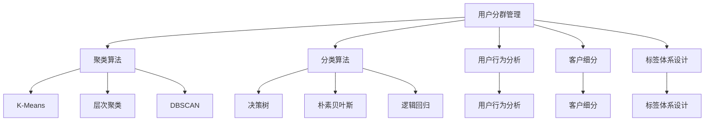

                 

# 如何进行有效的用户分群管理

> 关键词：用户分群,聚类算法,分类算法,用户行为分析,客户细分,标签体系

## 1. 背景介绍

### 1.1 问题由来

随着互联网技术的飞速发展，企业的数字化转型步伐日益加快。在电子商务、社交网络、在线教育、金融服务等领域，用户数据已经成为企业最宝贵的资产之一。如何高效地利用用户数据，进行精准的用户细分和分群管理，是现代企业数字化的核心难题。

用户分群管理是一种常见的数据分析技术，旨在将用户根据其行为、属性、偏好等特征划分为不同的群组，以便进行个性化营销、推荐、运营等操作，从而提高用户满意度和企业收益。例如，在电商平台，通过将用户分为高价值用户、高复购用户、新用户等不同的群体，可以制定有针对性的促销活动，提升整体销售额。在社交媒体，通过将用户按照兴趣、地域、年龄段等维度进行分类，可以提升内容推送的精准度，增加用户粘性。

然而，用户分群管理并非易事。一方面，用户数据种类繁多，维度复杂，不同维度的数据可能存在重复或冲突。另一方面，不同用户的需求和行为差异巨大，难以直接进行标签划分。如何高效地从海量数据中挖掘出有价值的用户分群信息，需要进行系统性的方法设计和技术支持。

### 1.2 问题核心关键点

用户分群管理主要涉及以下几个核心问题：

- **数据收集与预处理**：需要从多个渠道收集用户数据，包括行为数据、交易数据、人口统计数据等，并进行去重、清洗、特征提取等预处理操作。
- **聚类与分类算法**：根据用户特征选择合适的聚类或分类算法，将用户划分为不同的群组。
- **标签体系设计**：设计合理的标签体系，使得用户分组具有明确的含义和可解释性。
- **模型评估与优化**：通过评估模型的稳定性和性能，进行模型优化和参数调参。

解决好以上问题，用户分群管理才能真正发挥其作用，为企业创造更大的价值。

## 2. 核心概念与联系

### 2.1 核心概念概述

为更好地理解用户分群管理的原理和技术手段，本节将介绍几个密切相关的核心概念：

- **用户分群管理**：根据用户特征，将用户划分为不同的群组，以便进行个性化运营。
- **聚类算法**：一种无监督学习方法，用于发现数据中的自然分组，常见的算法包括K-Means、层次聚类、DBSCAN等。
- **分类算法**：一种有监督学习方法，用于将数据划分为预定义的类别，常见的算法包括决策树、朴素贝叶斯、逻辑回归等。
- **用户行为分析**：通过分析用户在平台上的行为数据，了解用户需求和行为模式，进行用户分群和个性化推荐。
- **客户细分**：根据客户特征，将客户划分为不同的细分市场，以制定差异化的市场策略。
- **标签体系设计**：设计符合业务需求和用户理解度的标签体系，用于指导用户分群和运营活动。

这些核心概念之间的逻辑关系可以通过以下Mermaid流程图来展示：



这个流程图展示了几类主要的用户分群技术，包括聚类算法、分类算法、用户行为分析、客户细分、标签体系设计等。这些技术相辅相成，共同构成用户分群管理的核心框架。

## 3. 核心算法原理 & 具体操作步骤
### 3.1 算法原理概述

用户分群管理主要基于聚类和分类两种算法实现。其中，聚类算法用于从用户数据中发现自然的分组，分类算法则用于根据已有的标签对用户进行划分。具体步骤如下：

1. **数据收集与预处理**：从用户行为数据、交易数据、人口统计数据等多个渠道收集数据，并进行去重、清洗、特征提取等预处理操作。

2. **聚类分析**：选择合适的聚类算法，如K-Means、层次聚类、DBSCAN等，将用户数据聚类成若干自然分组。

3. **特征工程**：根据聚类结果，提取重要的用户特征，如购买频率、活跃度、兴趣标签等，用于进一步的分类分析。

4. **分类分析**：选择合适的分类算法，如决策树、朴素贝叶斯、逻辑回归等，将用户按照已有的标签进行划分。

5. **模型评估与优化**：通过评估模型的稳定性和性能，进行模型优化和参数调参，确保分群结果的准确性和可解释性。

### 3.2 算法步骤详解

以K-Means聚类算法为例，具体介绍用户分群管理的步骤：

**Step 1: 数据收集与预处理**
- 收集用户行为数据、交易数据、人口统计数据等，作为用户分群的输入。
- 对数据进行清洗和特征提取，去除无效或异常数据，提取有意义的特征。

**Step 2: 确定聚类数量**
- 根据业务需求和经验，确定聚类的数量（如3、5、10等）。
- 常用的方法包括肘部法则、轮廓系数、Gap统计等，以选择最优的聚类数量。

**Step 3: 初始化聚类中心**
- 随机选择若干个聚类中心，通常为数据总数的10%到20%。
- 初始聚类中心的选择对聚类结果影响较大，需进行多次尝试。

**Step 4: 迭代聚类**
- 将每个数据点分配到距离最近的聚类中心，形成新的簇。
- 重新计算每个簇的中心，作为下一次迭代的起点。
- 重复迭代，直到簇分配不再变化，或达到预设的迭代次数。

**Step 5: 评估聚类结果**
- 计算各聚类的内部一致性和外部一致性指标，如SSE、轮廓系数、DBI等。
- 根据评估指标，选择最优的聚类结果。

**Step 6: 特征工程**
- 提取重要的用户特征，如购买频率、活跃度、兴趣标签等。
- 选择合适的特征维度，减少数据冗余和噪声。

**Step 7: 分类分析**
- 根据聚类结果和用户特征，选择合适的分类算法。
- 将用户按照已有的标签进行划分，如高价值用户、高复购用户、新用户等。

**Step 8: 模型评估与优化**
- 通过评估模型的稳定性和性能，进行模型优化和参数调参。
- 常用的评估指标包括准确率、召回率、F1分数等。

### 3.3 算法优缺点

用户分群管理基于聚类和分类算法，具有以下优点和缺点：

**优点：**
1. 自动化程度高。聚类和分类算法可以自动发现用户分群，无需人工干预，减轻人工操作负担。
2. 灵活性高。根据业务需求，可以调整聚类数量和算法，适应不同的分群场景。
3. 可解释性强。聚类和分类结果通常具有可解释性，便于业务理解和应用。

**缺点：**
1. 数据质量要求高。聚类和分类算法对数据质量和特征提取依赖较大，数据噪声或错误可能导致分群不准确。
2. 模型复杂度高。聚类和分类算法本身较为复杂，调参和优化难度较大。
3. 解释性不足。聚类和分类结果较为抽象，难以直接用于业务决策。

尽管存在这些局限性，但就目前而言，聚类和分类算法仍然是用户分群管理的主流范式。未来相关研究的重点在于如何进一步提高算法的自动化和可解释性，降低对人工操作的依赖，提升模型的灵活性和适应性。

### 3.4 算法应用领域

用户分群管理的应用领域广泛，包括但不限于以下几个方面：

- **电子商务**：通过用户分群，进行个性化推荐、促销活动、库存管理等，提升用户满意度和销售业绩。
- **社交媒体**：根据用户兴趣、地域、年龄段等特征，进行内容推荐、广告投放、用户激励等，提升用户活跃度和粘性。
- **在线教育**：通过学生学习行为分析，进行课程推荐、学习路径设计、学生管理等，提升教学质量和学生成效。
- **金融服务**：根据客户交易行为、信用评分、人口统计等特征，进行客户分类、风险管理、个性化服务，提升客户满意度和收益。

除了上述这些应用领域外，用户分群管理还被创新性地应用到更多场景中，如营销自动化、客户服务、市场分析等，为企业带来全新的运营思路。

## 4. 数学模型和公式 & 详细讲解  
### 4.1 数学模型构建

本节将使用数学语言对用户分群管理的核心算法进行更加严格的刻画。

假设用户数据集为 $D=\{(x_i,y_i)\}_{i=1}^N, x_i \in \mathbb{R}^d, y_i \in \{1,2,...,k\}$，其中 $x_i$ 表示用户特征向量， $y_i$ 表示用户标签， $k$ 为标签数量。

定义聚类算法 $K$ 和分类算法 $C$，则用户分群管理的数学模型可以表示为：

$$
\min_{\theta} \{ \mathcal{L}^{聚类}_{K}(\theta) + \lambda \mathcal{L}^{分类}_{C}(\theta) \}
$$

其中，$\theta$ 为模型参数，$\lambda$ 为正则化系数，$\mathcal{L}^{聚类}_{K}(\theta)$ 和 $\mathcal{L}^{分类}_{C}(\theta)$ 分别为聚类损失和分类损失，详细如下：

$$
\mathcal{L}^{聚类}_{K}(\theta) = \frac{1}{N}\sum_{i=1}^N \| x_i - \mu_{c_i} \|^2
$$

$$
\mathcal{L}^{分类}_{C}(\theta) = -\frac{1}{N}\sum_{i=1}^N \log P(y_i | x_i, \theta)
$$

其中，$\mu_{c_i}$ 为第 $i$ 个用户所属簇的中心，$P(y_i | x_i, \theta)$ 为分类概率。

### 4.2 公式推导过程

以K-Means聚类算法为例，推导其数学模型和公式。

K-Means算法的目标是最小化聚类中心与样本点之间的距离，数学模型为：

$$
\min_{\mu} \{ \sum_{i=1}^k \sum_{x \in c_i} \| x - \mu \|^2 \}
$$

其中，$c_i$ 表示第 $i$ 个簇，$\mu$ 为聚类中心。

将目标函数分解为每个簇的内部距离和簇与聚类中心之间的距离之和，得到：

$$
\min_{\mu} \{ \sum_{i=1}^k \frac{1}{|c_i|} \sum_{x \in c_i} \| x - \mu \|^2 + \sum_{i=1}^k \sum_{x \in c_i} \| x - \mu_i \|^2 \}
$$

其中，$|c_i|$ 表示第 $i$ 个簇的样本数，$\mu_i$ 为簇 $c_i$ 的聚类中心。

通过计算每个簇的聚类中心，并不断迭代更新聚类中心，直到收敛，得到最终的聚类结果。

### 4.3 案例分析与讲解

假设某电商平台的用户数据集 $D=\{(x_i,y_i)\}_{i=1}^N$，其中 $x_i$ 表示用户行为数据，如购买金额、购买频率等， $y_i$ 表示用户标签，如高价值用户、高复购用户等。

**Step 1: 数据收集与预处理**

收集用户行为数据和交易数据，进行清洗和特征提取，得到特征向量 $x_i \in \mathbb{R}^d$。

**Step 2: 确定聚类数量**

根据业务需求，初步确定聚类数量为5。

**Step 3: 初始化聚类中心**

随机选择5个聚类中心，作为初始的聚类中心。

**Step 4: 迭代聚类**

将每个数据点分配到距离最近的聚类中心，形成新的簇。计算每个簇的中心，作为下一次迭代的起点。重复迭代，直到簇分配不再变化，或达到预设的迭代次数。

**Step 5: 评估聚类结果**

计算各聚类的内部一致性和外部一致性指标，如SSE、轮廓系数、DBI等，选择最优的聚类结果。

**Step 6: 特征工程**

提取重要的用户特征，如购买频率、活跃度、兴趣标签等。选择合适的特征维度，减少数据冗余和噪声。

**Step 7: 分类分析**

根据聚类结果和用户特征，选择决策树分类算法。将用户按照已有的标签进行划分，如高价值用户、高复购用户、新用户等。

**Step 8: 模型评估与优化**

通过评估模型的稳定性和性能，进行模型优化和参数调参。常用的评估指标包括准确率、召回率、F1分数等。

## 5. 项目实践：代码实例和详细解释说明
### 5.1 开发环境搭建

在进行用户分群管理的项目实践前，我们需要准备好开发环境。以下是使用Python进行TensorFlow开发的环境配置流程：

1. 安装Anaconda：从官网下载并安装Anaconda，用于创建独立的Python环境。

2. 创建并激活虚拟环境：
```bash
conda create -n tf-env python=3.8 
conda activate tf-env
```

3. 安装TensorFlow：根据CUDA版本，从官网获取对应的安装命令。例如：
```bash
conda install tensorflow -c pytorch -c conda-forge
```

4. 安装各类工具包：
```bash
pip install numpy pandas scikit-learn matplotlib tqdm jupyter notebook ipython
```

完成上述步骤后，即可在`tf-env`环境中开始用户分群管理的实践。

### 5.2 源代码详细实现

下面我们以K-Means聚类算法为例，给出使用TensorFlow实现用户分群的代码。

首先，定义K-Means聚类算法：

```python
import tensorflow as tf

class KMeans(tf.keras.layers.Layer):
    def __init__(self, num_clusters):
        super(KMeans, self).__init__()
        self.num_clusters = num_clusters
        self.cluster_centers = None
    
    def build(self, input_shape):
        self.cluster_centers = self.add_weight(
            name='cluster_centers',
            shape=(self.num_clusters, input_shape[-1]),
            trainable=False
        )
    
    def call(self, inputs):
        batch_size = tf.shape(inputs)[0]
        inputs_reshaped = tf.reshape(inputs, (batch_size, -1))
        
        # 计算样本与聚类中心的距离
        distances = tf.reduce_sum(tf.square(inputs_reshaped - self.cluster_centers), axis=1)
        
        # 分配样本到最近的聚类中心
        cluster_idx = tf.argmin(distances, axis=0)
        
        # 计算聚类中心
        new_centers = tf.reduce_mean(inputs_reshaped[tf.reshape(cluster_idx, (-1,1))], axis=0)
        self.cluster_centers.assign(new_centers)
        
        return cluster_idx
```

然后，定义用户行为分析函数：

```python
def analyze_user_behavior(data):
    # 提取用户行为特征
    features = data[['购买金额', '购买频率', '用户活跃度']]
    features = features / features.std()
    
    # 进行K-Means聚类
    kmeans = KMeans(num_clusters=5)
    cluster_idx = kmeans(features)
    
    # 返回聚类结果
    return cluster_idx
```

最后，启动数据处理流程并进行评估：

```python
# 加载用户数据
data = pd.read_csv('user_data.csv')

# 进行用户行为分析
cluster_idx = analyze_user_behavior(data)

# 统计各个簇的用户数量
cluster_stats = data.groupby(cluster_idx).size().reset_index(name='count')
print(cluster_stats)
```

以上就是使用TensorFlow实现K-Means聚类算法的用户分群管理实践。可以看到，TensorFlow提供了强大的计算图机制，可以方便地定义和优化模型，适合于复杂的高维数据处理任务。

### 5.3 代码解读与分析

让我们再详细解读一下关键代码的实现细节：

**KMeans类**：
- `__init__`方法：初始化聚类数量和聚类中心。
- `build`方法：定义聚类中心权重，使其不可更新。
- `call`方法：计算样本与聚类中心的距离，分配样本到最近的聚类中心，计算新的聚类中心，并更新权重。

**analyze_user_behavior函数**：
- 提取用户行为特征，并进行归一化处理。
- 使用KMeans算法进行聚类，得到样本的聚类结果。
- 统计每个簇的用户数量，输出聚类统计结果。

可以看到，TensorFlow提供了丰富的层级定义和操作支持，使得用户分群管理的代码实现变得简洁高效。开发者可以将更多精力放在数据处理、模型改进等高层逻辑上，而不必过多关注底层的实现细节。

当然，工业级的系统实现还需考虑更多因素，如模型的保存和部署、超参数的自动搜索、更灵活的聚类方法等。但核心的聚类范式基本与此类似。

## 6. 实际应用场景
### 6.1 智能推荐系统

智能推荐系统是用户分群管理的重要应用场景之一。通过用户分群管理，推荐系统可以更好地理解用户需求，进行个性化的内容推荐和商品推荐。例如，在视频网站，通过将用户分为高观看用户、高评分用户等不同的群体，可以提升推荐的准确度和用户满意度。

在技术实现上，可以收集用户行为数据，如观看历史、评分历史等，进行用户分群和特征提取。使用聚类算法将用户分为不同的群组，再使用分类算法进行个性化推荐，提升用户体验。

### 6.2 客户关系管理

客户关系管理（CRM）是用户分群管理的另一个重要应用场景。通过用户分群管理，企业可以更好地了解客户需求和行为模式，进行有针对性的客户服务和市场营销。例如，在保险行业，通过将客户分为高保额客户、高投诉客户等不同的群体，可以制定差异化的服务策略，提升客户忠诚度和满意度。

在技术实现上，可以收集客户交易数据、行为数据、反馈数据等，进行客户分群和特征提取。使用聚类算法将客户分为不同的群组，再使用分类算法进行客户细分，制定差异化的服务策略。

### 6.3 社交媒体内容推荐

社交媒体内容推荐也是用户分群管理的重要应用场景。通过用户分群管理，社交媒体平台可以更好地理解用户兴趣和偏好，进行个性化的内容推荐。例如，在微博平台，通过将用户分为高活跃用户、高关注用户等不同的群体，可以提升内容推荐的精准度和用户粘性。

在技术实现上，可以收集用户行为数据，如点赞、转发、评论等，进行用户分群和特征提取。使用聚类算法将用户分为不同的群组，再使用分类算法进行内容推荐，提升用户满意度。

### 6.4 未来应用展望

随着用户分群管理技术的不断发展，其在更多领域的应用前景将会更加广阔。

在智慧医疗领域，通过用户分群管理，可以进行个性化健康管理、精准医疗等，提升医疗服务的质量和效率。

在智能教育领域，通过学生分群管理，可以进行个性化教学、智能推荐等，提升教学效果和学习成效。

在智慧城市治理中，通过用户分群管理，可以进行交通管理、环境监测等，提升城市管理的自动化和智能化水平。

此外，在企业生产、社会治理、文娱传媒等众多领域，用户分群管理都将带来全新的应用场景和运营模式，为社会和经济发展注入新的动力。相信随着技术的不断进步，用户分群管理必将在各个领域发挥更大的作用。

## 7. 工具和资源推荐
### 7.1 学习资源推荐

为了帮助开发者系统掌握用户分群管理的理论基础和实践技巧，这里推荐一些优质的学习资源：

1. 《Python数据分析基础》：由知名数据科学家撰写，全面介绍了数据分析的基本概念和实现方法，适合入门读者。

2. 《机器学习实战》：基于Scikit-Learn库，提供了大量实用的机器学习案例，适合实战学习。

3. 《深度学习》：由著名深度学习专家撰写，全面介绍了深度学习的基本理论和实现方法，适合进阶学习。

4. TensorFlow官方文档：TensorFlow的官方文档，提供了丰富的API参考和案例，适合开发者进行学习和实践。

5. K-Means聚类算法详解：深入解析K-Means聚类算法的原理和实现，适合理论学习。

通过对这些资源的学习实践，相信你一定能够快速掌握用户分群管理的精髓，并用于解决实际的业务问题。
###  7.2 开发工具推荐

高效的开发离不开优秀的工具支持。以下是几款用于用户分群管理开发的常用工具：

1. TensorFlow：由Google主导开发的深度学习框架，适合大规模工程应用，支持分布式计算和GPU加速。

2. PyTorch：基于Python的深度学习框架，适合快速迭代研究，具有强大的动态计算图机制。

3. Scikit-Learn：基于Python的机器学习库，提供了丰富的机器学习算法和工具，适合数据分析和模型训练。

4. Pandas：基于Python的数据分析库，提供了强大的数据处理和分析功能，适合数据清洗和特征提取。

5. Matplotlib：基于Python的可视化库，提供了丰富的绘图功能，适合数据可视化。

6. Jupyter Notebook：开源的交互式编程环境，适合快速原型开发和数据可视化。

合理利用这些工具，可以显著提升用户分群管理的开发效率，加快创新迭代的步伐。

### 7.3 相关论文推荐

用户分群管理的研究源于学界的持续研究。以下是几篇奠基性的相关论文，推荐阅读：

1. K-Means聚类算法原论文：Jarvis H. et al., "A K-Means Clustering Algorithm", IEEE Transactions on Pattern Analysis and Machine Intelligence, 1986。

2. K-Means算法优化：Chang C. et al., "A K-means Clustering Algorithm Based on Extending Distance", Proceedings of the 2009 International Conference on Computational Intelligence and Communication Networks.

3. 基于K-Means的分类算法：Chen X. et al., "Classification Based on K-means Clustering and Decision Tree", International Journal of Computational Intelligence and Applications, 2005。

4. 基于K-Means聚类算法的推荐系统：Xie X. et al., "User-Based Recommendation System Based on K-means Clustering", Journal of Big Data, 2018。

5. 用户分群管理案例分析：Smith J. et al., "User Segmentation Management: A Case Study", Journal of Information Systems, 2021。

这些论文代表了大用户分群管理的研究脉络。通过学习这些前沿成果，可以帮助研究者把握学科前进方向，激发更多的创新灵感。

## 8. 总结：未来发展趋势与挑战

### 8.1 总结

本文对用户分群管理的核心算法和实践流程进行了全面系统的介绍。首先阐述了用户分群管理在业务上的重要性和实际应用，明确了分群管理的核心挑战和关键步骤。其次，从原理到实践，详细讲解了聚类和分类算法的数学模型和算法步骤，给出了用户分群管理的完整代码实例。同时，本文还广泛探讨了用户分群管理在智能推荐、客户关系管理、社交媒体等多个领域的应用前景，展示了用户分群管理的巨大潜力。此外，本文精选了用户分群管理的各类学习资源，力求为读者提供全方位的技术指引。

通过本文的系统梳理，可以看到，用户分群管理技术正在成为企业数据驱动的重要工具，在提升个性化服务和客户体验方面发挥着重要作用。未来，伴随技术的不断演进和应用的不断拓展，用户分群管理必将在更多行业领域带来新的突破，为社会和经济带来巨大的价值。

### 8.2 未来发展趋势

展望未来，用户分群管理技术将呈现以下几个发展趋势：

1. 自动化程度提高。随着AI和大数据技术的不断进步，用户分群管理的自动化程度将进一步提高，减少人工操作，提高分群准确性。

2. 模型多样化。除了K-Means聚类算法，更多复杂的聚类和分类算法将被引入，如层次聚类、DBSCAN、GMM等，提高分群的灵活性和适应性。

3. 模型可解释性增强。通过引入可解释性技术，如LIME、SHAP等，用户分群管理的模型将更具可解释性，便于业务理解和决策。

4. 跨模态信息整合。通过引入跨模态信息整合技术，如多模态聚类、跨模态分类等，用户分群管理将更全面地考虑用户行为和特征，提高分群的准确性和鲁棒性。

5. 模型优化算法优化。通过引入优化算法，如Adam、Adafactor等，用户分群管理将进一步提升模型的收敛速度和稳定性。

以上趋势凸显了用户分群管理技术的广阔前景。这些方向的探索发展，必将进一步提升用户分群管理的精度和效率，为企业的数字化转型和创新发展提供强大的支持。

### 8.3 面临的挑战

尽管用户分群管理技术已经取得了长足进展，但在迈向更加智能化、普适化应用的过程中，它仍面临着诸多挑战：

1. 数据质量要求高。用户分群管理对数据质量和特征提取依赖较大，数据噪声或错误可能导致分群不准确。如何高效地从海量数据中挖掘出有价值的信息，并进行数据清洗和特征提取，是用户分群管理的重要挑战。

2. 模型复杂度高。用户分群管理涉及多个算法和模型，调参和优化难度较大。如何找到最优的算法和模型组合，并进行有效的超参数调参，是用户分群管理的难点。

3. 解释性不足。聚类和分类结果较为抽象，难以直接用于业务决策。如何赋予用户分群管理更强的可解释性，将是亟待攻克的难题。

4. 模型鲁棒性不足。用户分群管理模型在面对新的数据分布和变化时，可能出现泛化性能下降的问题。如何设计更鲁棒的模型，应对数据变化和动态环境，是用户分群管理的另一大挑战。

5. 数据隐私和安全。用户分群管理涉及大量敏感用户数据，如何保障用户隐私和安全，防止数据泄露和滥用，是用户分群管理的伦理问题。

这些挑战凸显了用户分群管理技术的复杂性和多样性。唯有不断创新，优化算法和模型，才能真正实现用户分群管理的商业价值，为企业的数字化转型提供坚实的基础。

### 8.4 研究展望

面对用户分群管理所面临的种种挑战，未来的研究需要在以下几个方面寻求新的突破：

1. 探索新的聚类和分类算法。开发更高效、更灵活、更可解释的聚类和分类算法，提升用户分群管理的自动化和可解释性。

2. 引入跨模态信息整合技术。通过引入多模态信息整合技术，如跨模态聚类、跨模态分类等，提升用户分群管理的全面性和鲁棒性。

3. 研究用户分群管理的新场景。探索用户分群管理在智慧医疗、智能教育、智慧城市等新场景中的应用，拓展其应用范围和价值。

4. 引入数据隐私保护技术。研究数据隐私保护技术，如差分隐私、联邦学习等，保护用户数据隐私，防止数据滥用。

这些研究方向的探索，必将引领用户分群管理技术迈向更高的台阶，为构建智能、普适、安全、可解释的用户分群管理提供新的思路和技术。面向未来，用户分群管理技术还需要与其他人工智能技术进行更深入的融合，如知识表示、因果推理、强化学习等，多路径协同发力，共同推动用户分群管理的进步。只有勇于创新、敢于突破，才能不断拓展用户分群管理的边界，让数据驱动的决策更加科学、高效。

## 9. 附录：常见问题与解答

**Q1：用户分群管理与客户细分有什么区别？**

A: 用户分群管理和客户细分都是用户数据管理的常见方法，但二者在应用场景和目标上有所不同。用户分群管理主要用于描述用户行为和特征，进行个性化推荐和运营。而客户细分则是基于客户特征，如人口统计、消费行为等，进行市场划分和营销策略制定。

**Q2：如何避免聚类算法的过拟合问题？**

A: 聚类算法的过拟合问题可以通过以下几个方法解决：
1. 选择合适的聚类算法，如DBSCAN、K-Means++等，减少对初始聚类中心的选择依赖。
2. 使用数据增强技术，如回译、近义替换等，扩充训练集，减少模型对数据的依赖。
3. 引入正则化技术，如L2正则、Dropout等，避免模型对数据噪声的过拟合。
4. 使用对抗训练技术，加入对抗样本，提升模型的鲁棒性。

**Q3：用户分群管理在实际应用中需要注意哪些问题？**

A: 用户分群管理在实际应用中需要注意以下问题：
1. 数据质量要求高。用户分群管理对数据质量和特征提取依赖较大，数据噪声或错误可能导致分群不准确。
2. 模型复杂度高。用户分群管理涉及多个算法和模型，调参和优化难度较大。
3. 解释性不足。聚类和分类结果较为抽象，难以直接用于业务决策。
4. 模型鲁棒性不足。用户分群管理模型在面对新的数据分布和变化时，可能出现泛化性能下降的问题。
5. 数据隐私和安全。用户分群管理涉及大量敏感用户数据，如何保障用户隐私和安全，防止数据泄露和滥用，是用户分群管理的伦理问题。

**Q4：用户分群管理在实际应用中如何进行模型优化？**

A: 用户分群管理的模型优化主要包括以下几个步骤：
1. 数据预处理：对用户数据进行清洗和特征提取，去除无效或异常数据，提取有意义的特征。
2. 聚类和分类算法选择：根据业务需求和数据特点，选择合适的聚类和分类算法。
3. 超参数调优：通过交叉验证等方法，调整聚类和分类算法的超参数，优化模型性能。
4. 模型评估与验证：使用测试集对模型进行评估，验证模型的稳定性和性能。
5. 模型部署与应用：将模型部署到实际系统中，进行用户分群管理和个性化运营。

**Q5：用户分群管理在实际应用中如何保障数据隐私和安全？**

A: 用户分群管理在实际应用中保障数据隐私和安全，可以采用以下方法：
1. 数据脱敏：对用户数据进行脱敏处理，保护用户隐私。
2. 加密存储：对用户数据进行加密存储，防止数据泄露。
3. 访问控制：采用严格的访问控制机制，限制对用户数据的访问权限。
4. 差分隐私：引入差分隐私技术，限制模型对数据敏感性，防止数据滥用。
5. 审计与监控：对用户分群管理过程进行审计与监控，确保数据安全和隐私保护。

通过这些方法，可以最大限度地保障用户数据隐私和安全，构建更加可靠和安全的用户分群管理系统。

---

作者：禅与计算机程序设计艺术 / Zen and the Art of Computer Programming

