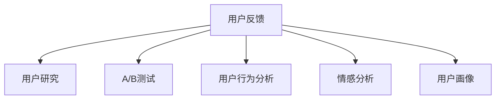
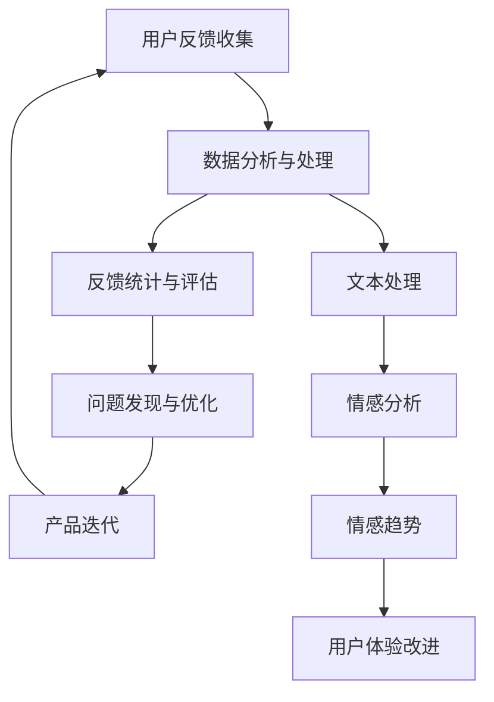

                 

# 如何进行有效的用户反馈收集与应用

## 1. 背景介绍

在数字化转型的浪潮中，企业不仅需要数字化产品，还需要数字化用户。用户反馈是提升产品质量和用户体验的重要依据，也是企业创新发展的动力来源。有效的用户反馈收集与应用，能够帮助企业准确把握用户需求，优化产品功能，提升用户满意度，进而增强市场竞争力。然而，面对日益增长的用户数据和复杂的应用场景，如何高效、全面地收集与应用用户反馈，成为企业智能化运营中的一大挑战。

本文将围绕“如何进行有效的用户反馈收集与应用”这一主题，深入探讨用户反馈收集、处理与应用的各个环节，并通过具体的技术手段和工具，给出系统的实践指南。

## 2. 核心概念与联系

### 2.1 核心概念概述

- **用户反馈**：指用户在实际使用产品或服务过程中，对产品功能、性能、用户体验等方面的评价和建议。
- **用户研究**：通过定性或定量的方法，获取用户行为、需求、偏好等方面的信息，为产品设计和优化提供依据。
- **A/B测试**：一种用于比较两种或多种产品特性或方案的实验方法，通过对比分析，评估不同方案的用户反馈效果。
- **用户行为分析**：通过分析用户在使用产品时的行为数据，揭示用户需求和使用习惯，发现产品缺陷和改进点。
- **情感分析**：一种自然语言处理技术，用于识别和提取文本中的情感倾向，帮助企业了解用户对产品的情感态度。
- **用户画像**：通过整合和分析用户多维数据，形成对用户的深度认知，指导产品开发和营销策略。

这些核心概念构成了用户反馈收集与应用的理论基础，各概念之间的联系可通过以下Mermaid流程图展示：



### 2.2 核心概念原理和架构的 Mermaid 流程图



## 3. 核心算法原理 & 具体操作步骤

### 3.1 算法原理概述

有效的用户反馈收集与应用，一般遵循以下步骤：

1. **数据收集**：通过多种渠道获取用户反馈数据。
2. **数据处理**：对收集到的数据进行清洗、分类、标准化等预处理。
3. **数据分析**：利用统计分析和机器学习算法，挖掘数据中的有价值信息。
4. **问题发现**：根据分析结果，识别出产品或服务存在的问题。
5. **优化迭代**：基于发现的问题，进行产品功能的优化和迭代。
6. **应用效果评估**：评估改进措施的效果，并进行持续改进。

### 3.2 算法步骤详解

#### 数据收集

数据收集是用户反馈收集与应用的基础。常见的数据收集方法包括：

1. **问卷调查**：通过设计问卷，直接向用户收集反馈信息。
2. **在线评论**：收集用户在产品评论区、社交媒体、用户论坛等平台上的评价。
3. **客服记录**：整理和分析用户通过客服渠道反馈的问题。
4. **用户行为数据**：通过用户操作日志、访问记录等获取用户行为数据。
5. **用户访谈**：通过深度访谈，获取用户对产品的详细反馈。

#### 数据处理

数据处理是数据收集之后的关键步骤，旨在保证数据的准确性和可用性。常用的数据处理技术包括：

1. **数据清洗**：去除重复、无关、噪声数据，保证数据的质量。
2. **数据分类**：根据反馈内容，将数据分类到不同的主题或类别中。
3. **数据标准化**：将数据转换为统一的格式，便于后续分析和处理。
4. **数据存储**：使用数据库或数据湖等技术，将数据存储和管理起来。

#### 数据分析

数据分析是挖掘用户反馈价值的核心步骤。常用的数据分析方法包括：

1. **统计分析**：通过统计学方法，分析数据的基本特征和趋势。
2. **情感分析**：利用自然语言处理技术，识别和提取文本中的情感倾向。
3. **用户行为分析**：通过分析用户行为数据，发现用户需求和使用习惯。
4. **A/B测试**：通过对比不同方案的用户反馈，评估方案的优劣。
5. **用户画像**：通过整合和分析多维数据，形成对用户的深度认知。

#### 问题发现

问题发现是数据分析后的重要环节，旨在从数据中识别出产品的缺陷和改进点。常用的问题发现方法包括：

1. **问题挖掘**：通过文本挖掘技术，从用户反馈中识别出具体的问题点。
2. **异常检测**：通过异常检测算法，发现用户反馈中的异常情况。
3. **影响分析**：分析用户反馈对产品的影响，评估改进措施的重要性。
4. **优先级排序**：根据问题的重要性和紧急性，对问题进行优先级排序，指导改进方向。

#### 优化迭代

优化迭代是基于问题发现的结果，对产品进行改进和优化。常用的优化方法包括：

1. **功能改进**：根据用户反馈，改进或新增产品功能。
2. **界面优化**：根据用户反馈，优化产品的界面和用户体验。
3. **性能提升**：根据用户反馈，提升产品的性能和响应速度。
4. **用户体验改进**：通过用户研究，提升用户的使用体验和满意度。
5. **产品迭代**：根据用户反馈，进行产品功能的迭代更新。

#### 应用效果评估

应用效果评估是用户反馈收集与应用的最后一步，旨在评估改进措施的效果，并进行持续改进。常用的评估方法包括：

1. **用户满意度调查**：通过问卷调查等方式，评估用户对改进措施的满意度。
2. **用户行为数据分析**：通过用户行为数据，分析改进措施对用户行为的影响。
3. **A/B测试结果**：通过A/B测试结果，评估不同改进措施的效果。
4. **绩效指标监控**：通过关键绩效指标（KPI），监控改进措施的效果。

### 3.3 算法优缺点

**优点**：

1. **提升产品性能**：通过用户反馈，识别和解决问题，提升产品性能和用户体验。
2. **加速产品迭代**：基于用户反馈，指导产品功能的改进和优化，加速产品迭代进程。
3. **增强用户粘性**：通过持续改进，增强用户对产品的满意度，提高用户粘性和留存率。
4. **数据驱动决策**：通过数据分析，科学地指导产品决策，减少主观偏见。

**缺点**：

1. **数据收集成本高**：大规模用户反馈数据的收集和整理成本较高。
2. **数据质量问题**：用户反馈数据可能存在噪声和不一致，影响分析结果。
3. **数据隐私风险**：用户反馈数据涉及用户隐私，需注意数据保护和隐私问题。
4. **反馈处理复杂**：用户反馈内容多样，处理复杂，需投入较多时间和资源。

### 3.4 算法应用领域

用户反馈收集与应用方法，可以广泛应用于各个领域，包括但不限于：

1. **金融行业**：通过用户反馈，优化金融产品和服务，提升用户满意度。
2. **电商行业**：通过用户反馈，改进电商网站和应用，提升用户购物体验。
3. **医疗健康**：通过用户反馈，优化医疗服务流程，提升患者体验和满意度。
4. **旅游行业**：通过用户反馈，优化旅游产品和服务，提升用户旅游体验。
5. **教育培训**：通过学生反馈，优化课程内容和教学方法，提升教学质量。

## 4. 数学模型和公式 & 详细讲解 & 举例说明

### 4.1 数学模型构建

用户反馈的收集与应用，涉及大量文本数据的处理和分析。因此，我们可以构建数学模型来描述这一过程。

**模型一：情感分析模型**

情感分析是一种自然语言处理技术，用于识别和提取文本中的情感倾向。我们可以使用情感分析模型来评估用户对产品的情感态度。

假设用户反馈文本为 $X$，情感类别为 $C$，情感标签为 $Y$，则情感分析模型的目标是通过学习 $X$ 和 $C$ 之间的映射关系，预测情感标签 $Y$。常用的情感分析模型包括朴素贝叶斯模型、支持向量机模型、深度学习模型等。

模型公式为：

$$
Y = f(X; \theta)
$$

其中 $f$ 为情感分析模型，$\theta$ 为模型参数。

**模型二：用户行为分析模型**

用户行为分析通过分析用户在使用产品时的行为数据，揭示用户需求和使用习惯。我们可以使用用户行为分析模型来识别用户行为模式和特征。

假设用户行为数据为 $D = \{(x_i, y_i)\}_{i=1}^N$，其中 $x_i$ 为行为数据，$y_i$ 为行为标签（如点击、购买等），则用户行为分析模型的目标是通过学习 $D$，预测用户行为。常用的用户行为分析模型包括逻辑回归模型、决策树模型、神经网络模型等。

模型公式为：

$$
y_i = g(x_i; \theta)
$$

其中 $g$ 为用户行为分析模型，$\theta$ 为模型参数。

### 4.2 公式推导过程

**情感分析模型推导**

假设我们使用的是朴素贝叶斯模型，其基本思路是通过计算文本特征 $x$ 在不同情感类别 $c$ 下的概率，得到文本的情感分类。

设情感类别 $C = \{c_1, c_2, \ldots, c_k\}$，文本特征向量 $x$ 为 $n$ 维向量，则朴素贝叶斯模型的概率计算公式为：

$$
P(c|x) = \frac{P(x|c)P(c)}{P(x)}
$$

其中 $P(c)$ 为先验概率，$P(x|c)$ 为条件概率。

通过最大化 $P(c|x)$，可以得到文本的情感分类。

**用户行为分析模型推导**

假设我们使用的是逻辑回归模型，其基本思路是通过学习用户行为数据 $D$，建立行为预测模型 $g(x; \theta)$。

设用户行为数据 $D = \{(x_i, y_i)\}_{i=1}^N$，其中 $x_i$ 为行为数据，$y_i$ 为行为标签，则逻辑回归模型的目标是最小化损失函数 $L(\theta)$，即：

$$
L(\theta) = -\frac{1}{N}\sum_{i=1}^N y_i \log g(x_i; \theta) + (1-y_i) \log (1-g(x_i; \theta))
$$

其中 $g(x; \theta)$ 为逻辑回归模型，$\theta$ 为模型参数。

### 4.3 案例分析与讲解

**情感分析案例**

某电商平台的商品评价数据集，包含大量用户对商品的评价文本。平台希望通过情感分析，了解用户对商品的情感态度，从而优化商品推荐。

1. **数据收集**：收集用户商品评价数据，整理成文本和情感标签。
2. **数据清洗**：去除无关信息，如用户名、时间戳等，保留有用信息。
3. **数据标准化**：将文本数据进行分词、去停用词、词干提取等处理，得到标准化文本。
4. **模型训练**：使用朴素贝叶斯模型，训练情感分析模型。
5. **情感预测**：输入新的用户评价文本，通过情感分析模型预测其情感倾向。
6. **改进推荐**：根据情感分析结果，调整商品推荐算法，提升用户满意度。

**用户行为分析案例**

某金融平台的客户行为数据集，包含大量用户在金融产品上的操作数据。平台希望通过用户行为分析，优化金融产品设计，提升用户体验。

1. **数据收集**：收集用户在金融产品上的操作数据，整理成行为数据和行为标签。
2. **数据清洗**：去除无关信息，如重复数据、异常数据等，保留有用信息。
3. **数据标准化**：将行为数据进行归一化、特征选择等处理，得到标准化行为数据。
4. **模型训练**：使用逻辑回归模型，训练用户行为分析模型。
5. **行为预测**：输入新的用户行为数据，通过用户行为分析模型预测其行为倾向。
6. **产品优化**：根据行为预测结果，优化金融产品设计，提升用户体验。

## 5. 项目实践：代码实例和详细解释说明

### 5.1 开发环境搭建

在进行用户反馈收集与应用的实践前，我们需要准备好开发环境。以下是使用Python进行用户反馈分析的开发环境配置流程：

1. 安装Anaconda：从官网下载并安装Anaconda，用于创建独立的Python环境。

2. 创建并激活虚拟环境：
```bash
conda create -n user_feedback python=3.8 
conda activate user_feedback
```

3. 安装相关库：
```bash
pip install pandas numpy scikit-learn tensorflow
```

4. 安装用户反馈分析库：
```bash
pip install user_feedback_analysis
```

完成上述步骤后，即可在`user_feedback_analysis`环境中开始实践。

### 5.2 源代码详细实现

这里我们以情感分析为例，给出使用Python进行用户反馈情感分析的代码实现。

首先，导入必要的库：

```python
import pandas as pd
from sklearn.feature_extraction.text import CountVectorizer
from sklearn.model_selection import train_test_split
from sklearn.naive_bayes import MultinomialNB
from sklearn.metrics import accuracy_score
```

然后，加载情感分析数据集：

```python
data = pd.read_csv('user_feedback.csv')
```

接着，进行数据预处理：

```python
# 文本分词
vectorizer = CountVectorizer(stop_words='english')
X = vectorizer.fit_transform(data['text'])
y = data['label']
```

然后，划分训练集和测试集：

```python
X_train, X_test, y_train, y_test = train_test_split(X, y, test_size=0.2, random_state=42)
```

接下来，训练情感分析模型：

```python
clf = MultinomialNB()
clf.fit(X_train, y_train)
```

最后，评估模型效果：

```python
y_pred = clf.predict(X_test)
print('Accuracy:', accuracy_score(y_test, y_pred))
```

以上就是一个简单的情感分析代码实例。可以看到，使用Python进行用户反馈情感分析非常简单。通过代码实现的情感分析，企业可以实时获取用户对产品的情感倾向，从而及时调整产品和营销策略。

### 5.3 代码解读与分析

**数据收集**

用户反馈的数据收集是用户反馈收集与应用的第一步。通过在线问卷、用户评论、客服记录等多种渠道，可以获取丰富的用户反馈数据。在数据收集过程中，需要注意数据的来源和真实性，避免噪音数据的干扰。

**数据预处理**

数据预处理是用户反馈数据的重要环节，主要包括数据清洗、数据标准化等步骤。通过数据清洗，去除无关信息，保证数据的质量。通过数据标准化，将数据转换为统一的格式，便于后续分析和处理。

**情感分析**

情感分析是用户反馈分析的核心技术之一，通过识别和提取文本中的情感倾向，帮助企业了解用户对产品的情感态度。常用的情感分析方法包括朴素贝叶斯、支持向量机、深度学习等。情感分析模型通常通过训练大量标注数据，学习情感分类规则，从而实现对新数据的情感预测。

**用户行为分析**

用户行为分析通过分析用户在使用产品时的行为数据，揭示用户需求和使用习惯。常用的用户行为分析方法包括逻辑回归、决策树、神经网络等。用户行为分析模型通常通过训练大量行为数据，学习用户行为模式，从而实现对新用户的行为预测。

## 6. 实际应用场景

### 6.1 电商平台用户反馈

某电商平台的商品评价数据集，包含大量用户对商品的评价文本。平台希望通过情感分析，了解用户对商品的情感态度，从而优化商品推荐。

1. **数据收集**：收集用户商品评价数据，整理成文本和情感标签。
2. **数据清洗**：去除无关信息，如用户名、时间戳等，保留有用信息。
3. **数据标准化**：将文本数据进行分词、去停用词、词干提取等处理，得到标准化文本。
4. **模型训练**：使用朴素贝叶斯模型，训练情感分析模型。
5. **情感预测**：输入新的用户评价文本，通过情感分析模型预测其情感倾向。
6. **改进推荐**：根据情感分析结果，调整商品推荐算法，提升用户满意度。

### 6.2 金融平台用户行为

某金融平台的客户行为数据集，包含大量用户在金融产品上的操作数据。平台希望通过用户行为分析，优化金融产品设计，提升用户体验。

1. **数据收集**：收集用户在金融产品上的操作数据，整理成行为数据和行为标签。
2. **数据清洗**：去除无关信息，如重复数据、异常数据等，保留有用信息。
3. **数据标准化**：将行为数据进行归一化、特征选择等处理，得到标准化行为数据。
4. **模型训练**：使用逻辑回归模型，训练用户行为分析模型。
5. **行为预测**：输入新的用户行为数据，通过用户行为分析模型预测其行为倾向。
6. **产品优化**：根据行为预测结果，优化金融产品设计，提升用户体验。

### 6.3 医疗平台用户反馈

某医疗平台的患者反馈数据集，包含大量患者对诊疗服务的评价文本。平台希望通过情感分析，了解患者对诊疗服务的情感态度，从而优化诊疗流程。

1. **数据收集**：收集患者诊疗服务评价数据，整理成文本和情感标签。
2. **数据清洗**：去除无关信息，如患者姓名、就诊时间等，保留有用信息。
3. **数据标准化**：将文本数据进行分词、去停用词、词干提取等处理，得到标准化文本。
4. **模型训练**：使用朴素贝叶斯模型，训练情感分析模型。
5. **情感预测**：输入新的患者评价文本，通过情感分析模型预测其情感倾向。
6. **改进服务**：根据情感分析结果，调整诊疗服务流程，提升患者满意度。

## 7. 工具和资源推荐

### 7.1 学习资源推荐

为了帮助开发者系统掌握用户反馈收集与应用的技术，这里推荐一些优质的学习资源：

1. **《用户反馈分析与实践》系列博文**：由用户反馈分析领域的专家撰写，深入浅出地介绍了用户反馈分析的基本概念、常用技术和实际应用案例。
2. **《用户行为分析与优化》课程**：由知名大学开设的在线课程，详细讲解了用户行为分析的理论基础和实践方法。
3. **《情感分析技术与应用》书籍**：全面介绍了情感分析的基本原理、常用算法和实际应用场景。
4. **《用户研究方法与实践》书籍**：介绍了用户研究的多种方法，帮助企业深入了解用户需求和使用习惯。
5. **HuggingFace官方文档**：提供了大量的用户反馈分析工具和样例代码，是开发者学习和实践的重要资料。

通过这些资源的学习，相信你一定能够系统掌握用户反馈收集与应用的技术，并将其应用到实际工作中。

### 7.2 开发工具推荐

高效的开发离不开优秀的工具支持。以下是几款用于用户反馈分析开发的常用工具：

1. **Python**：作为一种强大的编程语言，Python在数据处理和分析方面具有天然优势，广泛应用于用户反馈分析的各个环节。
2. **Pandas**：提供了强大的数据处理功能，支持数据清洗、数据标准化等操作。
3. **Scikit-learn**：提供了丰富的机器学习算法，支持情感分析、用户行为分析等多种任务。
4. **TensorFlow**：提供了深度学习框架，支持自然语言处理任务，如情感分析、用户行为分析等。
5. **NLTK**：提供了自然语言处理工具包，支持分词、词性标注、情感分析等任务。
6. **Jupyter Notebook**：支持在notebook中编写和运行代码，便于开发者协作和共享。

合理利用这些工具，可以显著提升用户反馈收集与应用任务的开发效率，加快创新迭代的步伐。

### 7.3 相关论文推荐

用户反馈收集与应用技术的发展源于学界的持续研究。以下是几篇奠基性的相关论文，推荐阅读：

1. **"User Feedback Analysis: A Survey and Taxonomy"**：介绍了用户反馈分析的基本概念、常用技术和应用场景，是用户反馈分析领域的综述性论文。
2. **"User Behavior Analysis in E-Commerce: A Review and Research Directions"**：介绍了用户行为分析的基本理论和实际应用，是用户行为分析领域的综述性论文。
3. **"Sentiment Analysis: A Survey"**：介绍了情感分析的基本原理、常用算法和应用场景，是情感分析领域的综述性论文。
4. **"User Research: From Methodology to Practice"**：介绍了用户研究的多种方法和实际应用，是用户研究领域的综述性论文。

这些论文代表了大规模用户反馈分析技术的发展脉络，通过学习这些前沿成果，可以帮助研究者把握学科前进方向，激发更多的创新灵感。

## 8. 总结：未来发展趋势与挑战

### 8.1 总结

本文对用户反馈收集与应用的技术进行了全面系统的介绍。首先，系统阐述了用户反馈收集与应用的重要性，明确了其对提升产品质量和用户体验的关键作用。其次，从数据收集、数据处理、数据分析、问题发现、优化迭代、应用效果评估等多个环节，详细讲解了用户反馈收集与应用的各个步骤，并通过具体的技术手段和工具，给出了系统的实践指南。最后，通过具体案例，展示了用户反馈收集与应用在电商、金融、医疗等多个行业的应用前景。

通过本文的系统梳理，可以看到，用户反馈收集与应用技术已经成为企业智能化运营的重要组成部分，极大地提升了产品的质量和用户体验，进而增强了企业的市场竞争力。未来，伴随技术的不断发展，用户反馈收集与应用必将在更多领域得到应用，为数字化转型带来更广阔的想象空间。

### 8.2 未来发展趋势

展望未来，用户反馈收集与应用技术将呈现以下几个发展趋势：

1. **自动化程度提升**：通过智能算法和大数据技术，实现用户反馈的自动化收集、分析和处理，减少人工干预。
2. **多模态融合**：将用户反馈数据与其他模态的数据（如语音、图像等）进行融合，提升分析的全面性和准确性。
3. **实时性增强**：通过实时数据处理和分析，快速响应用户反馈，提升用户体验和满意度。
4. **跨领域应用扩展**：将用户反馈分析技术应用到更多领域，如医疗、教育、交通等，提升各行业的智能化水平。
5. **隐私保护强化**：随着数据隐私保护意识的增强，用户反馈收集与应用技术将更加注重数据隐私和安全。
6. **人工智能辅助**：引入人工智能技术，如自然语言处理、机器学习等，提升用户反馈分析的效率和效果。

以上趋势凸显了用户反馈收集与应用技术的广阔前景。这些方向的探索发展，必将进一步提升用户反馈的收集与应用效果，为数字化转型带来更高效、更全面的智能支持。

### 8.3 面临的挑战

尽管用户反馈收集与应用技术已经取得了显著成果，但在迈向更加智能化、全面化的应用过程中，仍面临诸多挑战：

1. **数据质量问题**：用户反馈数据可能存在噪声和不一致，影响分析结果的准确性。
2. **数据隐私风险**：用户反馈数据涉及用户隐私，需注意数据保护和隐私问题。
3. **多模态数据融合**：不同模态的数据具有不同的特征，融合时需考虑数据的一致性和协同效应。
4. **实时性要求**：实时响应用户反馈，需要高效的实时数据处理和分析技术。
5. **跨领域应用复杂**：不同领域的应用场景和数据特点不同，需要针对性地设计算法和模型。

正视用户反馈收集与应用面临的这些挑战，积极应对并寻求突破，将是大规模用户反馈分析技术迈向成熟的必由之路。相信随着学界和产业界的共同努力，这些挑战终将一一被克服，用户反馈收集与应用技术必将在构建智能化的数字产品和服务中扮演越来越重要的角色。

### 8.4 研究展望

面向未来，用户反馈收集与应用技术的研究需要在以下几个方面寻求新的突破：

1. **自动化技术优化**：优化自动化收集和分析的技术，提高自动化处理的效率和准确性。
2. **多模态数据融合方法**：探索多模态数据融合的算法和模型，提升不同模态数据的协同效应。
3. **隐私保护技术发展**：发展数据隐私保护技术，确保用户反馈数据的安全性和隐私性。
4. **实时性技术突破**：发展实时数据处理和分析技术，实现用户反馈的实时响应。
5. **跨领域应用研究**：研究跨领域用户反馈分析的通用方法，提升各行业的应用效果。

这些研究方向将引领用户反馈收集与应用技术迈向更高的台阶，为数字化转型提供更全面、更智能的支持。相信在多学科、多领域的共同努力下，用户反馈收集与应用技术必将迎来更广阔的应用前景，为数字化转型带来更多的可能性。

## 9. 附录：常见问题与解答

**Q1：用户反馈数据如何进行自动化收集？**

A: 用户反馈数据的自动化收集可以通过多种方式实现，如在线问卷、用户评论、社交媒体监听等。通过API接口或爬虫技术，可以快速收集大量用户反馈数据，并进行数据清洗和标准化处理。

**Q2：如何进行多模态数据融合？**

A: 多模态数据融合可以通过多种方式实现，如特征融合、模型融合等。通过将不同模态的数据进行融合，可以提升数据的一致性和协同效应，从而实现更全面、更准确的用户反馈分析。

**Q3：如何保证用户反馈数据的隐私保护？**

A: 保证用户反馈数据的隐私保护，可以从数据匿名化、数据加密、权限控制等方面入手。通过脱敏技术，去除或模糊化敏感信息，保护用户隐私；通过数据加密技术，防止数据泄露；通过权限控制，确保只有授权人员才能访问数据。

**Q4：用户反馈数据分析中常见的数据预处理技术有哪些？**

A: 用户反馈数据分析中的数据预处理技术包括：
1. 数据清洗：去除无关信息，如停用词、噪声数据等。
2. 数据标准化：将数据转换为统一的格式，便于后续分析和处理。
3. 特征选择：选择对分析有意义的特征，去除无关特征。
4. 数据归一化：将数据归一化到相同的尺度，便于算法处理。
5. 文本处理：对文本数据进行分词、词性标注、停用词去除等处理。

**Q5：用户反馈分析中常用的情感分析方法有哪些？**

A: 用户反馈分析中常用的情感分析方法包括：
1. 朴素贝叶斯方法：通过计算文本特征在不同情感类别下的概率，进行情感分类。
2. 支持向量机方法：通过学习文本特征与情感标签之间的关系，进行情感分类。
3. 深度学习方法：通过训练大量标注数据，学习文本情感分类模型。
4. 基于词典的方法：通过构建情感词典，计算文本情感倾向。

这些方法各有优缺点，需根据具体场景选择合适的方法。

通过本文的系统梳理，可以看到，用户反馈收集与应用技术已经成为企业智能化运营的重要组成部分，极大地提升了产品的质量和用户体验，进而增强了企业的市场竞争力。未来，伴随技术的不断发展，用户反馈收集与应用必将在更多领域得到应用，为数字化转型带来更高效、更全面的智能支持。

作者：禅与计算机程序设计艺术 / Zen and the Art of Computer Programming

