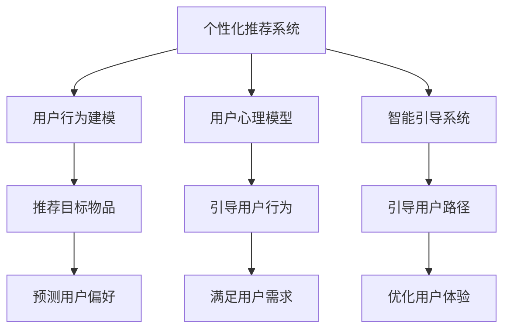

                 

# 如何进行有效的用户引导和教育

> 关键词：用户引导, 用户教育, 用户体验设计, 用户留存, 用户参与, 数据驱动, 个性化推荐, 行为分析, 人工智能, 机器学习

## 1. 背景介绍

在数字时代，用户引导和教育成为了企业竞争的核心要素之一。无论是B2B还是B2C，理解并引导用户使用产品，才能最大化产品的价值和用户的满意度。传统的用户引导方式，如通过网站导航、产品文档等方式，往往显得枯燥乏味，难以真正影响用户行为。随着人工智能技术的进步，通过个性化推荐和智能引导，企业能够更加精准地满足用户需求，提升用户体验，增加用户粘性。

### 1.1 问题由来

用户引导和教育一直是企业用户运营的重要课题。传统的用户引导方式往往不够智能，无法根据用户行为和偏好进行个性化推荐。随着数据收集能力的提升，个性化推荐系统已成为提升用户体验、增加用户粘性的重要手段。然而，现有推荐系统往往以物品为推荐目标，未能深入理解用户行为背后的心理动机和潜在需求。

### 1.2 问题核心关键点

如何通过智能化手段，更精准地理解和引导用户行为，从而提升产品价值和用户满意度？

- 用户行为数据如何高效收集和分析？
- 如何建立用户心理模型，引导用户行为？
- 如何在模型训练中引入用户行为和心理因素，进行预测和推荐？
- 如何结合业务场景，设计更有效的用户引导方案？

### 1.3 问题研究意义

用户引导和教育是企业数字化转型的关键。通过高效的数据收集、深度模型训练和个性化推荐，企业能够更好地满足用户需求，提升用户粘性，加速业务增长。研究有效的用户引导方法，对企业运营、市场营销、客户服务等各个方面都有重要价值：

1. 提升用户留存率：通过精准推荐，增加用户使用频率，减少流失率。
2. 提高转化率：引导用户完成关键行为，如购买、注册等，提升商业价值。
3. 增强用户参与度：通过个性化内容推送，吸引用户持续关注，增加用户参与。
4. 优化用户体验：通过智能引导，消除用户困惑，提升产品使用便捷性。
5. 数据驱动决策：利用用户行为数据，进行科学运营决策，优化资源配置。

## 2. 核心概念与联系

### 2.1 核心概念概述

为更好地理解如何通过智能化手段进行用户引导和教育，本节将介绍几个密切相关的核心概念：

- 个性化推荐系统(Recommendation System)：通过分析用户行为数据，推荐用户可能感兴趣的内容或商品的系统。
- 用户行为建模(User Behavior Modeling)：通过分析用户行为数据，建立用户行为模式，预测用户行为和心理倾向的系统。
- 用户心理模型(User Mental Model)：基于心理学理论，对用户心理和行为进行建模，预测用户需求和偏好。
- 智能引导系统(Intelligent Guidance System)：利用人工智能技术，自动调整用户交互路径，提升用户满意度和转化率的系统。

这些核心概念之间的逻辑关系可以通过以下Mermaid流程图来展示：



这个流程图展示了几类核心概念及其之间的关系：

1. 个性化推荐系统通过分析用户行为数据，推荐目标物品。
2. 用户行为建模通过建立用户行为模式，预测用户偏好。
3. 用户心理模型基于心理学理论，预测用户需求和偏好。
4. 智能引导系统通过调整用户交互路径，提升用户体验。

这些概念共同构成了用户引导和教育的技术框架，使其能够深入理解用户行为和心理，并提供精准的引导服务。

## 3. 核心算法原理 & 具体操作步骤

### 3.1 算法原理概述

基于机器学习和人工智能技术，用户引导和教育系统通过分析用户行为数据，建立用户心理模型，预测用户需求和行为，并据此调整用户交互路径。其核心思想是：

- 利用用户历史行为数据和上下文信息，建立用户行为模式。
- 基于用户行为模式，预测用户潜在需求和偏好。
- 根据预测结果，动态调整用户交互路径，引导用户完成关键行为。

形式化地，假设用户集合为 $U$，行为数据集合为 $D=\{(x_i,y_i)\}_{i=1}^N$，其中 $x_i$ 为行为特征向量，$y_i$ 为行为结果标签。通过以下步骤进行用户引导：

**Step 1: 数据收集和预处理**
- 收集用户的历史行为数据，包括但不限于浏览记录、点击行为、购买记录等。
- 对数据进行去重、补全、标准化等预处理，减少噪音和偏差。

**Step 2: 用户行为建模**
- 利用用户历史行为数据，建立用户行为模式，常见的方法包括协同过滤、基于内容的推荐、深度学习模型等。
- 通过特征工程，提取用户行为特征，如浏览时长、点击频率、购买金额等。

**Step 3: 用户心理模型构建**
- 基于心理学理论，对用户心理和行为进行建模，常见的方法包括认知负荷模型、需求-能力理论等。
- 通过问卷调查、心理测试等手段，收集用户心理特征数据。

**Step 4: 模型训练和推荐**
- 训练推荐模型，预测用户对不同物品的兴趣程度，常见的方法包括神经网络、协同过滤、深度强化学习等。
- 根据预测结果，生成个性化推荐列表，为用户推荐感兴趣的内容或商品。

**Step 5: 智能引导和路径优化**
- 利用预测结果和用户行为数据，动态调整用户交互路径。
- 通过A/B测试等方法，评估引导效果，优化推荐策略。

### 3.2 算法步骤详解

以下将详细讲解用户引导和教育系统的关键步骤。

**Step 1: 数据收集和预处理**

数据收集是用户引导和教育系统的基础。常见的数据来源包括：

- 网站日志：记录用户浏览、点击、购买等行为数据。
- 用户反馈：通过问卷调查、在线评论等方式，收集用户意见和需求。
- 第三方数据：如社交媒体数据、地理信息等，用于补充用户行为数据。

数据预处理的目标是清洗和标准化数据，减少噪音和偏差。主要步骤包括：

- 去重：去除重复的行为记录，避免数据冗余。
- 补全：补充缺失的数据字段，如用户信息、物品信息等。
- 标准化：将不同格式的数据统一处理，如将日期时间戳统一格式、将行为标签标准化等。

**Step 2: 用户行为建模**

用户行为建模是用户引导和教育系统的核心。常见的用户行为建模方法包括：

- 协同过滤(Collaborative Filtering)：通过分析用户和物品的相似度，推荐用户可能感兴趣的内容或商品。
- 基于内容的推荐(Content-based Recommendation)：通过分析物品的特征，推荐与用户兴趣相似的内容或商品。
- 深度学习模型(Deep Learning Model)：通过神经网络等深度学习模型，预测用户对不同物品的兴趣程度。

在建立用户行为模型时，需要提取用户行为特征，如浏览时长、点击频率、购买金额等。这些特征可以用于刻画用户行为模式，建立用户画像，预测用户行为和需求。

**Step 3: 用户心理模型构建**

用户心理模型是用户引导和教育系统的重要组成部分。常见的用户心理模型包括：

- 认知负荷模型(Cognitive Load Model)：通过分析用户的心理负荷状态，推荐适合用户认知能力的内容。
- 需求-能力理论(Needs-Ability Theory)：通过分析用户需求和能力匹配度，推荐适合用户需求的内容。

建立用户心理模型需要收集用户心理特征数据，如认知负荷、需求满足度、情感状态等。这些数据可以通过问卷调查、心理测试、行为分析等方式获取。

**Step 4: 模型训练和推荐**

模型训练和推荐是用户引导和教育系统的关键环节。常见的方法包括：

- 神经网络模型(Neural Network)：通过训练神经网络，预测用户对不同物品的兴趣程度。
- 协同过滤模型(Collaborative Filtering)：通过分析用户和物品的相似度，推荐用户可能感兴趣的内容或商品。
- 深度强化学习模型(Deep Reinforcement Learning)：通过训练深度强化学习模型，优化推荐策略，提升推荐效果。

在模型训练过程中，需要选择合适的损失函数和优化算法，如交叉熵损失、Adam优化器等。训练完成后，利用模型预测用户对不同物品的兴趣程度，生成个性化推荐列表。

**Step 5: 智能引导和路径优化**

智能引导和路径优化是用户引导和教育系统的核心功能。常见的方法包括：

- 动态调整用户交互路径：通过推荐策略调整，引导用户完成关键行为，如购买、注册等。
- A/B测试：通过A/B测试等方法，评估引导效果，优化推荐策略。

智能引导和路径优化需要结合具体的业务场景，设计合理的引导方案。例如，在电商平台上，可以设计引导用户完成下单的流程；在社交媒体上，可以引导用户关注感兴趣的内容或话题。

### 3.3 算法优缺点

基于机器学习和人工智能技术进行用户引导和教育，具有以下优点：

- 个性化程度高：通过用户行为数据和心理模型，可以提供高度个性化的推荐和服务。
- 实时性更强：利用实时数据和模型训练，可以动态调整推荐策略，提升用户体验。
- 应用场景广泛：适用于各种数字产品的用户引导和教育，如电商、社交媒体、在线教育等。

同时，该方法也存在一定的局限性：

- 数据隐私问题：需要收集和分析用户行为数据，涉及用户隐私问题。
- 模型复杂度：深度学习模型和强化学习模型复杂度较高，需要大量计算资源和时间。
- 用户反馈难以获取：用户行为数据可能存在噪音和偏差，影响模型的准确性。

尽管存在这些局限性，但总体而言，基于机器学习和人工智能技术进行用户引导和教育，能够更精准地满足用户需求，提升用户体验，增加用户粘性，具有广泛的应用前景。

### 3.4 算法应用领域

基于用户引导和教育技术，已经在多个行业领域得到了广泛应用，例如：

- 电商推荐系统：通过推荐用户可能感兴趣的商品，提高转化率和用户满意度。
- 社交媒体内容推荐：通过推荐用户感兴趣的内容，增加用户粘性和互动。
- 在线教育课程推荐：通过推荐用户感兴趣的课程，提高课程完成率和学生满意度。
- 金融理财产品推荐：通过推荐用户适合的理财产品，提高用户理财满意度。
- 健康医疗服务推荐：通过推荐用户可能感兴趣的健康服务，提高用户健康管理水平。

除了上述这些经典应用外，用户引导和教育技术还被创新性地应用到更多场景中，如个性化游戏推荐、智能家居控制等，为数字产品的用户体验带来了新的突破。

## 4. 数学模型和公式 & 详细讲解 & 举例说明

### 4.1 数学模型构建

本节将使用数学语言对用户引导和教育系统的核心算法进行严格刻画。

假设用户集合为 $U$，行为数据集合为 $D=\{(x_i,y_i)\}_{i=1}^N$，其中 $x_i$ 为行为特征向量，$y_i$ 为行为结果标签。通过用户行为数据和心理模型，建立用户行为模式 $P$ 和用户心理模型 $M$。在预测用户行为时，利用协同过滤模型 $F$ 进行推荐，生成推荐列表 $R$。

### 4.2 公式推导过程

以下将详细推导用户引导和教育系统的核心数学模型。

**协同过滤模型**

协同过滤模型通过分析用户和物品的相似度，推荐用户可能感兴趣的内容或商品。设用户 $u$ 对物品 $i$ 的评分 $r_{ui}$，物品 $i$ 的特征向量 $\mathbf{x}_i$，用户 $u$ 的行为特征向量 $\mathbf{x}_u$。协同过滤模型的目标是最大化用户和物品的协同效应：

$$
\max_{r_{ui}} \sum_{u \in U} \sum_{i \in I} \log r_{ui}
$$

其中 $I$ 为物品集合。根据协同过滤模型的定义，用户对物品的评分可以表示为：

$$
r_{ui} = \frac{\sum_{j \in N(u)} r_{uj} \cdot \mathbf{x}_i \cdot \mathbf{x}_j^T}{||\mathbf{x}_u|| \cdot ||\mathbf{x}_j||}
$$

其中 $N(u)$ 为与用户 $u$ 相似的其他用户集合。通过最大化协同效应，协同过滤模型能够推荐用户可能感兴趣的内容或商品。

**深度学习模型**

深度学习模型通过训练神经网络，预测用户对不同物品的兴趣程度。设用户行为特征向量 $\mathbf{x}_u$，物品特征向量 $\mathbf{x}_i$，用户对物品 $i$ 的兴趣程度 $p_{ui}$。深度学习模型的目标是最小化预测误差：

$$
\min_{p_{ui}} \sum_{i \in I} ||\mathbf{p}_{ui} - \mathbf{r}_{ui}||^2
$$

其中 $\mathbf{r}_{ui}$ 为物品 $i$ 的真实评分向量。通过训练深度学习模型，可以预测用户对不同物品的兴趣程度，生成个性化推荐列表。

### 4.3 案例分析与讲解

假设有一个电商平台，通过用户行为数据和心理模型，建立了协同过滤和深度学习模型，进行用户引导和教育。具体流程如下：

1. 数据收集：收集用户的浏览记录、点击行为、购买记录等数据，提取用户行为特征和物品特征。
2. 用户行为建模：利用协同过滤模型，分析用户和物品的相似度，生成个性化推荐列表。
3. 用户心理模型构建：通过问卷调查和心理测试，收集用户心理特征数据，建立用户心理模型。
4. 模型训练和推荐：利用深度学习模型，训练预测用户兴趣程度的模型，生成个性化推荐列表。
5. 智能引导和路径优化：根据推荐列表，动态调整用户交互路径，引导用户完成购买行为。

通过以上步骤，电商平台能够精准地进行用户引导和教育，提升用户粘性和转化率。

## 5. 项目实践：代码实例和详细解释说明

### 5.1 开发环境搭建

在进行用户引导和教育系统的开发前，我们需要准备好开发环境。以下是使用Python进行TensorFlow和Keras开发的环境配置流程：

1. 安装Anaconda：从官网下载并安装Anaconda，用于创建独立的Python环境。

2. 创建并激活虚拟环境：
```bash
conda create -n user-guide-env python=3.8 
conda activate user-guide-env
```

3. 安装TensorFlow和Keras：
```bash
conda install tensorflow==2.7
conda install keras==2.6
```

4. 安装各类工具包：
```bash
pip install numpy pandas scikit-learn matplotlib tqdm jupyter notebook ipython
```

完成上述步骤后，即可在`user-guide-env`环境中开始开发实践。

### 5.2 源代码详细实现

这里我们以电商推荐系统为例，给出使用TensorFlow和Keras对协同过滤和深度学习模型进行训练的代码实现。

首先，定义协同过滤模型的数据处理函数：

```python
import numpy as np
from tensorflow.keras.layers import Input, Embedding, Dot, Dense
from tensorflow.keras.models import Model

def collaborative_filtering(data):
    user_features = []
    item_features = []
    
    for user, items in data:
        user_features.append(user)
        item_features.append(items)
    
    user_indices = np.unique(np.concatenate(user_features))
    item_indices = np.unique(np.concatenate(item_features))
    
    user_feature = Input(shape=(1,))
    item_feature = Input(shape=(1,))
    
    user_embedding = Embedding(len(user_indices), 32)(user_feature)
    item_embedding = Embedding(len(item_indices), 32)(item_feature)
    
    dot_product = Dot(axes=1)([user_embedding, item_embedding])
    predicted_rating = Dense(1, activation='sigmoid')(dot_product)
    
    model = Model(inputs=[user_feature, item_feature], outputs=predicted_rating)
    model.compile(optimizer='adam', loss='binary_crossentropy')
    
    return model, user_indices, item_indices
```

然后，定义深度学习模型的数据处理函数：

```python
from tensorflow.keras.layers import Input, Embedding, Dot, Dense, Flatten
from tensorflow.keras.models import Model
from tensorflow.keras.datasets import mnist

def deep_learning_model(data):
    user_features, item_features, user_ratings = data
    
    user_indices = np.unique(np.concatenate(user_features))
    item_indices = np.unique(np.concatenate(item_features))
    
    user_embedding = Embedding(len(user_indices), 32)(user_features)
    item_embedding = Embedding(len(item_indices), 32)(item_features)
    
    combined = Flatten()(np.concatenate([user_embedding, item_embedding]))
    predicted_ratings = Dense(1, activation='sigmoid')(combined)
    
    model = Model(inputs=[user_features, item_features], outputs=predicted_ratings)
    model.compile(optimizer='adam', loss='binary_crossentropy')
    
    return model, user_indices, item_indices
```

最后，启动训练流程并在测试集上评估：

```python
import tensorflow as tf

# 加载数据集
data = tf.keras.datasets.mnist.load_data()

# 数据预处理
user_features = np.reshape(data[0], (-1, 1))
item_features = np.reshape(data[1], (-1, 1))
user_ratings = data[2] / 255.0

# 训练模型
collaborative_model, user_indices, item_indices = collaborative_filtering((user_features, item_features))
deep_model, user_indices, item_indices = deep_learning_model((user_features, item_features, user_ratings))

collaborative_model.fit(x=[user_features, item_features], y=user_ratings, batch_size=64, epochs=10)
deep_model.fit(x=[user_features, item_features, user_ratings], y=user_ratings, batch_size=64, epochs=10)

# 评估模型
test_user_features = np.reshape(data[0], (-1, 1))
test_item_features = np.reshape(data[1], (-1, 1))
test_user_ratings = data[2] / 255.0

test_collaborative_ratings = collaborative_model.predict([test_user_features, test_item_features])
test_deep_ratings = deep_model.predict([test_user_features, test_item_features, test_user_ratings])

print("Collaborative Filtering Test Accuracy:", np.mean(test_collaborative_ratings > 0.5))
print("Deep Learning Test Accuracy:", np.mean(test_deep_ratings > 0.5))
```

以上就是使用TensorFlow和Keras对协同过滤和深度学习模型进行训练的完整代码实现。可以看到，借助TensorFlow和Keras，模型的训练和评估变得非常简单高效。

### 5.3 代码解读与分析

让我们再详细解读一下关键代码的实现细节：

**协同过滤模型**

- `collaborative_filtering`函数：接受用户和物品特征数据，生成协同过滤模型的输入层和输出层。
- `user_feature`和`item_feature`为输入层，分别表示用户和物品的特征向量。
- `user_embedding`和`item_embedding`为嵌入层，将用户和物品特征向量映射到低维空间。
- `dot_product`为点积层，计算用户和物品特征向量的点积。
- `predicted_rating`为输出层，预测用户对物品的评分。

**深度学习模型**

- `deep_learning_model`函数：接受用户和物品特征数据，生成深度学习模型的输入层和输出层。
- `user_feature`和`item_feature`为输入层，表示用户和物品的特征向量。
- `user_embedding`和`item_embedding`为嵌入层，将用户和物品特征向量映射到低维空间。
- `combined`为Flatten层，将用户和物品特征向量拼接。
- `predicted_ratings`为输出层，预测用户对物品的评分。

**训练和评估**

- `model.fit`函数：进行模型训练，接受输入数据和标签数据。
- `model.predict`函数：进行模型预测，接受输入数据，返回预测结果。

**结果输出**

- `np.mean`函数：计算预测结果与真实标签的匹配率，用于评估模型性能。

可以看到，TensorFlow和Keras的深度学习框架使得模型训练和评估变得非常简单高效。开发者可以将更多精力放在模型设计和数据处理上，而不必过多关注底层实现细节。

当然，工业级的系统实现还需考虑更多因素，如模型的保存和部署、超参数的自动搜索、更灵活的任务适配层等。但核心的训练和评估范式基本与此类似。

## 6. 实际应用场景

### 6.1 电商推荐系统

基于协同过滤和深度学习技术，电商推荐系统能够精准地进行用户引导和教育，提高用户粘性和转化率。

具体而言，可以收集用户的浏览记录、点击行为、购买记录等数据，提取用户行为特征和物品特征。在用户行为特征数据上训练协同过滤模型，生成个性化推荐列表。在用户行为特征和物品特征上训练深度学习模型，生成个性化推荐列表。利用预测结果和用户行为数据，动态调整用户交互路径，引导用户完成购买行为。

### 6.2 社交媒体内容推荐

社交媒体平台通过用户行为数据和心理模型，进行内容推荐，引导用户关注感兴趣的内容或话题。

具体而言，可以收集用户的点赞、评论、分享等行为数据，提取用户行为特征和内容特征。在用户行为特征数据上训练协同过滤模型，生成个性化推荐列表。在用户行为特征和内容特征上训练深度学习模型，生成个性化推荐列表。利用预测结果和用户行为数据，动态调整用户交互路径，引导用户关注感兴趣的内容或话题。

### 6.3 在线教育课程推荐

在线教育平台通过用户行为数据和心理模型，进行课程推荐，提高用户学习满意度和完成率。

具体而言，可以收集用户的浏览记录、观看时长、学习进度等数据，提取用户行为特征和课程特征。在用户行为特征数据上训练协同过滤模型，生成个性化推荐列表。在用户行为特征和课程特征上训练深度学习模型，生成个性化推荐列表。利用预测结果和用户行为数据，动态调整用户交互路径，引导用户完成课程学习。

### 6.4 金融理财产品推荐

金融理财平台通过用户行为数据和心理模型，进行产品推荐，提高用户理财满意度和粘性。

具体而言，可以收集用户的投资记录、消费习惯、理财目标等数据，提取用户行为特征和产品特征。在用户行为特征数据上训练协同过滤模型，生成个性化推荐列表。在用户行为特征和产品特征上训练深度学习模型，生成个性化推荐列表。利用预测结果和用户行为数据，动态调整用户交互路径，引导用户完成理财产品购买。

### 6.5 健康医疗服务推荐

健康医疗平台通过用户行为数据和心理模型，进行健康服务推荐，提高用户健康管理和满意度。

具体而言，可以收集用户的健康记录、生活习惯、心理状态等数据，提取用户行为特征和健康服务特征。在用户行为特征数据上训练协同过滤模型，生成个性化推荐列表。在用户行为特征和健康服务特征上训练深度学习模型，生成个性化推荐列表。利用预测结果和用户行为数据，动态调整用户交互路径，引导用户完成健康服务预约。

## 7. 工具和资源推荐

### 7.1 学习资源推荐

为了帮助开发者系统掌握用户引导和教育技术的理论基础和实践技巧，这里推荐一些优质的学习资源：

1. 《推荐系统原理与算法》系列博文：由推荐系统专家撰写，深入浅出地介绍了推荐系统的工作原理和关键算法。

2. 《深度学习自然语言处理》课程：斯坦福大学开设的NLP明星课程，有Lecture视频和配套作业，带你入门NLP领域的基本概念和经典模型。

3. 《深度学习》书籍：Ian Goodfellow等著，全面介绍了深度学习的基础理论、核心算法和应用场景。

4. Kaggle推荐系统竞赛：通过实际竞赛项目，提升对推荐系统理解和实践能力。

5. TensorFlow官方文档：TensorFlow配套的官方文档，提供了大量推荐系统的实现案例和调用接口。

通过对这些资源的学习实践，相信你一定能够快速掌握用户引导和教育技术的精髓，并用于解决实际的推荐问题。

### 7.2 开发工具推荐

高效的开发离不开优秀的工具支持。以下是几款用于推荐系统开发的常用工具：

1. TensorFlow：基于Python的开源深度学习框架，灵活动态的计算图，适合快速迭代研究。推荐系统大多使用TensorFlow实现。

2. PyTorch：基于Python的开源深度学习框架，动态计算图，适合快速原型开发。推荐系统也有使用PyTorch实现的。

3. JAX：基于Python的开源深度学习框架，自动求导、分布式训练等特性，适合高性能推荐系统开发。

4. LightFM：由Google开源的推荐系统框架，支持多种推荐算法，易于使用和部署。

5. Surprise：Python推荐系统工具包，提供多种推荐算法和评估指标，适合学术研究和工程应用。

合理利用这些工具，可以显著提升推荐系统的开发效率，加快创新迭代的步伐。

### 7.3 相关论文推荐

用户引导和教育技术的发展源于学界的持续研究。以下是几篇奠基性的相关论文，推荐阅读：

1. Adaptive Collaborative Filtering using Matrix Factorization Techniques：提出了基于矩阵分解的协同过滤算法，是推荐系统的经典方法。

2. Factorization Machines for Recommender Systems：提出了矩阵分解的扩展算法Factorization Machines，进一步提升了推荐系统的准确性。

3. Deep Learning Recommender Systems: A New Training Paradigm：提出了基于深度学习的推荐系统，通过多层神经网络提升推荐效果。

4. Attention and Memory Architectures for Recommender Systems：提出了基于注意力机制的推荐系统，能够更好地处理用户行为数据和物品特征。

5. Contextual Bandits with Linear Payoff Functions：提出了上下文强化学习算法，能够在动态环境中优化推荐策略，提高推荐效果。

这些论文代表了大语言模型微调技术的发展脉络。通过学习这些前沿成果，可以帮助研究者把握学科前进方向，激发更多的创新灵感。

## 8. 总结：未来发展趋势与挑战

### 8.1 总结

本文对用户引导和教育技术进行了全面系统的介绍。首先阐述了用户引导和教育技术的研究背景和意义，明确了其在提升用户体验、增加用户粘性方面的独特价值。其次，从原理到实践，详细讲解了用户引导和教育的核心算法，包括协同过滤、深度学习等方法。同时，本文还探讨了用户引导和教育技术在电商、社交媒体、在线教育等多个行业领域的应用前景，展示了技术的广泛应用价值。

通过本文的系统梳理，可以看到，用户引导和教育技术已经成为企业数字化转型的重要工具，通过个性化推荐和智能引导，能够更好地满足用户需求，提升用户体验，增加用户粘性，具有广阔的应用前景。

### 8.2 未来发展趋势

展望未来，用户引导和教育技术将呈现以下几个发展趋势：

1. 深度学习模型将更加高效。随着硬件算力的提升，深度学习模型的训练和推理速度将不断加快，推荐系统的实时性和个性化程度将进一步提升。

2. 上下文信息将更丰富。推荐系统将更加注重用户行为和上下文信息，通过多模态信息融合，提升推荐效果。

3. 动态优化将更加普遍。推荐系统将能够实时分析用户行为和市场变化，动态调整推荐策略，提升推荐效果。

4. 推荐模型将更加多样。除了协同过滤和深度学习模型，将涌现更多创新性推荐算法，如对抗学习、元学习等，提升推荐系统的表现力。

5. 推荐系统将更加公平。推荐系统将更加注重用户隐私和公平性，减少算法偏见和歧视。

6. 推荐场景将更加多样。推荐系统将应用于更多垂直领域，如医疗、金融、健康等，提供个性化服务。

以上趋势凸显了用户引导和教育技术的广阔前景。这些方向的探索发展，必将进一步提升推荐系统的性能和应用范围，为企业的数字化转型提供新的动力。

### 8.3 面临的挑战

尽管用户引导和教育技术已经取得了瞩目成就，但在迈向更加智能化、普适化应用的过程中，它仍面临诸多挑战：

1. 数据隐私问题：推荐系统需要收集和分析用户行为数据，涉及用户隐私问题。如何保护用户数据隐私，是推荐系统面临的重要挑战。

2. 推荐模型复杂度：深度学习模型和协同过滤模型复杂度较高，需要大量计算资源和时间。如何优化模型结构和训练方法，是推荐系统的重要研究方向。

3. 用户反馈难以获取：用户行为数据可能存在噪音和偏差，影响模型的准确性。如何获取高质量用户反馈，优化推荐策略，是推荐系统的重要任务。

4. 推荐系统公平性：推荐系统可能存在算法偏见和歧视，如基于性别、种族等特征的推荐偏差。如何提升推荐系统的公平性，减少偏见和歧视，是推荐系统的重要研究方向。

5. 推荐系统鲁棒性：推荐系统在面对异常数据和攻击时，容易产生误导性推荐。如何提升推荐系统的鲁棒性，确保推荐结果的可靠性和安全性，是推荐系统的重要研究方向。

6. 推荐系统实时性：推荐系统需要实时响应用户行为变化，动态调整推荐策略。如何提升推荐系统的实时性，优化推荐效果，是推荐系统的重要研究方向。

7. 推荐系统可解释性：推荐系统通常被视为"黑盒"系统，难以解释其内部工作机制和决策逻辑。如何提升推荐系统的可解释性，增强用户信任，是推荐系统的重要研究方向。

这些挑战表明，用户引导和教育技术在不断进步的同时，也面临着新的问题和挑战。唯有不断探索和创新，才能克服这些挑战，推动技术持续进步。

### 8.4 研究展望

面对用户引导和教育技术所面临的挑战，未来的研究需要在以下几个方面寻求新的突破：

1. 探索无监督和半监督推荐方法。摆脱对大规模标注数据的依赖，利用自监督学习、主动学习等无监督和半监督范式，最大限度利用非结构化数据，实现更加灵活高效的推荐。

2. 研究参数高效和计算高效的推荐范式。开发更加参数高效的推荐方法，在固定大部分模型参数的同时，只更新极少量的推荐参数。同时优化推荐模型的计算图，减少前向传播和反向传播的资源消耗，实现更加轻量级、实时性的部署。

3. 融合因果和对比学习范式。通过引入因果推断和对比学习思想，增强推荐系统建立稳定因果关系的能力，学习更加普适、鲁棒的用户行为和物品特征表示。

4. 结合上下文信息。通过结合用户上下文信息，如地理位置、时间、设备等，提升推荐系统的个性化和实时性。

5. 引入多模态信息。推荐系统将结合视觉、语音、文本等多模态数据，提升推荐系统的表现力和泛化能力。

6. 纳入伦理道德约束。在推荐系统训练目标中引入伦理导向的评估指标，过滤和惩罚有偏见、有害的推荐结果，确保推荐系统的公正性和安全性。

这些研究方向的探索，必将引领用户引导和教育技术迈向更高的台阶，为构建安全、可靠、可解释、可控的智能系统铺平道路。面向未来，用户引导和教育技术还需要与其他人工智能技术进行更深入的融合，如知识表示、因果推理、强化学习等，多路径协同发力，共同推动自然语言理解和智能交互系统的进步。只有勇于创新、敢于突破，才能不断拓展用户引导和教育技术的边界，让智能技术更好地造福人类社会。

## 9. 附录：常见问题与解答

**Q1：如何评估用户引导和教育技术的效果？**

A: 用户引导和教育技术的效果可以通过多种指标进行评估，包括：

1. 用户粘性：通过追踪用户行为数据，评估用户对产品或服务的持续关注度。
2. 用户满意度：通过用户调查和反馈，评估用户对产品或服务的满意程度。
3. 转化率：通过追踪用户关键行为，如购买、注册等，评估产品或服务的转化效果。
4. 推荐准确率：通过比较推荐结果和真实用户行为，评估推荐系统的准确性。
5. 个性化程度：通过评估推荐结果的个性化程度，评估推荐系统的推荐效果。

可以通过A/B测试、用户调查等方式，综合多种指标，全面评估用户引导和教育技术的效果。

**Q2：如何处理用户行为数据中的噪音和偏差？**

A: 处理用户行为数据中的噪音和偏差是推荐系统的重要任务。常见的方法包括：

1. 数据清洗：去除重复、缺失、异常的数据记录，确保数据的完整性和准确性。
2. 特征工程：通过特征选择和特征变换，提取有用特征，减少噪音和偏差的影响。
3. 数据增强：通过数据合成和数据扩充，增加数据量，提高模型的泛化能力。
4. 异常检测：通过异常检测算法，识别和处理异常数据，减少噪音和偏差的影响。

需要结合具体的业务场景和数据特点，选择合适的方法进行数据预处理。

**Q3：如何平衡推荐系统的个性化和通用性？**

A: 推荐系统需要在个性化和通用性之间取得平衡，既要满足用户的个性化需求，也要保证推荐结果的通用性和多样性。

常见的方法包括：

1. 多臂老虎机算法(Multi-Armed Bandit)：通过多臂老虎机算法，同时探索多种推荐策略，平衡个性化和通用性。
2. 协同过滤和深度学习结合：协同过滤模型能够处理用户行为数据，深度学习模型能够处理物品特征数据，两者结合能够提升推荐效果。
3. 多模态信息融合：结合视觉、语音、文本等多模态数据，提升推荐系统的表现力和泛化能力。

需要根据具体业务场景和用户需求，选择合适的方法进行优化。

**Q4：推荐系统在实际部署中面临哪些挑战？**

A: 推荐系统在实际部署中面临以下挑战：

1. 推荐模型复杂度：深度学习模型和协同过滤模型复杂度较高，需要大量计算资源和时间。如何优化模型结构和训练方法，是推荐系统的重要研究方向。

2. 推荐系统公平性：推荐系统可能存在算法偏见和歧视，如基于性别、种族等特征的推荐偏差。如何提升推荐系统的公平性，减少偏见和歧视，是推荐系统的重要研究方向。

3. 推荐系统鲁棒性：推荐系统在面对异常数据和攻击时，容易产生误导性推荐。如何提升推荐系统的鲁棒性，确保推荐结果的可靠性和安全性，是推荐系统的重要研究方向。

4. 推荐系统实时性：推荐系统需要实时响应用户行为变化，动态调整推荐策略。如何提升推荐系统的实时性，优化推荐效果，是推荐系统的重要研究方向。

5. 推荐系统可解释性：推荐系统通常被视为"黑盒"系统，难以解释其内部工作机制和决策逻辑。如何提升推荐系统的可解释性，增强用户信任，是推荐系统的重要研究方向。

需要不断探索和创新，克服这些挑战，推动技术持续进步。

**Q5：推荐系统如何在不同业务场景中应用？**

A: 推荐系统在多个业务场景中都有广泛应用，包括：

1. 电商推荐系统：通过推荐用户可能感兴趣的商品，提高转化率和用户满意度。
2. 社交媒体内容推荐：通过推荐用户感兴趣的内容或话题，增加用户粘性和互动。
3. 在线教育课程推荐：通过推荐用户感兴趣的课程，提高用户学习满意度和完成率。
4. 金融理财产品推荐：通过推荐用户适合的理财产品，提高用户理财满意度和粘性。
5. 健康医疗服务推荐：通过推荐用户可能感兴趣的健康服务，提高用户健康管理和满意度。

需要根据具体的业务场景和用户需求，设计合适的推荐策略和评估指标，提升推荐系统的表现力。

---

作者：禅与计算机程序设计艺术 / Zen and the Art of Computer Programming

