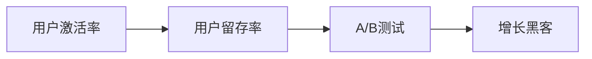

                 

# 如何进行有效的用户激活

## 1. 背景介绍

在互联网时代，用户激活（User Activation）成为一款产品能否成功的关键因素之一。无论是社交媒体、电子商务，还是在线教育，用户激活率直接影响着产品的市场竞争力和用户体验。然而，如何有效地吸引和保持用户，一直是产品开发者的挑战。本文将详细介绍如何进行有效的用户激活，包括核心概念、原理、算法步骤、数学模型、实际应用场景、工具和资源推荐、总结与展望等内容，为读者提供全面的指导。

## 2. 核心概念与联系

### 2.1 核心概念概述

在进行用户激活之前，我们需要了解以下几个核心概念：

- **用户激活率（User Activation Rate）**：指在一定时间内，启动并使用产品新功能或服务的用户占总用户数的比例。
- **用户留存率（User Retention Rate）**：指在一定时间内，持续使用产品或服务的用户占新用户总数的比例。
- **A/B测试（A/B Testing）**：通过将目标用户分成两组（A组和B组），测试两种不同方案的效果，以确定哪一种方案更优。
- **增长黑客（Growth Hacker）**：利用创新方法和技术，通过快速迭代和测试，持续优化产品，实现用户增长。

这些概念之间存在着紧密的联系，通过用户激活率和留存率，可以评估产品的健康度和用户粘性；通过A/B测试，可以找到最优的用户增长方案；而增长黑客则提供了一套完整的增长策略和方法论，指导产品开发者实现用户增长。

### 2.2 核心概念原理和架构的 Mermaid 流程图



## 3. 核心算法原理 & 具体操作步骤

### 3.1 算法原理概述

用户激活的核心在于设计出能够激发用户兴趣和行为的产品功能和交互流程。以下是一些常用的用户激活算法原理：

1. **用户分群（User Segmentation）**：根据用户的属性、行为和需求，将用户分成不同的群体，针对性地设计激活策略。
2. **推送通知（Push Notification）**：通过短信、邮件或应用内消息等形式，向用户推送有价值的信息或活动，吸引用户使用。
3. **个性化推荐（Personalized Recommendation）**：根据用户的历史行为和偏好，提供个性化的内容和推荐，增加用户的使用粘性。
4. **奖励机制（Reward Mechanism）**：通过积分、优惠券、免费试用等奖励措施，激励用户完成任务或使用新产品。

这些算法原理都需要通过具体的技术手段实现，以达到用户激活的目标。

### 3.2 算法步骤详解

**步骤1：用户分群**

1. **数据收集**：收集用户的基本信息、行为数据、历史互动记录等。
2. **特征提取**：利用机器学习算法，提取用户的核心特征，如年龄、性别、地域、消费习惯等。
3. **用户划分**：根据提取的特征，将用户分成不同的群体，如新用户、活跃用户、潜在流失用户等。

**步骤2：推送通知**

1. **设计推送内容**：根据用户分群结果，设计不同的推送内容，如优惠信息、活动预告、产品介绍等。
2. **选择推送渠道**：选择合适的推送渠道，如短信、邮件、应用内消息等，确保推送效果最大化。
3. **优化推送策略**：通过A/B测试，不断优化推送时间和频率，提高用户打开率和点击率。

**步骤3：个性化推荐**

1. **数据清洗与准备**：对用户的互动数据进行清洗和准备，去除噪音和异常值。
2. **特征工程**：构建推荐系统的特征，如用户行为、兴趣标签、物品属性等。
3. **模型训练**：使用机器学习算法，如协同过滤、内容过滤、深度学习等，训练推荐模型。
4. **推荐实现**：根据用户当前行为和偏好，实时生成个性化推荐，推送给用户。

**步骤4：奖励机制**

1. **设计奖励方案**：根据产品特性和用户需求，设计合适的奖励方案，如积分、优惠券、免费试用等。
2. **规则配置**：设置奖励的获取条件、有效期、使用限制等规则，确保奖励机制的公平性和有效性。
3. **用户反馈**：收集用户对奖励机制的反馈，不断调整和优化奖励策略。

### 3.3 算法优缺点

**优点**：

1. **精准高效**：通过用户分群和个性化推荐，能够针对性地吸引和保留用户，提高激活率和留存率。
2. **灵活多变**：通过A/B测试和增长黑客，可以不断优化产品和策略，适应不同的用户需求和市场变化。
3. **成本可控**：奖励机制可以根据用户贡献度进行精准分配，避免过度投入。

**缺点**：

1. **数据依赖**：用户激活算法需要大量高质量的数据支持，数据收集和处理成本较高。
2. **复杂度较高**：涉及多个系统和技术的集成，实施难度较大。
3. **隐私风险**：推送通知和个性化推荐涉及用户隐私数据的使用，需要严格遵守法律法规。

### 3.4 算法应用领域

用户激活算法广泛应用在以下领域：

- **社交媒体**：如Facebook、Instagram、Twitter等，通过推送朋友动态、社区活动等，增加用户互动和活跃度。
- **电子商务**：如Amazon、京东、淘宝等，通过个性化推荐、限时优惠等，提高用户购买转化率。
- **在线教育**：如Coursera、Udacity、EdX等，通过推送课程更新、学习成就等，提升用户参与度。
- **健康应用**：如Fitbit、MyFitnessPal、Strava等，通过奖励机制、个性化健身计划等，增强用户粘性。

## 4. 数学模型和公式 & 详细讲解 & 举例说明

### 4.1 数学模型构建

用户激活的数学模型可以建模为二元分类问题，即判断一个用户是否会在一定时间内激活或流失。常用的模型包括逻辑回归、随机森林、深度学习等。

设用户$i$在$t$时刻是否激活的概率为$P_i(t)$，则激活率$A$可以表示为：

$$
A = \frac{1}{N} \sum_{i=1}^N P_i(T)
$$

其中$N$为总用户数，$T$为用户激活的时间窗口。

### 4.2 公式推导过程

以逻辑回归模型为例，激活率的公式推导如下：

设用户$i$的特征向量为$x_i$，激活与否的标签为$y_i \in \{0, 1\}$，激活概率为$P_i = P(y_i = 1 | x_i)$，则逻辑回归模型的激活概率公式为：

$$
P_i = \frac{1}{1 + e^{-\theta^T x_i}}
$$

其中$\theta$为模型参数，$x_i$为特征向量。

### 4.3 案例分析与讲解

假设有一个电商网站，收集了用户的购买行为、浏览历史、评价等数据，希望通过逻辑回归模型预测新用户的激活率。具体步骤如下：

1. **数据准备**：将用户数据分成训练集和测试集。
2. **特征工程**：提取用户的基本信息、行为数据、评价数据等特征。
3. **模型训练**：使用逻辑回归模型，训练激活概率预测模型。
4. **结果评估**：在测试集上评估模型的预测效果，调整模型参数，优化预测准确率。

## 5. 项目实践：代码实例和详细解释说明

### 5.1 开发环境搭建

1. **Python环境准备**：确保Python版本为3.7以上，安装TensorFlow、Scikit-learn、Pandas等常用库。
2. **数据准备**：收集用户数据，进行预处理和清洗，确保数据质量。
3. **模型选择**：根据问题需求，选择合适的激活预测模型，如逻辑回归、随机森林、深度学习等。

### 5.2 源代码详细实现

以下是一个使用TensorFlow实现逻辑回归模型预测用户激活率的代码示例：

```python
import tensorflow as tf
import pandas as pd
from sklearn.model_selection import train_test_split

# 读取数据
data = pd.read_csv('user_data.csv')

# 特征工程
features = ['age', 'gender', 'location', 'purchase_history', 'review_score']
target = 'activation'

X = data[features]
y = data[target]

# 数据分割
X_train, X_test, y_train, y_test = train_test_split(X, y, test_size=0.2, random_state=42)

# 模型训练
model = tf.keras.models.Sequential([
    tf.keras.layers.Dense(32, activation='relu', input_shape=(len(features),)),
    tf.keras.layers.Dense(1, activation='sigmoid')
])
model.compile(optimizer='adam', loss='binary_crossentropy', metrics=['accuracy'])

model.fit(X_train, y_train, epochs=10, batch_size=32)

# 模型评估
loss, accuracy = model.evaluate(X_test, y_test)
print(f'Test accuracy: {accuracy:.2f}')
```

### 5.3 代码解读与分析

**数据准备**：
- `pd.read_csv`：读取用户数据。
- `train_test_split`：将数据集分割为训练集和测试集。

**模型训练**：
- `Sequential`：定义神经网络模型。
- `Dense`：定义全连接层，激活函数为ReLU和sigmoid。
- `compile`：配置优化器、损失函数和评估指标。
- `fit`：训练模型，参数包括训练次数、批次大小等。

**模型评估**：
- `evaluate`：在测试集上评估模型性能，输出损失和准确率。

### 5.4 运行结果展示

训练过程中，可以通过TensorBoard可视化模型的训练曲线和参数变化，帮助优化模型和调整超参数。

## 6. 实际应用场景

### 6.1 社交媒体用户激活

**应用场景**：Facebook通过推送朋友动态和社区活动，增加用户的活跃度和留存率。

**解决方案**：
- 收集用户的基本信息、互动数据、内容偏好等。
- 设计推送通知模板，涵盖动态内容、活动预告等。
- 利用A/B测试，不断优化推送内容和频率，提高用户打开率和点击率。

### 6.2 电子商务用户激活

**应用场景**：Amazon通过个性化推荐和限时优惠，提高用户的购买转化率。

**解决方案**：
- 收集用户的浏览历史、购买记录、评价等数据。
- 设计个性化推荐系统，根据用户行为和偏好生成推荐。
- 设计限时优惠活动，吸引用户进行购物。

### 6.3 在线教育用户激活

**应用场景**：Coursera通过推送课程更新和学习成就，提升用户的参与度。

**解决方案**：
- 收集用户的学习记录、评价、反馈等数据。
- 设计个性化推荐系统，推荐适合用户的课程。
- 推送课程更新和学习成就，增加用户粘性。

### 6.4 未来应用展望

未来，用户激活算法将更加注重多模态数据的融合和用户行为的全方位分析，以提升预测的准确性和个性化程度。例如，结合用户的位置信息、社交网络数据等，构建更加立体化的用户画像，实现更精准的激活策略。

## 7. 工具和资源推荐

### 7.1 学习资源推荐

1. **《用户增长之路：市场变化与挑战》**：这本书详细介绍了用户增长的理论和实践，涵盖用户激活、留存、推荐等多个方面。
2. **Coursera的“User Experience Design”课程**：通过实战案例，帮助读者掌握用户研究、设计思维等技能。
3. **Google Analytics**：通过分析用户行为数据，优化产品设计和用户体验。

### 7.2 开发工具推荐

1. **TensorFlow**：开源的机器学习框架，支持多种模型和算法。
2. **Scikit-learn**：Python常用的机器学习库，提供了多种算法和模型。
3. **Pandas**：数据处理和分析库，支持数据清洗和预处理。

### 7.3 相关论文推荐

1. **《Growth Hacking for Startups: Theory, Process, and Application》**：介绍了增长黑客的理论框架和实践方法。
2. **《User Growth: Creating Products and Services People Love》**：通过案例分析，探讨用户增长的关键要素和策略。
3. **《Designing for User Engagement》**：讨论了如何通过产品设计提升用户参与度和满意度。

## 8. 总结：未来发展趋势与挑战

### 8.1 研究成果总结

用户激活算法已经在多个行业取得成功应用，成为提升产品竞争力的重要手段。通过用户分群、推送通知、个性化推荐和奖励机制等策略，可以有效吸引和保留用户，提高激活率和留存率。

### 8.2 未来发展趋势

1. **多模态融合**：结合位置信息、社交网络数据等，构建立体化的用户画像，实现更精准的激活策略。
2. **实时分析和反馈**：利用大数据和机器学习，实现实时分析和反馈，及时调整产品策略。
3. **个性化推荐**：通过深度学习和协同过滤，实现更精准的个性化推荐，提升用户体验。

### 8.3 面临的挑战

1. **数据隐私和安全**：用户数据隐私和安全问题日益受到关注，需要严格遵守法律法规。
2. **技术复杂度**：用户激活算法涉及多个系统和技术的集成，实施难度较大。
3. **效果评估**：如何衡量用户激活效果，评估指标的选择和计算方法需要深入研究。

### 8.4 研究展望

未来，用户激活算法将继续发展，结合新技术和新方法，实现更高的预测准确性和更强的用户粘性。通过不断优化和迭代，为产品开发者提供更有力的工具和支持。

## 9. 附录：常见问题与解答

**Q1：什么是用户激活率？**

A：用户激活率指在一定时间内，启动并使用产品新功能或服务的用户占总用户数的比例。

**Q2：如何进行用户分群？**

A：用户分群需要收集用户的基本信息、行为数据、历史互动记录等，通过机器学习算法提取用户核心特征，然后根据特征将用户分成不同的群体。

**Q3：用户激活算法有哪些优点和缺点？**

A：优点包括精准高效、灵活多变、成本可控等。缺点包括数据依赖、复杂度高、隐私风险等。

**Q4：如何设计推送通知？**

A：设计推送通知需要根据用户分群结果，选择合适的推送内容，选择适当的推送渠道，优化推送策略，通过A/B测试找到最佳的推送时间和频率。

**Q5：如何实现个性化推荐？**

A：个性化推荐需要数据清洗和准备，构建推荐系统的特征，使用机器学习算法训练推荐模型，根据用户当前行为和偏好实时生成个性化推荐。

---

作者：禅与计算机程序设计艺术 / Zen and the Art of Computer Programming

