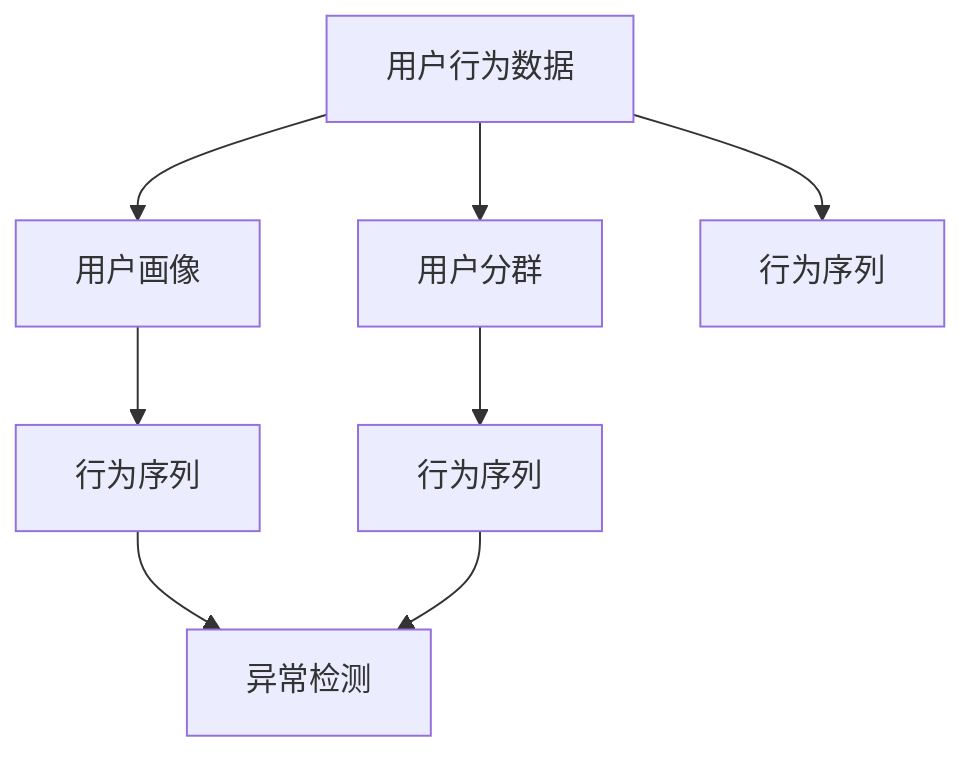

                 

# 如何进行有效的用户行为分析

> 关键词：用户行为分析, 数据挖掘, 机器学习, 推荐系统, 自然语言处理(NLP), 时间序列分析, 异常检测, 特征工程

## 1. 背景介绍

### 1.1 问题由来

在互联网和移动互联网时代，用户行为数据日益丰富，如何从海量的用户数据中提取有价值的信息，分析用户需求，优化用户体验，成为企业数字化转型的重要课题。用户行为分析不仅能够为企业提供用户画像，指导产品改进，还能够帮助市场营销和运营决策，增强用户粘性和忠诚度，提升企业整体竞争力。

传统的数据分析方法，如统计分析、A/B测试、用户调查等，需要耗费大量时间和人力，且难以覆盖全量用户行为数据，无法满足实时性和全面性的需求。而数据挖掘和机器学习技术的发展，为大规模用户行为分析提供了新的工具和手段，使其成为可能。

### 1.2 问题核心关键点

用户行为分析的核心在于如何从复杂多变的用户数据中提取有意义的特征，利用机器学习算法进行建模预测，最终生成有价值的洞察和行动建议。主要涉及以下几个关键点：

1. **数据采集与处理**：采集用户行为数据，包括访问记录、点击行为、购买记录等，然后进行清洗、整合、预处理等操作，为后续分析提供高质量的数据源。

2. **特征工程**：从原始数据中提取有用特征，如用户属性、行为频次、行为路径等，为模型训练提供丰富的输入信息。

3. **算法选择与模型构建**：根据具体问题选择合适的机器学习算法和模型结构，如分类、聚类、回归、关联规则挖掘等，训练出高效准确的预测模型。

4. **模型评估与优化**：对训练好的模型进行评估，选择合适的评价指标，如准确率、召回率、F1值等，并根据评估结果调整模型参数，提升模型性能。

5. **应用与反馈**：将训练好的模型应用于实际业务场景中，生成洞察报告和行动建议，同时不断收集反馈，优化模型和分析方法。

### 1.3 问题研究意义

用户行为分析对企业意义重大：

1. **增强用户理解**：通过深入分析用户行为数据，企业能够更好地理解用户需求和行为模式，优化产品设计和用户体验，提升用户满意度。
2. **指导产品迭代**：用户行为分析结果能够指导产品功能的改进和优化，帮助企业快速响应市场变化，满足用户多样化需求。
3. **提高营销效果**：精准定位目标用户，定制个性化推荐和广告，提高用户转化率和留存率，提升营销投入产出比。
4. **提升运营效率**：通过对用户行为数据的实时监测和分析，优化运营策略，降低运营成本，提升服务质量和响应速度。

## 2. 核心概念与联系

### 2.1 核心概念概述

用户行为分析涉及多个关键概念，各概念之间存在紧密联系，共同构成了用户行为分析的完整框架。

- **用户行为数据**：用户在产品使用过程中产生的各项行为记录，包括浏览、点击、购买、搜索等操作。
- **用户画像**：通过分析用户行为数据，生成的用户特征描述，如年龄、性别、兴趣、行为特征等。
- **用户分群**：根据用户画像将用户分组，便于精准定位和个性化服务。
- **行为序列**：用户行为在时间序列上的演变轨迹，如浏览路径、购买记录等。
- **异常检测**：识别出异常用户行为或数据异常，及时发现问题，进行干预或修正。

这些概念之间的关系可以通过以下Mermaid流程图来展示：



### 2.2 核心概念原理和架构

用户行为分析的核心在于通过数据挖掘和机器学习技术，从复杂多变的用户行为数据中提取有意义的特征，构建模型，进行预测和分析。其原理和架构如下：

1. **数据采集**：通过日志、API接口、应用统计等手段，采集用户行为数据，存储在数据库或数据仓库中。

2. **数据预处理**：对采集到的数据进行清洗、去重、填充缺失值等操作，保证数据质量。

3. **特征工程**：对原始数据进行特征提取和选择，生成特征向量，供模型训练使用。

4. **模型训练**：选择合适的算法和模型结构，训练预测模型，评估模型性能。

5. **预测与分析**：利用训练好的模型对新数据进行预测和分析，生成有价值的洞察和行动建议。

6. **部署与反馈**：将训练好的模型部署到实际应用中，持续收集反馈，优化模型和分析方法。

### 2.3 核心概念联系

这些核心概念之间存在紧密联系，相互依存，共同构成了用户行为分析的完整框架。

- **用户行为数据**是整个分析的基础，提供原始数据源。
- **用户画像**通过对用户行为数据的分析生成，描述用户特征，为后续分析提供背景信息。
- **用户分群**根据用户画像将用户分组，便于精准定位和个性化服务。
- **行为序列**在时间序列上描述用户行为演变轨迹，用于分析用户行为模式和趋势。
- **异常检测**识别出异常用户行为或数据异常，及时发现问题，进行干预或修正。

## 3. 核心算法原理 & 具体操作步骤

### 3.1 算法原理概述

用户行为分析涉及多种机器学习算法和模型，这里主要介绍几种常见的算法和其基本原理。

1. **分类算法**：如逻辑回归、决策树、随机森林、支持向量机(SVM)等，用于识别和分类用户行为数据，如判断用户是否流失、是否购买等。

2. **聚类算法**：如K-means、层次聚类、DBSCAN等，用于将用户行为数据分组，形成用户群体，便于分析。

3. **关联规则挖掘算法**：如Apriori、FP-growth等，用于挖掘用户行为数据中的关联规则，发现用户行为之间的关联关系。

4. **序列模式挖掘算法**：如Apriori、FP-growth等，用于挖掘用户行为序列中的模式，如购物车分析、用户路径分析等。

5. **时间序列分析算法**：如ARIMA、LSTM等，用于分析用户行为序列的时间趋势和周期性，预测用户未来行为。

6. **异常检测算法**：如孤立森林、局部离群因子(LOF)等，用于识别用户行为数据中的异常点，及时发现异常行为。

### 3.2 算法步骤详解

用户行为分析的核心算法步骤主要包括数据预处理、特征工程、模型训练、模型评估和应用部署。下面详细介绍每个步骤的详细步骤。

**Step 1: 数据预处理**

1. **数据清洗**：去除重复记录、空值、异常值等。
2. **数据集成**：将不同来源的数据合并，统一格式和维度。
3. **数据变换**：对数据进行归一化、标准化等操作，保证数据一致性。
4. **数据采样**：根据需求对数据进行采样，如随机采样、分层采样等。

**Step 2: 特征工程**

1. **特征提取**：从原始数据中提取有意义的特征，如用户属性、行为频次、行为路径等。
2. **特征选择**：选择对目标变量有显著影响的特征，去除冗余和无关特征。
3. **特征组合**：将不同特征组合起来，生成新的特征，提高模型性能。
4. **特征编码**：将分类特征转换为数值特征，供模型训练使用。

**Step 3: 模型训练**

1. **算法选择**：根据具体问题选择合适的算法，如分类、聚类、回归、关联规则挖掘等。
2. **模型构建**：根据算法构建模型结构，如决策树、随机森林、K-means等。
3. **参数调优**：调整模型参数，如学习率、树深度、聚类数等，优化模型性能。
4. **模型训练**：利用训练集数据训练模型，生成预测结果。

**Step 4: 模型评估**

1. **模型选择**：选择适合的评价指标，如准确率、召回率、F1值等。
2. **评估过程**：利用测试集数据对模型进行评估，计算评价指标。
3. **模型优化**：根据评估结果，调整模型参数，提升模型性能。

**Step 5: 应用部署**

1. **模型部署**：将训练好的模型部署到实际应用中，生成预测结果。
2. **结果可视化**：将预测结果可视化，生成报告和图表。
3. **应用反馈**：收集用户反馈，优化模型和分析方法。

### 3.3 算法优缺点

用户行为分析涉及多种算法和模型，每种算法和模型都有其优缺点，具体如下：

**分类算法**：
- **优点**：准确率高，适用于分类问题，如用户流失预测。
- **缺点**：需要大量标注数据，对数据分布敏感。

**聚类算法**：
- **优点**：无需标注数据，适用于用户分群。
- **缺点**：对噪声敏感，聚类结果解释性差。

**关联规则挖掘算法**：
- **优点**：发现用户行为之间的关联关系，适用于购物车分析。
- **缺点**：数据量大时，计算复杂度高。

**序列模式挖掘算法**：
- **优点**：发现用户行为序列中的模式，适用于用户路径分析。
- **缺点**：数据量大时，计算复杂度高。

**时间序列分析算法**：
- **优点**：分析用户行为序列的时间趋势和周期性，适用于用户行为预测。
- **缺点**：对数据平稳性要求高，模型复杂度高。

**异常检测算法**：
- **优点**：识别用户行为数据中的异常点，及时发现问题。
- **缺点**：对数据异常敏感，模型复杂度高。

### 3.4 算法应用领域

用户行为分析涉及多个应用领域，如电子商务、金融、医疗、社交媒体等。

**电子商务**：通过分析用户购物行为数据，预测用户购买意愿，推荐商品，提升用户体验和销售转化率。

**金融**：通过分析用户交易行为数据，识别风险用户，进行风险控制和欺诈检测，保障金融安全。

**医疗**：通过分析用户健康行为数据，预测疾病风险，推荐治疗方案，提升医疗服务质量。

**社交媒体**：通过分析用户互动行为数据，识别用户兴趣和需求，优化内容推荐，提升用户粘性。

## 4. 数学模型和公式 & 详细讲解 & 举例说明

### 4.1 数学模型构建

用户行为分析涉及多种数学模型，这里主要介绍几种常见的数学模型和其基本原理。

**分类模型**：
- 逻辑回归：
$$
P(y|x) = \frac{e^{\beta_0 + \beta_1 x_1 + \ldots + \beta_p x_p}}{1 + e^{\beta_0 + \beta_1 x_1 + \ldots + \beta_p x_p}}
$$
其中 $y$ 为目标变量，$x_1,\ldots,x_p$ 为特征向量，$\beta_0,\ldots,\beta_p$ 为模型参数。

**聚类模型**：
- K-means：
$$
\min_{K,\mu,\epsilon} \sum_{i=1}^{n} \sum_{j=1}^{K} ||x_i - \mu_j||^2
$$
其中 $K$ 为聚类数，$\mu_j$ 为聚类中心，$\epsilon$ 为误差容限。

**关联规则挖掘模型**：
- Apriori：
$$
\min_{I,\ell} \sum_{i=1}^{I} ||C_i||^2
$$
其中 $I$ 为频繁项集，$\ell$ 为最小支持度，$C_i$ 为频繁项集。

**序列模式挖掘模型**：
- Apriori：
$$
\min_{I,\ell} \sum_{i=1}^{I} ||C_i||^2
$$
其中 $I$ 为频繁项集，$\ell$ 为最小支持度，$C_i$ 为频繁项集。

**时间序列分析模型**：
- ARIMA：
$$
X_t = \phi_1 X_{t-1} + \phi_2 X_{t-2} + \ldots + \phi_p X_{t-p} + \theta_1 \epsilon_{t-1} + \theta_2 \epsilon_{t-2} + \ldots + \theta_q \epsilon_{t-q} + \epsilon_t
$$
其中 $X_t$ 为时间序列数据，$\phi_1,\ldots,\phi_p$ 为自回归系数，$\theta_1,\ldots,\theta_q$ 为移动平均系数，$\epsilon_t$ 为白噪声。

**异常检测模型**：
- 孤立森林：
$$
\min_{T} \sum_{i=1}^{n} \sum_{j=1}^{n} I(y_i \neq y_j)
$$
其中 $T$ 为孤立森林树，$I$ 为指示函数。

### 4.2 公式推导过程

以逻辑回归模型为例，推导其预测概率公式：

$$
P(y|x) = \frac{e^{\beta_0 + \beta_1 x_1 + \ldots + \beta_p x_p}}{1 + e^{\beta_0 + \beta_1 x_1 + \ldots + \beta_p x_p}}
$$

其中 $y$ 为目标变量，$x_1,\ldots,x_p$ 为特征向量，$\beta_0,\ldots,\beta_p$ 为模型参数。

通过推导，可以得到预测结果为：
$$
y = \begin{cases}
1 & \text{if } P(y|x) \geq 0.5 \\
0 & \text{if } P(y|x) < 0.5
\end{cases}
$$

### 4.3 案例分析与讲解

以用户流失预测为例，介绍如何利用逻辑回归模型进行预测：

**数据准备**：
- **用户数据**：包含用户基本信息、行为记录等。
- **流失标签**：标记用户是否流失，1为流失，0为未流失。

**特征工程**：
- **用户属性**：如年龄、性别、注册时间等。
- **行为频次**：如登录频次、购买频次等。
- **行为路径**：如浏览路径、购买路径等。

**模型训练**：
- **算法选择**：选择逻辑回归算法。
- **模型构建**：构建逻辑回归模型，训练预测概率。
- **参数调优**：调整学习率、正则化系数等，优化模型性能。

**模型评估**：
- **指标选择**：选择准确率、召回率、F1值等指标。
- **评估过程**：利用测试集数据评估模型性能，计算指标。
- **模型优化**：根据评估结果，调整模型参数，提升模型性能。

**应用部署**：
- **预测结果**：利用训练好的模型，对新用户数据进行预测，生成用户流失风险报告。
- **可视化展示**：将预测结果可视化，生成图表和报告，供决策者参考。

## 5. 项目实践：代码实例和详细解释说明

### 5.1 开发环境搭建

在进行用户行为分析项目实践前，需要准备开发环境，以下是在Python中进行开发的详细配置流程：

1. 安装Python环境：在Windows、Linux或MacOS上安装Python 3.x版本。
2. 安装Jupyter Notebook：通过pip安装Jupyter Notebook，用于编写和运行Python代码。
3. 安装Pandas和NumPy：通过pip安装Pandas和NumPy，用于数据处理和数学计算。
4. 安装Scikit-learn：通过pip安装Scikit-learn，用于机器学习算法实现。
5. 安装Matplotlib：通过pip安装Matplotlib，用于数据可视化。
6. 安装TensorFlow或PyTorch：选择其中一种深度学习框架进行模型训练，如TensorFlow或PyTorch。

完成上述步骤后，即可在Jupyter Notebook中开始项目实践。

### 5.2 源代码详细实现

以用户流失预测为例，介绍使用Scikit-learn进行逻辑回归模型实现的代码实现。

```python
import pandas as pd
import numpy as np
from sklearn.model_selection import train_test_split
from sklearn.linear_model import LogisticRegression
from sklearn.metrics import accuracy_score, roc_auc_score

# 加载数据
data = pd.read_csv('user流失数据.csv')

# 特征工程
X = data[['年龄', '性别', '登录频次', '购买频次']]
y = data['流失标签']

# 数据划分
X_train, X_test, y_train, y_test = train_test_split(X, y, test_size=0.2, random_state=42)

# 模型训练
model = LogisticRegression()
model.fit(X_train, y_train)

# 模型评估
y_pred = model.predict(X_test)
accuracy = accuracy_score(y_test, y_pred)
roc_auc = roc_auc_score(y_test, model.predict_proba(X_test)[:, 1])

# 输出结果
print(f'准确率: {accuracy:.2f}')
print(f'AUC: {roc_auc:.4f}')
```

### 5.3 代码解读与分析

以下详细解读上述代码的实现细节：

**数据加载**：
- `pd.read_csv`：使用Pandas库读取用户流失数据CSV文件，生成DataFrame对象。

**特征工程**：
- `X`：选择用户年龄、性别、登录频次、购买频次等特征。
- `y`：选择流失标签作为目标变量。

**数据划分**：
- `train_test_split`：使用Scikit-learn库将数据集划分为训练集和测试集，生成训练集和测试集的特征和标签数据。

**模型训练**：
- `LogisticRegression`：选择逻辑回归算法进行模型训练，生成训练好的模型对象。
- `fit`：使用训练集数据训练模型，生成训练好的模型参数。

**模型评估**：
- `predict`：使用训练好的模型对测试集进行预测，生成预测结果。
- `accuracy_score`：计算预测结果的准确率。
- `roc_auc_score`：计算预测结果的AUC值。

**输出结果**：
- `print`：输出模型准确率和AUC值，供分析人员参考。

## 6. 实际应用场景

### 6.1 智能推荐系统

用户行为分析在智能推荐系统中具有广泛应用，通过分析用户的历史行为数据，预测用户未来行为，推荐个性化商品和内容。

**实现流程**：
1. **数据采集**：通过日志、API接口等方式采集用户行为数据，如浏览记录、购买记录、评分记录等。
2. **特征工程**：从原始数据中提取有意义的特征，如用户属性、行为频次、行为路径等。
3. **模型训练**：选择合适的算法和模型结构，训练预测模型，如协同过滤、矩阵分解、深度学习等。
4. **模型评估**：利用测试集数据对模型进行评估，选择适合的评价指标，如准确率、召回率、F1值等。
5. **应用部署**：将训练好的模型部署到实际应用中，生成个性化推荐结果。

**案例**：
- **电商推荐**：亚马逊利用用户行为数据，构建推荐系统，为用户推荐个性化的商品，提升用户购买转化率。

### 6.2 用户细分与个性化营销

用户行为分析可以帮助企业进行用户细分，实现个性化营销，提升用户粘性和忠诚度。

**实现流程**：
1. **数据采集**：通过日志、API接口等方式采集用户行为数据，如访问记录、点击记录等。
2. **特征工程**：从原始数据中提取有意义的特征，如用户属性、行为频次、行为路径等。
3. **模型训练**：选择合适的算法和模型结构，训练聚类模型，如K-means、层次聚类等。
4. **用户分群**：将用户分为不同的群体，供营销人员参考。
5. **个性化营销**：根据用户分群结果，制定个性化营销策略，提升用户转化率。

**案例**：
- **电信运营商**：中国移动利用用户行为数据，将用户分为不同群体，针对不同群体推出个性化套餐和营销活动，提升用户粘性和忠诚度。

### 6.3 异常检测与风险控制

用户行为分析可以帮助企业进行异常检测和风险控制，及时发现异常用户行为，进行风险预警和干预。

**实现流程**：
1. **数据采集**：通过日志、API接口等方式采集用户行为数据，如交易记录、登录记录等。
2. **特征工程**：从原始数据中提取有意义的特征，如用户属性、行为频次、行为路径等。
3. **模型训练**：选择合适的算法和模型结构，训练异常检测模型，如孤立森林、局部离群因子(LOF)等。
4. **异常检测**：利用训练好的模型对用户行为数据进行异常检测，生成异常用户名单。
5. **风险预警**：根据异常用户名单，及时进行风险预警和干预。

**案例**：
- **金融风控**：某银行利用用户行为数据，构建异常检测模型，及时发现异常交易行为，进行风险预警和干预，保障金融安全。

### 6.4 未来应用展望

未来，用户行为分析技术将在更多领域得到应用，为各行各业带来变革性影响。

**电子商务**：通过分析用户购物行为数据，预测用户购买意愿，推荐商品，提升用户体验和销售转化率。

**金融**：通过分析用户交易行为数据，识别风险用户，进行风险控制和欺诈检测，保障金融安全。

**医疗**：通过分析用户健康行为数据，预测疾病风险，推荐治疗方案，提升医疗服务质量。

**社交媒体**：通过分析用户互动行为数据，识别用户兴趣和需求，优化内容推荐，提升用户粘性。

此外，在智能家居、智慧城市、智能交通等众多领域，用户行为分析技术也将不断涌现，为人类生活带来更多便捷和智能化。相信随着技术的日益成熟，用户行为分析必将在更广阔的应用领域大放异彩。

## 7. 工具和资源推荐

### 7.1 学习资源推荐

为了帮助开发者系统掌握用户行为分析的理论基础和实践技巧，这里推荐一些优质的学习资源：

1. **《Python数据科学手册》**：系统介绍Python在数据科学中的应用，包括数据处理、特征工程、机器学习等。

2. **《统计学习方法》**：由李航著作，介绍统计学习的基本概念和常用算法，适合数据科学初学者。

3. **《机器学习实战》**：由Peter Harrington著，介绍机器学习算法和实现，适合实际项目开发。

4. **《深度学习》**：由Ian Goodfellow等著作，介绍深度学习的基本概念和实现，适合深度学习入门学习。

5. **Kaggle**：数据科学竞赛平台，提供丰富的数据集和挑战赛，适合数据科学实践和交流。

通过对这些资源的学习实践，相信你一定能够快速掌握用户行为分析的精髓，并用于解决实际的业务问题。

### 7.2 开发工具推荐

高效的开发离不开优秀的工具支持。以下是几款用于用户行为分析开发的常用工具：

1. **Jupyter Notebook**：用于编写和运行Python代码，适合数据科学和机器学习开发。

2. **Pandas**：用于数据处理和分析，支持多种数据格式，灵活方便。

3. **NumPy**：用于数学计算和矩阵运算，高效稳定。

4. **Scikit-learn**：用于机器学习算法实现，集成多种经典算法和模型。

5. **TensorFlow**：用于深度学习模型训练，支持多种模型结构和优化算法。

6. **PyTorch**：用于深度学习模型训练，灵活高效，适合研究性开发。

合理利用这些工具，可以显著提升用户行为分析的开发效率，加快创新迭代的步伐。

### 7.3 相关论文推荐

用户行为分析涉及多个研究领域，以下是几篇奠基性的相关论文，推荐阅读：

1. **《推荐系统基础与算法》**：介绍推荐系统的基础理论和常用算法，适合推荐系统开发和研究。

2. **《基于协同过滤的推荐算法》**：介绍协同过滤算法的原理和实现，适合推荐系统开发和研究。

3. **《用户行为分析》**：介绍用户行为分析的基本概念和常用算法，适合用户行为分析开发和研究。

4. **《异常检测与风险控制》**：介绍异常检测和风险控制的理论和方法，适合风险控制开发和研究。

5. **《时间序列分析》**：介绍时间序列分析的基本概念和常用方法，适合时间序列分析开发和研究。

这些论文代表了大数据和机器学习领域的研究方向，通过学习这些前沿成果，可以帮助研究者把握学科前进方向，激发更多的创新灵感。

## 8. 总结：未来发展趋势与挑战

### 8.1 总结

本文对用户行为分析的理论基础和实践技巧进行了全面系统的介绍。首先阐述了用户行为分析的背景和意义，明确了其在数据分析和业务优化中的重要作用。其次，从原理到实践，详细讲解了用户行为分析的数学模型和关键步骤，给出了用户行为分析的完整代码实例。同时，本文还广泛探讨了用户行为分析在智能推荐、用户细分、异常检测等众多场景中的应用前景，展示了其广阔的应用空间。此外，本文精选了用户行为分析的各类学习资源，力求为读者提供全方位的技术指引。

通过本文的系统梳理，可以看到，用户行为分析技术正在成为数据科学和人工智能领域的重要范式，极大地拓展了用户数据的价值，促进了业务的智能化和高效化。未来，伴随技术的不断进步，用户行为分析必将在更多领域得到应用，为人类生产生活带来深刻变革。

### 8.2 未来发展趋势

用户行为分析技术的发展方向主要包括以下几个方面：

1. **算法多样化**：未来将涌现更多高效、低成本的用户行为分析算法，如分布式算法、增量学习算法等，满足大规模数据处理需求。

2. **自动化程度提高**：自动化特征工程、自动化模型调参等技术将得到广泛应用，提升用户行为分析的效率和准确性。

3. **多模态分析**：结合文本、图像、语音等多种模态数据，进行综合分析，提升用户行为理解的深度和广度。

4. **实时分析**：通过流式数据处理技术，实现用户行为数据的实时分析，提升业务响应速度。

5. **联邦学习**：通过联邦学习技术，保护用户隐私的同时，利用分布式数据进行高效分析。

6. **跨领域应用**：用户行为分析技术将不断拓展到更多领域，如智能家居、智慧城市、智能交通等，提升各领域智能化水平。

以上趋势凸显了用户行为分析技术的广阔前景。这些方向的探索发展，必将进一步提升用户行为分析的智能化和高效化，为用户数据带来更多价值。

### 8.3 面临的挑战

尽管用户行为分析技术已经取得了瞩目成就，但在迈向更加智能化、普适化应用的过程中，它仍面临诸多挑战：

1. **数据质量问题**：用户行为数据质量参差不齐，存在噪声、缺失值等问题，影响分析结果。

2. **算法复杂度**：用户行为分析算法往往复杂度高，计算资源消耗大，难以在大规模数据上高效运行。

3. **隐私保护**：用户行为数据涉及个人隐私，如何在保护隐私的同时进行有效分析，是用户行为分析的重要挑战。

4. **模型解释性**：用户行为分析模型往往是黑盒模型，难以解释其内部工作机制和决策逻辑，影响实际应用。

5. **多领域适配**：用户行为分析技术在特定领域应用时，需要根据领域特点进行优化，才能达到理想效果。

6. **数据分布变化**：用户行为数据分布随时间变化，模型需要不断更新，才能保持预测准确性。

这些挑战需要多学科交叉协同努力，才能逐步解决。只有从数据、算法、工程、伦理等多个维度共同发力，才能实现用户行为分析技术的突破性进展。

### 8.4 研究展望

未来，用户行为分析技术需要在以下几个方面寻求新的突破：

1. **无监督学习**：探索无监督学习范式，降低对标注数据的依赖，提高数据利用效率。

2. **自动化特征工程**：研究自动化特征工程方法，提升特征提取和选择的效率和准确性。

3. **解释性增强**：通过可解释性模型和可视化工具，提升用户行为分析模型的解释性，保障实际应用。

4. **多领域适配**：研究跨领域用户行为分析方法，提升模型在不同领域的适应性和泛化能力。

5. **隐私保护**：研究隐私保护技术，如差分隐私、联邦学习等，保护用户隐私的同时，实现高效分析。

6. **联邦学习**：研究联邦学习技术，通过分布式数据处理，提升用户行为分析的效率和准确性。

这些研究方向将引领用户行为分析技术的发展，为人类智能决策和智能化服务提供坚实基础。面向未来，用户行为分析技术还需要与其他人工智能技术进行更深入的融合，如知识表示、因果推理、强化学习等，共同推动智能化决策和服务的进步。

## 9. 附录：常见问题与解答

**Q1：用户行为分析有哪些常见的数据来源？**

A: 用户行为数据通常来源于以下几种常见渠道：
1. **应用日志**：记录用户在应用中的各项操作，如登录、浏览、点击等。
2. **数据库记录**：记录用户的行为数据和交易数据，如购买记录、查询记录等。
3. **API接口记录**：记录用户通过API接口的请求和响应数据。
4. **社交媒体数据**：记录用户在社交媒体平台上的互动数据，如评论、点赞、分享等。

**Q2：用户行为分析涉及哪些常见算法？**

A: 用户行为分析涉及多种常见算法，主要包括以下几种：
1. **分类算法**：如逻辑回归、决策树、随机森林、支持向量机(SVM)等，用于分类问题，如用户流失预测。
2. **聚类算法**：如K-means、层次聚类、DBSCAN等，用于聚类用户群体，便于个性化服务。
3. **关联规则挖掘算法**：如Apriori、FP-growth等，用于挖掘用户行为数据中的关联规则，如购物车分析。
4. **序列模式挖掘算法**：如Apriori、FP-growth等，用于挖掘用户行为序列中的模式，如用户路径分析。
5. **时间序列分析算法**：如ARIMA、LSTM等，用于分析用户行为序列的时间趋势和周期性，预测用户未来行为。
6. **异常检测算法**：如孤立森林、局部离群因子(LOF)等，用于识别用户行为数据中的异常点，及时发现问题。

**Q3：如何进行特征工程？**

A: 特征工程是用户行为分析的重要步骤，主要包括以下几个步骤：
1. **特征提取**：从原始数据中提取有意义的特征，如用户属性、行为频次、行为路径等。
2. **特征选择**：选择对目标变量有显著影响的特征，去除冗余和无关特征。
3. **特征组合**：将不同特征组合起来，生成新的特征，提高模型性能。
4. **特征编码**：将分类特征转换为数值特征，供模型训练使用。

**Q4：用户行为分析的评估指标有哪些？**

A: 用户行为分析的评估指标主要包括以下几种：
1. **准确率**：模型预测的正确率，用于分类问题。
2. **召回率**：模型预测的实际正样本数占实际正样本数的比例，用于分类问题。
3. **F1值**：准确率和召回率的调和平均数，用于分类问题。
4. **AUC**：ROC曲线下的面积，用于分类问题。
5. **RMSE**：均方根误差，用于回归问题。
6. **MAE**：平均绝对误差，用于回归问题。
7. **CVR**：点击率，用于推荐系统。
8. **CTR**：转化率，用于推荐系统。

**Q5：用户行为分析有哪些应用场景？**

A: 用户行为分析涉及多个应用场景，主要包括以下几种：
1. **智能推荐系统**：通过分析用户的历史行为数据，预测用户未来行为，推荐个性化商品和内容。
2. **用户细分与个性化营销**：利用用户行为数据进行用户细分，制定个性化营销策略，提升用户粘性和忠诚度。
3. **异常检测与风险控制**：通过分析用户行为数据进行异常检测，及时发现异常用户行为，进行风险预警和干预。
4. **客户服务优化**：利用用户行为数据进行客户服务优化，提升客户满意度和服务质量。

**Q6：如何进行时间序列分析？**

A: 时间序列分析是用户行为分析的重要组成部分，主要包括以下几个步骤：
1. **数据采集**：通过日志、API接口等方式采集用户行为数据，如交易记录、登录记录等。
2. **数据预处理**：对数据进行清洗、去重、填充缺失值等操作，保证数据质量。
3. **特征工程**：从原始数据中提取有意义的特征，如用户属性、行为频次、行为路径等。
4. **模型训练**：选择合适的算法和模型结构，训练预测模型，如ARIMA、LSTM等。
5. **模型评估**：利用测试集数据对模型进行评估，选择适合的评价指标，如均方根误差、平均绝对误差等。
6. **应用部署**：将训练好的模型部署到实际应用中，生成预测结果。

**Q7：用户行为分析的算法和模型有哪些？**

A: 用户行为分析涉及多种算法和模型，主要包括以下几种：
1. **分类算法**：如逻辑回归、决策树、随机森林、支持向量机(SVM)等，用于分类问题，如用户流失预测。
2. **聚类算法**：如K-means、层次聚类、DBSCAN等，用于聚类用户群体，便于个性化服务。
3. **关联规则挖掘算法**：如Apriori、FP-growth等，用于挖掘用户行为数据中的关联规则，如购物车分析。
4. **序列模式挖掘算法**：如Apriori、FP-growth等，用于挖掘用户行为序列中的模式，如用户路径分析。
5. **时间序列分析算法**：如ARIMA、LSTM等，用于分析用户行为序列的时间趋势和周期性，预测用户未来行为。
6. **异常检测算法**：如孤立森林、局部离群因子(LOF)等，用于识别用户行为数据中的异常点，及时发现问题。

这些算法和模型在不同的应用场景中具有不同的优势和适用范围，选择合适的算法和模型是用户行为分析的关键。

---

作者：禅与计算机程序设计艺术 / Zen and the Art of Computer Programming

