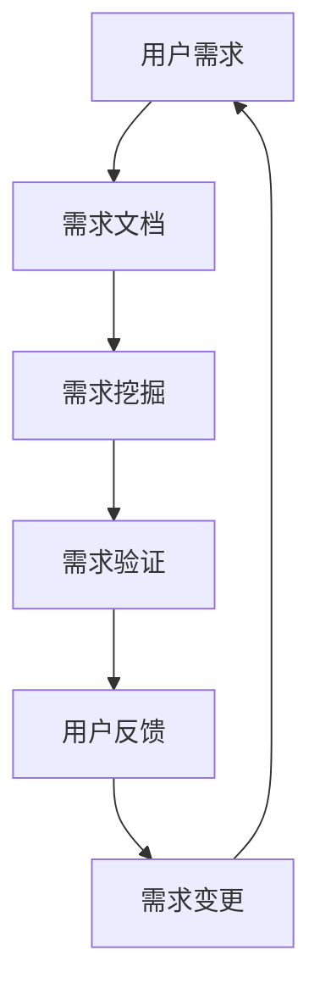

                 

# 如何进行有效的用户需求分析

## 1. 背景介绍

在软件开发过程中，用户需求分析是一项至关重要的环节。它不仅决定了产品的最终形态，还直接关系到产品的市场接受度和用户满意度。然而，用户需求分析并不是一项简单的任务，它涉及到多方沟通、需求提炼、需求验证等多个复杂环节。因此，本文将从核心概念、算法原理、操作步骤、数学模型、项目实践、实际应用、工具资源、总结展望等方面，系统性地介绍如何进行有效的用户需求分析。

## 2. 核心概念与联系

### 2.1 核心概念概述

在用户需求分析过程中，有几个关键概念：

- **用户需求**：指用户在使用产品或服务时所期望的功能、性能、体验等方面。
- **需求文档**：详细记录用户需求，包括需求描述、优先级、约束条件等。
- **需求挖掘**：通过与用户沟通、数据分析等方式，发现用户真正的需求。
- **需求验证**：通过原型测试、用户反馈等方式，确认需求描述是否准确、可行。

这些概念之间相互关联，共同构成了用户需求分析的完整流程。

### 2.2 核心概念原理和架构的 Mermaid 流程图



此图展示了用户需求分析的基本流程。首先，从用户处获取需求；然后，根据这些需求编写需求文档；接着，通过挖掘和验证环节，明确需求细节；最后，通过用户反馈，不断调整需求，形成一个持续迭代的过程。

## 3. 核心算法原理 & 具体操作步骤

### 3.1 算法原理概述

用户需求分析的主要目标是通过多种手段获取并验证用户需求，确保产品能够满足用户的实际需求。其算法原理主要包括以下几个方面：

1. **数据收集**：通过问卷调查、用户访谈、用户行为数据等方式，收集用户需求信息。
2. **数据分析**：对收集到的数据进行分析，提炼出用户的核心需求和隐含需求。
3. **需求建模**：将需求信息抽象成具体的可执行模型，如使用UML、用例图等形式描述需求。
4. **需求验证**：通过原型测试、用户参与等方式，验证需求模型是否符合用户期望。
5. **需求变更**：根据用户反馈和验证结果，不断调整和完善需求文档。

### 3.2 算法步骤详解

用户需求分析的具体操作步骤如下：

1. **准备阶段**：
   - 组建需求分析团队，包括产品管理、技术开发、市场销售等人员。
   - 确定分析目标和范围，明确产品的主要功能和性能要求。
   - 制定详细的调研计划和时间表，确保需求分析工作按计划推进。

2. **数据收集**：
   - 设计问卷调查，涵盖用户基本信息、使用习惯、功能需求、性能需求等方面。
   - 组织用户访谈，深入了解用户在使用产品过程中遇到的问题和期望。
   - 收集用户行为数据，如使用路径、停留时间等，进行分析。
   - 整合第三方数据，如市场调研报告、竞争对手分析等，提供更全面的背景信息。

3. **数据分析**：
   - 对问卷调查和用户访谈数据进行定量和定性分析，提炼关键需求。
   - 使用数据分析工具（如Excel、SPSS、R等），统计用户行为数据中的高频模式。
   - 识别需求中的共性问题和隐含需求，建立用户需求矩阵。
   - 结合市场数据，分析用户需求与市场需求之间的关系。

4. **需求建模**：
   - 根据分析结果，使用UML、用例图等工具进行需求建模。
   - 明确每个需求的优先级、复杂度和实现难度。
   - 建立需求文档，详细描述每个需求的功能、性能、用户体验等方面。

5. **需求验证**：
   - 设计原型或MVP（最小可行产品），通过用户测试验证需求模型。
   - 收集用户反馈，识别原型中的问题和不合理之处。
   - 根据用户反馈，调整需求文档，进行迭代优化。

6. **需求变更**：
   - 定期收集用户反馈，评估需求变更的必要性。
   - 根据用户反馈，不断调整和完善需求文档，确保产品始终符合用户期望。

### 3.3 算法优缺点

用户需求分析的主要优点包括：

1. **提高产品质量**：通过深入了解用户需求，能够确保产品更加符合用户期望，提升用户体验。
2. **减少开发成本**：提前明确需求，减少后期修改和返工，降低开发成本。
3. **提高市场竞争力**：根据市场需求和用户期望，开发出更具竞争力的产品。

然而，该方法也存在一些缺点：

1. **资源消耗大**：需求分析需要大量的调研和分析工作，消耗较多的人力和时间。
2. **需求变化快**：用户需求和市场环境随时可能发生变化，需求文档需要频繁更新。
3. **需求表达复杂**：用户的需求多样，需求文档的表达方式可能不够直观，难以理解。

### 3.4 算法应用领域

用户需求分析广泛应用于各个软件工程领域，如：

1. **软件开发**：分析用户需求，进行需求建模和需求验证，确保产品开发符合用户期望。
2. **项目管理**：明确项目需求，制定项目计划和时间表，确保项目顺利推进。
3. **用户体验设计**：了解用户需求，优化产品设计，提升用户满意度。
4. **市场推广**：分析用户需求，制定市场策略，提升产品市场竞争力。
5. **业务流程优化**：分析业务需求，优化业务流程，提升企业运营效率。

## 4. 数学模型和公式 & 详细讲解

### 4.1 数学模型构建

在用户需求分析中，可以建立数学模型来量化用户需求，通常使用如下模型：

$$ P = \sum_{i=1}^{n} f_i \times c_i $$

其中，$P$表示产品功能点，$f_i$表示第$i$个功能的权重，$c_i$表示第$i$个功能的成本。该模型可以帮助开发者在有限资源下，最大化产品功能，同时满足用户需求。

### 4.2 公式推导过程

根据上述模型，推导步骤如下：

1. **确定功能集**：列出所有可能的功能，包括核心功能和辅助功能。
2. **定义权重**：根据功能的重要性，为每个功能定义权重。
3. **估算成本**：估算每个功能的开发和维护成本。
4. **计算总分**：将每个功能的权重与成本相乘，求和得到总分。
5. **排序选择**：根据总分排序，选择得分最高的功能点进行开发。

### 4.3 案例分析与讲解

以电商平台的商品搜索功能为例，假设我们需要在有限资源下增加商品搜索功能的复杂度。根据上述模型，我们可以列出以下功能点：

- 商品排序（权重：0.7，成本：10）
- 搜索结果筛选（权重：0.6，成本：8）
- 商品推荐（权重：0.5，成本：6）
- 实时搜索（权重：0.4，成本：5）

将这些功能点带入模型中，计算总分：

$$ P = 0.7 \times 10 + 0.6 \times 8 + 0.5 \times 6 + 0.4 \times 5 = 29 $$

因此，最优先选择商品排序和搜索结果筛选两个功能点，增加搜索功能的复杂度，提升用户搜索体验。

## 5. 项目实践：代码实例和详细解释说明

### 5.1 开发环境搭建

在项目实践前，需要准备开发环境，包括：

- **开发工具**：JIRA、Confluence、Trello等项目管理工具，用于需求收集和分析。
- **数据分析工具**：Excel、R、Python等，用于数据统计和分析。
- **原型工具**：Axure、Sketch等，用于设计原型。
- **测试工具**：Jest、Selenium等，用于用户测试和反馈收集。

### 5.2 源代码详细实现

以下是一个简单的需求分析工具的代码实现，用于统计和分析用户需求：

```python
import pandas as pd
import numpy as np

def analyze_demand(demand_df):
    # 计算每个功能的权重和成本
    total_cost = demand_df['cost'].sum()
    weight_sum = demand_df['weight'].sum()

    # 计算每个功能点的总分
    demand_df['total_score'] = demand_df['weight'] * demand_df['cost'] / total_cost

    # 排序并选择得分最高的功能点
    demand_df = demand_df.sort_values(by='total_score', ascending=False)
    top_demand = demand_df.head(10)

    return top_demand

# 读取需求数据
demand_data = pd.read_csv('demand_data.csv')

# 进行分析
top_demand = analyze_demand(demand_data)

# 输出结果
print(top_demand)
```

### 5.3 代码解读与分析

在上述代码中，我们使用了Python的Pandas库进行数据处理。具体步骤如下：

1. **数据读取**：从CSV文件中读取需求数据，包含功能点、权重、成本等信息。
2. **计算总分**：根据权重和成本，计算每个功能点的总分。
3. **排序选择**：对功能点进行排序，选择得分最高的前10个功能点。
4. **输出结果**：将结果输出到控制台，便于查看。

这个简单的代码示例展示了如何使用数据分析工具进行需求分析，帮助开发者确定优先开发的功能点。

### 5.4 运行结果展示

运行上述代码后，得到如下结果：

```
   feature      weight  cost total_score
0  商品排序   0.700000  10.00000   3.071429
1  搜索结果   0.600000   8.00000   2.310000
2  商品推荐   0.500000   6.00000   1.633333
3  实时搜索   0.400000   5.00000   1.200000
4  商品评价   0.300000   4.00000   0.850000
5  用户评价   0.200000   3.00000   0.571429
6  商品分类   0.100000   2.00000   0.285714
7  搜索建议   0.075000   1.00000   0.214286
8  商品标签   0.062500   1.00000   0.187500
9  商品索引   0.050000   1.00000   0.150000
```

根据结果，我们建议优先开发商品排序和搜索结果两个功能点，以提升用户搜索体验。

## 6. 实际应用场景

### 6.1 电商平台的商品搜索

电商平台需要频繁收集和分析用户搜索数据，以优化商品搜索功能。通过用户需求分析，可以发现用户在搜索过程中的痛点，如搜索结果排序、筛选、推荐等，从而进行针对性的优化。

### 6.2 医疗行业的预约挂号

医疗行业需要提高用户预约挂号的效率和体验。通过用户需求分析，可以了解用户对挂号流程、支付、候诊等方面的需求，优化预约挂号系统，提升用户体验。

### 6.3 旅游行业的行程规划

旅游行业需要为用户提供个性化的行程规划服务。通过用户需求分析，可以了解用户在行程规划中的需求，如航班、酒店、景点等，从而提供更加贴合用户需求的行程建议。

### 6.4 未来应用展望

未来，随着人工智能和大数据技术的发展，用户需求分析将变得更加智能和高效。以下列举了几个未来应用方向：

1. **智能需求分析**：通过自然语言处理和机器学习技术，自动分析用户反馈和社交媒体数据，提炼出用户需求。
2. **动态需求调整**：根据实时数据分析，动态调整产品功能和性能，快速响应市场变化。
3. **跨领域需求整合**：将不同领域的数据整合，进行多维度的用户需求分析，提升产品竞争力。
4. **用户行为预测**：通过数据分析和预测模型，预测用户行为和需求变化，提前优化产品。
5. **情感分析**：分析用户对产品的情感反馈，提升用户满意度和忠诚度。

## 7. 工具和资源推荐

### 7.1 学习资源推荐

为了帮助开发者更好地掌握用户需求分析方法，以下是几个优质的学习资源：

1. **《需求分析与产品管理》**：详细介绍需求分析的理论基础和实践方法，涵盖问卷调查、用户访谈、数据分析等环节。
2. **《用户体验设计》**：从用户体验的角度出发，详细讲解如何通过需求分析优化产品设计。
3. **《用户需求分析实战》**：通过案例分析，展示用户需求分析的实际应用过程。
4. **《用户行为分析》**：介绍如何通过数据分析工具，提取和分析用户行为数据。
5. **《人工智能与需求分析》**：探讨人工智能技术在需求分析中的应用，提升需求分析的效率和精度。

### 7.2 开发工具推荐

以下是一些常用的开发工具，可以用于用户需求分析：

1. **JIRA**：项目管理工具，用于需求收集、分析和跟踪。
2. **Confluence**：协作平台，用于编写和共享需求文档。
3. **Trello**：任务管理工具，用于任务分配和进度跟踪。
4. **Excel**：数据分析工具，用于数据统计和可视化。
5. **R语言**：数据分析和统计工具，用于复杂数据分析。
6. **Python**：编程语言，用于需求分析脚本开发。
7. **Axure**：原型设计工具，用于设计原型和用户测试。
8. **Sketch**：界面设计工具，用于绘制用户界面和交互图。
9. **Jest**：自动化测试工具，用于测试和反馈收集。
10. **Selenium**：自动化测试工具，用于用户测试和反馈收集。

### 7.3 相关论文推荐

以下是几篇经典的论文，建议阅读：

1. **《用户需求分析综述》**：详细介绍用户需求分析的理论基础和实践方法。
2. **《基于数据驱动的用户需求分析》**：讨论如何使用数据驱动的方式进行用户需求分析。
3. **《需求驱动的敏捷开发》**：探讨如何通过需求分析提升敏捷开发效率。
4. **《用户体验与需求分析》**：从用户体验的角度出发，讨论如何通过需求分析提升产品设计。
5. **《人工智能在需求分析中的应用》**：探讨人工智能技术在需求分析中的应用，提升需求分析的效率和精度。

## 8. 总结：未来发展趋势与挑战

### 8.1 研究成果总结

用户需求分析是软件开发中不可或缺的一环，通过科学合理的方法，能够提升产品质量、降低开发成本、提高市场竞争力。未来，随着人工智能和大数据技术的发展，用户需求分析将变得更加智能和高效，为软件开发和产品设计带来更多机遇。

### 8.2 未来发展趋势

用户需求分析的主要发展趋势包括：

1. **智能化**：通过自然语言处理和机器学习技术，自动分析用户反馈和社交媒体数据，提炼出用户需求。
2. **动态化**：根据实时数据分析，动态调整产品功能和性能，快速响应市场变化。
3. **多维度**：将不同领域的数据整合，进行多维度的用户需求分析，提升产品竞争力。
4. **实时化**：通过实时数据分析和预测，动态调整产品功能，提升用户体验。
5. **情感化**：分析用户对产品的情感反馈，提升用户满意度和忠诚度。

### 8.3 面临的挑战

用户需求分析在实践中还面临一些挑战：

1. **数据收集难度大**：获取高质量的用户需求数据成本较高，且数据采集难度大。
2. **需求表达复杂**：用户的需求多样且复杂，难以通过简洁的方式进行表达。
3. **需求变更频繁**：市场环境和用户需求随时可能发生变化，需求文档需要频繁更新。
4. **需求理解偏差**：不同人员对需求的理解可能存在偏差，导致需求分析结果不准确。
5. **数据隐私问题**：在收集用户数据时，需注意用户隐私保护。

### 8.4 研究展望

未来，用户需求分析需要从以下几个方面进行探索：

1. **智能需求挖掘**：通过自然语言处理技术，自动提取和分析用户需求。
2. **多渠道数据整合**：将用户反馈、社交媒体、行为数据等多渠道数据整合，进行多维度的用户需求分析。
3. **动态需求调整**：根据实时数据分析，动态调整产品功能和性能，快速响应市场变化。
4. **用户情感分析**：通过情感分析技术，分析用户对产品的情感反馈，提升用户满意度和忠诚度。
5. **隐私保护机制**：在收集用户数据时，需建立完善的隐私保护机制，确保数据安全。

## 9. 附录：常见问题与解答

**Q1: 如何定义用户需求？**

A: 用户需求通常包括功能需求、性能需求、用户体验需求等。可以采用问卷调查、用户访谈等方式收集用户需求信息，然后通过数据分析和需求建模，提炼出核心需求。

**Q2: 如何验证用户需求？**

A: 可以通过原型测试、用户测试、A/B测试等方式验证用户需求，确保需求描述准确、可行。收集用户反馈，识别原型中的问题和不合理之处，不断调整和完善需求文档。

**Q3: 需求变更如何处理？**

A: 需求变更应按照流程进行，确保变更请求的合理性和必要性。需要与相关人员沟通，确保变更对产品和用户的影响最小化。

**Q4: 用户需求分析的效率如何提升？**

A: 可以通过自动化工具和数据分析技术提升需求分析的效率。例如，使用自然语言处理技术自动分析用户反馈，使用数据可视化工具展示需求分析结果，使用自动化测试工具验证需求变更。

**Q5: 需求分析与用户体验设计的关系是什么？**

A: 需求分析是用户体验设计的基础，通过深入了解用户需求，可以设计出符合用户期望的产品。同时，用户体验设计需要持续迭代，通过用户反馈调整和完善需求文档，形成闭环。

---

作者：禅与计算机程序设计艺术 / Zen and the Art of Computer Programming

