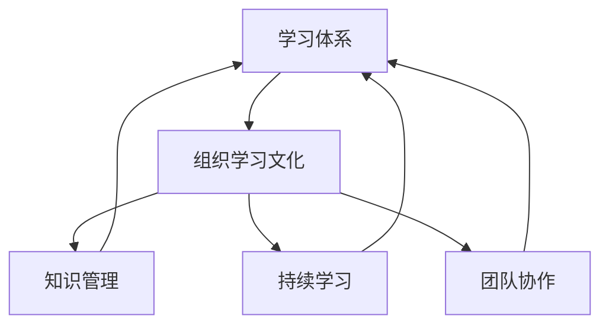

                 

# 学习体系与组织学习文化的构建

> 关键词：学习体系,组织学习文化,持续学习,知识管理,组织发展,团队协作

## 1. 背景介绍

### 1.1 问题由来
在当今快速变化的商业环境中，企业要不断创新、应对市场挑战，保持竞争优势。然而，知识和技能的快速变化让传统的教育培训体系无法跟上需求，组织内学习文化的滞后也阻碍了员工的成长和企业的发展。因此，构建一个高效的学习体系和积极的学习文化变得尤为重要。

### 1.2 问题核心关键点
构建学习体系和组织学习文化的核心在于通过系统化的知识管理、个性化的学习计划、多样化的学习资源和跨部门的协作机制，实现组织的持续学习和发展。具体关键点包括：

- 知识管理：系统化地存储、整理和共享知识。
- 个性化学习：根据员工的学习需求和职业发展规划，制定个性化的学习计划。
- 多样化的学习资源：提供线上线下结合的课程、讲座、书籍、案例研究等多样化学习资源。
- 跨部门的协作：促进不同部门之间的知识交流和协作，增强团队能力。

### 1.3 问题研究意义
构建学习体系和组织学习文化对于组织的持续发展和团队协作具有重要意义：

1. **促进员工成长**：通过系统的学习计划和资源，帮助员工提升技能，适应技术变革，实现职业发展。
2. **增强组织竞争力**：保持组织的创新能力，及时响应市场变化，持续推出新产品和服务。
3. **提高团队协作效率**：通过跨部门的知识交流和协作，提升团队协同工作能力，优化工作流程。
4. **提升客户满意度**：通过持续学习和改进，提供更高质量的产品和服务，提升客户满意度。

## 2. 核心概念与联系

### 2.1 核心概念概述

为更好地理解学习体系和组织学习文化的构建方法，本节将介绍几个密切相关的核心概念：

- **学习体系**：指企业为了提升员工技能和组织能力，系统化、持续化地管理和提升知识、技能的框架体系。
- **组织学习文化**：指在企业内部倡导持续学习、知识共享和创新的文化氛围，通过激励机制和组织实践，鼓励员工主动学习、交流和应用知识。
- **知识管理**：指对企业知识资产进行识别、存储、传播、评估和利用的一系列活动，确保知识的有效管理和使用。
- **持续学习**：指个人和组织不断获取新知识、技能和信息的过程，强调学习的长期性和连续性。
- **团队协作**：指组织内不同角色和部门的员工之间，为了共同目标而进行的协作活动。

这些概念之间的逻辑关系可以通过以下Mermaid流程图来展示：



这个流程图展示了几者之间的逻辑关系：

1. 学习体系是组织学习文化的载体，通过系统化的知识管理、持续学习和团队协作，实现组织内知识的共享和应用。
2. 组织学习文化是学习体系的文化支撑，通过倡导学习文化，激发员工的主动学习行为。
3. 知识管理是学习体系的关键要素，通过有效的知识存储和传播，支持学习体系的有效运作。
4. 持续学习是学习体系的核心目标，通过不断的知识更新和技能提升，保持组织的竞争力和创新能力。
5. 团队协作是学习体系的重要手段，通过跨部门的合作和知识共享，提升团队的整体效能。

这些概念共同构成了企业学习体系和组织学习文化的构建框架，为组织提供了一个全面的知识管理和学习支持体系。通过理解这些核心概念，我们可以更好地把握构建学习体系和组织学习文化的方法和路径。

## 3. 核心算法原理 & 具体操作步骤
### 3.1 算法原理概述

构建学习体系和组织学习文化的核心算法原理基于以下几个关键点：

- **知识分类与标签**：对知识进行分类和标签，建立知识地图，便于检索和使用。
- **个性化学习路径设计**：根据员工的职业发展规划和兴趣，制定个性化的学习路径。
- **知识共享与协作平台**：通过在线平台促进知识共享和协作，提供学习社区、论坛、问答等互动功能。
- **学习效果评估与反馈**：对学习效果进行评估，通过学习成果分享和反馈机制，提升学习动机和效果。

### 3.2 算法步骤详解

构建学习体系和组织学习文化的详细步骤包括：

1. **需求分析**：识别组织内现有知识缺口和员工的学习需求，制定学习目标和计划。
2. **知识库建设**：收集整理现有知识，建立知识库，并制定知识管理策略。
3. **个性化学习计划**：根据员工的职业发展规划和兴趣，制定个性化的学习计划和目标。
4. **知识共享平台建设**：构建知识共享和协作平台，提供丰富的学习资源和互动功能。
5. **学习效果评估与反馈**：对学习效果进行评估，通过学习成果分享和反馈机制，提升学习动机和效果。
6. **持续优化与更新**：根据反馈和学习效果，持续优化学习体系和资源，保持学习体系的有效性和可持续性。

### 3.3 算法优缺点

构建学习体系和组织学习文化的方法具有以下优点：

1. **提升员工技能**：通过系统的学习和培训，提升员工技能，增强其职业发展能力。
2. **增强组织竞争力**：通过持续的知识更新和创新，保持组织的技术领先和市场竞争力。
3. **优化团队协作**：通过知识共享和协作，提升团队协作效率和工作质量。
4. **提升客户满意度**：通过持续学习和改进，提供更高质量的产品和服务，提升客户满意度。

然而，这些方法也存在一些局限性：

1. **实施成本高**：构建和维护学习体系需要投入大量的人力、物力和财力。
2. **资源分散**：不同部门和岗位的员工，其学习需求和进度可能不一致，难以实现统一管理。
3. **效果难量化**：学习效果的评估和反馈难以量化，可能影响员工的学习动力。
4. **知识更新快**：技术更新迭代速度快，需要持续更新学习体系和资源，保持其时效性。

尽管存在这些局限性，但通过精心设计和管理，这些方法仍能在提升组织能力和员工成长方面发挥重要作用。

### 3.4 算法应用领域

构建学习体系和组织学习文化的算法原理，在多个领域得到了广泛应用，例如：

- **企业培训**：通过系统的培训课程和评估机制，提升员工技能，促进职业发展。
- **技术研发**：通过持续学习和知识共享，提升团队技术能力和创新能力。
- **市场营销**：通过学习市场趋势和客户需求，提升市场响应速度和产品竞争力。
- **客户服务**：通过提升服务人员技能，提升客户服务质量和满意度。

除了这些经典应用外，学习体系和组织学习文化的方法也被创新性地应用到更多场景中，如跨部门协作、知识驱动的产品设计、创新项目管理等，为组织提供了更为灵活和多样化的学习支持。

## 4. 数学模型和公式 & 详细讲解 & 举例说明

### 4.1 数学模型构建

构建学习体系和组织学习文化的数学模型涉及多个要素，包括学习需求分析、知识分类与标签、个性化学习路径设计、知识共享与协作平台、学习效果评估与反馈等。这里，我们将以知识分类与标签为例，简要介绍数学模型的构建方法。

### 4.2 公式推导过程

知识分类与标签的数学模型基于知识本体论的框架，通过构建知识分类树（Ontology），实现知识的层次化管理和分类。知识分类树由根节点（知识领域）和多个子节点（知识主题）构成，每个子节点下还可以进一步细分为子主题。

设知识分类树的根节点为 $R$，子节点为 $N_1, N_2, \ldots, N_k$，其中 $k$ 为知识领域数量。每个子节点 $N_i$ 下的子主题数量为 $n_i$，则知识分类树的节点总数为：

$$
\text{Total Nodes} = k + \sum_{i=1}^k n_i
$$

对于每个知识主题 $T_{i,j}$，我们可以通过关键词提取、分类算法（如TF-IDF、LDA等）等方法，计算其与每个子节点的相似度 $s_{i,j}$，构建知识主题与节点的关联矩阵 $S$。

$$
S = \begin{bmatrix}
s_{1,1} & s_{1,2} & \ldots & s_{1,n_1} \\
s_{2,1} & s_{2,2} & \ldots & s_{2,n_2} \\
\vdots & \vdots & \ddots & \vdots \\
s_{k,1} & s_{k,2} & \ldots & s_{k,n_k}
\end{bmatrix}
$$

### 4.3 案例分析与讲解

假设一家科技公司需要建立知识分类树，以便更好地管理其技术知识和文档。首先，通过专家访谈和文献调研，确定公司的知识领域（如云计算、人工智能、网络安全等）。然后，对每个领域内的子主题（如云计算中的云服务、大数据分析等）进行分类和关键词提取。最后，通过计算每个主题与子节点的相似度，构建知识分类树。

例如，公司知识分类树的根节点为“云计算”，其下的子节点为“云服务”和“大数据分析”。对于“云服务”子节点，计算其与每个主题的相似度，得到关联矩阵 $S_{\text{Cloud Service}}$：

$$
S_{\text{Cloud Service}} = \begin{bmatrix}
s_{\text{Cloud Service}, \text{云服务}} & s_{\text{Cloud Service}, \text{大数据分析}} \\
s_{\text{大数据分析}, \text{云服务}} & s_{\text{大数据分析}, \text{大数据分析}}
\end{bmatrix}
$$

通过这样的数学模型，公司可以更系统地管理其技术知识和文档，方便员工查询和学习相关知识。

## 5. 项目实践：代码实例和详细解释说明
### 5.1 开发环境搭建

在进行学习体系和组织学习文化的实践前，我们需要准备好开发环境。以下是使用Python进行Flask开发的环境配置流程：

1. 安装Anaconda：从官网下载并安装Anaconda，用于创建独立的Python环境。

2. 创建并激活虚拟环境：
```bash
conda create -n learning-env python=3.8 
conda activate learning-env
```

3. 安装Flask：
```bash
pip install flask
```

4. 安装Flask-RESTful：
```bash
pip install flask-restful
```

5. 安装Flask-SQLAlchemy：
```bash
pip install flask-sqlalchemy
```

6. 安装Flask-WTF：
```bash
pip install flask-wtf
```

7. 安装Flask-Admin：
```bash
pip install flask-admin
```

完成上述步骤后，即可在`learning-env`环境中开始项目开发。

### 5.2 源代码详细实现

以下是一个基于Flask构建的在线学习平台源代码实现，包括用户注册登录、知识分类与标签、个性化学习计划、知识共享与协作平台等功能模块。

```python
from flask import Flask, render_template, request
from flask_sqlalchemy import SQLAlchemy
from flask_admin import Admin
from flask_admin.contrib.sqla import ModelView
from wtforms import Form, StringField, PasswordField, SubmitField
from wtforms.validators import DataRequired, Email, EqualTo
from werkzeug.security import generate_password_hash, check_password_hash

app = Flask(__name__)
app.config['SQLALCHEMY_DATABASE_URI'] = 'sqlite:///learning.db'
app.config['SECRET_KEY'] = 'secret_key'
app.config['ADMIN_SWATCH'] = 'blue'
app.config['SQLALCHEMY_TRACK_MODIFICATIONS'] = False

db = SQLAlchemy(app)
admin = Admin(app, name='learning admin', template_mode='bootstrap3')

class User(db.Model):
    id = db.Column(db.Integer, primary_key=True)
    username = db.Column(db.String(50), unique=True, nullable=False)
    email = db.Column(db.String(120), unique=True, nullable=False)
    password_hash = db.Column(db.String(60), nullable=False)

    def set_password(self, password):
        self.password_hash = generate_password_hash(password)

    def check_password(self, password):
        return check_password_hash(self.password_hash, password)

@app.route('/')
def home():
    return render_template('home.html')

@app.route('/login', methods=['GET', 'POST'])
def login():
    form = LoginForm()
    if form.validate_on_submit():
        user = User.query.filter_by(email=form.email.data).first()
        if user and user.check_password(form.password.data):
            return redirect('/dashboard')
        return render_template('login.html', title='Login', form=form)
    return render_template('login.html', title='Login', form=form)

@app.route('/register', methods=['GET', 'POST'])
def register():
    form = RegisterForm()
    if form.validate_on_submit():
        user = User(username=form.username.data, email=form.email.data)
        user.set_password(form.password.data)
        db.session.add(user)
        db.session.commit()
        return redirect('/login')
    return render_template('register.html', title='Register', form=form)

@app.route('/dashboard')
def dashboard():
    return render_template('dashboard.html')

class UserAdminView(ModelView):
    column_exclude_list = ['password_hash']
    can_create = False
    can_edit = False
    can_delete = False
    can_view_details = True

admin.add_view(UserAdminView(User, db.session))

class LoginForm(Form):
    email = StringField('Email', validators=[DataRequired(), Email()])
    password = PasswordField('Password', validators=[DataRequired()])
    submit = SubmitField('Login')

class RegisterForm(Form):
    username = StringField('Username', validators=[DataRequired()])
    email = StringField('Email', validators=[DataRequired(), Email()])
    password = PasswordField('Password', validators=[DataRequired()])
    confirm_password = PasswordField('Confirm Password', validators=[DataRequired(), EqualTo('password')])
    submit = SubmitField('Register')

if __name__ == '__main__':
    db.create_all()
    app.run(debug=True)
```

### 5.3 代码解读与分析

让我们再详细解读一下关键代码的实现细节：

**User类**：
- `User`类为SQLAlchemy的模型，定义了用户的基本信息，包括用户名、邮箱和密码。
- `set_password`方法用于存储用户密码的哈希值，`check_password`方法用于验证用户输入的密码是否正确。

**Flask应用实例**：
- `app`为Flask应用实例，通过`app.config`设置数据库连接和密钥等配置信息。
- `db = SQLAlchemy(app)`初始化SQLAlchemy对象，连接数据库。

**用户登录和注册**：
- `/login`路由处理用户登录请求，通过表单验证和数据库查询，验证用户身份。
- `/register`路由处理用户注册请求，创建新用户并保存到数据库中。

**用户管理和界面**：
- `UserAdminView`类为Flask-Admin的视图，用于管理和展示用户信息，通过`column_exclude_list`排除密码字段，防止明文显示。
- `admin.add_view(UserAdminView(User, db.session))`将用户信息视图添加到Flask-Admin中，通过管理界面进行用户管理。

通过以上代码实现，可以构建一个基本的在线学习平台，提供用户注册、登录、知识管理和用户信息管理等功能。

### 5.4 运行结果展示

运行上述代码，启动Flask应用，打开浏览器访问`http://localhost:5000`，可以进入学习平台的主页。用户可以注册登录后，访问`/dashboard`进入仪表盘，查看和管理知识资源和用户信息。

## 6. 实际应用场景

### 6.1 智能制造

智能制造企业的知识管理和组织学习文化构建，对于提升生产效率、优化流程管理、降低成本具有重要意义。通过构建智能制造的知识库，记录和分享制造过程中的工艺、设备、材料、质量控制等知识，员工可以随时查阅相关知识，提高工作效率。

### 6.2 医疗健康

医疗健康领域的知识管理和组织学习文化，可以显著提升医疗服务的质量和效率。通过构建医学知识库、医疗案例库、患者档案等，医护人员可以随时查阅相关知识，提升诊疗水平，改善患者体验。

### 6.3 金融服务

金融服务行业的知识管理和组织学习文化构建，可以提升金融产品的创新能力和市场响应速度。通过构建金融知识库、市场研究、客户服务案例等，金融从业人员可以随时查阅相关知识，提升服务质量和客户满意度。

### 6.4 未来应用展望

随着信息技术的发展，学习体系和组织学习文化将在更多领域得到应用，为传统行业带来变革性影响。

在智慧城市治理中，知识管理和组织学习文化可以提升城市管理的智能化水平，构建更安全、高效的未来城市。

在教育培训领域，知识管理和组织学习文化可以提供个性化的学习资源和课程，提升教学效果和学生学习体验。

在科学研究中，知识管理和组织学习文化可以加速科学研究的进展，促进跨学科合作，推动科学创新。

未来，伴随技术的进步和应用场景的拓展，学习体系和组织学习文化将继续发挥重要作用，推动企业和社会不断创新发展。

## 7. 工具和资源推荐
### 7.1 学习资源推荐

为了帮助开发者系统掌握学习体系和组织学习文化的构建方法，这里推荐一些优质的学习资源：

1. 《学习体系设计与实施》系列博文：由组织学习领域的专家撰写，深入浅出地介绍了学习体系的设计和实施方法。

2. 《组织学习文化构建》课程：由知名商学院开设的课程，涵盖组织学习文化的理论基础和实践技巧。

3. 《知识管理与组织学习》书籍：详细介绍了知识管理与组织学习的原理、方法和工具，适合深入学习。

4. 《持续学习与组织发展》白皮书：分析了持续学习对组织发展的影响和具体实践方法。

5. 《团队协作与知识共享》案例集：收录了多个企业知识管理与团队协作的成功案例，值得借鉴和学习。

通过对这些资源的学习实践，相信你一定能够快速掌握学习体系和组织学习文化的构建方法，并用于解决实际的组织学习问题。

### 7.2 开发工具推荐

高效的开发离不开优秀的工具支持。以下是几款用于学习体系和组织学习文化构建开发的常用工具：

1. Flask：基于Python的Web开发框架，灵活、易用，适合构建在线学习平台。

2. SQLAlchemy：Python的SQL工具包，支持多种数据库，方便进行数据管理和存储。

3. Flask-Admin：基于Flask的后台管理界面，提供便捷的管理功能，适合构建知识管理界面。

4. Flask-WTF：基于Flask的表单处理工具，支持多种表单类型和验证器，方便构建用户界面。

5. Flask-SQLAlchemy：结合SQLAlchemy和Flask，方便进行数据库操作。

6. Weights & Biases：模型训练的实验跟踪工具，可以记录和可视化模型训练过程中的各项指标，方便调试和学习。

7. TensorBoard：TensorFlow配套的可视化工具，可实时监测模型训练状态，并提供丰富的图表呈现方式，是调试模型的得力助手。

合理利用这些工具，可以显著提升学习体系和组织学习文化的开发效率，加快创新迭代的步伐。

### 7.3 相关论文推荐

学习体系和组织学习文化的构建方法源于学界的持续研究。以下是几篇奠基性的相关论文，推荐阅读：

1. "Knowledge Management in Practice" by Leif A. Pedersen：介绍了知识管理的理论基础和实践方法。

2. "Building a Learning Culture: An Organizational Approach" by Steven M. Moodie：分析了组织学习文化的构建方法和管理策略。

3. "The Learning Organization: How Google Revolutionizes Its Workforce" by John Willis：介绍了Google的学习体系和组织学习文化构建方法。

4. "The Knowledge-Centric Organization: The Future of Work" by Daniel Pink：讨论了知识驱动的组织模式和管理方法。

5. "Organizational Learning and Change" by Edward E. Jones：分析了组织学习的理论基础和应用场景。

这些论文代表了大模型微调技术的发展脉络。通过学习这些前沿成果，可以帮助研究者把握学科前进方向，激发更多的创新灵感。

## 8. 总结：未来发展趋势与挑战

### 8.1 总结

本文对学习体系和组织学习文化的构建方法进行了全面系统的介绍。首先阐述了学习体系和组织学习文化的构建背景和意义，明确了构建学习体系和组织学习文化的独特价值。其次，从原理到实践，详细讲解了学习体系和组织学习文化的数学原理和关键步骤，给出了学习体系和组织学习文化构建的完整代码实例。同时，本文还广泛探讨了学习体系和组织学习文化在智能制造、医疗健康、金融服务等多个行业领域的应用前景，展示了学习体系和组织学习文化的广阔前景。此外，本文精选了学习体系和组织学习文化的各类学习资源，力求为读者提供全方位的技术指引。

通过本文的系统梳理，可以看到，学习体系和组织学习文化在提升组织能力和员工成长方面具有重要意义。通过系统化的知识管理和持续学习，企业可以不断创新、优化流程，提升市场竞争力。未来，伴随技术的进步和应用场景的拓展，学习体系和组织学习文化将继续发挥重要作用，推动企业和社会不断创新发展。

### 8.2 未来发展趋势

展望未来，学习体系和组织学习文化将呈现以下几个发展趋势：

1. **系统化与智能化的结合**：伴随人工智能技术的发展，学习体系将更多地融入智能推荐、自然语言处理等技术，提供更加个性化的学习体验。

2. **跨部门与跨领域的协作**：跨部门的知识共享和协作平台将进一步完善，促进跨学科、跨领域的学习和创新。

3. **虚拟与现实的融合**：结合虚拟现实技术，提供沉浸式的学习体验，增强学习效果。

4. **多模态与混合学习**：结合多种学习方式和资源，提供多模态、混合式的学习体验，满足不同员工的学习需求。

5. **持续性与动态更新**：学习体系将更加注重持续学习和动态更新，保持知识的时效性和相关性。

6. **数据驱动与个性化优化**：通过数据分析和算法优化，提升学习效果和用户体验，实现个性化学习路径的设计和优化。

以上趋势凸显了学习体系和组织学习文化的广阔前景。这些方向的探索发展，将进一步提升企业的学习能力和创新能力，推动组织向智能化、持续化、个性化方向发展。

### 8.3 面临的挑战

尽管学习体系和组织学习文化已经取得了显著成果，但在迈向更加智能化、普适化应用的过程中，它仍面临诸多挑战：

1. **资源投入大**：构建和维护学习体系需要投入大量的人力、物力和财力。如何平衡成本和效益，是一个重要挑战。

2. **用户参与度低**：部分员工可能对学习体系缺乏兴趣或参与度不高，如何激励和引导员工主动学习，是一个难点。

3. **知识更新快**：技术更新迭代速度快，学习体系需要持续更新，保持其时效性。如何高效更新和管理知识，是一个挑战。

4. **效果难以量化**：学习效果的量化评估和反馈机制难以建立，可能影响员工的学习动力。

5. **跨部门协作难度大**：跨部门的知识共享和协作需要协调不同部门和岗位的需求，如何实现跨部门协作，是一个难题。

6. **数据隐私和安全**：学习体系需要收集和处理大量员工数据，如何保障数据隐私和安全，是一个重要的挑战。

正视学习体系和组织学习文化面临的这些挑战，积极应对并寻求突破，将是大规模知识管理在企业中的重要路径。相信随着技术的不断进步和实践的深入，学习体系和组织学习文化必将在构建智能化组织中发挥越来越重要的作用。

### 8.4 未来突破

面对学习体系和组织学习文化所面临的种种挑战，未来的研究需要在以下几个方面寻求新的突破：

1. **智能推荐与个性化学习**：结合人工智能技术，实现更加智能化的推荐和学习路径设计，满足员工个性化的学习需求。

2. **知识图谱与知识网络**：构建知识图谱和知识网络，通过结构化的知识表示，提升知识的关联和共享效率。

3. **混合学习与多模态学习**：结合多种学习方式和资源，提供混合式的学习体验，增强学习效果和用户满意度。

4. **数据驱动的动态更新**：通过数据分析和算法优化，提升学习效果和用户体验，实现个性化学习路径的设计和优化。

5. **跨部门协作与平台设计**：设计跨部门协作的平台和机制，促进跨学科、跨领域的学习和创新。

6. **数据隐私与安全**：采用先进的数据保护技术和算法，确保员工数据的安全和隐私。

这些研究方向的探索，必将引领学习体系和组织学习文化迈向更高的台阶，为构建智能化的学习体系和组织学习文化提供新的思路和方法。面向未来，学习体系和组织学习文化需要与其他技术进行更深入的融合，如人工智能、大数据、区块链等，协同发力，共同推动智能化组织的构建。只有勇于创新、敢于突破，才能不断拓展知识管理的边界，让学习体系和组织学习文化更好地服务于组织发展和员工成长。

## 9. 附录：常见问题与解答

**Q1：如何构建一个高效的学习体系？**

A: 构建高效的学习体系需要考虑以下几个关键要素：

1. **需求分析**：识别组织内现有知识缺口和员工的学习需求，制定学习目标和计划。
2. **知识分类与标签**：对知识进行分类和标签，建立知识地图，便于检索和使用。
3. **个性化学习计划**：根据员工的职业发展规划和兴趣，制定个性化的学习计划和目标。
4. **知识共享平台建设**：构建知识共享和协作平台，提供丰富的学习资源和互动功能。
5. **学习效果评估与反馈**：对学习效果进行评估，通过学习成果分享和反馈机制，提升学习动机和效果。

**Q2：如何激励员工主动学习？**

A: 激励员工主动学习需要从多个方面入手：

1. **明确学习目标**：帮助员工设定明确的学习目标和路径，使其知道学习的重要性。
2. **提供学习资源**：提供丰富的学习资源和多样化的学习方式，满足员工的学习需求。
3. **建立学习社区**：构建学习社区，促进员工之间的知识交流和互动，形成学习氛围。
4. **奖励机制**：建立奖励机制，对积极学习的员工进行表彰和奖励。
5. **领导示范**：领导层应以身作则，积极参与学习，树立榜样作用。

**Q3：如何评估学习体系的效果？**

A: 评估学习体系的效果需要综合考虑以下几个方面：

1. **员工反馈**：通过问卷调查、反馈机制等方式，收集员工对学习体系的评价和建议。
2. **学习成果**：通过考试、项目评估等方式，评估员工的学习成果和实际应用效果。
3. **知识共享情况**：统计知识共享平台的使用情况和效果，评估知识共享的活跃度。
4. **绩效提升**：通过数据分析，评估学习体系对员工绩效和组织绩效的影响。

**Q4：如何保障学习体系的数据安全？**

A: 保障学习体系的数据安全需要采取以下几个措施：

1. **数据加密**：对存储和传输的数据进行加密处理，防止数据泄露。
2. **权限控制**：设置合理的权限控制，确保只有授权人员可以访问和使用数据。
3. **审计记录**：记录和监控数据的使用情况，及时发现和处理异常行为。
4. **安全培训**：对员工进行数据安全和隐私保护培训，提高员工的安全意识。

通过以上措施，可以有效保障学习体系的数据安全，保护员工隐私和企业利益。

**Q5：如何实现跨部门的知识共享和协作？**

A: 实现跨部门的知识共享和协作需要采取以下几个措施：

1. **跨部门沟通机制**：建立跨部门的沟通机制，促进不同部门之间的知识交流和协作。
2. **共享平台设计**：设计跨部门的共享平台，方便不同部门进行知识共享和协作。
3. **知识标准化**：制定知识标准化规范，确保不同部门之间的知识格式和结构一致。
4. **激励机制**：建立激励机制，鼓励员工积极参与跨部门的知识共享和协作。

通过以上措施，可以有效地实现跨部门的知识共享和协作，提升组织整体的学习能力和创新能力。

总之，学习体系和组织学习文化的构建是一个系统化、持续化的过程，需要企业从战略层面进行规划和实施。通过不断优化和调整，学习体系和组织学习文化必将为企业的发展提供强大的支持和保障。

