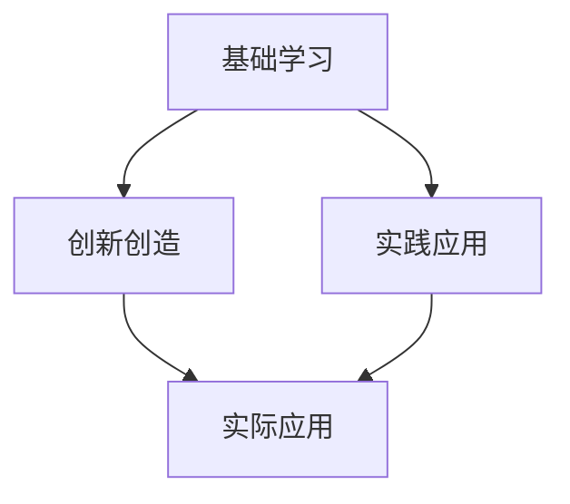
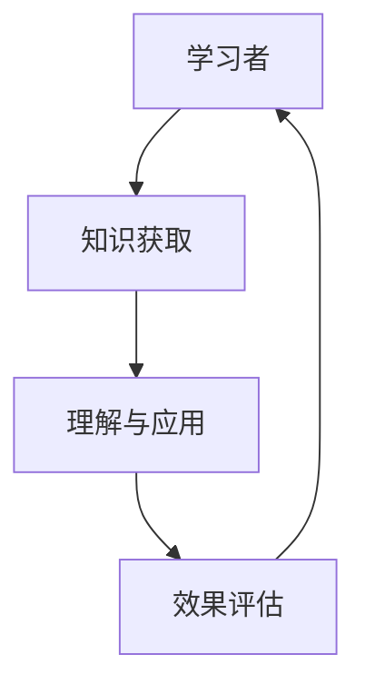

                 

# 学习曲线：知识积累的非线性过程

## 1. 背景介绍

知识积累是一个长期而复杂的过程，涵盖了从基础概念的理解到实践技能的掌握，再到应用创新的创造。学习曲线（Learning Curve）即反映了这种非线性成长的过程，它揭示了随着学习时间的增加，学习效率如何变化。理解学习曲线的本质，对于规划学习路径、提升学习效率、实现知识转化具有重要意义。

### 1.1 问题由来
在现代社会中，知识更新迅速，且领域边界日趋模糊，这对学习者的持续学习能力提出了更高要求。同时，大规模在线教育资源的普及，使得自我驱动学习成为主流。如何在浩如烟海的知识海洋中找到有价值的学习内容，并高效转化为自己的能力，成为每个学习者关注的焦点。

### 1.2 问题核心关键点
学习曲线描述的是学习者掌握新知识所需要的时间与效果之间的关系。其核心关键点在于：
- 知识的初始获取速度通常很快，但随着深入理解，难度增加，获取速度放缓。
- 理解与应用的难度与知识本身的复杂性呈指数增长。
- 学习效率与个人认知能力、已有知识基础、学习方法密切相关。

### 1.3 问题研究意义
研究学习曲线，不仅有助于理解知识积累的规律，还能指导学习者制定合理的学习计划，提高学习效率。此外，对于教育工作者而言，深入理解学习曲线也有助于改进教学方法，提高教学质量。

## 2. 核心概念与联系

### 2.1 核心概念概述
在学习曲线研究中，几个核心概念如下：

- **学习曲线（Learning Curve）**：反映学习者掌握知识所需时间与效果之间的关系。
- **基础学习（Basic Learning）**：涉及基础概念、原理和操作步骤的学习。
- **实践应用（Practical Application）**：将理论知识应用于实际问题解决。
- **创新创造（Innovation Creation）**：在已有知识基础上进行创新，提出新的解决方案。

这些概念之间的联系可以通过以下Mermaid流程图来展示：



### 2.2 核心概念原理和架构的 Mermaid 流程图



在上述流程图中，学习者从知识获取开始，通过理解与应用将知识转化为实际能力，并通过效果评估不断调整学习路径，实现知识的深度掌握与创新应用。

## 3. 核心算法原理 & 具体操作步骤

### 3.1 算法原理概述

学习曲线的研究通常遵循以下几个算法原理：

1. **积累法**：随着时间的累积，学习者通过不断重复练习和应用，逐渐提高对知识点的理解和掌握。
2. **反馈法**：通过学习者对知识点的反复反馈，调整学习路径和方法，提升学习效率。
3. **记忆曲线**：利用记忆的遗忘规律，合理规划复习周期，增强长期记忆效果。

### 3.2 算法步骤详解

**Step 1: 设定学习目标和任务**
- 明确学习目标和任务，如掌握某一编程语言、理解某一算法思想等。
- 制定详细的学习计划，包括每天学习时间、学习内容和评估方式。

**Step 2: 知识获取**
- 通过阅读书籍、观看视频、参加课程等方式获取新知识。
- 阅读过程中应记录重要概念和知识点，进行初步理解。

**Step 3: 理解与应用**
- 尝试将新知识应用到实际问题解决中，通过编程、实验等方式加深理解。
- 遇到问题时，先回顾相关知识，再尝试解决，培养问题解决能力。

**Step 4: 效果评估**
- 通过测试、项目实践等方式评估学习效果，找出不足之处。
- 根据评估结果调整学习计划，进一步深化理解。

**Step 5: 迭代优化**
- 定期回顾和复习已学内容，巩固记忆，强化理解。
- 尝试新的学习方法，如同伴讨论、案例分析等，拓宽思维。

### 3.3 算法优缺点

**优点**：
- 结构清晰，易于遵循和调整。
- 以问题为导向，注重实践和应用。
- 通过不断反馈和调整，学习路径更加灵活和高效。

**缺点**：
- 实施过程中需要较强的自律和毅力。
- 对学习效率的评估和反馈机制要求较高，否则可能偏离正确路径。
- 难以量化和优化，需要大量的个性化调整。

### 3.4 算法应用领域

学习曲线不仅适用于技术领域的知识积累，也适用于其他各领域的知识获取。以下是几个典型应用领域：

1. **教育培训**：帮助学生制定学习计划，提升学习效果。
2. **职业发展**：指导职场人士提升专业技能，适应行业变化。
3. **科学研究**：促进研究人员掌握最新知识，推动学科进步。
4. **自我提升**：帮助个人在多个领域实现全面发展。

## 4. 数学模型和公式 & 详细讲解 & 举例说明

### 4.1 数学模型构建

在学习曲线的研究中，常见的数学模型包括：
- 累积学习曲线模型（Accumulation Model）
- 指数衰减模型（Exponential Decay Model）
- 对数增长模型（Logarithmic Growth Model）

这些模型均用于描述学习效果随时间的变化规律。

### 4.2 公式推导过程

以累积学习曲线模型为例，设学习者学习某一知识点的时间为 $t$，学习效果为 $S(t)$，则公式可表示为：

$$
S(t) = S_0 + \int_0^t f(t')dt'
$$

其中，$S_0$ 为初始学习效果，$f(t')$ 为时间 $t'$ 内的学习速率函数。

### 4.3 案例分析与讲解

**案例1：编程语言学习**
- **背景**：假设学习者希望在6个月内掌握Python编程语言。
- **模型构建**：构建一个累积学习曲线模型，设定初始效果为0，学习速率为指数衰减函数 $f(t) = A e^{-Bt}$，其中 $A$ 和 $B$ 为参数。
- **公式推导**：
  $$
  S(t) = \int_0^t A e^{-Bt}dt' = A \frac{1-e^{-Bt}}{B}
  $$
- **案例分析**：根据公式，分析在不同时间段内的学习效果，调整学习策略。

## 5. 项目实践：代码实例和详细解释说明

### 5.1 开发环境搭建

在进行学习曲线分析时，我们推荐使用Python语言，配合Matplotlib、Scipy等科学计算库进行数据分析和可视化。

1. 安装Anaconda：从官网下载并安装Anaconda，用于创建独立的Python环境。
2. 创建并激活虚拟环境：
  ```bash
  conda create -n learning-env python=3.8
  conda activate learning-env
  ```
3. 安装所需库：
  ```bash
  conda install matplotlib scipy pandas numpy
  ```

### 5.2 源代码详细实现

以下是一个简单的学习曲线分析代码示例，利用Matplotlib库绘制学习效果随时间的变化：

```python
import matplotlib.pyplot as plt
import numpy as np
from scipy.integrate import quad

# 学习效果随时间变化的函数
def learning_curve(t, A=1, B=0.1):
    return A * (1 - np.exp(-B*t))

# 生成时间序列
t = np.arange(0, 6, 0.1)

# 计算学习效果
S = [learning_curve(i) for i in t]

# 可视化效果
plt.plot(t, S)
plt.xlabel('Time')
plt.ylabel('Learning Effect')
plt.title('Learning Curve Example')
plt.show()
```

### 5.3 代码解读与分析

上述代码实现了对学习效果随时间变化的简单模拟。首先定义了一个学习效果函数，然后生成时间序列，计算不同时间点的学习效果，最后使用Matplotlib绘制学习曲线图。

**代码解读**：
- `learning_curve` 函数定义了学习效果随时间变化的公式。
- `t` 生成时间序列，从0到6，间隔0.1。
- `quad` 函数用于计算定积分，得到每个时间点的学习效果。
- `plt.plot` 用于绘制时间与学习效果的曲线图。

### 5.4 运行结果展示

运行上述代码，将生成一张学习效果随时间变化的曲线图，展示学习者在学习某一知识点时，效果如何随时间累积变化。


## 6. 实际应用场景

### 6.1 教育培训

教育培训机构可以基于学习曲线模型，为学生设计个性化的学习计划。通过分析学生的学习效果和反馈，及时调整教学内容和方式，提升整体教学效果。

### 6.2 职业发展

职场人士可以通过学习曲线模型，评估自己在某个领域的技能掌握情况，并制定持续提升计划。通过持续学习和实践，不断提升职业竞争力。

### 6.3 科学研究

科研工作者可以通过学习曲线模型，跟踪自己掌握新知识的过程，评估科研进展，调整研究方法。同时，该模型也可用于评价团队成员的学习效果，优化团队协作效率。

### 6.4 未来应用展望

未来，学习曲线模型将与其他人工智能技术结合，提供更为智能化的学习建议和规划。例如，结合机器学习算法，预测学习者的学习效果，推荐最合适的学习资源。同时，通过数据分析，揭示学习者的认知模式和兴趣点，提供个性化的学习路径。

## 7. 工具和资源推荐

### 7.1 学习资源推荐

1. **《深度学习》课程**：Coursera上由Andrew Ng教授开设的深度学习课程，涵盖深度学习基础与实践。
2. **《机器学习实战》书籍**：通过大量实战案例，深入浅出地介绍了机器学习算法和应用。
3. **Kaggle竞赛**：通过参与Kaggle数据科学竞赛，积累实战经验，提升数据处理和模型构建能力。
4. **Stack Overflow**：程序员社区，提供丰富的技术交流和问题解决平台。
5. **GitHub**：开源社区，分享和交流代码，学习他人的编程实践。

### 7.2 开发工具推荐

1. **Jupyter Notebook**：Python开发利器，支持代码和结果的实时显示和保存。
2. **PyCharm**：Python集成开发环境，提供高效的代码编辑、调试和测试功能。
3. **Anaconda Navigator**：可视化的Python环境管理工具，方便管理和激活虚拟环境。
4. **Scikit-learn**：Python机器学习库，提供丰富的数据处理和模型构建工具。
5. **TensorFlow**：Google开发的深度学习框架，支持大规模分布式计算。

### 7.3 相关论文推荐

1. **《机器学习》**：Tom Mitchell著，介绍了机器学习的基本概念和算法。
2. **《深度学习》**：Ian Goodfellow, Yoshua Bengio, Aaron Courville著，详细阐述了深度学习的原理与应用。
3. **《学习曲线研究》**：Gangadhar Bhaskaran等人发表的学术论文，研究了学习曲线在不同领域的应用。

## 8. 总结：未来发展趋势与挑战

### 8.1 研究成果总结

学习曲线研究揭示了知识积累的复杂性和规律性，对教育、培训、职业发展等领域具有重要指导意义。该研究不仅有助于提升学习效果，还能推动相关技术的不断进步。

### 8.2 未来发展趋势

未来，学习曲线研究将朝着以下几个方向发展：
1. **智能化学习**：结合人工智能技术，提供个性化的学习建议和规划。
2. **跨领域应用**：将学习曲线模型应用于更多领域，如医学、艺术等，推动跨领域知识的学习与积累。
3. **情感计算**：引入情感因素，分析学习者的心理状态，优化学习路径和策略。
4. **知识图谱**：结合知识图谱技术，构建动态的学习网络，帮助学习者探索知识间的关联与联系。

### 8.3 面临的挑战

学习曲线研究面临的主要挑战包括：
1. **数据获取与处理**：获取高质量的学习数据是一个复杂的过程，需要大量的数据采集和预处理工作。
2. **模型复杂性**：学习曲线的构建和分析需要复杂的数学模型，增加了研究难度。
3. **学习行为建模**：学习者的行为模式和心理状态难以全面建模，影响了学习曲线的准确性。
4. **多模态学习**：结合图像、视频等多模态数据，增加了模型构建和分析的复杂性。

### 8.4 研究展望

尽管存在诸多挑战，但学习曲线研究具有广阔的发展前景。未来，随着数据获取与处理技术的进步、人工智能技术的不断成熟，学习曲线研究将迎来新的突破，为知识积累与学习提供更加科学和高效的方法。

## 9. 附录：常见问题与解答

**Q1: 学习曲线在实际应用中是否真的有效？**

A: 学习曲线在理论上是有效的，但在实际应用中需要根据具体情况进行调整。通过不断的实践和反馈，可以逐步优化学习路径，提高学习效率。

**Q2: 如何判断学习者是否掌握了一个知识点？**

A: 可以通过测试、项目实践、论文发表等多种方式进行评估。关键是设计合理的评估标准和指标，如考试、项目完成度等。

**Q3: 学习曲线是否适用于所有领域？**

A: 学习曲线适用于大部分领域，但具体应用时需要注意调整模型参数和评估方式。

**Q4: 如何平衡基础学习与实践应用？**

A: 建议在学习计划中合理安排时间和内容，保证既有足够的理论基础，又有足够的实践机会。

**Q5: 学习曲线是否只适用于学生？**

A: 学习曲线不仅适用于学生，职场人士、科研工作者等都可以使用，关键是要制定合适的学习目标和计划。

---

作者：禅与计算机程序设计艺术 / Zen and the Art of Computer Programming

