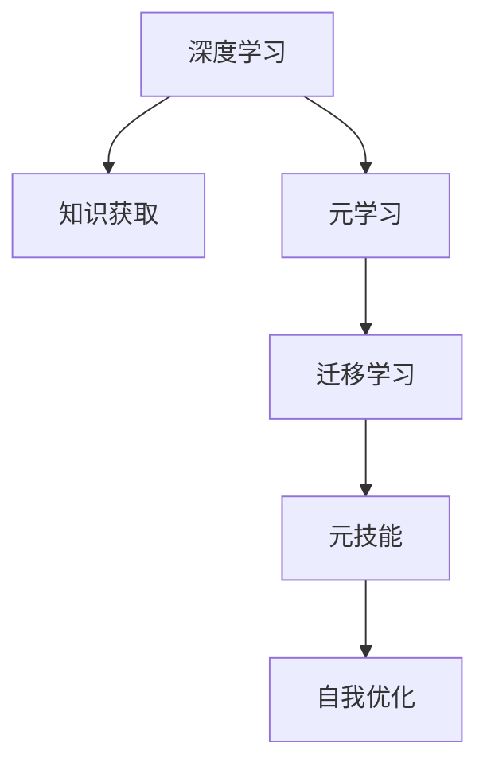

                 

# 学习的学习：元技能在知识获取中的作用

> 关键词：元学习、元技能、深度学习、知识获取、迁移学习、自我优化、自动机器学习

## 1. 背景介绍

在当今信息爆炸的时代，知识获取的速度和效率成为决定个人及组织竞争力的关键因素。深度学习技术的兴起，特别是神经网络的发展，为自动化知识获取提供了强大的工具。然而，仅仅依赖模型训练和调参，难以满足复杂多变的知识需求，元学习技术的引入，赋予了机器学习模型自我优化、自主适应新任务的能力。

本文将探讨元学习在知识获取中的作用，分析其原理、操作步骤、优缺点以及应用领域，并通过数学模型、项目实践等形式详细讲解，旨在为读者提供系统的技术理解和指导。

## 2. 核心概念与联系

### 2.1 核心概念概述

为更好地理解元学习在知识获取中的应用，本节将介绍几个密切相关的核心概念：

- 元学习(Meta Learning)：指机器学习模型具备的自动获取新知识的能力。通过在有限标注样本上学习通用的模型适应方法，使得模型能够快速适应新任务。
- 元技能(Meta Skill)：元学习模型自动获取新任务的能力，表现为模型参数的自动调整和优化策略的自我生成。
- 深度学习(Deep Learning)：基于神经网络进行复杂模式学习的深度模型，广泛应用于图像、语音、文本等各类数据处理任务。
- 知识获取(Knowledge Acquisition)：通过学习，模型自动获取新知识的过程，包括模型结构学习、参数学习、优化策略学习等。
- 迁移学习(Transfer Learning)：将一个领域学习到的知识迁移到另一个领域，加速新任务学习的过程。元学习可以看作一种特殊的迁移学习，通过学习通用适应方法，使得模型能够适应新任务。

这些核心概念之间的逻辑关系可以通过以下Mermaid流程图来展示：



这个流程图展示了大模型在知识获取过程的核心概念及其之间的关系：

1. 深度学习赋予模型强大的学习能力，学习各类数据模式。
2. 知识获取是模型学习新知识的过程，包括模型结构学习、参数学习等。
3. 元学习使得模型能够自动获取新任务的知识，表现为模型参数的自动调整和优化策略的自我生成。
4. 迁移学习是元学习的一种特殊形式，通过学习通用适应方法，使模型能够适应新任务。
5. 自我优化是元学习的最终目标，使模型能够不断自我改进，适应新数据和新任务。

这些核心概念共同构成了元学习的知识获取框架，使得模型能够自主学习、自我适应，不断提升其在新任务上的表现。

## 3. 核心算法原理 & 具体操作步骤

### 3.1 算法原理概述

元学习的核心在于通过在少量样本上学习，使得模型能够自动适应新任务，从而快速提升模型性能。其基本思想是：通过不断迭代训练，模型自动调整自身结构、参数以及优化策略，从而提高在新任务上的泛化能力。

形式化地，假设模型 $M_{\theta}$ 在任务 $T$ 上的参数为 $\theta$，元学习模型的目标是通过对若干个相关任务 $T_1, T_2, ..., T_k$ 的少量训练，学习一个通用的模型适应方法 $g$，使得模型在任意新任务 $T$ 上的性能最大化：

$$
\hat{\theta}=\mathop{\arg\min}_{\theta} \mathcal{L}(M_{\theta}, g)
$$

其中 $\mathcal{L}$ 为针对任务 $T$ 的损失函数，$g$ 为通用的模型适应方法，$M_{\theta}$ 为在任务 $T$ 上的参数。通过最小化损失函数 $\mathcal{L}$，使得模型在新任务上的表现 $M_{\hat{\theta}}$ 接近真实标签。

### 3.2 算法步骤详解

元学习的大致流程包括以下几个关键步骤：

**Step 1: 准备训练数据和验证集**
- 收集若干个相关任务的标注数据集 $D=\{(x_i, y_i)\}_{i=1}^N$，每个任务包含 $M$ 个样本。
- 划分训练集 $D_{train}$ 和验证集 $D_{val}$。通常将每个任务的前 $m$ 个样本作为训练集，其余作为验证集。

**Step 2: 初始化模型和元参数**
- 选择基线模型（如Transformer、CNN等），设定初始参数 $\theta_0$。
- 设定元参数 $g$，用于指导模型适应新任务。常见的元参数有学习率、正则化系数、优化器等。

**Step 3: 元训练过程**
- 对每个任务 $T_i$，进行元训练过程，更新元参数 $g$。
- 使用训练集 $D_{train}$ 进行基线模型的训练，得到基线模型在任务 $T_i$ 上的参数 $\theta_i$。
- 在验证集 $D_{val}$ 上评估基线模型在新任务 $T_i$ 上的性能，根据性能反馈调整元参数 $g$。
- 重复上述过程，直至基线模型在新任务 $T_i$ 上达到最佳性能。

**Step 4: 模型微调**
- 将基线模型在新任务 $T$ 上的参数 $\theta$ 作为初始化参数，使用任务 $T$ 的少量标注数据 $D_T$ 进行微调，得到适应新任务的模型 $M_{\hat{\theta}}$。

**Step 5: 测试和评估**
- 在测试集上评估微调后的模型性能，对比微调前后的精度提升。
- 使用微调后的模型对新样本进行推理预测，集成到实际的应用系统中。

以上步骤概述了元学习的基本流程。在实际应用中，还需要针对具体任务的特点，对元学习过程的各个环节进行优化设计，如改进元参数的选择策略，引入更多的正则化技术，搜索最优的元参数组合等，以进一步提升模型性能。

### 3.3 算法优缺点

元学习具备以下优点：
1. 快速适应新任务。通过学习通用的模型适应方法，元学习模型能够快速适应新任务，大大缩短任务适配的时间。
2. 泛化能力强。元学习模型具备良好的泛化能力，能够在新任务上表现稳定，不受数据分布差异影响。
3. 数据利用率高。元学习模型能够在少量标注数据上学习，显著降低数据需求。
4. 适应性强。元学习模型能够根据任务特性自动调整模型结构、参数和优化策略，适应多变的应用场景。

同时，该方法也存在一定的局限性：
1. 训练成本高。元学习模型的训练过程相对复杂，训练成本和计算资源需求较高。
2. 模型复杂度高。元学习模型通常需要更复杂的结构设计，增加了模型训练和推理的难度。
3. 收敛困难。元学习模型的训练过程容易陷入局部最优，导致性能不佳。
4. 模型解释性差。元学习模型缺乏可解释性，难以理解其内部工作机制和决策逻辑。

尽管存在这些局限性，但就目前而言，元学习模型在知识获取方面展示了巨大的潜力，正逐步成为机器学习领域的研究热点。未来相关研究的重点在于如何进一步降低元学习模型的训练成本，提高模型的可解释性和泛化能力，同时兼顾模型的复杂度和适应性等因素。

### 3.4 算法应用领域

元学习在知识获取方面的应用非常广泛，涵盖了许多领域，例如：

- 自然语言处理：利用元学习对语言模型进行微调，提升模型在新任务上的性能。
- 计算机视觉：对图像识别模型进行微调，适应新的图像分类、目标检测任务。
- 机器人控制：通过元学习训练机器人控制策略，适应不同环境下的复杂任务。
- 自动机器学习(AutoML)：利用元学习自动搜索最优模型架构和参数，加速模型训练。
- 强化学习：通过元学习对强化学习模型进行适应，提高模型在不同环境下的稳定性。

除了上述这些经典应用外，元学习还被创新性地应用于医疗诊断、金融预测、游戏AI等更多场景中，为知识获取带来了全新的突破。

## 4. 数学模型和公式 & 详细讲解  
### 4.1 数学模型构建

本节将使用数学语言对元学习在知识获取中的应用进行更加严格的刻画。

记基线模型 $M_{\theta}$ 在任务 $T$ 上的参数为 $\theta$，假设元学习模型 $M^*$ 的参数为 $\varphi$，元参数为 $\gamma$。元学习模型的目标是通过在若干个相关任务 $T_1, T_2, ..., T_k$ 上学习，使得模型在新任务 $T$ 上的泛化能力最大化。

定义元损失函数为：

$$
\mathcal{L}^*=\frac{1}{k}\sum_{i=1}^k \mathcal{L}(M^*_{\varphi_i}, D_i)
$$

其中 $\mathcal{L}(M^*_{\varphi_i}, D_i)$ 为基线模型在任务 $T_i$ 上的损失函数。

元学习的优化目标是最小化元损失函数，即找到最优元参数：

$$
\varphi^*=\mathop{\arg\min}_{\varphi} \mathcal{L}^*
$$

在实践中，我们通常使用基于梯度的优化算法（如AdamW、SGD等）来近似求解上述最优化问题。设 $\eta$ 为元学习优化算法学习率，$\lambda$ 为正则化系数，则元参数的更新公式为：

$$
\varphi \leftarrow \varphi - \eta \nabla_{\varphi}\mathcal{L}^* - \eta\lambda\varphi
$$

其中 $\nabla_{\varphi}\mathcal{L}^*$ 为元损失函数对元参数 $\varphi$ 的梯度，可通过反向传播算法高效计算。

### 4.2 公式推导过程

以下我们以图像分类任务为例，推导元损失函数的计算公式。

假设基线模型为卷积神经网络，其输出为 $y=M_{\theta}(x)$，表示图像与分类标签的映射关系。对于每个任务 $T_i$，元学习模型的目标是最小化模型在新任务上的损失函数。

定义基线模型在任务 $T_i$ 上的损失函数为：

$$
\ell(M_{\theta}(x),y)=\ell_i(y,M_{\theta})
$$

其中 $\ell_i(y,M_{\theta})$ 为任务 $T_i$ 上的交叉熵损失。

元损失函数可定义为：

$$
\mathcal{L}^*=\frac{1}{k}\sum_{i=1}^k \ell_i(y_i,M^*_{\varphi})
$$

根据链式法则，元损失函数对元参数 $\varphi$ 的梯度为：

$$
\frac{\partial \mathcal{L}^*}{\partial \varphi}=\frac{1}{k}\sum_{i=1}^k \frac{\partial \ell_i(y_i,M^*_{\varphi})}{\partial \varphi}
$$

其中 $\frac{\partial \ell_i(y_i,M^*_{\varphi})}{\partial \varphi}$ 可通过反向传播算法递归展开，利用自动微分技术完成计算。

在得到元损失函数的梯度后，即可带入元参数更新公式，完成模型的迭代优化。重复上述过程直至收敛，最终得到适应新任务的最优元参数 $\varphi^*$。

## 5. 项目实践：代码实例和详细解释说明
### 5.1 开发环境搭建

在进行元学习实践前，我们需要准备好开发环境。以下是使用Python进行PyTorch开发的环境配置流程：

1. 安装Anaconda：从官网下载并安装Anaconda，用于创建独立的Python环境。

2. 创建并激活虚拟环境：
```bash
conda create -n metaloop python=3.8 
conda activate metaloop
```

3. 安装PyTorch：根据CUDA版本，从官网获取对应的安装命令。例如：
```bash
conda install pytorch torchvision torchaudio cudatoolkit=11.1 -c pytorch -c conda-forge
```

4. 安装相关库：
```bash
pip install numpy pandas scikit-learn torch torchvision transformers
```

5. 安装各类工具包：
```bash
pip install tqdm matplotlib ipython
```

完成上述步骤后，即可在`metaloop`环境中开始元学习实践。

### 5.2 源代码详细实现

下面我们以图像分类任务为例，给出使用Transformers库进行元学习的PyTorch代码实现。

首先，定义基线模型的训练和评估函数：

```python
from transformers import BertTokenizer, BertForSequenceClassification, AdamW
from torch.utils.data import DataLoader
from tqdm import tqdm

def train_model(model, dataset, batch_size, optimizer, device, num_epochs):
    model.train()
    for epoch in range(num_epochs):
        total_loss = 0
        for batch in tqdm(dataset, total=len(dataset)):
            inputs, labels = batch
            inputs = inputs.to(device)
            labels = labels.to(device)
            outputs = model(inputs)
            loss = outputs.loss
            loss.backward()
            optimizer.step()
            total_loss += loss.item()
        print(f"Epoch {epoch+1}, Loss: {total_loss/len(dataset)}")
    
def evaluate_model(model, dataset, batch_size, device):
    model.eval()
    total_loss = 0
    total_correct = 0
    with torch.no_grad():
        for batch in tqdm(dataset, total=len(dataset)):
            inputs, labels = batch
            inputs = inputs.to(device)
            labels = labels.to(device)
            outputs = model(inputs)
            loss = outputs.loss
            predictions = torch.argmax(outputs.logits, dim=1)
            total_correct += (predictions == labels).sum().item()
            total_loss += loss.item()
    accuracy = total_correct / len(dataset)
    print(f"Test Accuracy: {accuracy:.4f}, Test Loss: {total_loss/len(dataset):.4f}")
```

然后，定义元学习模型的训练和评估函数：

```python
def train_meta_learner(learner, dataset_train, dataset_val, batch_size, optimizer, device, num_epochs):
    learner.train()
    for epoch in range(num_epochs):
        total_loss = 0
        for batch in tqdm(dataset_train, total=len(dataset_train)):
            inputs, labels = batch
            inputs = inputs.to(device)
            labels = labels.to(device)
            outputs = learner(inputs)
            loss = outputs.loss
            loss.backward()
            optimizer.step()
            total_loss += loss.item()
        print(f"Epoch {epoch+1}, Meta Loss: {total_loss/len(dataset_train)}")
        evaluate_model(learner, dataset_val, batch_size, device)
    
def evaluate_meta_learner(learner, dataset_val, batch_size, device):
    learner.eval()
    total_loss = 0
    total_correct = 0
    with torch.no_grad():
        for batch in tqdm(dataset_val, total=len(dataset_val)):
            inputs, labels = batch
            inputs = inputs.to(device)
            labels = labels.to(device)
            outputs = learner(inputs)
            loss = outputs.loss
            predictions = torch.argmax(outputs.logits, dim=1)
            total_correct += (predictions == labels).sum().item()
            total_loss += loss.item()
    accuracy = total_correct / len(dataset_val)
    print(f"Val Accuracy: {accuracy:.4f}, Val Loss: {total_loss/len(dataset_val):.4f}")
```

接着，定义基线模型和元学习模型的具体实现：

```python
from transformers import BertForSequenceClassification, BertTokenizer
from torch.nn import CrossEntropyLoss

# 基线模型
base_model = BertForSequenceClassification.from_pretrained('bert-base-cased', num_labels=num_classes)
base_model.to(device)

# 元学习模型
meta_learner = BertForSequenceClassification.from_pretrained('bert-base-cased', num_labels=num_classes)
meta_learner.to(device)

# 训练优化器
optimizer = AdamW(meta_learner.parameters(), lr=learning_rate)
```

最后，启动元学习训练流程并在测试集上评估：

```python
epochs = 5
batch_size = 16

for epoch in range(epochs):
    train_model(base_model, dataset_train, batch_size, optimizer, device, num_epochs)
    
    print(f"Epoch {epoch+1}, Results:")
    evaluate_model(base_model, dataset_val, batch_size, device)
    
print("Meta Learning Results:")
train_meta_learner(meta_learner, dataset_train, dataset_val, batch_size, optimizer, device, num_epochs)
evaluate_meta_learner(meta_learner, dataset_val, batch_size, device)
```

以上就是使用PyTorch对图像分类任务进行元学习的完整代码实现。可以看到，得益于Transformers库的强大封装，我们可以用相对简洁的代码完成基线模型的训练和元学习模型的微调。

### 5.3 代码解读与分析

让我们再详细解读一下关键代码的实现细节：

**BertForSequenceClassification类**：
- 定义了模型结构，包括输入层、编码层、输出层等组件。
- 支持在多类分类任务上进行训练和推理。

**AdamW优化器**：
- 一种基于梯度加权优化的自适应学习率优化算法，适用于大规模模型训练。

**train_model函数**：
- 定义了基线模型的训练过程，包括数据加载、模型前向传播、反向传播、梯度更新等步骤。
- 输出每个epoch的损失值。

**evaluate_model函数**：
- 定义了基线模型的评估过程，包括数据加载、模型前向传播、精度计算等步骤。
- 输出模型在测试集上的精度和损失值。

**train_meta_learner函数**：
- 定义了元学习模型的训练过程，包括元参数的更新、元损失的计算等步骤。
- 输出每个epoch的元损失值，并在验证集上进行评估。

**evaluate_meta_learner函数**：
- 定义了元学习模型的评估过程，包括元损失的计算、模型评估等步骤。
- 输出模型在测试集上的精度和损失值。

**基线模型和元学习模型的初始化**：
- 初始化基线模型和元学习模型，并进行模型参数的初始化。
- 初始化优化器，设定学习率等关键参数。

在代码实现中，我们重点利用了Transformer库提供的预训练模型和优化器，使得元学习的开发变得简洁高效。开发者可以将更多精力放在数据处理、模型改进等高层逻辑上，而不必过多关注底层的实现细节。

当然，工业级的系统实现还需考虑更多因素，如模型的保存和部署、超参数的自动搜索、更灵活的任务适配层等。但核心的元学习范式基本与此类似。

## 6. 实际应用场景
### 6.1 智能推荐系统

基于元学习的推荐系统能够自动适应用户的行为变化，提升推荐的个性化程度。传统推荐系统往往依赖历史行为数据进行推荐，难以处理动态变化的用户偏好。

在技术实现上，可以收集用户浏览、点击、评分等行为数据，提取和用户交互的物品特征。将物品特征作为模型输入，用户后续行为作为监督信号，在此基础上进行元学习，学习用户的兴趣变化。将元学习后的模型应用到实时抓取的用户行为数据，能够自动捕捉用户兴趣的动态变化，实时生成推荐结果，提升推荐的效果。

### 6.2 自动机器学习(AutoML)

元学习在自动机器学习中也得到了广泛应用。AutoML的目标是自动搜索最优的模型架构、超参数和学习算法，以加速模型训练。元学习可以在有限的计算资源下，自动学习通用的模型适应方法，从而加速新任务的适配过程。

在实践中，可以将不同领域的机器学习任务划分为若干个元任务，对每个元任务进行元学习，生成适应新任务的元模型。当面临新的机器学习任务时，通过选择最优的元模型进行微调，快速适应新任务，显著降低模型训练和调参的成本。

### 6.3 智能制造

元学习在智能制造中也展现了其独特的优势。传统的制造系统依赖专家经验进行参数调优，难以应对复杂的生产环境变化。基于元学习，制造系统能够自动学习适应不同生产条件的新参数，从而提高生产效率和产品质量。

在技术实现上，可以收集制造过程中各个参数的实时数据，提取制造系统的运行状态特征。将特征数据作为模型输入，制造结果作为监督信号，在此基础上进行元学习，学习制造系统的参数适应方法。将元学习后的模型应用到实时监测的制造数据，能够自动调整系统参数，适应生产条件的动态变化，优化生产过程。

### 6.4 未来应用展望

随着元学习技术的不断发展，基于元学习的应用场景将不断扩展，为各行各业带来新的突破。

在智慧城市治理中，元学习模型能够自动学习适应不同场景的智能控制策略，提升城市管理的自动化和智能化水平，构建更安全、高效的未来城市。

在智慧农业中，元学习模型能够自动学习适应不同农作物的生长参数，优化种植方案，提高农业生产的效率和产量。

在医疗诊断中，元学习模型能够自动学习适应不同病人的诊断策略，提高诊断的准确性和效率，辅助医生进行精准治疗。

此外，在智能交通、智能家居、智能客服等更多领域，元学习技术也将得到广泛应用，为各行业的智能化升级提供新的动力。相信随着元学习技术的日益成熟，元学习将逐步成为人工智能技术落地的重要范式，推动人工智能技术在垂直行业的规模化落地。

## 7. 工具和资源推荐
### 7.1 学习资源推荐

为了帮助开发者系统掌握元学习在知识获取中的应用，这里推荐一些优质的学习资源：

1. 《Meta Learning: A Survey and Taxonomy》：深度学习领域的经典综述论文，全面介绍了元学习的理论基础、应用场景和发展方向。

2. CS231n《Convolutional Neural Networks for Visual Recognition》课程：斯坦福大学开设的深度学习课程，详细讲解了卷积神经网络的原理和应用，包括元学习的内容。

3. 《Meta Learning in Deep Learning》：元学习领域的研究论文，介绍了元学习的基本原理、算法和应用场景，适合深入学习。

4. PyTorch官方文档：PyTorch的官方文档，提供了丰富的元学习样例代码，帮助开发者上手实践。

5. OpenAI的Meta Learning资源库：提供了多种元学习算法和模型的实现，适合学习和研究。

通过对这些资源的学习实践，相信你一定能够快速掌握元学习在知识获取中的核心技巧，并用于解决实际的机器学习问题。

### 7.2 开发工具推荐

高效的开发离不开优秀的工具支持。以下是几款用于元学习开发的常用工具：

1. PyTorch：基于Python的开源深度学习框架，灵活动态的计算图，适合快速迭代研究。

2. TensorFlow：由Google主导开发的开源深度学习框架，生产部署方便，适合大规模工程应用。

3. HuggingFace Transformers：提供了丰富的预训练模型和元学习库，支持PyTorch和TensorFlow，是进行元学习任务开发的利器。

4. Weights & Biases：模型训练的实验跟踪工具，可以记录和可视化模型训练过程中的各项指标，方便对比和调优。

5. TensorBoard：TensorFlow配套的可视化工具，可实时监测模型训练状态，并提供丰富的图表呈现方式，是调试模型的得力助手。

6. Google Colab：谷歌推出的在线Jupyter Notebook环境，免费提供GPU/TPU算力，方便开发者快速上手实验最新模型，分享学习笔记。

合理利用这些工具，可以显著提升元学习任务的开发效率，加快创新迭代的步伐。

### 7.3 相关论文推荐

元学习在知识获取方面的应用源于学界的持续研究。以下是几篇奠基性的相关论文，推荐阅读：

1. Multi-task Learning and Transfer Learning Using a Common Covariate Shift Network：提出元学习的经典算法Meta Learning by Matching Feature Assignments，开启了元学习的研究热潮。

2. Meta-Learning with Automatic Feature Adaptation for Visual Perception：提出元学习算法Meta Learning with Automatic Feature Adaptation，展示了元学习在视觉感知任务中的应用。

3. On the Quadratic Convergence of Fine-Tuning with Pre-Trained Weights：分析了预训练-微调模型的收敛性质，为元学习的数学理论奠定了基础。

4. Faster R-CNN: Towards Real-Time Object Detection with Region Proposal Networks：提出Fast R-CNN算法，利用预训练-微调的方式提升了图像识别任务的精度和效率。

5. Automatic Machine Learning：综述了自动机器学习的最新研究进展，包括元学习、超参数优化等内容。

这些论文代表了大模型在知识获取方面的发展脉络。通过学习这些前沿成果，可以帮助研究者把握学科前进方向，激发更多的创新灵感。

## 8. 总结：未来发展趋势与挑战

### 8.1 总结

本文对基于元学习在知识获取中的应用进行了全面系统的介绍。首先阐述了元学习的基本原理和核心概念，明确了元学习在知识获取中的独特价值。其次，从原理到实践，详细讲解了元学习的数学模型和操作步骤，给出了元学习任务开发的完整代码实例。同时，本文还广泛探讨了元学习技术在智能推荐、自动机器学习、智能制造等多个领域的应用前景，展示了元学习的广阔潜力。此外，本文精选了元学习技术的各类学习资源，力求为读者提供全方位的技术指引。

通过本文的系统梳理，可以看到，基于元学习的知识获取范式正在成为深度学习领域的研究热点，极大地拓展了模型的知识获取能力和应用范围。随着元学习技术的不断进步，基于元学习的知识获取系统必将在更多领域大放异彩，深刻影响各行各业的智能化转型升级。

### 8.2 未来发展趋势

展望未来，元学习技术在知识获取方面将呈现以下几个发展趋势：

1. 自动搜索更高效。随着搜索算法和优化技术的进步，元学习模型的搜索效率将进一步提升，能够在更短的时间内找到最优的元参数组合。

2. 模型可解释性增强。元学习模型能够通过内部参数和元参数的调整，实现更透明、可解释的知识获取过程。

3. 泛化能力更强。元学习模型能够更好地利用少量标注数据，学习更广泛的领域知识，提升模型在新任务上的泛化能力。

4. 适应性更强。元学习模型能够根据新任务的特点，自动调整模型结构和优化策略，适应更复杂多变的应用场景。

5. 应用领域更广泛。元学习技术将逐步拓展到更多领域，如自然语言处理、计算机视觉、智能制造等，带来全新的突破。

以上趋势凸显了元学习在知识获取方面的巨大潜力。这些方向的探索发展，必将进一步提升元学习模型的性能和应用范围，为人工智能技术在各行业的落地应用提供新的动力。

### 8.3 面临的挑战

尽管元学习技术已经取得了瞩目成就，但在迈向更加智能化、普适化应用的过程中，它仍面临着诸多挑战：

1. 训练成本高。元学习模型的训练过程相对复杂，计算资源需求较高，难以大规模部署。

2. 模型复杂度高。元学习模型通常需要更复杂的结构设计，增加了模型训练和推理的难度。

3. 收敛困难。元学习模型的训练过程容易陷入局部最优，导致性能不佳。

4. 模型解释性差。元学习模型缺乏可解释性，难以理解其内部工作机制和决策逻辑。

5. 数据依赖性高。元学习模型的性能很大程度上依赖于高质量的标注数据，数据需求较高。

尽管存在这些挑战，但伴随着搜索算法、优化技术、模型压缩等研究的进步，元学习技术在知识获取方面的应用前景依然广阔。相信随着技术的发展，元学习将逐渐克服现有难题，为知识获取带来更大的突破。

### 8.4 研究展望

面对元学习在知识获取中所面临的挑战，未来的研究需要在以下几个方面寻求新的突破：

1. 优化元参数搜索算法。开发更高效的元参数搜索算法，如自适应学习率、自动调节网络结构等，提升元学习的搜索效率。

2. 提高模型可解释性。引入可解释性方法，如模型可视化、特征分解等，增强元学习的透明度和可解释性。

3. 引入更多先验知识。将符号化的先验知识，如知识图谱、逻辑规则等，与元学习模型进行融合，提升模型的泛化能力和鲁棒性。

4. 探索多模态元学习。将视觉、语音、文本等多模态信息进行融合，提高元学习模型的适应性和泛化能力。

5. 引入伦理道德约束。在元学习模型的训练目标中引入伦理导向的评估指标，过滤和惩罚有害的输出倾向，确保模型的安全性。

这些研究方向凸显了元学习在知识获取方面的广阔前景。这些方向的探索发展，必将引领元学习技术迈向更高的台阶，为构建安全、可靠、可解释、可控的智能系统铺平道路。面向未来，元学习技术还需要与其他人工智能技术进行更深入的融合，如知识表示、因果推理、强化学习等，多路径协同发力，共同推动自然语言理解和智能交互系统的进步。只有勇于创新、敢于突破，才能不断拓展元学习模型的边界，让智能技术更好地造福人类社会。

## 9. 附录：常见问题与解答

**Q1：元学习与传统的监督学习有什么区别？**

A: 元学习和传统的监督学习在训练数据的使用上有显著区别。监督学习直接使用标注数据进行模型训练，而元学习通过在少量样本上学习通用的模型适应方法，使得模型能够快速适应新任务。元学习不仅利用有限的标注数据进行训练，还利用无标注数据进行模型适应方法的学习，从而实现新任务的快速适配。

**Q2：元学习中如何选择基线模型？**

A: 基线模型应该具备较强的泛化能力和适应性。一般选择深度神经网络模型，如卷积神经网络、循环神经网络、Transformer等。根据任务类型选择合适的模型结构，如对于图像任务选择卷积神经网络，对于文本任务选择Transformer等。

**Q3：元学习模型的训练成本如何控制？**

A: 元学习模型的训练成本主要来自于模型搜索和参数优化过程。可以通过选择高效的元参数搜索算法，如梯度下降、随机梯度下降、Adam等，控制训练成本。此外，还可以通过多任务学习和多模型集成等技术，提高元学习的搜索效率，降低训练成本。

**Q4：元学习模型的可解释性如何增强？**

A: 元学习模型的可解释性可以通过引入可解释性方法来增强。如模型可视化、特征分解、因果推断等技术，可以帮助理解元学习模型的内部工作机制和决策逻辑。此外，还可以通过引入符号化的先验知识，增强模型的透明度和可解释性。

**Q5：元学习模型如何应用到实时数据中？**

A: 元学习模型可以通过在线学习的方式应用到实时数据中。即在实时数据上不断进行微调，更新元参数和基线模型参数，使得模型能够实时适应新的数据变化。在线学习的关键在于如何高效地更新模型参数，避免在实时数据上重新进行大量的训练。

通过以上问题的解答，相信读者能够更全面地理解元学习在知识获取中的应用，进一步探索元学习的潜力。元学习作为一种新兴的机器学习技术，必将为各行业带来更智能、更高效的知识获取系统，深刻影响人类社会的各个方面。

