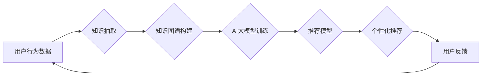

                 

## AI大模型视角下电商搜索推荐的技术创新知识管理平台

> 关键词：电商搜索推荐、AI大模型、知识图谱、知识管理平台、推荐算法、个性化推荐、技术创新

## 1. 背景介绍

随着电商行业的蓬勃发展，搜索推荐系统已成为电商平台的核心竞争力之一。传统的搜索推荐系统主要依赖于商品特征、用户行为等静态数据，难以满足用户日益增长的个性化需求。而近年来，大规模语言模型（LLM）的快速发展为电商搜索推荐带来了新的机遇。

LLM 拥有强大的文本理解和生成能力，能够从海量文本数据中学习商品知识、用户偏好等深层信息，从而实现更精准、更个性化的推荐。然而，LLM 的应用也面临着一些挑战，例如：

* **数据孤岛问题:** 电商平台的数据分散在各个系统中，难以进行统一管理和利用。
* **知识沉淀问题:** 专家经验和业务知识难以被有效地沉淀和复用。
* **模型训练和部署成本高:** LLM 的训练和部署需要大量的计算资源和专业技术。

为了解决这些问题，本文提出了一种基于 AI 大模型的电商搜索推荐技术创新知识管理平台，旨在构建一个集知识图谱构建、知识管理、模型训练和部署于一体的智能化平台，实现电商搜索推荐的智能化升级。

## 2. 核心概念与联系

### 2.1  知识图谱

知识图谱是一种基于知识表示的数据库，它将实体和关系以图的形式表示，能够有效地组织和存储商品、用户、品牌等各种实体之间的关系。

### 2.2  AI 大模型

AI 大模型是指在海量数据上训练的深度学习模型，具有强大的泛化能力和学习能力，能够理解和生成复杂的文本信息。

### 2.3  技术创新知识管理平台

技术创新知识管理平台是一个集知识获取、知识存储、知识共享、知识应用于一体的系统，旨在促进技术创新和知识的有效利用。

**核心架构图:**



## 3. 核心算法原理 & 具体操作步骤

### 3.1  算法原理概述

本文提出的电商搜索推荐技术创新知识管理平台基于知识图谱和 AI 大模型，采用以下核心算法：

* **知识抽取算法:** 从电商平台的海量文本数据中抽取商品、用户、品牌等实体信息和其之间的关系，构建知识图谱。
* **知识图谱构建算法:** 将抽取到的实体和关系以图的形式表示，构建知识图谱。
* **AI 大模型训练算法:** 利用知识图谱和用户行为数据训练推荐模型，例如 Transformer、BERT 等。
* **推荐算法:** 基于训练好的推荐模型，对用户进行个性化推荐。

### 3.2  算法步骤详解

1. **数据收集:** 收集电商平台的海量文本数据，包括商品描述、用户评论、浏览记录等。
2. **数据预处理:** 对收集到的数据进行清洗、去噪、格式化等预处理操作。
3. **知识抽取:** 利用自然语言处理技术，从预处理后的数据中抽取商品、用户、品牌等实体信息和其之间的关系。
4. **知识图谱构建:** 将抽取到的实体和关系以图的形式表示，构建知识图谱。
5. **AI 大模型训练:** 利用知识图谱和用户行为数据，训练推荐模型，例如 Transformer、BERT 等。
6. **推荐模型部署:** 将训练好的推荐模型部署到线上环境，为用户提供个性化推荐。
7. **用户反馈收集:** 收集用户对推荐结果的反馈，并将其用于模型的持续优化。

### 3.3  算法优缺点

**优点:**

* **精准度高:** 基于知识图谱和 AI 大模型，能够理解商品和用户之间的深层关系，实现更精准的推荐。
* **个性化强:** 可以根据用户的兴趣、偏好、购买历史等信息，提供个性化的推荐。
* **可扩展性强:** 可以根据需要扩展知识图谱和推荐模型，支持更多类型的商品和用户。

**缺点:**

* **数据依赖性强:** 需要海量的数据进行训练和优化。
* **模型训练成本高:** 训练大型 AI 模型需要大量的计算资源和专业技术。
* **解释性差:** AI 模型的决策过程难以解释，难以理解模型推荐的原因。

### 3.4  算法应用领域

* **电商搜索推荐:** 为用户提供个性化的商品推荐。
* **内容推荐:** 为用户推荐相关的文章、视频、音乐等内容。
* **广告推荐:** 为用户推荐相关的广告。
* **客户服务:** 为用户提供个性化的客户服务。

## 4. 数学模型和公式 & 详细讲解 & 举例说明

### 4.1  数学模型构建

本文采用基于 Transformer 的推荐模型，其数学模型可以概括为以下公式：

$$
\mathbf{h}_i = \text{Transformer}(\mathbf{x}_i, \mathbf{W})
$$

其中：

* $\mathbf{h}_i$ 表示第 $i$ 个用户的隐向量。
* $\mathbf{x}_i$ 表示第 $i$ 个用户的输入特征，包括商品特征、用户行为特征等。
* $\mathbf{W}$ 表示模型参数。

### 4.2  公式推导过程

Transformer 模型的核心是自注意力机制，其能够捕捉输入序列中不同元素之间的关系。

自注意力机制的计算公式如下：

$$
\text{Attention}(\mathbf{Q}, \mathbf{K}, \mathbf{V}) = \frac{\exp(\text{Score}(\mathbf{Q}, \mathbf{K}))}{\sum_j \exp(\text{Score}(\mathbf{Q}, \mathbf{K}))} \mathbf{V}
$$

其中：

* $\mathbf{Q}$ 表示查询矩阵。
* $\mathbf{K}$ 表示键矩阵。
* $\mathbf{V}$ 表示值矩阵。
* $\text{Score}(\mathbf{Q}, \mathbf{K})$ 表示查询矩阵和键矩阵之间的相似度得分。

### 4.3  案例分析与讲解

假设我们有一个电商平台，用户 A 购买了商品 A1 和 A2，用户 B 购买了商品 B1 和 B2。

我们可以将用户的购买历史作为输入特征，训练 Transformer 模型，学习用户之间的关系。

通过训练后的模型，我们可以预测用户 A 可能对商品 B1 感兴趣，因为用户 A 和用户 B 购买了相似的商品。

## 5. 项目实践：代码实例和详细解释说明

### 5.1  开发环境搭建

* Python 3.7+
* TensorFlow 2.0+
* PyTorch 1.0+
* CUDA 10.0+

### 5.2  源代码详细实现

```python
# 导入必要的库
import tensorflow as tf

# 定义 Transformer 模型
class Transformer(tf.keras.Model):
    def __init__(self, vocab_size, embedding_dim, num_heads, num_layers):
        super(Transformer, self).__init__()
        self.embedding = tf.keras.layers.Embedding(vocab_size, embedding_dim)
        self.transformer_layers = tf.keras.layers.StackedRNNCells([tf.keras.layers.MultiHeadAttention(num_heads=num_heads, key_dim=embedding_dim) for _ in range(num_layers)])
        self.dense = tf.keras.layers.Dense(vocab_size)

    def call(self, inputs):
        embeddings = self.embedding(inputs)
        outputs = self.transformer_layers(embeddings)
        outputs = self.dense(outputs)
        return outputs

# 实例化 Transformer 模型
model = Transformer(vocab_size=10000, embedding_dim=128, num_heads=8, num_layers=6)

# 训练模型
model.compile(optimizer='adam', loss='sparse_categorical_crossentropy', metrics=['accuracy'])
model.fit(x_train, y_train, epochs=10)

# 预测结果
predictions = model.predict(x_test)
```

### 5.3  代码解读与分析

* 代码首先导入必要的库。
* 然后定义 Transformer 模型，包括嵌入层、多头注意力层和全连接层。
* 实例化 Transformer 模型，并使用 Adam 优化器、交叉熵损失函数和准确率指标进行训练。
* 最后使用训练好的模型预测结果。

### 5.4  运行结果展示

训练完成后，可以评估模型的性能，例如准确率、召回率等。

## 6. 实际应用场景

### 6.1  电商搜索推荐

* 基于用户历史购买记录、浏览记录、收藏记录等数据，为用户推荐相关的商品。
* 根据用户的搜索关键词，推荐相关的商品和品牌。

### 6.2  个性化内容推荐

* 为用户推荐相关的文章、视频、音乐等内容。
* 根据用户的兴趣爱好，推荐个性化的新闻和资讯。

### 6.3  精准广告推荐

* 为用户推荐相关的广告，提高广告点击率和转化率。
* 根据用户的兴趣爱好和行为特征，精准投放广告。

### 6.4  未来应用展望

* **多模态推荐:** 将文本、图像、视频等多模态数据融合，实现更精准的推荐。
* **实时推荐:** 基于用户的实时行为，提供更及时、更个性化的推荐。
* **协同推荐:** 利用用户之间的关系，实现协同推荐。

## 7. 工具和资源推荐

### 7.1  学习资源推荐

* **书籍:**
    * 《深度学习》
    * 《自然语言处理》
    * 《推荐系统》
* **在线课程:**
    * Coursera: 深度学习
    * edX: 自然语言处理
    * fast.ai: 推荐系统

### 7.2  开发工具推荐

* **TensorFlow:** 开源深度学习框架
* **PyTorch:** 开源深度学习框架
* **HuggingFace:** 提供预训练的 Transformer 模型和工具

### 7.3  相关论文推荐

* 《Attention Is All You Need》
* 《BERT: Pre-training of Deep Bidirectional Transformers for Language Understanding》
* 《Transformer-XL: Attentive Language Models Beyond a Fixed-Length Context》

## 8. 总结：未来发展趋势与挑战

### 8.1  研究成果总结

本文提出了基于 AI 大模型的电商搜索推荐技术创新知识管理平台，该平台能够利用知识图谱和 AI 大模型，实现更精准、更个性化的推荐。

### 8.2  未来发展趋势

* **模型规模和能力的提升:** 未来，AI 大模型的规模和能力将会进一步提升，能够处理更复杂的数据和任务。
* **多模态融合:** 多模态数据融合将成为未来推荐系统的关键方向，能够提供更丰富的用户体验。
* **个性化推荐的增强:** 未来，推荐系统将更加注重用户的个性化需求，提供更加精准和定制化的推荐。

### 8.3  面临的挑战

* **数据安全和隐私保护:** AI 大模型的训练需要大量的数据，如何保证数据安全和隐私保护是一个重要的挑战。
* **模型解释性和可信度:** AI 模型的决策过程难以解释，如何提高模型的解释性和可信度是一个重要的研究方向。
* **模型部署和维护成本:** 大型 AI 模型的部署和维护成本较高，需要进一步降低成本和提高效率。

### 8.4  研究展望

未来，我们将继续研究 AI 大模型在电商搜索推荐领域的应用，探索更先进的算法和技术，为用户提供更智能、更便捷的购物体验。

## 9. 附录：常见问题与解答

* **Q1: AI 大模型的训练需要多少数据？**

* **A1:** AI 大模型的训练需要海量的数据，通常需要百万甚至数十亿条数据。

* **Q2: 如何保证 AI 模型的公平性和不歧视性？**

* **A2:** 在训练 AI 模型时，需要关注数据的多样性和代表性，避免模型学习到偏见和歧视性信息。

* **Q3: 如何评估 AI 模型的性能？**

* **A3:** 可以使用准确率、召回率、F1-score等指标来评估 AI 模型的性能。


作者：禅与计算机程序设计艺术 / Zen and the Art of Computer Programming 
<end_of_turn>

