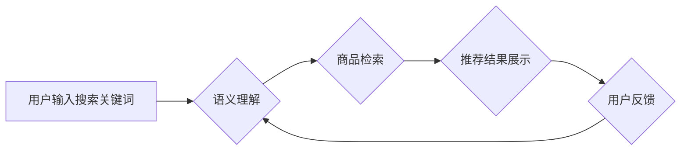

                 

## AI大模型赋能电商搜索推荐的业务创新思路

> 关键词：AI大模型、电商搜索、推荐系统、自然语言处理、深度学习、Transformer、个性化推荐

## 1. 背景介绍

随着电商行业的蓬勃发展，用户对商品搜索和推荐的需求日益增长。传统的基于关键词匹配和协同过滤的搜索推荐算法已难以满足用户个性化、精准化的需求。而近年来，大规模预训练语言模型（如BERT、GPT、T5等）的出现，为电商搜索推荐带来了新的机遇。

AI大模型凭借其强大的语义理解、文本生成和知识表示能力，能够有效提升电商搜索推荐的精准度、个性化程度和用户体验。本文将深入探讨AI大模型在电商搜索推荐领域的应用，分析其核心概念、算法原理、实践案例以及未来发展趋势。

## 2. 核心概念与联系

### 2.1  电商搜索推荐

电商搜索推荐是指在电商平台上，根据用户的搜索意图和历史行为，推荐相关商品的过程。它包含两个主要环节：

* **搜索引擎:**  根据用户的搜索关键词，从商品数据库中检索出相关商品。
* **推荐系统:**  根据用户的搜索历史、浏览记录、购买行为等信息，推荐用户可能感兴趣的商品。

### 2.2  AI大模型

AI大模型是指在海量数据上进行预训练的深度学习模型，拥有强大的泛化能力和语义理解能力。常见的AI大模型包括：

* **Transformer模型:**  基于注意力机制的模型，能够捕捉文本中的长距离依赖关系，例如BERT、GPT、T5等。
* **生成式对抗网络(GAN):**  通过生成对抗机制训练模型，能够生成高质量的文本、图像等数据。
* **图神经网络(GNN):**  能够处理图结构数据，例如用户-商品交互关系图，用于推荐个性化商品。

### 2.3  AI大模型赋能电商搜索推荐

AI大模型能够通过以下方式赋能电商搜索推荐：

* **语义理解:**  理解用户的搜索意图，即使用户输入的关键词模糊或不完整。
* **商品描述理解:**  理解商品的属性、特征和描述，提高商品检索的准确性。
* **个性化推荐:**  根据用户的历史行为和偏好，推荐更精准的商品。
* **内容生成:**  生成商品描述、推荐文案等内容，提升用户体验。

**Mermaid 流程图**



## 3. 核心算法原理 & 具体操作步骤

### 3.1  算法原理概述

AI大模型在电商搜索推荐中的核心算法主要包括：

* **BERT模型:**  用于理解用户的搜索意图和商品描述的语义。
* **协同过滤算法:**  基于用户的历史行为和商品的购买记录，推荐用户可能感兴趣的商品。
* **深度学习推荐算法:**  利用深度神经网络，学习用户和商品之间的复杂关系，进行个性化推荐。

### 3.2  算法步骤详解

**BERT模型在电商搜索推荐中的应用步骤:**

1. **预训练:**  在海量文本数据上预训练BERT模型，使其具备强大的语义理解能力。
2. **下游任务微调:**  将预训练好的BERT模型用于电商搜索推荐的下游任务，例如搜索意图分类、商品检索、推荐排序等。
3. **特征提取:**  利用BERT模型提取用户的搜索关键词和商品描述的语义特征。
4. **模型融合:**  将BERT模型提取的语义特征与其他推荐算法的特征融合，构建更精准的推荐模型。

**协同过滤算法的步骤:**

1. **构建用户-商品交互矩阵:**  记录用户对商品的评分、购买记录等交互行为。
2. **计算用户相似度:**  根据用户的交互行为，计算用户之间的相似度。
3. **计算商品相似度:**  根据商品的交互行为，计算商品之间的相似度。
4. **推荐商品:**  根据用户的相似用户或相似商品，推荐用户可能感兴趣的商品。

### 3.3  算法优缺点

**BERT模型:**

* **优点:**  强大的语义理解能力，能够捕捉文本中的复杂关系。
* **缺点:**  训练成本高，需要海量数据和计算资源。

**协同过滤算法:**

* **优点:**  简单易实现，能够推荐用户可能感兴趣的商品。
* **缺点:**  容易陷入冷启动问题，对于新用户和新商品的推荐效果较差。

### 3.4  算法应用领域

* **电商搜索:**  提高商品检索的准确性和相关性。
* **个性化推荐:**  根据用户的兴趣和偏好，推荐个性化的商品。
* **内容生成:**  生成商品描述、推荐文案等内容。
* **用户画像:**  构建用户的兴趣画像，帮助商家了解用户的需求。

## 4. 数学模型和公式 & 详细讲解 & 举例说明

### 4.1  数学模型构建

**BERT模型的数学模型:**

BERT模型基于Transformer架构，其核心是注意力机制。注意力机制能够学习文本中不同词语之间的关系，并赋予每个词语不同的权重。

**公式:**

$$
Attention(Q, K, V) = softmax(\frac{QK^T}{\sqrt{d_k}})V
$$

其中：

* $Q$：查询矩阵
* $K$：键矩阵
* $V$：值矩阵
* $d_k$：键向量的维度
* $softmax$：softmax函数

**协同过滤算法的数学模型:**

协同过滤算法通常使用矩阵分解的方法，将用户-商品交互矩阵分解成两个低维矩阵，分别表示用户和商品的特征向量。

**公式:**

$$
R = U V^T
$$

其中：

* $R$：用户-商品交互矩阵
* $U$：用户特征矩阵
* $V$：商品特征矩阵

### 4.2  公式推导过程

**BERT模型的注意力机制公式推导:**

1. 计算查询向量 $Q$、键向量 $K$ 和值向量 $V$。
2. 计算 $QK^T$ 的每个元素，并进行归一化。
3. 应用 softmax 函数，得到每个词语的注意力权重。
4. 将注意力权重与值向量 $V$ 进行加权求和，得到最终的输出。

**协同过滤算法的矩阵分解公式推导:**

1. 假设用户-商品交互矩阵 $R$ 是一个 $m \times n$ 的矩阵，其中 $m$ 表示用户数量，$n$ 表示商品数量。
2. 将 $R$ 分解成两个低维矩阵 $U$ 和 $V$，分别表示用户和商品的特征向量。
3. $U$ 是一个 $m \times k$ 的矩阵，$V$ 是一个 $n \times k$ 的矩阵，其中 $k$ 是特征向量的维度。
4. 通过最小化 $R - UV^T$ 的平方误差，可以得到 $U$ 和 $V$ 的最佳解。

### 4.3  案例分析与讲解

**BERT模型在电商搜索推荐中的案例分析:**

* **京东:**  利用BERT模型理解用户的搜索意图，提高商品检索的准确性。例如，用户搜索“手机壳”，BERT模型能够理解用户想要购买手机壳的意图，并推荐相关商品。

* **淘宝:**  利用BERT模型生成商品描述，提升用户体验。例如，BERT模型可以根据商品的属性和特征，生成更详细、更吸引人的商品描述。

**协同过滤算法在电商推荐中的案例分析:**

* **亚马逊:**  利用协同过滤算法推荐商品，例如，如果用户购买了某个商品，亚马逊会推荐其他用户购买了该商品的用户也可能感兴趣的商品。

* **拼多多:**  利用协同过滤算法进行商品分组，将相似商品进行分组，方便用户浏览和选择。

## 5. 项目实践：代码实例和详细解释说明

### 5.1  开发环境搭建

* **操作系统:**  Linux/macOS/Windows
* **编程语言:**  Python
* **深度学习框架:**  TensorFlow/PyTorch
* **其他工具:**  Git、Jupyter Notebook

### 5.2  源代码详细实现

```python
# 使用BERT模型进行商品检索
from transformers import AutoTokenizer, AutoModel

# 加载预训练的BERT模型
model_name = "bert-base-uncased"
tokenizer = AutoTokenizer.from_pretrained(model_name)
model = AutoModel.from_pretrained(model_name)

# 用户输入的搜索关键词
query = "手机壳"

# 将搜索关键词转换为BERT模型输入格式
input_ids = tokenizer.encode(query, add_special_tokens=True)

# 将输入数据送入BERT模型进行处理
outputs = model(input_ids)

# 从BERT模型的输出中提取语义特征
embeddings = outputs.last_hidden_state[:, 0, :]

# 使用余弦相似度计算商品与搜索关键词的相似度
# ...

# 根据相似度排序商品，并返回推荐结果
```

### 5.3  代码解读与分析

* **加载预训练模型:**  使用transformers库加载预训练的BERT模型和分词器。
* **文本预处理:**  将用户输入的搜索关键词转换为BERT模型输入格式。
* **模型推理:**  将预处理后的文本数据送入BERT模型进行处理，获取商品的语义特征。
* **相似度计算:**  使用余弦相似度等方法计算商品与搜索关键词的相似度。
* **推荐结果排序:**  根据相似度排序商品，并返回推荐结果。

### 5.4  运行结果展示

运行上述代码后，将返回与用户搜索关键词最相似的商品列表。

## 6. 实际应用场景

### 6.1  电商搜索场景

* **精准搜索:**  AI大模型能够理解用户的模糊搜索意图，提高商品检索的准确性。
* **个性化搜索:**  根据用户的历史行为和偏好，推荐用户可能感兴趣的商品。
* **搜索结果排序:**  根据用户的搜索意图和商品的属性，对搜索结果进行排序，提升用户体验。

### 6.2  商品推荐场景

* **个性化推荐:**  根据用户的兴趣和偏好，推荐个性化的商品。
* **跨界推荐:**  推荐用户可能感兴趣的跨界商品，例如，用户购买了运动鞋，AI大模型可以推荐运动服、运动耳机等相关商品。
* **新品推荐:**  推荐新上市的商品，帮助用户发现新产品。

### 6.3  内容生成场景

* **商品描述生成:**  AI大模型可以根据商品的属性和特征，生成更详细、更吸引人的商品描述。
* **推荐文案生成:**  AI大模型可以生成个性化的推荐文案，提升用户点击率。
* **用户评论分析:**  AI大模型可以分析用户的评论，了解用户对商品的评价和反馈。

### 6.4  未来应用展望

* **多模态推荐:**  结合文本、图像、视频等多模态数据，进行更精准的推荐。
* **实时推荐:**  根据用户的实时行为，进行动态的推荐。
* **解释性推荐:**  解释推荐结果背后的逻辑，提升用户信任度。

## 7. 工具和资源推荐

### 7.1  学习资源推荐

* **书籍:**  《深度学习》、《自然语言处理》
* **在线课程:**  Coursera、edX、Udacity
* **博客:**  Towards Data Science、Machine Learning Mastery

### 7.2  开发工具推荐

* **深度学习框架:**  TensorFlow、PyTorch
* **自然语言处理库:**  NLTK、spaCy
* **数据可视化工具:**  Matplotlib、Seaborn

### 7.3  相关论文推荐

* BERT: Pre-training of Deep Bidirectional Transformers for Language Understanding
* Attention Is All You Need
* Collaborative Filtering for Recommender Systems

## 8. 总结：未来发展趋势与挑战

### 8.1  研究成果总结

AI大模型在电商搜索推荐领域取得了显著的成果，例如：

* 提升了商品检索的准确性和相关性。
* 实现了个性化商品推荐。
* 提高了用户体验。

### 8.2  未来发展趋势

* **多模态推荐:**  结合文本、图像、视频等多模态数据，进行更精准的推荐。
* **实时推荐:**  根据用户的实时行为，进行动态的推荐。
* **解释性推荐:**  解释推荐结果背后的逻辑，提升用户信任度。
* **联邦学习:**  在保护用户隐私的前提下，进行模型训练和更新。

### 8.3  面临的挑战

* **数据质量:**  AI大模型需要海量高质量的数据进行训练，而电商平台的数据往往存在噪声、缺失等问题。
* **模型 interpretability:**  AI大模型的决策过程往往是黑箱的，难以解释，这可能会导致用户对推荐结果的信任度降低。
* **计算资源:**  训练大型AI大模型需要大量的计算资源，这对于中小企业来说是一个挑战。

### 8.4  研究展望

未来，AI大模型在电商搜索推荐领域将继续发挥重要作用，并不断朝着更精准、更个性化、更智能的方向发展。


## 9. 附录：常见问题与解答

**Q1:  AI大模型的训练成本很高，中小企业如何应用？**

**A1:**  可以利用开源的预训练模型，进行微调，降低训练成本。

**Q2:  AI大模型的推荐结果是否会存在偏差？**

**A2:**  AI大模型的推荐结果可能会存在偏差，例如，推荐结果可能过于同质化，或者忽略了用户的个性化需求。因此，需要不断进行模型评估和优化，以减少偏差。

**Q3:  如何保证AI大模型的安全性？**

**A3:**  需要对AI大模型进行安全评估，并采取相应的安全措施，例如，防止数据泄露、模型攻击等。

**作者：禅与计算机程序设计艺术 / Zen and the Art of Computer Programming**<end_of_turn>

