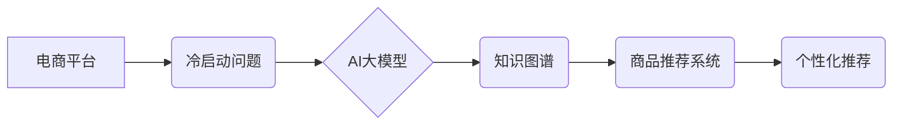

                 

## AI大模型：改善电商平台冷启动商品推荐的新思路

> 关键词：电商平台、冷启动问题、商品推荐、AI大模型、Transformer、知识图谱、个性化推荐

## 1. 背景介绍

在当今数据爆炸的时代，电商平台作为商品交易的重要载体，商品推荐系统已成为其核心竞争力之一。然而，对于新上线的商品，由于缺乏用户行为数据，难以准确预测用户兴趣，导致推荐效果低下，进而影响商品曝光和销量，这被称为“冷启动问题”。传统基于协同过滤和内容过滤的推荐算法在面对冷启动商品时表现乏力，亟需新的技术手段来解决这一难题。

近年来，随着深度学习技术的快速发展，特别是 Transformer 模型的出现，AI 大模型在自然语言处理、图像识别等领域取得了突破性进展。其强大的学习能力和泛化能力为解决电商平台冷启动商品推荐问题提供了新的思路。

## 2. 核心概念与联系

### 2.1  冷启动问题

冷启动问题是指在推荐系统中，对于新用户或新商品，由于缺乏历史数据，难以准确预测其偏好，导致推荐效果不佳。

### 2.2  AI 大模型

AI 大模型是指在海量数据上训练的深度学习模型，具有强大的学习能力和泛化能力。常见的 AI 大模型包括 BERT、GPT-3、LaMDA 等。

### 2.3  知识图谱

知识图谱是一种结构化的知识表示形式，将实体和关系以图的形式表示，能够捕捉事物之间的语义关联。

### 2.4  商品推荐系统

商品推荐系统旨在根据用户的历史行为、偏好等信息，推荐用户可能感兴趣的商品。

**核心概念与架构关系：**



## 3. 核心算法原理 & 具体操作步骤

### 3.1  算法原理概述

本文提出的方法基于 Transformer 模型和知识图谱，构建了一个新的商品推荐算法。该算法首先利用 Transformer 模型对商品描述文本进行编码，提取商品的语义特征。然后，将商品语义特征与知识图谱中的商品关系进行融合，构建商品的知识表示。最后，根据用户的历史行为和商品的知识表示，利用个性化推荐算法进行商品推荐。

### 3.2  算法步骤详解

1. **数据预处理:** 收集商品描述文本、用户行为数据和知识图谱数据。对文本数据进行清洗、分词、词向量化等预处理操作。
2. **商品语义特征提取:** 利用 Transformer 模型对商品描述文本进行编码，提取商品的语义特征。
3. **商品知识表示构建:** 将商品语义特征与知识图谱中的商品关系进行融合，构建商品的知识表示。
4. **用户兴趣建模:** 根据用户的历史行为数据，构建用户的兴趣模型。
5. **商品推荐:** 利用个性化推荐算法，根据用户的兴趣模型和商品的知识表示，进行商品推荐。

### 3.3  算法优缺点

**优点:**

* 能够有效解决冷启动问题，对新商品进行准确推荐。
* 能够利用知识图谱中的语义信息，提升商品推荐的准确性和个性化程度。
* 具有较强的泛化能力，能够应用于不同类型的电商平台。

**缺点:**

* 需要大量的训练数据和计算资源。
* 知识图谱的构建和维护需要专业知识和技术支持。

### 3.4  算法应用领域

该算法可应用于各种电商平台，例如：

* 服装电商平台
* 电子产品电商平台
* 食品电商平台
* 旅游电商平台

## 4. 数学模型和公式 & 详细讲解 & 举例说明

### 4.1  数学模型构建

**商品语义特征提取:**

假设商品描述文本为 $T = \{w_1, w_2, ..., w_n\}$, 其中 $w_i$ 为文本中的第 $i$ 个词。利用 Transformer 模型，可以将文本 $T$ 编码为一个向量 $h = \{h_1, h_2, ..., h_n\}$, 其中 $h_i$ 为第 $i$ 个词的语义向量。

**商品知识表示构建:**

假设商品 $i$ 在知识图谱中的关系为 $R_i = \{r_{i1}, r_{i2}, ..., r_{in}\}$, 其中 $r_{ij}$ 为商品 $i$ 与其他实体之间的关系。将商品语义特征 $h_i$ 与关系向量 $r_{ij}$ 进行融合，可以构建商品 $i$ 的知识表示 $k_i$:

$$k_i = f(h_i, R_i)$$

其中 $f$ 为融合函数。

**用户兴趣建模:**

假设用户 $u$ 的历史行为数据为 $D_u = \{d_{u1}, d_{u2}, ..., d_{un}\}$, 其中 $d_{ui}$ 为用户 $u$ 的第 $i$ 个行为。利用机器学习算法，可以将用户行为数据 $D_u$ 编码为用户兴趣向量 $p_u$:

$$p_u = g(D_u)$$

其中 $g$ 为编码函数。

**商品推荐:**

利用用户兴趣向量 $p_u$ 和商品知识表示 $k_i$，计算商品 $i$ 对用户 $u$ 的推荐得分 $s_{ui}$:

$$s_{ui} = h(p_u, k_i)$$

其中 $h$ 为推荐函数。

### 4.2  公式推导过程

公式推导过程涉及到 Transformer 模型的编码机制、知识图谱关系的表示以及用户兴趣建模的算法，具体推导过程较为复杂，需要结合具体的模型架构和算法实现进行详细说明。

### 4.3  案例分析与讲解

假设一个电商平台要推荐用户购买的手机，可以使用上述算法进行推荐。

1. **商品语义特征提取:** 利用 Transformer 模型对手机的描述文本进行编码，提取手机的语义特征，例如品牌、型号、配置、价格等信息。
2. **商品知识表示构建:** 将手机的语义特征与知识图谱中的手机关系进行融合，例如手机与品牌的关系、手机与型号的关系、手机与配置的关系等。
3. **用户兴趣建模:** 根据用户的历史购买记录、浏览记录、评价记录等行为数据，构建用户的兴趣模型，例如用户偏好的手机品牌、型号、配置等信息。
4. **商品推荐:** 利用用户的兴趣模型和手机的知识表示，计算手机对用户的推荐得分，并根据推荐得分排序推荐手机给用户。

## 5. 项目实践：代码实例和详细解释说明

### 5.1  开发环境搭建

该项目可以使用 Python 语言进行开发，并利用 TensorFlow 或 PyTorch 等深度学习框架进行模型训练。

### 5.2  源代码详细实现

```python
# 商品语义特征提取
import tensorflow as tf

# 定义 Transformer 模型
model = tf.keras.Sequential([
    # ... Transformer 模型层
])

# 对商品描述文本进行编码
text = "这是一款高性能手机，配置了最新的处理器和内存。"
embedding = model.predict(text)

# 商品知识表示构建
# ... 使用知识图谱数据构建商品知识表示

# 用户兴趣建模
# ... 使用机器学习算法构建用户兴趣模型

# 商品推荐
# ... 使用推荐函数计算商品推荐得分
```

### 5.3  代码解读与分析

代码示例展示了商品语义特征提取、商品知识表示构建、用户兴趣建模和商品推荐的步骤。

### 5.4  运行结果展示

运行代码后，可以得到商品推荐结果，例如推荐给用户的手机列表，以及每个手机的推荐得分。

## 6. 实际应用场景

### 6.1  电商平台冷启动商品推荐

该算法可以有效解决电商平台冷启动商品推荐问题，提高新商品的曝光率和销量。

### 6.2  个性化商品推荐

该算法可以根据用户的兴趣偏好，进行个性化商品推荐，提升用户体验。

### 6.3  跨平台商品推荐

该算法可以利用知识图谱中的商品关系，实现跨平台商品推荐，例如将服装电商平台的商品推荐到旅游电商平台。

### 6.4  未来应用展望

未来，该算法可以进一步结合其他技术，例如强化学习、联邦学习等，实现更智能、更精准的商品推荐。

## 7. 工具和资源推荐

### 7.1  学习资源推荐

* **深度学习书籍:** 《深度学习》、《动手学深度学习》
* **Transformer 模型论文:** 《Attention Is All You Need》
* **知识图谱构建工具:** Neo4j、GraphDB

### 7.2  开发工具推荐

* **深度学习框架:** TensorFlow、PyTorch
* **自然语言处理库:** NLTK、spaCy
* **数据处理工具:** Pandas、NumPy

### 7.3  相关论文推荐

* 《BERT: Pre-training of Deep Bidirectional Transformers for Language Understanding》
* 《GPT-3: Language Models are Few-Shot Learners》
* 《Knowledge Graph Embedding: A Survey》

## 8. 总结：未来发展趋势与挑战

### 8.1  研究成果总结

本文提出了一种基于 Transformer 模型和知识图谱的商品推荐算法，能够有效解决电商平台冷启动问题，并提升商品推荐的准确性和个性化程度。

### 8.2  未来发展趋势

未来，商品推荐算法将朝着以下方向发展:

* **更强大的模型:** 利用更先进的 Transformer 模型架构和训练方法，提升模型的学习能力和泛化能力。
* **更丰富的知识表示:** 构建更全面的知识图谱，并利用更 sophisticated 的方法进行知识表示和融合。
* **更个性化的推荐:** 利用用户行为数据、用户画像等信息，进行更精准的个性化推荐。
* **更智能的推荐:** 利用强化学习等技术，实现更智能的推荐策略，例如推荐用户可能感兴趣但尚未发现的商品。

### 8.3  面临的挑战

商品推荐算法也面临一些挑战:

* **数据稀疏性:** 对于冷启动商品，数据稀疏性问题仍然是一个难题。
* **知识图谱构建和维护:** 知识图谱的构建和维护需要大量的专业知识和技术支持。
* **模型解释性和可解释性:** 随着模型复杂度的增加，模型的解释性和可解释性也成为一个挑战。

### 8.4  研究展望

未来，我们将继续研究更先进的商品推荐算法，并将其应用于更多场景，为用户提供更智能、更个性化的商品推荐服务。

## 9. 附录：常见问题与解答

**Q1: 该算法是否适用于所有类型的电商平台?**

A1: 该算法适用于多种类型的电商平台，但具体效果取决于平台的商品类型、用户群体等因素。

**Q2: 该算法需要多少数据才能训练?**

A2: 该算法需要大量的训练数据，具体数量取决于模型复杂度和数据质量。

**Q3: 该算法的计算资源需求如何?**

A3: 该算法的计算资源需求较高，需要使用强大的计算设备进行训练。


作者：禅与计算机程序设计艺术 / Zen and the Art of Computer Programming 
<end_of_turn>

