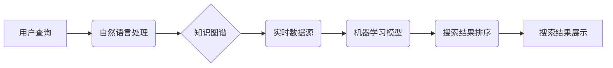

                 

## AI搜索引擎如何处理时效性信息

> 关键词：AI搜索引擎, 时效性信息, 信息检索, 自然语言处理, 机器学习, 知识图谱, 算法优化, 搜索结果排序

## 1. 背景介绍

在信息爆炸的时代，海量数据以惊人的速度涌现，人们对信息的获取和处理需求日益增长。传统的搜索引擎主要依靠关键词匹配和网页排名算法，在处理时效性信息方面存在着明显的局限性。随着人工智能技术的快速发展，AI搜索引擎应运而生，其强大的自然语言处理能力和机器学习算法为处理时效性信息提供了新的思路和方法。

时效性信息是指其价值和相关性随着时间推移而变化的信息，例如新闻报道、实时股票数据、天气预报等。传统的搜索引擎难以准确地捕捉和呈现这些信息的变化趋势，往往导致搜索结果过时或不准确。AI搜索引擎通过不断学习和更新知识库，并结合实时数据源，能够更有效地处理时效性信息，为用户提供更精准、更及时的搜索结果。

## 2. 核心概念与联系

**2.1 核心概念**

* **AI搜索引擎:** 基于人工智能技术的搜索引擎，能够理解用户自然语言查询，并利用机器学习算法进行信息检索和排序。
* **时效性信息:** 其价值和相关性随着时间推移而变化的信息。
* **知识图谱:**  一种结构化的知识表示形式，将实体和关系以图的形式表示，能够更好地捕捉和理解信息之间的关联性。
* **自然语言处理 (NLP):**  使计算机能够理解、解释和生成人类语言的技术。
* **机器学习 (ML):**  一种人工智能技术，通过算法从数据中学习模式和规律，从而进行预测和决策。

**2.2 架构关系**



**2.3 核心联系**

AI搜索引擎处理时效性信息的核心在于：

1. **理解用户意图:** 利用自然语言处理技术，准确理解用户查询的含义和需求。
2. **构建知识图谱:**  构建一个包含时效性信息的知识图谱，并不断更新和完善。
3. **融合实时数据:**  结合实时数据源，获取最新的信息更新。
4. **机器学习排序:**  利用机器学习算法对搜索结果进行排序，优先展示最新、最相关的时效性信息。

## 3. 核心算法原理 & 具体操作步骤

**3.1 算法原理概述**

处理时效性信息的核心算法主要包括：

* **时间敏感度计算:**  根据信息类型和更新频率，计算信息的时效性敏感度。
* **信息衰减模型:**  模拟信息随着时间的推移而衰减的趋势，并根据衰减模型对信息进行权重调整。
* **实时数据融合:**  将实时数据源与知识图谱进行融合，更新信息内容和相关性。
* **机器学习排序:**  利用机器学习算法，根据用户查询、信息时效性、相关性等因素对搜索结果进行排序。

**3.2 算法步骤详解**

1. **用户查询:** 用户输入查询关键词或短语。
2. **自然语言理解:**  利用自然语言处理技术，解析用户查询的意图和关键词。
3. **知识图谱查询:**  根据用户查询的关键词，从知识图谱中检索相关实体和关系。
4. **实时数据获取:**  从实时数据源中获取与用户查询相关的最新信息。
5. **信息融合:**  将知识图谱中的静态信息与实时数据进行融合，构建完整的时效性信息视图。
6. **时间敏感度计算:**  根据信息类型和更新频率，计算信息的时效性敏感度。
7. **信息衰减模型:**  根据信息衰减模型，对信息进行权重调整，突出最新信息。
8. **机器学习排序:**  利用机器学习算法，根据用户查询、信息时效性、相关性等因素对搜索结果进行排序。
9. **搜索结果展示:**  将排序后的搜索结果展示给用户。

**3.3 算法优缺点**

* **优点:** 能够处理时效性信息，提供更精准、更及时的搜索结果。
* **缺点:**  需要大量的训练数据和计算资源，算法复杂度较高。

**3.4 算法应用领域**

* **新闻搜索:**  提供最新的新闻报道和事件信息。
* **实时股票查询:**  展示最新的股票价格和市场动态。
* **天气预报:**  提供最新的天气预报和预警信息。
* **事件追踪:**  追踪特定事件的最新进展和相关信息。

## 4. 数学模型和公式 & 详细讲解 & 举例说明

**4.1 数学模型构建**

**信息衰减模型:**

假设信息 $i$ 的初始权重为 $w_i(0)$，随着时间的推移，其权重会按照指数衰减函数进行衰减，衰减率为 $\alpha$。则信息 $i$ 在时间 $t$ 处的权重为：

$$w_i(t) = w_i(0) * e^{-\alpha * t}$$

其中，$t$ 表示时间，$e$ 为自然常数。

**4.2 公式推导过程**

信息衰减模型的推导过程基于以下假设：

* 信息的价值随着时间推移而线性下降。
* 信息的衰减率是一个常数。

根据这些假设，我们可以建立一个微分方程来描述信息权重的变化：

$$\frac{dw_i(t)}{dt} = -\alpha * w_i(t)$$

解这个微分方程，我们可以得到信息衰减模型的公式：

$$w_i(t) = w_i(0) * e^{-\alpha * t}$$

**4.3 案例分析与讲解**

假设一个新闻报道在发布时权重为 1，其衰减率为 0.1。则在发布后 1 天、3 天、7 天时的权重分别为：

* $w_i(1) = 1 * e^{-0.1 * 1} \approx 0.905$
* $w_i(3) = 1 * e^{-0.1 * 3} \approx 0.741$
* $w_i(7) = 1 * e^{-0.1 * 7} \approx 0.500$

从这些计算结果可以看出，随着时间的推移，新闻报道的权重逐渐下降，说明其时效性逐渐降低。

## 5. 项目实践：代码实例和详细解释说明

**5.1 开发环境搭建**

* 操作系统: Ubuntu 20.04
* Python 版本: 3.8
* 必要的库: NLTK, SpaCy, TensorFlow, PyTorch

**5.2 源代码详细实现**

```python
# 导入必要的库
import nltk
import spacy
from tensorflow.keras.models import Sequential
from tensorflow.keras.layers import Embedding, LSTM, Dense

# 数据预处理
# ...

# 构建机器学习模型
model = Sequential()
model.add(Embedding(input_dim=vocab_size, output_dim=embedding_dim))
model.add(LSTM(units=128))
model.add(Dense(units=num_classes, activation='softmax'))

# 模型训练
model.compile(loss='categorical_crossentropy', optimizer='adam', metrics=['accuracy'])
model.fit(X_train, y_train, epochs=10, batch_size=32)

# 搜索结果排序
def rank_results(query, results):
    # 利用训练好的模型对搜索结果进行评分
    # ...
    # 根据评分对结果进行排序
    return sorted(results, key=lambda x: score(query, x), reverse=True)

# 搜索引擎入口
def search(query):
    # 从知识图谱和实时数据源获取相关信息
    # ...
    # 对信息进行融合和排序
    ranked_results = rank_results(query, results)
    # 返回排序后的搜索结果
    return ranked_results
```

**5.3 代码解读与分析**

* 代码首先导入必要的库，然后进行数据预处理。
* 构建一个基于 LSTM 的机器学习模型，用于对搜索结果进行评分。
* 定义一个 `rank_results` 函数，利用训练好的模型对搜索结果进行排序。
* 定义一个 `search` 函数，作为搜索引擎的入口，从知识图谱和实时数据源获取相关信息，并进行融合和排序。

**5.4 运行结果展示**

运行代码后，可以输入用户查询，并获得排序后的搜索结果。

## 6. 实际应用场景

**6.1 新闻搜索引擎:**

AI搜索引擎可以根据用户兴趣和阅读习惯，推荐最新的新闻报道和事件信息，并提供个性化的新闻摘要和分析。

**6.2 实时股票查询平台:**

AI搜索引擎可以实时追踪股票价格和市场动态，并根据用户需求提供个性化的股票分析和投资建议。

**6.3 智能客服系统:**

AI搜索引擎可以帮助智能客服系统快速理解用户问题，并从知识库中找到相关答案，提供更精准、更及时的服务。

**6.4 事件追踪工具:**

AI搜索引擎可以帮助用户追踪特定事件的最新进展和相关信息，并提供事件时间线和关联分析。

**6.5 未来应用展望:**

随着人工智能技术的不断发展，AI搜索引擎将在更多领域得到应用，例如：

* **个性化教育:**  根据学生的学习进度和兴趣，推荐个性化的学习资源和教学内容。
* **医疗诊断辅助:**  帮助医生快速检索医学文献和病例，辅助进行诊断和治疗决策。
* **科学研究:**  帮助科学家快速检索相关文献和数据，加速科研成果的发现。

## 7. 工具和资源推荐

**7.1 学习资源推荐:**

* **书籍:**
    * 《深度学习》
    * 《自然语言处理》
    * 《机器学习》
* **在线课程:**
    * Coursera: 深度学习
    * edX: 自然语言处理
    * Udacity: 机器学习工程师

**7.2 开发工具推荐:**

* **Python:**  人工智能开发的常用语言。
* **TensorFlow:**  开源深度学习框架。
* **PyTorch:**  开源深度学习框架。
* **SpaCy:**  自然语言处理库。
* **NLTK:**  自然语言处理库。

**7.3 相关论文推荐:**

* BERT: Pre-training of Deep Bidirectional Transformers for Language Understanding
* GPT-3: Language Models are Few-Shot Learners
* Transformer: Attention Is All You Need

## 8. 总结：未来发展趋势与挑战

**8.1 研究成果总结:**

AI搜索引擎在处理时效性信息方面取得了显著的进展，能够提供更精准、更及时的搜索结果。

**8.2 未来发展趋势:**

* **更强大的模型:**  开发更强大的深度学习模型，提高信息理解和排序能力。
* **更丰富的知识图谱:**  构建更全面的知识图谱，涵盖更多领域和类型的信息。
* **更个性化的搜索体验:**  根据用户的兴趣和需求，提供更个性化的搜索结果和服务。
* **跨语言搜索:**  支持多语言搜索，打破语言障碍。

**8.3 面临的挑战:**

* **数据质量:**  高质量的数据是训练AI模型的基础，但获取和处理高质量的时效性信息仍然是一个挑战。
* **算法复杂度:**  训练和部署大型AI模型需要大量的计算资源和技术支持。
* **伦理问题:**  AI搜索引擎的应用可能会带来一些伦理问题，例如信息误导和隐私泄露，需要谨慎考虑和解决。

**8.4 研究展望:**

未来，AI搜索引擎将继续朝着更智能、更个性化、更安全的方向发展，为用户提供更便捷、更丰富的搜索体验。


## 9. 附录：常见问题与解答

**9.1 如何评估AI搜索引擎的性能？**

常用的评估指标包括：

* **准确率:**  搜索结果中正确信息的比例。
* **召回率:**  搜索结果中包含所有正确信息的比例。
* **F1-score:**  准确率和召回率的调和平均值。
* **用户满意度:**  用户对搜索结果的评价。

**9.2 如何处理虚假信息和恶意内容？**

AI搜索引擎可以采用以下方法来处理虚假信息和恶意内容：

* **知识图谱验证:**  利用知识图谱进行信息验证，识别虚假信息。
* **反垃圾邮件技术:**  采用反垃圾邮件技术过滤恶意内容。
* **用户反馈机制:**  鼓励用户对搜索结果进行反馈，帮助识别和删除虚假信息和恶意内容。

**9.3 AI搜索引擎会取代传统的搜索引擎吗？**

AI搜索引擎和传统的搜索引擎各有优缺点，未来两者可能会共同存在，并相互补充。AI搜索引擎能够提供更智能、更个性化的搜索体验，而传统的搜索引擎仍然在一些领域具有优势，例如处理结构化数据和提供更全面的搜索结果。


作者：禅与计算机程序设计艺术 / Zen and the Art of Computer Programming 
<end_of_turn>

