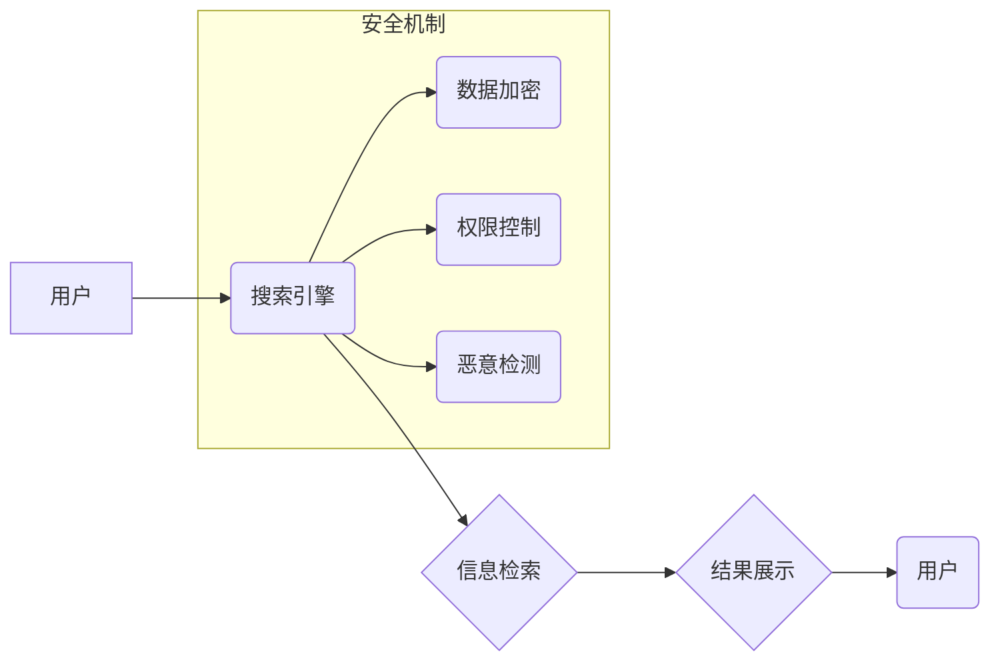

                 

## AI搜索引擎如何应对信息安全问题

> 关键词：AI搜索引擎,信息安全,数据隐私,恶意攻击,安全机制,机器学习,深度学习,自然语言处理,对抗样本

## 1. 背景介绍

随着人工智能技术的飞速发展，AI搜索引擎逐渐成为信息获取和知识发现的重要工具。相比传统搜索引擎，AI搜索引擎能够更深入地理解用户意图，提供更精准、个性化的搜索结果。然而，AI搜索引擎的强大功能也带来了新的信息安全挑战。

**1.1 信息安全威胁**

AI搜索引擎处理海量用户数据，包括搜索历史、浏览记录、个人信息等，这些数据对于个人隐私和国家安全都具有重要价值。恶意攻击者可能会利用AI搜索引擎的漏洞窃取敏感信息、传播虚假信息、进行网络攻击等。

**1.2 挑战性问题**

* **数据隐私泄露:** AI搜索引擎需要收集和分析大量用户数据，如何保护用户隐私免受泄露和滥用成为一个关键问题。
* **恶意攻击:** 攻击者可以利用AI技术生成对抗样本，欺骗AI搜索引擎，获取敏感信息或传播恶意内容。
* **信息操纵:** 攻击者可以利用AI技术批量生成虚假信息，操纵搜索结果，影响用户认知和决策。
* **算法偏见:** AI算法可能存在偏见，导致搜索结果不公平或歧视性，加剧社会分化。

## 2. 核心概念与联系

**2.1 核心概念**

* **AI搜索引擎:** 基于人工智能技术的搜索引擎，能够理解用户自然语言查询，提供更精准、个性化的搜索结果。
* **信息安全:** 保护信息系统和数据免受未经授权访问、使用、披露、修改或销毁的威胁。
* **数据隐私:** 个人信息在收集、使用、存储和处理过程中受到保护的权利。
* **恶意攻击:** 旨在损害信息系统或数据安全的行为。
* **对抗样本:** специально设计的输入数据，旨在欺骗AI模型，使其产生错误的输出。

**2.2 架构关系**



## 3. 核心算法原理 & 具体操作步骤

**3.1 算法原理概述**

AI搜索引擎的核心算法通常基于机器学习和深度学习技术，包括：

* **自然语言处理 (NLP):** 用于理解用户搜索意图，提取关键词和语义信息。
* **信息检索 (IR):** 用于从海量数据中检索相关信息，并根据用户需求进行排序和排名。
* **推荐系统:** 用于根据用户历史行为和偏好，推荐相关内容。

**3.2 算法步骤详解**

1. **数据预处理:** 收集和清洗用户数据，包括搜索词、点击记录、浏览历史等，并进行文本处理、特征提取等操作。
2. **模型训练:** 使用机器学习算法训练模型，例如深度神经网络，学习用户搜索行为模式和信息检索规律。
3. **搜索请求处理:** 当用户提出搜索请求时，AI搜索引擎会使用训练好的模型分析用户意图，并从数据库中检索相关信息。
4. **结果排序和排名:** 根据用户搜索意图和信息相关性，对检索结果进行排序和排名，并展示给用户。
5. **反馈机制:** 收集用户反馈信息，例如点击率、评分等，并将其用于模型更新和优化。

**3.3 算法优缺点**

* **优点:** 能够理解用户自然语言查询，提供更精准、个性化的搜索结果，并不断学习和优化。
* **缺点:** 需要大量数据进行训练，训练过程复杂且耗时，容易受到对抗样本攻击，存在算法偏见问题。

**3.4 算法应用领域**

* **搜索引擎:** 提供更精准、个性化的搜索结果。
* **推荐系统:** 推荐用户感兴趣的内容，例如商品、电影、音乐等。
* **问答系统:** 回答用户提出的问题，提供相关信息和知识。
* **聊天机器人:** 与用户进行自然语言对话，提供服务和帮助。

## 4. 数学模型和公式 & 详细讲解 & 举例说明

**4.1 数学模型构建**

AI搜索引擎的核心算法通常基于概率模型，例如贝叶斯网络和隐马尔可夫模型。这些模型可以用来计算用户搜索意图和信息相关性的概率。

**4.2 公式推导过程**

例如，在贝叶斯网络中，我们可以使用以下公式计算用户搜索词 $w$ 和文档 $d$ 的相关性概率：

$$P(d|w) = \frac{P(w|d)P(d)}{P(w)}$$

其中：

* $P(d|w)$ 是文档 $d$ 给定搜索词 $w$ 的条件概率。
* $P(w|d)$ 是搜索词 $w$ 给定文档 $d$ 的条件概率。
* $P(d)$ 是文档 $d$ 的先验概率。
* $P(w)$ 是搜索词 $w$ 的先验概率。

**4.3 案例分析与讲解**

假设用户搜索词为 "人工智能"，文档 $d$ 为一篇关于人工智能的文章。我们可以根据用户搜索历史、文档内容和相关信息，计算出 $P(w|d)$、$P(d)$ 和 $P(w)$ 的值，进而得到 $P(d|w)$ 的值，判断文档 $d$ 与用户搜索意图的匹配程度。

## 5. 项目实践：代码实例和详细解释说明

**5.1 开发环境搭建**

* 操作系统: Ubuntu 20.04
* Python 版本: 3.8
* 必要的库: TensorFlow, PyTorch, NLTK, Scikit-learn

**5.2 源代码详细实现**

```python
# 导入必要的库
import tensorflow as tf
from sklearn.model_selection import train_test_split

# 定义模型结构
model = tf.keras.Sequential([
    tf.keras.layers.Embedding(input_dim=vocab_size, output_dim=embedding_dim),
    tf.keras.layers.LSTM(units=128),
    tf.keras.layers.Dense(units=1, activation='sigmoid')
])

# 编译模型
model.compile(optimizer='adam', loss='binary_crossentropy', metrics=['accuracy'])

# 训练模型
model.fit(X_train, y_train, epochs=10, batch_size=32)

# 评估模型
loss, accuracy = model.evaluate(X_test, y_test)
print('Loss:', loss)
print('Accuracy:', accuracy)
```

**5.3 代码解读与分析**

* 该代码示例展示了使用 TensorFlow 搭建一个简单的文本分类模型。
* 模型结构包括 Embedding 层、LSTM 层和 Dense 层。
* Embedding 层将文本词语映射到低维向量空间。
* LSTM 层用于捕捉文本序列中的长距离依赖关系。
* Dense 层用于输出分类结果。
* 模型使用 Adam 优化器、二元交叉熵损失函数和准确率作为评估指标。

**5.4 运行结果展示**

训练完成后，我们可以使用测试数据评估模型的性能，并观察模型的准确率和损失值。

## 6. 实际应用场景

**6.1 搜索结果过滤**

AI搜索引擎可以利用机器学习算法识别恶意内容，例如虚假新闻、色情内容、暴力内容等，并将其过滤掉，提供更安全、健康的信息环境。

**6.2 个人信息保护**

AI搜索引擎可以对用户个人信息进行加密和匿名处理，防止信息泄露和滥用。

**6.3 恶意攻击检测**

AI搜索引擎可以利用机器学习算法检测恶意攻击行为，例如SQL注入、跨站脚本攻击等，并采取相应的防御措施。

**6.4 未来应用展望**

* **更精准的个性化推荐:** AI搜索引擎可以根据用户的兴趣爱好、搜索历史和行为模式，提供更精准的个性化推荐，提升用户体验。
* **更智能的对话系统:** AI搜索引擎可以与用户进行更自然、更智能的对话，提供更全面的信息服务。
* **更安全的网络环境:** AI搜索引擎可以帮助构建更安全的网络环境，防止恶意攻击和信息泄露。

## 7. 工具和资源推荐

**7.1 学习资源推荐**

* **书籍:**
    * 《深度学习》 by Ian Goodfellow, Yoshua Bengio, Aaron Courville
    * 《自然语言处理》 by Jurafsky, Martin
* **在线课程:**
    * Coursera: 深度学习 Specialization
    * edX: 自然语言处理

**7.2 开发工具推荐**

* **TensorFlow:** 开源深度学习框架
* **PyTorch:** 开源深度学习框架
* **NLTK:** 自然语言处理工具包
* **Scikit-learn:** 机器学习工具包

**7.3 相关论文推荐**

* **BERT: Pre-training of Deep Bidirectional Transformers for Language Understanding**
* **Attention Is All You Need**
* **Deep Learning for Natural Language Processing**

## 8. 总结：未来发展趋势与挑战

**8.1 研究成果总结**

近年来，AI搜索引擎技术取得了显著进展，能够提供更精准、个性化的搜索结果，并具备更强的信息处理能力。

**8.2 未来发展趋势**

* **更强大的模型:** 研究人员将继续开发更强大的AI模型，例如Transformer模型，以提高搜索引擎的准确性和效率。
* **更丰富的交互方式:** AI搜索引擎将支持更丰富的交互方式，例如语音搜索、图像搜索、视频搜索等。
* **更个性化的体验:** AI搜索引擎将更加注重用户个性化需求，提供更精准、更符合用户偏好的搜索结果。

**8.3 面临的挑战**

* **数据隐私保护:** 如何保护用户隐私免受泄露和滥用是AI搜索引擎面临的重大挑战。
* **算法偏见:** AI算法可能存在偏见，导致搜索结果不公平或歧视性。
* **恶意攻击:** 攻击者可能会利用AI技术生成对抗样本，欺骗AI搜索引擎，获取敏感信息或传播恶意内容。

**8.4 研究展望**

未来，AI搜索引擎的研究将更加注重数据隐私保护、算法公平性、恶意攻击防御等方面，以构建更安全、更可靠、更智能的搜索引擎系统。

## 9. 附录：常见问题与解答

**9.1 如何保护我的隐私信息？**

* 使用隐私保护工具，例如VPN和加密软件。
* 谨慎填写个人信息，避免在不安全的网站上提供敏感信息。
* 定期检查隐私设置，确保您的个人信息得到保护。

**9.2 如何识别恶意内容？**

* 注意来源可靠性，避免访问不明来源的网站。
* 仔细阅读文章内容，识别虚假信息和情感煽动。
* 多方核实信息，避免被单一来源的信息误导。

**9.3 如何应对AI搜索引擎的算法偏见？**

* 关注算法透明度，了解算法的决策机制。
* 积极参与算法反馈，帮助算法识别和纠正偏见。
* 多元化信息来源，避免过度依赖单一算法的结果。


作者：禅与计算机程序设计艺术 / Zen and the Art of Computer Programming 
<end_of_turn>

