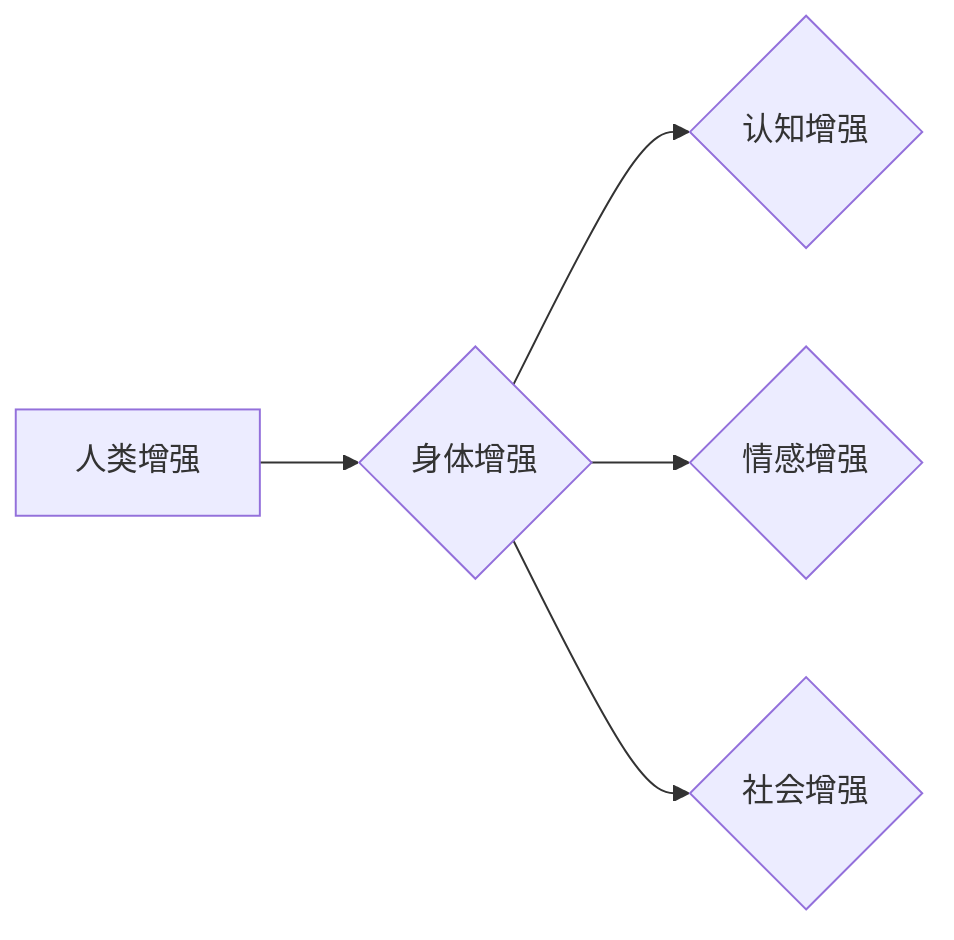

                 

## AI时代的人类增强：道德考虑与身体增强的未来发展机遇分析总结

> 关键词：人工智能、人类增强、身体增强、伦理学、道德、未来趋势、技术挑战

## 1. 背景介绍

人工智能（AI）技术的飞速发展正在深刻地改变着人类社会，其影响范围从日常生活到未来发展都不可忽视。其中，AI驱动的“人类增强”概念正逐渐成为一个备受关注的议题。人类增强是指利用技术手段提升人类的认知能力、生理能力和生活质量，使其超越自然界限制，实现更广阔的发展潜能。

身体增强作为人类增强的重要组成部分，旨在通过技术手段改造和提升人类的身体机能。从增强肌肉力量和耐力到修复损伤器官，甚至实现寿命延长，身体增强技术的应用前景广阔。然而，伴随着技术的进步，也随之而来了一系列伦理和道德挑战，需要我们认真思考和探讨。

## 2. 核心概念与联系

### 2.1 人类增强与身体增强的关系

人类增强是一个广义的概念，涵盖了对人类认知、情感、社会等多个方面的提升。身体增强则是人类增强的一个具体分支，专注于提升人类的生理能力。

**Mermaid 流程图：**



### 2.2 核心技术与应用

身体增强的核心技术包括：

* **生物工程:** 利用基因编辑、细胞治疗等技术改造人体细胞和组织，增强身体机能。
* **纳米技术:** 利用纳米材料构建微型传感器、药物递送系统等，实现对人体内部的精准控制和治疗。
* **机器人技术:** 开发可植入人体或与人体相连的机器人，增强人类的运动能力和感知能力。
* **脑机接口:** 通过脑电信号或其他神经信号与计算机进行交互，实现对身体的远程控制和增强。

这些技术在医疗、体育、军事等领域都有广泛的应用前景。

## 3. 核心算法原理 & 具体操作步骤

### 3.1 算法原理概述

身体增强算法的核心是将生物信号、物理数据和人工智能算法相结合，实现对人体功能的精准控制和优化。

* **生物信号处理:** 利用传感器采集人体生理信号，如心率、血压、脑电波等，并通过算法进行分析和解读。
* **物理模型建模:** 建立人体运动、肌肉收缩等物理模型，模拟人体功能的运作机制。
* **人工智能算法:** 利用机器学习、深度学习等算法，分析生物信号和物理模型，预测人体状态和行为，并生成控制指令。

### 3.2 算法步骤详解

1. **数据采集:** 利用传感器采集人体生理信号和运动数据。
2. **数据预处理:** 对采集到的数据进行清洗、去噪和特征提取。
3. **模型训练:** 利用机器学习算法对预处理后的数据进行训练，建立人体功能模型。
4. **预测和控制:** 根据实时采集到的数据，模型预测人体状态和行为，并生成控制指令，驱动增强设备或进行干预。

### 3.3 算法优缺点

**优点:**

* **精准控制:** 通过算法分析和预测，实现对人体功能的精准控制。
* **个性化定制:** 根据个体差异，定制个性化的增强方案。
* **实时反馈:** 实时监测人体状态，及时调整增强方案。

**缺点:**

* **数据依赖:** 算法性能依赖于数据质量和数量。
* **模型复杂:** 建立人体功能模型需要复杂的算法和计算能力。
* **伦理风险:** 算法可能被用于操控或剥削人类，需要谨慎考虑伦理风险。

### 3.4 算法应用领域

* **医疗保健:** 辅助治疗疾病、修复损伤器官、增强康复效果。
* **体育训练:** 提升运动员的运动能力、预防运动损伤。
* **军事应用:** 增强士兵的作战能力、提高生存率。
* **日常生活:** 辅助行动不便的人群、提升生活质量。

## 4. 数学模型和公式 & 详细讲解 & 举例说明

### 4.1 数学模型构建

身体增强算法通常基于生物力学、神经科学等领域的数学模型。例如，肌肉收缩模型可以利用牛顿第二定律描述肌肉力的产生和传递，神经网络模型可以模拟神经元的激活和传递信息的过程。

### 4.2 公式推导过程

例如，肌肉收缩模型中的一个关键公式是：

$$F = k \cdot \Delta L$$

其中：

* $F$ 是肌肉产生的力
* $k$ 是肌肉的弹性系数
* $\Delta L$ 是肌肉的伸长量

这个公式表明，肌肉产生的力与肌肉的伸长量成正比。

### 4.3 案例分析与讲解

利用肌肉收缩模型，可以预测不同肌肉力量的输出，并根据需要调整控制信号，实现对人体运动的精准控制。例如，在机器人辅助行走系统中，可以利用肌肉收缩模型预测腿部肌肉的收缩力，并根据预测结果调整机器人关节的运动角度，帮助患者更稳定地行走。

## 5. 项目实践：代码实例和详细解释说明

### 5.1 开发环境搭建

身体增强项目通常需要使用Python、C++等编程语言，以及相关的机器学习库和生物信号处理库。

### 5.2 源代码详细实现

以下是一个简单的肌肉收缩模型的Python代码示例：

```python
import numpy as np

class MuscleModel:
    def __init__(self, k):
        self.k = k

    def calculate_force(self, delta_l):
        return self.k * delta_l

# 实例化肌肉模型
muscle = MuscleModel(k=10)

# 模拟肌肉伸长量
delta_l = np.array([0.01, 0.02, 0.03])

# 计算肌肉产生的力
force = muscle.calculate_force(delta_l)

# 打印结果
print(force)
```

### 5.3 代码解读与分析

这段代码定义了一个简单的肌肉模型类，其中`k`参数代表肌肉的弹性系数，`calculate_force`方法计算肌肉产生的力。

### 5.4 运行结果展示

运行这段代码后，会输出肌肉在不同伸长量下的力值。

## 6. 实际应用场景

### 6.1 医疗保健

* **神经修复:** 利用脑机接口技术，帮助瘫痪患者恢复肢体控制能力。
* **器官移植:** 利用生物工程技术，改造人体细胞，提高器官移植的成功率。
* **疾病治疗:** 利用纳米技术，精准递送药物，治疗癌症和其他疾病。

### 6.2 体育训练

* **运动能力提升:** 利用增强设备，帮助运动员提升力量、速度、耐力等运动能力。
* **运动损伤预防:** 利用传感器监测运动员的身体状态，及时发现潜在的运动损伤风险。
* **训练方案优化:** 利用人工智能算法，分析运动员的训练数据，制定个性化的训练方案。

### 6.3 军事应用

* **士兵增强:** 利用增强设备，提高士兵的作战能力、生存率。
* **武器系统:** 利用人工智能算法，开发更智能、更精准的武器系统。
* **战场侦察:** 利用无人机和机器人，进行战场侦察和信息收集。

### 6.4 未来应用展望

随着人工智能和生物技术的不断发展，身体增强技术的应用场景将更加广泛，例如：

* **寿命延长:** 利用基因编辑和细胞治疗技术，延缓衰老，延长人类寿命。
* **人类能力超越:** 利用脑机接口技术，实现人类对信息和世界的更深刻理解和控制。
* **虚拟现实体验:** 利用增强现实和虚拟现实技术，创造更加沉浸式的虚拟体验。

## 7. 工具和资源推荐

### 7.1 学习资源推荐

* **书籍:**

    * 《增强人类：人工智能、生物技术和未来》
    * 《生命3.0：人工智能、生物技术和人类的未来》

* **在线课程:**

    * Coursera: 人工智能、生物信息学
    * edX: 人工智能、生物工程

### 7.2 开发工具推荐

* **编程语言:** Python, C++, Java
* **机器学习库:** TensorFlow, PyTorch, scikit-learn
* **生物信号处理库:** Biopython, EEGLAB

### 7.3 相关论文推荐

* **Nature:** 人工智能驱动的身体增强
* **Science:** 基于纳米技术的生物增强
* **Cell:** 基因编辑技术在身体增强中的应用

## 8. 总结：未来发展趋势与挑战

### 8.1 研究成果总结

近年来，身体增强领域取得了显著的进展，例如：

* **脑机接口技术:** 已经能够实现一些简单的肢体控制和信息传递。
* **生物打印技术:** 可以打印出一些简单的组织和器官。
* **基因编辑技术:** 可以修改基因，提高人体对疾病的抵抗力。

### 8.2 未来发展趋势

未来，身体增强技术将朝着以下方向发展：

* **更加精准和个性化:** 利用人工智能算法，实现对人体功能的更加精准和个性化的控制。
* **更加安全和可靠:** 提高增强技术的安全性，降低潜在的风险。
* **更加广泛的应用:** 将身体增强技术应用到更多领域，例如医疗保健、体育训练、教育等。

### 8.3 面临的挑战

身体增强技术也面临着一些挑战：

* **伦理风险:** 身体增强技术可能被用于操控或剥削人类，需要谨慎考虑伦理风险。
* **技术瓶颈:** 许多技术仍然处于早期阶段，需要进一步的研发和突破。
* **社会接受度:** 人们对身体增强技术的接受度还需要提高。

### 8.4 研究展望

未来，我们需要加强对身体增强技术的伦理、法律和社会影响的探讨，制定相应的规范和政策，确保身体增强技术能够安全、有效地应用于人类社会，造福人类。

## 9. 附录：常见问题与解答

### 9.1  身体增强技术是否会取代人类？

身体增强技术旨在提升人类的能力，而不是取代人类。人类的创造力、情感和社会性等特质是人工智能无法替代的。

### 9.2  身体增强技术会带来哪些伦理风险？

身体增强技术可能带来一些伦理风险，例如：

* **公平性:** 身体增强技术可能导致社会分化，富人能够获得更多增强，而穷人则无法负担。
* **隐私:** 身体增强技术可能收集和利用大量的个人数据，侵犯个人隐私。
* **身份认同:** 身体增强技术可能改变人类的生理特征，导致身份认同的困惑。

### 9.3  如何应对身体增强技术的伦理风险？

我们需要加强对身体增强技术的伦理、法律和社会影响的探讨，制定相应的规范和政策，确保身体增强技术能够安全、有效地应用于人类社会，造福人类。


作者：禅与计算机程序设计艺术 / Zen and the Art of Computer Programming 
<end_of_turn>

