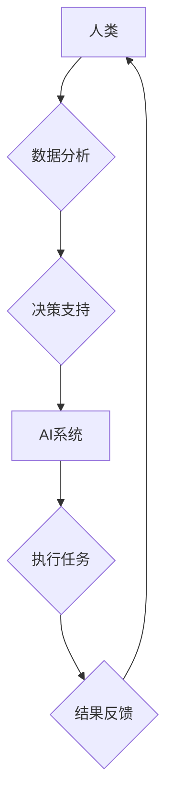

                 

## AI时代的人类计算：社会影响和责任

> 关键词：人工智能、人类计算、社会影响、伦理责任、算法偏见、可解释性、公平性、透明度、可控性

### 1. 背景介绍

人工智能（AI）正以惊人的速度发展，其影响力正在深刻地改变着我们的生活。从自动驾驶汽车到医疗诊断，从个性化教育到金融交易，AI技术正在各个领域展现出强大的应用潜力。然而，随着AI技术的进步，也引发了人们对AI社会影响和伦理责任的广泛关注。

人类计算是指人类参与到计算过程中的行为，它不仅限于传统的计算任务，还包括对数据分析、决策支持、创意生成等方面的参与。在AI时代，人类计算将与人工智能技术深度融合，形成新的计算模式。这种融合将带来前所未有的机遇，但也带来新的挑战。

### 2. 核心概念与联系

**2.1 人类计算与AI的融合**

人类计算和AI技术的融合将形成一个新的计算生态系统，其中人类和AI协同工作，共同完成复杂的任务。

* **人类优势:** 人类拥有创造力、批判性思维、情感智能等独特的优势，能够进行抽象思考、理解复杂情境、做出基于价值判断的决策。
* **AI优势:** AI技术擅长处理海量数据、识别模式、进行快速计算，能够提供客观、高效的计算支持。

**2.2 融合模式**

人类计算与AI的融合可以采用多种模式：

* **增强型计算:** AI技术增强人类的计算能力，例如使用AI辅助工具进行数据分析、决策支持等。
* **协同型计算:** 人类和AI共同参与计算任务，发挥各自优势，例如人类提供创意和指导，AI进行数据处理和模型训练。
* **混合型计算:** 人类和AI分别负责不同的计算任务，例如人类负责制定策略，AI负责执行任务。

**2.3  Mermaid 流程图**



### 3. 核心算法原理 & 具体操作步骤

**3.1 算法原理概述**

在AI时代的人类计算中，许多核心算法发挥着关键作用，例如机器学习、深度学习、自然语言处理等。这些算法通过学习数据模式，实现对复杂问题的分析和解决。

**3.2 算法步骤详解**

以机器学习为例，其基本步骤包括：

1. **数据收集和预处理:** 收集相关数据，并进行清洗、转换、特征提取等预处理工作。
2. **模型选择:** 根据任务需求选择合适的机器学习模型，例如线性回归、决策树、支持向量机等。
3. **模型训练:** 使用训练数据训练模型，调整模型参数，使其能够准确地预测或分类数据。
4. **模型评估:** 使用测试数据评估模型的性能，例如准确率、召回率、F1-score等。
5. **模型部署:** 将训练好的模型部署到实际应用场景中，用于进行预测或分类。

**3.3 算法优缺点**

不同的机器学习算法具有不同的优缺点，需要根据具体任务选择合适的算法。例如，线性回归算法简单易实现，但对数据线性关系要求较高；决策树算法能够处理非线性关系，但容易过拟合；支持向量机算法具有较好的泛化能力，但训练时间较长。

**3.4 算法应用领域**

机器学习算法广泛应用于各个领域，例如：

* **图像识别:** 用于识别物体、场景、人脸等。
* **自然语言处理:** 用于文本分类、情感分析、机器翻译等。
* **推荐系统:** 用于推荐商品、电影、音乐等。
* **医疗诊断:** 用于辅助医生诊断疾病。
* **金融风险控制:** 用于识别欺诈交易、评估信用风险等。

### 4. 数学模型和公式 & 详细讲解 & 举例说明

**4.1 数学模型构建**

在机器学习中，常用的数学模型包括线性回归模型、逻辑回归模型、支持向量机模型等。这些模型通过数学公式来描述数据之间的关系，并进行预测或分类。

**4.2 公式推导过程**

例如，线性回归模型的目标是找到一条直线，使得这条直线与数据点之间的距离最小。其数学公式如下：

$$y = w_0 + w_1x_1 + w_2x_2 + ... + w_nx_n$$

其中，$y$ 是预测值，$w_0, w_1, w_2, ..., w_n$ 是模型参数，$x_1, x_2, ..., x_n$ 是输入特征。

通过最小化预测值与真实值之间的误差，可以求解出模型参数。

**4.3 案例分析与讲解**

假设我们有一个数据集，包含房屋面积和房屋价格的信息。我们可以使用线性回归模型来预测房屋价格。

* 输入特征: 房屋面积
* 输出特征: 房屋价格

通过训练模型，我们可以得到一个线性回归方程，例如：

$$价格 = 1000 + 500 * 面积$$

这个方程表示，房屋面积每增加1平方米，房屋价格就会增加500元。

### 5. 项目实践：代码实例和详细解释说明

**5.1 开发环境搭建**

可以使用Python语言和相关的机器学习库，例如Scikit-learn，来实现机器学习项目。

**5.2 源代码详细实现**

```python
from sklearn.linear_model import LinearRegression
from sklearn.model_selection import train_test_split
import pandas as pd

# 加载数据
data = pd.read_csv('house_data.csv')

# 分割数据
X = data[['面积']]
y = data['价格']
X_train, X_test, y_train, y_test = train_test_split(X, y, test_size=0.2, random_state=42)

# 创建线性回归模型
model = LinearRegression()

# 训练模型
model.fit(X_train, y_train)

# 预测测试数据
y_pred = model.predict(X_test)

# 评估模型性能
print('模型系数:', model.coef_)
print('模型截距:', model.intercept_)
```

**5.3 代码解读与分析**

这段代码首先加载了房屋数据，然后将数据分割为训练集和测试集。接着，创建了一个线性回归模型，并使用训练集训练模型。最后，使用测试集预测房屋价格，并评估模型性能。

**5.4 运行结果展示**

运行结果会显示模型的系数和截距，以及模型在测试集上的预测精度。

### 6. 实际应用场景

**6.1 医疗诊断辅助**

AI技术可以帮助医生分析患者的病历、影像数据等，辅助诊断疾病。例如，AI算法可以识别肺部肿瘤、乳腺癌等疾病。

**6.2 金融风险控制**

AI技术可以帮助金融机构识别欺诈交易、评估信用风险等。例如，AI算法可以检测信用卡欺诈、预测贷款违约风险。

**6.3 个性化教育**

AI技术可以根据学生的学习进度和特点，提供个性化的学习内容和辅导。例如，AI算法可以推荐合适的学习资源、自动批改作业。

**6.4 未来应用展望**

在未来，AI技术将更加广泛地应用于各个领域，例如自动驾驶、机器人、智能家居等。

### 7. 工具和资源推荐

**7.1 学习资源推荐**

* **在线课程:** Coursera、edX、Udacity等平台提供丰富的AI课程。
* **书籍:** 《深度学习》、《机器学习实战》等书籍是学习AI的基础教材。
* **开源项目:** TensorFlow、PyTorch等开源项目可以帮助你实践AI算法。

**7.2 开发工具推荐**

* **Python:** Python是AI开发最常用的编程语言。
* **Scikit-learn:** Scikit-learn是Python机器学习库，提供各种机器学习算法。
* **TensorFlow:** TensorFlow是Google开发的开源深度学习框架。
* **PyTorch:** PyTorch是Facebook开发的开源深度学习框架。

**7.3 相关论文推荐**

* **《ImageNet Classification with Deep Convolutional Neural Networks》**
* **《Attention Is All You Need》**
* **《BERT: Pre-training of Deep Bidirectional Transformers for Language Understanding》**

### 8. 总结：未来发展趋势与挑战

**8.1 研究成果总结**

近年来，AI技术取得了长足的进步，在各个领域都展现出巨大的应用潜力。

**8.2 未来发展趋势**

* **模型更加强大:** AI模型将更加强大，能够处理更加复杂的任务。
* **应用更加广泛:** AI技术将应用于更加广泛的领域。
* **伦理问题更加突出:** AI技术发展带来的伦理问题将更加突出。

**8.3 面临的挑战**

* **算法可解释性:** 许多AI算法难以解释其决策过程，这导致了对AI技术的信任问题。
* **算法偏见:** AI算法可能存在偏见，导致不公平的结果。
* **数据安全:** AI技术依赖于大量数据，数据安全问题不容忽视。

**8.4 研究展望**

未来，需要加强对AI算法的可解释性、公平性、安全性的研究，确保AI技术能够安全、可靠、公正地应用于社会。

### 9. 附录：常见问题与解答

**9.1 如何避免AI算法的偏见？**

* 使用多样化的训练数据，确保数据代表真实世界。
* 识别和缓解算法中的偏见，例如使用公平性评估指标。
* 促进算法开发和部署的透明度，以便公众能够监督和参与。

**9.2 如何确保AI算法的安全性和可靠性？**

* 使用安全的机器学习算法和训练方法，防止攻击和恶意利用。
* 进行严格的测试和评估，确保算法能够在各种情况下正常工作。
* 建立有效的监控和反馈机制，及时发现和解决问题。


作者：禅与计算机程序设计艺术 / Zen and the Art of Computer Programming 
<end_of_turn>

