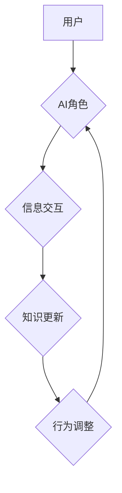

                 

## AI角色演化：长期互动中的人物发展

> 关键词：人工智能、角色演化、长期互动、人物发展、对话系统、自然语言处理、机器学习、深度学习、情感计算

### 1. 背景介绍

近年来，人工智能（AI）技术飞速发展，特别是自然语言处理（NLP）领域取得了突破性进展。对话系统作为AI技术的典型应用之一，已经逐渐融入人们的日常生活，从智能客服到陪伴型机器人，AI角色扮演着越来越重要的角色。然而，现有的对话系统大多局限于预设的场景和知识库，缺乏灵活性和适应性，难以实现与人类深度、持久的互动。

长期互动是AI角色演化至关重要的方向。通过与用户持续的交流，AI角色可以积累经验、学习知识、调整行为，最终形成更加真实、个性化的形象。这不仅可以提升用户体验，更重要的是，可以推动AI技术朝着更智能、更人性化的方向发展。

### 2. 核心概念与联系

**2.1  角色演化**

角色演化是指AI角色在长期互动过程中，其行为、性格、知识等方面不断变化和完善的过程。

**2.2  长期互动**

长期互动是指AI角色与用户之间持续进行交流，时间跨度较长，并涉及多个主题和场景的互动模式。

**2.3  人物发展**

人物发展是指角色在故事、游戏或现实生活中，随着经历和学习，其性格、能力、目标等方面发生变化的过程。

**2.4  关联性**

角色演化本质上是一种人物发展，而长期互动是推动角色演化发生的重要驱动力。通过持续的交流和反馈，AI角色可以获得新的信息、更新认知，并根据经验调整行为，最终实现人物发展。

**Mermaid 流程图**



### 3. 核心算法原理 & 具体操作步骤

**3.1  算法原理概述**

角色演化的核心算法通常基于机器学习和深度学习技术，通过训练模型学习用户行为模式、语言特征和情感倾向，并根据这些信息动态调整角色的行为和对话内容。常见的算法包括：

* **强化学习 (Reinforcement Learning)**：通过奖励机制训练AI角色，使其在与用户互动过程中做出更符合期望的行为。
* **迁移学习 (Transfer Learning)**：利用预训练的语言模型，将已有的知识迁移到角色演化任务中，加速模型训练。
* **生成对抗网络 (Generative Adversarial Networks)**：利用两个网络相互对抗的方式，生成更加逼真的对话内容和角色行为。

**3.2  算法步骤详解**

1. **数据收集和预处理**: 收集用户与AI角色的对话数据，并进行清洗、标注和格式化处理。
2. **模型训练**: 选择合适的算法，并利用收集到的数据训练模型。
3. **角色行为生成**: 根据用户输入，模型预测最合适的对话内容和角色行为。
4. **反馈机制**: 收集用户对角色行为的反馈，并将其反馈到模型训练中，不断优化角色的行为策略。

**3.3  算法优缺点**

* **优点**: 可以实现更加个性化、自然、流畅的对话体验，并随着时间的推移不断完善角色形象。
* **缺点**: 需要大量的训练数据和计算资源，模型训练过程复杂，且难以完全模拟人类的复杂情感和行为。

**3.4  算法应用领域**

* **聊天机器人**: 构建更加智能、人性化的聊天机器人，提供更丰富的服务和体验。
* **游戏角色**: 开发更加生动、富有表现力的游戏角色，提升玩家的游戏体验。
* **教育机器人**: 作为教育工具，提供个性化的学习辅导和陪伴。

### 4. 数学模型和公式 & 详细讲解 & 举例说明

**4.1  数学模型构建**

角色演化模型通常可以看作是一个状态转移模型，其中每个状态代表角色在某个时间点的行为、知识和情感状态。状态转移的概率取决于用户输入、角色历史状态和模型参数。

**4.2  公式推导过程**

假设角色的状态空间为S，用户输入为U，模型参数为θ。则角色在时间t的状态转移概率可以表示为：

$$P(s_t|s_{t-1},u_t,\theta)$$

其中：

* $s_t$：时间t的角色状态
* $s_{t-1}$：时间t-1的角色状态
* $u_t$：时间t的用户输入
* $\theta$：模型参数

**4.3  案例分析与讲解**

例如，在聊天机器人应用中，角色的状态可以包括对话主题、情感倾向和知识库中的信息。用户输入可以是文本消息，模型参数可以是训练得到的权重值。通过学习用户行为模式和语言特征，模型可以预测角色在下一个时间点的状态转移概率，从而生成更加自然、符合语境的对话内容。

### 5. 项目实践：代码实例和详细解释说明

**5.1  开发环境搭建**

* Python 3.x
* TensorFlow 或 PyTorch 深度学习框架
* NLTK 自然语言处理库
* 其他必要的库和工具

**5.2  源代码详细实现**

```python
import tensorflow as tf

# 定义角色状态空间
state_space = ['天气', '电影', '音乐']

# 定义用户输入词典
input_dict = {
    '天气': 1,
    '电影': 2,
    '音乐': 3
}

# 定义模型参数
model_params = tf.Variable(tf.random.normal([len(state_space), len(input_dict)]))

# 定义状态转移概率计算函数
def calculate_transition_probability(state, input):
    return tf.nn.softmax(tf.matmul(tf.one_hot(state, len(state_space)), model_params[input_dict[input]]))

# 角色行为生成函数
def generate_response(state, input):
    transition_probs = calculate_transition_probability(state, input)
    next_state = tf.random.categorical(tf.math.log(transition_probs), num_samples=1)[0]
    return next_state

# 训练模型
# ...

# 角色互动示例
current_state = '天气'
user_input = '电影'
next_state = generate_response(current_state, user_input)
print(f'用户输入: {user_input}')
print(f'角色状态转移到: {next_state}')
```

**5.3  代码解读与分析**

* 代码首先定义了角色状态空间、用户输入词典和模型参数。
* `calculate_transition_probability` 函数计算角色在下一个时间点的状态转移概率。
* `generate_response` 函数根据用户输入和当前状态，生成角色的下一个状态。
* 训练模型部分需要根据实际情况选择合适的算法和数据集进行训练。

**5.4  运行结果展示**

运行代码后，可以观察到角色根据用户输入动态调整状态，并生成相应的对话内容。

### 6. 实际应用场景

**6.1  智能客服**

AI角色可以作为智能客服，提供24小时在线服务，解答用户常见问题，处理简单的请求，并根据用户需求提供个性化的建议。

**6.2  陪伴型机器人**

AI角色可以作为陪伴型机器人，与用户进行情感交流，提供陪伴和支持，帮助用户缓解压力和孤独感。

**6.3  教育机器人**

AI角色可以作为教育机器人，提供个性化的学习辅导，帮助用户理解知识，提高学习效率。

**6.4  未来应用展望**

随着AI技术的不断发展，角色演化技术将有更广泛的应用场景，例如：

* **虚拟助手**: 更智能、更人性化的虚拟助手，可以帮助用户管理日程、安排出行、完成各种任务。
* **游戏角色**: 更生动、更具互动性的游戏角色，可以提供更沉浸式的游戏体验。
* **医疗辅助**: AI角色可以辅助医生进行诊断、治疗和康复指导，提高医疗效率和质量。

### 7. 工具和资源推荐

**7.1  学习资源推荐**

* **书籍**:
    * 《深度学习》
    * 《自然语言处理》
    * 《强化学习》
* **在线课程**:
    * Coursera
    * edX
    * Udacity

**7.2  开发工具推荐**

* **TensorFlow**: 开源深度学习框架
* **PyTorch**: 开源深度学习框架
* **NLTK**: 自然语言处理库

**7.3  相关论文推荐**

* **《Generative Pre-trained Transformer 3》**
* **《Attention Is All You Need》**
* **《Deep Reinforcement Learning》**

### 8. 总结：未来发展趋势与挑战

**8.1  研究成果总结**

近年来，AI角色演化技术取得了显著进展，特别是深度学习技术的应用，使得角色能够更加逼真、个性化地与用户互动。

**8.2  未来发展趋势**

* **更加个性化的角色**: 通过更深入的理解用户需求和行为模式，打造更加个性化的AI角色，提供更加定制化的服务和体验。
* **跨模态交互**: 将文本、语音、图像等多种模态信息融合到角色演化中，实现更加丰富的交互方式。
* **自主学习和进化**: 赋予AI角色自主学习和进化的能力，使其能够不断完善自身，适应不断变化的环境。

**8.3  面临的挑战**

* **数据获取和标注**: 训练高质量的AI角色模型需要大量的真实数据，而数据获取和标注成本较高。
* **模型复杂性和可解释性**: 现有的AI角色演化模型往往非常复杂，其决策过程难以解释，这限制了模型的应用和信任度。
* **伦理和安全问题**: AI角色的演化可能会带来伦理和安全问题，例如数据隐私泄露、虚假信息传播等，需要谨慎考虑和规避。

**8.4  研究展望**

未来，AI角色演化技术将继续朝着更加智能、更加人性化、更加安全的方向发展。研究者需要不断探索新的算法和模型，解决数据获取和标注、模型复杂性和可解释性、伦理和安全问题等挑战，推动AI角色演化技术更好地服务于人类社会。

### 9. 附录：常见问题与解答

**9.1  Q: 如何评估AI角色的演化效果？**

**A:** 可以通过多种指标来评估AI角色的演化效果，例如对话流畅度、角色个性化程度、用户满意度等。

**9.2  Q: 如何避免AI角色产生偏差或有害行为？**

**A:** 在训练过程中，需要使用多样化的数据，并对模型进行严格的测试和评估，以避免AI角色产生偏差或有害行为。

**9.3  Q: AI角色的演化是否会取代人类？**

**A:** AI角色的演化是为了更好地服务于人类，而不是取代人类。AI角色可以帮助人类完成一些重复性或危险性任务，释放人类的创造力和潜能。


作者：禅与计算机程序设计艺术 / Zen and the Art of Computer Programming 
<end_of_turn>

