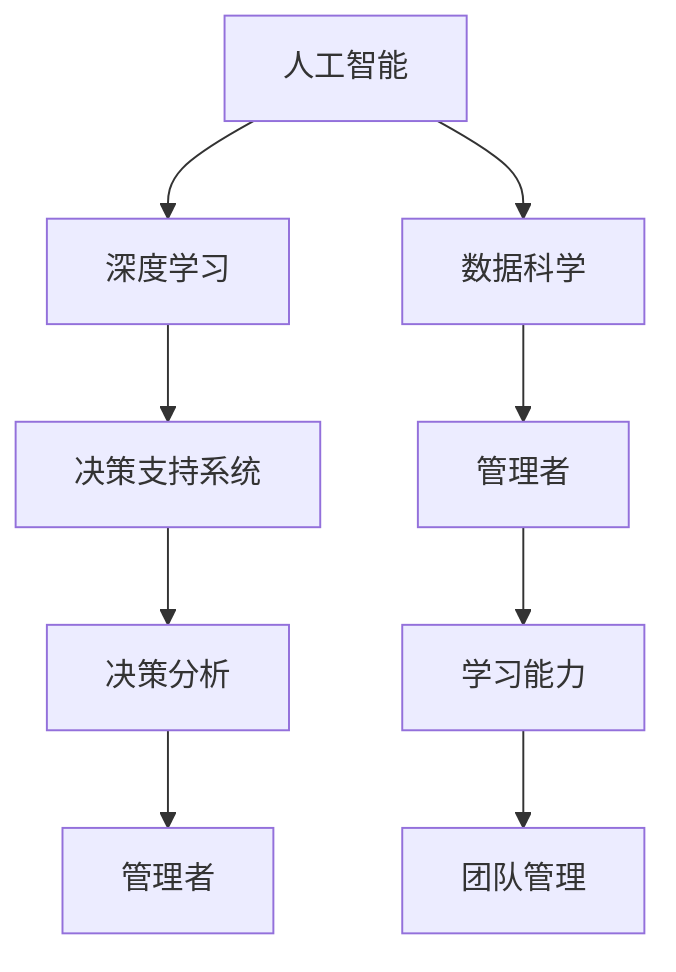

                 

# 学习能力与管理者的长期发展

> 关键词：学习能力, 管理者, 人工智能, 机器学习, 深度学习, 数据科学

## 1. 背景介绍

### 1.1 问题由来

在快速发展的科技时代，个人和企业的学习需求日益增加，但传统的学习方式在效率和效果上已难以满足现代需求。特别地，管理者作为企业发展的关键角色，承担着组织战略规划、团队管理、决策分析等多重任务，对学习能力的要求尤为迫切。然而，由于时间、资源、成本等因素的限制，传统学习方式往往难以达到理想效果。人工智能和大数据技术的兴起，为管理者提供了一种高效、灵活、智能化的学习方式。

### 1.2 问题核心关键点

本文聚焦于人工智能在管理者学习能力提升和管理决策中的应用。具体来说，研究如何利用人工智能技术，特别是深度学习和数据科学方法，提高管理者的数据分析能力、决策支持能力和团队管理能力，以实现更高效的组织运营和战略决策。本文将从以下几个方面展开：

1. 人工智能技术对学习方式的影响。
2. 数据科学在管理者能力提升中的应用。
3. 深度学习模型在决策分析中的应用。
4. 人工智能在团队管理中的作用。

本文旨在探讨如何将人工智能技术应用于管理者的长期发展，助力其掌握最新技术，提高决策水平，从而在激烈的市场竞争中保持领先地位。

## 2. 核心概念与联系

### 2.1 核心概念概述

为更好地理解人工智能在管理者学习能力提升和管理决策中的应用，本节将介绍几个密切相关的核心概念：

- 人工智能(Artificial Intelligence, AI)：使计算机系统模拟人类智能行为的技术，包括机器学习、深度学习、自然语言处理等。
- 深度学习(Deep Learning)：一种基于多层神经网络的机器学习技术，能够从大量数据中自动学习复杂的非线性模式。
- 数据科学(Data Science)：通过数据收集、处理、分析、建模等方法，从数据中提取知识和信息，指导决策和业务优化。
- 管理者(Manager)：在组织中负责指挥、协调和监督他人的个体或集体。
- 学习能力(Learning Ability)：个体或组织获取新知识、技能和能力的潜力。
- 决策支持系统(Decision Support System, DSS)：利用人工智能和大数据技术，提供决策建议和辅助分析的系统。
- 团队管理(Team Management)：通过科学方法和工具，对团队成员进行指导、激励和协调，实现团队的高效合作和目标达成。

这些核心概念之间的逻辑关系可以通过以下Mermaid流程图来展示：



这个流程图展示了大语言模型的核心概念及其之间的关系：

1. 人工智能技术为管理者提供了高效的学习和决策工具。
2. 深度学习模型在数据处理和分析中发挥了重要作用。
3. 数据科学方法提升了管理者的决策质量。
4. 学习能力提升了管理者的个人和团队管理能力。
5. 决策支持系统辅助管理者进行高效决策。

这些概念共同构成了管理者使用人工智能技术进行学习和决策的框架，使其能够更高效、更智能地完成各项任务。

## 3. 核心算法原理 & 具体操作步骤
### 3.1 算法原理概述

人工智能在管理者学习能力提升和管理决策中的应用，主要体现在以下几个方面：

- 利用深度学习模型进行数据分析和模式识别，提高管理者从数据中提取有用信息的能力。
- 采用数据科学方法进行量化分析，提供科学的数据驱动决策支持。
- 使用机器学习技术对团队成员的行为和绩效进行建模，提高管理者对团队的监控和指导效率。

这些算法和技术相互配合，共同提升管理者的整体能力。

### 3.2 算法步骤详解

基于人工智能的管理者能力提升可以分为以下步骤：

**Step 1: 数据收集与预处理**

1. 收集管理者的工作数据和绩效数据，如销售数据、员工评价、项目进度等。
2. 对数据进行清洗和预处理，包括去除异常值、填充缺失值、标准化数据格式等。

**Step 2: 数据分析与建模**

1. 采用数据科学方法进行特征工程，提取对管理者有用的特征。
2. 使用深度学习模型对数据进行建模，如回归模型、分类模型、序列模型等。
3. 利用模型对数据进行预测和分析，生成决策建议。

**Step 3: 决策支持与团队管理**

1. 将模型生成的决策建议融入到决策支持系统中，辅助管理者进行决策。
2. 使用机器学习技术对团队成员进行行为分析，识别潜在问题。
3. 根据分析结果，管理者采取针对性的措施，如培训、调整工作分配等，优化团队管理。

**Step 4: 持续学习与反馈**

1. 利用新数据对模型进行不断更新和优化，确保模型能够适应变化的环境。
2. 管理者根据模型的输出结果和实际效果，及时调整决策和团队管理策略。

### 3.3 算法优缺点

人工智能在管理者学习能力提升和管理决策中的应用具有以下优点：

1. 高效性：利用深度学习和大数据技术，可以快速从大量数据中提取有用信息，提高决策效率。
2. 客观性：数据驱动的决策方式，减少了主观偏见，提高了决策的科学性和合理性。
3. 灵活性：模型可以根据新数据不断更新，适应不断变化的环境。

但同时也存在一些缺点：

1. 数据质量要求高：模型结果的准确性依赖于数据的质量和完整性。
2. 模型复杂度较高：深度学习模型需要大量的数据和计算资源，成本较高。
3. 模型解释性不足：深度学习模型通常被视为"黑箱"，难以解释其内部工作机制。
4. 依赖专业技能：使用者需要具备一定的数据科学和机器学习背景。

## 4. 数学模型和公式 & 详细讲解 & 举例说明

### 4.1 数学模型构建

在基于人工智能的管理者能力提升中，常用的数学模型包括线性回归、逻辑回归、决策树、随机森林、神经网络等。这里以线性回归模型为例进行详细讲解。

假设管理者要预测某项任务的完成时间，输入变量为任务复杂度、团队经验、资源投入等特征 $x_1, x_2, ..., x_n$，输出变量为完成任务所需的时间 $y$。线性回归模型可以表示为：

$$
y = \theta_0 + \theta_1 x_1 + \theta_2 x_2 + ... + \theta_n x_n + \epsilon
$$

其中，$\theta_0, \theta_1, ..., \theta_n$ 为模型参数，$\epsilon$ 为误差项。

### 4.2 公式推导过程

线性回归模型的最小二乘法优化目标函数为：

$$
J(\theta) = \frac{1}{2m} \sum_{i=1}^m (y_i - \theta_0 - \theta_1 x_{1i} - ... - \theta_n x_{ni})^2
$$

其中，$m$ 为样本数量。

对目标函数求导，得到参数更新公式：

$$
\frac{\partial J(\theta)}{\partial \theta_j} = - \frac{1}{m} \sum_{i=1}^m (y_i - \theta_0 - \theta_1 x_{1i} - ... - \theta_n x_{ni}) x_{ji}
$$

通过迭代优化，可以逐步更新模型参数，使其最小化目标函数，生成最优模型。

### 4.3 案例分析与讲解

假设某公司管理者想要预测不同项目的完成时间，收集了多个项目的相关数据，包括项目复杂度、团队经验、资源投入等特征。通过线性回归模型对这些数据进行建模，可以得到以下结果：

$$
\hat{y} = \theta_0 + \theta_1 x_1 + \theta_2 x_2 + ... + \theta_n x_n
$$

其中 $\hat{y}$ 为预测值，$\theta_0, \theta_1, ..., \theta_n$ 为模型参数。管理者可以根据模型的预测结果，评估项目风险，制定合理的时间计划，提高项目管理效率。

## 5. 项目实践：代码实例和详细解释说明
### 5.1 开发环境搭建

在进行项目实践前，我们需要准备好开发环境。以下是使用Python进行PyTorch开发的环境配置流程：

1. 安装Anaconda：从官网下载并安装Anaconda，用于创建独立的Python环境。

2. 创建并激活虚拟环境：
```bash
conda create -n pytorch-env python=3.8 
conda activate pytorch-env
```

3. 安装PyTorch：根据CUDA版本，从官网获取对应的安装命令。例如：
```bash
conda install pytorch torchvision torchaudio cudatoolkit=11.1 -c pytorch -c conda-forge
```

4. 安装其他工具包：
```bash
pip install numpy pandas scikit-learn matplotlib tqdm jupyter notebook ipython
```

完成上述步骤后，即可在`pytorch-env`环境中开始项目实践。

### 5.2 源代码详细实现

这里我们以线性回归模型为例，给出使用PyTorch进行管理者数据分析的完整代码实现。

```python
import torch
import torch.nn as nn
import torch.optim as optim
import pandas as pd
import numpy as np

# 加载数据
data = pd.read_csv('manager_data.csv')

# 数据预处理
X = data[['complexity', 'experience', 'resources']]
y = data['time_to_complete']

# 将数据转换为torch.tensor
X_tensor = torch.from_numpy(X.values).float()
y_tensor = torch.from_numpy(y.values).float()

# 定义模型
class LinearRegression(nn.Module):
    def __init__(self, n_features):
        super(LinearRegression, self).__init__()
        self.linear = nn.Linear(n_features, 1)
        
    def forward(self, x):
        return self.linear(x)
    
# 定义损失函数和优化器
model = LinearRegression(X.shape[1])
criterion = nn.MSELoss()
optimizer = optim.SGD(model.parameters(), lr=0.01)

# 训练模型
for epoch in range(1000):
    optimizer.zero_grad()
    output = model(X_tensor)
    loss = criterion(output, y_tensor)
    loss.backward()
    optimizer.step()
    if (epoch+1) % 100 == 0:
        print(f'Epoch [{epoch+1}/{1000}], Loss: {loss.item():.6f}')

# 模型测试
X_test = torch.from_numpy(data_test[['complexity', 'experience', 'resources']].values).float()
y_test = torch.from_numpy(data_test['time_to_complete'].values).float()
output = model(X_test)
print(f'Predicted time to complete: {output.mean().item():.6f}')
```

这段代码实现了一个简单的线性回归模型，用于预测管理者完成项目所需的时间。

### 5.3 代码解读与分析

让我们再详细解读一下关键代码的实现细节：

**数据加载与预处理**：
- 使用Pandas加载CSV格式的数据文件，并将数据分为输入特征和输出目标。
- 将数据转换为PyTorch的张量格式，并进行标准化处理。

**模型定义**：
- 使用PyTorch定义线性回归模型，包含一个线性层。
- 在模型前向传播中，通过线性层对输入数据进行线性变换，得到预测值。

**损失函数与优化器**：
- 使用均方误差损失函数，计算模型输出与真实值之间的差异。
- 使用随机梯度下降优化器，对模型参数进行更新。

**训练过程**：
- 在每个epoch内，对模型进行前向传播和反向传播，更新模型参数。
- 使用固定学习率和批处理技术，加速模型训练。

**模型测试**：
- 使用测试集数据，评估模型预测效果，输出平均预测时间。

## 6. 实际应用场景
### 6.1 项目进度管理

基于人工智能的管理者能力提升，项目进度管理是一个典型应用场景。传统项目管理主要依靠人工估算和经验判断，难以精确预测项目完成时间。利用人工智能模型，管理者可以更准确地预测项目进度，减少不确定性，提高项目成功概率。

在技术实现上，可以收集历史项目数据，包括任务复杂度、资源投入、团队经验等特征。在此基础上，对深度学习模型进行训练，预测新项目完成时间。通过模型的实时反馈和优化，管理者可以动态调整项目计划，确保项目按时完成。

### 6.2 员工绩效评估

在人力资源管理中，员工绩效评估是重要的一环。传统评估方法往往依赖主观判断，存在偏差和主观性。通过人工智能模型，可以客观地量化员工绩效，减少人为因素的干扰。

具体而言，可以收集员工的工作数据、绩效数据、团队反馈等，构建多维度的绩效评估模型。模型可以包括时间、任务完成度、质量、创新性等多个指标，通过科学量化评估员工表现，提供有价值的绩效改进建议。

### 6.3 战略决策支持

战略决策是企业管理中最为关键的环节之一。管理者需要从复杂的数据中提取关键信息，进行科学决策。基于人工智能的技术，可以大大提升决策的准确性和效率。

例如，通过深度学习模型对市场数据进行建模，可以预测市场趋势、识别竞争风险、优化产品定位等。通过数据科学方法对财务数据进行量化分析，可以评估投资回报、制定财务预算、优化财务结构。通过机器学习技术对客户数据进行建模，可以识别客户需求、提高客户满意度、优化客户服务策略。

### 6.4 未来应用展望

随着人工智能技术的不断进步，基于人工智能的管理者能力提升将会在更多领域得到应用，为企业管理带来革命性影响。

在智慧城市管理中，利用人工智能技术可以实时监测城市运行数据，提升城市管理效率。在供应链管理中，基于人工智能的预测模型可以优化库存管理，降低运营成本。在市场营销中，人工智能可以分析消费者行为，精准投放广告，提升营销效果。

未来，随着人工智能技术的不断成熟，基于人工智能的管理者能力提升将会在更多行业得到应用，为企业管理带来新的机遇和挑战。相信在不久的将来，人工智能将成为企业管理的重要工具，助力企业实现更高质量的发展。

## 7. 工具和资源推荐
### 7.1 学习资源推荐

为了帮助开发者系统掌握人工智能在管理者能力提升中的应用，这里推荐一些优质的学习资源：

1. 《机器学习实战》：斯坦福大学Andrew Ng的机器学习课程，涵盖从基础到进阶的各类算法和应用。

2. 《深度学习》：Ian Goodfellow的深度学习教材，全面介绍深度学习的基本概念和前沿技术。

3. 《Python数据科学手册》：Jake VanderPlas的Python数据科学手册，涵盖数据分析、机器学习、数据可视化等。

4. Kaggle：全球最大的数据科学竞赛平台，提供丰富的数据集和模型库，助力数据科学学习和实践。

5. Coursera：提供各类数据科学和人工智能课程，涵盖基础、进阶和前沿内容，方便在线学习和自学。

通过对这些资源的学习实践，相信你一定能够快速掌握人工智能技术在管理者能力提升中的应用，并用于解决实际的决策和管理问题。

### 7.2 开发工具推荐

高效的开发离不开优秀的工具支持。以下是几款用于人工智能项目开发的常用工具：

1. PyTorch：基于Python的开源深度学习框架，灵活动态的计算图，适合快速迭代研究。

2. TensorFlow：由Google主导开发的开源深度学习框架，生产部署方便，适合大规模工程应用。

3. Weights & Biases：模型训练的实验跟踪工具，可以记录和可视化模型训练过程中的各项指标，方便对比和调优。

4. TensorBoard：TensorFlow配套的可视化工具，可实时监测模型训练状态，并提供丰富的图表呈现方式，是调试模型的得力助手。

5. Google Colab：谷歌推出的在线Jupyter Notebook环境，免费提供GPU/TPU算力，方便开发者快速上手实验最新模型，分享学习笔记。

合理利用这些工具，可以显著提升人工智能项目开发的效率，加快创新迭代的步伐。

### 7.3 相关论文推荐

人工智能在管理者能力提升中的应用源于学界的持续研究。以下是几篇奠基性的相关论文，推荐阅读：

1. 《A Survey on Artificial Intelligence in Human Resource Management》：综述了人工智能在人力资源管理中的应用，包括招聘、绩效评估、培训等多个方面。

2. 《Artificial Intelligence for Business Strategy》：探讨了人工智能在企业战略决策中的应用，通过实例分析了AI在市场预测、客户分析、财务规划等方面的应用。

3. 《Machine Learning for Business Analytics》：介绍了机器学习在商业分析中的应用，通过案例分析了模型在销售预测、客户细分、市场营销等方面的效果。

4. 《The Impact of Artificial Intelligence on Project Management》：分析了人工智能在项目管理中的应用，通过实验验证了AI在项目进度预测、风险管理、资源优化等方面的优势。

这些论文代表了大语言模型微调技术的发展脉络。通过学习这些前沿成果，可以帮助研究者把握学科前进方向，激发更多的创新灵感。

## 8. 总结：未来发展趋势与挑战
### 8.1 总结

本文对人工智能在管理者学习能力提升和管理决策中的应用进行了全面系统的介绍。首先阐述了人工智能技术对学习方式的影响，详细讲解了数据科学在管理者能力提升中的应用，以及深度学习模型在决策分析中的应用。其次，探讨了机器学习技术在团队管理中的作用，并对基于人工智能的管理者能力提升进行了深入分析。

通过本文的系统梳理，可以看到，人工智能技术在管理者学习能力提升和管理决策中的应用前景广阔。这些技术不仅提高了决策的科学性和合理性，还提升了管理者的数据分析能力、团队管理能力和决策支持能力，为企业管理带来了新的机遇和挑战。

### 8.2 未来发展趋势

展望未来，人工智能在管理者学习能力提升和管理决策中的应用将呈现以下几个发展趋势：

1. 深度学习模型的广泛应用：随着深度学习技术的不断发展，其在数据分析和决策支持中的应用将更加广泛，有助于管理者更准确地预测项目进度、优化资源配置、制定科学决策。

2. 数据科学的深入应用：数据科学方法在管理者能力提升中的应用将更加深入，通过多维度数据建模，帮助管理者更全面地理解业务问题，提供更科学的决策支持。

3. 团队管理的人工智能化：基于机器学习技术的团队行为分析，将为管理者提供更精确的团队监控和指导，提升团队合作效率，优化团队资源配置。

4. 持续学习和自我优化：人工智能模型将不断进行自我优化，适应不断变化的市场环境和组织需求，管理者可以根据模型反馈，持续改进决策和团队管理策略。

5. 跨领域的融合应用：人工智能技术将与其他领域的技术进行更深入的融合，如知识图谱、因果推理等，提升管理者的综合决策能力。

以上趋势凸显了人工智能技术在管理者能力提升中的重要性，预示了人工智能在企业管理中的广泛应用前景。

### 8.3 面临的挑战

尽管人工智能在管理者能力提升中取得了显著进展，但在迈向更加智能化、普适化应用的过程中，仍面临诸多挑战：

1. 数据质量要求高：模型结果的准确性依赖于高质量的数据，数据收集、清洗和标注成本较高。

2. 模型复杂度较高：深度学习模型需要大量的数据和计算资源，模型训练和推理成本较高。

3. 模型解释性不足：深度学习模型通常被视为"黑箱"，难以解释其内部工作机制，增加了管理者的理解难度。

4. 依赖专业技能：使用者需要具备一定的数据科学和机器学习背景，增加了学习的门槛。

5. 跨领域融合难度：人工智能技术在不同领域的应用需要跨学科的融合，增加了实现难度。

6. 伦理和安全问题：人工智能模型可能存在偏见和歧视，需要进行严格的伦理审查和安全防护。

7. 数据隐私保护：管理者需要处理大量敏感数据，需要采取有效的隐私保护措施，防止数据泄露。

这些挑战需要学界和产业界共同努力，通过技术创新和规范管理，才能确保人工智能技术在企业管理中的应用效果和可靠性。

### 8.4 研究展望

未来的研究需要在以下几个方面寻求新的突破：

1. 探索更多高效的数据处理和建模方法：通过数据增强、迁移学习等技术，提升模型的泛化能力和适应性。

2. 开发更加易用的模型解释工具：通过可视化、可解释性研究，提升管理者的理解和信任。

3. 提升模型的可迁移性和跨领域适应性：通过多领域数据融合、知识迁移等方法，提升模型在不同场景中的应用效果。

4. 加强模型的伦理审查和安全保护：通过公平性、透明性、安全性等研究，提升模型的可信度和可靠性。

5. 提升模型的可扩展性和自动化能力：通过自动化机器学习(AutoML)、微调优化等技术，提升模型的部署和优化效率。

这些研究方向将进一步推动人工智能技术在企业管理中的应用，助力企业实现更高质量的发展。

## 9. 附录：常见问题与解答

**Q1：人工智能在管理者能力提升中的应用是否适用于所有领域？**

A: 人工智能技术在管理者能力提升中的应用具有广泛的应用前景，但需要根据具体场景和需求进行灵活应用。对于一些需要高度专业知识和管理经验的任务，人工智能技术可能需要辅助而非替代传统方法。

**Q2：人工智能模型在预测项目进度时，如何处理不确定性？**

A: 人工智能模型在预测项目进度时，可以使用置信区间和不确定性分析方法，提供项目进度的不确定性评估，帮助管理者制定更为科学的项目计划。

**Q3：如何保证人工智能模型的公平性和透明性？**

A: 通过引入公平性、透明性指标，对模型进行评估和优化。同时，使用可视化工具，帮助管理者理解和解释模型决策过程，增强模型的可信度。

**Q4：如何处理数据隐私和安全问题？**

A: 在数据收集和使用过程中，采用数据脱敏、访问控制等技术，保护敏感数据的安全。建立数据使用规范和合规机制，确保数据使用的合法性和伦理性。

**Q5：人工智能模型在实际应用中，如何提高模型的可解释性？**

A: 通过模型可视化、可解释性研究等方法，帮助管理者理解和解释模型决策过程。同时，引入专家知识和规则，与模型进行结合，提升模型的综合决策能力。

这些问题的解答，为人工智能技术在企业管理中的应用提供了参考，有助于开发者在实际项目中更好地应用和优化模型。

---

作者：禅与计算机程序设计艺术 / Zen and the Art of Computer Programming

